#### 20131231 ｢照円寺の鐘｣長崎, 長崎市 (© David Harding/Alamy)(Bing Japan)

#### 20131231 New Year's Eve fireworks in Korb, Rems-Murr-Kreis, Germany (© Herbert Kehrer/Alamy)(Bing United States)

#### 20131231 Hogmanay Party in Princes Street, Edinburgh, Scotland, UK (© David Robertson/Alamy)(Bing United Kingdom)

#### 20131230 Bow Bridge in Central Park, New York City, New York, USA (© Chuck and Sarah Fishbein/Getty Images)(Bing United Kingdom)

#### 20131229 Tibetan wool, Boudhanath, Kathmandu, Nepal (© Tolo Balaguer/age fotostock)(Bing United Kingdom)

#### 20131228 Station de ski d’Avoriaz au coucher du soleil, Haute-Savoie, Rhône-Alpes (© Jean-Daniel Sudres/hemis.fr/Getty Images)(Bing France)

#### 20131228 A rare amur leopard peers over a snowy embankment (© John Conrad/Corbis)(Bing United Kingdom)

#### 20131227 Interior of Radio City Music Hall in New York City, New York (© Littleny/Alamy)(Bing United Kingdom)

#### 20131227 Weihnachtsbaum vor dem Landratsamt in Freising, Stadtteil Neustift, Bayern, Deutschland (© Rolf Hicker/All Canada Photos/Corbis)(Bing Deutschland)

#### 20131226 Wintertime along River Avon, Worcestershire, England (© nagelestock.com/Alamy)(Bing United Kingdom)

#### 20131225 Wawel Castle, Kraków, Poland (© Danuta Hyniewska/age fotostock)(Bing United States)

#### 20131225 Twilight ice skating at Somerset House, London (© Fernando Manoso/Gallery Stock)(Bing United Kingdom)

#### 20131224 Achim Goyo (Garden of Morning Calm),  Sang-myun, Gyeonggi Province, South Korea (© Panorama Stock)(Bing United Kingdom)

#### 20131223 Christmas lights display on a California wind farm, USA (© Roger Ressmeyer/Corbis/Aurora Photos)(Bing United Kingdom)

#### 20131223 ｢クリスマスの東京タワー｣東京, 港区 (© 2011 Zhang Qile/Getty Images)(Bing Japan)

#### 20131223 Christmas Lights on the Parliament Buildings, Peace Tower, Parliament Hill, Ottawa (© Radius/SuperStock)(Bing Canada)

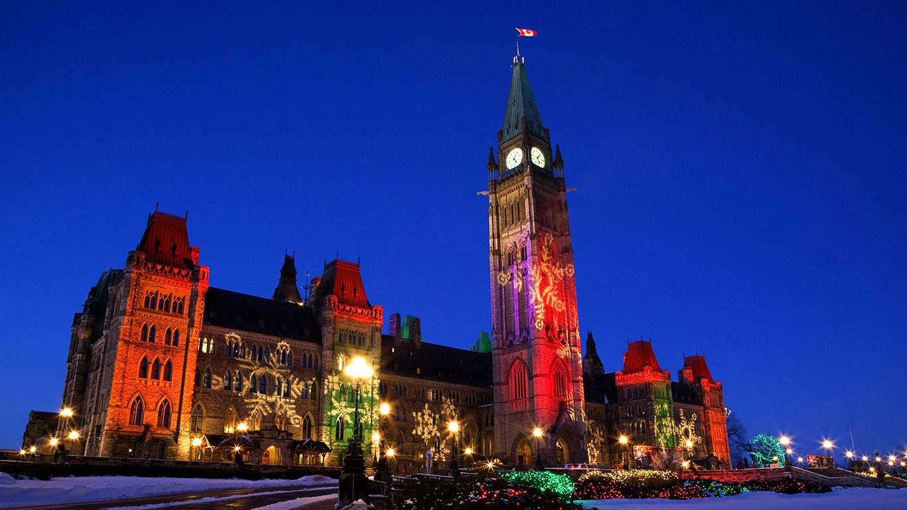

#### 20131222 Cladonia floerkeana lichen growth in Eifel, Germany (© Jean Claessens/Corbis)(Bing United Kingdom)

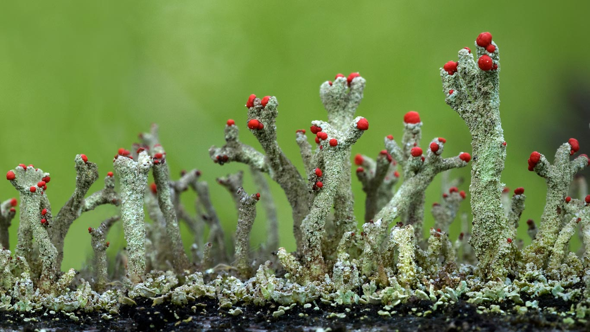

#### 20131221 Eurasian red squirrel, Scotland (© Jules Cox/Minden Pictures)(Bing United Kingdom)

#### 20131221 浙江桐乡乌镇，晾晒的染色丝绸 (© TAO Images Limited/Getty Images)(Bing China)

#### 20131220 Champs-Élysées, Paris, France (© tpgimages/Panorama Stock)(Bing United Kingdom)

#### 20131220 ｢コタン温泉｣北海道, 屈斜路湖 (© Datacraft/UIG)(Bing Japan)

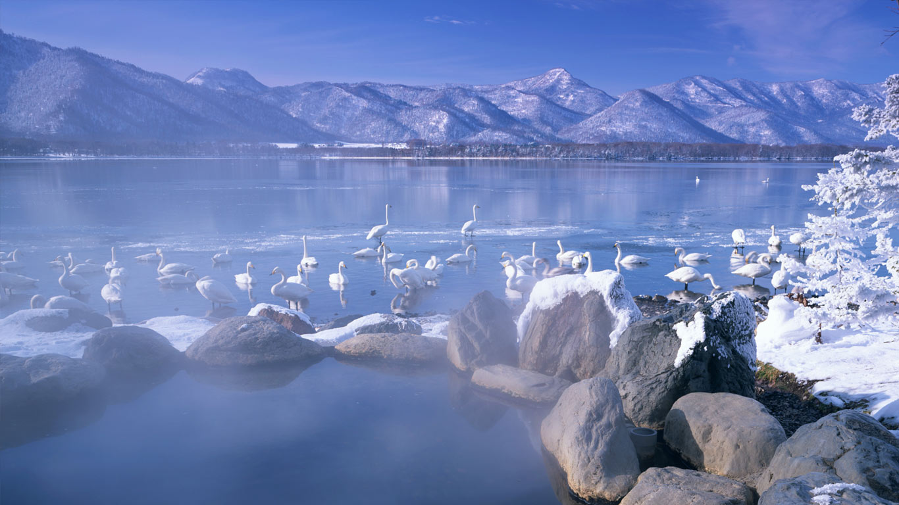

#### 20131219 Colorful lights around a magic stick in Blackpool (© Ian Moran/Getty Images)(Bing United Kingdom)

#### 20131219 Caves vinicoles Rocbère Terra Vinea à Portel-des-Corbières, Aude, Languedoc-Roussillon (© Don Johnston/Corbis)(Bing France)

#### 20131218 Snow on the Great Wall, Beijing, China (© Panorama Stock)(Bing United Kingdom)

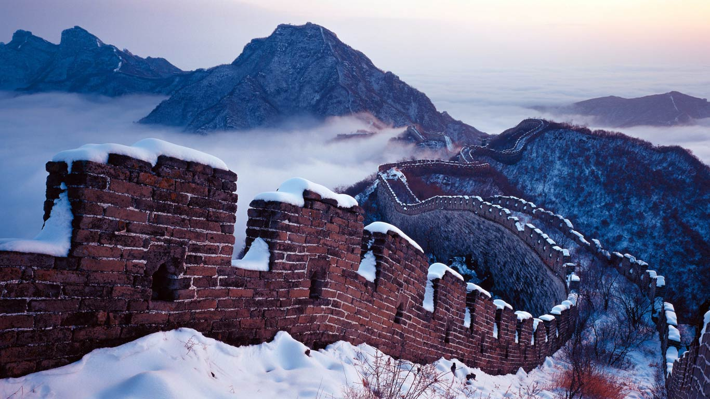

#### 20131217 Kenai Peninsula, Alaska, USA (© GeoStills/Alamy)(Bing United Kingdom)

#### 20131216 Winter Sheep in a V Formation in the Lake District (© Daniel Eitzen/Getty Images)(Bing United Kingdom)

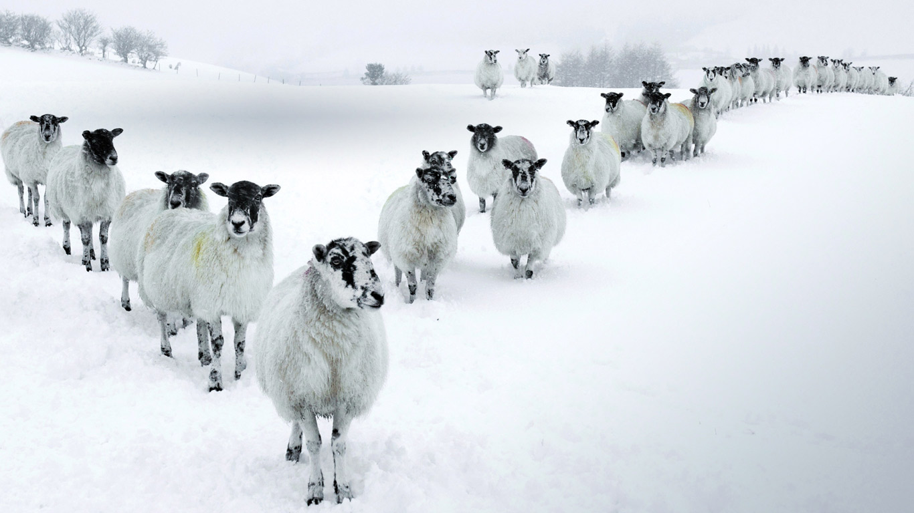

#### 20131216 Reindeer in the countryside near Karasjok, Finnmark, Norway (© GS/Gallery Stock)(Bing United States)

#### 20131216 Ice hotel near Quebec City, Ste-Catherine-de-la-Jacques-Cartier, Quebec (© Roderick Chen/All Canada Photos Inc./age fotostock)(Bing Canada)

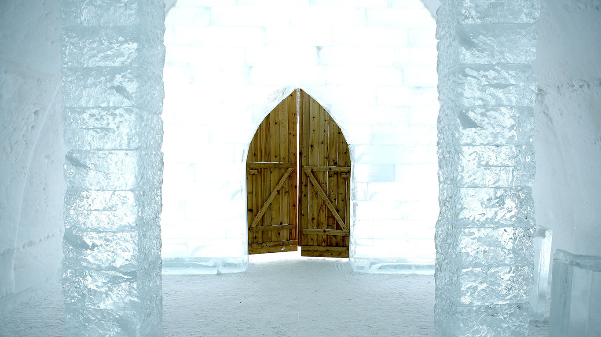

#### 20131215 Mural in Cape Town, illustrating anti-apartheid activist and former President of South Africa Nelson Mandela (© Frederic Soltan/Corbis)(Bing United Kingdom)

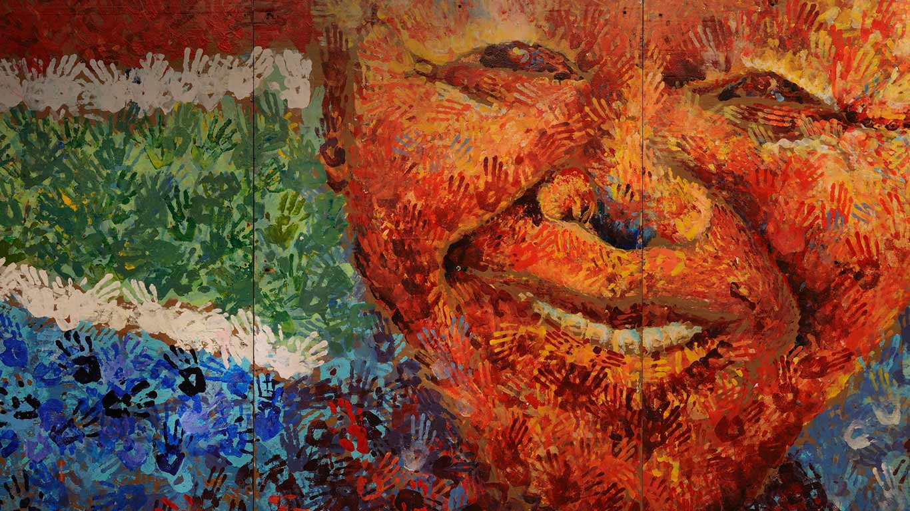

#### 20131214 Wörlitzer Park, Wörlitz, Germany (© Giovanni Simeone/SIME/4Corners)(Bing United Kingdom)

#### 20131214 长城 (© View Stock/Stock Connection/Aurora Photos)(Bing China)

#### 20131213 Middle spotted woodpecker and blue tit (© Naturfoto-Online/Alamy)(Bing United Kingdom)

#### 20131212 Poinsettia plants under cultivation in a greenhouse (© SGM/Stock Connection/Aurora Photos)(Bing United States)

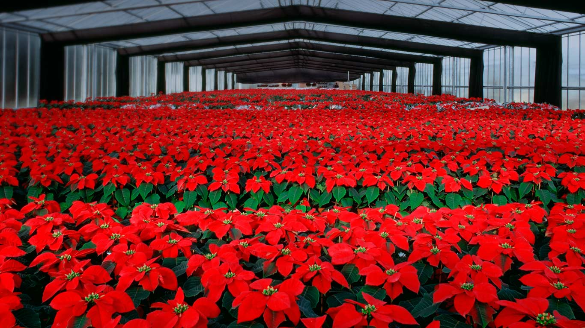

#### 20131212 Le Morne Brabant Mountain and islet, Mauritius (© Ocean/Corbis)(Bing United Kingdom)

#### 20131212 Ice on Abraham Lake at Kootenay Plains, Bighorn Wildlands, Alberta (© Wayne Simpson/All Canada Photos/SuperStock)(Bing Canada)

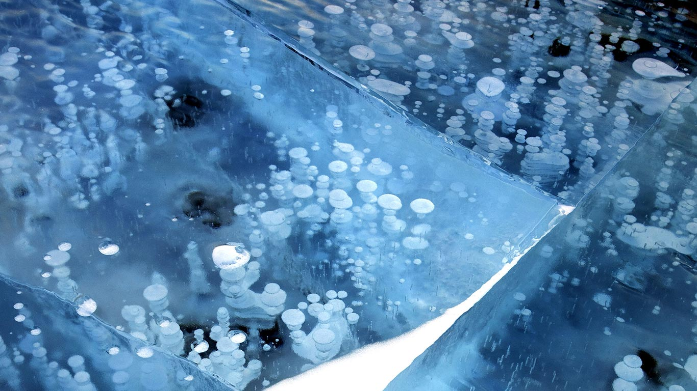

#### 20131211 ｢鶏頭場の池｣青森, 白神山地 (© Clover/SuperStock)(Bing Japan)

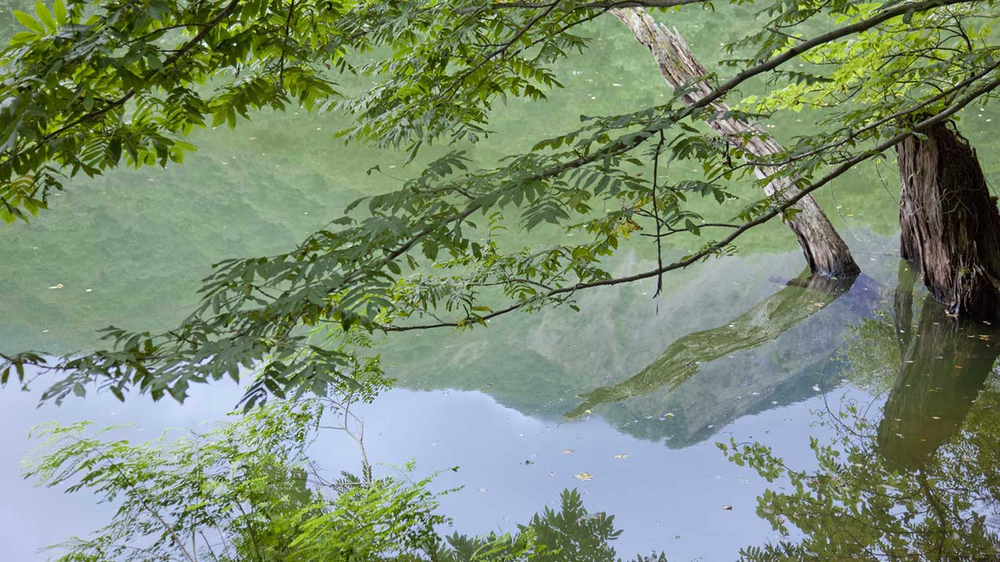

#### 20131211 Edinburgh Castle, Scotland (© Raul Belinchon/Gallery Stock)(Bing United Kingdom)

#### 20131210 Botany Bay road, Edisto Island, South Carolina, USA (© Michael Woloszynowicz/500px)(Bing United Kingdom)

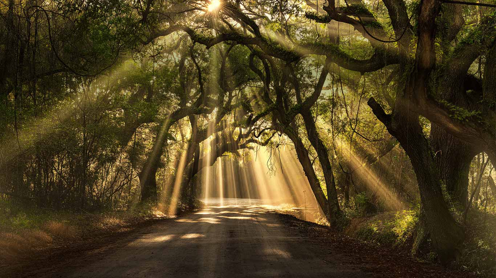

#### 20131210 ｢姫路城｣兵庫, 姫路 (© JTB Photo/SuperStock)(Bing Japan)

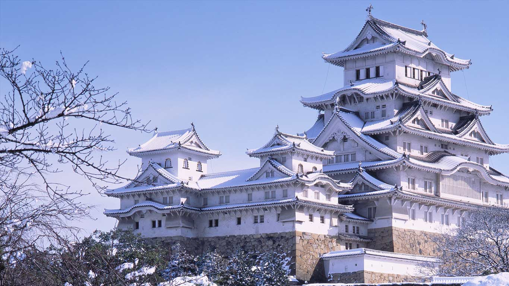

#### 20131210 Gros plan sur “Et Si?”, une installation de l’artiste Daniel Knipper, répétitions de la Fête des lumières à Lyon (© Robert Pratta/Corbis)(Bing France)

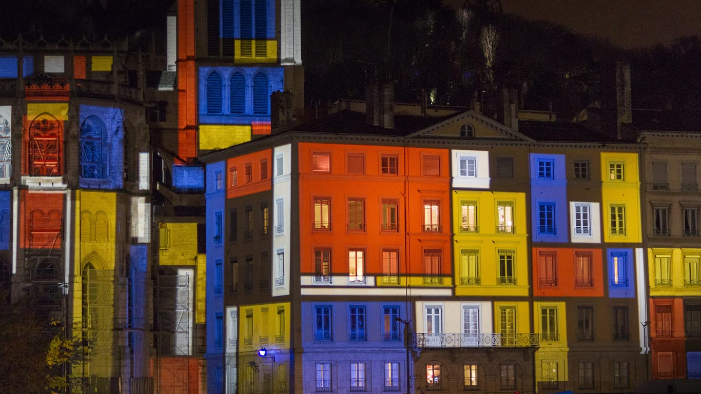

#### 20131210 秋天的早晨枫树旁，河边饮水的赤狐与倒影 (© Gaertner/Alamy)(Bing China)

#### 20131209 Charles Babbage (Father of the Computer) difference engine, Science Museum, London, United Kingdom (© Steven Vidler/Corbis)(Bing United States)

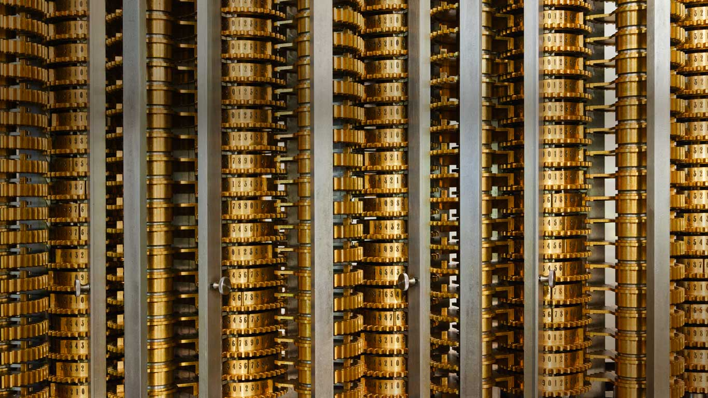

#### 20131209 Common redpoll in Greater Sudbury, Ontario, Canada (© Don Johnston/Corbis)(Bing United Kingdom)

#### 20131209 黑龙江省哈尔滨市，雨后圣索菲亚大教堂的倒影 (© Wiliam Perry/Alamy)(Bing China)

#### 20131208 Lechwes running in the Okavango Delta floodplain in Botswana (© Sergey Gorshkov/Minden Pictures)(Bing United Kingdom)

#### 20131207 A billabong in Wooleen Station, Western Australia (© Davide Scagliola/Aurora Photos)(Bing United Kingdom)

#### 20131207 冬季的天鹅 (© Wanted Collection/Shotshop GmbH/Alamy)(Bing China)

#### 20131207 Marines and sailors aboard the USS Pearl Harbor dock landing ship during the 2011 ceremony commemorating the 70th anniversary of the attack on Pearl Harbor (© Super Nova Images/Alamy)(Bing United States)

#### 20131206 Santa Claus souvenir, Myra, Lycia, Turkey (© Kreder Katja/age fotostock)(Bing United Kingdom)

#### 20131206 ｢夜の白川郷｣岐阜 (© Top Photo Group RF/age fotostock)(Bing Japan)

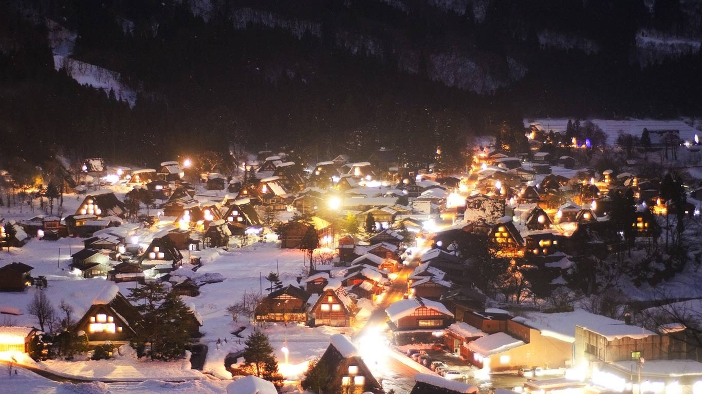

#### 20131205 Vue extérieure du musée du Louvre-Lens imaginé par l’agence SANAA, Lens, Pas-de-Calais (© Michael Jacobs/Corbis)(Bing France)

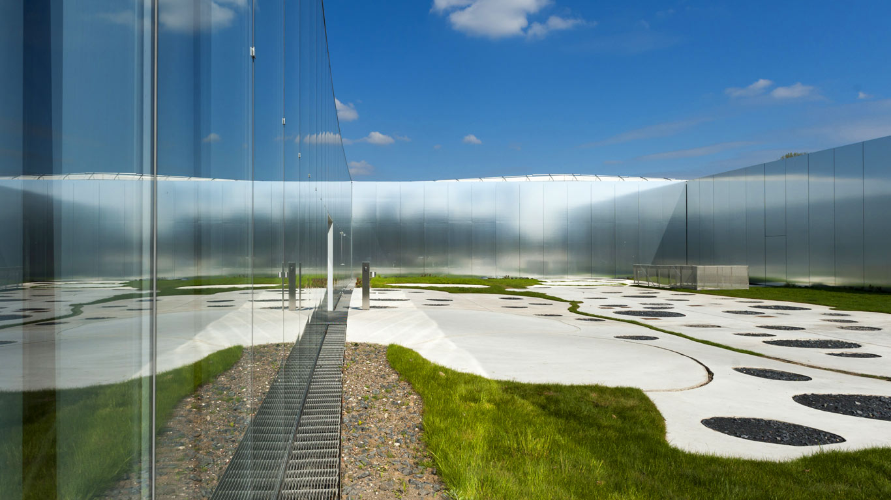

#### 20131205 海獭 (© Cameron Rutt/Flickr/Getty Images)(Bing China)

#### 20131205 Light microscopy of Volvox colonies (© Corbis Motion)(Bing United Kingdom)

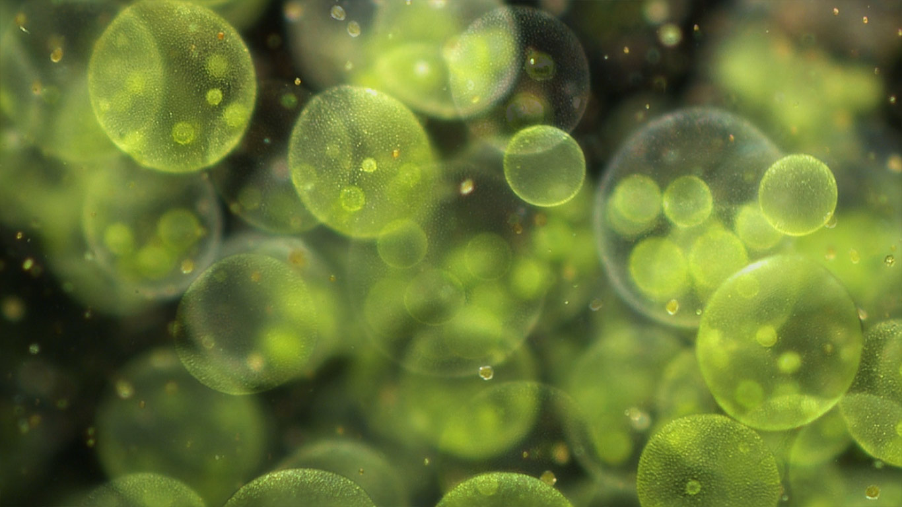

#### 20131204 Christmas tree at Rockefeller Center, New York City, New York (© age fotostock/SuperStock)(Bing United States)

#### 20131204 Golden larches and Prusik Peak reflected in Troll Sink Tarn, Upper Enchantments, Alpine Lakes Wilderness, Washington, USA (© Karen Crowe/Corbis)(Bing United Kingdom)

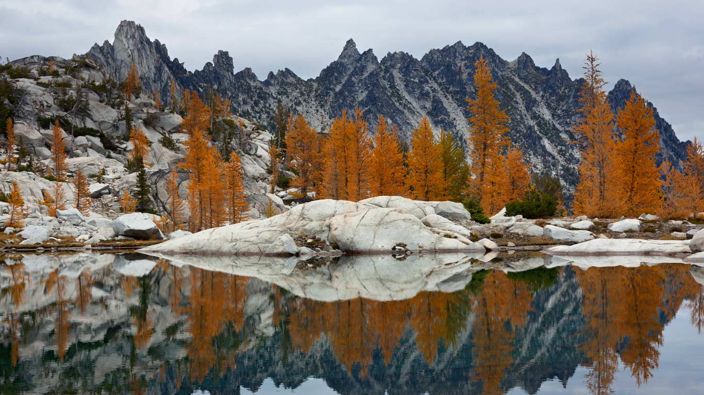

#### 20131203 Emperor penguin chicks on Snow Hill Island, Antarctica (© Paul Souders/Corbis)(Bing United Kingdom)

#### 20131202 A view from Bear's Hump in Waterton Lakes National Park, Alberta, Canada (© Walter Hsiao)(Bing United Kingdom)

#### 20131202 秋日中还未凋零的美丽红枫 (© age fotostock/Superstock)(Bing China)

#### 20131202 ｢秩父夜祭｣埼玉, 秩父 (© JTB Media Creation, Inc./Alamy)(Bing Japan)

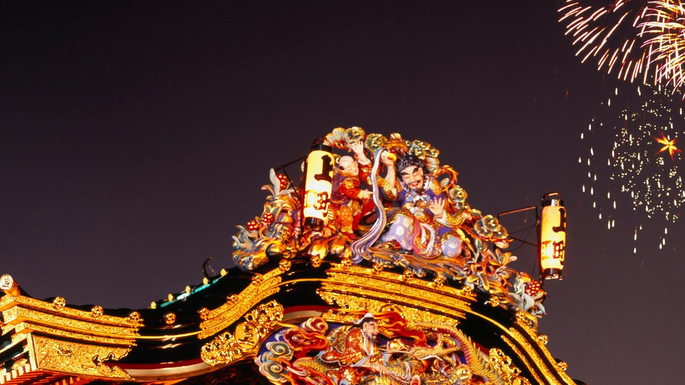

#### 20131201 Luxury stores reflected in the Christmas window display of the Fenwick's, London (© Simon Dawson/Bloomberg via Getty Images)(Bing United Kingdom)

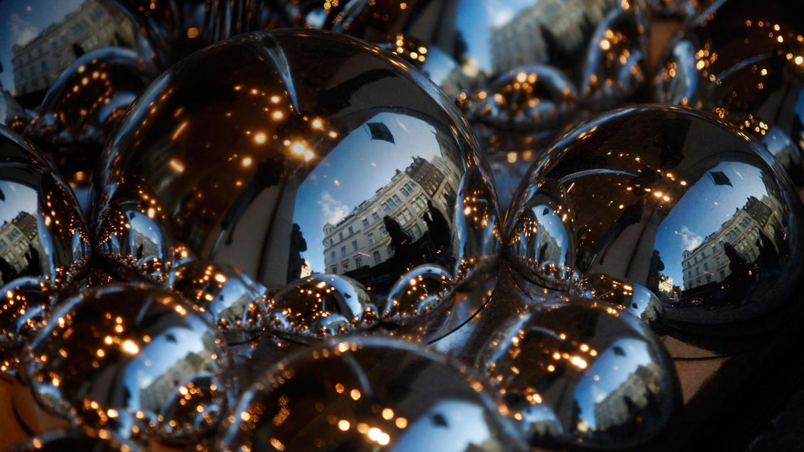

#### 20131201 中国戏剧演出 (© AFP Creative/Getty Images)(Bing China)

