#### 20140131 Fireworks in Victoria Harbour during the Chinese new year, Hong Kong, China (© Fumio Okada/age fotostock)(Bing United Kingdom)

#### 20140131 2013年上海老城隍庙民俗彩灯会，民间传说中的财神 (© Feng Wei Photography/Flickr Open/Getty Images)(Bing China)

#### 20140130 Antiquarium in der Münchner Residenz, München, Bayern, Deutschland (© Alfeld/4Corners)(Bing Deutschland)

#### 20140130 传统蒸笼内的自制饺子 (© Martí sans/Alamy)(Bing China)

#### 20140130 Lynx in Bavarian forest, Germany (© Framepool)(Bing United Kingdom)

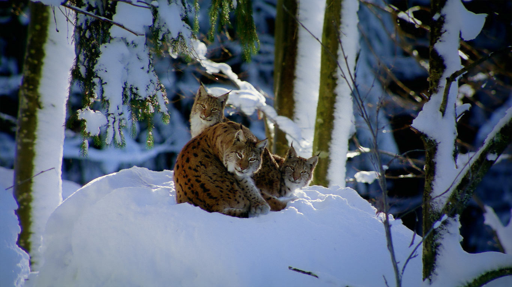

#### 20140129 Longsheng rice terraces, Guangxi, China (© Redlink/Corbis)(Bing United Kingdom)

#### 20140128 Long-tailed widowbird male in breeding plumage, Marievale Bird Sanctuary, South Africa (© Richard Du Toit/Corbis)(Bing United Kingdom)

#### 20140128 ｢桂浜｣高知, 浦戸 (© Michael S. Yamashita/Corbis)(Bing Japan)

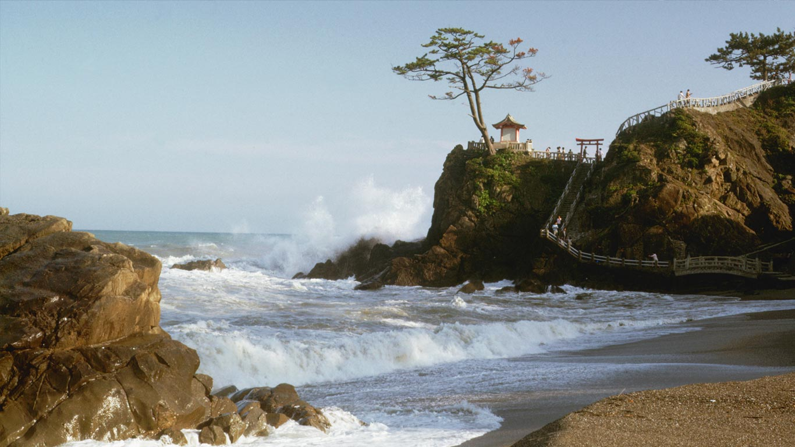

#### 20140128 Cavern Cascade, Watkins Glen State Park, New York (© A.D. Wheeler/500px)(Bing United States)

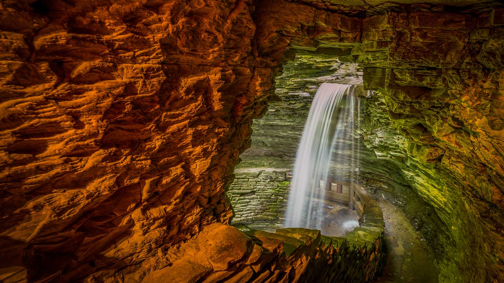

#### 20140127 Frozen Toronto harbour in evening with chunks (© Peter Bowers/Flickr/Getty Images)(Bing Canada)

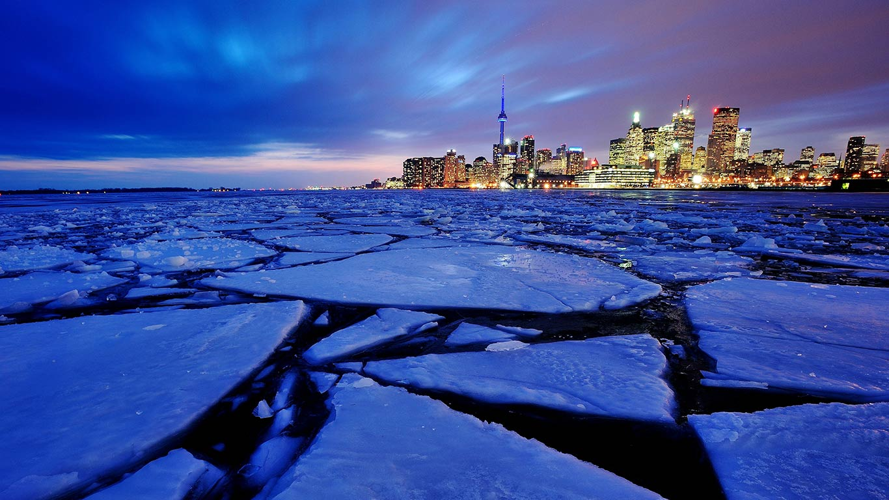

#### 20140127 Sun rising over Skiddaw Mountain and Derwentwater in Cumbria, England (© Graeme Campbell Photography/Getty Images)(Bing United Kingdom)

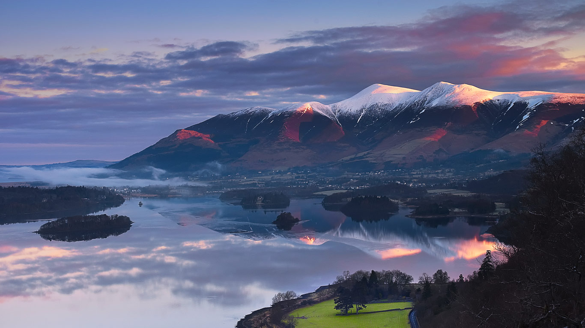

#### 20140127 2012年伦敦可口可乐节奏空间，建筑师：Asif Khan & Pernilla Ohrstedt (© Hufton and Crow/VIEW/Corbis)(Bing China)

#### 20140126 A red kangaroo in the Sturt Stony Desert, Australia (© Jami Tarris/Corbis)(Bing United Kingdom)

#### 20140126 Fossil studded sandstone on Maria Island, Tasmania, Australia (© Chris Klep/Getty Images)(Bing Australia)

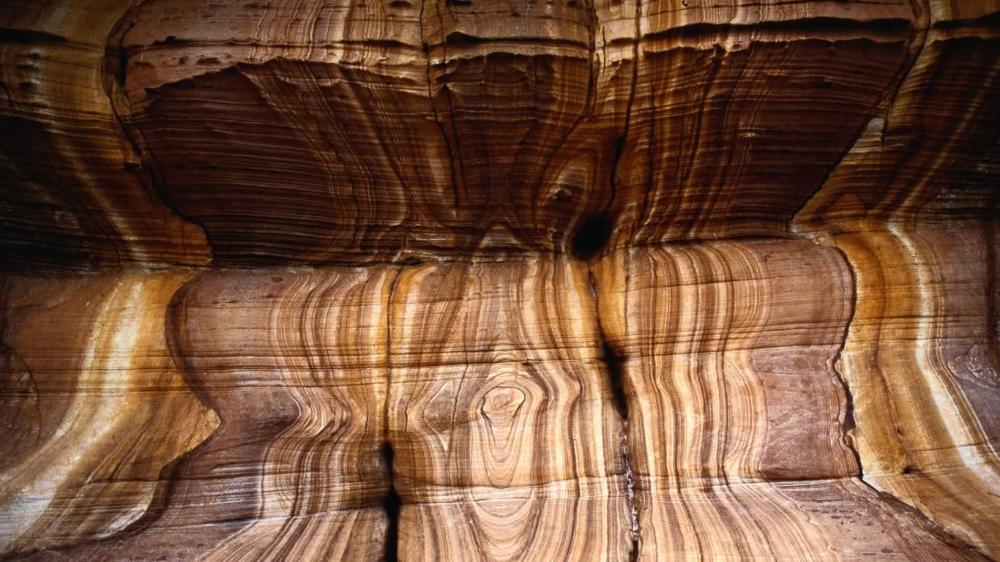

#### 20140125 Ice on Lake Grimsel, Switzerland (© Gozooma/Gallery Stock)(Bing United Kingdom)

#### 20140124 ｢支笏湖氷濤まつり｣北海道,千歳市 (© JTB PHOTO COMMUNICATI/JTB Photo/SuperStock)(Bing Japan)

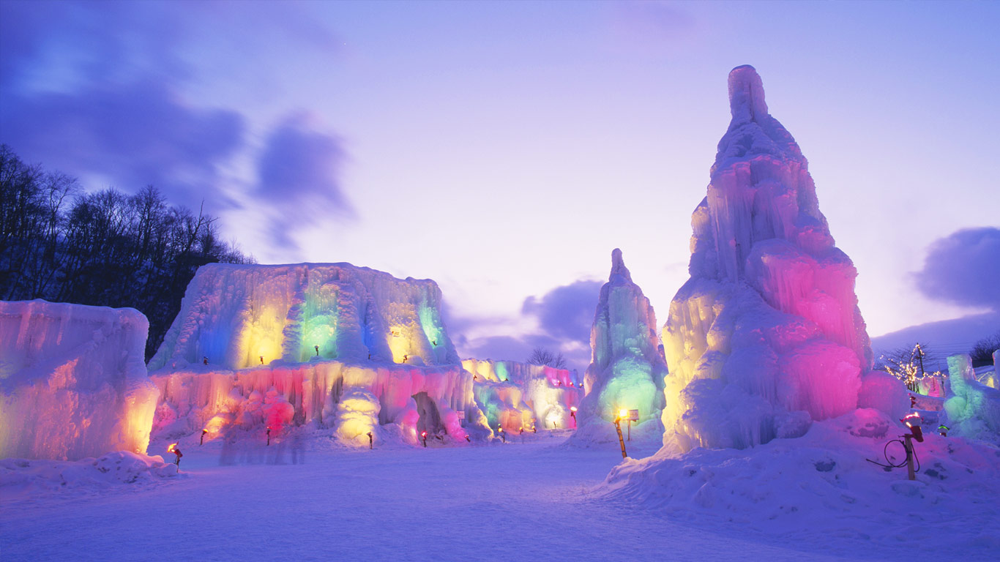

#### 20140124 Painted Hills in John Day Fossil Beds National Monument, Oregon (© Anand Hegde)(Bing United States)

#### 20140124 Chamois (Rupicapra pyrenaica), National Park of Pyrenees, France (© Preau Louis-Marie/Hemis/Corbis)(Bing United Kingdom)

#### 20140123 Kastellorizo Island, Greece (© Hercules Milas/Alamy)(Bing United Kingdom)

#### 20140123 挂满红灯笼的中国寺庙 (© CollinsChin/E+/Getty Images)(Bing China)

#### 20140122 Northern Lights over Yellowknife, Northwest Territories, Canada (© Getty Images)(Bing United Kingdom)

#### 20140121 Musée d’Orsay, Paris (© Arnaud Chicurel/Corbis)(Bing France)

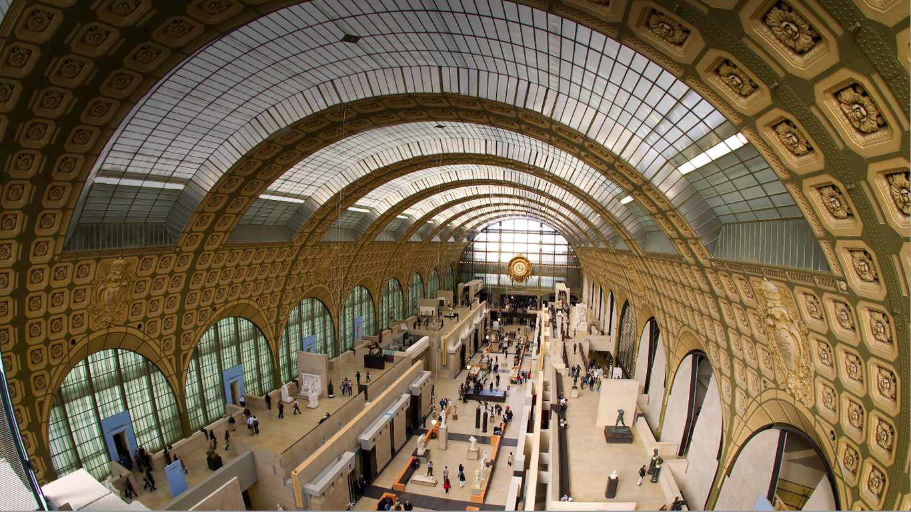

#### 20140121 Magnification of a coiled proboscis of a moth (© Steve Gschmeissner/Corbis)(Bing United Kingdom)

#### 20140121 Blick auf historische Salzspeicher und Holstentor in Lübeck, Schleswig-Holstein, Deutschland (© Günter Gräfenhain/4Corners)(Bing Deutschland)

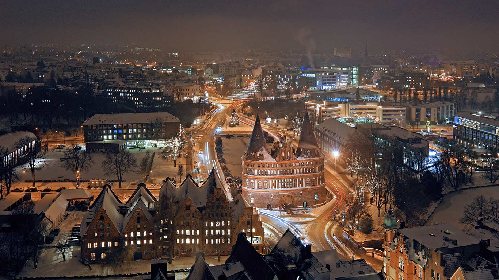

#### 20140120 Dry stone walls and stone barn at Littondale, Yorkshire Dales, North Yorkshire, England (© David Speight/Alamy)(Bing United Kingdom)

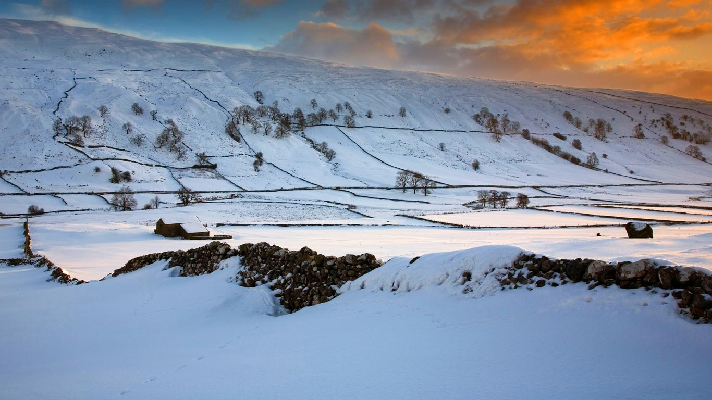

#### 20140120 Totems of Thunderbird Park in winter, Victoria, Vancouver Island, British Columbia (© Trevor Bonderud/All Canada Photos/age fotostock)(Bing Canada)

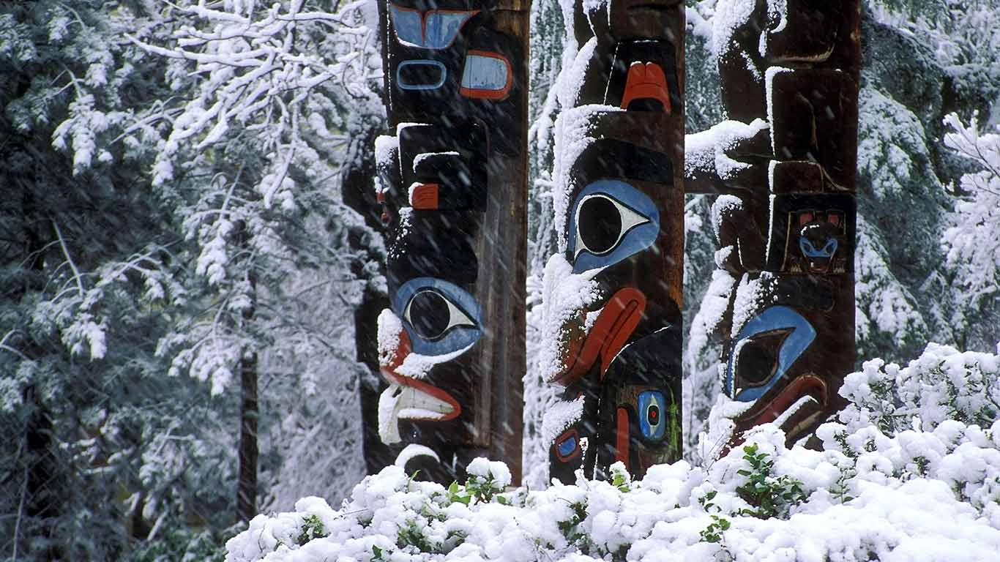

#### 20140120 穆里，雪中坐在石头上的猴子 (© Nadeem Khawar/Getty Images)(Bing China)

#### 20140120 ｢西湖の樹氷｣山梨,富士河口湖町 (© Michael Runkel/Robert Harding Picture Library/age fotostock)(Bing Japan)

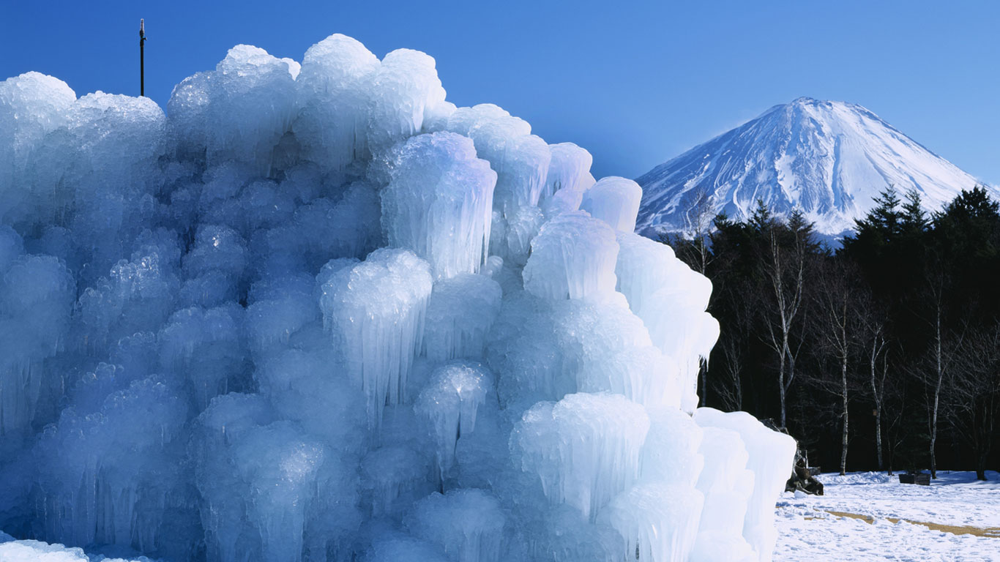

#### 20140120 Plaque, National Civil Rights Museum at the Lorraine Motel in Memphis, Tennessee (© Jerry Holt/Alamy)(Bing United States)

#### 20140119 Saint Louis River, Minnesota, USA (© Richard Hamilton Smith/Gallery Stock)(Bing United Kingdom)

#### 20140118 White terns on Sand Island, Midway Atoll, Papahānaumokuākea Marine National Monument, USA (© Tony Ernst)(Bing United Kingdom)

#### 20140117 Marmora Mines near Marmora, Ontario, Canada (© Pat Trudeau/500px)(Bing United Kingdom)

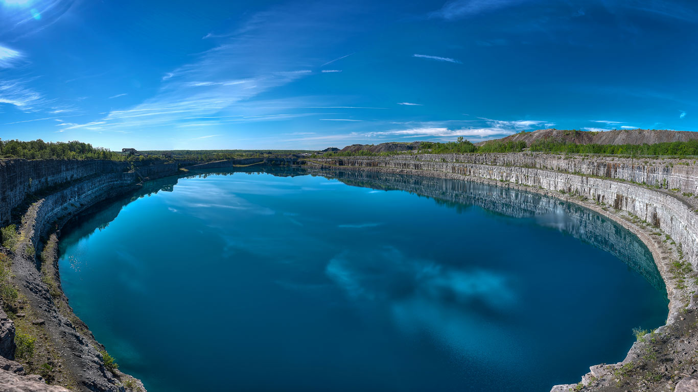

#### 20140116 Icy creek in Bavarian Forest National Park, Germany (© Bernadette Schoeller/Getty Images)(Bing United Kingdom)

#### 20140116 Loire gelée à Saumur, Maine-et-Loire, Pays-de-la-Loire (© Jean-Baptiste Rabouan/Corbis)(Bing France)

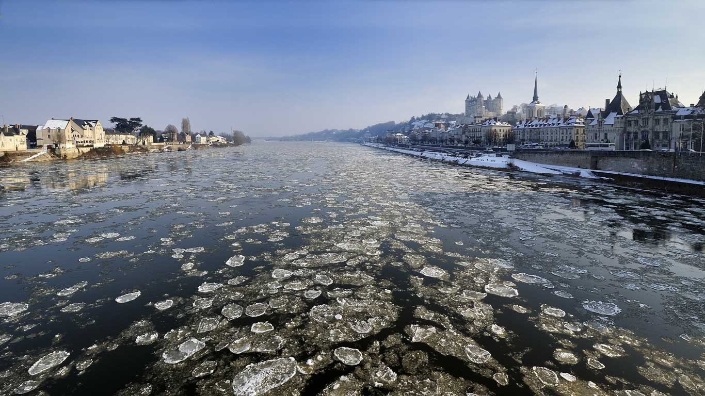

#### 20140115 ｢軍艦島｣長崎 (© Michael Runkel/Robert Harding Picture Library/age fotostock)(Bing Japan)

#### 20140115 Squeaking silk moth, Qinling Mountains, Shaanxi, China (© Thomas Marent/Minden Pictures)(Bing United Kingdom)

#### 20140115 Buchen und Erlen im Nationalpark Jasmund, Insel Rügen, Mecklenburg-Vorpommern, Deutschland (© Outdoor-Archiv/Alamy)(Bing Deutschland)

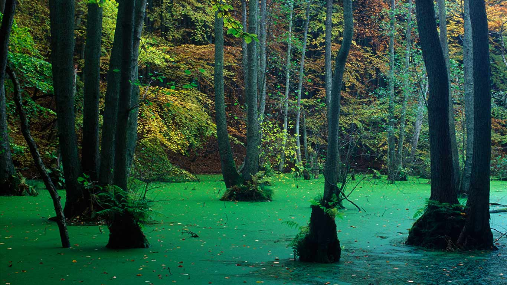

#### 20140115 The famous flowerpots, eroded limestone formations, located on the shoreline of Flowerpot Island, Georgian Bay, in Fathom Five National Marine Park, Ontario (© Ethan Meleg/All Canada Photos/Getty Images)(Bing Canada)

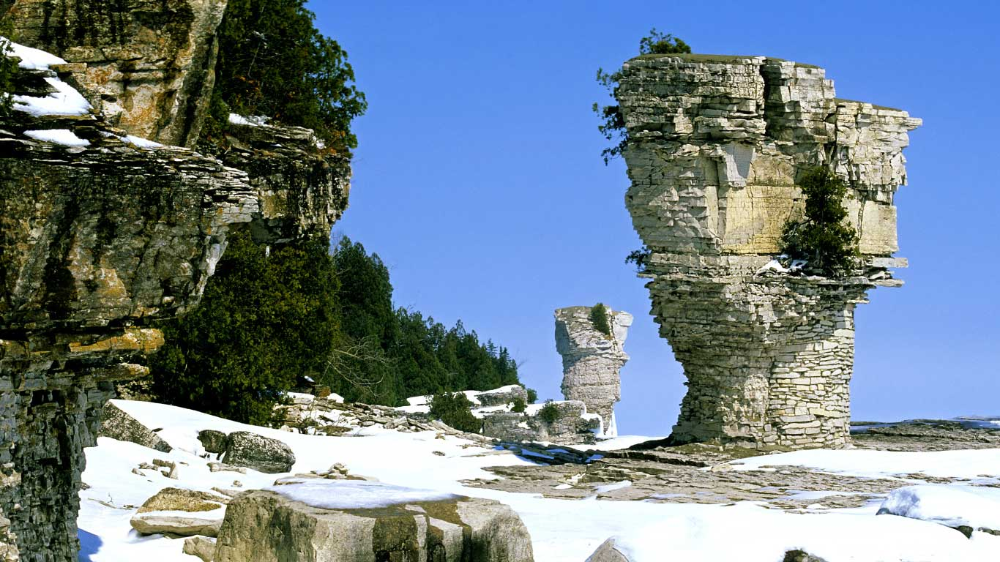

#### 20140115 荷花 (© View Stock/Getty Images)(Bing China)

#### 20140114 春景中柔美的蒲公英微距拍摄 (© Anna Omelchenko/Alamy)(Bing China)

#### 20140114 Hammam bath house beneath the Hassan II Mosque, Casablanca, Morocco (© roevin/Flickr/Getty Images)(Bing United Kingdom)

#### 20140113 雨中的百合 (© FogStock/Alamy)(Bing China)

#### 20140113 Beni Isguen, Ghardaia, Algeria (© George Steinmetz/Corbis)(Bing United Kingdom)

#### 20140112 Two Grey herons (Ardea cinerea) squabbling over fish, River Tame, Stockport, Greater Manchester (© Terry Whittaker/Corbis)(Bing United Kingdom)

#### 20140112 Short-eared owl, Samish Island, Washington (© Bryan Matthew)(Bing United States)

#### 20140111 Pool at sunrise in Coogee, outside Sydney, New South Wales, Australia (© Max Valente/Getty Images)(Bing United Kingdom)

#### 20140110 American bison wintering at Fountain Flats, Yellowstone National Park, Wyoming, USA (© Jeff Vanuga/Corbis)(Bing United Kingdom)

#### 20140110 Downtown Vancouver fisheye perspective of a beautiful sunset (© Douglas Knisely/Flickr/Getty Images)(Bing Canada)

#### 20140109 Historischer Weinkeller, Schloss Johannisberg, Rheingau, Hessen, Deutschland (© Sabine Lubenow/JAI/Corbis)(Bing Deutschland)

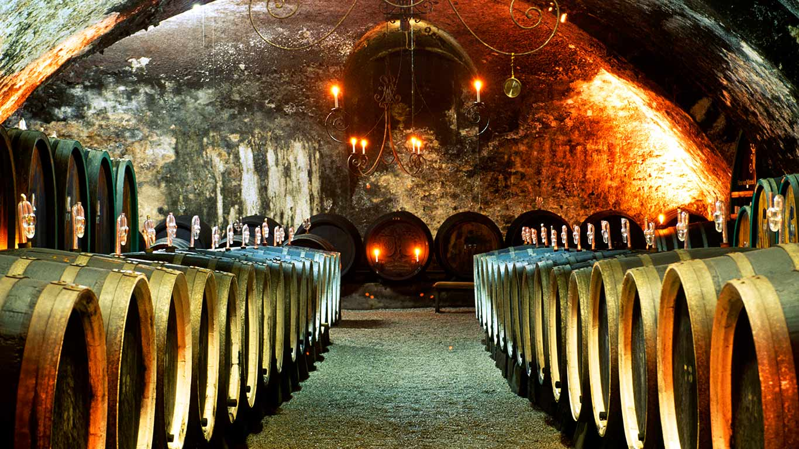

#### 20140109 St Michael's Mount, off the coast of Marazion, Cornwall, England (© David Gristwood)(Bing United Kingdom)

#### 20140108 Entrance foyer inside the Ice Hotel in Kiruna, Sweden (© David Clapp/Getty Images)(Bing United Kingdom)

#### 20140107 Randonnée à dos de camélidés dans le désert du Thar, Rajasthan, Inde (© Robert Churchill/Getty Images)(Bing France)

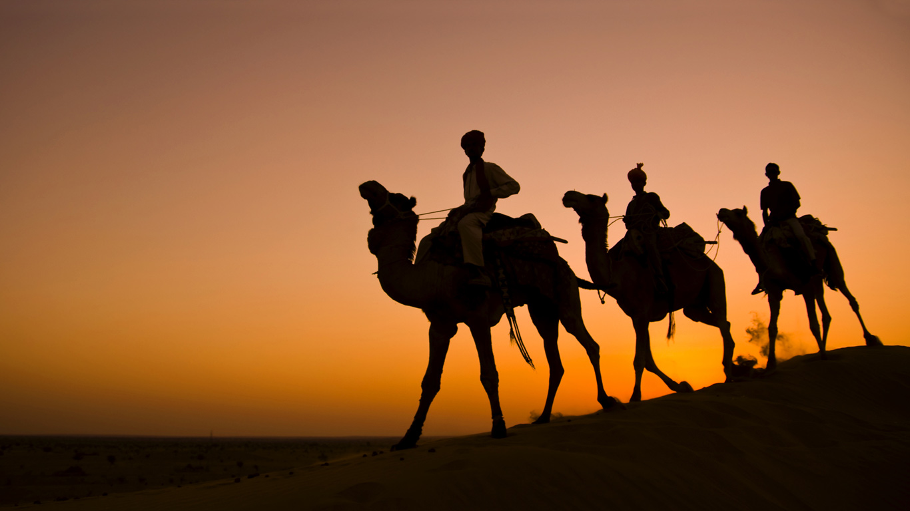

#### 20140107 Cabarete, Dominican Republic (© Getty Images)(Bing United Kingdom)

#### 20140106 Fort Worth Water Gardens, Fort Worth, Texas, USA (© Jeremy Woodhouse/Corbis)(Bing United Kingdom)

#### 20140105 Yellow-throated marten (© D. Sheldon/Corbis)(Bing United Kingdom)

#### 20140105 北京市清华大学，水木清华荷花池 (© Yu Cui)(Bing China)

#### 20140104 Immature sunflower (© Marion Faria/500px)(Bing United Kingdom)

#### 20140103 Wind Cave National Park, Black Hills, South Dakota (© Blaine Harrington III/Corbis)(Bing United States)

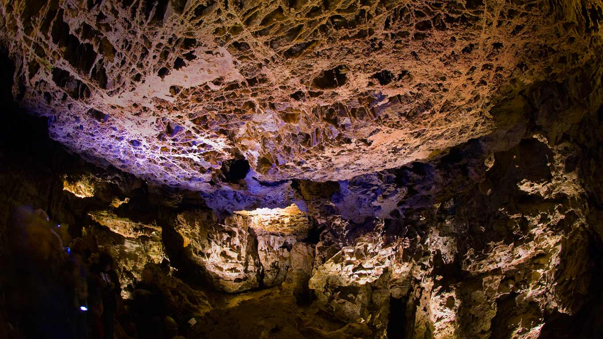

#### 20140103 Observatoire astronomique du Pic du Midi de Bigorre, Hautes-Pyrénées, Midi-Pyrénées (© Christophe Lehenaff/Corbis)(Bing France)

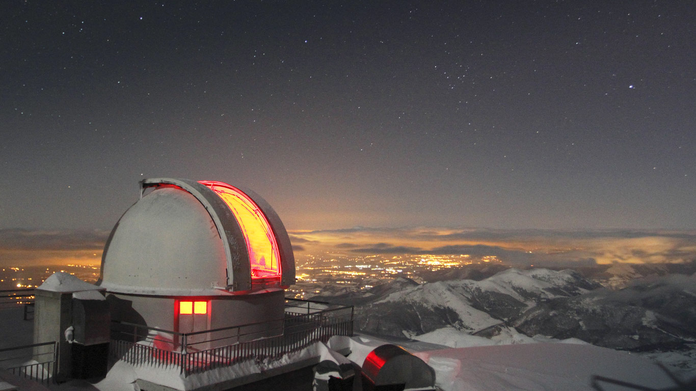

#### 20140103 Aurora hunter,  Isle of Lewis, Scotland (© Colin Cameron - Photography/Getty Images)(Bing United Kingdom)

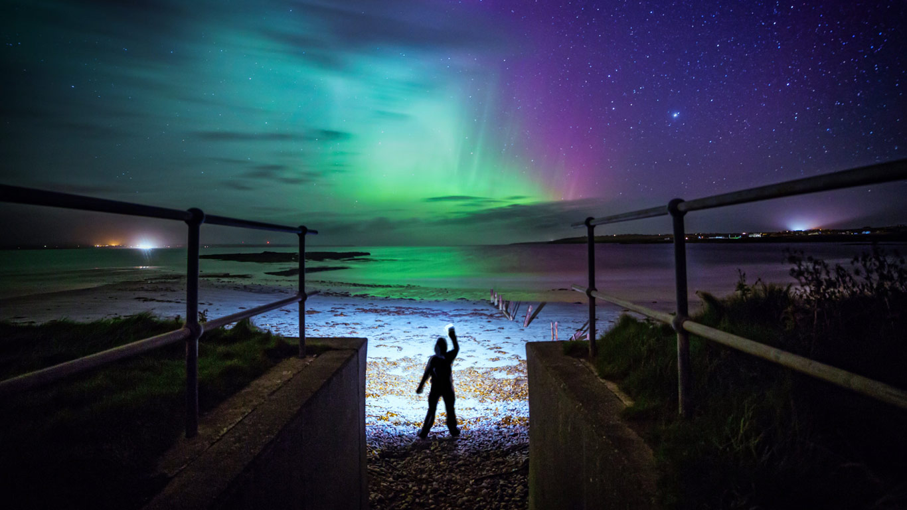

#### 20140103 ｢ばんえい馬｣北海道 (© Patrick Robert/Sygma/Corbis)(Bing Japan)

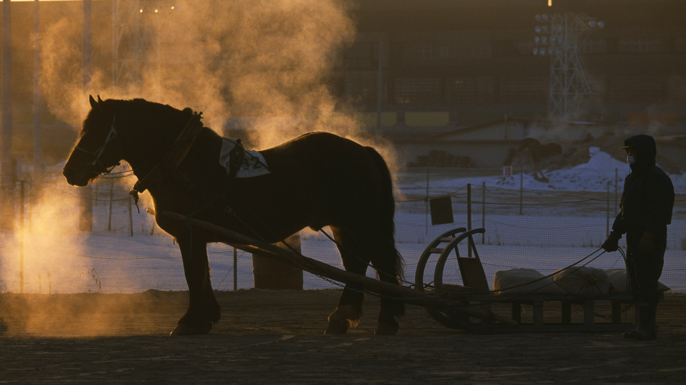

#### 20140102 西塘夜色 (© shenxy/Flickr/Getty Images)(Bing China)

#### 20140102 ｢水引飾り｣ (© Datacraft/age fotostock)(Bing Japan)

#### 20140102 Rhaetian railway passing through Langwieser Viaduct bridge, Switzerland (© Werner Dieterich/Corbis)(Bing United Kingdom)

#### 20140102 Neujahrsspringen der Vierschanzentournee in Garmisch-Partenkirchen, Bayern, Deutschland (© Rolf Kosecki/Corbis)(Bing Deutschland)

#### 20140101 Giant panda cub (Ailuropoda melanoleuca), Wolong National Nature Reserve in Sichuan Province, China (© Keren Su/Corbis)(Bing United Kingdom)

#### 20140101 绚烂的烟花绽放在澳门的海湾上空 (© coolbiere photograph/Flickr/Getty Images)(Bing China)

#### 20140101 ｢厳島神社の日の出｣広島, 宮島 (© Rita Ariyoshi/Panorama Stock)(Bing Japan)

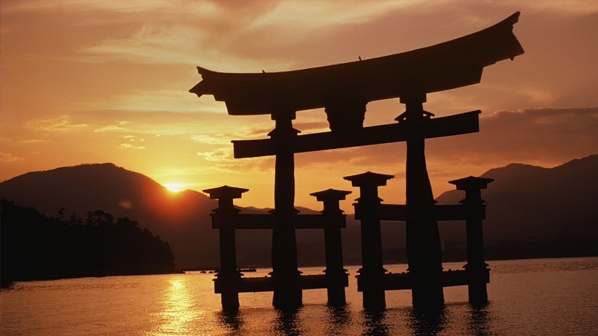

