#### 20140228 Horsetail Fall at sunset seen from Taft Point, Yosemite National Park, California, USA (© Josh Miller/Aurora Photos)(Bing United Kingdom)

#### 20140227 Foliage, including cottonwoods, willows, sage, and rabbitbrush, in California's Owens Valley (© Marc Adamus/Aurora Photos)(Bing United States)

#### 20140227 Parlement européen à Strasbourg, Bas-Rhin, Alsace (© Matthieu Colin/hemis.fr/Alamy)(Bing France)

#### 20140227 Wild dogs in Botswana (© Getty Images)(Bing United Kingdom)

#### 20140226 长野县落叶松林的上空 (© SHOSEI/Aflo/Getty Images)(Bing China)

#### 20140226 Weather station on Brocken peak, Saxony-Anhalt, Germany (© Günter Gräfenhain/Huber/4Corners)(Bing United Kingdom)

#### 20140225 ｢フィギュア女子フリー・浅田真央｣ソチ冬季五輪, アイスバーグ・スケート・パレス (© Matthew Stockman/Getty Images)(Bing Japan)

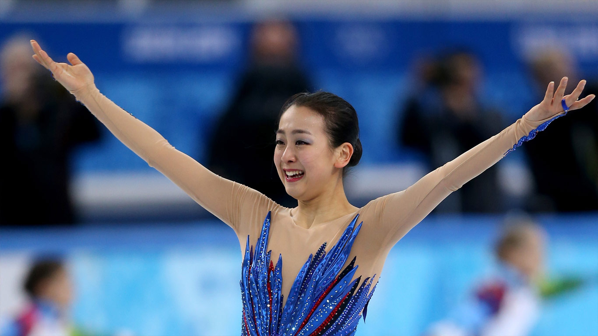

#### 20140225 Lucky Bay, Cape Le Grand National Park, Australia (© Ocean/Corbis)(Bing United Kingdom)

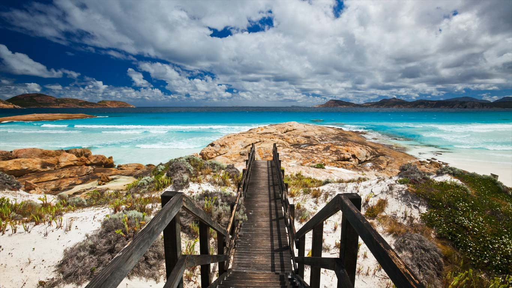

#### 20140224 南澳富琳德斯国家公园，大赤袋鼠与它的孩子 (© Peter Walton Photography/Photolibrary/Getty Images)(Bing China)

#### 20140224 Lightning storm over Grand Canyon National Park, Arizona, USA (© Scott Stulberg/Corbis)(Bing United Kingdom)

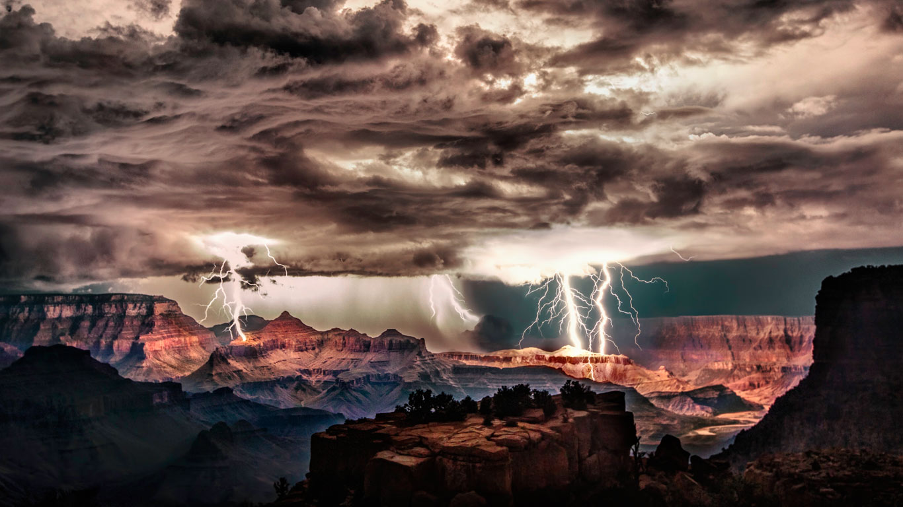

#### 20140223 Gold (© Jim Zuckerman/Corbis)(Bing Deutschland)

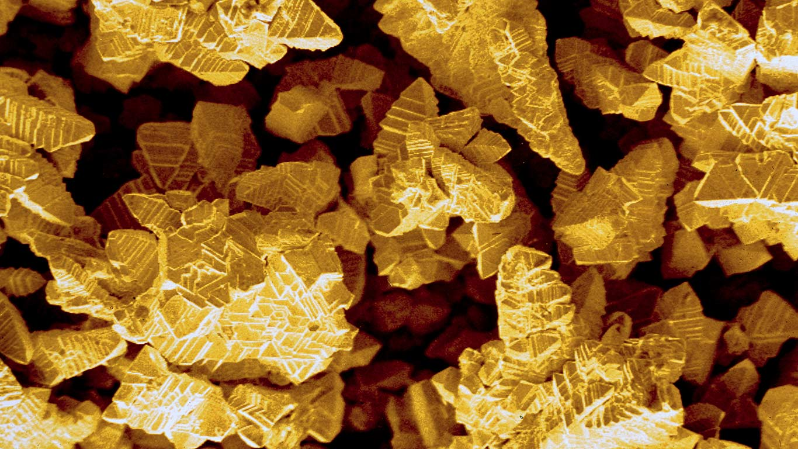

#### 20140223 Caucasus Mountains near Sochi, Russia (© David Trood/Getty Images)(Bing United Kingdom)

#### 20140222 俄罗斯索契冬奥会第8天2014年2月15日，周洋(左)短道速滑女子1500米项目夺冠后激动地抱着李坚柔 (© Xinhua/Wang Haofei/Corbis)(Bing China)

#### 20140222 St. Moritz mit St. Moritzersee, Oberengadin, Kanton Graubünden, Schweiz (© Huber/Sime/eStock Photo)(Bing Deutschland)

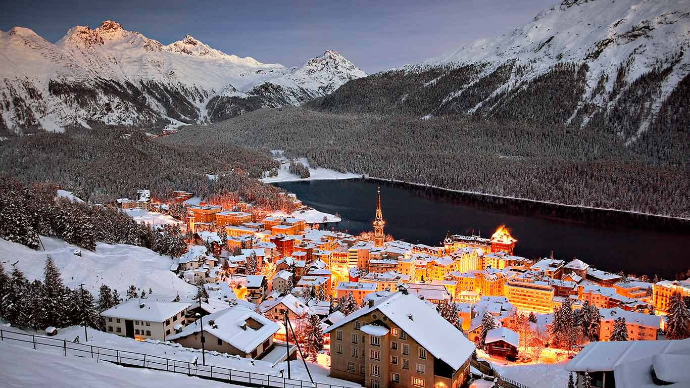

#### 20140222 J.-F. Chapuis, Arnaud Bovolenta, Jonathan Midol et Brady Leman (Canada) lors de la finale du Ski Cross au Rosa Khutor Extreme Park, 20 février 2014, Jeux Olympiques de Sotchi, Russie (© Julian Finney/Getty Images)(Bing France)

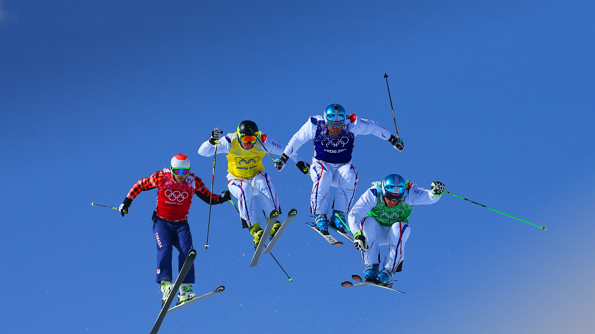

#### 20140222 Backcountry skier near Mt. Baker Ski Area, North Cascades National Park, Washington, USA (© Jay Goodrich/Tandem Stock)(Bing United Kingdom)

#### 20140221 俄罗斯索契冬奥会第6天2014年2月13日，速度滑冰女子1000米项目金牌得主张虹 (© Quinn Rooney/Getty Images)(Bing China)

#### 20140221 Gold medalist Natalie Spooner #24 of Canada celebrates during the medal ceremony after defeating the the United States 3-2 in overtime during the Ice Hockey Women's Gold Medal Game on day 13 of the Sochi 2014 Winter Olympics at Bolshoy Ice Dome on February 20, 2014 in Sochi, Russia.(© Martin Rose/Getty Images)(Bing Canada)

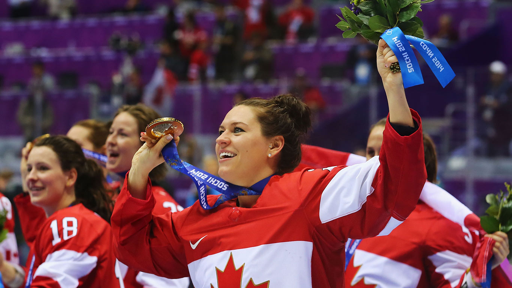

#### 20140221 Eve Muirhead of Great Britain looks on during the Bronze medal match between Switzerland and Great Britain on day 13 of the Sochi 2014 Winter Olympics at Ice Cube Curling Center on February 20, 2014 in Sochi, Russia (© Clive Mason/Getty Images)(Bing United Kingdom)

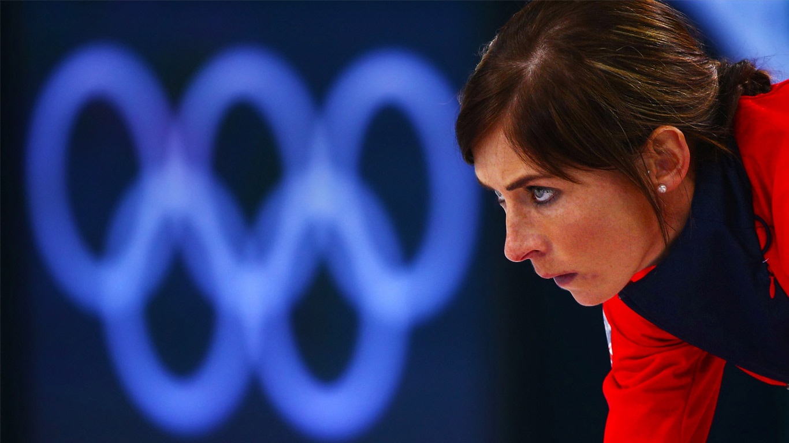

#### 20140221 Chutes du Carbet dans le parc national de Guadeloupe (© Andreas M. Gross/Westend61/Corbis)(Bing France)

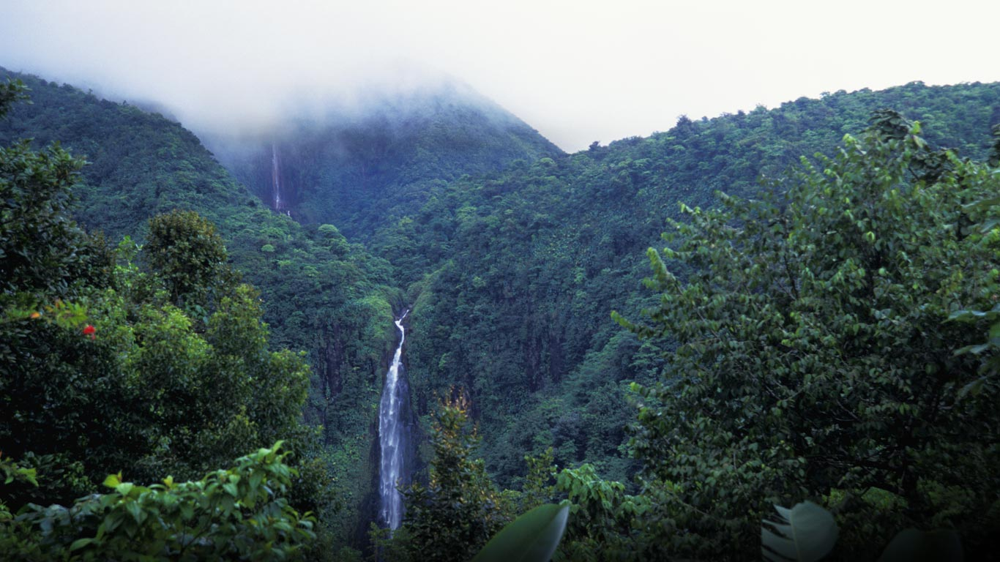

#### 20140220 俄罗斯索契冬奥会第3天2014年2月10日，男子短道速滑1500米项目竞赛中的韩天宇 (© Streeter Lecka/Getty Images)(Bing China)

#### 20140220 Pierre Vaultier, vainqueur de l’épreuve de Snowboard Cross, 18 février 2014, Jeux Olympiques de Sotchi, Russie (© Jussi Nukari/REX)(Bing France)

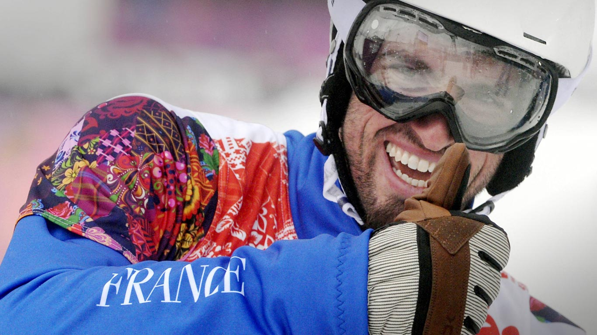

#### 20140220 Ted Ligety of the United States reacts during the Alpine Skiing Men's Giant Slalom at the Sochi 2014 Winter Olympics on February 19, 2014, in Krasnaya Polyana, Russia. (© Doug Pensinger/Getty Images)(Bing United States)

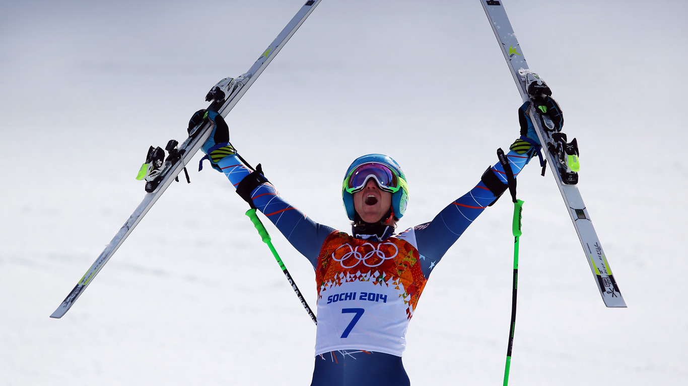

#### 20140220 Kaillie Humphries (R) and Heather Moyse of Canada team 1 celebrate during the flower ceremony after winning the gold medal  (© Alex Livesey/Getty Images)(Bing Canada)

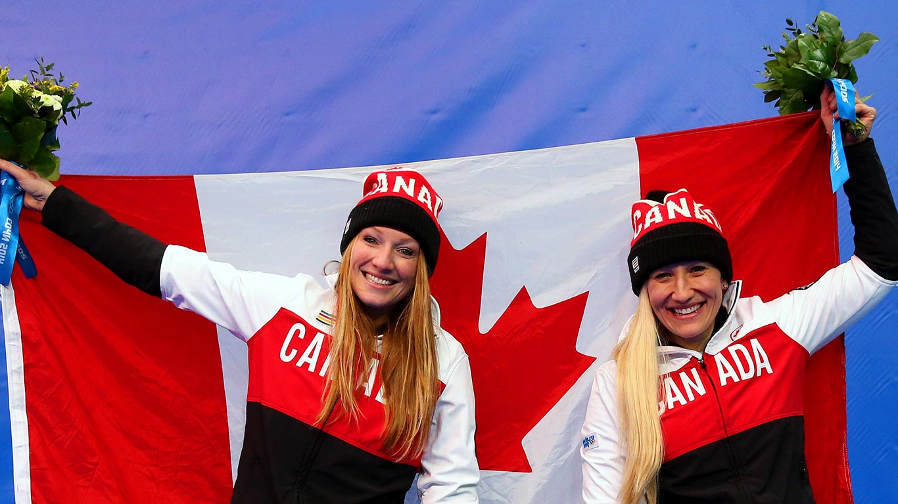

#### 20140220 American white pelican in flight, Red River, Lockport, Manitoba, Canada (© Ken Gillespie/Corbis)(Bing United Kingdom)

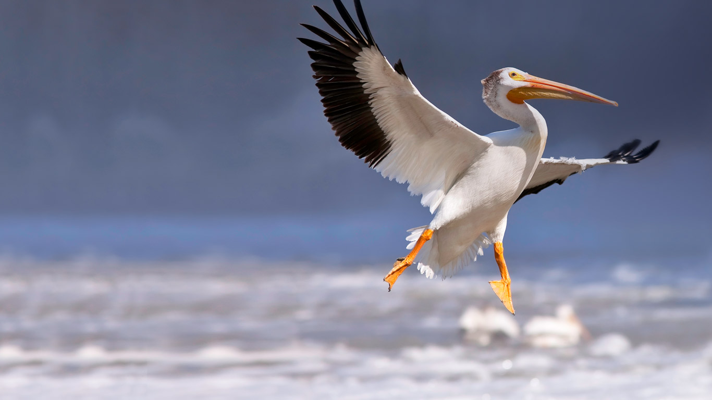

#### 20140219 David Wise of the United States wins the Olympic gold medal during the Freestyle Skiing Men's Halfpipe on February 18, 2014, in Krasnaya Polyana, Russia (© Christophe Pallot/Agence Zoom/Getty Images)(Bing United States)

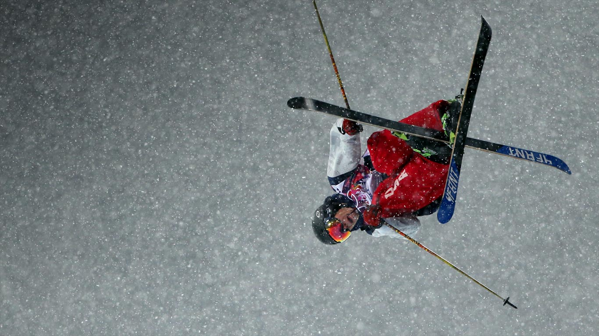

#### 20140219 Union Jack Guitar (© Martyn Goddard/Alamy)(Bing United Kingdom)

#### 20140219 覆盖着露水的沙枣果实 (© GYRO Photography/a.collection/Alamy)(Bing China)

#### 20140219 Hockey rink on Lake Louise, Banff National Park, Alberta (© Miles Ertman/All Canada Photos/age fotostock)(Bing Canada)

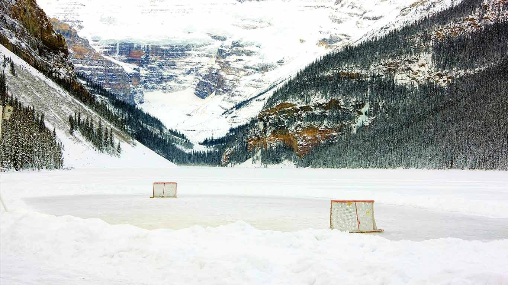

#### 20140218 ｢フィギュア男子シングルフリー決勝・羽生結弦｣ソチ冬季五輪, アイスバーグ・スケート・パレス (© Matthew Stockman/Getty Images)(Bing Japan)

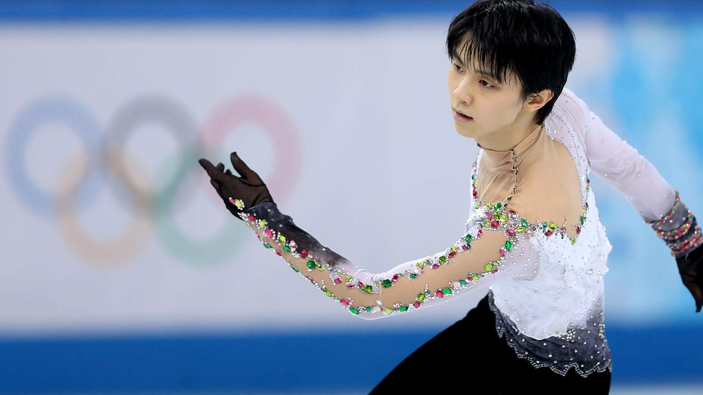

#### 20140218 Stars arc over Lake Hallstatt, Austria (© Getty Images)(Bing United Kingdom)

#### 20140218 Gold medalists Meryl Davis and Charlie White of the United States celebrate during the flower ceremony for Figure Skating Ice Dance at the 2014 Winter Olympics, February 17, 2014, Sochi, Russia (© Ryan Pierse/Getty Images)(Bing United States)

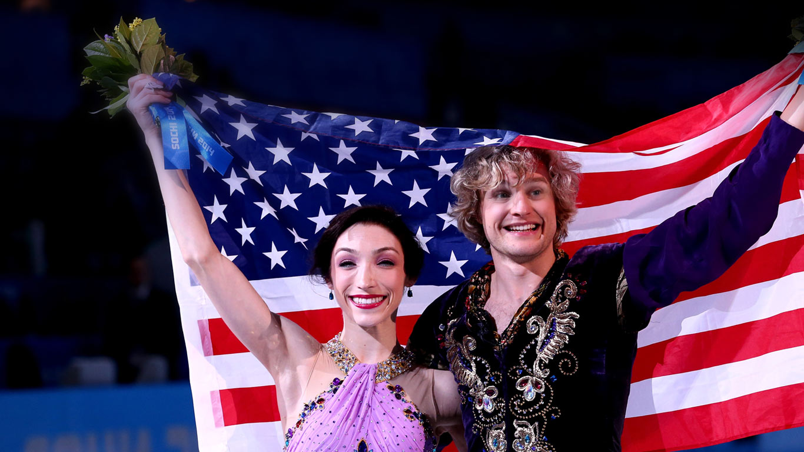

#### 20140217 Harp seal pup at the Gulf of St. Lawrence, Canada (© Mitsuaki Iwago/Corbis)(Bing United Kingdom)

#### 20140217 Profile of George Washington at Mount Rushmore National Memorial, South Dakota (© Visions of America/SuperStock)(Bing United States)

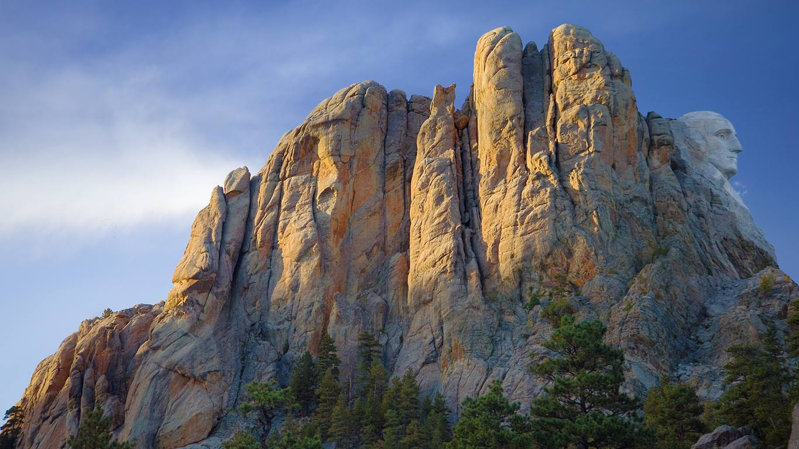

#### 20140217 ｢ダイヤモンドダスト｣北海道, 上富良野 (© JTB PHOTO COMMUNICATI/JTB Photo/SuperStock)(Bing Japan)

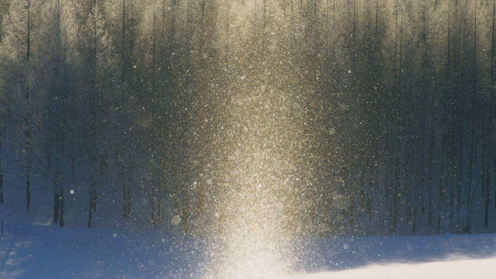

#### 20140216 View of the Prismas Basálticos in Huasca de Ocampo, Hidalgo, Mexico (© Marcos Ferro/Aurora Photos)(Bing United Kingdom)

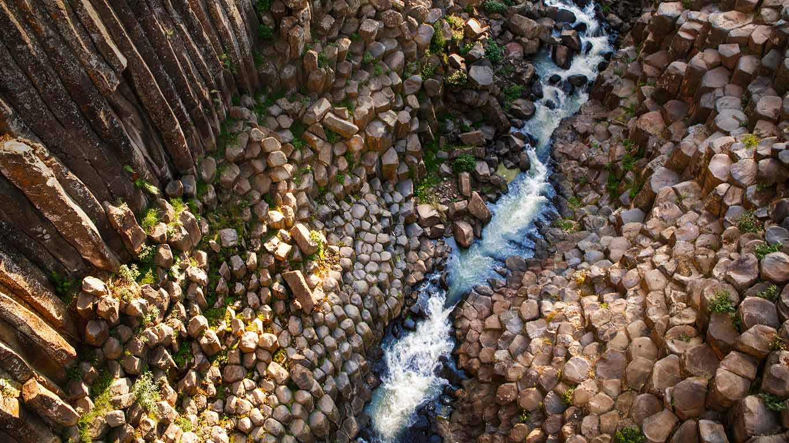

#### 20140215 英国橡木树(英国栎)的橡果特写 (© Nature Picture Library/Britain On View/Getty Images)(Bing China)

#### 20140215 Gold medalist Lizzy Yarnold of Great Britain celebrates on the podium during the flower ceremony for the Women's Skelton on Day 7 of the Sochi 2014 Winter Olympics at Sliding Center Sanki on February 14, 2014 in Sochi, Russia (©  Julian Finney/Getty Images)(Bing United Kingdom)

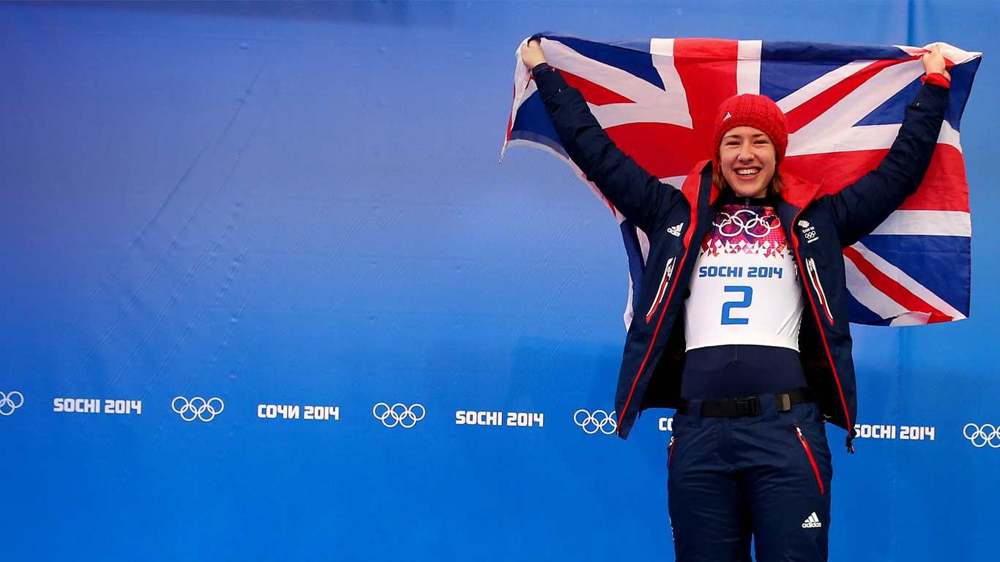

#### 20140214 Star horseshoe worm on a hump coral reef off the Solomon Islands (© Chris Newbert/Corbis)(Bing United Kingdom)

#### 20140214 Gecko sur une rose de porcelaine (Etlingera Elatior) à Combani, Mayotte (© Jean-Pierre Degas/Corbis)(Bing France)

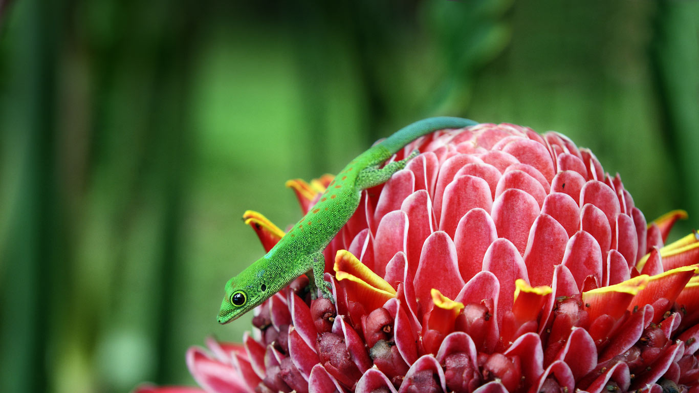

#### 20140214 Das deutsche Team versammelt sich vor Beginn des Frauen-Eishockey-Spiels in der Gruppe B Russland gegen Deutschland in der Shayba-Arena bei den Olympischen Winterspielen in Sotschi am 9. Februar 2014 (© JONATHAN NACKSTRAND/AFP/Getty Images)(Bing Deutschland)

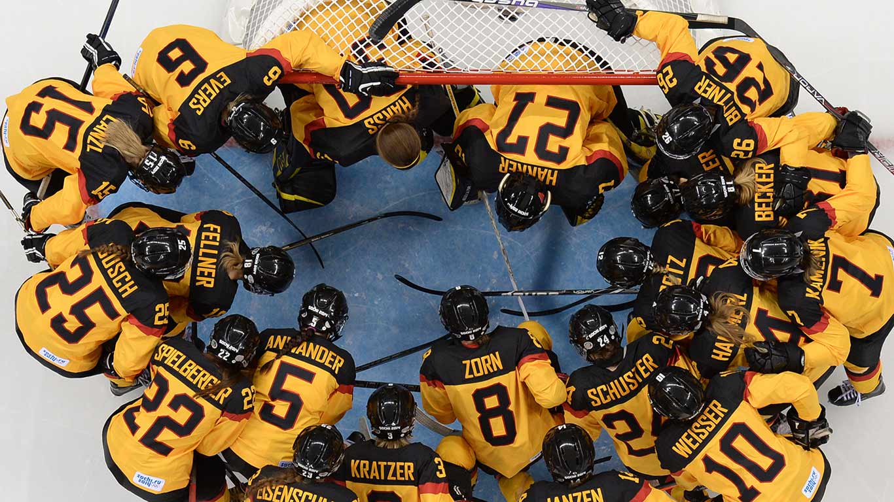

#### 20140214 ｢ノルディック複合 個人ノーマルヒル/10km ・渡部暁斗｣ソチ冬季五輪,ルスキエ・ゴルキ・ジャンピング・センター(© Yohei Osada/AFLO SPORT/Corbis)(Bing Japan)

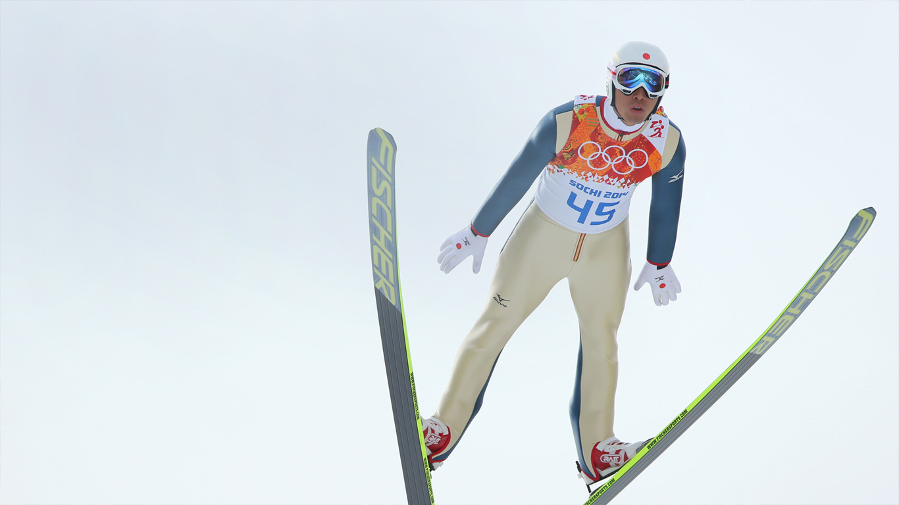

#### 20140213 Yellow-bellied marmot in Yellowstone National Park, Wyoming, USA (© George Sanker/Minden Pictures)(Bing United Kingdom)

#### 20140213 元宵 (© View Stock/Alamy)(Bing China)

#### 20140213 Kaitlyn Farrington of the United States competes in the Women's Snowboard Halfpipe at the 2014 Winter Olympics on February 12, 2014, in Krasnaya Polyana, Russia (© Harry How/Getty Images)(Bing United States)

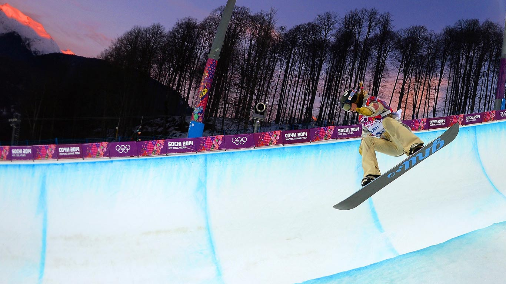

#### 20140213 Ice sculptures, Place Loto-Quebec, Winter Carnival, Quebec City, Quebec, Canada (© Barrett & MacKay/All Canada Photos/age fotostock)(Bing Canada)

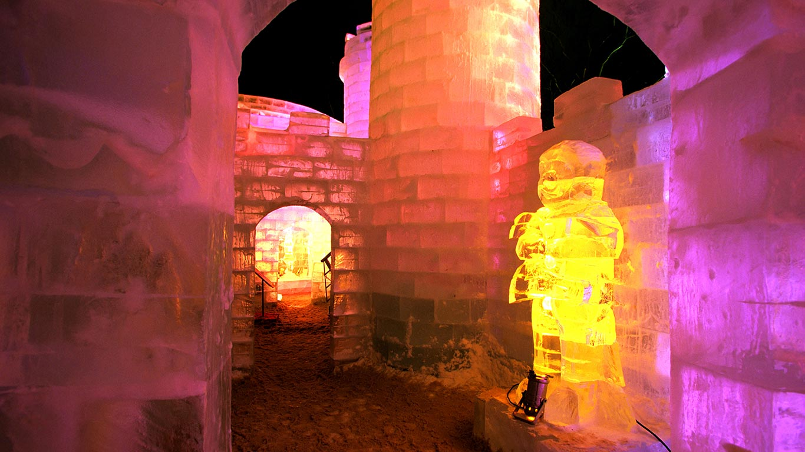

#### 20140213 ｢男子ハーフパイプ決勝・平野歩夢｣ソチ冬季五輪, ロザ・フトル・エクストリーム・パーク (© JAVIER SORIANO/AFP/Getty Images)(Bing Japan)

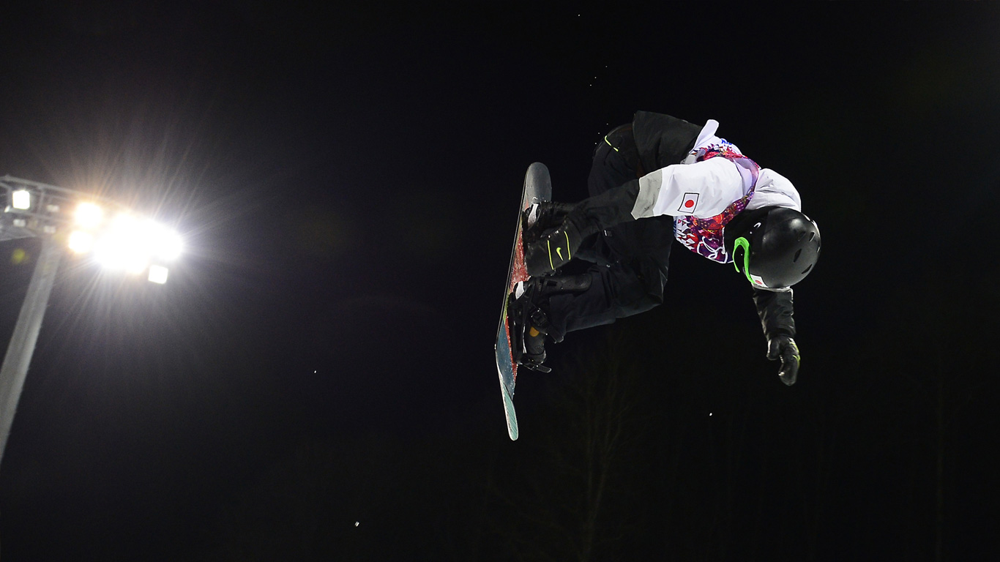

#### 20140213 Asuka, Japan (© Yamaguchi/Flickr Open/Getty Images)(Bing Australia)

#### 20140212 ｢東京ゲートブリッジ｣東京, 東京港 (© amanaimages/Corbis)(Bing Japan)

#### 20140212 Maria Höfl-Riesch während der Super-Kombination auf der Piste von Rosa Chutor bei den Olympischen Winterspielen 2014 in Sotschi am 10. Februar 2014. (© Olivier Morin/AFP/Getty Images)(Bing Deutschland)

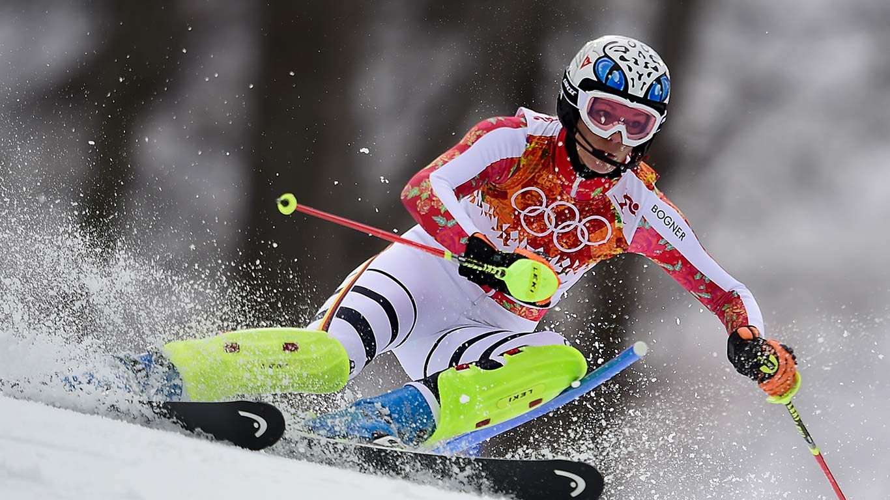

#### 20140212 Erin Hamlin competing in luge singles in Sochi, Russia (© Julian Finney/Getty Images)(Bing United States)

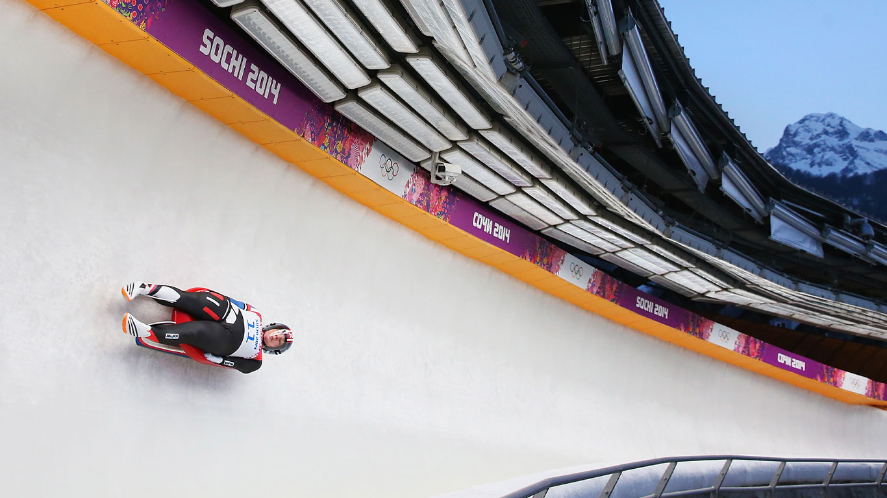

#### 20140212 Le médaillé d’or Martin Fourcade et le médaillé de bronze Jean-Guillaume Béatrix fêtent leur victoire à l’épreuve de biathlon 12,5 km poursuite messieurs, le 10 février 2014, complexe de ski de fond et de biathlon Laura à Krasnaïa Poliana, Jeux Olympiques de Sotchi, Russie (© Richard Heathcote/Getty Images)(Bing France)

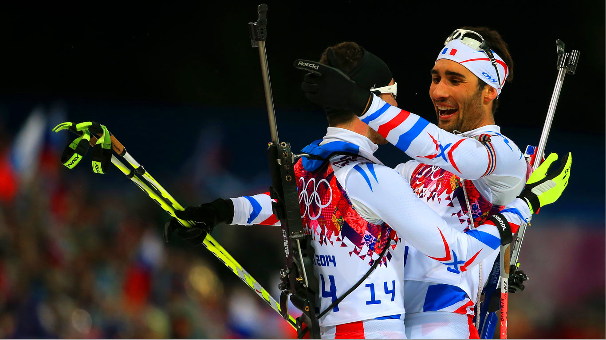

#### 20140212 Charles Darwin statue and Spring blossom Shrewsbury, Shropshire (© mikehaywardcollection.com/Alamy)(Bing United Kingdom)

#### 20140211 Ice in Jökulsarlon, a glacier lagoon in southeast Iceland (© Matteo Colombo/Getty Images)(Bing United Kingdom)

#### 20140211 Canada's Charles Hamelin (L) celebrates after winning the gold medal in the Men's Short Track 1500 m Final at the Iceberg Skating Palace during the Sochi Winter Olympics on February 10, 2014  (© Yuri Kadobnov/AFP/Getty Images)(Bing Canada)

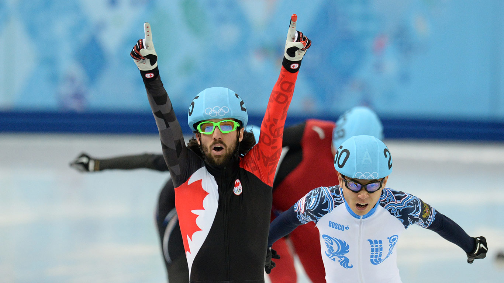

#### 20140210 The Engadin Skimarathon in Engadin, Switzerland (© Stephan Zirwes/Gallery Stock)(Bing United Kingdom)

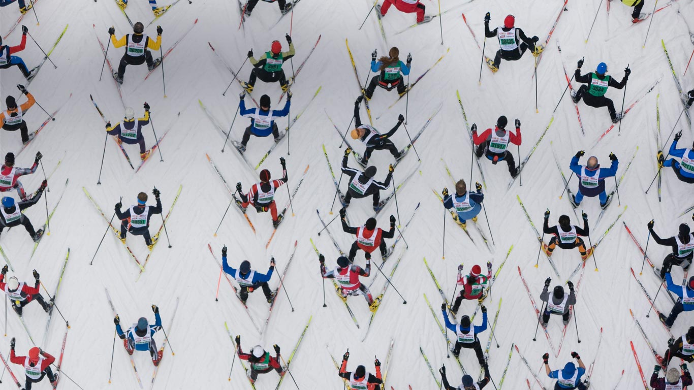

#### 20140209 The Beatles depicted on a metal gate on Penny Lane, Liverpool, England (© Chris Brink/SuperStock)(Bing United Kingdom)

#### 20140208 Tuatara on North Brother Island, New Zealand (© Frans Lanting/Corbis)(Bing United States)

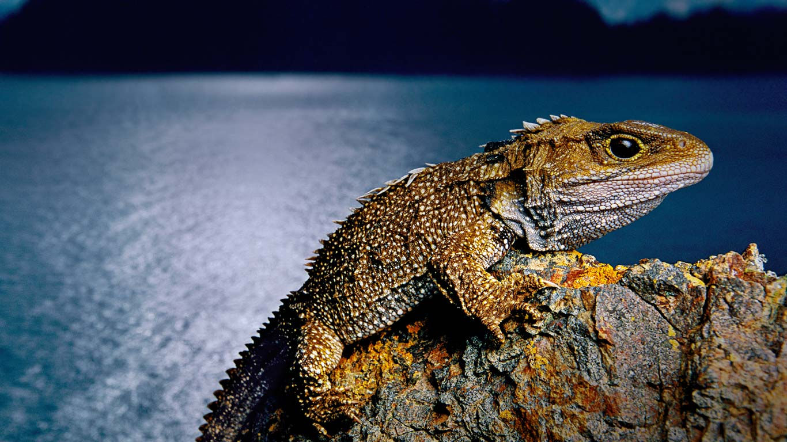

#### 20140208 Kurobe dam, Kurobe Lake, Tateyama, Toyama, Japan (© JTB Photo Communications, Inc./age fotostock)(Bing United Kingdom)

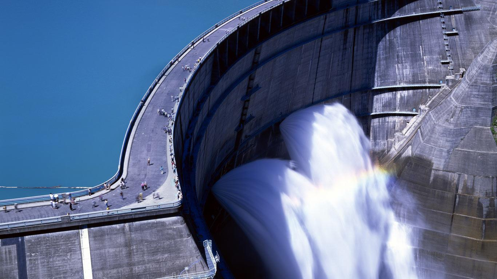

#### 20140207 Innsbruck, Österreich (© Tommaso Di Girolamo/age fotostock)(Bing Deutschland)

#### 20140207 Iceberg Skating Palace, Sochi, Russia (© Lebedev Artur/Corbis)(Bing United Kingdom)

#### 20140206 Blue wildebeests on the Musabi Plains in the Serengeti National Park, Tanzania (© Adrian Bailey/Aurora)(Bing United Kingdom)

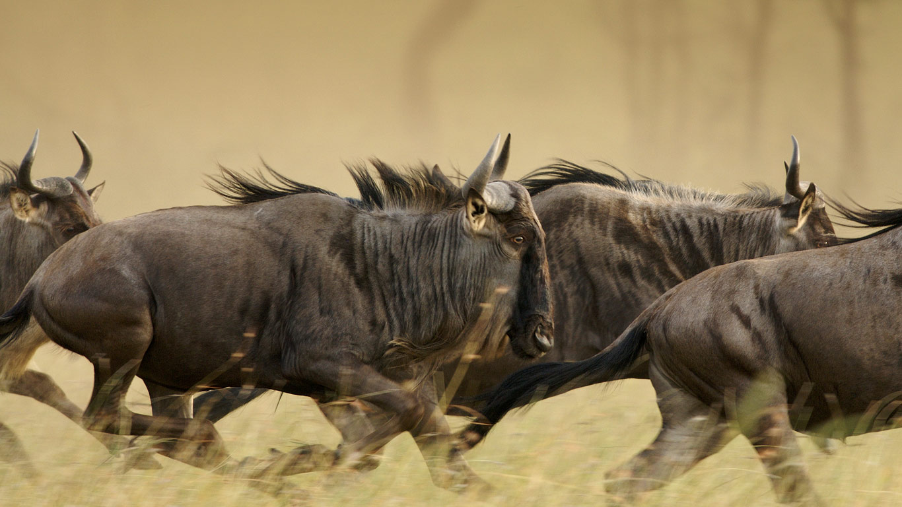

#### 20140206 哈尔滨冰雪世界 (© Redlink/Corbis)(Bing China)

#### 20140205 云海，太阳下山时爬上3600米的牛背山拍摄贡嘎山 (© 4X-image/E+/Getty Images)(Bing China)

#### 20140205 Ice sculptures at Sapporo Winter Festival, Japan (© Shayne Hill Xtreme Visuals/Getty Images)(Bing United Kingdom)

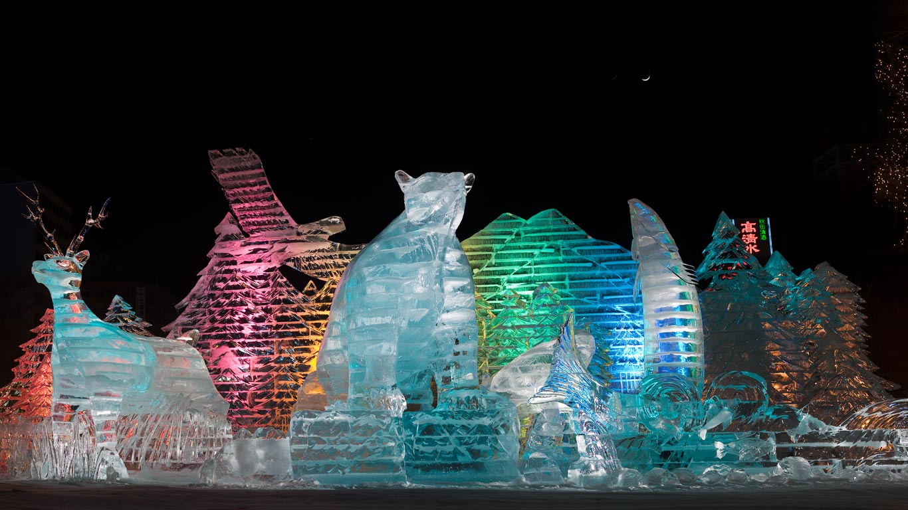

#### 20140205 Héron cendré sous la neige à Brognard, Doubs, Franche-Comté (© Dominique Delfino/Corbis)(Bing France)

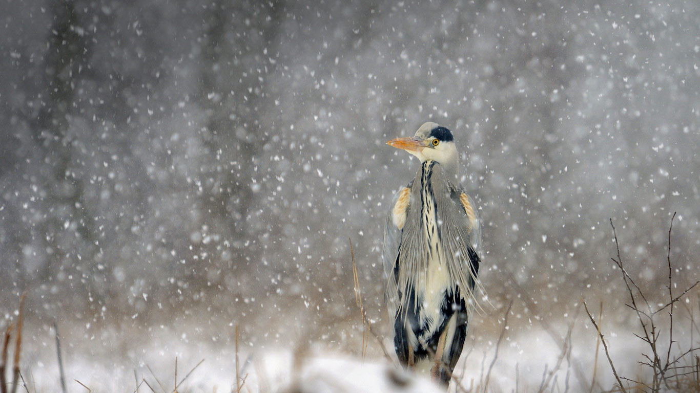

#### 20140204 国家体育场上空的焰火 (© Kevin Zen/Alamy)(Bing China)

#### 20140204 ｢北野天満宮｣京都, 上京区 (© Shin Terada/DanitaDelimont.com)(Bing Japan)

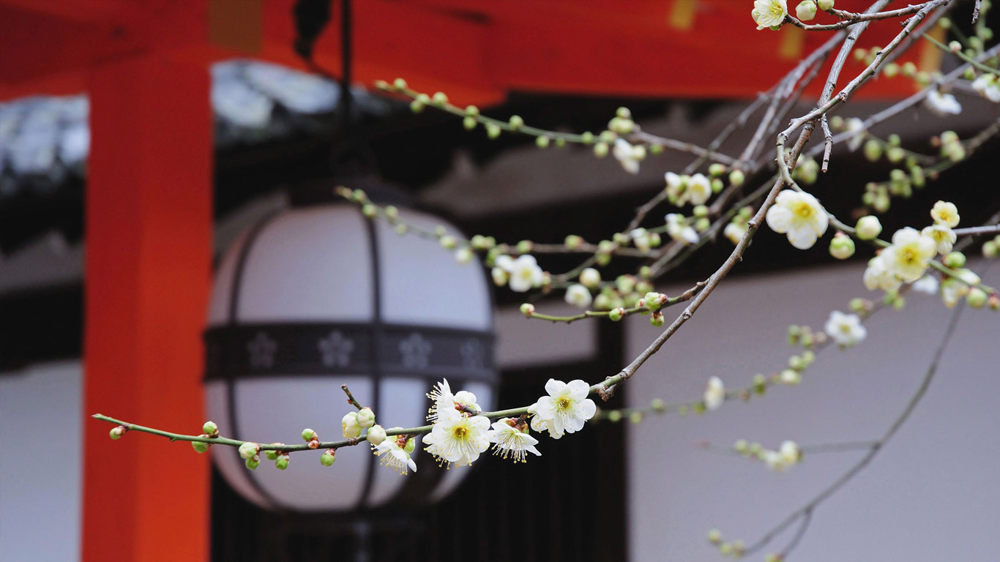

#### 20140204 Ice flows on Hudson Bay, Churchill, Manitoba (© Mike Grandmaison/All Canada Photos/SuperStock)(Bing United Kingdom)

#### 20140204 Quebec Winter Carnival, Ice Palace of Bonhomme Carnaval, Quebec City (© RENAULT Philippe/hemis/age fotostock)(Bing Canada)

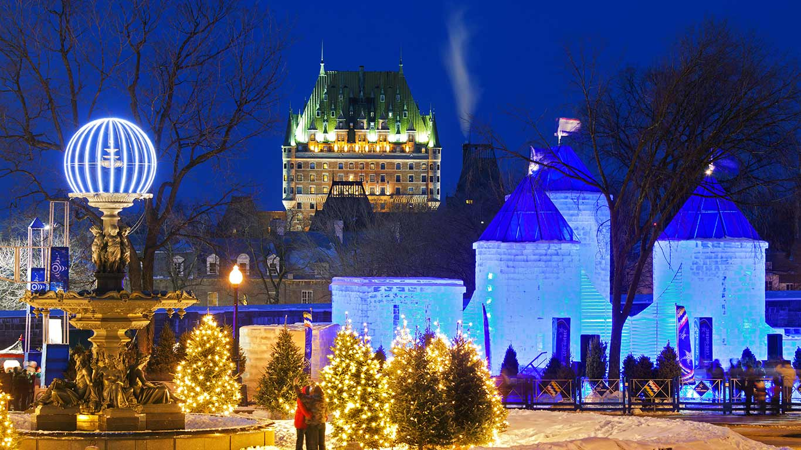

#### 20140203 Reflection of City Hall, Stralsund, Germany (© Nico Stengert/Novarc/Corbis)(Bing United Kingdom)

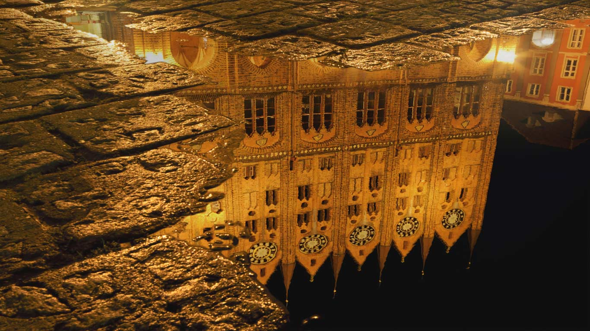

#### 20140203 中国吉祥装饰品，荷包 (© Cheryl Chan/Flickr Open/Getty Images)(Bing China)

#### 20140202 Favites Coral polyps feeding at night and fluorescing when illuminated by ultraviolet light, Sabah, Borneo, Malaysia (© Louise Murray/Visuals Unlimited, Inc.)(Bing United Kingdom)

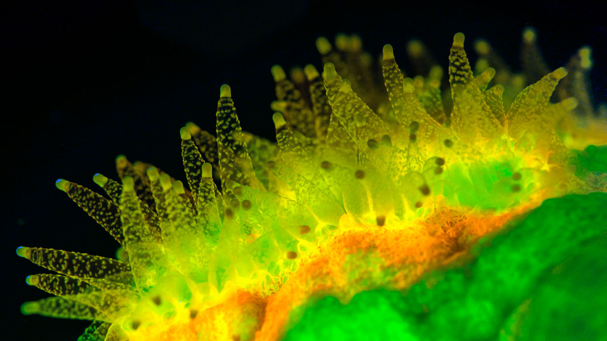

#### 20140202 传统剪纸“福”字 (© eastphoto/Flickr Open/Getty Images)(Bing China)

#### 20140201 中国新年装饰，灯笼与福字 (© Li Ding/Alamy)(Bing China)

#### 20140201 The Shard, London (© Joe Daniel Price/Getty Images)(Bing United Kingdom)

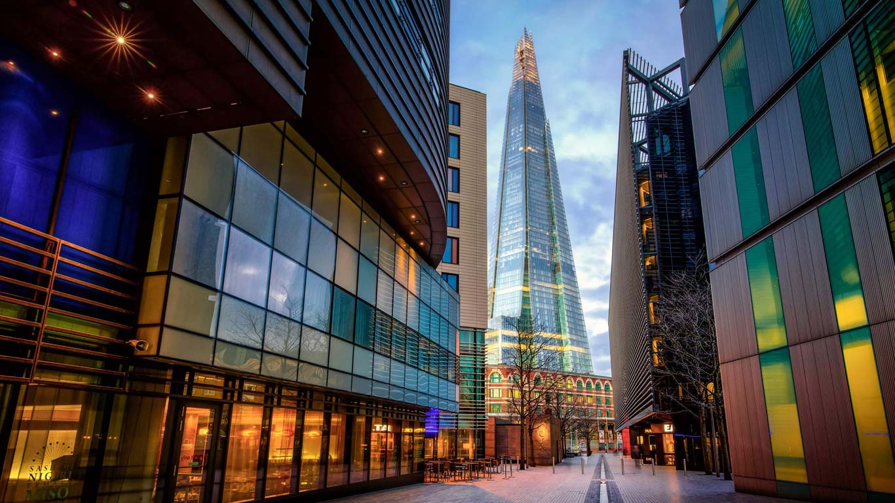

#### 20140201 ｢沖縄の海｣沖縄 (© Yasushi Akimoto/a.collection/amanaimages inc./Alamy)(Bing Japan)

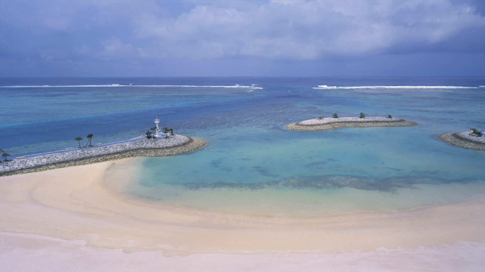

