#### 20140331 Blue Lagoon, Comino, Malta (© Jason Hawkes)(Bing United Kingdom)

#### 20140330 Lavender fields, Banon, France (© Roland Gerth/Corbis)(Bing United Kingdom)

#### 20140329 Male hooded merganser in Beaufort, South Carolina, USA (© Eric Horan/age fotostock)(Bing United Kingdom)

#### 20140329 北京八达岭长城 (© Chua Wee Boo/Age Fotostock)(Bing China)

#### 20140328 ｢わたらせ渓谷鐵道｣群馬, 神戸駅 (© JTB MEDIA CREATION, Inc./Alamy)(Bing Japan)

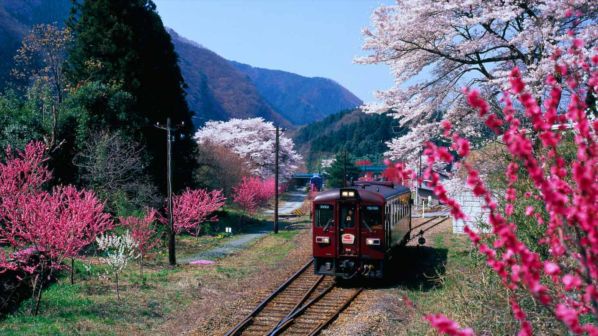

#### 20140328 Rickshaws and view of Taj Mahal in Agra, India (© Dinesh Khanna/Axiom)(Bing United Kingdom)

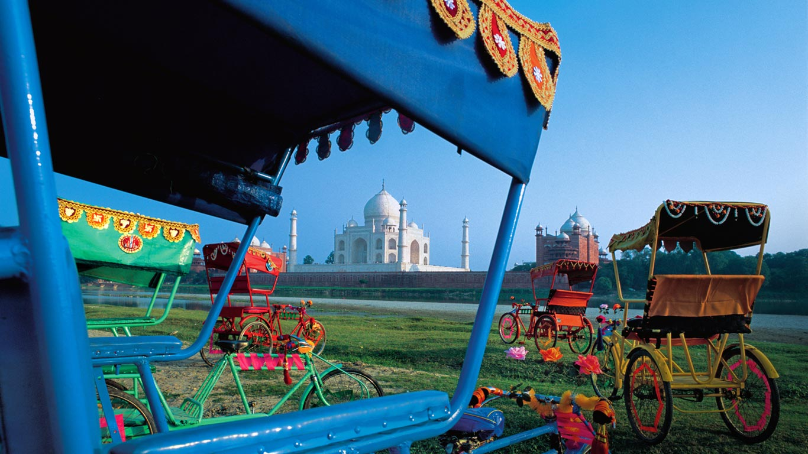

#### 20140327 ｢桜と富士山｣富士五湖周辺 (© Daryl Benson/Stockbyte/Getty Images)(Bing Japan)

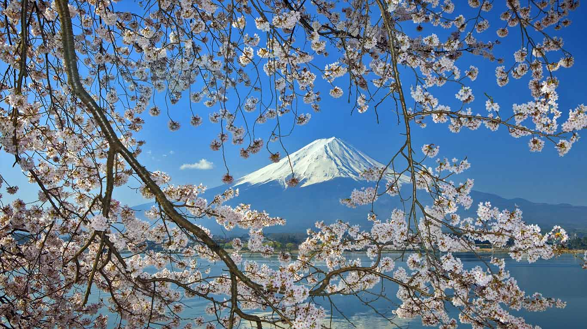

#### 20140327 安大略省阿斯本山谷中的三只浣熊 (© Gerry Ellis/Minden Pictures/Getty Images)(Bing China)

#### 20140327 Cancún, Mexico panorama (© AirPano Ltd)(Bing United Kingdom)

#### 20140326 Blick von der Zugspitze auf den Waxensteinkamm und das erleuchtete Garmisch-Partenkirchen, Bayern, Deutschland (© Olaf Broders Nature Photography/Oxford Scientific/Getty Images)(Bing Deutschland)

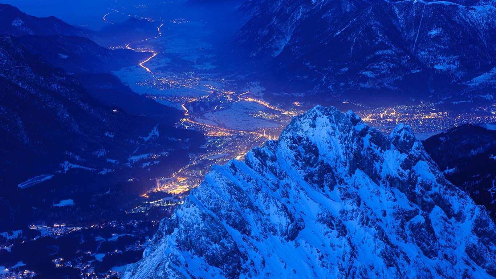

#### 20140326 Arches and Sea Caves in Dungeon Provincial Park,Cape Bonavista, Bonavista Peninsula, Discovery Trail, Bonavista Bay, Newfoundland & Labrador, Canada (© Rolf Hicker/All Canada Photos/Corbis)(Bing Canada)

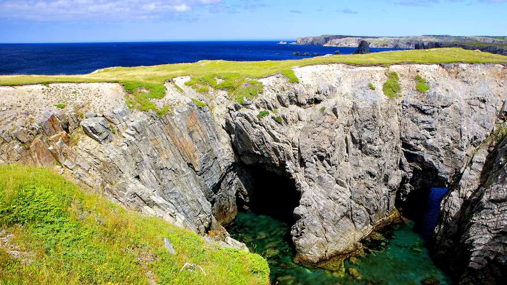

#### 20140326 Early morning at Ladybower Reservoir in Peak District National Park (© Zixin Chen/National Geographic)(Bing United Kingdom)

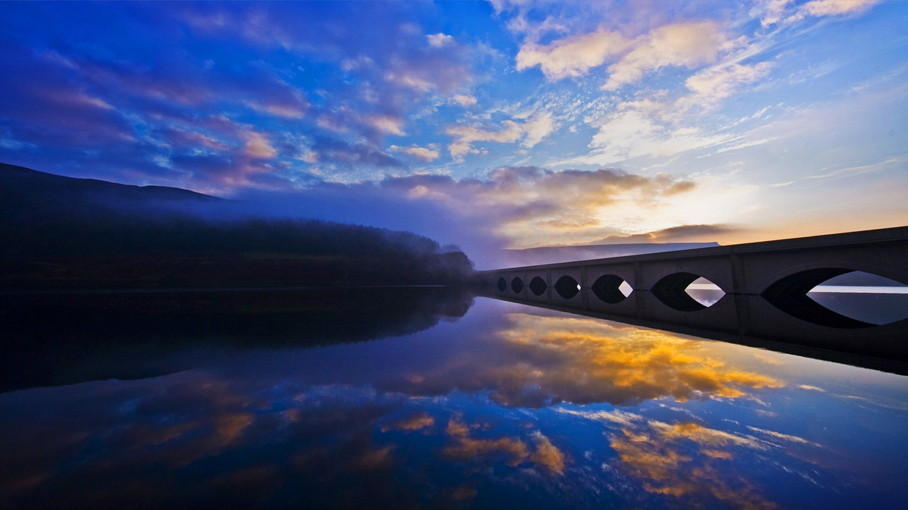

#### 20140325 ｢東京駅丸の内ドーム天井｣東京 (© TPX/Prisma/SuperStock)(Bing Japan)

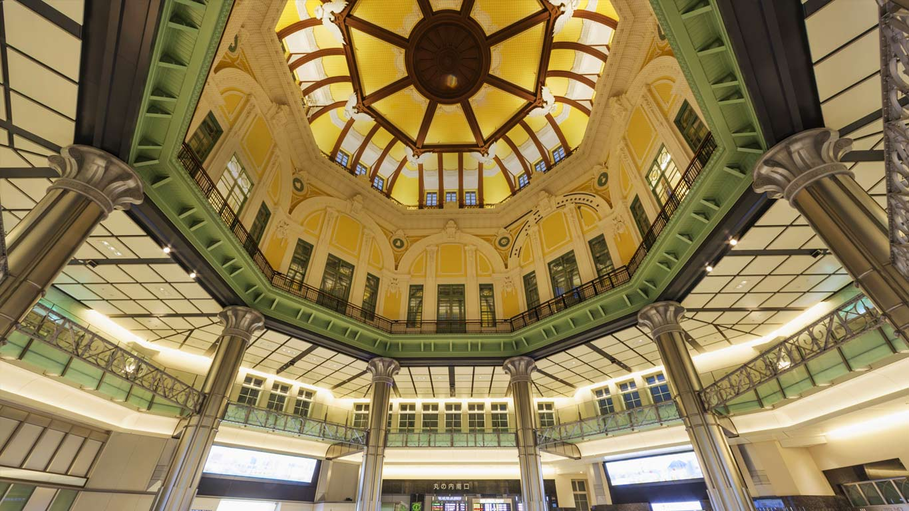

#### 20140325 Rosy Sundew trichomes (Drosera hamiltonii), Australia (© Barry Rice/Visuals Unlimited)(Bing Australia)

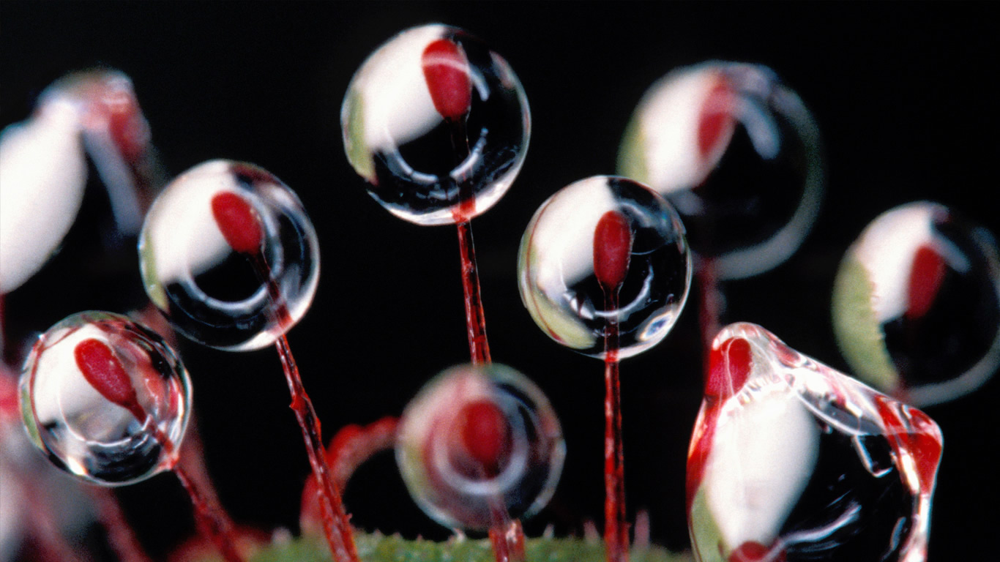

#### 20140325 福建永定县的传统客家土楼 (© Kenny Chow Kmdd/Flickr/Getty Images)(Bing China)

#### 20140325 'Ama'u ferns sprouting from crack in lava rock, Hawaii Volcanoes National Park, Hawaii, USA (© Frans Lanting Studio/Alamy)(Bing United Kingdom)

#### 20140324 Auditorium Parco Della Musica, Rome, Italy (© Alastair Philip Wiper/Corbis)(Bing United Kingdom)

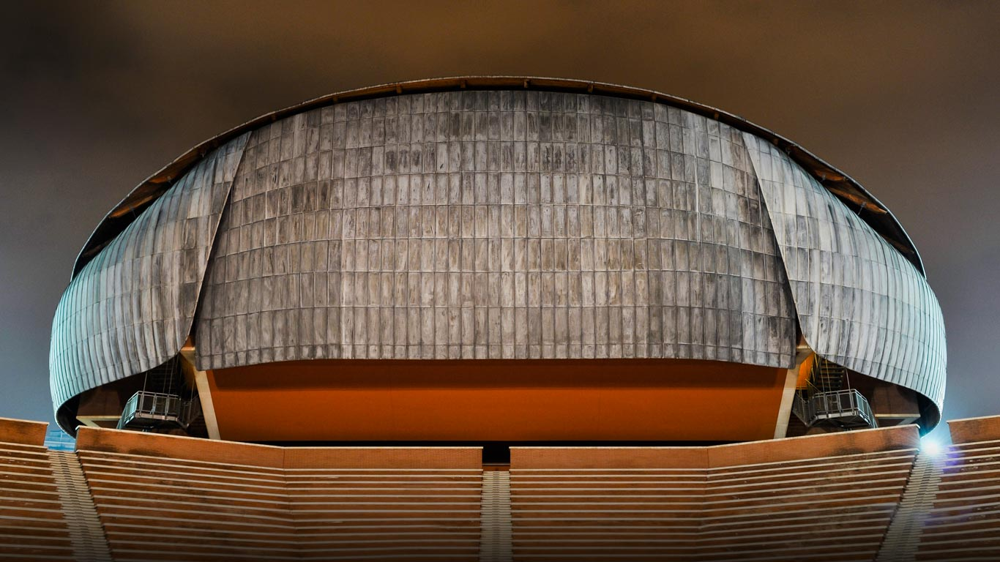

#### 20140323 Global map of winds (© NASA)(Bing United Kingdom)

#### 20140322 2012年3月24日湖北宜昌秭归县，在三峡大坝附近放风筝的游人 (© Zheng Jiayu/Xinhua Press/Corbis)(Bing China)

#### 20140322 Colonie de flamants roses en Camargue, Bouches-du-Rhône, PACA (© Theo Allofs/Corbis)(Bing France)

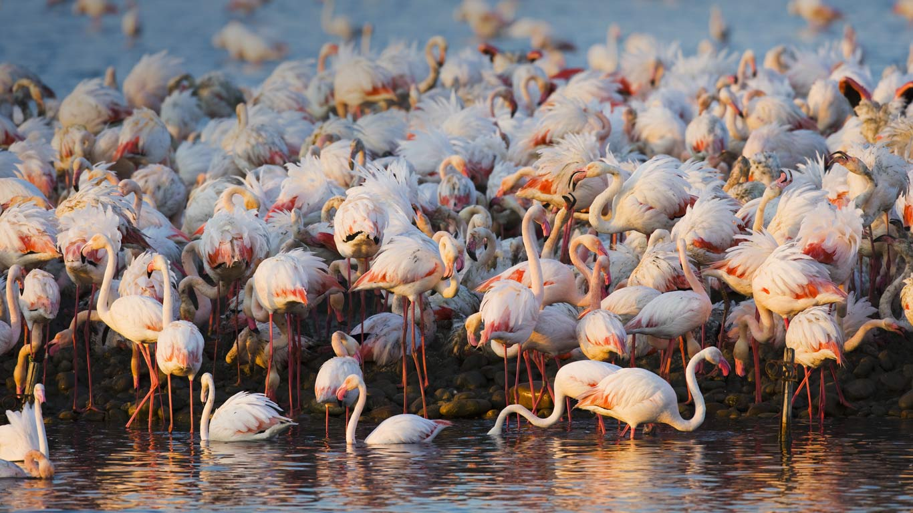

#### 20140322 Dettifoss waterfall, Asbyrgi, Iceland (© Matthew Eisman/TandemStock)(Bing United Kingdom)

#### 20140321 Mount Ruapehu’s crater lake in New Zealand (© xflo:w/500px)(Bing United Kingdom)

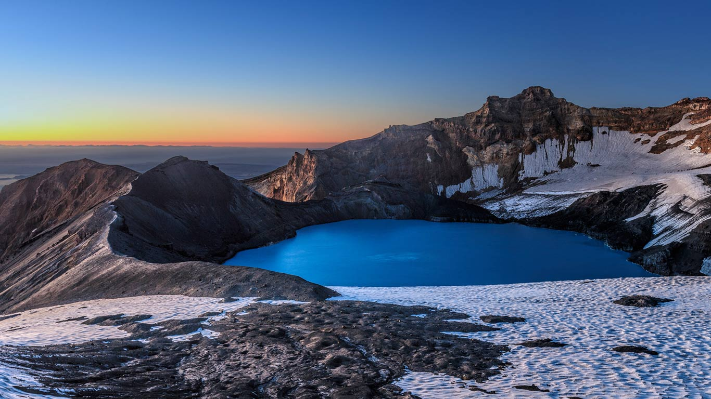

#### 20140320 Rear wall of Art Gallery of Ontario, Toronto, Ontario (© Klaus Lang/All Canada Photos/age fotostock)(Bing Canada)

#### 20140320 Stonehenge Visitor Centre, Amesbury, United Kingdom (© Anthony Coleman/Corbis)(Bing United Kingdom)

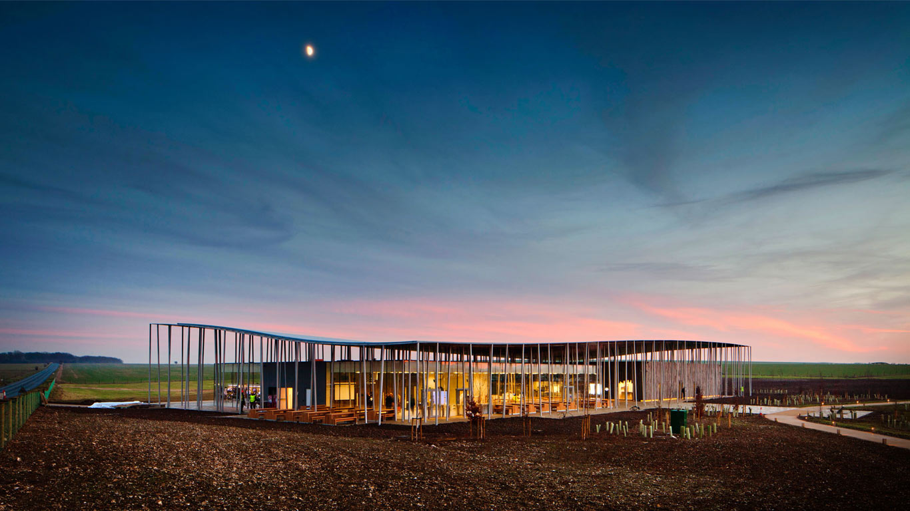

#### 20140320 Zwei Eisvögel streiten sich um einen Fisch, Oberpleis, Königswinter, Nordrhein-Westfalen, Deutschland (© Winfried Schäfer/Imagebroker/age fotostock)(Bing Deutschland)

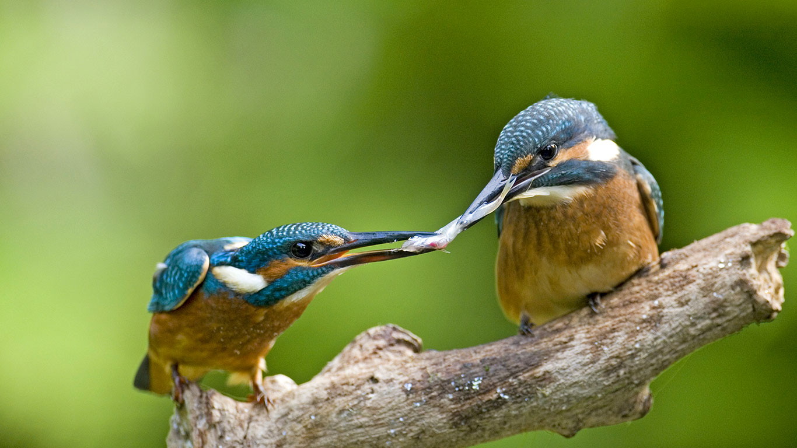

#### 20140320 The ceiling of the Royal Exhibition Building in Melbourne, Victoria (© Raymond Warren / Alamy)(Bing Australia)

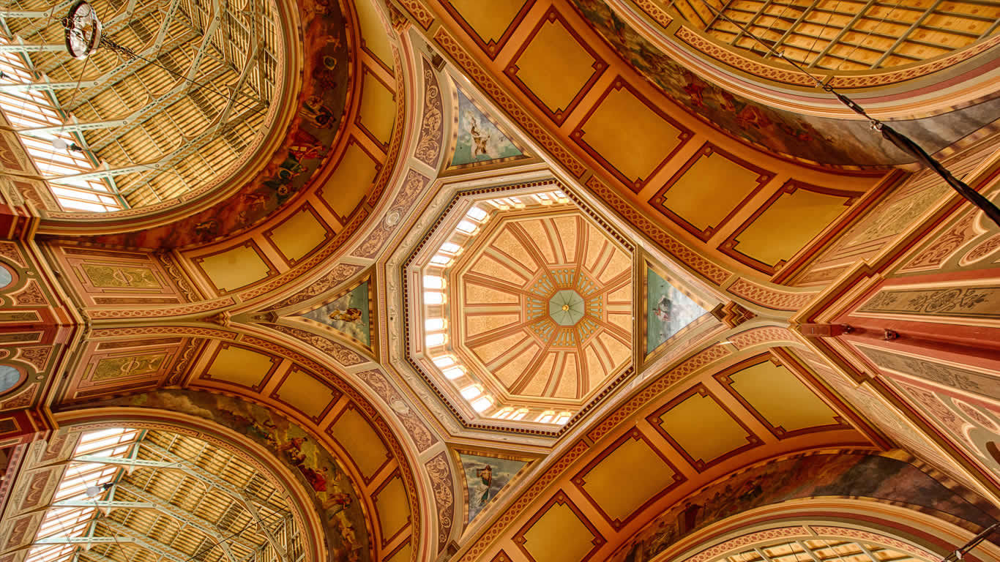

#### 20140320 Bluebells in the Halle Forest near Halle, Belgium (© Raimund Linke/Ocean/Corbis)(Bing United States)

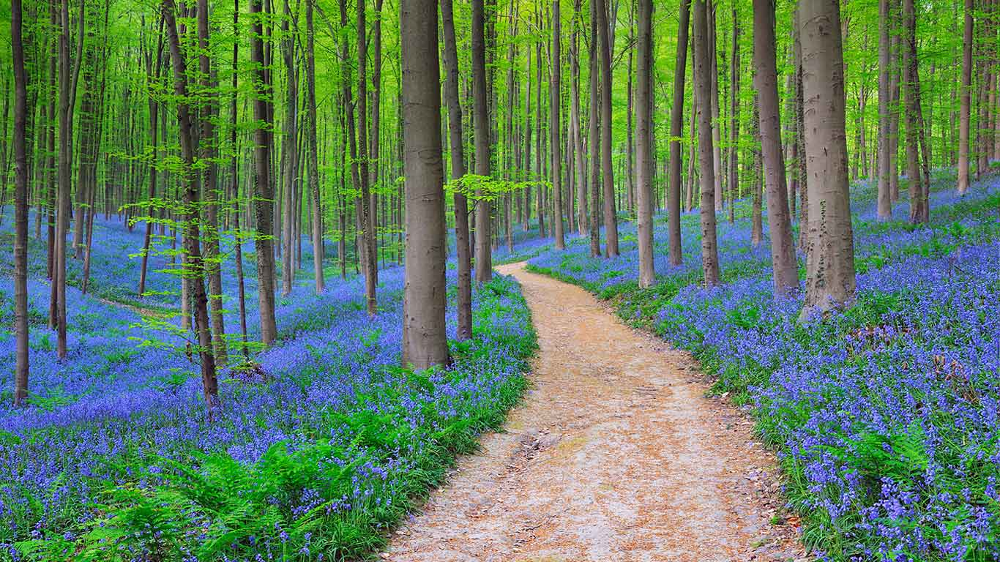

#### 20140319 Galápagos sea lion swims through a school of black-striped salema fish off Santa Cruz Island, Galápagos Islands, Ecuador (© David Fleetham/Visuals Unlimited, Inc.)(Bing United Kingdom)

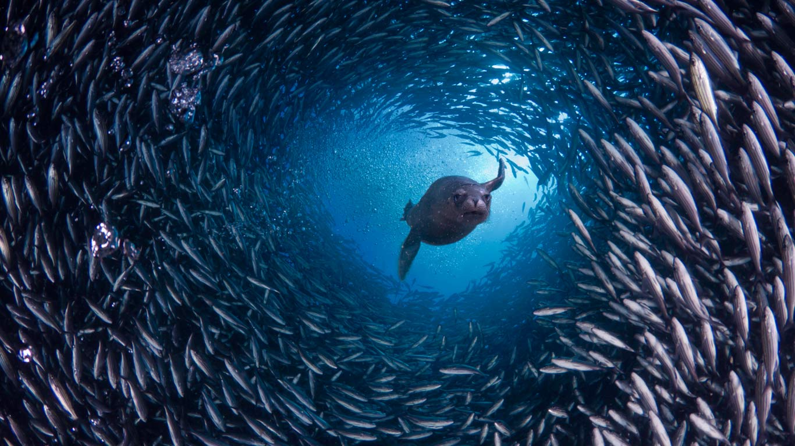

#### 20140318 Machu Picchu, Peru (© Image Source/Corbis)(Bing United Kingdom)

#### 20140317 Giant's Causeway, County Antrim, Northern Ireland, United Kingdom (© Nando Pizzini Photography/Getty Images)(Bing United Kingdom)

#### 20140316 Sheep among a king penguin colony in the Falkland Islands (© Frans Lanting/Corbis)(Bing United Kingdom)

#### 20140315 Coastline of Acadia National Park, Maine (© David Zimmerman/Masterfile)(Bing United States)

#### 20140315 Bonsai Rock, Lake Tahoe, Nevada, USA (© Josh Miller/Corbis)(Bing United Kingdom)

#### 20140314 Poulnabrone dolmen, Burren National Park in Ireland (© Danita Delimont/Getty Images)(Bing United Kingdom)

#### 20140314 ｢エゾシマリスのカップル｣北海道, 釧路 (© Datacraft/Universal Images Group/age fotostock)(Bing Japan)

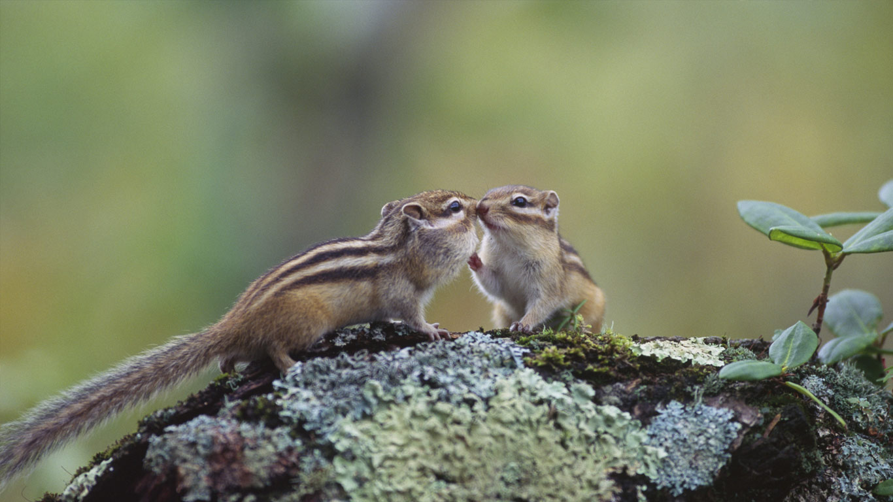

#### 20140313 Antarctic Sound at sunset, Antarctica (© Enrique R Aguirre Aves/Getty Images)(Bing United Kingdom)

#### 20140312 Notre-Dame de Paris se reflétant dans l’eau sous le pont de la Tournelle la nuit, Paris, Île de France (© Loic Lagarde/Getty Images)(Bing France)

#### 20140312 Moeraki Boulders, New Zealand (© Uli Hamacher/Getty Images)(Bing United Kingdom)

#### 20140312 Eichhörnchen im Schnee, Leipzig, Sachsen (© Kevin Prönnecke/imagebroker/Corbis)(Bing Deutschland)

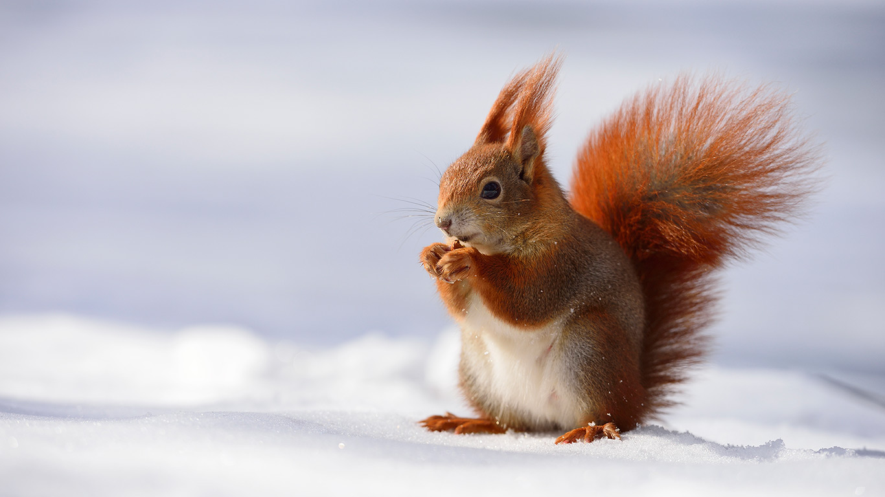

#### 20140311 Wenthworth Falls in the Blue Mountains, New South Wales (© Stonemeadow Photography/Alamy)(Bing Australia)

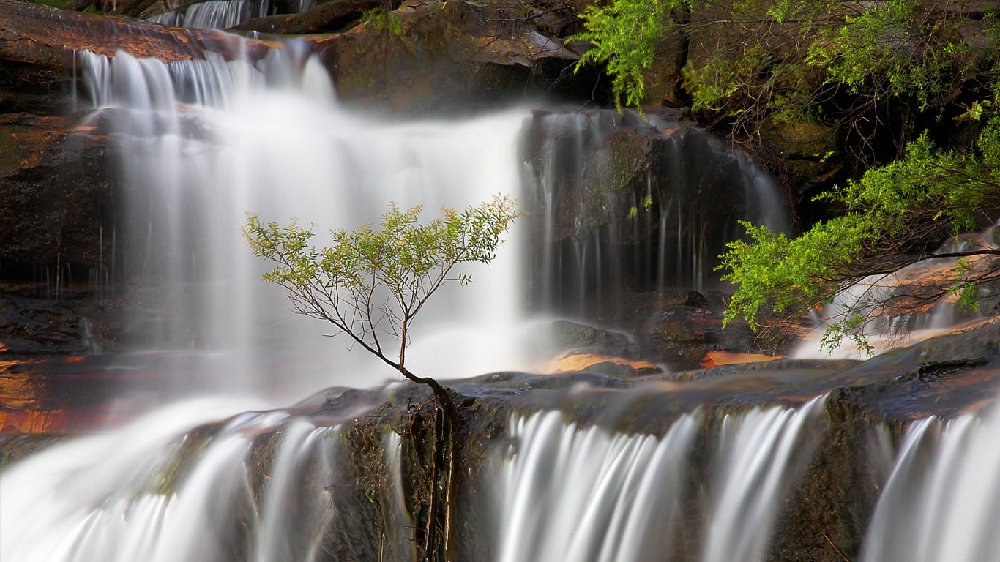

#### 20140311 Dall sheep, Yukon, Canada (© Donald M. Jones/Minden Pictures)(Bing United Kingdom)

#### 20140311 ｢三陸鉄道北リアス線｣岩手, 普代村 (© JTB Photo/SuperStock)(Bing Japan)

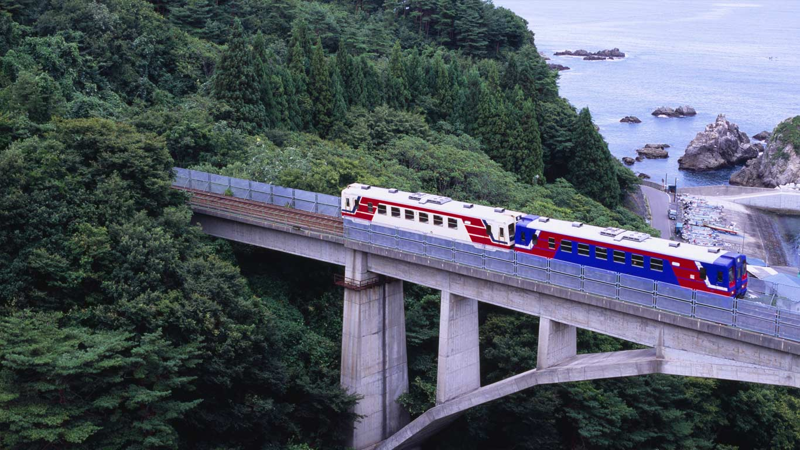

#### 20140310 Toronto City Hall, Toronto, Ontario, Canada (© Michael Woloszynowicz/500px)(Bing United Kingdom)

#### 20140310 ｢たらい舟｣新潟, 佐渡 (© JTB Photo/SuperStock)(Bing Japan)

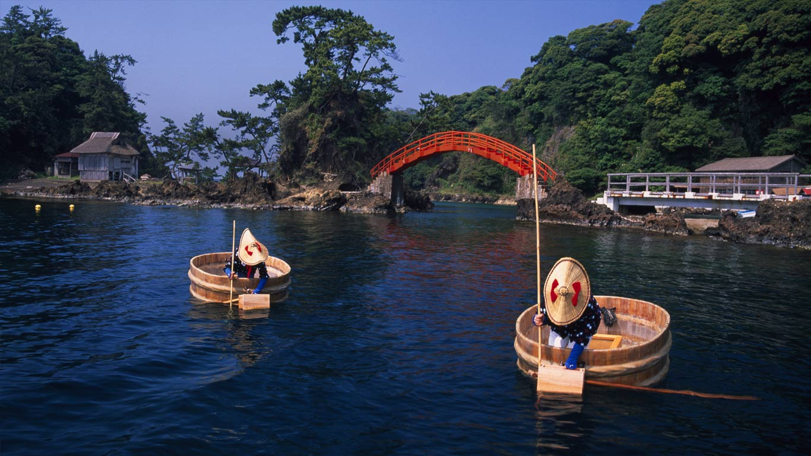

#### 20140309 Tea fields in Munnar, Kerala, India (© Vidhu S/500px)(Bing United Kingdom)

#### 20140308 Aerial view of Wall Street, Manhattan, New York City, USA (© Cameron Davidson/Corbis)(Bing United Kingdom)

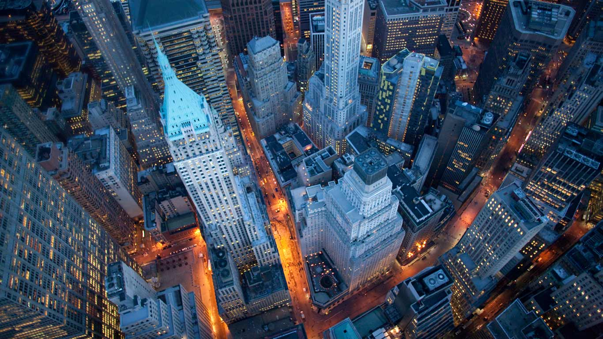

#### 20140307 Secretary bird, Kruger National Park, South Africa (© Johannes Swanepoel/Alamy)(Bing United Kingdom)

#### 20140307 Waves frozen in stacks, Lake Ontario shoreline (© Gail Shotlander/Flickr/Getty Images)(Bing Canada)

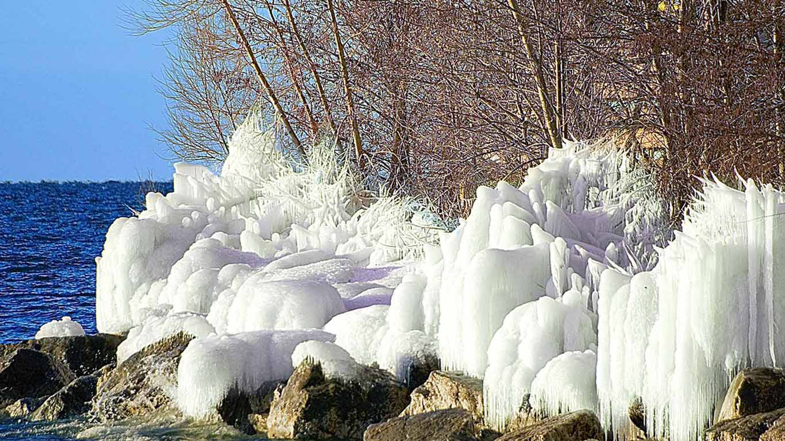

#### 20140307 东方知更鸟，雄性喂食雌性 (© steve greer/E+/Getty Images)(Bing China)

#### 20140306 Gordes, Provence-Alpes-Côte d'Azur, France (© Arnab Banerjee/Gallery Stock)(Bing United Kingdom)

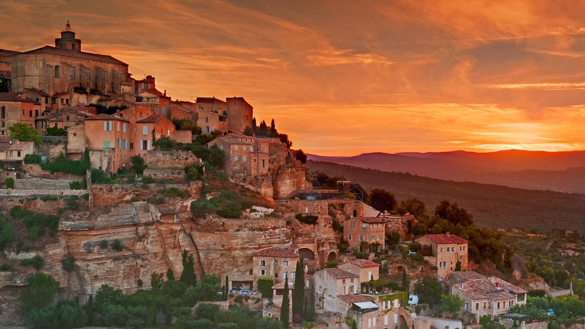

#### 20140305 Spillway, Monte da Rocha Dam, near Ourique, Portugal (© André Gonçalves/SuperStock)(Bing United Kingdom)

#### 20140304 Tritonenbrunnen, Königsallee, Düsseldorf (© Bernd Kohlhas/Corbis)(Bing Deutschland)

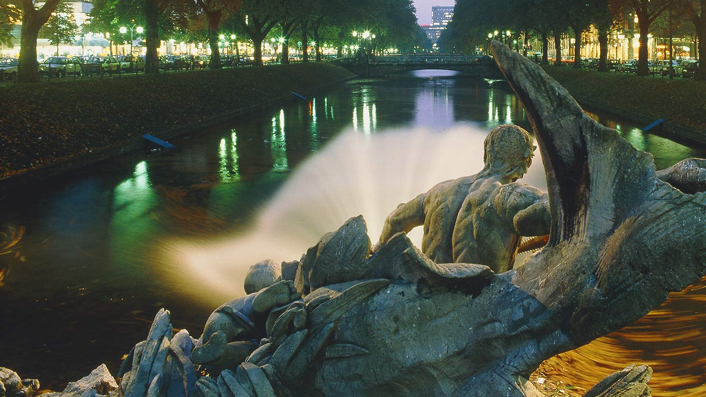

#### 20140304 Mardi Gras beads in New Orleans, Louisiana, USA (© David H. Lewis/Getty Images)(Bing United Kingdom)

#### 20140303 Angel Falls, Venezuela (© AirPano Ltd)(Bing United Kingdom)

#### 20140302 Wild boar herd, Alam-Pedja Nature Reserve, Estonia (© Wild Wonders of Europe/Zacek/Minden Pictures)(Bing United Kingdom)

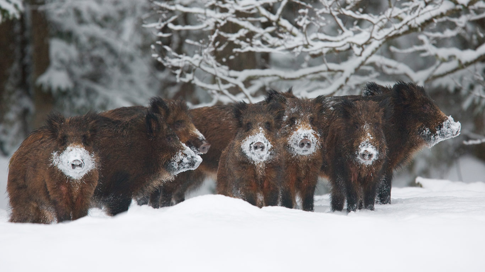

#### 20140302 ｢桃畑｣山梨, 笛吹市 (© JTB MEDIA CREATION, Inc./Alamy)(Bing Japan)

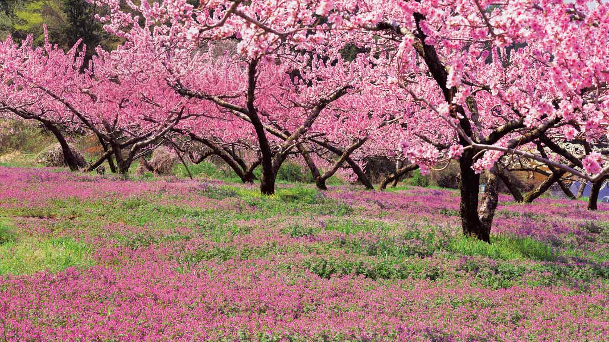

#### 20140302 Cave of the Lakes near Kalavryta, Achaia, Peloponnese, Greece (© Hercules Milas/Alamy)(Bing United States)

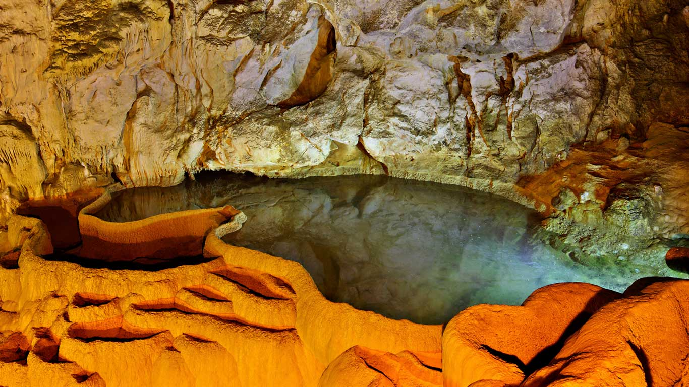

#### 20140301 Memorial to the Welshmen of the 38th Division who fell at Mametz wood during the First World War (© Kevin Howchin/Alamy)(Bing United Kingdom)

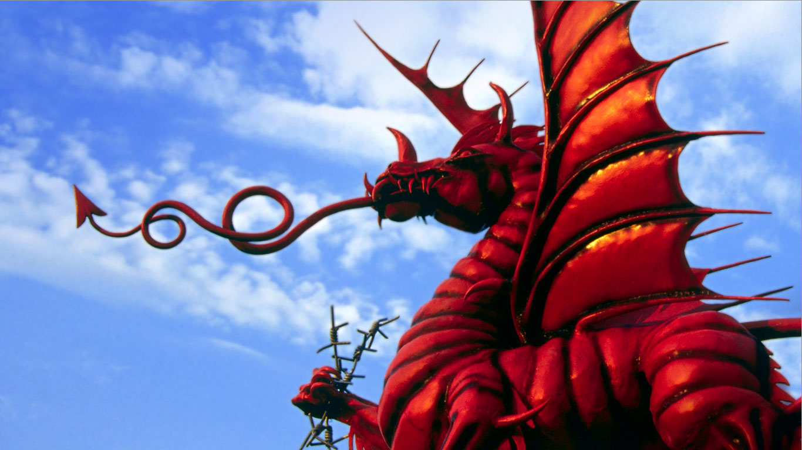

#### 20140301 ｢清流公園なるふち平｣福岡, 篠栗町 (© Brian Kennedy/Flickr/Getty Images)(Bing Japan)

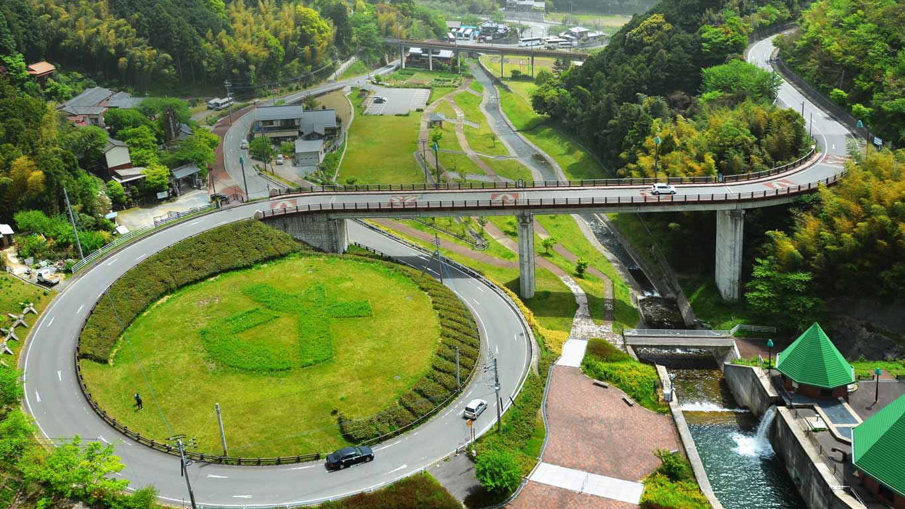

