#### 20140430 Aerial view at night, Chicago, Illinois, USA (© Jim Richardson/Getty Images)(Bing United Kingdom)

#### 20140430 Hexenaltar auf dem Brocken-Gipfel (© Günter Gräfenhain/4Corners)(Bing Deutschland)

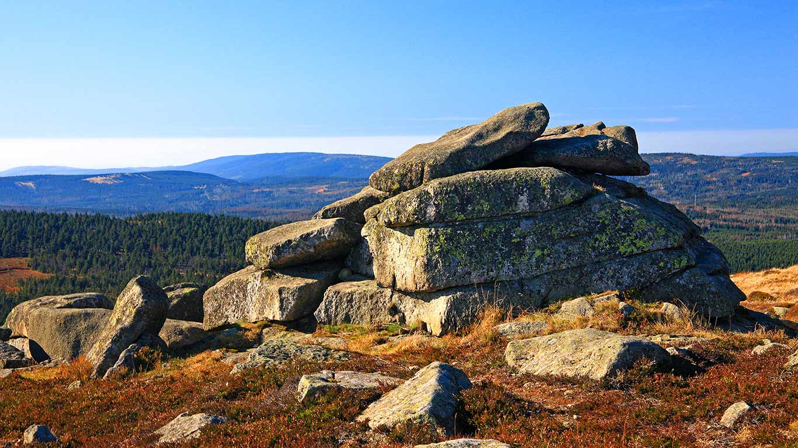

#### 20140429 Mingun Pahtodawgyi ruins, Mingun, Burma (© David Santiago Garcia/Aurora Photos)(Bing United Kingdom)

#### 20140429 日落时分，在香港一座山上欣赏元朗区的风光 (© Yiu Yu Hoi/Flickr Open/Getty Images)(Bing China)

#### 20140428 ｢大倉山ジャンプ競技場｣北海道, 札幌 (© JTB Photo/SuperStock)(Bing Japan)

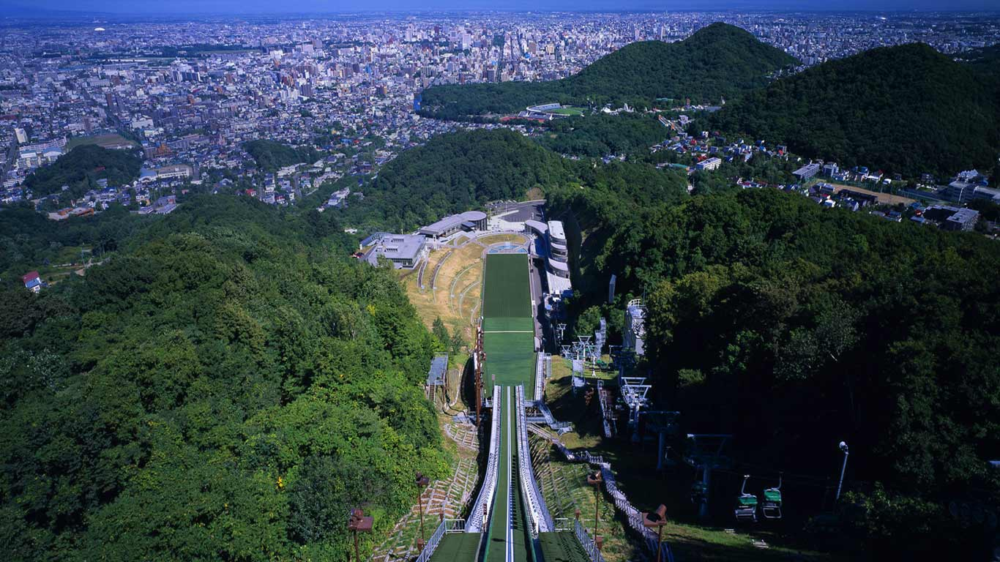

#### 20140428 Common iguana (© Roman Mordashev/500px)(Bing United Kingdom)

#### 20140428 Crater from eruption 250 years ago Nisga a Tribal Lands British Columbia Canada (© Galen Rowell/Mountain Light/Alamy)(Bing Canada)

#### 20140427 Portland skyline and Willamette River, Oregon, USA (© Ben Coffman Photography/Tandem Stock)(Bing United Kingdom)

#### 20140426 Fluorescing coral off the coast of Palau (© Norbert Wu/Corbis)(Bing United Kingdom)

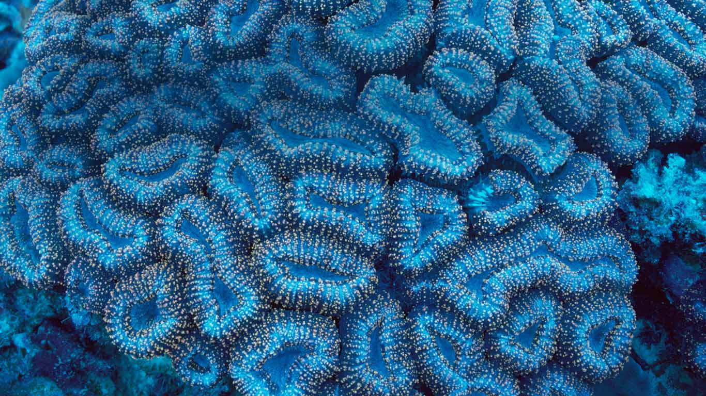

#### 20140425 西藏拉萨布达拉宫 (© Blaine Harrington III/Alamy)(Bing China)

#### 20140425 Intérieur de la Sainte-Chapelle à Paris, Île-de-France (© Luciano Mortula/Alamy)(Bing France)

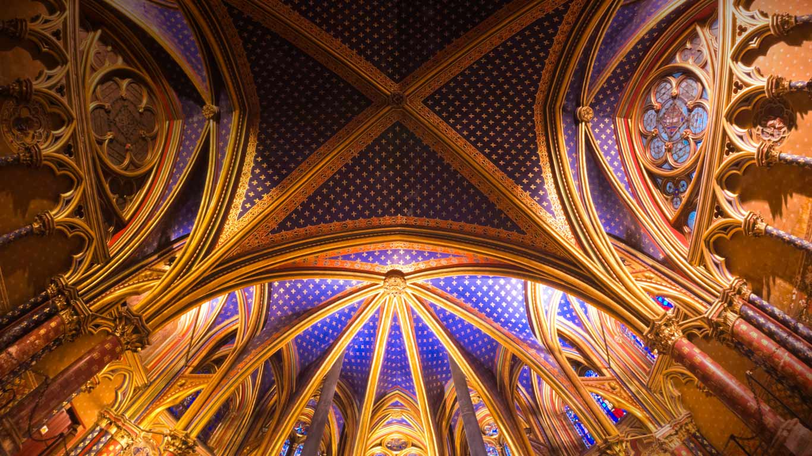

#### 20140425 Oak trees in Palo Corona Regional Park, Carmel Valley, California, USA (© Doug Steakley/Getty Images)(Bing United Kingdom)

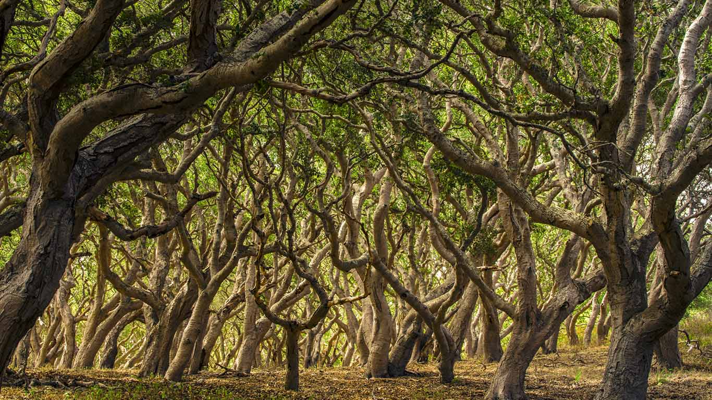

#### 20140425 ｢松島｣宮城, 松島湾 (© Sean Pavone/Alamy)(Bing Japan)

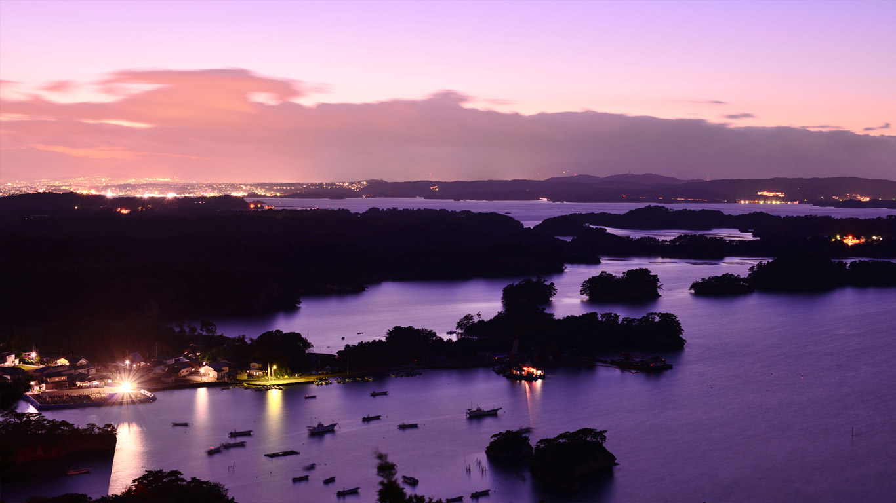

#### 20140424 Pygmy seahorse on a branch of coral at the Great Barrier Reef (© imagebroker/Alamy)(Bing Australia)

#### 20140424 Reef near Baulhagallaa Island, Gaafu Dhaalu Atoll, Maldives (© Stuart Westmorland/Corbis)(Bing United Kingdom)

#### 20140423 Shakespeare's Globe Theatre, London, England (© Alain Schroeder/age fotostock)(Bing United Kingdom)

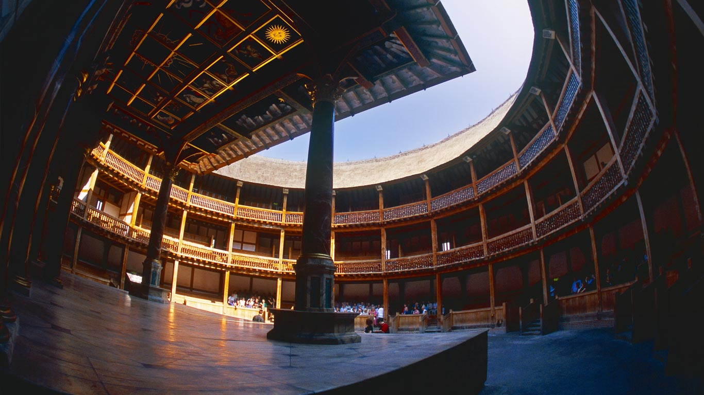

#### 20140423 ｢弘前公園のお濠とオシドリ｣青森, 弘前 (© amanaimages/Corbis)(Bing Japan)

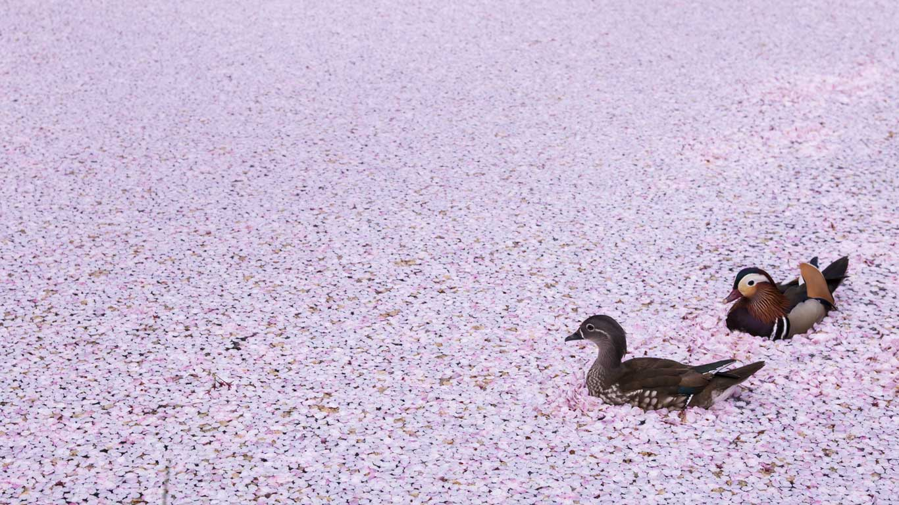

#### 20140423 Sandstone shoreline, Galiano Island, Gulf Islands, BC (© Chris Cheadle/All Canada Photos/Getty Images)(Bing Canada)

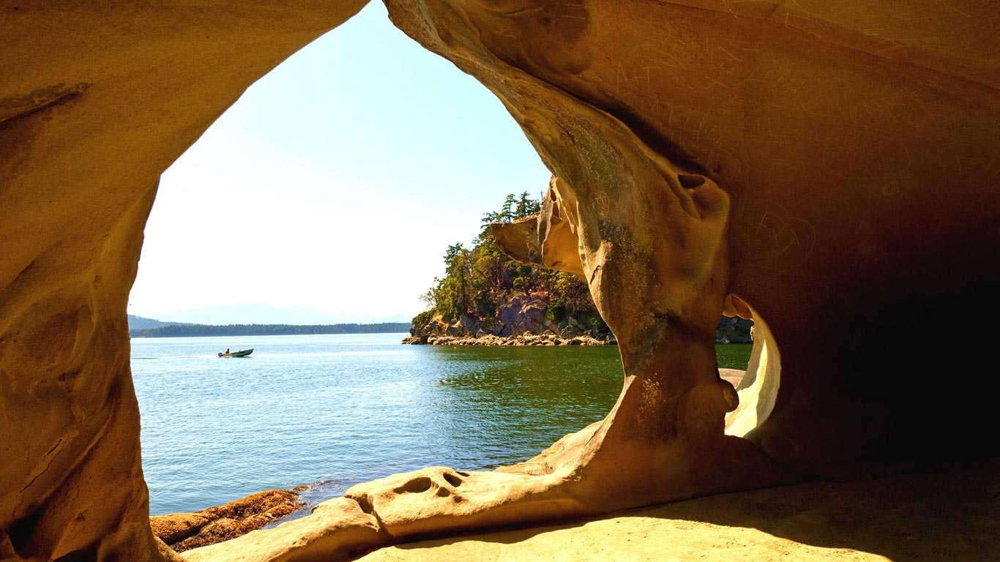

#### 20140423 云南大理，挂在店内的彩色灯笼 (© Dave Terry/Flickr Open/Getty Images)(Bing China)

#### 20140422 2013年1月，北京的清晨 (© CZQS2000/STS/The Image Bank/Getty Images)(Bing China)

#### 20140422 The Living Roof, California Academy of Sciences, Golden Gate Park, San Francisco, California, USA (© Tim Griffith/Corbis)(Bing United Kingdom)

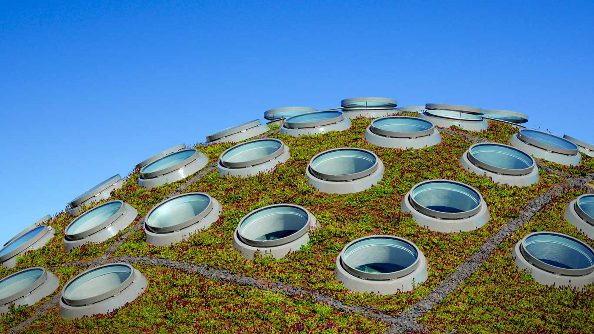

#### 20140422 Runners in the 118th Boston Marathon on Monday, April 21, 2014 (Bill Greene/The Boston Globe/Getty Images)(Bing United States)

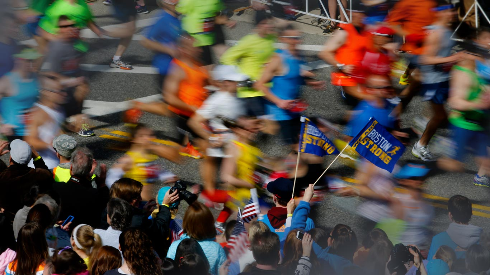

#### 20140421 Leonard P. Zakim Bunker Hill Bridge, Boston, Massachusetts, USA (© Rick Friedman/Corbis)(Bing United Kingdom)

#### 20140421 Kirschblüte (© Janusz Ziob/Flickr/Getty Images)(Bing Deutschland)

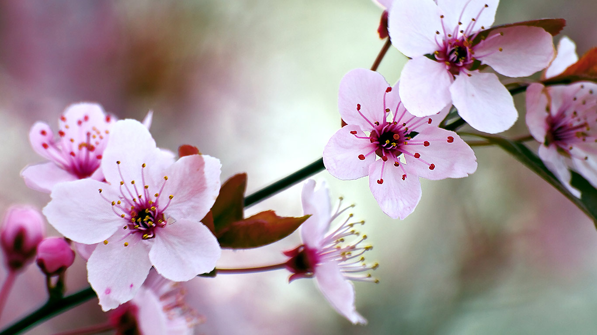

#### 20140420 Duckling (© Life on White/Purestock/SuperStock)(Bing United Kingdom)

#### 20140419 Second Beach, near Olympic National Park and La Push, Washington, USA (© Ian Shive/Tandem)(Bing United Kingdom)

#### 20140418 ｢日本橋｣東京, 中央区 (© Michael Hitoshi/Getty Images)(Bing Japan)

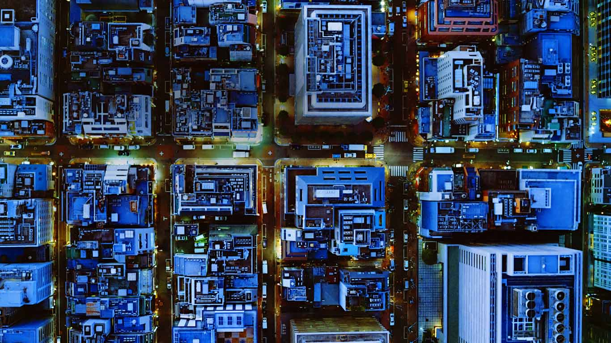

#### 20140418 Trekker on the Sella Group mountain chain, looking down on the road from Badia Valley to Gardena Pass, Dolomites, South Tyrol, Italy (© SIME/eStock Photo)(Bing United Kingdom)

#### 20140417 Cheltenham Badlands near Inglewood, Ontario (© Andrew McLachlan/All Canada Photos/Corbis)(Bing Canada)

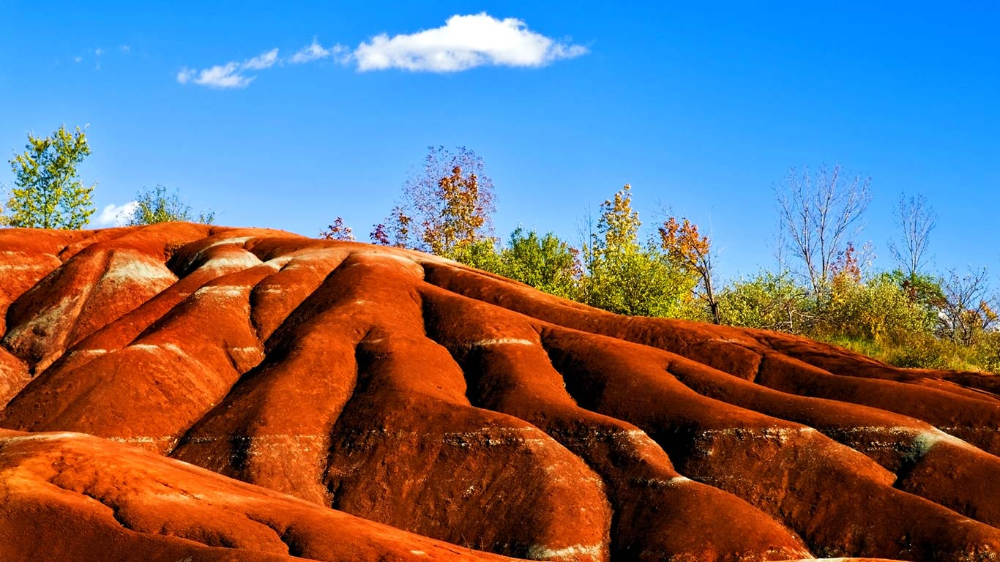

#### 20140417 Sunrise at Lake Kawaguchi seen from Mount Fuji, Japan (© Filip Fuxa/Alamy)(Bing United Kingdom)

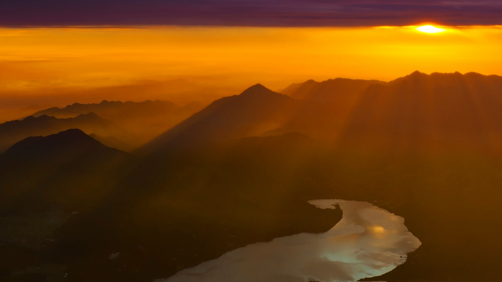

#### 20140416 Sunrise over Remarkable Rocks at Kangaroo Island, South Australia (© Ingo Oeland/Alamy)(Bing Australia)

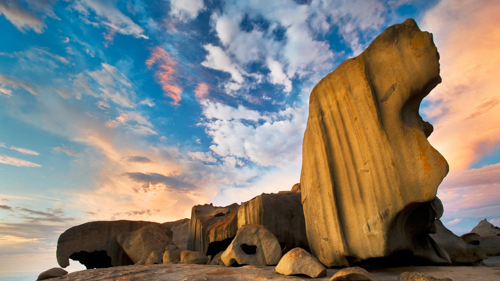

#### 20140416 Under the Intracoastal Waterway Bridge in Jacksonville, Florida, USA (© Greg DiFranza/500px)(Bing United Kingdom)

#### 20140416 Raupe des Buchen-Streckfußes, Nordrhein-Westfalen, Deutschland (© Arco Images/age fotostock)(Bing Deutschland)

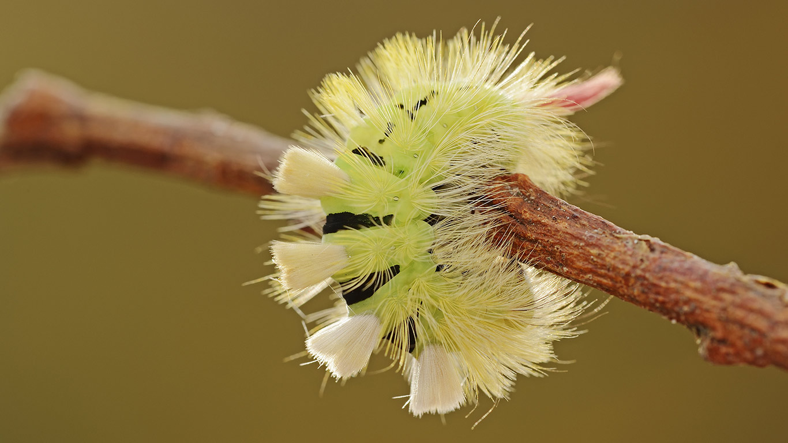

#### 20140416 Passerelle de l’Axe Majeur à Cergy, Val d’Oise, Île-de-France (© Nicolas Thibaut/Getty Images)(Bing France)

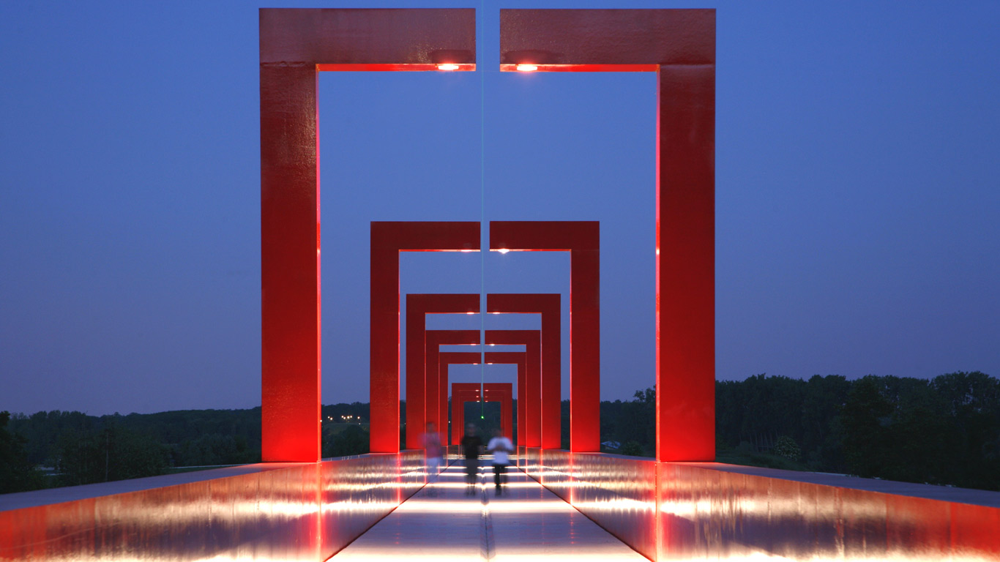

#### 20140415 Guilin and Lijiang River National Park, China (© AirPano Ltd)(Bing United Kingdom)

#### 20140414 ｢西の京大池と薬師寺｣奈良 (© JTB Photo/SuperStock)(Bing Japan)

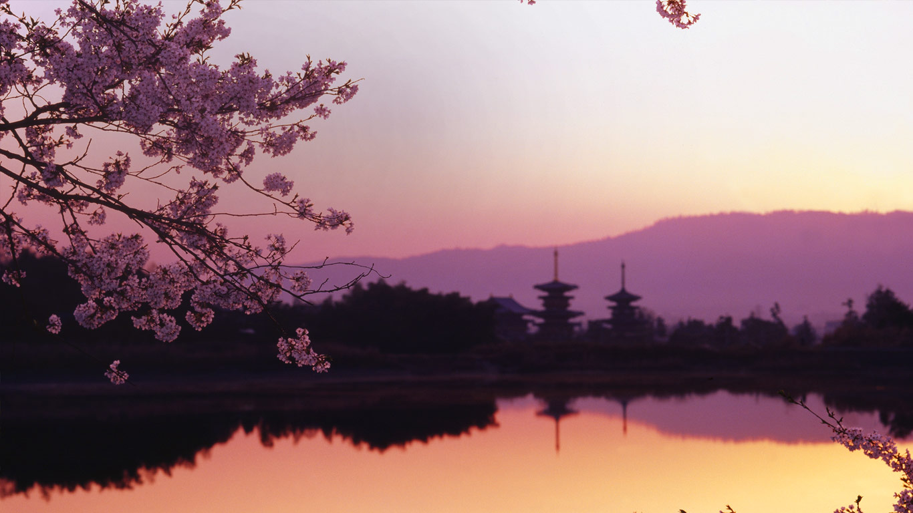

#### 20140414 花海与树林 (© Fotosearch/Getty Images)(Bing China)

#### 20140414 Polar bears, Arctic National Wildlife Refuge, Alaska, USA (© Steven Kazlowski/SuperStock)(Bing United Kingdom)

#### 20140413 The Grand Palace, Bangkok, Thailand (© Amarate Tansawet Gift of Light/Getty Images)(Bing United Kingdom)

#### 20140412 Bourke’s Luck Potholes in Blyde River Canyon, South Africa (© Topic Photo Agency/Corbis)(Bing United Kingdom)

#### 20140411 Day gecko on pandanus fruit, Captain Cook, Hawaii, USA (© Mark A. Johnson/Corbis)(Bing United Kingdom)

#### 20140410 Mountain lion cubs near Bozeman, Montana, USA (© Don Johnston/age fotostock)(Bing United Kingdom)

#### 20140409 Three Sisters Springs, Manatee Sanctuary, Florida, USA (© Mammoth HD)(Bing United Kingdom)

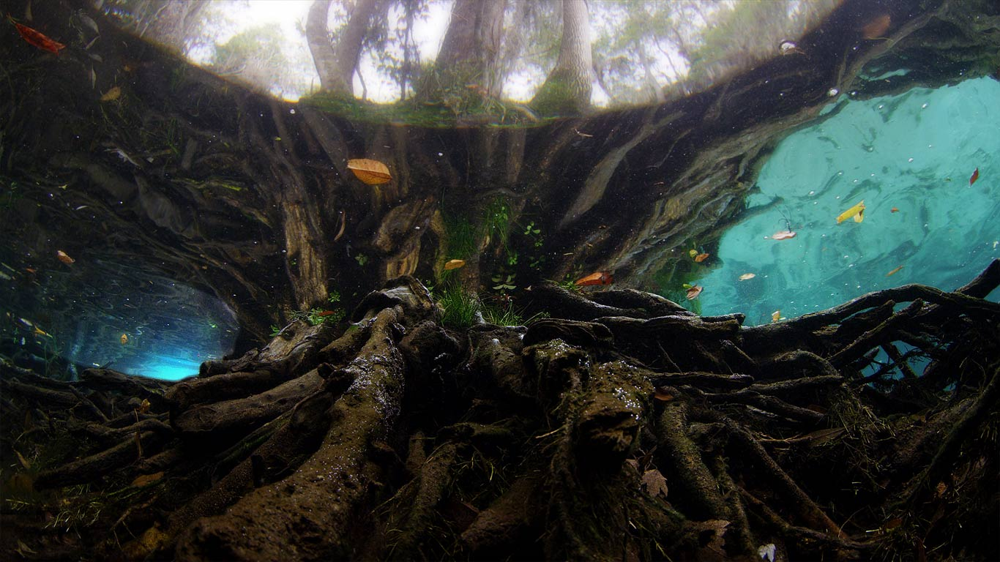

#### 20140409 黄昏时分的上海董家渡，通往南浦大桥的环岛 (© Laurie Noble/The Image Bank/Getty Images)(Bing China)

#### 20140408 Stuttgart City Library, Mailänder Platz in Stuttgart, Germany (© Guillaume Rio/500px)(Bing United Kingdom)

#### 20140408 Spinifex pigeons at Purnululu National Park, Western Australia (© Auscape/Universal Images Group/Getty Images)(Bing Australia)

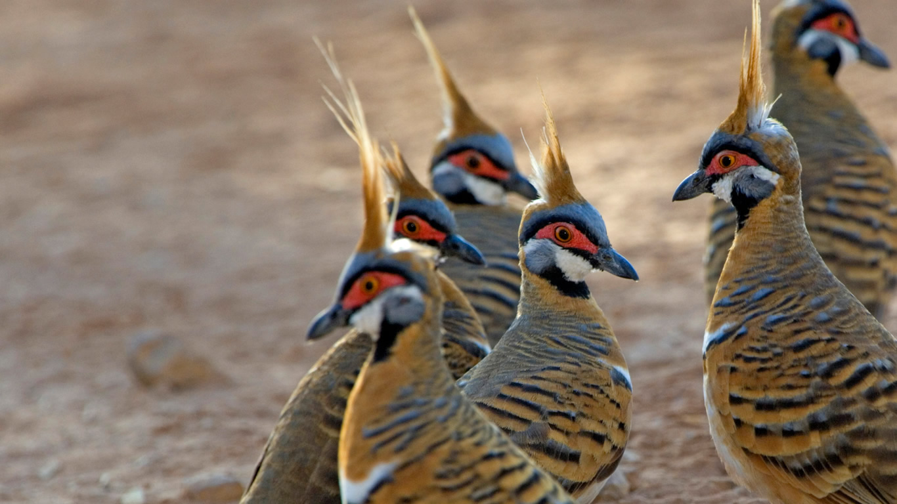

#### 20140408 Châteaux de Lastours près de Carcassonne, département de l’Aude, Languedoc-Roussillon (© Shaun Egan/Getty Images)(Bing France)

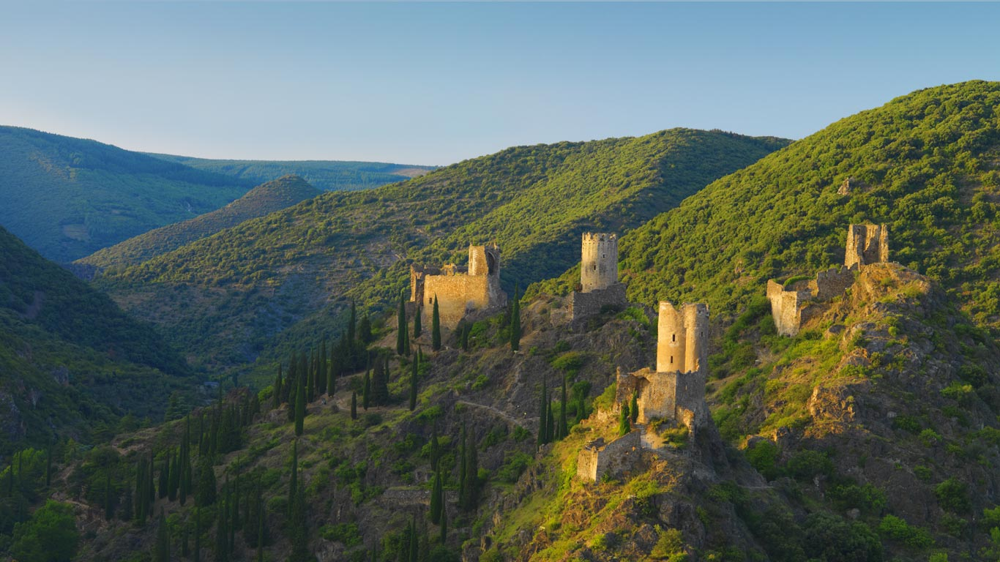

#### 20140408 ｢千鳥ヶ淵｣東京, 皇居 (© Photononstop/SuperStock)(Bing Japan)

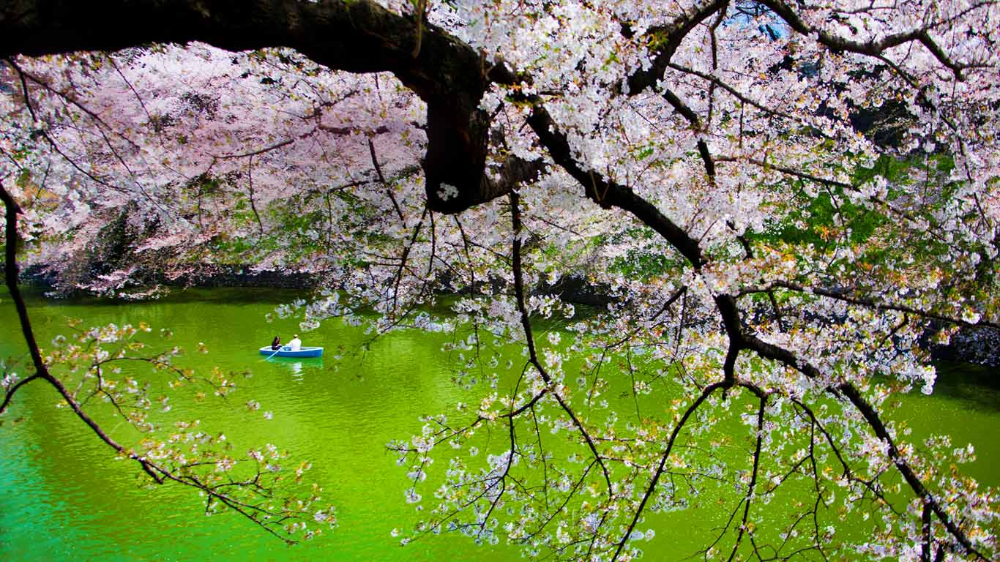

#### 20140407 North American beaver in Denali National Park, Alaska, USA (© Eastcott Momatiuk/Masterfile)(Bing United Kingdom)

#### 20140407 Fireweed, or rosebay willowherb epilobium angustifolium after a forest fire, Yukon (© Blake Kent/Design Pics/age fotostock)(Bing Canada)

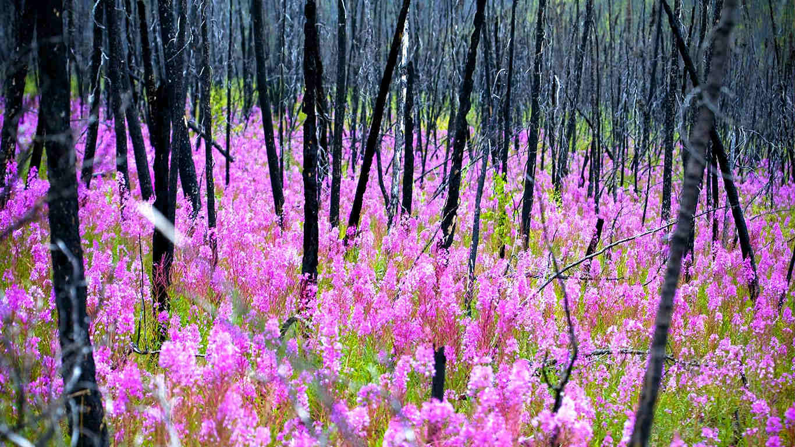

#### 20140407 Berggasthaus Aescher-Wildkirchli, Alpstein, Kanton Appenzell Innerrhoden, Schweiz (© Gerth Roland/Prisma/age fotostock)(Bing Deutschland)

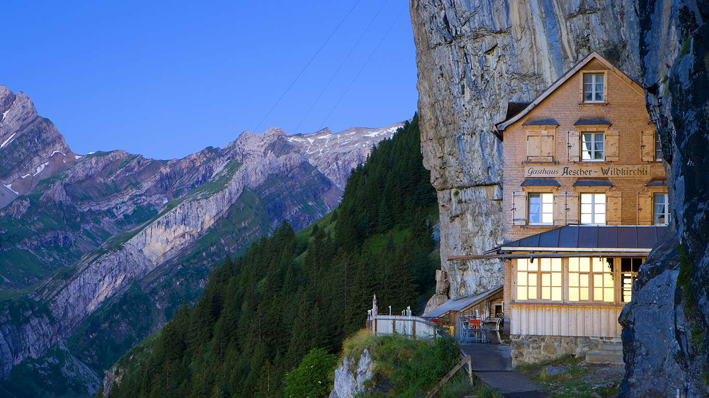

#### 20140406 Hammersmith Bridge, London (© dimmilan/Getty Images)(Bing United Kingdom)

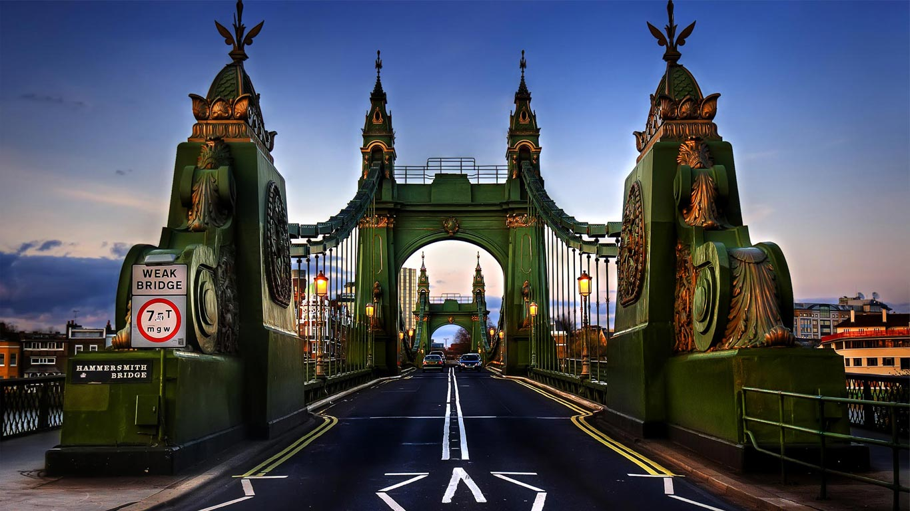

#### 20140405 Detail of a leaf in Niah National Park in Sarawak, Borneo, Malaysia (© Thomas Marent/Minden Pictures)(Bing United Kingdom)

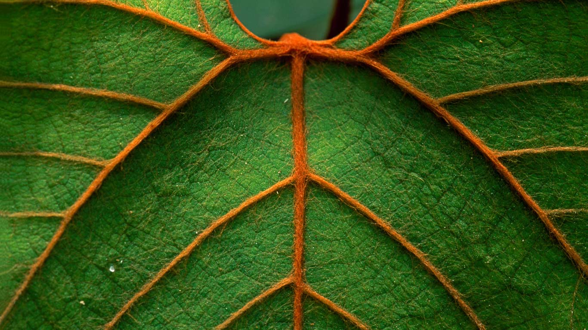

#### 20140405 庐山 (© Zoonar GmbH/Alamy)(Bing China)

#### 20140404 Saint Beatus Caves near the village of Beatenberg, Switzerland (© Getty Images)(Bing United Kingdom)

#### 20140404 Lever du soleil dans le delta du Mékong, Vietnam (© HNH Images/Getty Images)(Bing France)

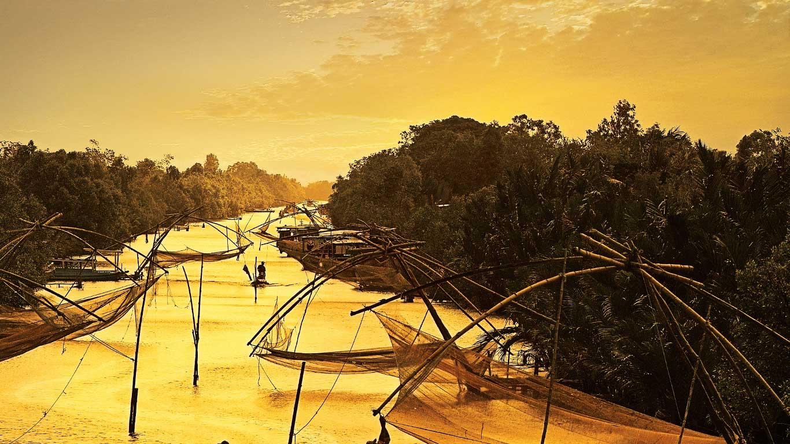

#### 20140403 Saint Patrick’s Well, Orvieto, Italy (© José Antonio Moreno/age fotostock)(Bing United Kingdom)

#### 20140403 Microphotograph of giant salvinia, a water fern (© Martin Oeggerli/Visuals Unlimited, Inc.)(Bing United States)

#### 20140403 红土地上空的彩虹 (© Fotosearch/Getty Images)(Bing China)

#### 20140403 ｢大阪市中央公会堂｣大阪, 北区 (© JTB Photo/SuperStock)(Bing Japan)

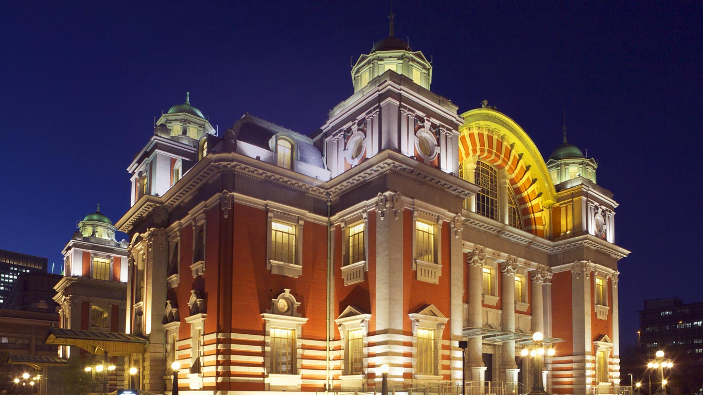

#### 20140403 Daffodil farm  under rainbow, Saanich Peninsula, Vancouver Island, British Columbia, Canada (© Chris Cheadle/All Canada Photos/Getty Images)(Bing Canada)

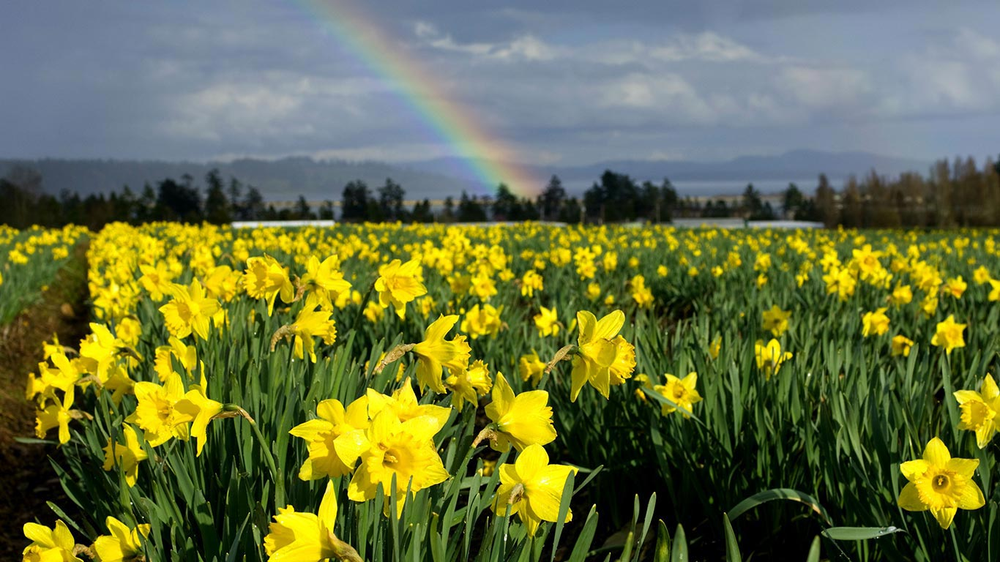

#### 20140402 Snow gums in Kosciuszko National Park, Thredbo, New South Wales (© Ignacio Palacios/Lonely Planet Images/Getty Images)(Bing Australia)

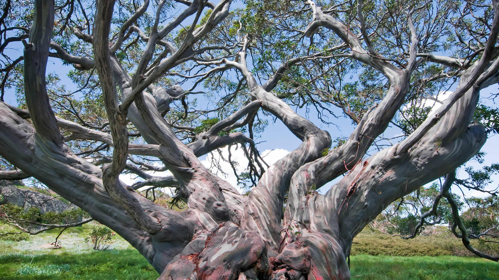

#### 20140402 Falkirk Wheel in Scotland (© David Queenan/500px)(Bing United Kingdom)

#### 20140401 Blick über die Großen Ostersee in Richtung Zugspitze, Bayern, Deutschland (© Florian Werner/Lokok/age fotostock)(Bing Deutschland)

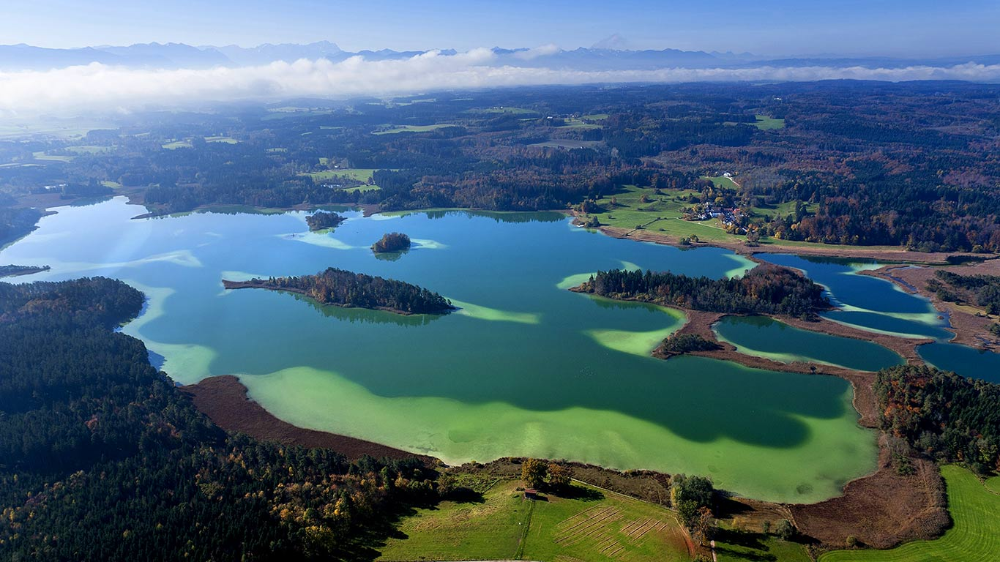

#### 20140401 Eurasian wren in Kōfu, Tottori, Japan (© Photo: CorbisMotion/Music: Getty Images)(Bing United Kingdom)

