#### 20140531 A young Galápagos sea lion on South Plaza Island, Galápagos archipelago, Ecuador (© Michael Durham/Tandem Stock)(Bing United Kingdom)

#### 20140530 ｢水郷佐原水生植物園｣千葉, 香取市 (© JTB Photo Communications, Inc./age fotostock)(Bing Japan)

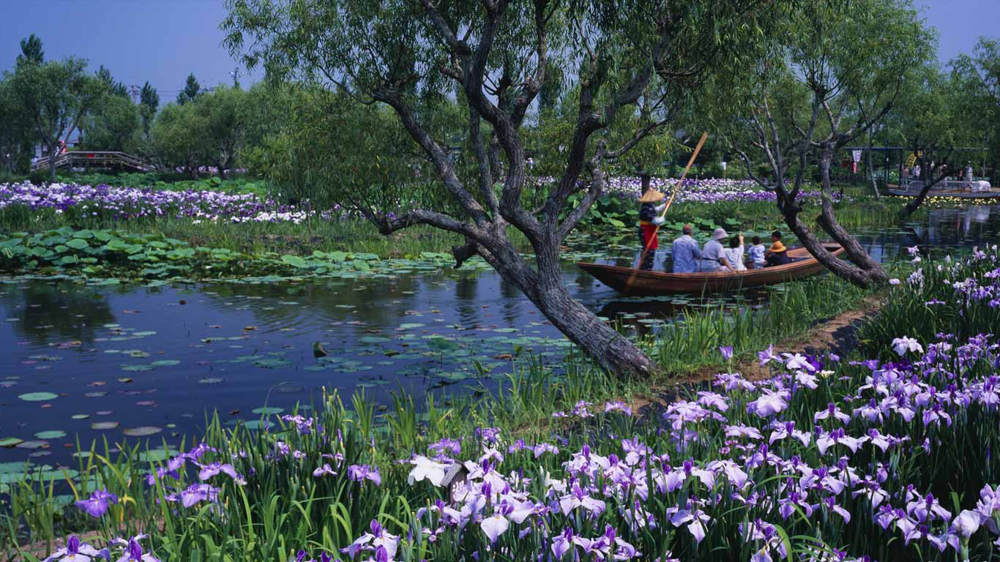

#### 20140530 Danyang County in North Chungcheong Province, South Korea (© Sungjin Kim/500px)(Bing United Kingdom)

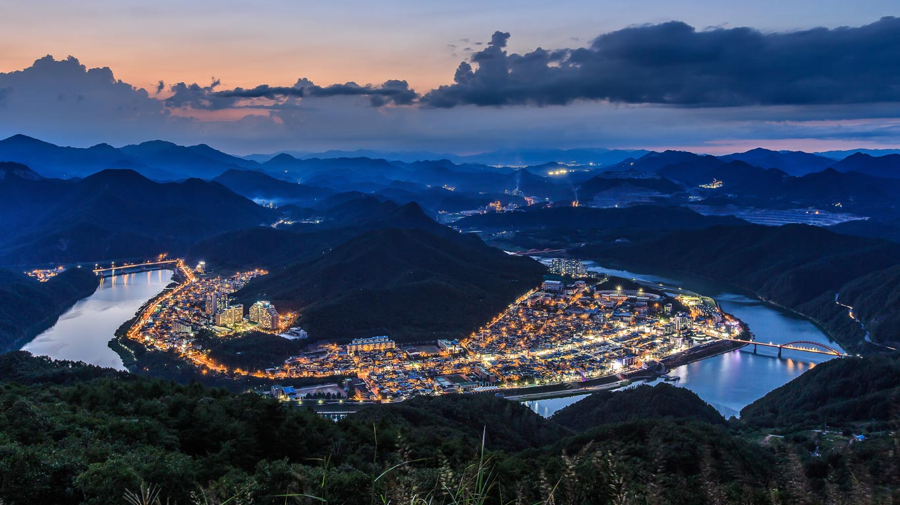

#### 20140530 上海七宝古镇，可爱的红豆兔子 (© Photography by Berengere Treluyer/Moment/Getty Images)(Bing China)

#### 20140529 Ha Long Bay, Vietnam (© AirPano)(Bing United Kingdom)

#### 20140528 Printing press letters (© REX/Design Pics Inc)(Bing United Kingdom)

#### 20140527 Greenwich Foot Tunnel, London (© joe daniel price/Getty Images)(Bing United Kingdom)

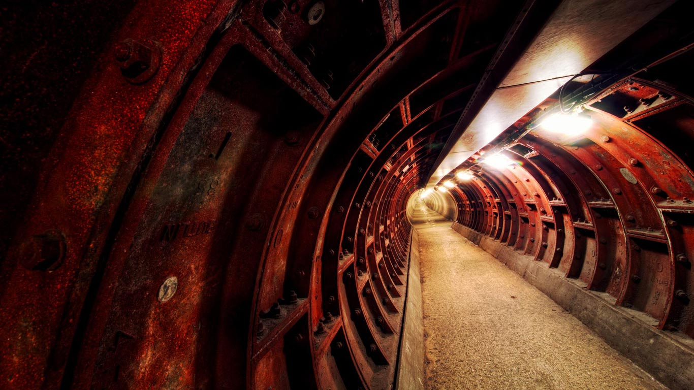

#### 20140527 La Petite Île and Ile d'Er, Plougrescant, Cotes d’Armor, France (© Leroy Francis/Hemis/Corbis)(Bing Canada)

#### 20140527 Cliffs and lighthouse at Beachy Head, East Sussex, England (© Malcolm Park/Corbis)(Bing United States)

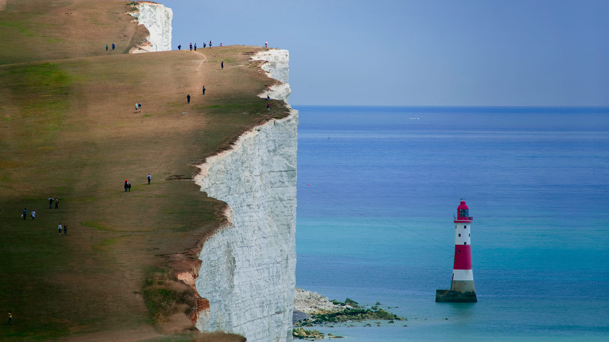

#### 20140527 Bay Marker lookout near Sydney Olympic Park, New South Wales (© Phillip Hayson/Iconica/Getty Images)(Bing Australia)

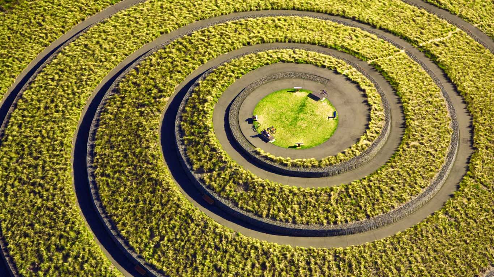

#### 20140526 Stereographic projection of False Creek and Science World.  View of South False Creek and Science World. Vancouver, British Columbia, Canada (© Randy Kosek/National Geographic Society/Corbis)(Bing United Kingdom)

#### 20140526 Aerial shot of Tofino with Clayoquot Sound, British Columbia, Canada (© Arnab Banerjee/Tandem Still + Motion)(Bing Canada)

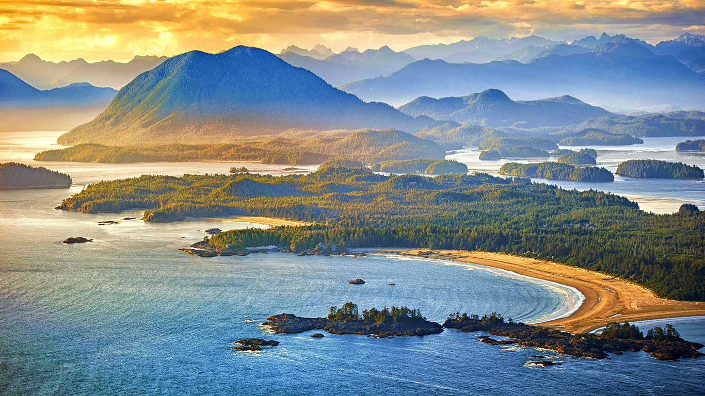

#### 20140526 Field of flags displayed for Memorial Day, Boston, Massachusetts (© Paul Marotta/Getty Images)(Bing United States)

#### 20140525 Aerial view of Petra, Jordan (© Annie Griffiths Belt/Getty Images)(Bing United Kingdom)

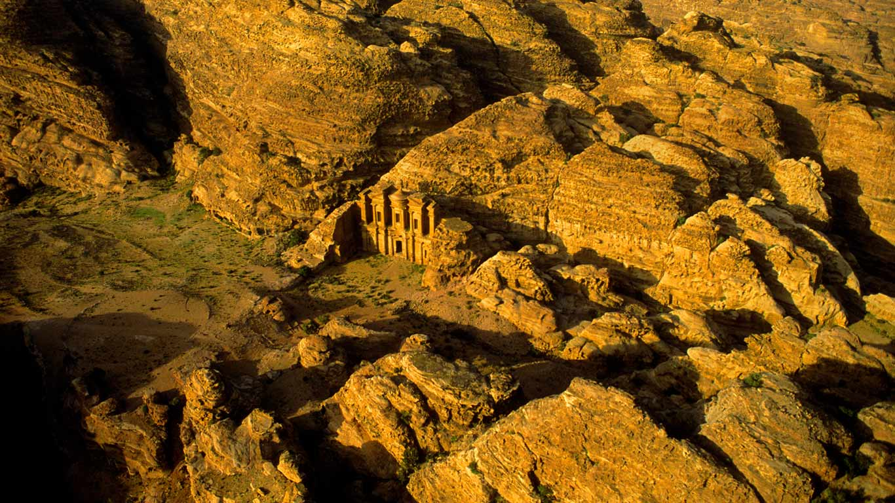

#### 20140525 夕阳下雄伟的山川 (© Ka Wing Yu/Alamy)(Bing China)

#### 20140525 Plage de Cannes au coucher du soleil, Alpes-Maritimes, Provence-Alpes-Côte d’Azur (© pbnj productions/Getty Images)(Bing France)

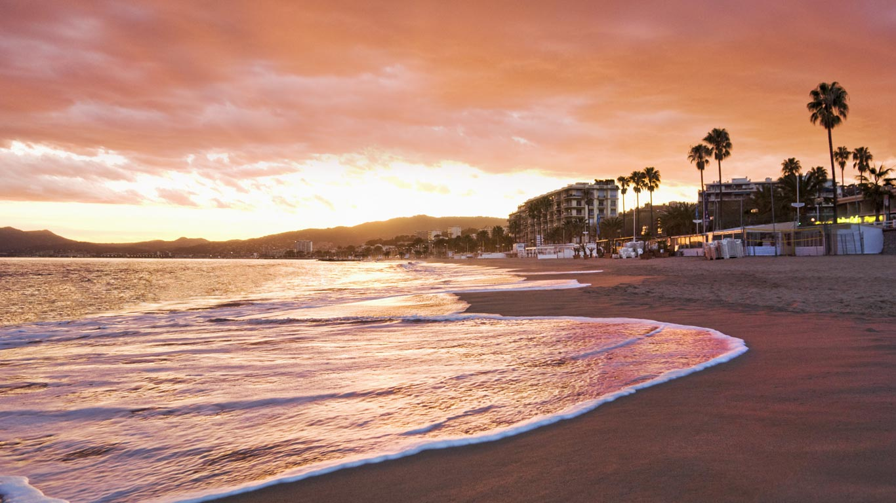

#### 20140524 草地上两只小羊驼 (© Juniors Bildarchiv GmbH/Alamy)(Bing China)

#### 20140524 The Murinsel in Graz, Austria (© REX/WestEnd61)(Bing United Kingdom)

#### 20140524 Flamingos take flight, Lake Magadi, Kenya (© Bobby Haas/Getty Images)(Bing United States)

#### 20140523 2006年3月南乔治亚岛圣安德鲁斯海湾，国王企鹅与南极海狗 (© Paul Souders/Photodisc/Getty Images)(Bing China)

#### 20140523 Angel Oak Tree, Johns Island, South Carolina, USA (© Haraldur Stefansson/Alamy)(Bing United Kingdom)

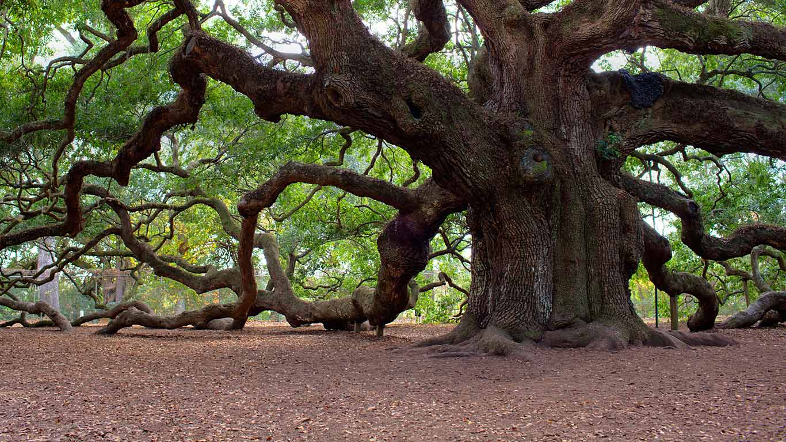

#### 20140522 ｢東京スカイツリー｣東京, 墨田区 (© SHENYANG's PHOTO. ALL RIGHTS RESERVED./Flickr/Getty Images)(Bing Japan)

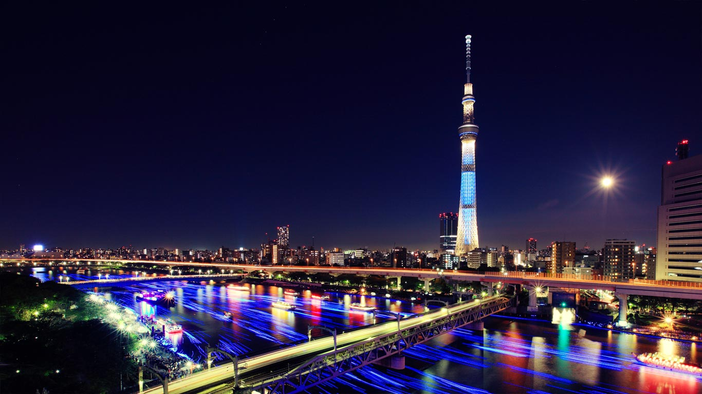

#### 20140522 大西洋灰海豹，宝宝正在努力唤醒它熟睡的妈妈 (© Richard McManus/Moment Open/Getty Images)(Bing China)

#### 20140522 London Eye, Big Ben, and Palace of Westminster, London (© Gavin Hellier/Alamy)(Bing United Kingdom)

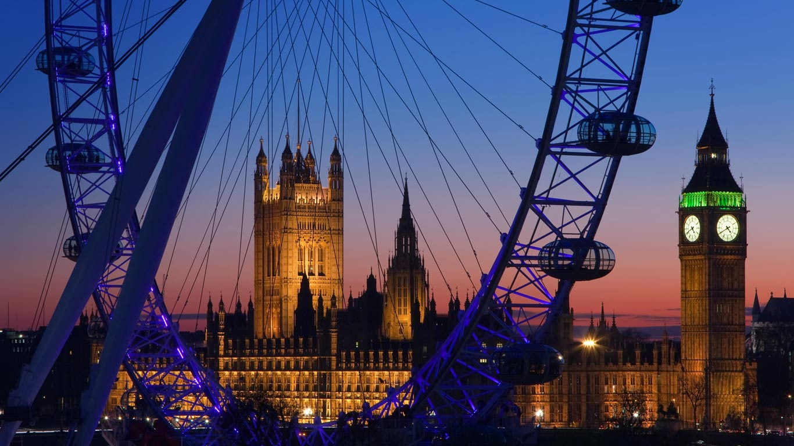

#### 20140521 Castle Butte, Big Muddy Badlands, Saskatchewan, Canada (© Dave Reede/All Canada Photos/Getty Images)(Bing Canada)

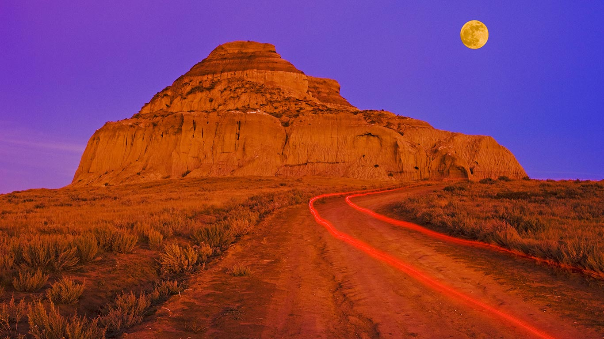

#### 20140521 罂粟果实 (© blickwinkel/Alamy)(Bing China)

#### 20140521 Vue aérienne de la réserve ornithologique de l'Île-d'Olonne, Vendée, Pays de la Loire (© LEROY Francis/Hemis/Corbis)(Bing France)

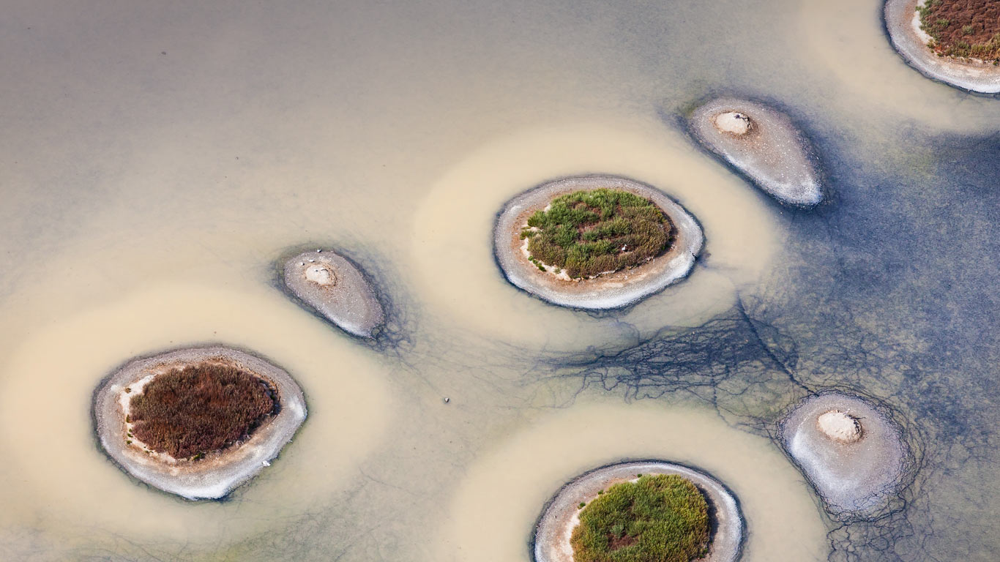

#### 20140521 Iguazu River, Brazil (© Frans Lanting/Corbis)(Bing United Kingdom)

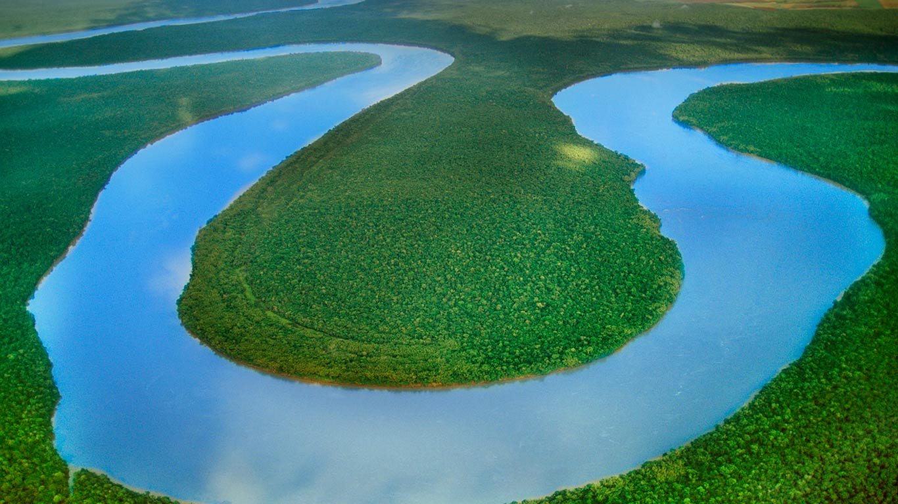

#### 20140521 Luftbild der Insel Frauenchiemsee mit dem Kloster Frauenwörth im Hintergrund, Chiemsee, Chiemgau, Bayern, Deutschland (© Florian Werner/Look/age fotostock)(Bing Deutschland)

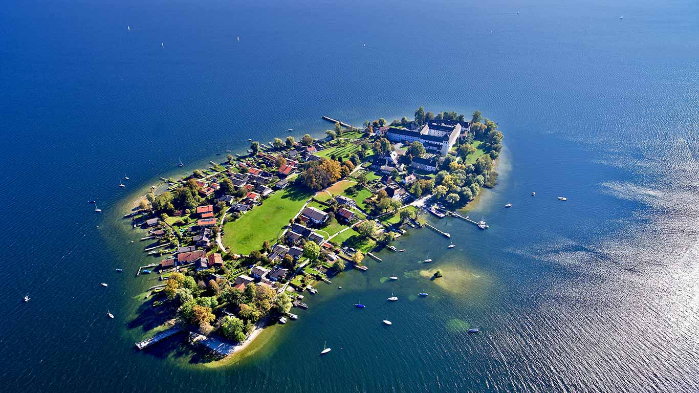

#### 20140520 Compound eye of a female Asian tiger mosquito (© Dennis Kunkel Microscopy, Inc./Corbis)(Bing United Kingdom)

#### 20140520 ｢安房森林軌道｣鹿児島, 屋久島 (© B.SCHMID/amanaimages/Corbis)(Bing Japan)

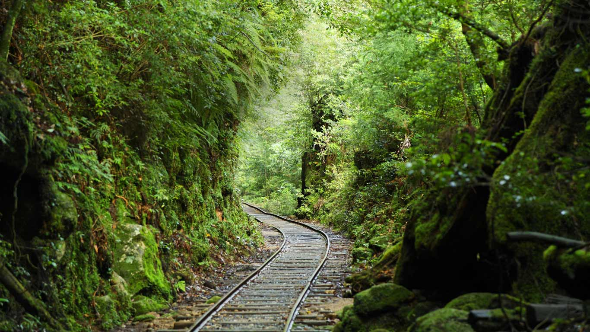

#### 20140519 Boathouse on Matilda Bay in Perth, Western Australia (© Timothy Chai/Moment Open/Getty Images)(Bing Australia)

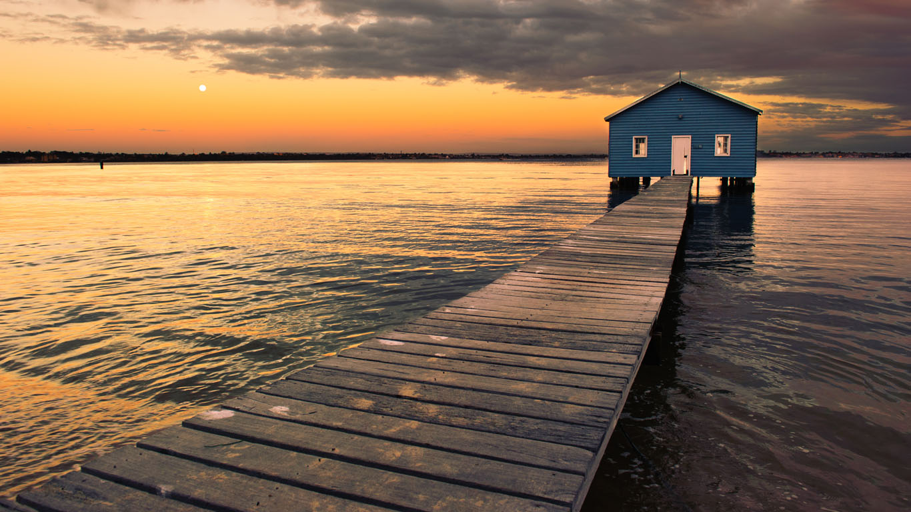

#### 20140519 Herzliya, Israel (© Dima Shapira/500px)(Bing United Kingdom)

#### 20140518 Housing development, West Palm Beach, Florida, USA (© Paul Nicklen/Corbis)(Bing United Kingdom)

#### 20140517 新加坡，从裕廊湖眺望裕华园(中国花园) (© Salvador III Manaois/Alamy)(Bing China)

#### 20140517 La « Chenille », escalier mécanique du Centre Pompidou, Paris (© Nathalie Darbellay/Sygma/Corbis)(Bing France)

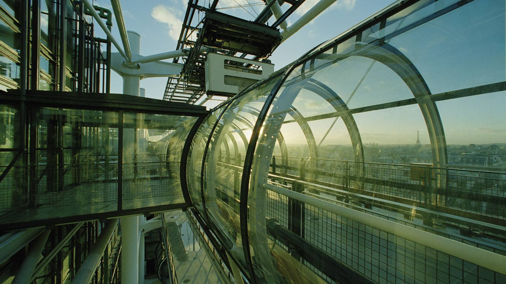

#### 20140517 Laval-du-Tarn, Lozère, Languedoc-Roussillon, France (© Franck Charton/hemis.fr/Getty Images)(Bing United Kingdom)

#### 20140517 Graduation celebration, United States Air Force Academy, with U.S. Air Force Thunderbirds, Colorado Springs, Colorado (© Leigh Vogel/Corbis)(Bing United States)

#### 20140516 ｢国立科学博物館｣東京, 上野公園 (© Koichi Kamoshida/Jana Press/ZUMAPRESS.com)(Bing Japan)

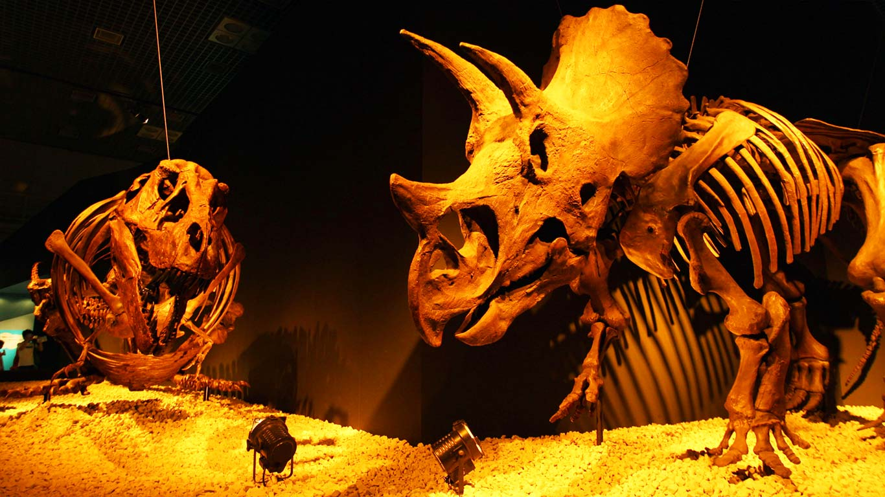

#### 20140516 中国传统点心、蜜饯与茶 (© BJI/Blue Jean Images/Getty Images)(Bing China)

#### 20140516 Close-up of bicycle chain (© Ocean/Corbis)(Bing United States)

#### 20140516 Orange lichen-covered rocks at Bay of Fires, Tasmania (© John White Photos/Moment Open/Getty Images)(Bing Australia)

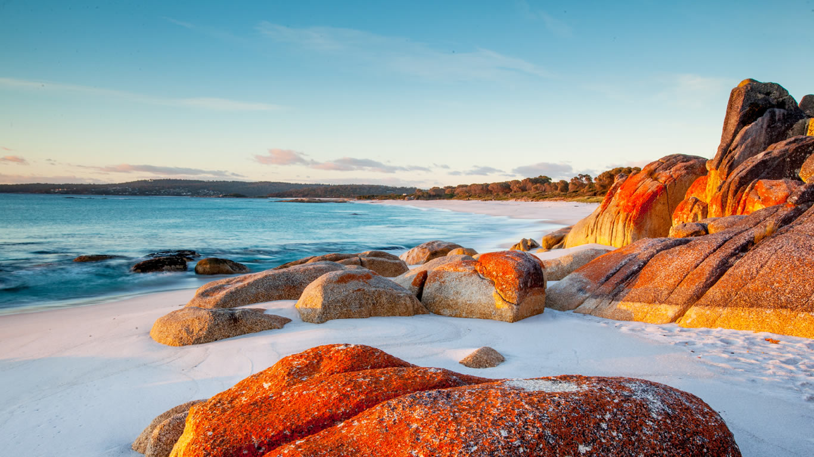

#### 20140516 Axolotl (© John Cancalosi/Getty Images)(Bing United Kingdom)

#### 20140515 Dwarf forest of Oaks, Loch na Keal, Isle of Mull © (Marc Muench/Tandem Stills + Motion)(Bing United Kingdom)

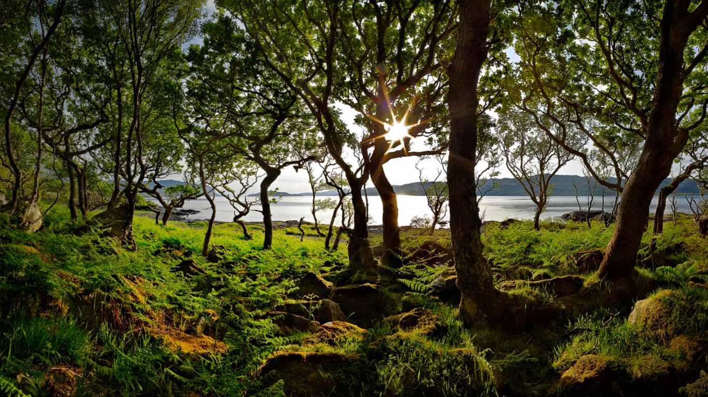

#### 20140514 台湾，日月潭 (© Nicholas Han/Alamy)(Bing China)

#### 20140514 St. Louis skyline and Gateway Arch, Missouri, USA (© Mary Ann Melton/Alamy)(Bing United Kingdom)

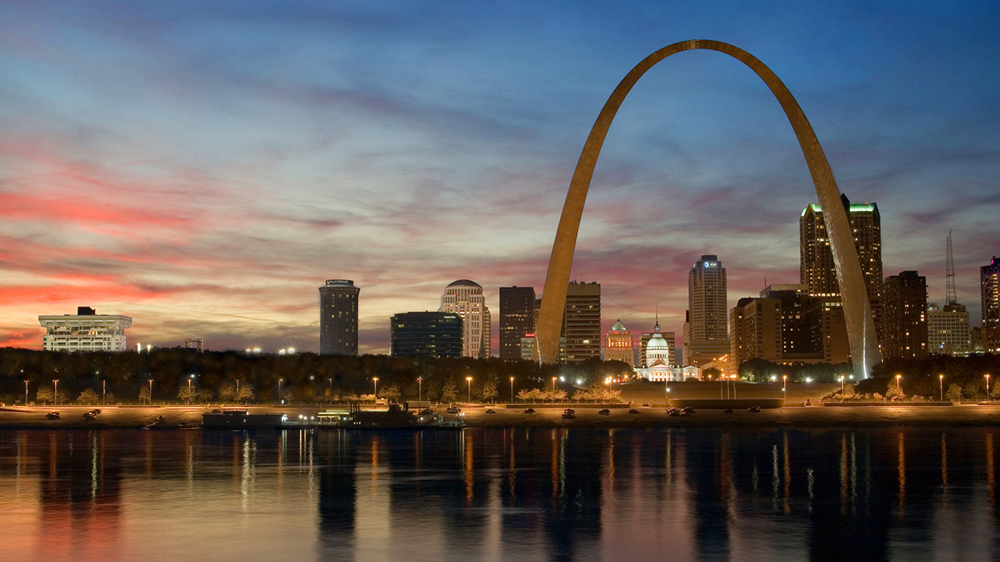

#### 20140513 Bohemian Switzerland National Park, Czech Republic (© Filip Molcan/500px)(Bing United Kingdom)

#### 20140512 Princes Pier at dusk, Melbourne, Australia (© Getty Images)(Bing United Kingdom)

#### 20140511 Moose cow and calf, Kincaid Park, Anchorage, Alaska (© Michael Jones/Corbis)(Bing United States)

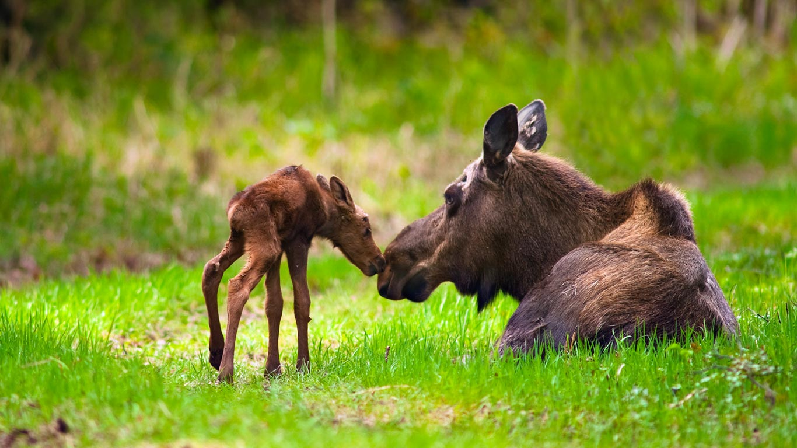

#### 20140511 Kingfishers, Taipei, Taiwan (© htu/Flickr Select/Getty Images)(Bing United Kingdom)

#### 20140510 加拿大马尼托巴省，瓦普斯克国家公园中的北极熊 (© Thomas Kokta/Photographer's Choice/Getty Images)(Bing China)

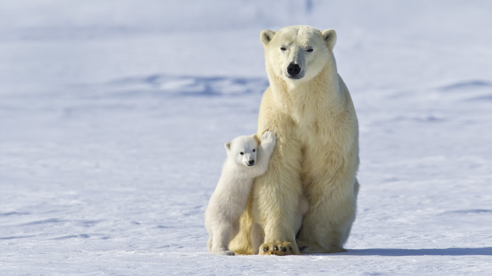

#### 20140510 Saturn, photographed from NASA's Cassini–Huygens spacecraft (© NASA/JPL-Caltech/SSI)(Bing United Kingdom)

#### 20140509 Lincoln Cathedral, Lincoln, England (© Mark Sykes/Corbis)(Bing United Kingdom)

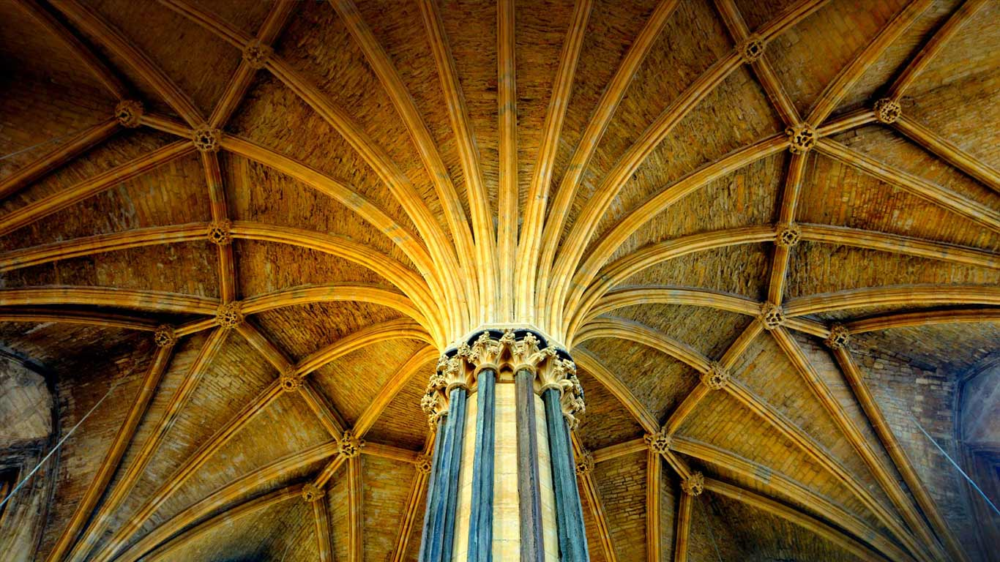

#### 20140509 Alter Elbtunnel, Hamburg (© sah/Alamy)(Bing Deutschland)

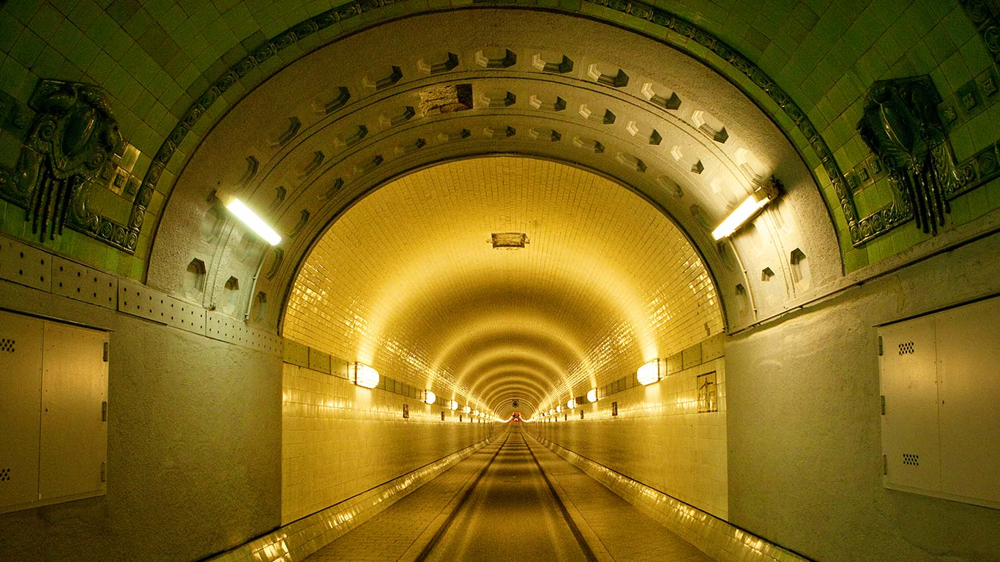

#### 20140509 美国明尼苏达州的土拨鼠 (© Jack Milchanowski/Visuals Unlimited, Inc/Getty Images)(Bing China)

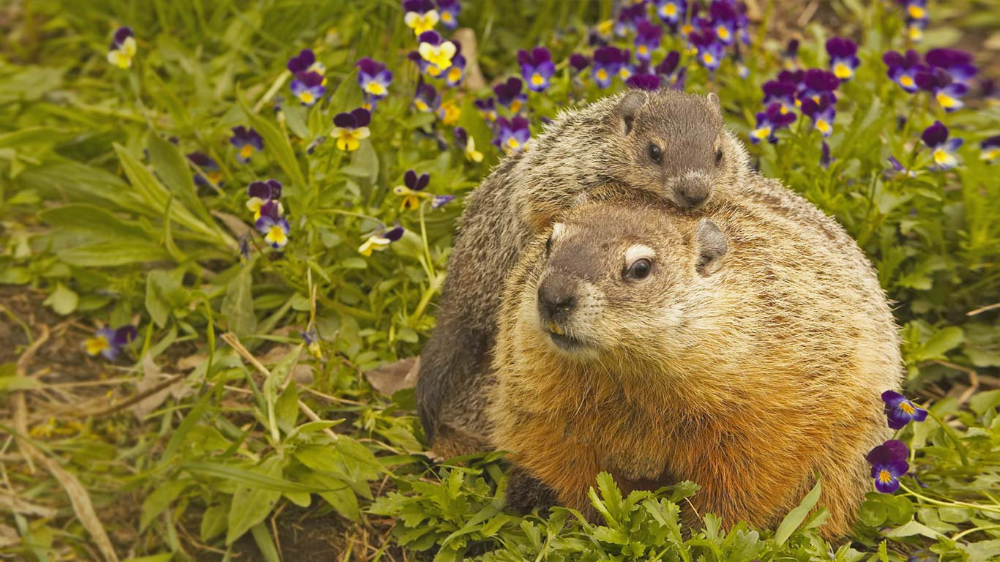

#### 20140508 ｢アクアチューブ｣神奈川, 横浜 (© TB Photo/SuperStock)(Bing Japan)

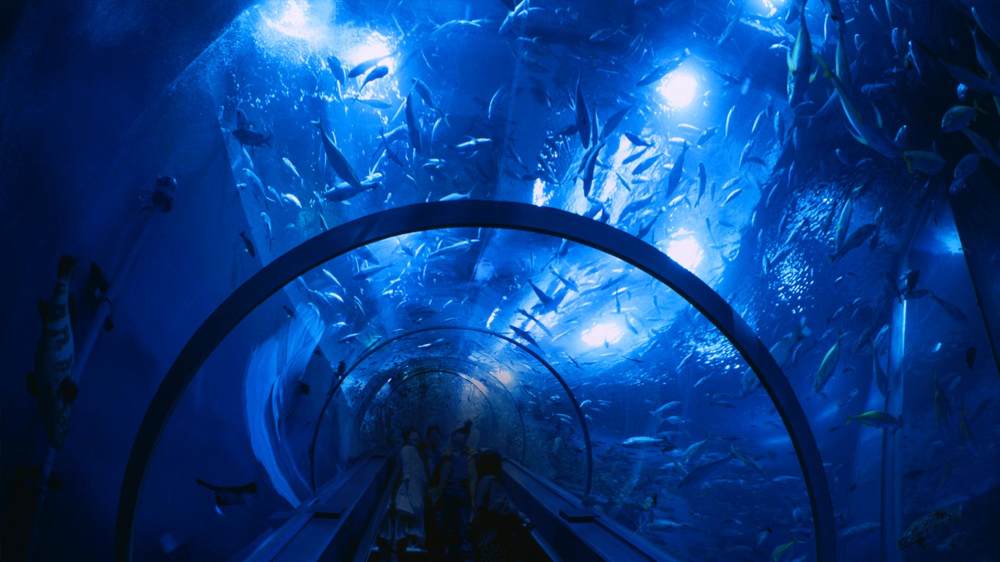

#### 20140508 Lichen on rocks, Desolation Canyon, Utah, USA (© Carr Clifton/Minden Pictures)(Bing United Kingdom)

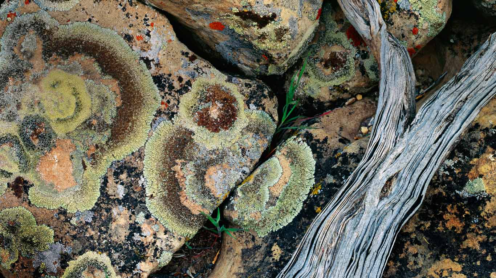

#### 20140508 Sunrise at the Blue Pool in Bermagui, New South Wales (© John Hay/Lonely Planet Images/Getty Images)(Bing Australia)

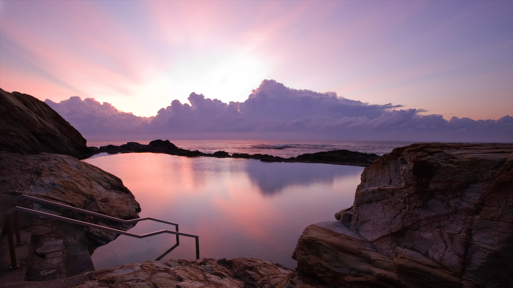

#### 20140507 Hanging bridge across Tsocowis Creek, West Coast Trail on Vancouver Island, British Columbia, Canada (© Sergio Ballivian/Tandem Stock)(Bing United Kingdom)

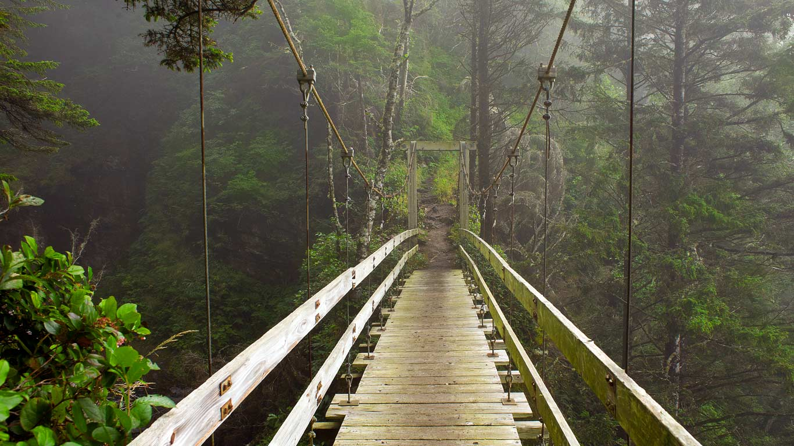

#### 20140506 East African oryx herd, Solio Game Reserve in Kenya's Great Rift Valley (© Paul Benson/fotoLibra)(Bing United Kingdom)

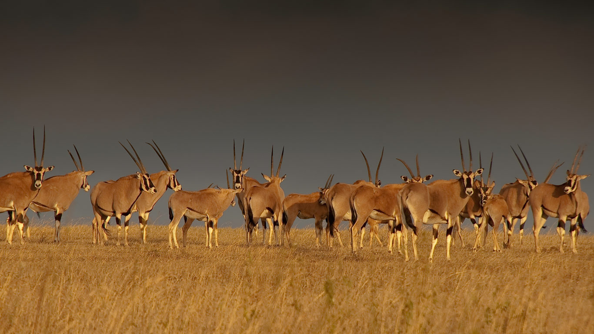

#### 20140506 Abendstimmung am Strand von Borkum, Ostfriesische Inseln, Niedersachsen (© Sabine Lubenow/4Corners)(Bing Deutschland)

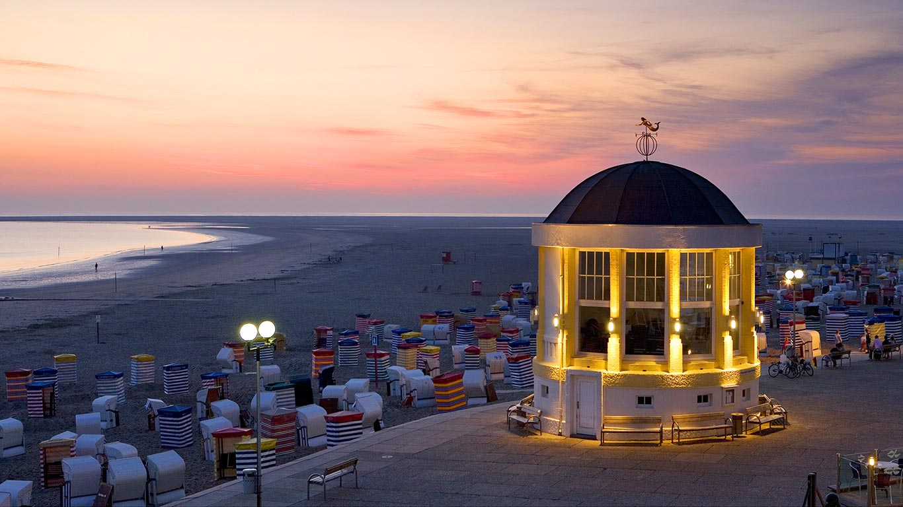

#### 20140505 Convento de San Gabriel monastery, San Pedro Cholula, Puebla, Mexico (© Florian Kopp/Alamy)(Bing United Kingdom)

#### 20140504 Celebes crested macaque mature male, Tangkoko National Park, Sulawesi, Indonesia (© Anup Shah/Corbis)(Bing United Kingdom)

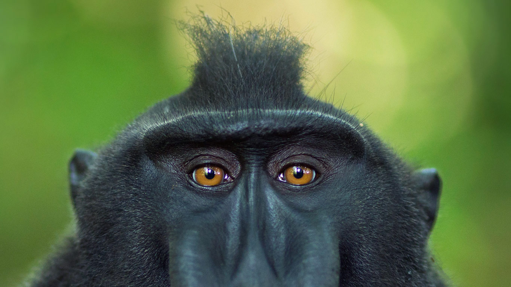

#### 20140503 Arc de Triomphe de l'Étoile, Paris, France (© Sebastian Helmke/500px)(Bing United Kingdom)

#### 20140503 在纪念品商店出售的传统中国扇子 (© Boaz Rottem/Flickr/Getty Images)(Bing China)

#### 20140502 Time lapse of Berlin skyline at night (© Schroptschop/Getty Images)(Bing United Kingdom)

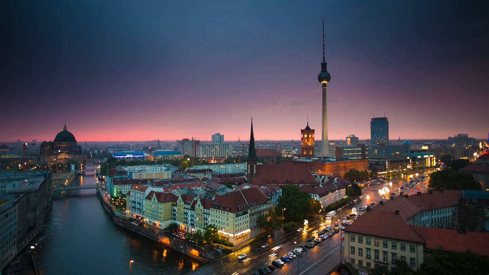

#### 20140501 People gather for a Beltane dawn celebration service in front of St Michael's Tower on Glastonbury Tor, England (© Matt Cardy/Getty Images)(Bing United Kingdom)

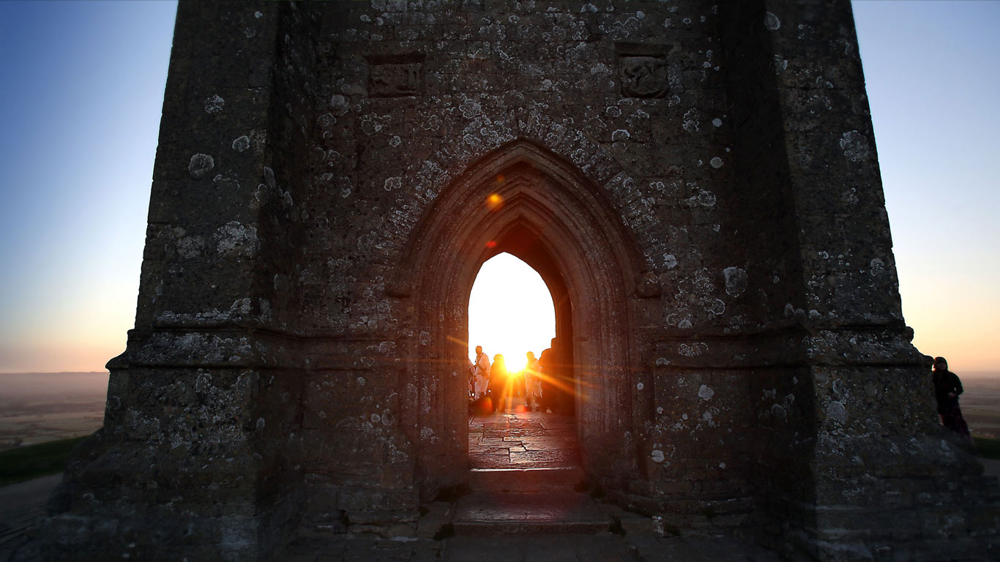

#### 20140501 American Lakes area of State Forest State Park in Colorado (© Gallery Stock)(Bing United States)

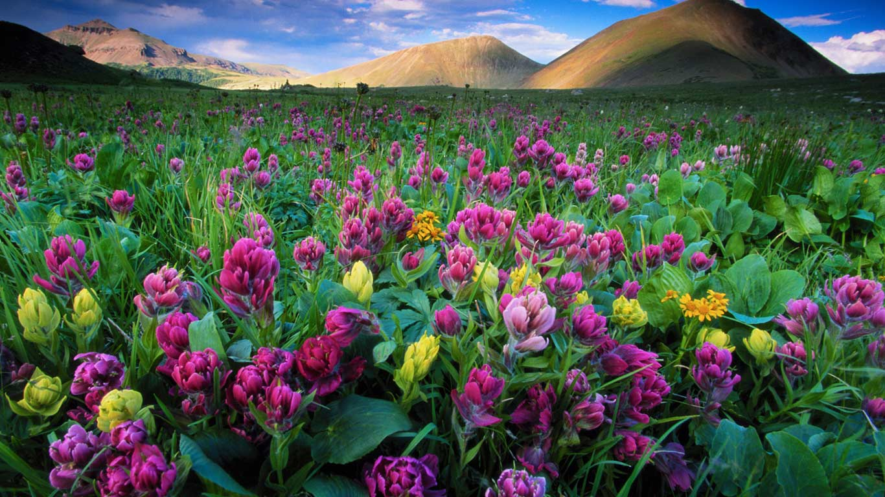

