#### 20140630 The Sunnmøre Alps over Hjørundfjorden, Norway (© AirPano)(Bing United Kingdom)

#### 20140629 Accumulation of rain water in the Sahara Desert, east of the Aïr Mountains, Niger (© Michael Fay/Aurora Photos)(Bing United Kingdom)

#### 20140628 Pier at Old Orchard Beach, Maine, USA (© Michael Orso/Tandem Stock)(Bing United Kingdom)

#### 20140627 Deutschlands Thomas Müller (2. v.r.) feiert das 1:0 mit seinen Teamkameraden im Spiel gegen die USA bei der FIFA-Fußballweltmeisterschaft 2014 in Recife, Brasilien, am 26. 6. 2014 (©Alex Livesey/FIFA/FIFA via Getty Images)(Bing Deutschland)

#### 20140627 ｢龍源寺間歩｣島根, 石見銀山 (© JTB Photo Communications, Inc./age fotostock)(Bing Japan)

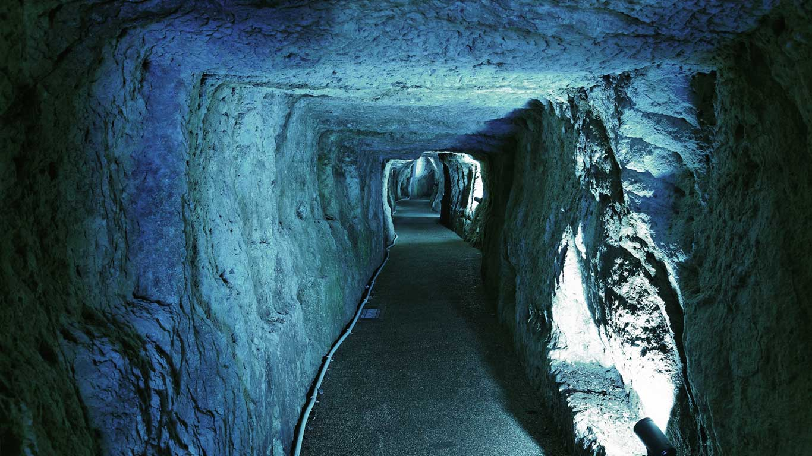

#### 20140627 Great crested grebes with chick (© Jasper Doest/Minden Pictures)(Bing United Kingdom)

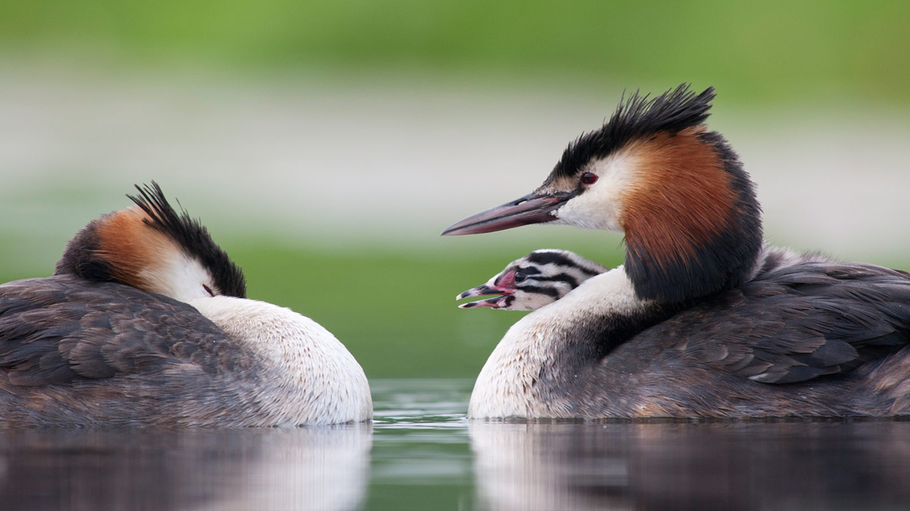

#### 20140627 云南丽江，东巴文化 (© Bruce Yuanyue Bi/Lonely Planet Images/Getty Images)(Bing China)

#### 20140627 Hoodoos at Sunset in Dinosaur Provincial Park, Alberta (© Eryk Jaegermann/Design Pics/Corbis)(Bing Canada)

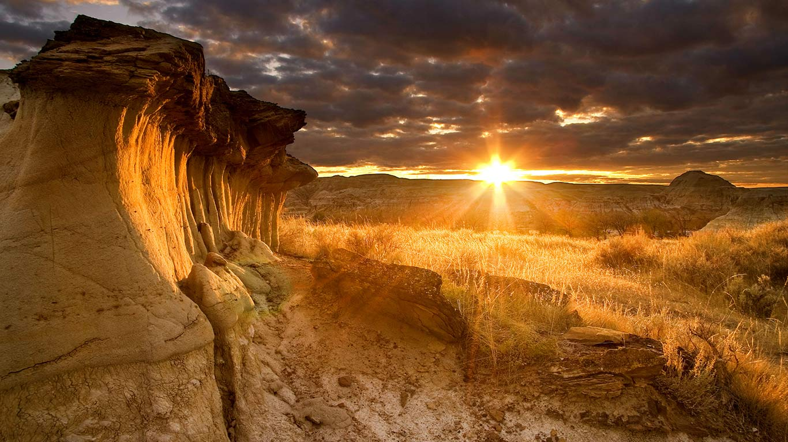

#### 20140627 Fish swimming near the Aquarius Reef Base in the Florida Keys National Marine Sanctuary (© Stephen Frink/Corbis)(Bing United States)

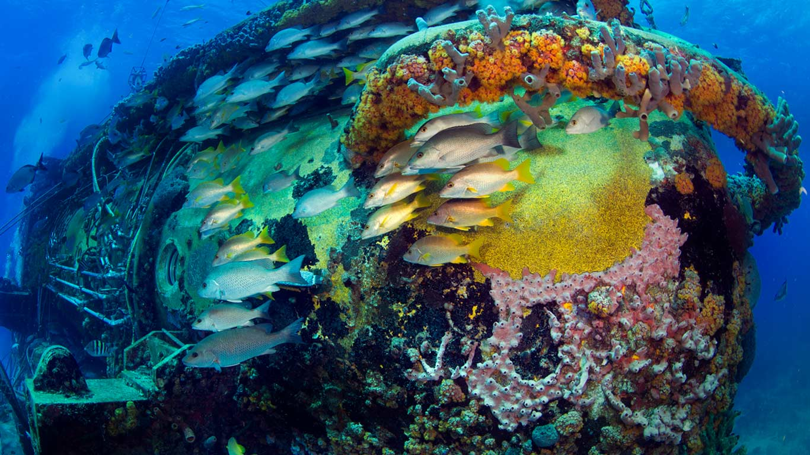

#### 20140626 ｢湯畑｣群馬, 草津 (© JTB Photo/SuperStock)(Bing Japan)

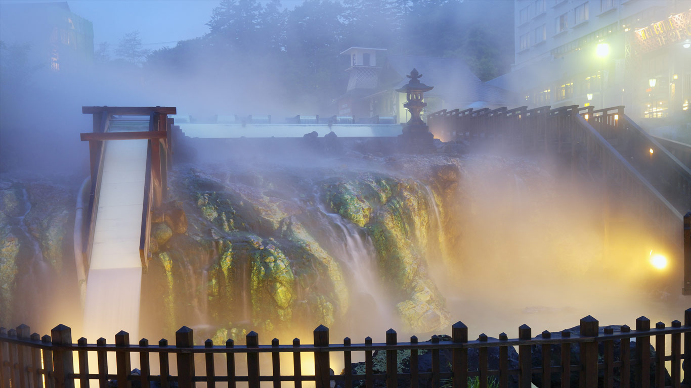

#### 20140626 Guggenheim Museum Bilbao, Bilbao, Spain (© Juan Carlos Sancho Folgueiras/500px)(Bing United Kingdom)

#### 20140625 Butch Cassidy's bathtub in Snow Canyon State Park, Utah, USA (© Kerrick James/Corbis)(Bing United Kingdom)

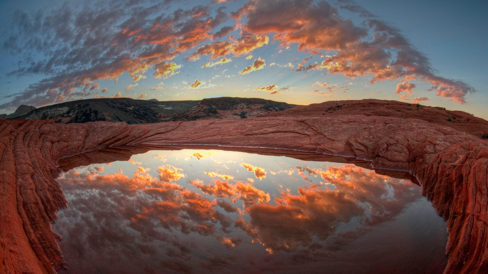

#### 20140625 花海 (© Mendowong Photography/Moment Open/Getty Images)(Bing China)

#### 20140625 Table de baby-foot avec en arrière-plan le drapeau du Brésil (© Don Bayley/Getty Images)(Bing France)

#### 20140624 Pasture in Mânăstirea Humorului, Bukovina, Romania (© Photononstop/SuperStock)(Bing United Kingdom)

#### 20140623 Feuerwerk über dem Hafen von Kiel anlässlich der Kieler Woche, Schleswig-Holstein, Deutschland (© Holger Leue/Corbis)(Bing Deutschland)

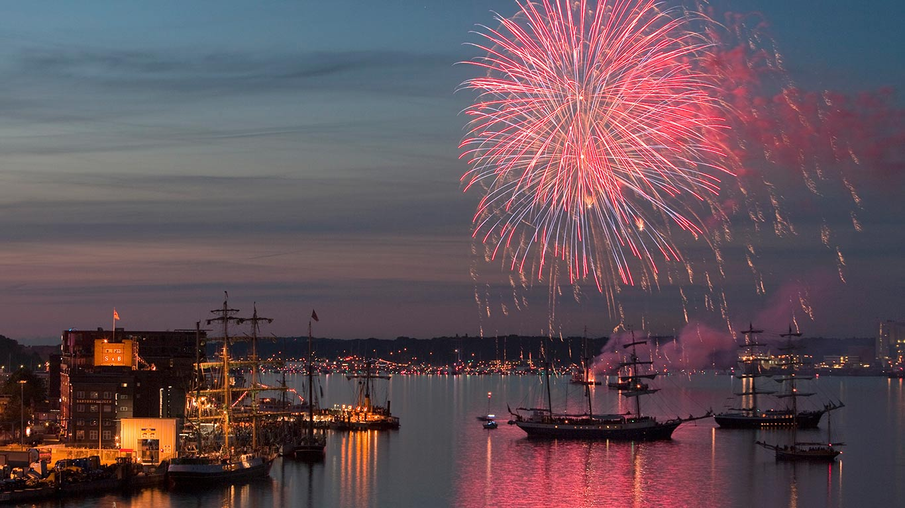

#### 20140623 Canada geese in Hill Lake, Pulaski County, Arkansas, USA (© Barry Hamilton/Corbis)(Bing United Kingdom)

#### 20140622 Cows in Thurgau, Switzerland (© plainpicture/Yabo)(Bing United Kingdom)

#### 20140621 Solar flare (© NASA)(Bing United Kingdom)

#### 20140620 暗色桌面上的一碗面 (© feryersan/Moment/Getty Images)(Bing China)

#### 20140620 The Bodleian Library, Oxford, Oxfordshire, England, United Kingdom (© Charlie Harding/Corbis)(Bing United Kingdom)

#### 20140620 Football sur la plage de Rio de Janeiro, Brésil (© Emmanuel Aguirre/Getty Images)(Bing France)

#### 20140620 ｢青ヶ島｣伊豆諸島 (© dataichi - Simon Dubreuil/Moment/Getty Images)(Bing Japan)

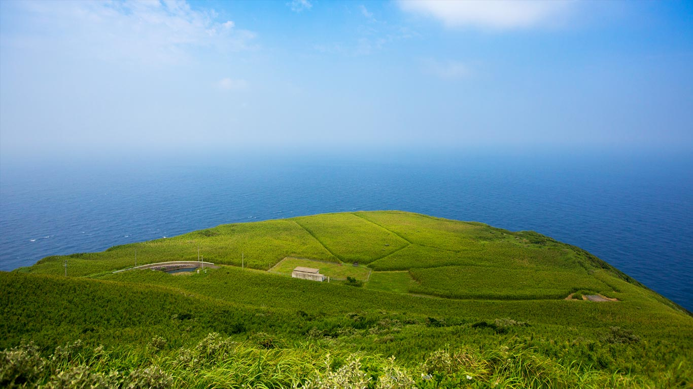

#### 20140619 The Palais des Congres in Montreal, Quebec, Canada (© 2/Uyen Le/Ocean/Corbis)(Bing Canada)

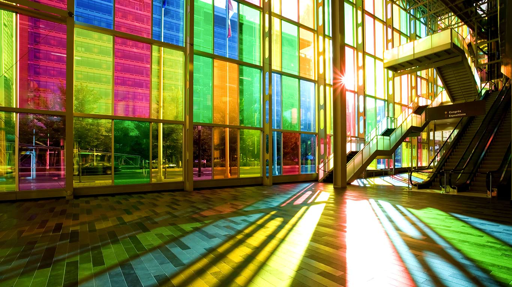

#### 20140619 ｢太平山県立自然公園｣栃木, 栃木市 (© JTB Photo/SuperStock)(Bing Japan)

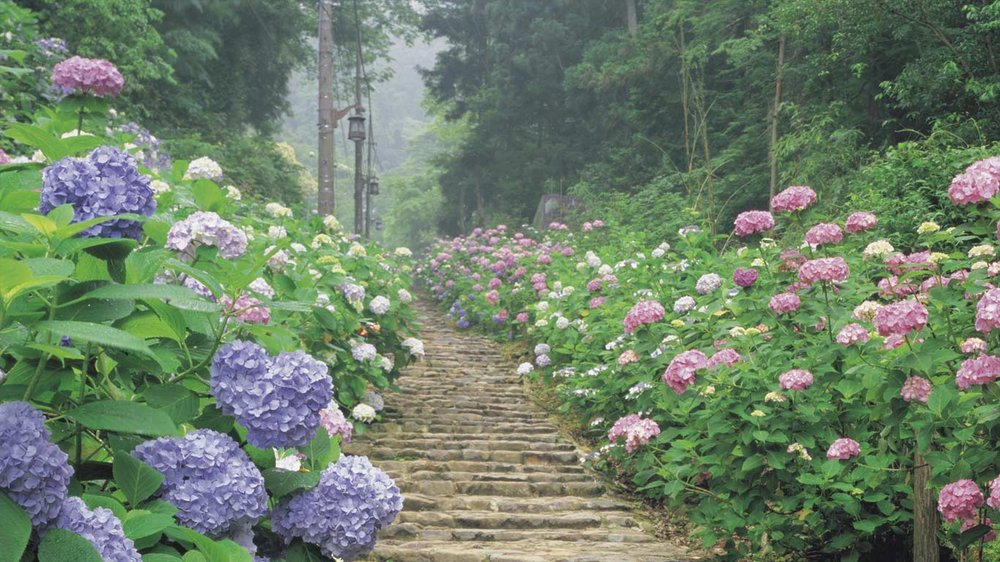

#### 20140619 身着“正装”的阿德利企鹅 (© Art Wolfe/Iconica/Getty Images)(Bing China)

#### 20140619 A frog clings to the tip of a branch, Adelaide, Australia (© Rob Sturman/Corbis)(Bing United Kingdom)

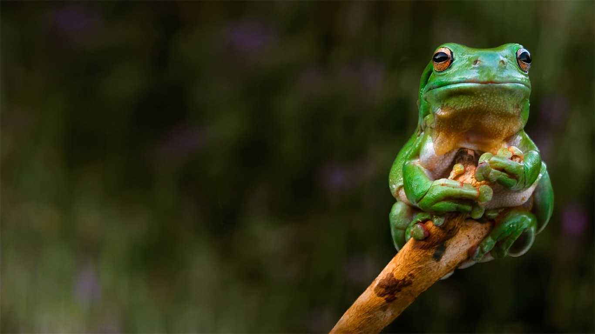

#### 20140618 Nam Tok Thi Lo Su in Umphang Wildlife Sanctuary, Thailand (© Apisit Sriputtirut/Alamy)(Bing United Kingdom)

#### 20140618 ｢ティーロースー滝｣タイ, ウムパーン野生動物保護区 (© Apisit Sriputtirut/Alamy)(Bing Japan)

#### 20140618 Befreiungshalle, Kelheim, Bayern, Deutschland (© Manfred Gottschalk/Lonely Planet Images/Getty Images)(Bing Deutschland)

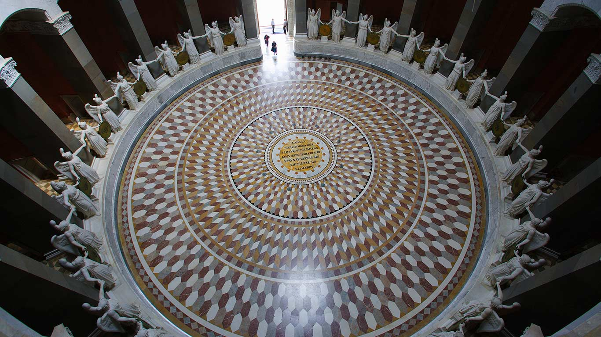

#### 20140617 青岛夜景 (© MirageC/Moment Open/Getty Images)(Bing China)

#### 20140617 Detail of a porcelain mushroom in the Veluwe, Netherlands (© Jan Vermeer/Minden Pictures)(Bing United States)

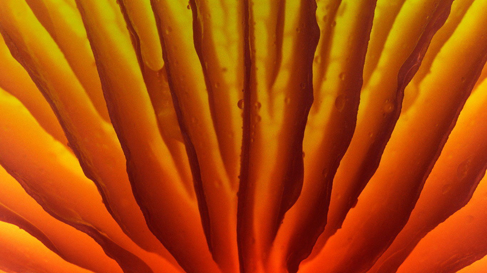

#### 20140617 ｢箱崎ジャンクション｣東京, 中央区 (© Sean Pavone/Alamy)(Bing Japan)

#### 20140617 Cathedral Quarry in Little Langdale in the Lake District, Cumbria, England, UK (© David Clapp/Getty Images)(Bing United Kingdom)

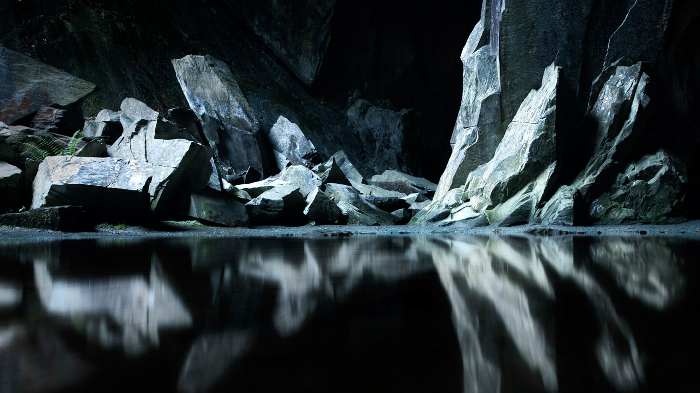

#### 20140616 Toledo, Spain (© Pedro Jarque Krebs/500px)(Bing United Kingdom)

#### 20140616 ｢五稜郭｣北海道, 函館 (© Image House/a.collectionRF/Panorama)(Bing Japan)

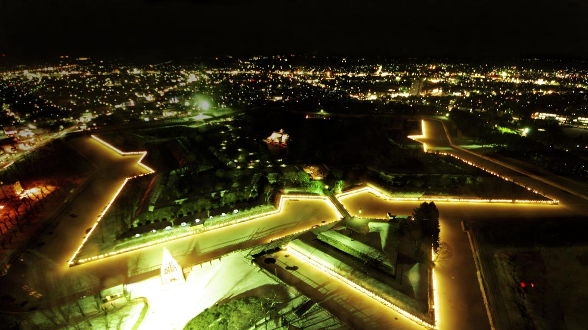

#### 20140615 Aerial view of highway interchange, North Rhine-Westphalia, Germany (© Markus Hanke/Gallery Stock)(Bing United Kingdom)

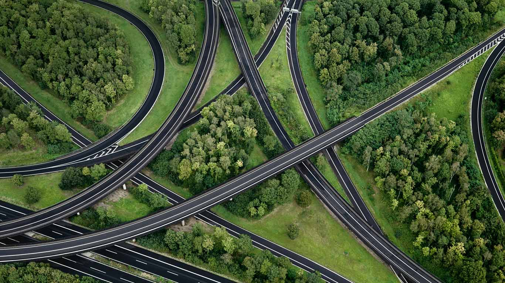

#### 20140615 Girouette suplombant le lac du Salagou, Hérault, Languedoc-Roussillon (© RIEGER Bertrand/hemis.fr/Getty Images)(Bing France)

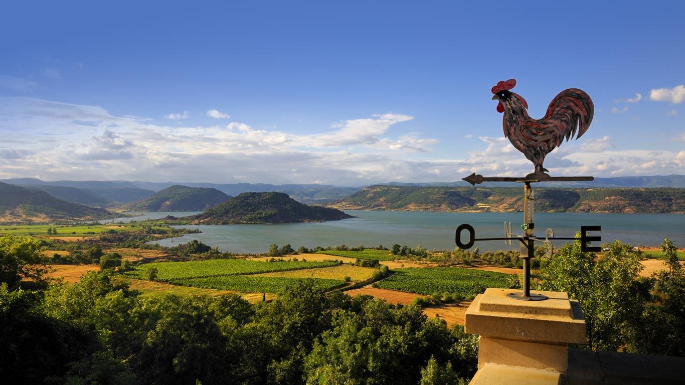

#### 20140614 United States flag, New York Stock Exchange, New York City (© Hisham Ibrahim/Getty Images)(Bing United States)

#### 20140614 African lion cub playing with adult male, Masai Mara National Reserve, Kenya (© Suzi Eszterhas/Minden Pictures)(Bing United Kingdom)

#### 20140613 蒸笼中的蒸馄饨 (© Lauri Patterson/Vetta/Getty Images)(Bing China)

#### 20140613 Pitcher plant (© Ch'ien Lee/Minden Pictures)(Bing United Kingdom)

#### 20140613 Cigu Lagoon at Tainan, Taiwan (© Sunrise@dawn Photography/Getty Images)(Bing United States)

#### 20140612 Balls on a football pitch forming a giant flag of Brazil (© Volker Möhrke/Corbis)(Bing United Kingdom)

#### 20140611 Escalier menant à la chapelle Notre-Dame-de-Beauvoir à Moustiers-Sainte-Marie, Alpes-de-Haute-Provence, PACA (© SIME/eStock Photo)(Bing France)

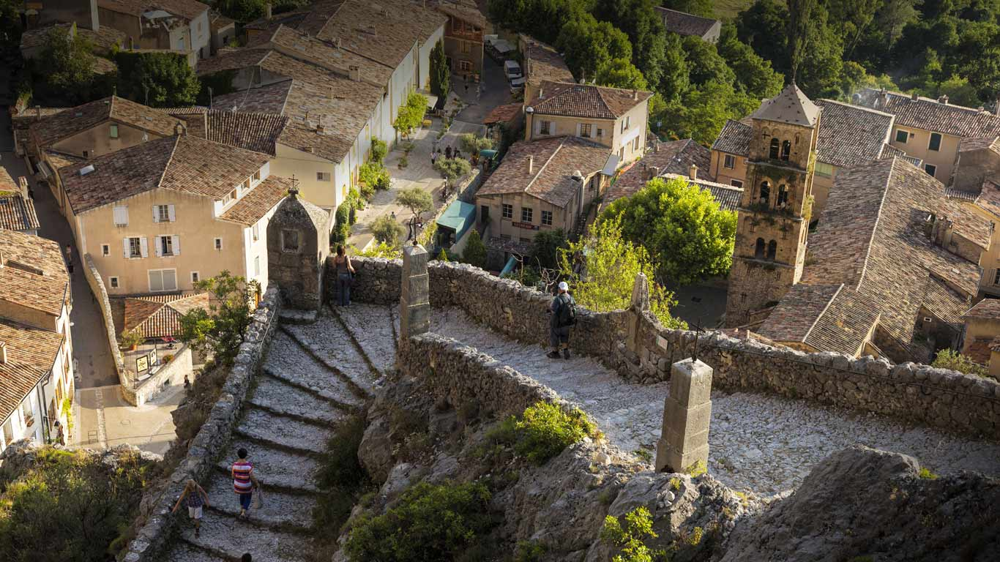

#### 20140611 Blue-footed booby during a courtship display in the Galápagos Islands, Ecuador (© Scott Davis/Tandem Stock)(Bing United Kingdom)

#### 20140610 Kayakers in Ashlu Creek near Squamish, British Columbia, Canada (© Phil Tifo/Tandem Stock)(Bing United Kingdom)

#### 20140609 Observatory on the summit of Brasstown Bald Mountain in Georgia, USA (© Sean Pavone/Alamy)(Bing United Kingdom)

#### 20140608 Lightning storm off Cooke Point, Port Hedland, Australia (© Simon Phelps Photography/Getty Images)(Bing United Kingdom)

#### 20140608 Cross country skier on Mt. Lovick in the Mt. Buller region, Victoria (© Glenn Van Der Knijff/Lonely Planet Images/Getty Images)(Bing Australia)

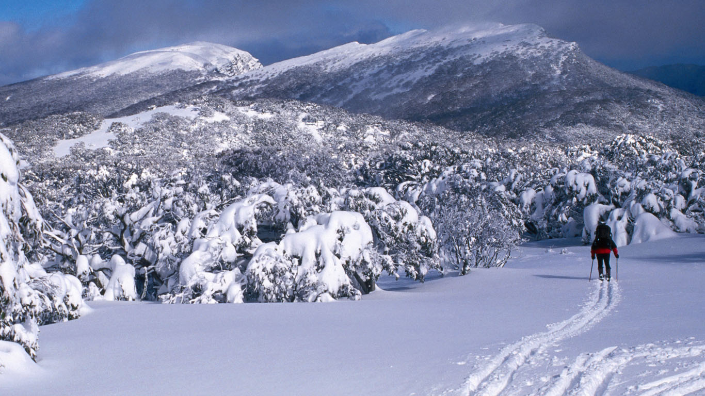

#### 20140607 The Lighthouse Centre for Design and Architecture, Glasgow (©  Alan Copson/Corbis)(Bing United Kingdom)

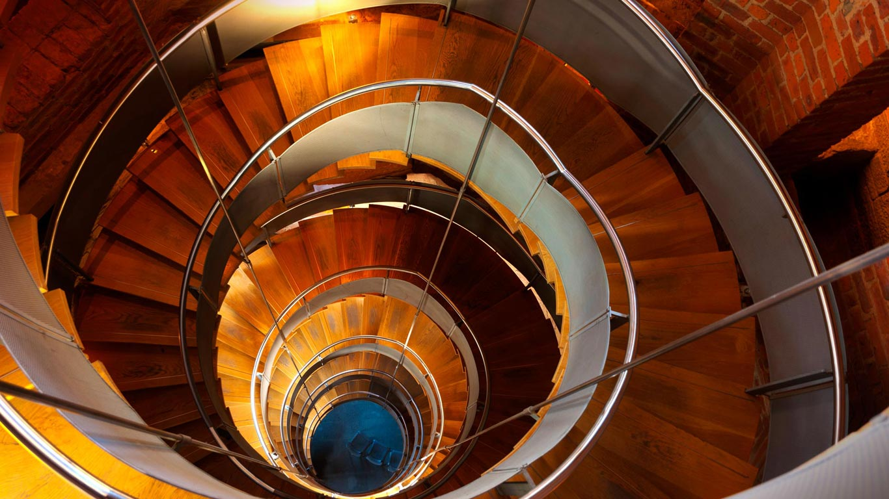

#### 20140606 桂林阳朔在稻田里照料水稻的农夫 (© Bill Bachmann/Alamy)(Bing China)

#### 20140606 Omaha Beach monument Les Braves, on the beach at Saint-Laurent-sur-Mer, Normandy, France (© NaturePL/SuperStock)(Bing United Kingdom)

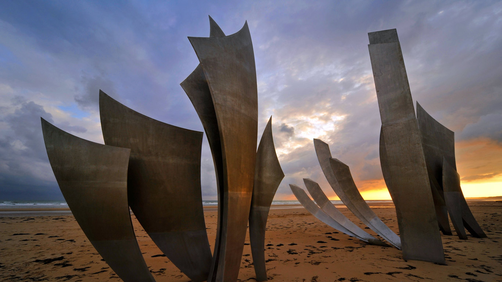

#### 20140605 Sonnenblume (© Rüdiger Hess/geo-select FotoArt)(Bing Deutschland)

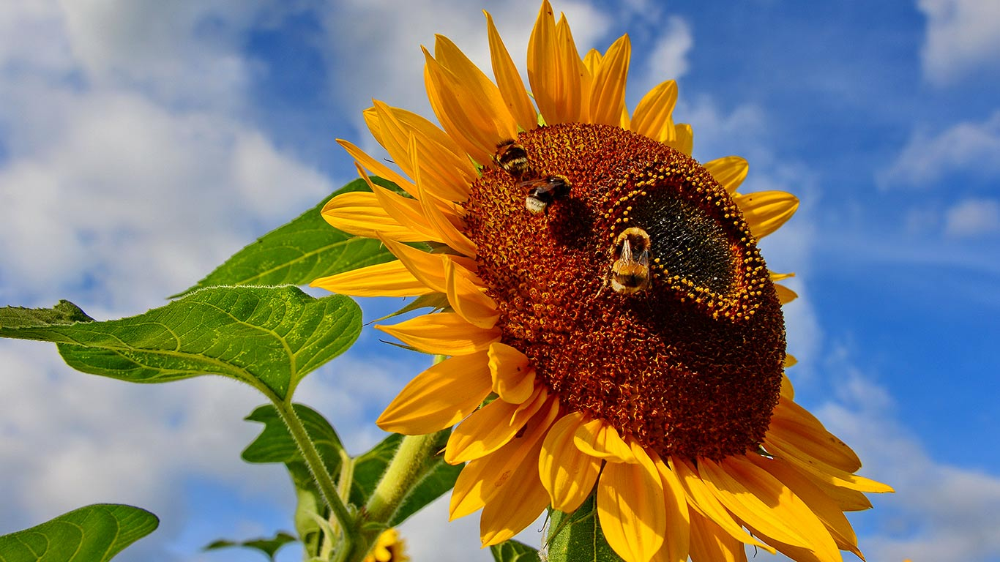

#### 20140605 ｢白米千枚田｣石川, 輪島 (© JTB Photo/SuperStock)(Bing Japan)

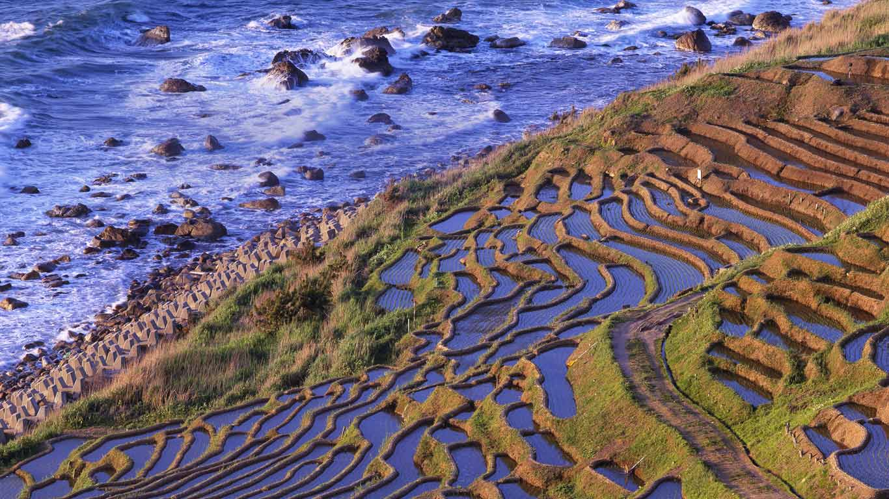

#### 20140605 陕西西安古城墙，身穿秦装的士兵 (© Keren Su/China Span/Getty Images)(Bing China)

#### 20140605 Musée des civilisations de l'Europe et de la Méditerranée (MuCEM) et fort Saint-Jean à Marseille, Bouches-du-Rhône, Provence-Alpes-Côte d'Azur (© SIME/eStock Photo)(Bing France)

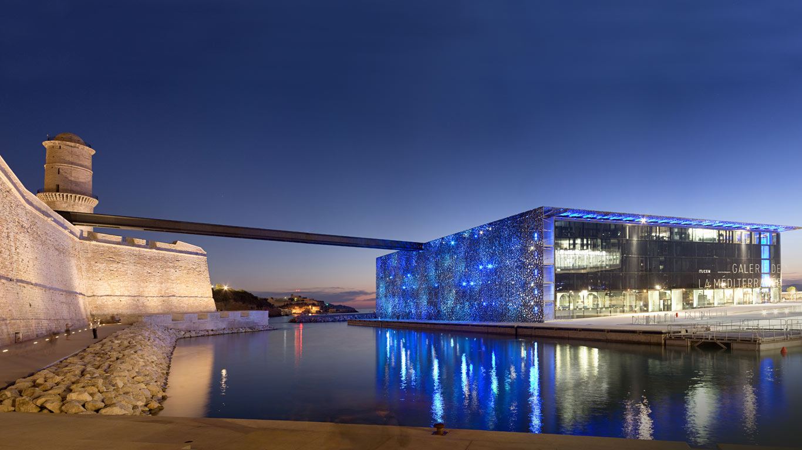

#### 20140605 Icicles on a branch near Cradle Mountain, Tasmania (© Ted Mead/Photolibrary/Getty Images)(Bing Australia)

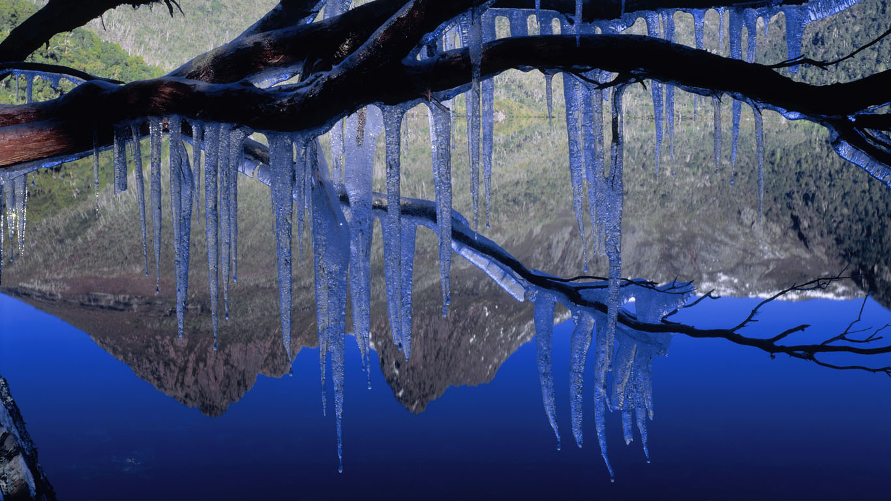

#### 20140605 Coch Castle, Cardiff, Wales (© joe daniel price/Getty Images)(Bing United Kingdom)

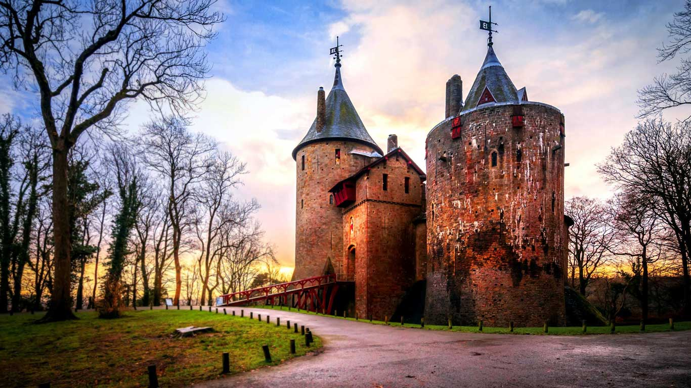

#### 20140604 Gorgonian coral, crinoid, and sponges, Komodo National Park, Indonesia (© Mammoth HD)(Bing United Kingdom)

#### 20140603 Map of earth created by the Global Inventory Modeling and Mapping Studies (GIMMS) project at NASA’s Goddard Space Flight Center (© NASA)(Bing United Kingdom)

#### 20140602 粽子与粽子叶 (© BJI/Blue Jean Images/Getty Images)(Bing China)

#### 20140602 ｢首都圏外郭放水路｣埼玉, 春日部市 (© Tomohiro Ohsumi/Bloomberg/Getty Images)(Bing Japan)

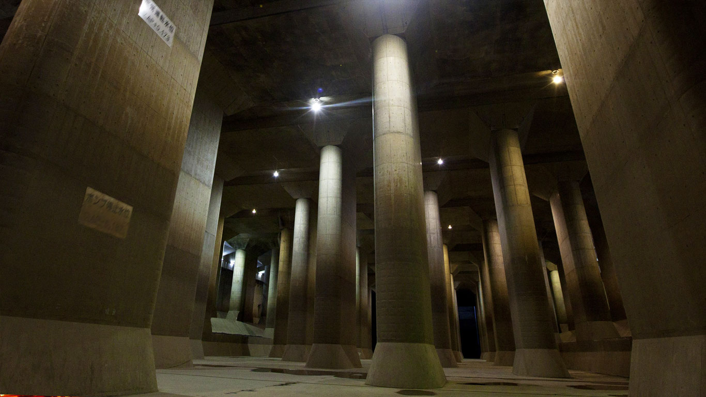

#### 20140602 The Balancing Rock, Long Island Nova Scotia, Canada (© Thomas Kitchin & Victoria Hurst/All Canada Photos/Alamy)(Bing Canada)

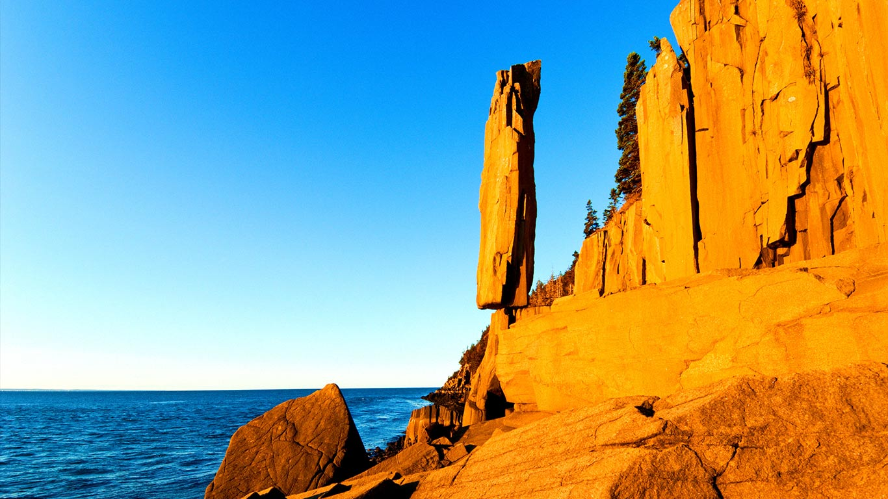

#### 20140602 Kanarra Creek Falls in Utah, USA (© Paul Didsayabutra/500px)(Bing United Kingdom)

#### 20140601 Observatory Fabra and Barcelona seen from the hills of Tibidabo, Spain (© SIME/eStock Photo)(Bing United Kingdom)

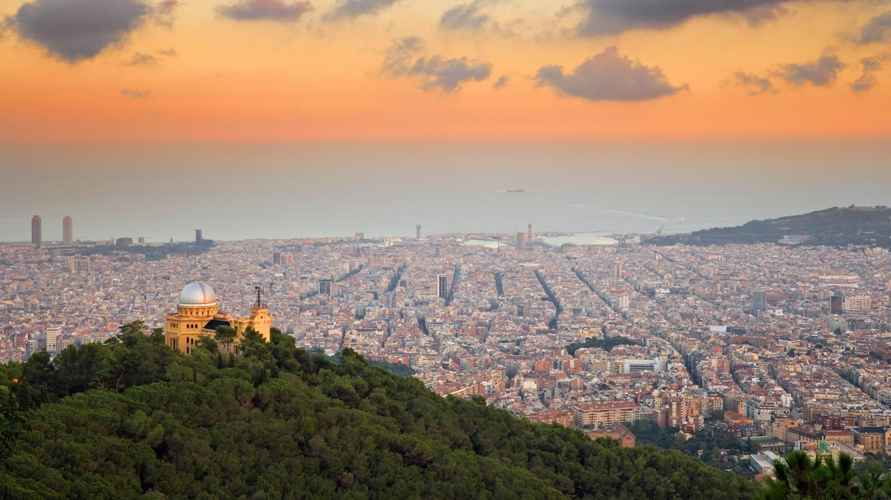

#### 20140601 穿着雨衣的儿童 (© Blue Jean Images/Corbis)(Bing China)

