#### 20140731 The Seven Sisters Country Park in East Sussex (© Roy Shakespeare/Corbis)(Bing United Kingdom)

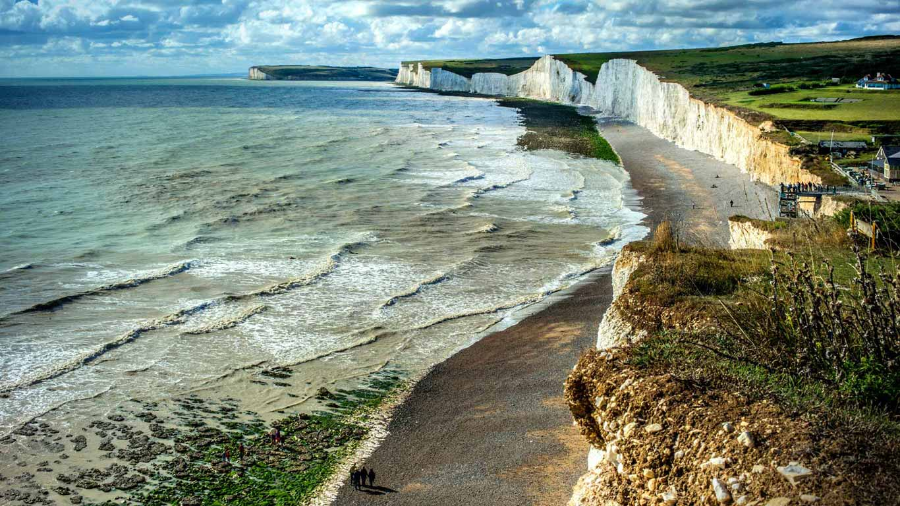

#### 20140731 Aerial view of contour farming in the Palouse, Washington (© Cameron Davidson/Gallery Stock)(Bing United States)

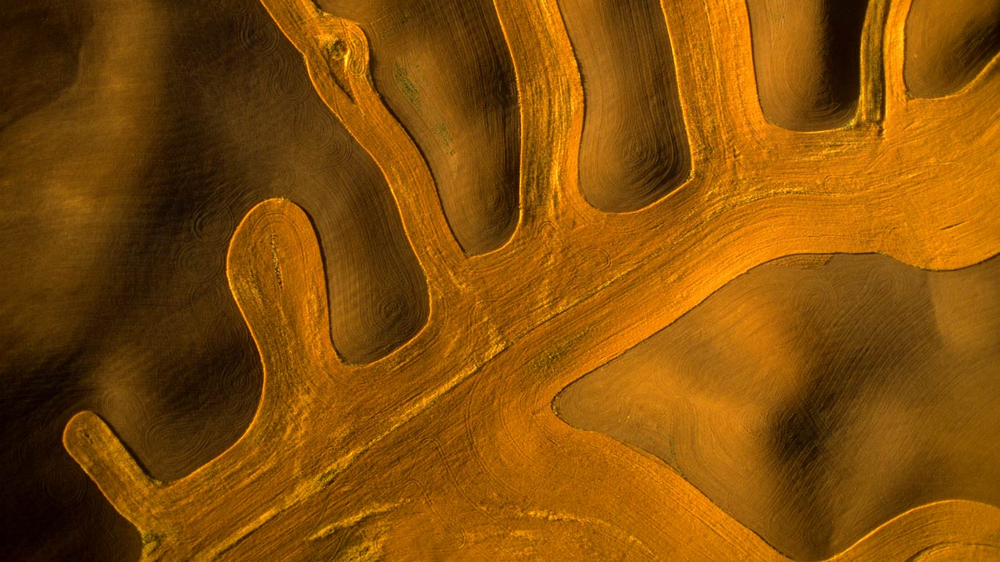

#### 20140731 Prairie Sky, Manitoba (© Shannon Bileski/Moment/Getty Images)(Bing Canada)

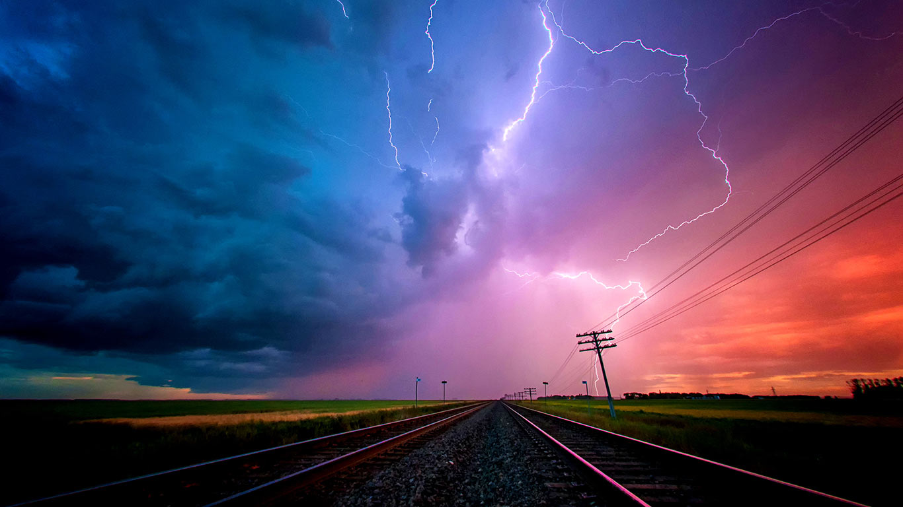

#### 20140731 Wildflowers and stones at Egg Beach on Flinders Island, Tasmania (© Peter Walton Photography/Photolibrary/Getty Images)(Bing Australia)

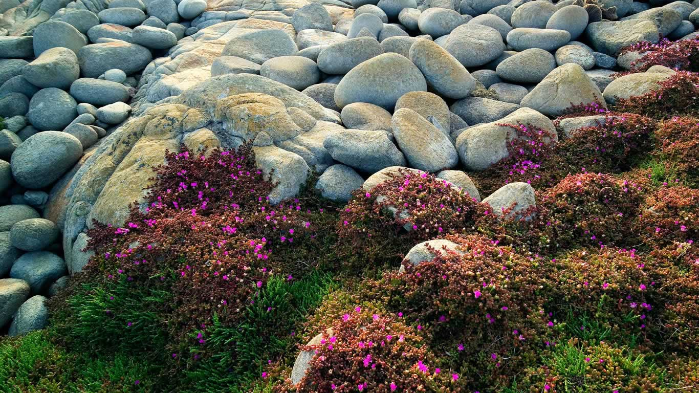

#### 20140731 云南落霞沟的多彩梯田 (© Sino Images/Getty Images)(Bing China)

#### 20140730 Pamukkale, Turkey (© Valery Shanin/Shutterstock)(Bing United Kingdom)

#### 20140729 A Siberian tiger takes a swim at the Antwerp Zoo in Belgium (© Hans Kuczka/Aurora Photos)(Bing United Kingdom)

#### 20140729 ｢志賀草津道路｣群馬, 渋峠 (© JTB MEDIA CREATION, Inc./Alamy)(Bing Japan)

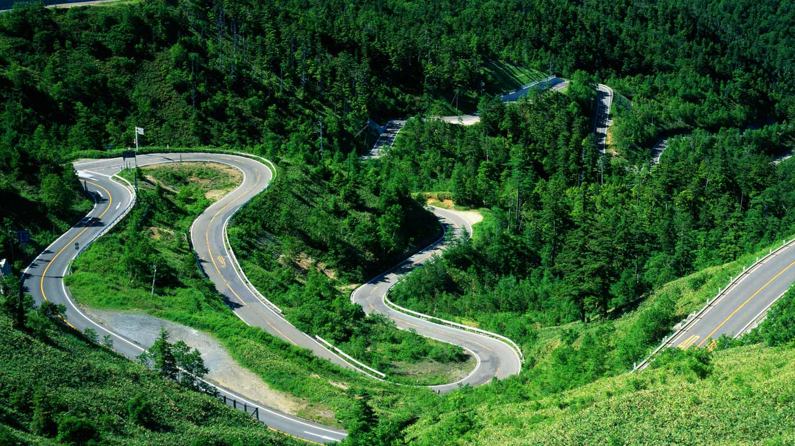

#### 20140728 Beaumont-Hamel Newfoundland Memorial, France (© Mary Evans Picture Library Ltd/age fotostock)(Bing United Kingdom)

#### 20140727 Bathing boxes line the beach at Brighton, Victoria, Australia (© J C Mitchell/Getty Images)(Bing United Kingdom)

#### 20140727 Avignon, le Rhône et le pont Saint-Bénézet, Vaucluse, Provence-Alpes-Côte d’Azur (© Visions Of Our Land/Getty Images)(Bing France)

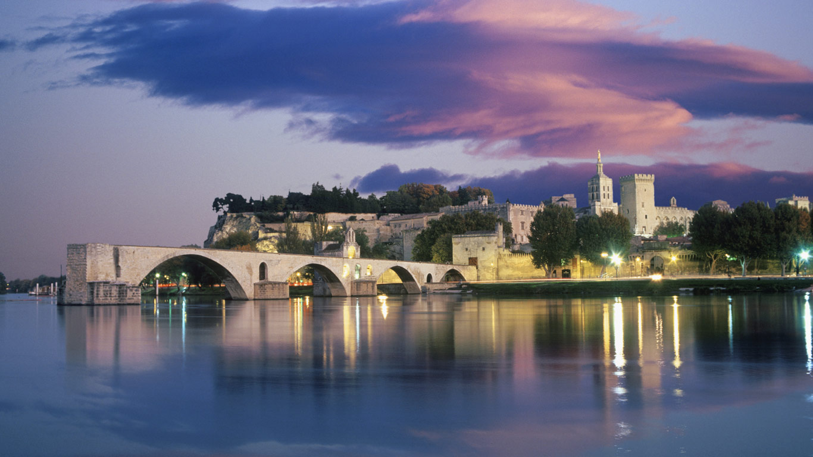

#### 20140726 The Teton Range and Jackson Lake in Grand Teton National Park, Wyoming (© Lee Gochenour/Bing Photo Contest Winner)(Bing United States)

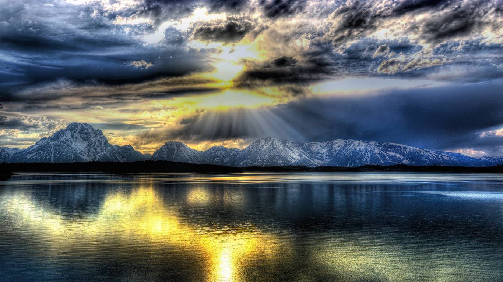

#### 20140726 Tidal flats, Katmai National Park, Alaska, USA (© plainpicture/Cultura)(Bing United Kingdom)

#### 20140725 Canals of Bruges, Belgium (© Domingo Leiva/Getty Images)(Bing United Kingdom)

#### 20140724 Meerkats in Botswana (© Nico Smit/Rex Features)(Bing United Kingdom)

#### 20140724 Prairie slough with farmland and rainbow in the background, near Bruxelles, Manitoba (© David Reede/All Canada Photos/Getty Images)(Bing Canada)

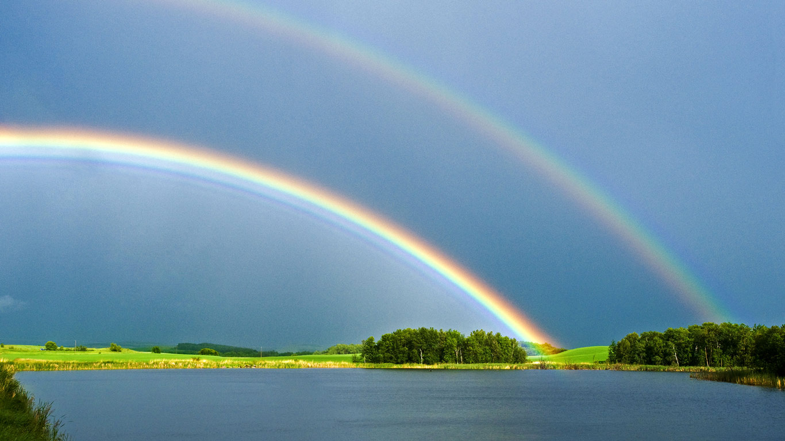

#### 20140724 Camel Rock at Narooma in New South Wales (© Jingshu Zhu/Moment/Getty Images)(Bing Australia)

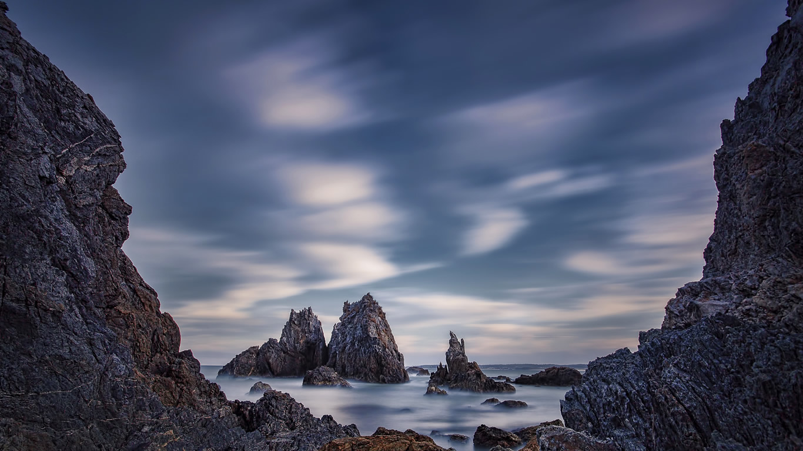

#### 20140724 ｢白鬚神社鳥居｣滋賀, 琵琶湖 (© Clover/SuperStock)(Bing Japan)

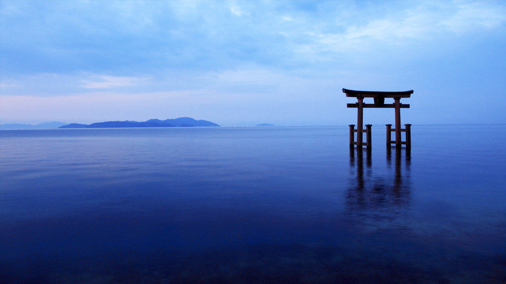

#### 20140723 ｢名古屋城｣愛知, 名古屋 (© Keren Su/Corbis)(Bing Japan)

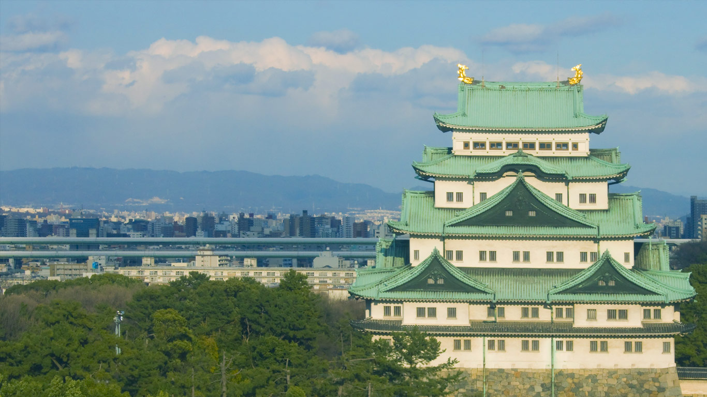

#### 20140723 似伞一般的莲叶 (© MelindaChan/Moment/Getty Images)(Bing China)

#### 20140723 Scottish Exhibition and Conference Centre (© Brian Lawrence/Getty Images)(Bing United Kingdom)

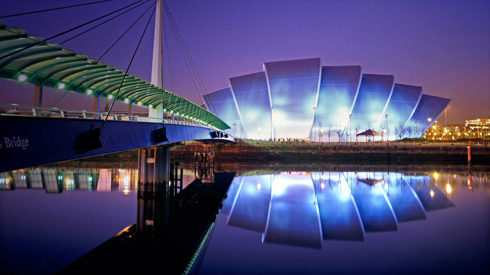

#### 20140722 Tolbachik volcanos on the Kamchatka Peninsula, Russia (© AirPano)(Bing United Kingdom)

#### 20140721 Diver in the Silfra, Thingvellir Lake, Thingvellir National Park, Iceland (© Wild Wonders of Europe/Lundgren/Corbis)(Bing United Kingdom)

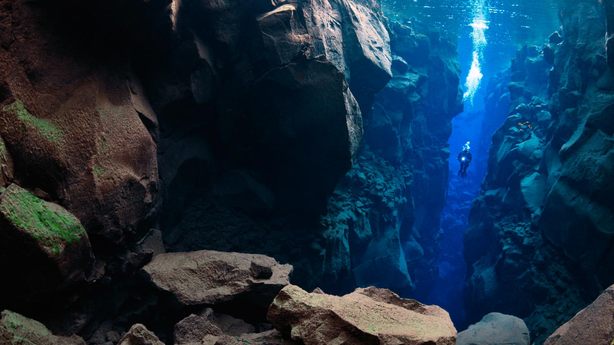

#### 20140721 Vue sur le palais de Chaillot depuis la tour Eiffel un jour d’orage, Paris, Île-de-France (© Aflo/Corbis)(Bing France)

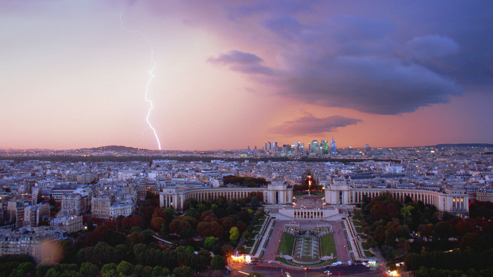

#### 20140721 Candles line the beach at Odaiba Marine Park for Marine Day, Tokyo, Japan (© KeystoneUSA-ZUMA/Rex Features)(Bing United States)

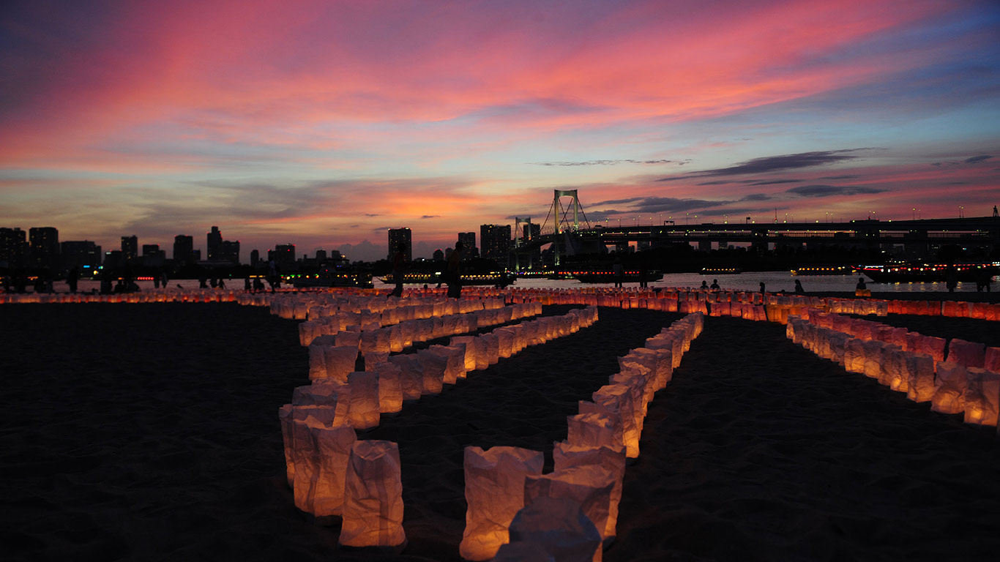

#### 20140720 Color-coded relief map of Linné Crater on the Moon (© NASA/GSFC/Arizona State University)(Bing United Kingdom)

#### 20140720 Fußgängertunnel, Hockenheimring, Hockenheim, Deutschland (© tim gartside/Alamy)(Bing Deutschland)

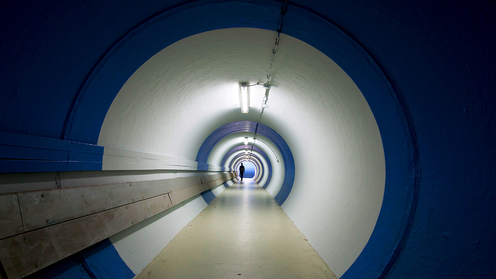

#### 20140719 Yampa River flowing through Dinosaur National Monument, Colorado, USA (© Whit Richardson/Aurora Photos)(Bing United Kingdom)

#### 20140719 云南罗平的清晨 (© Nutexzles/Moment/Getty Images)(Bing China)

#### 20140718 Puss moth caterpillar (© Thomas Marent/Minden Pictures)(Bing United Kingdom)

#### 20140718 四川黄龙五彩池 (© Andy Leong Photography/Moment/Getty Images)(Bing China)

#### 20140717 Church of San Giovanni Battista, Mogno, Ticino, Switzerland (© LOOK/Latitude Stock)(Bing United Kingdom)

#### 20140716 Aerial view of a flower farm, North Rhine-Westphalia, Germany (© Hans Blossey/Corbis)(Bing United Kingdom)

#### 20140715 Colourful Brooding Anemones and Coralline Algae adorne the rocks below and abundant kelp forest at Hunt Rock. Near Browning Passage, British Columbia (© Eiko Jones/Corbis)(Bing Canada)

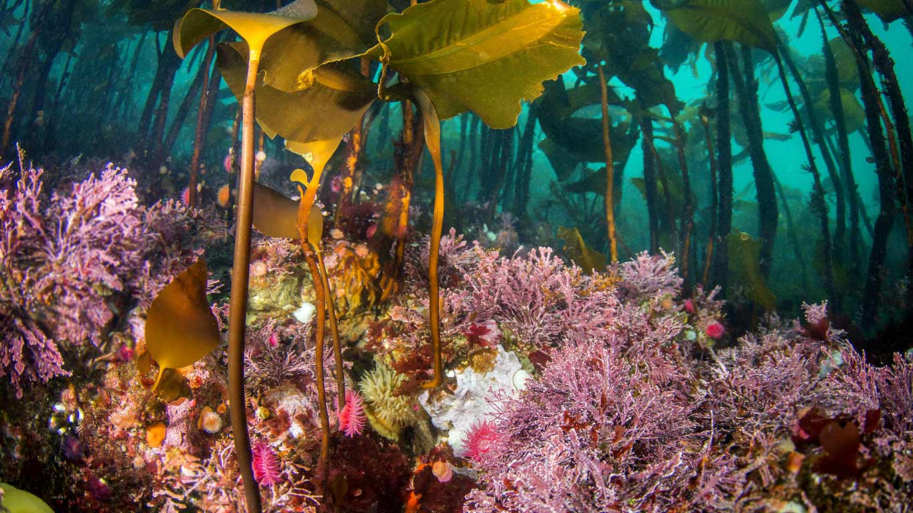

#### 20140715 Natchez Trace National Scenic Trail, Mississippi (© Marc Muench/Tandem Still + Motion)(Bing United States)

#### 20140715 Bastian Schweinsteiger stemmt den WM-Pokal in die Höhe und feiert mit seinen Nationalmannschaftskameraden den Sieg im Finale der FIFA-Fußball-Weltmeisterschaft 2014 gegen Argentinien im Maracana-Stadion in Rio de Janeiro, Brasilien, am 13.7.2014 (© Shaun Botterill/FIFA/Getty Images)(Bing Deutschland)

#### 20140715 Aizhai Suspension Bridge, Hunan Province, China (© Imaginechina/Corbis)(Bing United Kingdom)

#### 20140714 Kaiserthermen, UNESCO-Welterbestätte, Trier, Rheinland-Pfalz, Deutschland (© Bernd Rohrschneider/Corbis)(Bing Deutschland)

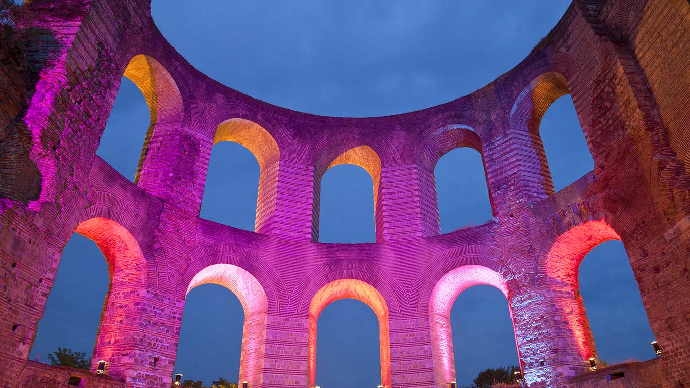

#### 20140714 三峡风光 (© View Stock/Getty Images)(Bing China)

#### 20140714 Rouen, Normandy, France (© Tim Gartside/age fotostock)(Bing United Kingdom)

#### 20140714 Feu d’artifice du 14 Juillet au-dessus de la ville de Carcassonne, Aude, Languedoc-Roussillon (© Martin Castellan/Alamy)(Bing France)

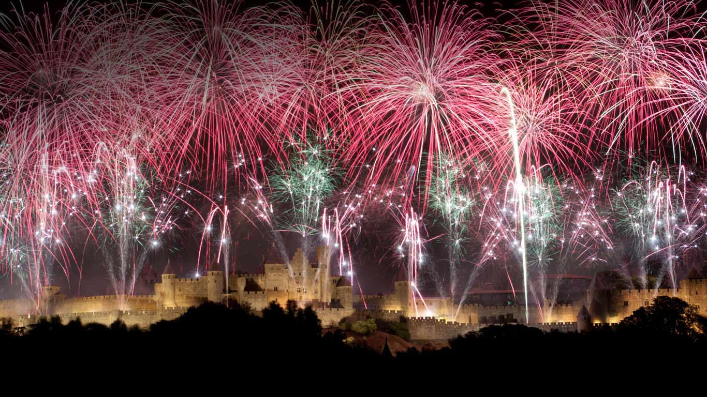

#### 20140713 Sugar Loaf Mountain and Guanabara Bay, Rio de Janeiro, Brazil (© Bronek Kaminski/Getty Images)(Bing United Kingdom)

#### 20140712 Bark of a rainbow eucalyptus tree, Maui, Hawaii, USA (© Daryl Pederson/plainpicture)(Bing United Kingdom)

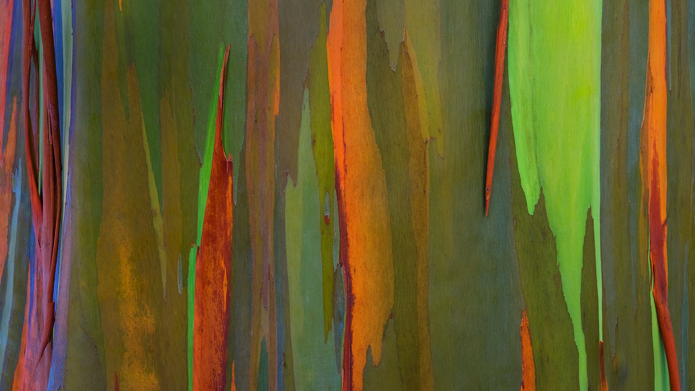

#### 20140712 Deutschlands Stürmer Miroslav Klose feiert seinen Treffer zum 2:0 im Halbfinale gegen Brasilien bei der FIFA-Fußballweltmeisterschaft 2014 in Belo Horizonte, Brasilien, am 8.7.2014 (© Laurence Griffiths/Getty Images)(Bing Deutschland)

#### 20140712 ｢長保寺｣和歌山, 海南市 (© JTB MEDIA CREATION, Inc./Alamy)(Bing Japan)

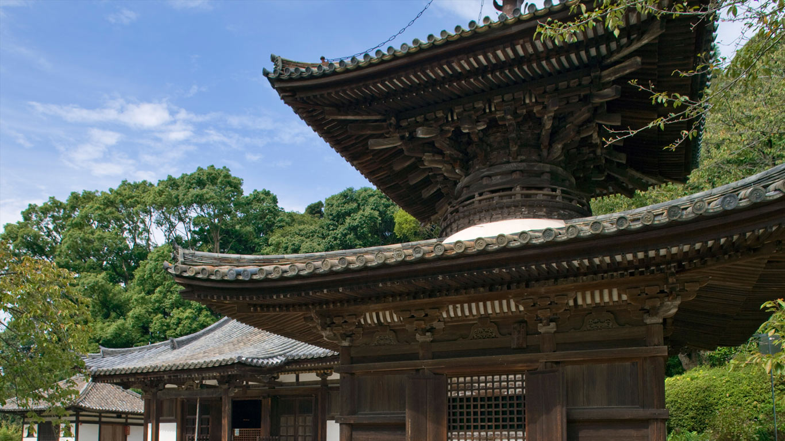

#### 20140711 The Karl G. Jansky Very Large Array (VLA) radio telescope, west of Socorro, New Mexico, USA (© Ilya Terentyev/Getty Images)(Bing United Kingdom)

#### 20140710 香港万宜水库，西坝 (© jaylie wong/Moment/Getty Images)(Bing China)

#### 20140710 Salt flats in San Francisco Bay, California, USA (© Art Wolfe/Mint Images)(Bing United Kingdom)

#### 20140709 ｢夕日のジェットコースター｣三重, 桑名市, ナガシマスパーランド (© Andrew Blyth/Asia Photo Connection/Henry Westheim Photography/Alamy)(Bing Japan)

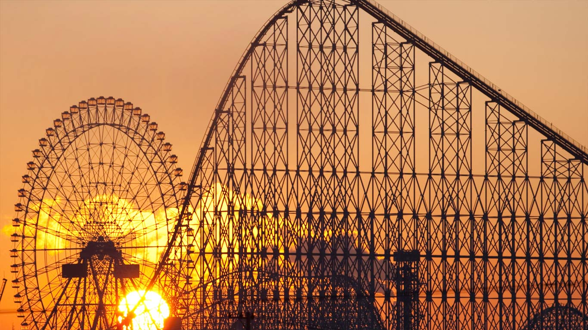

#### 20140709 Schwerin, Mecklenburg-Vorpommern, Deutschland (© Charles Bowman/eStock Photo)(Bing Deutschland)

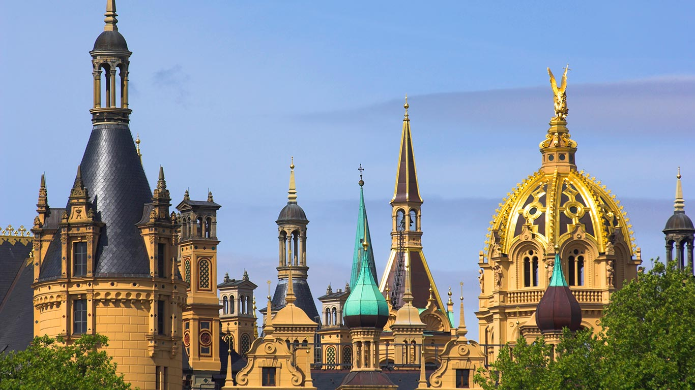

#### 20140709 中国，内蒙古草原 (© Beijing Eastphoto stockimages Co.,Ltd/Alamy)(Bing China)

#### 20140709 Red-legged seriema at the Apenheul Zoo in Apeldoorn, Netherlands (© Juan Carlos Muñoz/age fotostock)(Bing United Kingdom)

#### 20140708 Dawn, fireweed and the Cloudy Range in the Ogilvie Mountains in late summer in Tombstone Territorial Park, Yukon, Canada (© Ron Erwin/All Canada Photos/Corbis)(Bing Canada)

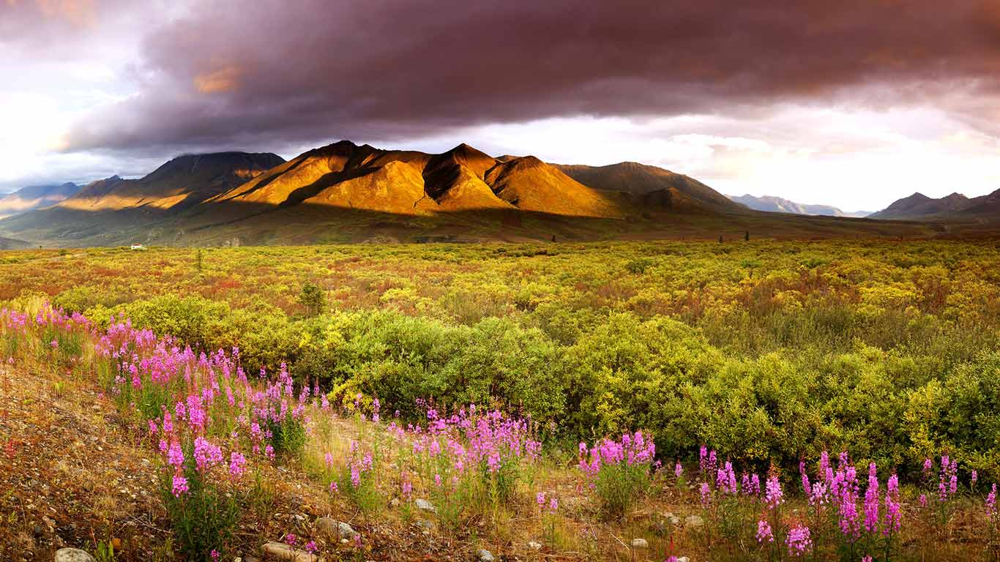

#### 20140708 Castell Dinas Brân, Llangollen, Wales (© joe daniel price/Getty Images)(Bing United Kingdom)

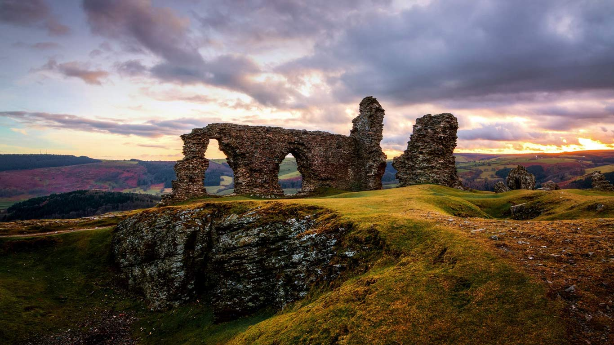

#### 20140707 Vulcano, Aeolian Islands, Italy (© SIME/eStock Photo)(Bing United Kingdom)

#### 20140707 ｢三佛寺｣鳥取, 三徳山 (© JTB PHOTO COMMUNICATI/JTB Photo/SuperStock)(Bing Japan)

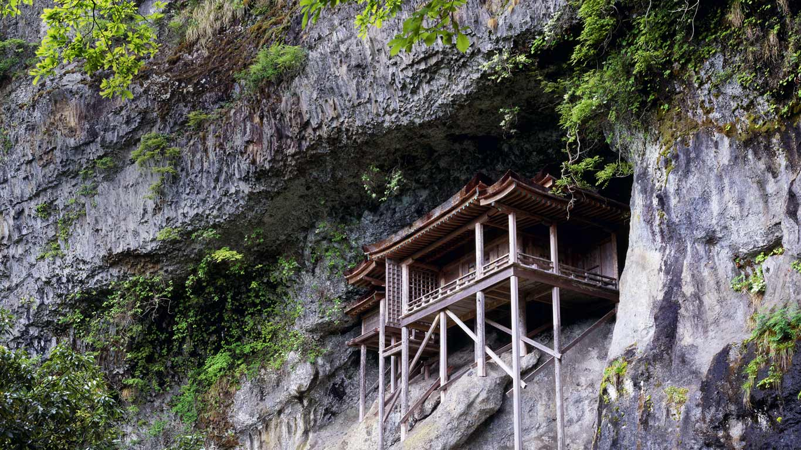

#### 20140707 葱翠的银杏叶 (© Borut Trdina/E+/Getty Images)(Bing China)

#### 20140706 从国际空间站所看到的里约热内卢和圣保罗 (© Reid Wiseman/NASA)(Bing China)

#### 20140706 A brittle star wanders across a blue sea star off the coast of the Solomon Islands (© Birgitte Wilms/Minden Pictures)(Bing United Kingdom)

#### 20140705 Tour de France riders (© Tim De Waele/Corbis)(Bing United Kingdom)

#### 20140704 老旧的足球桌 (© Primo Nitka/National Geographic My Shot/National Geographic)(Bing China)

#### 20140704 Strangler Fig tree in Bunya Mountains National Park, Queensland (© Ted Mead/Photolibrary/Getty Images)(Bing Australia)

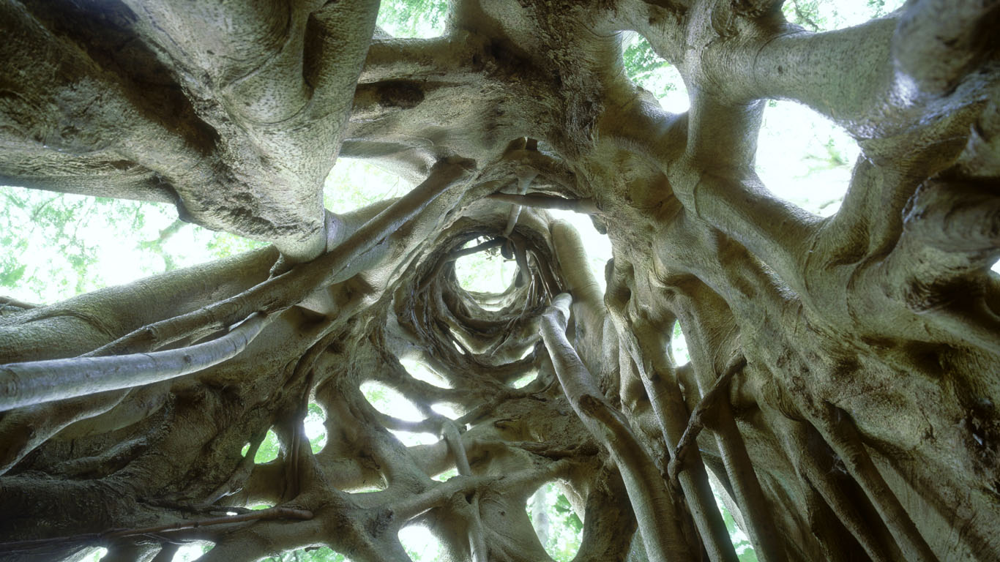

#### 20140704 Fireworks display in New York City as seen over the Hudson River from Hoboken, New Jersey (© Steve Kelley aka mudpig/Getty Images)(Bing United States)

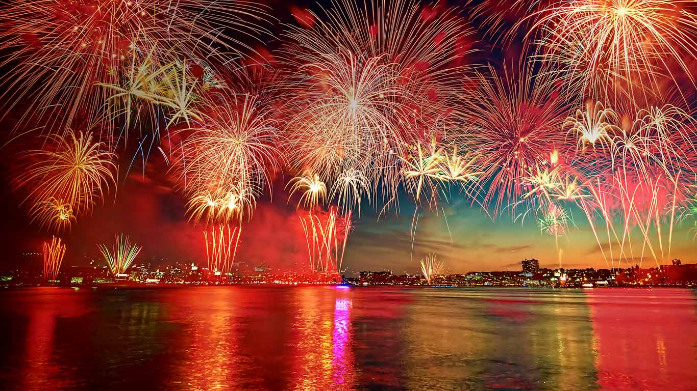

#### 20140704 Cattle during an annual overnight round-up, Andes Mountains, Ecuador (© Pete Oxford/Minden Pictures/Corbis)(Bing United Kingdom)

#### 20140704 Alfred Nicholas Memorial Gardens in the Dandenong Ranges, Victoria, Australia (© Bob Wickham/Photolibrary/Getty Images)(Bing Canada)

#### 20140703 Panda chewing on bamboo shoots, Chongqing Zoo, Chongqing, China  (© Getty Images)(Bing United Kingdom)

#### 20140702 Pont Valentré à Cahors, Lot, Midi-Pyrénées (© Jean-Marc Barrère/Corbis)(Bing France)

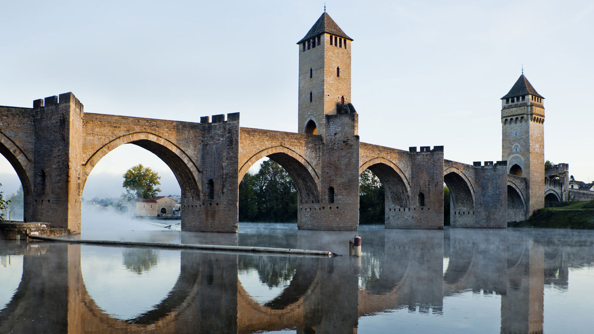

#### 20140702 Remains of historic Cape St George lighthouse in Booderee National Park, New South Wales (© Claver Carroll/Photolibrary/Getty Images)(Bing Australia)

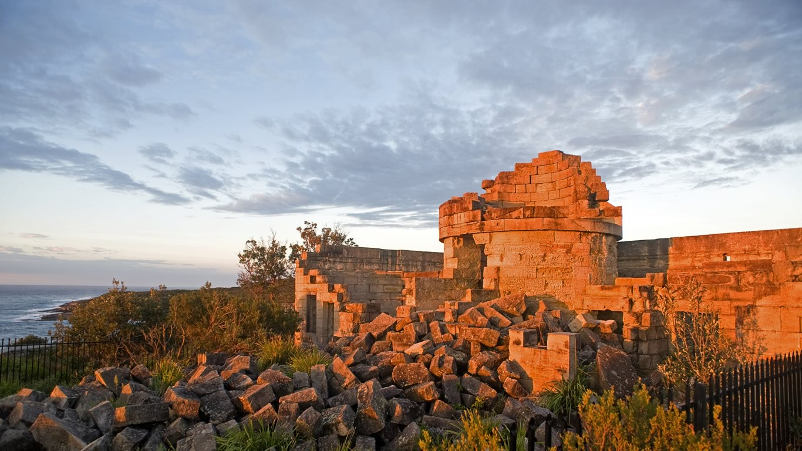

#### 20140702 La Paz, Bolivia (© Axel Flasbarth/500px)(Bing United Kingdom)

#### 20140701 The view above and below water in Atlin Lake, Atlin Lake Provincial Park, British Columbia (© Robert Postma/All Canada Photos/Alamy)(Bing Canada)

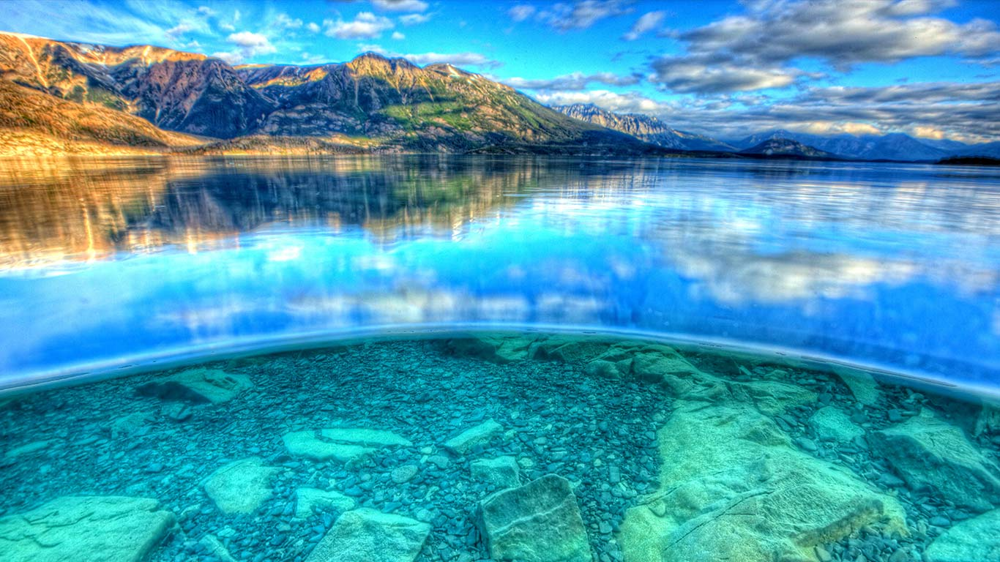

#### 20140701 Broughton Archipelago, British Columbia, Canada (© Art Wolfe Inc./Mint Images)(Bing United Kingdom)

