#### 20140831 Hanalei Valley, Kauai, Hawaii, USA (© Ian Philip Miller/Getty Images)(Bing United Kingdom)

#### 20140830 Detail of spines on the exterior of a sea star (Evaserias retifera) near Primorsky Krai, Russia (© SuperStock)(Bing United Kingdom)

#### 20140830 四川，熊猫雪天爬树 (© Steve Bloom Images/Alamy)(Bing China)

#### 20140829 Floating market vendor near Bangkok, Thailand (© Art Wolfe/Mint Images)(Bing United Kingdom)

#### 20140829 ｢秋田犬｣ (© B. Rainer/Blickwinkel/age fotostock)(Bing Japan)

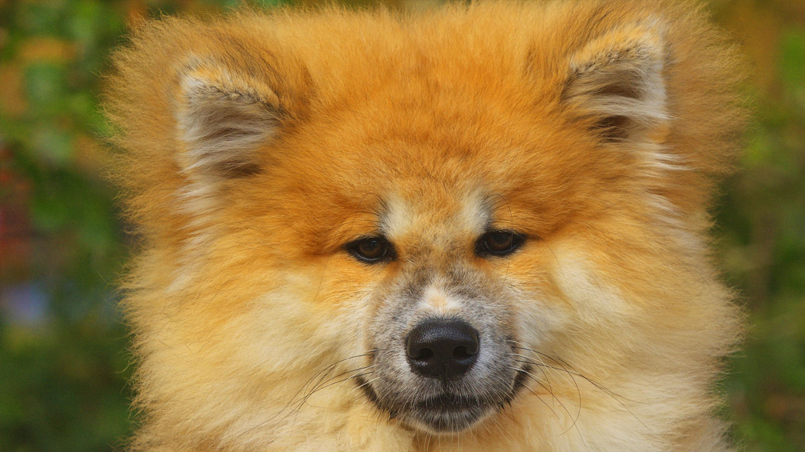

#### 20140828 Lake Powell, on the border between Utah and Arizona, USA (© AirPano)(Bing United Kingdom)

#### 20140827 ｢羅須地人協会｣岩手, 花巻市 (© JTB Photo Communications, Inc./Age Fotostock)(Bing Japan)

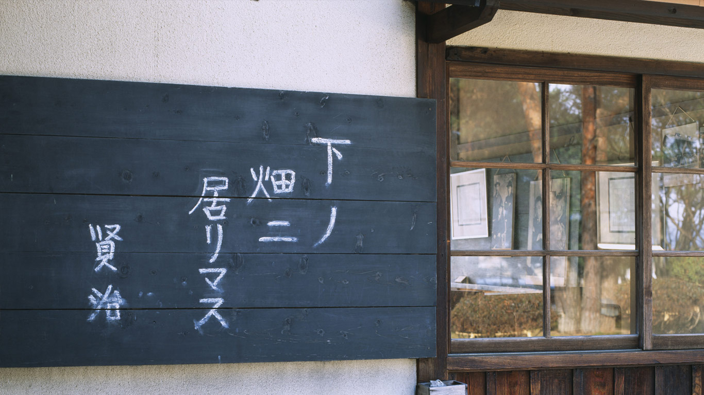

#### 20140827 Great grey owl (© J. Peltomaeki/age fotostock)(Bing United Kingdom)

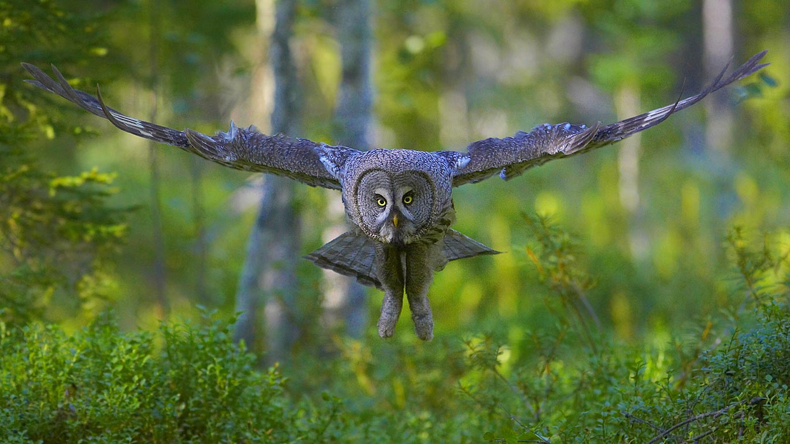

#### 20140826 Poppies and lupine in Los Angeles County, California, USA (© Corbis/age fotostock)(Bing United Kingdom)

#### 20140826 中国灯笼 (© Cheryl Chan/Flickr Open/Getty Images)(Bing China)

#### 20140826 Flowering canola field with flax in the background and a sky filled with cumulus clouds, Tiger Hills near Somerset, Manitoba (© Dave Reede/All Canada Photos/Corbis)(Bing Canada)

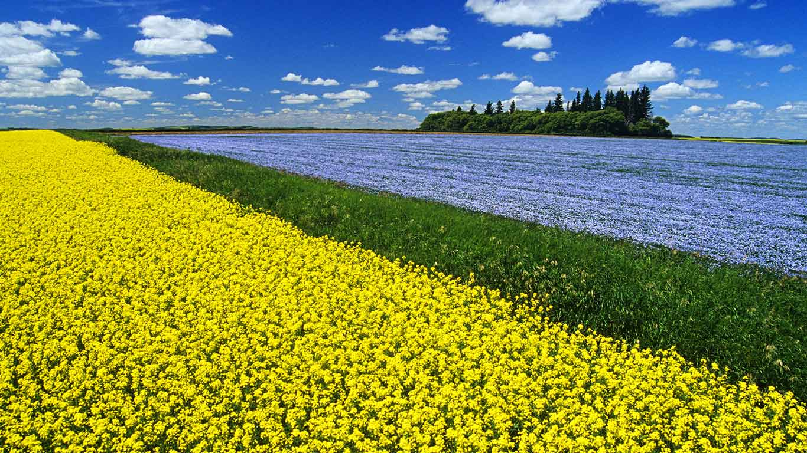

#### 20140825 Predjama Castle, Slovenia (© Silanes Travel Photography/Getty Images)(Bing United States)

#### 20140825 Antique Enamelled Advertising Signs, Portobello Road Market, Notting Hill, London (© Danita Delimont/Getty Images)(Bing United Kingdom)

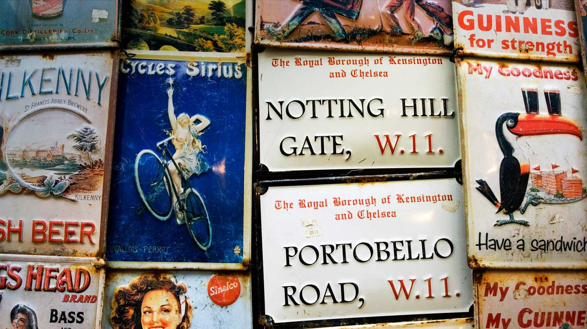

#### 20140825 ｢羽田空港ターミナル｣東京, 羽田 (© DAJ/Getty images)(Bing Japan)

#### 20140825 Nacht über Europa. Blick aus dem Weltall auf die Erde (© Matthias Kulka/Corbis)(Bing Deutschland)

#### 20140824 Vue aérienne du Trou de Fer dans le massif du Piton des Neiges, île de La Réunion (© Franck Charton/Corbis)(Bing France)

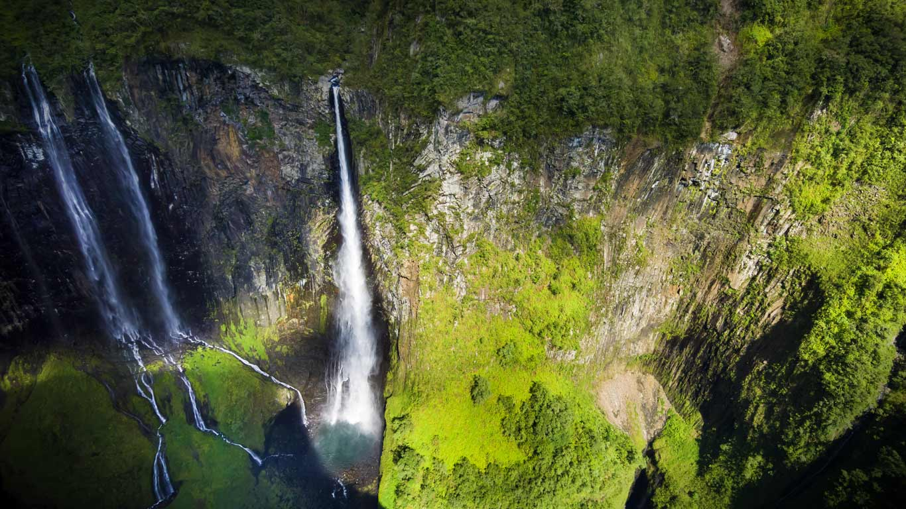

#### 20140824 Porcupines in Glacier National Park, Montana, USA (© D. Robert & Lorri Franz/Aurora Photos)(Bing United Kingdom)

#### 20140823 Langebaan Lagoon and West Coast National Park in South Africa (© Peter Chadwick/Science Photo Library)(Bing United Kingdom)

#### 20140823 北京圆明园，湖中的喷泉 (© zhu difeng/Alamy)(Bing China)

#### 20140822 A red handfish, or thymichthys politus, in southeastern Tasmania, Australia (© Auscape/Universal Images Group/Getty Images)(Bing Australia)

#### 20140822 Ko Kut Island, Thailand (© sripfoto/Shutterstock)(Bing United Kingdom)

#### 20140821 ｢奥石廊崎海岸｣静岡, 南伊豆 (© Tommy Tsutsui/Moment Open/Getty Images)(Bing Japan)

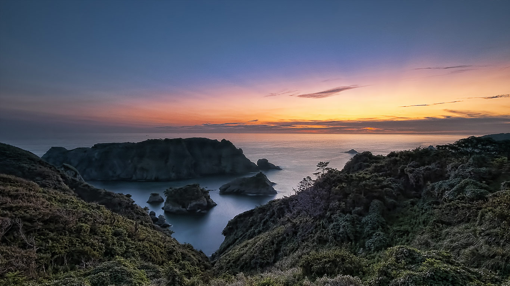

#### 20140821 Mule deer buck in Jasper National Park, Alberta, Canada (© Robert McGouey/All Canada Photos/Corbis)(Bing United Kingdom)

#### 20140820 Pennan, Aberdeenshire, Scotland (© Eichhorst/neuebildanstalt/plainpicture)(Bing United Kingdom)

#### 20140820 Blick von der Festung Ehrenbreitstein auf den Zusammenfluss von Rhein und Mosel am Deutschen Eck, Koblenz, Rheinland-Pfalz (© Walter Bibikow/eStock Photo)(Bing Deutschland)

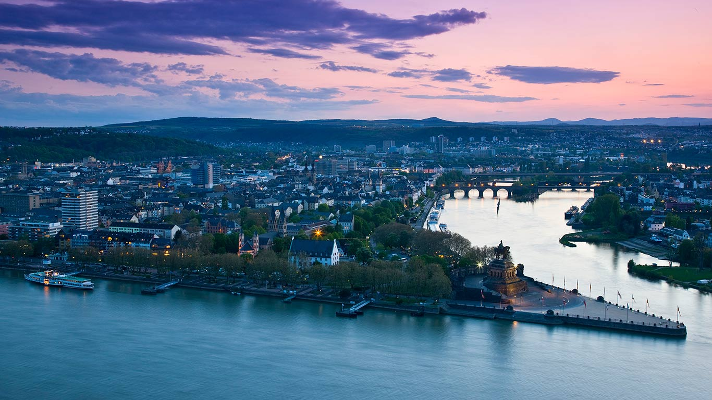

#### 20140819 Photographers shooting pictures of brown bears in Lake Clark National Park and Preserve, Alaska, USA (© Art Wolfe/Mint Images)(Bing United Kingdom)

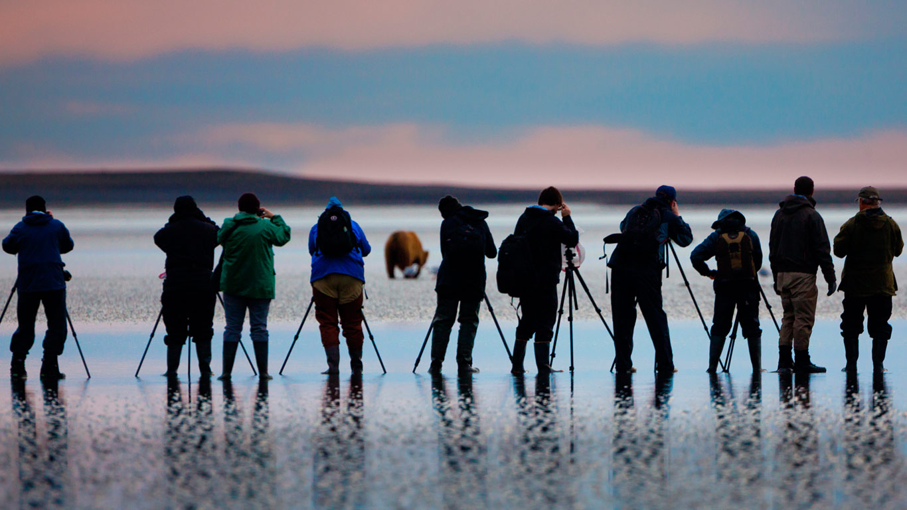

#### 20140818 天池 (© View Stock/Getty Images)(Bing China)

#### 20140818 Rare cave pearls in Son Doong Cave at Phong Nha-Kẻ Bàng National Park, Vietnam (© Carsten Peter/Getty Images)(Bing United Kingdom)

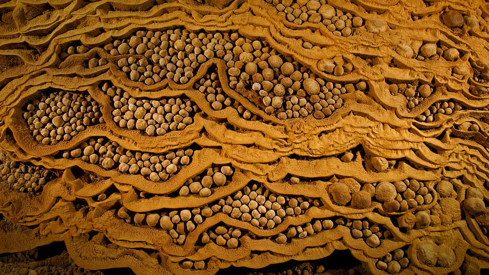

#### 20140818 An aerial view of the northern coastline of Prince Edward Island, Canada (© Blain Harrington III)(Bing Canada)

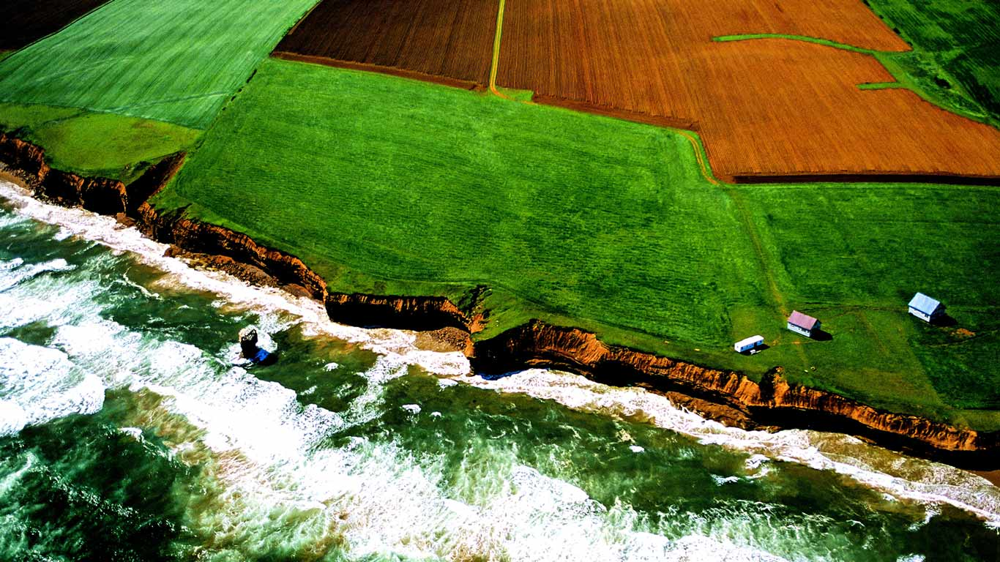

#### 20140817 Lac de montagne dans le parc national du Mercantour, France (© Kate Diamond/Alamy)(Bing France)

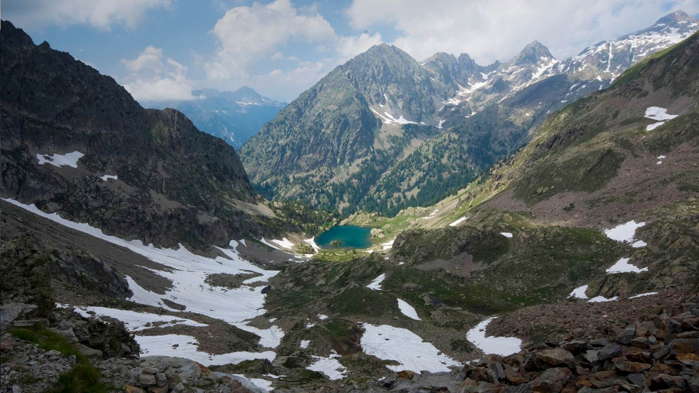

#### 20140817 Rainforest trees burnt by lightning in Daintree National Park, Far North Queensland, Australia (© Peter Adams/plainpicture)(Bing United Kingdom)

#### 20140816 Tawny frogmouth and kookaburra (© AlexandraPhotos/Moment/Getty Images)(Bing Australia)

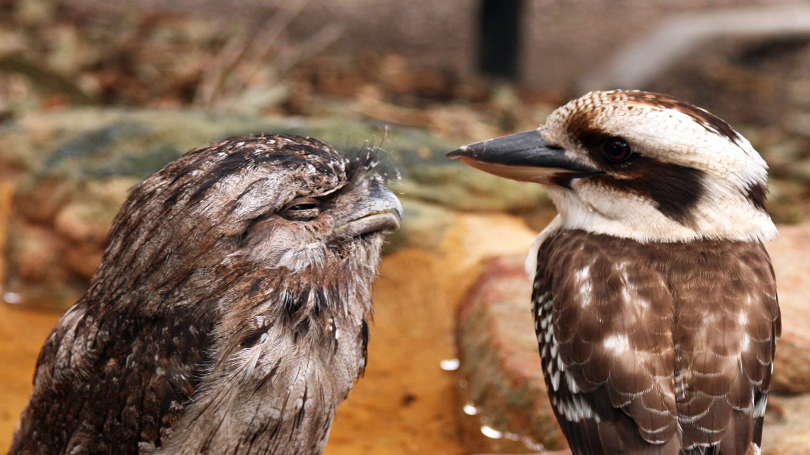

#### 20140816 Atolls in the Maldive Islands (© Sakis Papadopoulos/plainpicture)(Bing United Kingdom)

#### 20140815 Agra Fort in Agra, Uttar Pradesh, India (© Bryan Mullennix/Corbis)(Bing United Kingdom)

#### 20140814 Common myna bird on lily pad in Port Louis, Mauritius (© Getty Images)(Bing United Kingdom)

#### 20140814 Coucher de soleil sur l'Île d'Or et le cap du Dramont, Saint-Raphaël dans le Var, PACA (© Bryan Mullennix/Corbis)(Bing France)

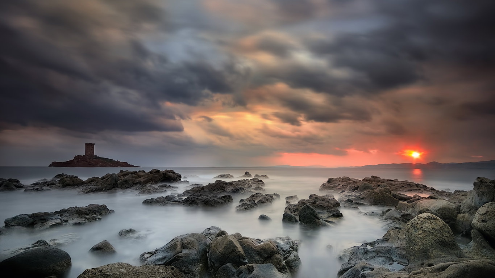

#### 20140813 Dawn at Kosciuszko National Park, New South Wales (© Ted Mead/Photolibrary/Getty Images)(Bing Australia)

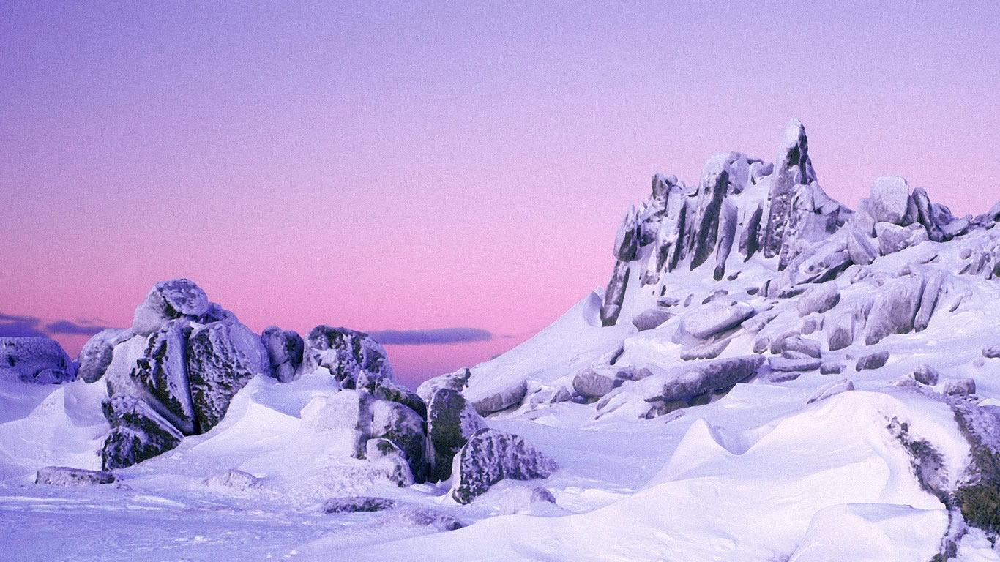

#### 20140813 Bannack State Park in Montana, USA (© Jeff Kroeze/Gallery Stock)(Bing United Kingdom)

#### 20140812 元阳县的银河 (© Nutexzles/Moment Open/Getty Images)(Bing China)

#### 20140812 A Perseid meteor streaks across the sky over the Lovell Radio Telescope at Jodrell Bank (© Christopher Furlong/Getty Images)(Bing United Kingdom)

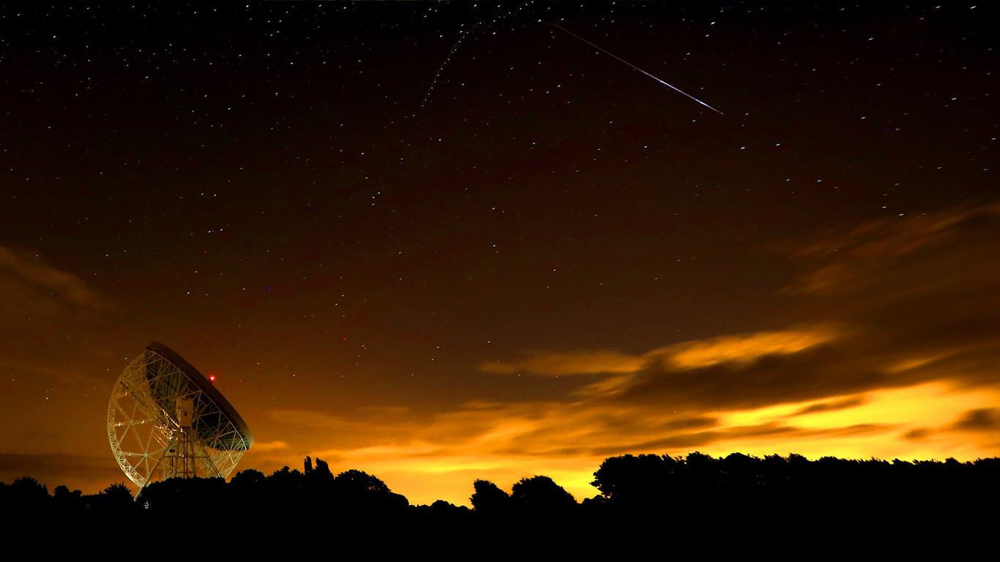

#### 20140812 Panorama de la plage du Larvotto à Monaco (© Adam Bennie/Getty Images)(Bing France)

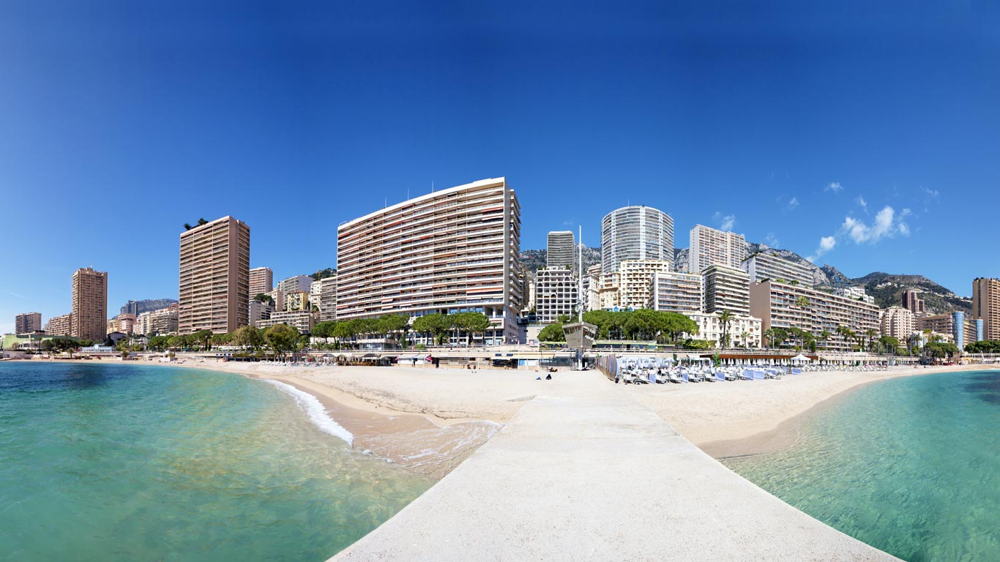

#### 20140811 ｢立石寺納経堂｣山形, 山形市 (© Sean Pavone/Alamy)(Bing Japan)

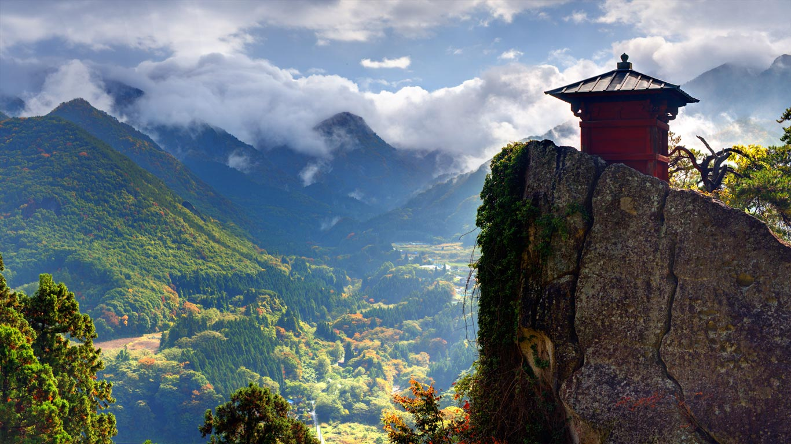

#### 20140811 Nienhagen Wood in Mecklenburg-Vorpommern, Germany (© Radius Images/Alamy)(Bing United Kingdom)

#### 20140811 Mud flats, Saint John, Bay of Fundy, New Brunswick (©  Andre Gallant/The Image Bank/Getty Images)(Bing Canada)

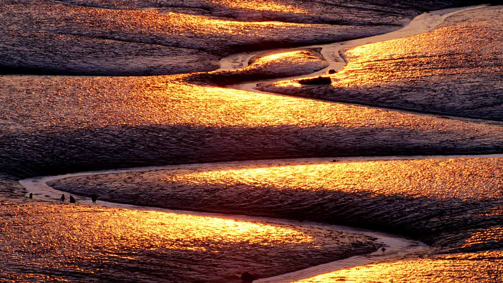

#### 20140810 Galia melon detail (© Nick Fielding/Alamy)(Bing United Kingdom)

#### 20140809 Sunlight emerging through trees in Sherwood Forest (© Laurence J. Griffiths/Getty Images)(Bing United Kingdom)

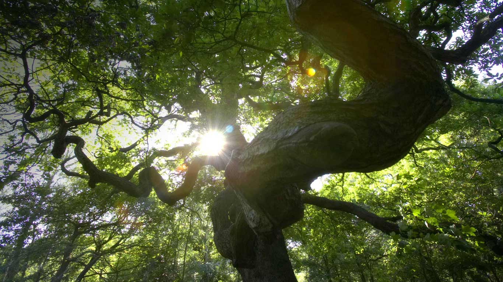

#### 20140808 Lion's mane jellyfish (© Andrey Nekrasov/Superstock)(Bing United Kingdom)

#### 20140808 北京市景山公园 (© View Stock/Getty Images)(Bing China)

#### 20140807 Thorny dragon in the Central Desert, Northern Territory (© Frans Lanting/Mint Images/Getty Images)(Bing Australia)

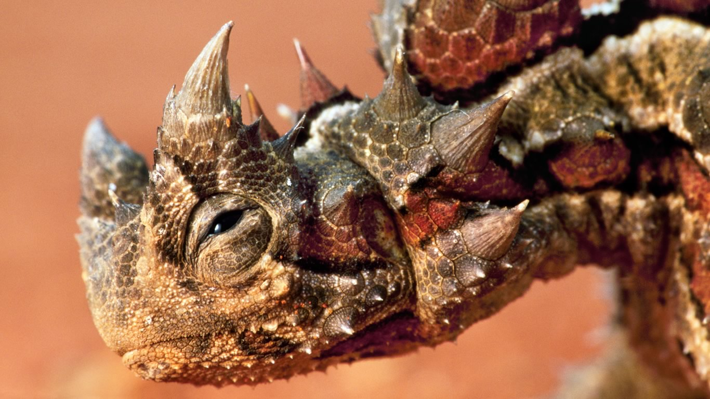

#### 20140807 Alligator Reef Light in the Florida Keys (© Stephen Frink/Aurora Photos)(Bing United Kingdom)

#### 20140806 ｢原爆ドーム｣広島, 広島市 (© David Clumpner/Getty)(Bing Japan)

#### 20140806 Arctic fox family, Swedish Lapland (© Staffan Widstrand/plainpicture)(Bing United Kingdom)

#### 20140806 A Martian-esque landscape of sandstone arches in Nova Scotia's Minas Basin at low tide (© Shaunl/Vetta/Getty Images)(Bing Canada)

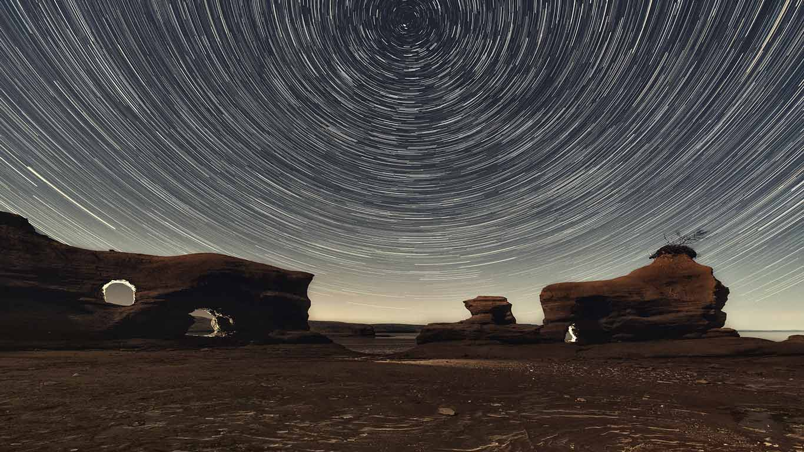

#### 20140805 Cap de Formentor, Majorca, Balearic Islands, Spain (© Marcos Molina/Alamy)(Bing United Kingdom)

#### 20140805 金山岭长城 (© View Stock/Getty Images)(Bing China)

#### 20140804 ｢河津七滝ループ橋｣静岡, 河津町 (© Corbis/Superstock)(Bing Japan)

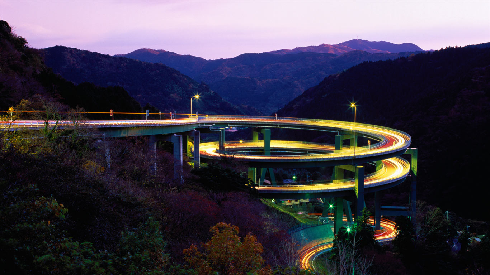

#### 20140804 叶片上的蜥蜴影子 (© Steve Satushek/Stone/Getty Images)(Bing China)

#### 20140804 Woman walks on west beach, Berneray, Outer Hebrides, Scotland (© Cody Duncan/Aurora Photos)(Bing United Kingdom)

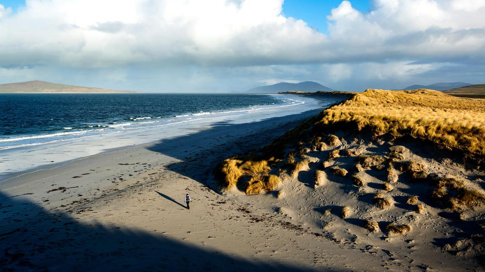

#### 20140803 Silver fern frond, New Zealand (© Alkalyne/Getty Images)(Bing United Kingdom)

#### 20140802 哈得逊湾岸边，正在玩闹的北极熊 (© Robert Postma/Design Pics/Getty Images)(Bing China)

#### 20140802 Kampa Island, Prague, Czech Republic (© Gianluca Santoni/SIME/4Corners)(Bing United Kingdom)

#### 20140801 Children walk through a field of kochia at Hitachi Seaside Park, Hitachinaka, Japan (© Sankei/Getty Images)(Bing United Kingdom)

#### 20140801 Bowling Ball Beach near Point Arena, California (© Patrick Smith/Getty Images)(Bing United States)

