#### 20140930 Sheep with a border collie in England (© Wayne Hutchinson/Minden Pictures)(Bing United Kingdom)

#### 20140930 ｢ガントリークレーン｣東京, 東京港 (© Jeremy Woodhouse/PanoramaStock)(Bing Japan)

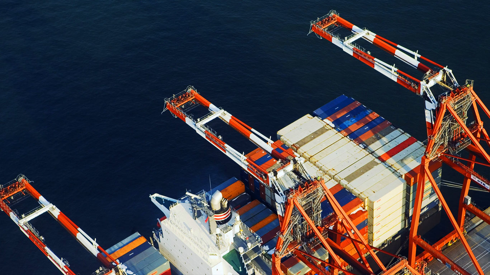

#### 20140929 Hohenzollern Castle near Stuttgart, Germany (© Heinz Wohner/Getty Images)(Bing United Kingdom)

#### 20140928 Boathouses on Lake Panache, Greater Sudbury, Ontario, Canada (© Don Johnston/Corbis)(Bing United Kingdom)

#### 20140927 树蛙 (© TAKAO ONOZATO/amanaimages/Corbis)(Bing China)

#### 20140927 Tulips at the Floriade flower festival in Canberra, Australia (© Ginevre Marlow/Alamy)(Bing United Kingdom)

#### 20140927 Alaska Peninsula National Wildlife Refuge (© Steven Besserman/Corbis)(Bing United States)

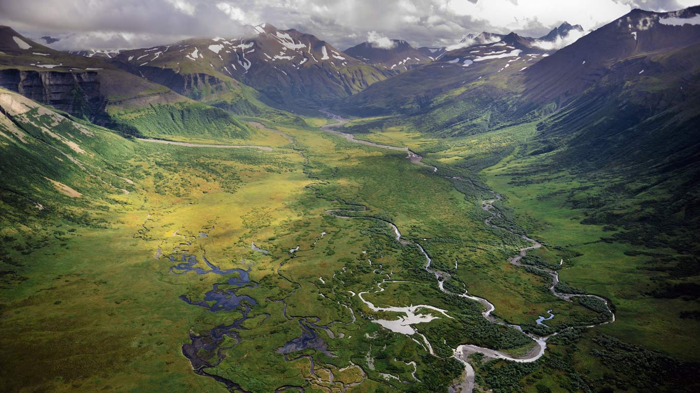

#### 20140926 广东深圳，欢乐海岸 (© BEIJING BEAUTY VIEW P/View Stock/Age Fotostock)(Bing China)

#### 20140926 Elephants in the Okavango Delta, Botswana (© Michael Poliza/Getty Images)(Bing United Kingdom)

#### 20140925 北京，清华大学工字厅 (© Yu Cui)(Bing China)

#### 20140925 Three Gorges, Yangtze river, China (© View Stock/Getty Images)(Bing United Kingdom)

#### 20140925 Buttermere, Lake District National Park, England (© Chris Warren/SuperStock)(Bing United States)

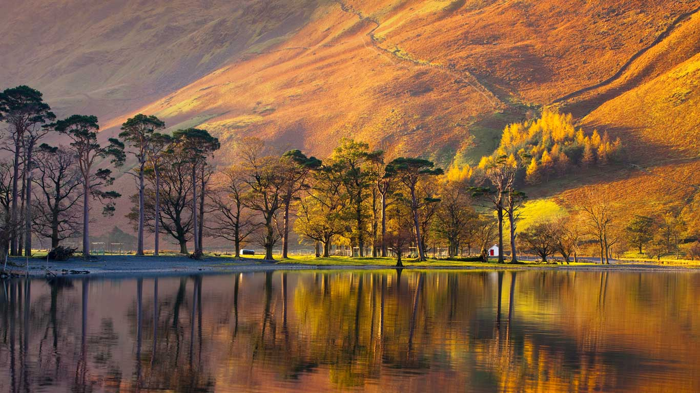

#### 20140924 Porcelain crab (Neopetrolisthes maculatus) at the Great Barrier Reef, Australia (© Rodger Klein/WaterFrame/Getty Images)(Bing Australia)

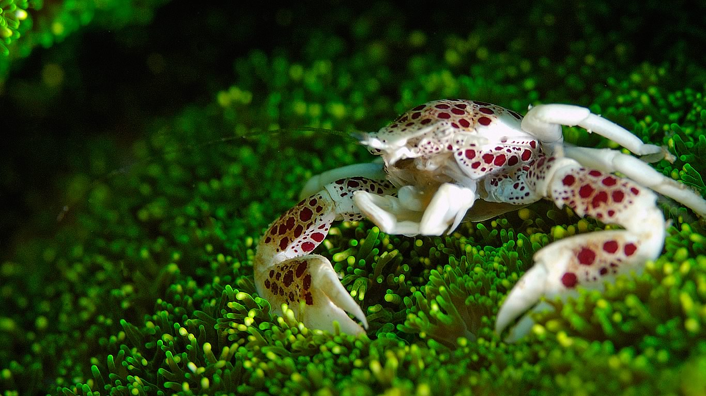

#### 20140924 北京中秋圆明园灯会 (© Liu Xiaoyang/Alamy)(Bing China)

#### 20140924 ｢エゾリス｣北海道 (© Datacraft\Universal Images Group/age fotostock)(Bing Japan)

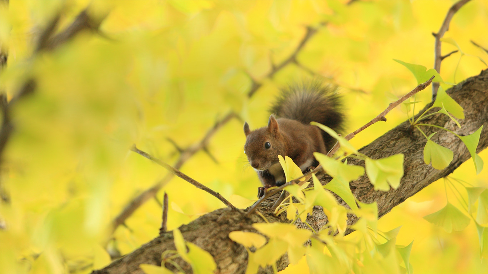

#### 20140924 Banana slug in Prairie Creek Redwoods State Park, California, USA (© Michael Nichols/Getty Images)(Bing United Kingdom)

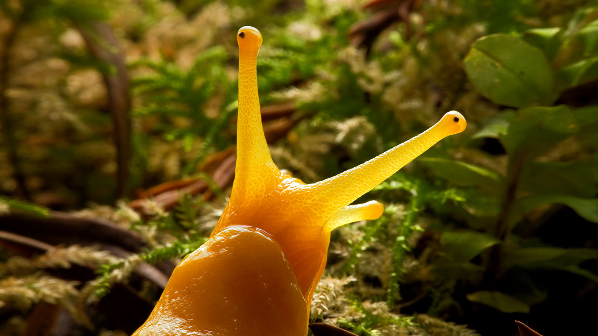

#### 20140923 Weinfelder Maar im Herbst, Daun, Rheinland-Pfalz, Deutschland (© Karl Johaentges/LOOK Die Bildagentur der Fotografen GmbH/Alamy)(Bing Deutschland)

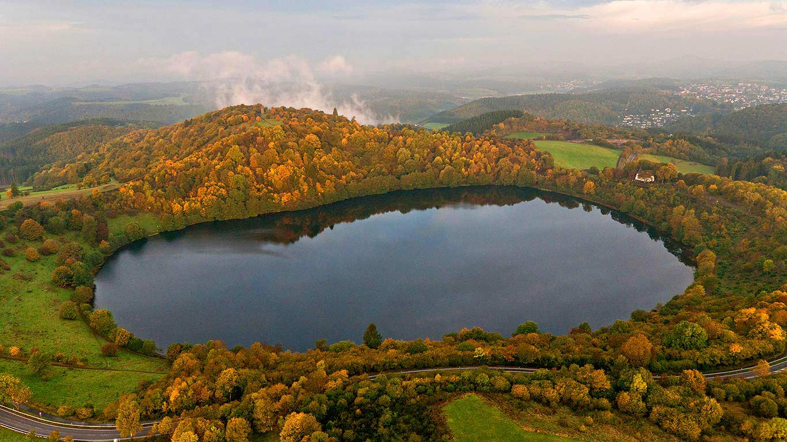

#### 20140923 秋日湖面上，多彩树木的倒影 (© MelindaChan/Flickr/Getty Images)(Bing China)

#### 20140923 Abandoned army trucks on the North Canol Road, Yukon, Canada (© Robert Postma/Corbis)(Bing United Kingdom)

#### 20140923 Flowing glacial creek with Mount Harrison Smith in background, Cirque of Unclimbables, Nahanni National Park, Northwest Territories (© Peter Mather/First Light/Getty Images)(Bing Canada)

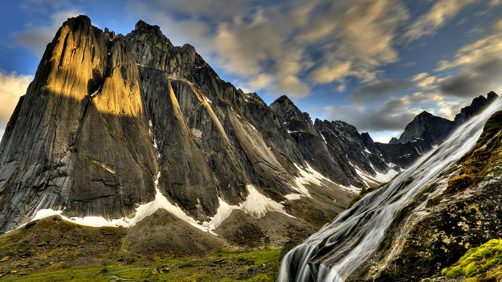

#### 20140922 Orcas in Resurrection Bay near Kenai Fjords National Park, Alaska, USA (© Steven Kazlowski/SuperStock)(Bing United Kingdom)

#### 20140921 Rhein in Flammen, Sankt Goar, Rheinland-Pfalz, Deutschland (© Günter Gräfenhain/4Corners)(Bing Deutschland)

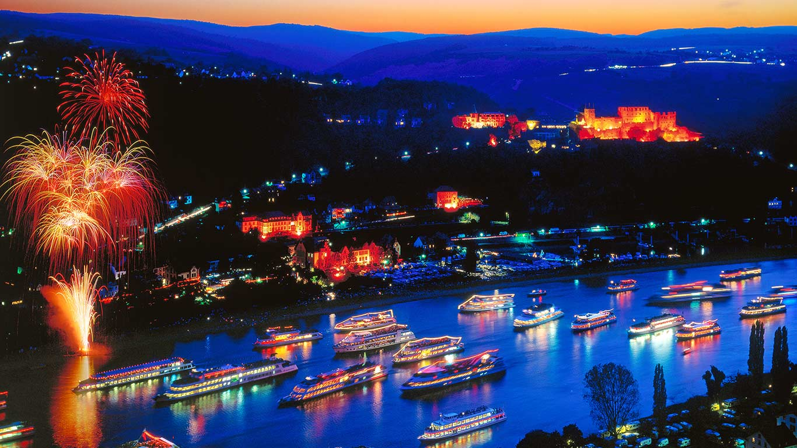

#### 20140921 Peace Camp at Downhill Beach in Northern Ireland (© Christopher Hill Photographic/Alamy)(Bing United Kingdom)

#### 20140920 Ferris wheel gondolas, Oktoberfest, Munich, Germany (© Karlheinz Irlmeier/Corbis)(Bing United Kingdom)

#### 20140919 Macaws, Tambopata National Reserve, Peru (© Frans Lanting/Getty Images)(Bing United Kingdom)

#### 20140918 漓江风光 (© Sino Images/Getty Images)(Bing China)

#### 20140918 ｢玉泉洞｣沖縄, 南城市 (© Chris Willson/Alamy)(Bing Japan)

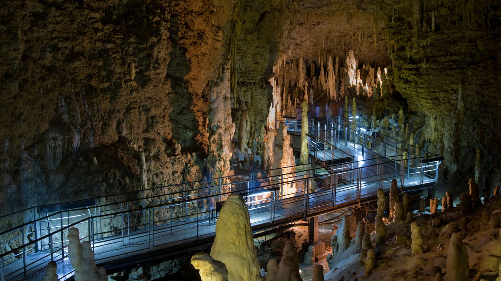

#### 20140918 A pier goes through the ocean in Iracema beach, Fortaleza city, Ceará state, Brazil (© SIME/eStock Photo)(Bing United Kingdom)

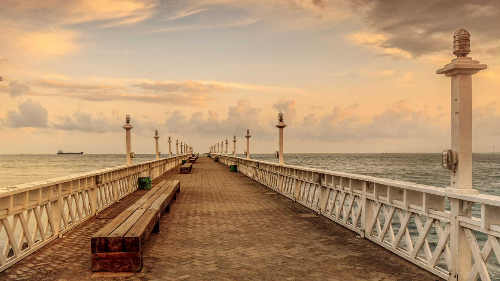

#### 20140917 ｢ゆりかもめ｣東京, 芝浦ふ頭 (© fotoVoyager/Vetta/Getty Images)(Bing Japan)

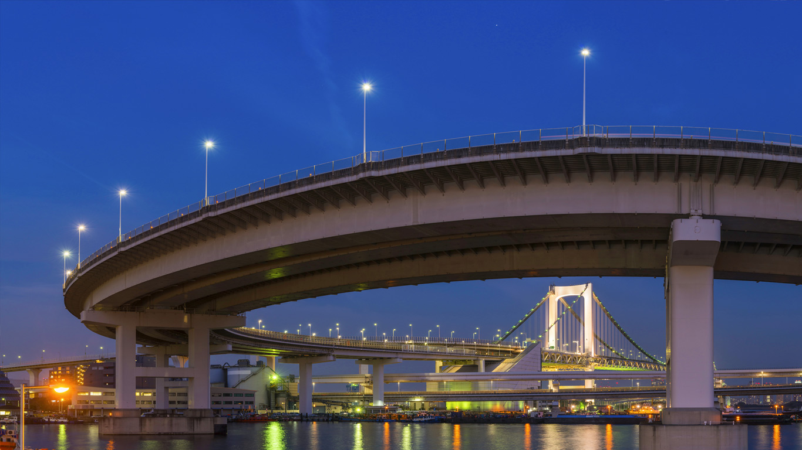

#### 20140917 A dredge boat near the Glénan Islands, France (© Andia/Latitude Stock)(Bing United Kingdom)

#### 20140916 Young guanaco seeking safety under mother, Torres del Paine National Park, Chile (© Gavriel Jecan/Aurora Photos)(Bing United Kingdom)

#### 20140916 Alpine foothills surrounding the town of Weiz in Styria, Austria (© Andreas Neuburger/Getty Images)(Bing United States)

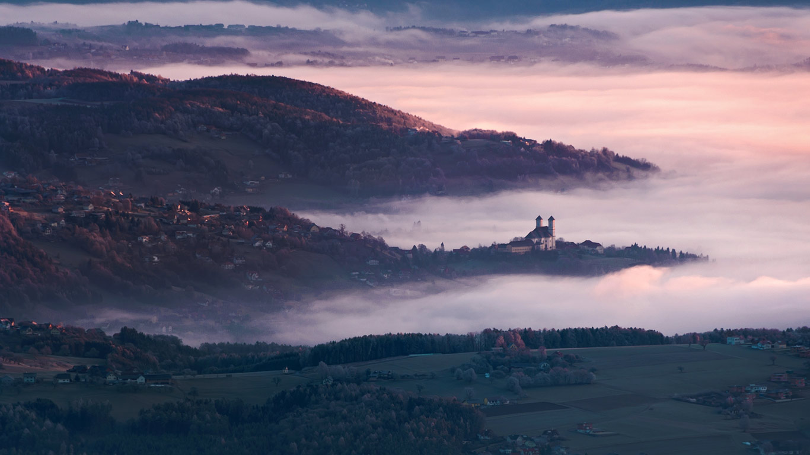

#### 20140915 Mayan pyramids, Tikal, Guatemala (© AirPano)(Bing United Kingdom)

#### 20140914 Aerial View of Triangle Island Ecological Reserve, British Columbia, Canada (© Russ Heinl/Corbis)(Bing United Kingdom)

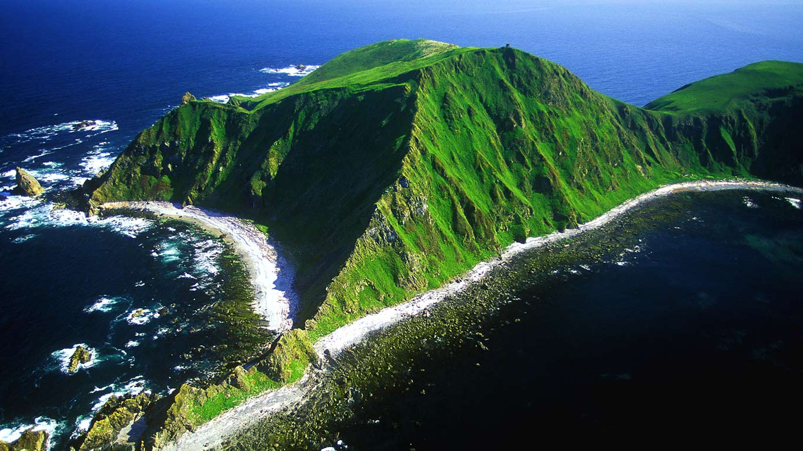

#### 20140914 Mammoth Hot Springs, Yellowstone National Park, Wyoming (© Dmitrii Lezine)(Bing United States)

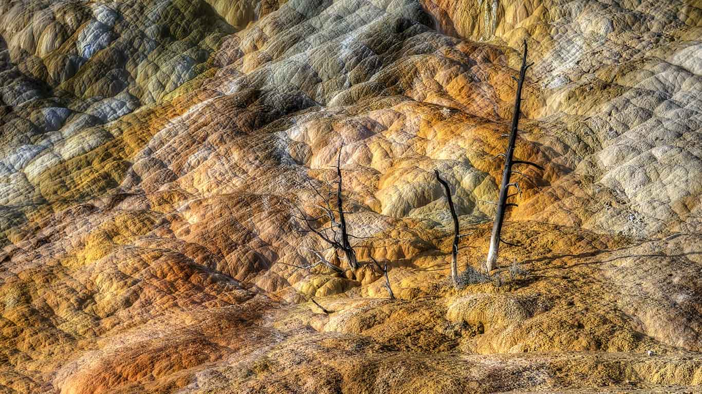

#### 20140914 Parasols colorés sur la plage de Deauville, Calvados, Basse-Normandie (© Ekaterina Pokrovsky/Shutterstock)(Bing France)

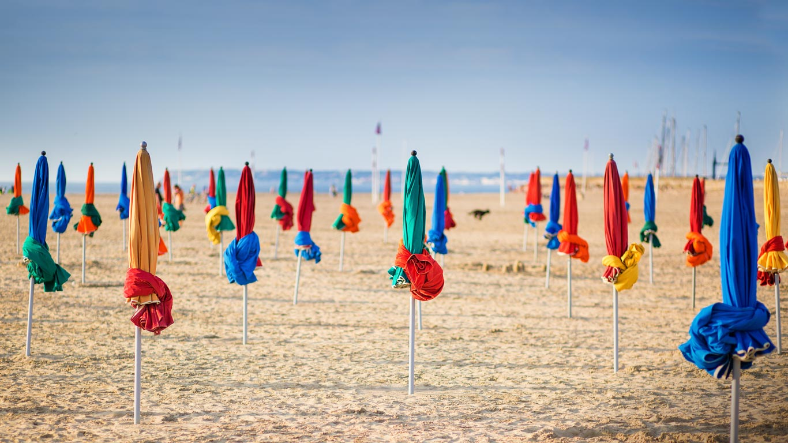

#### 20140913 Palais Royal in Paris, Ministry of Culture, France (© Production Perig/Shutterstock)(Bing United Kingdom)

#### 20140913 Fort McHenry National Monument and Historic Shrine, Baltimore, Maryland (© Richard T. Nowitz/Corbis)(Bing United States)

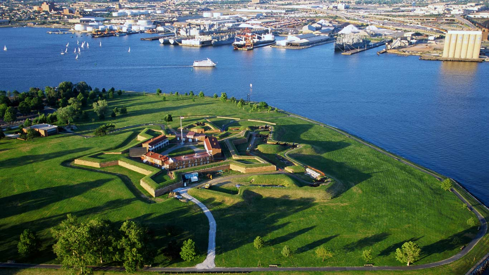

#### 20140912 Mesa Arch, Canyonlands National Park, Utah, USA (© Jeff Clay/Tandem Still + Motion)(Bing United Kingdom)

#### 20140911 The National September 11 Memorial & Museum, New York City (© Andrew Holbrooke/Corbis)(Bing United States)

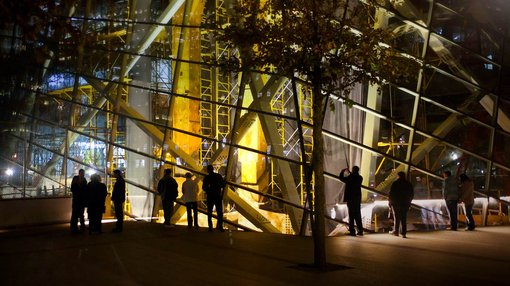

#### 20140911 Treeking on frozen Weasel River with Mt Thor at left, Auyuittuq National Park, Baffin Island, Nunavut (© Grant Dixon/Lonely Planet Images/Getty Images)(Bing Canada)

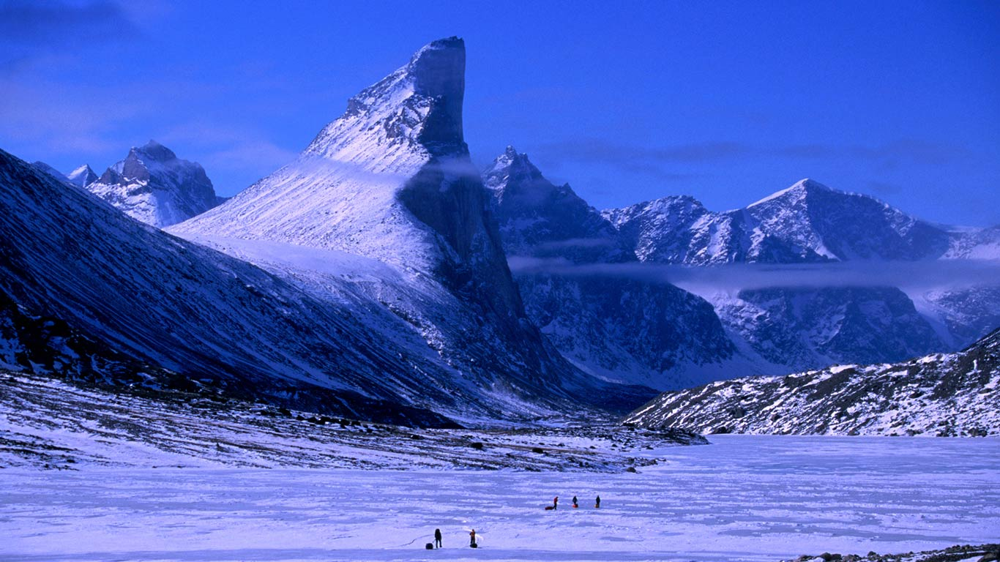

#### 20140911 Pilsumer Leuchtturm, Pilsum, Niedersachsen, Deutschland (© Günter Gräfenhain/4Corners)(Bing Deutschland)

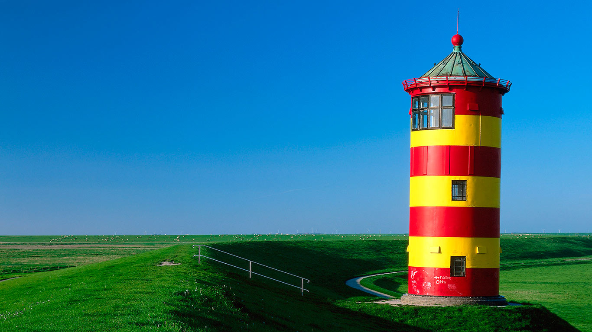

#### 20140911 贵州省铜仁市，梵净山风光 (© Sino Images/Getty Images)(Bing China)

#### 20140911 Chipmunk eating red berries (© Takao Onozato/Aflo/Getty Images)(Bing United Kingdom)

#### 20140911 Vue aérienne du Rougier de Camarès, Aveyron, Midi-Pyrénées (© Eric Teissedre/Corbis)(Bing France)

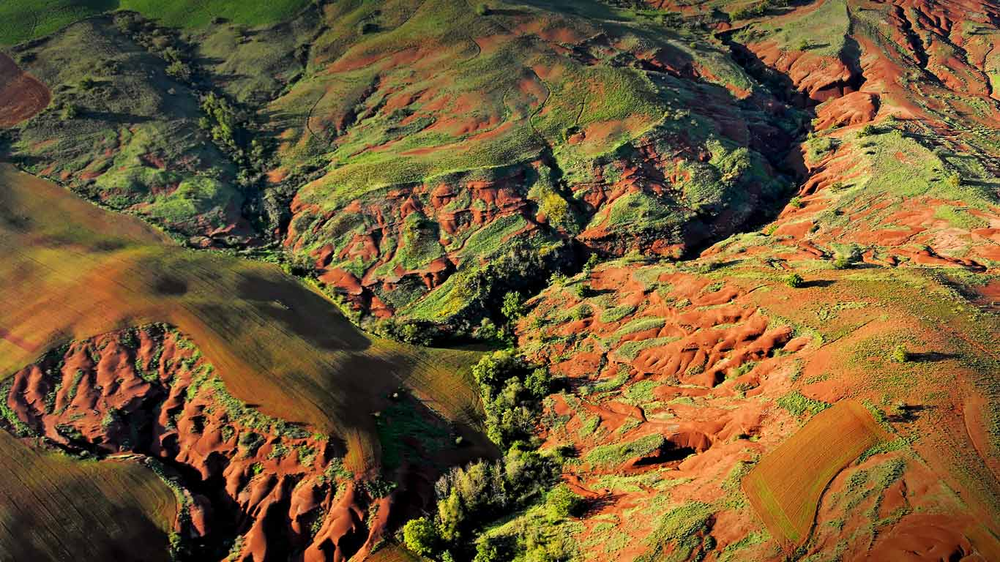

#### 20140910 俯瞰北京长安街 (© View Stock/Getty Images)(Bing China)

#### 20140910 Canoe on Moraine Lake in Banff National Park, Alberta, Canada (© Getty Images)(Bing United Kingdom)

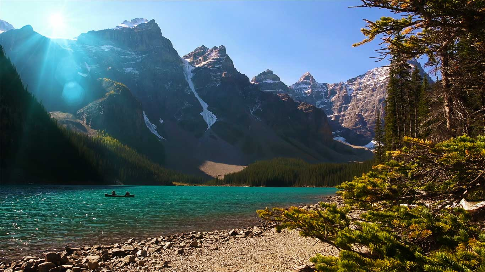

#### 20140909 Rio Tinto, Huelva, Spain (© David Santiago Garcia/Aurora Photos)(Bing United Kingdom)

#### 20140908 月饼与茶 (© Li Ding/Alamy)(Bing China)

#### 20140908 Millau Viaduct over the Tarn River Valley near Millau, France (© Patrick Landmann/Science Photo Library)(Bing United Kingdom)

#### 20140908 ｢満月とツル｣北海道, 釧路 (© Datacraft\Universal Images Group/Aurora Photos)(Bing Japan)

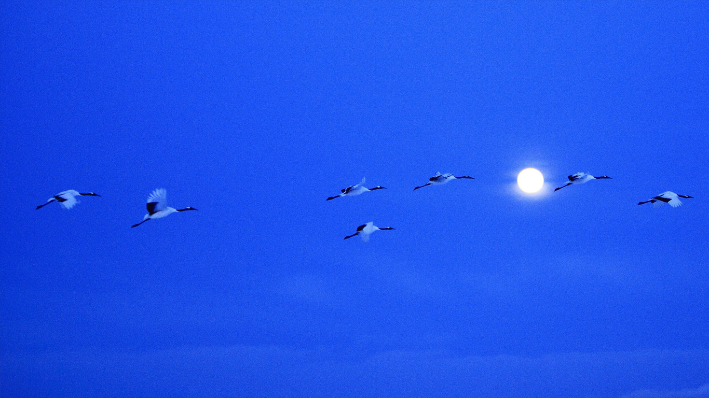

#### 20140907 Valais blacknose sheep in Valais, Switzerland (© NaturePL/SuperStock)(Bing United Kingdom)

#### 20140906 Place du Général-de-Gaulle ou « Grand-Place » à Lille, Nord-Pas-de-Calais (© Production Perig/Shutterstock)(Bing France)

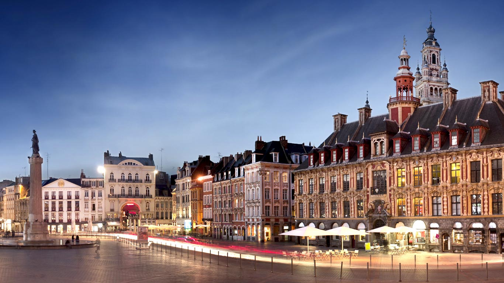

#### 20140906 Meltwater creates waterfalls on an ice cap, Svalbard Archipelago, Norway (© Ralph Lee Hopkins/Corbis)(Bing United Kingdom)

#### 20140905 Leopard perched in a tree in the Moremi Game Reserve, Botswana (© Getty Images)(Bing United Kingdom)

#### 20140905 Berliner Funkturm mit Spirale bei Nacht (© Ina Penning/Panther Media/Age Fotostock)(Bing Deutschland)

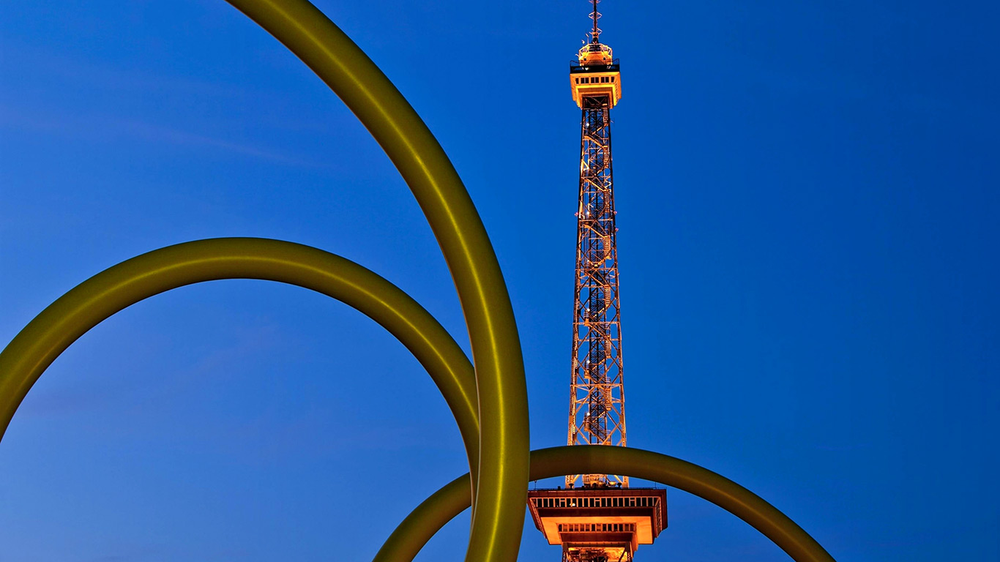

#### 20140904 Rocky Mountain National Park, Colorado, USA (© Dan Ballard/Corbis)(Bing United Kingdom)

#### 20140904 Tourists visiting Journey Behind the Falls, Horseshoe Falls, Ontario (© Alan Copson/info@awl-images.com/JAI/Corbis)(Bing Canada)

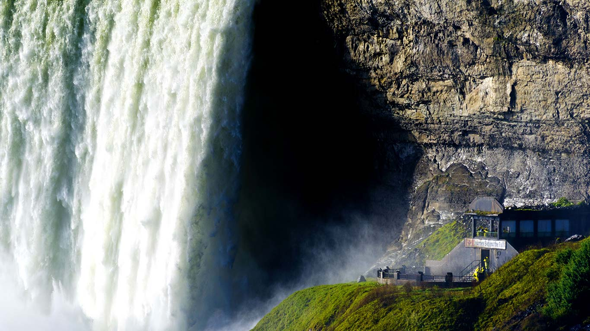

#### 20140903 Visitors in Death Valley National Park, California, USA (© David Hellard/Rex Features)(Bing United Kingdom)

#### 20140903 Hanging Rock at the Blue Mountains, New South Wales (© Phillip Hayson/Photolibrary/Getty Images)(Bing Australia)

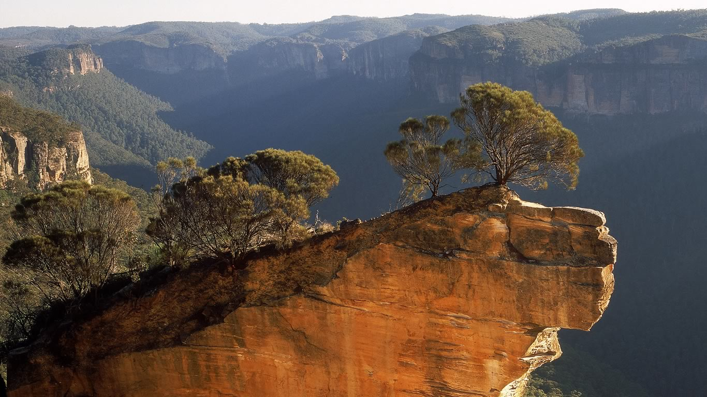

#### 20140902 Hanoi, Vietnam (© David Santiago Garcia/Aurora Photo)(Bing United Kingdom)

#### 20140902 小东江的捕鱼人 (© Sino Images/Getty Images)(Bing China)

#### 20140901 World War II monument, Sutjeska National Park, Bosnia and Herzegovina (© Brendan van Son/Tandem Stills & Motion)(Bing United States)

#### 20140901 ｢曽原湖｣福島県, 北塩原村 (© GYRO PHOTOGRAPHY/aman/a.collectionRF/age fotostock)(Bing Japan)

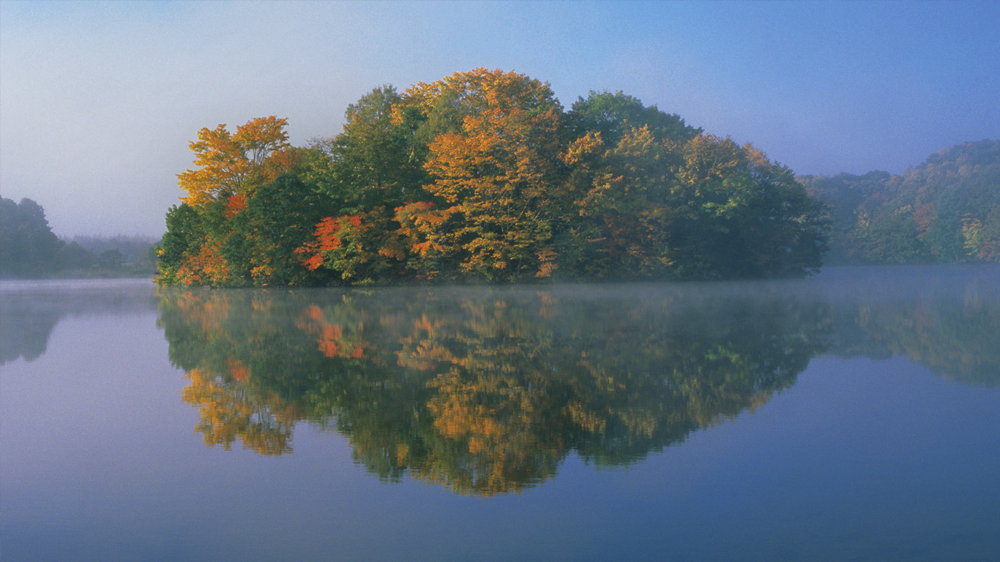

#### 20140901 Red-billed oxpeckers on an impala, Kruger National Park, South Africa (© Friedrich von Hörsten/Alamy)(Bing United Kingdom)

