#### 20141031 Farmland in Makassar, South Sulawesi, Indonesia (© Keren Su/Corbis)(Bing United Kingdom)

#### 20141030 Ring-necked pheasant male, Texel, Netherlands (© Thomas Hinsche/Corbis)(Bing United Kingdom)

#### 20141030 ｢ジャックオランタン｣ (© MIXA/Age fotostock)(Bing Japan)

#### 20141029 Grasslands sunset, Saskatchewan (© Gord Hunter, Monkey's Fist Photography/Getty Images)(Bing Canada)

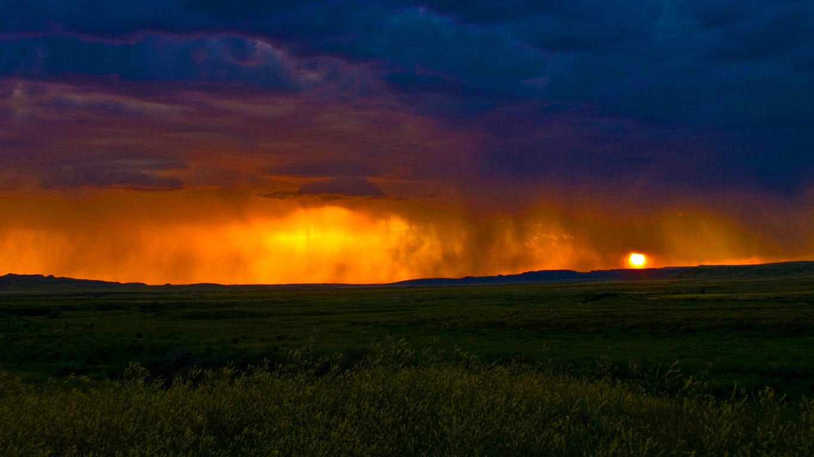

#### 20141029 Meltwater on the Greenland ice sheet, Greenland (© James Balog/Aurora Photos)(Bing United Kingdom)

#### 20141028 Bracelet bay, Gower Peninsula, Wales (© Keith Taylor/Alamy)(Bing United Kingdom)

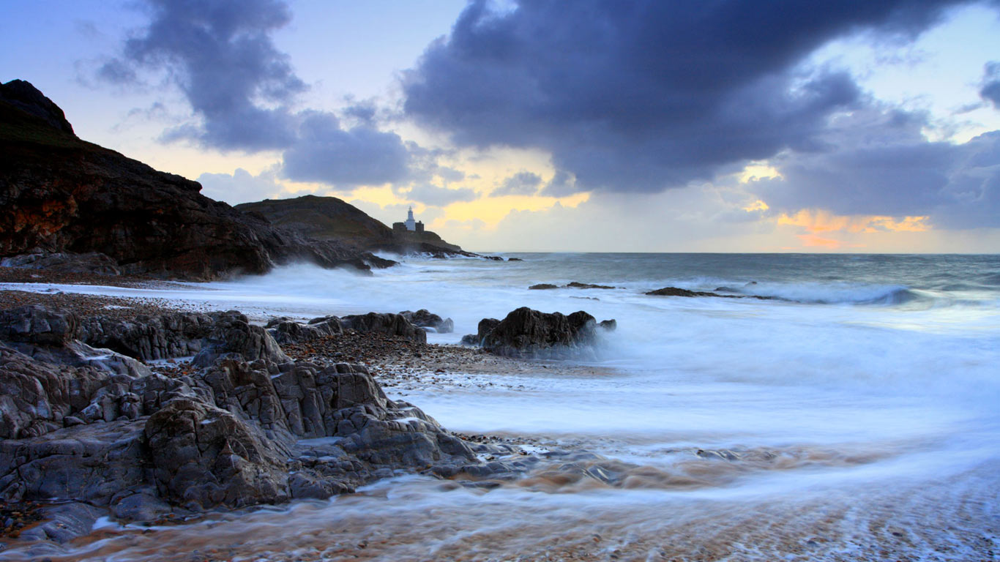

#### 20141027 Gears and rubies inside an antique watch (© Seraficus/Getty Images)(Bing United Kingdom)

#### 20141027 ｢谷川岳｣群馬, 水上 (© Nature Production/npl/Minden Pictures)(Bing Japan)

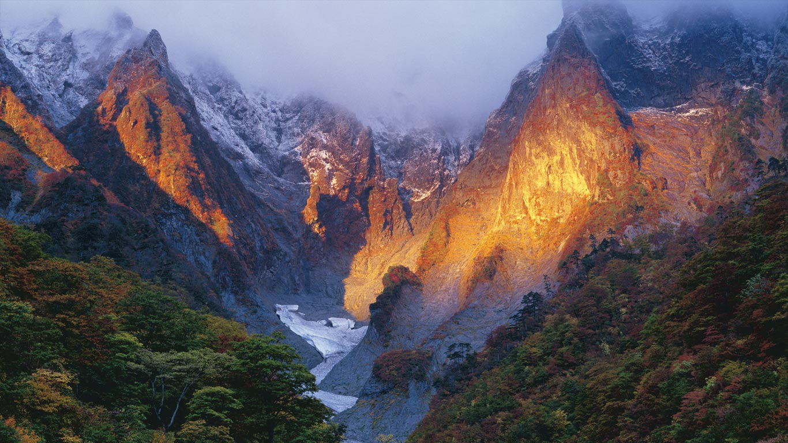

#### 20141027 Dehesa de Moncayo Natural Park near Zaragoza, Spain (© David Santiago Garcia/Aurora Photos)(Bing United States)

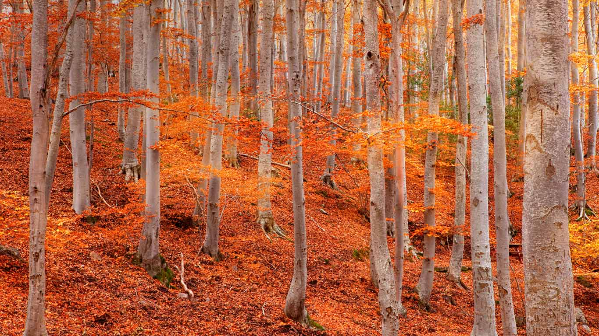

#### 20141026 Tests of rapeseed crops, isolated parcels under tunnel to avoid crossings (aerial view), Oucques, Loir-et-Cher, France (© CORMON Francis/hemis.fr/Alamy)(Bing United Kingdom)

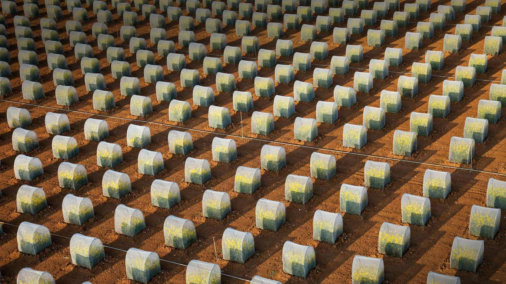

#### 20141026 Aerial view of farmlands, North Island, New Zealand (© Paul Chesley/Alamy)(Bing United States)

#### 20141025 Aerial view of North Malé Atoll, Maldives (© Robert Harding Picture Library/Superstock)(Bing United Kingdom)

#### 20141025 北京潭柘寺秋景 (© Jochen Schlenker/Robert Harding Picture Library Ltd/Alamy)(Bing China)

#### 20141024 新疆阿尔泰山，喀纳斯湖 (© Henry Westheim Photography/Alamy)(Bing China)

#### 20141024 Côte de granit rose, Côte-d’Armor, Bretagne (© Frank Krahmer/Corbis)(Bing France)

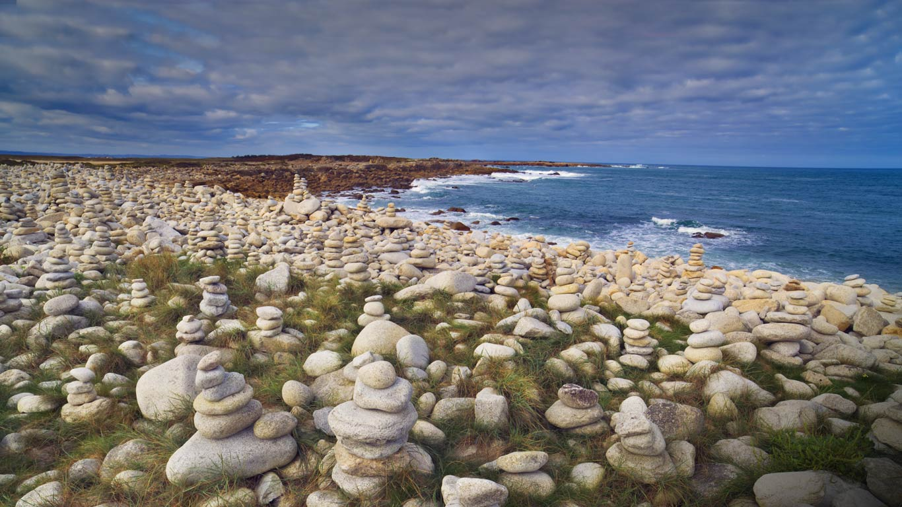

#### 20141024 View from Grizzly Peak in the Berkeley Hills above Berkeley, California, USA (© Toby Harriman/Tandem Still + Motion)(Bing United Kingdom)

#### 20141024 Jacob-und-Wilhelm-Grimm-Zentrum, Universitätsbibliothek der Humboldt-Universität zu Berlin, Deutschland (© SIME/eStock Photo)(Bing Deutschland)

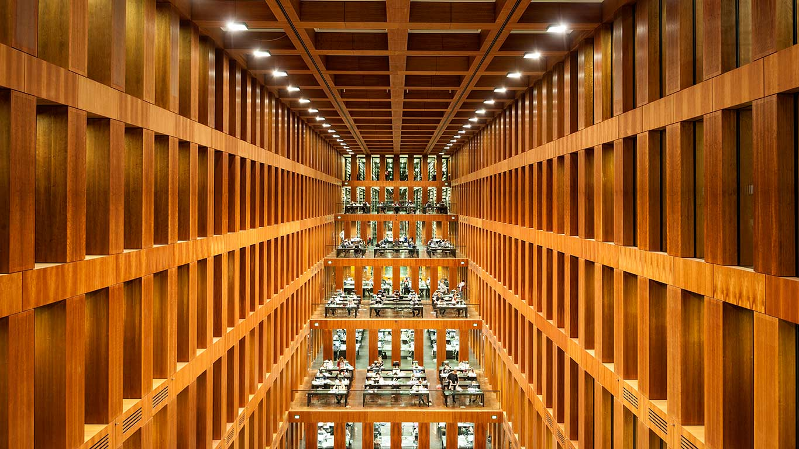

#### 20141023 River flowing over rocks at twilight, Coteau du Lac, Quebec, Canada (© Patrick Di Fruscia/Visuals Unlimited/Corbis)(Bing Canada)

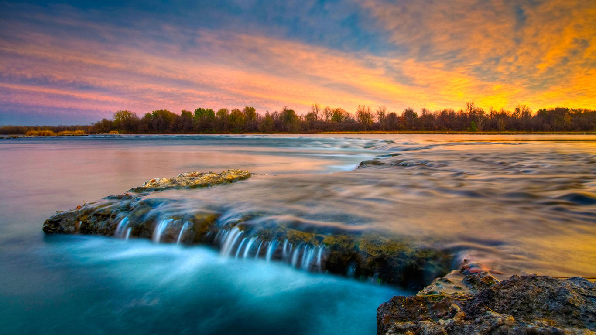

#### 20141023 Detail of a painted beauty butterfly, Yasuni National Park, Amazon, Ecuador (© Pete Oxford/ Minden Pictures)(Bing United Kingdom)

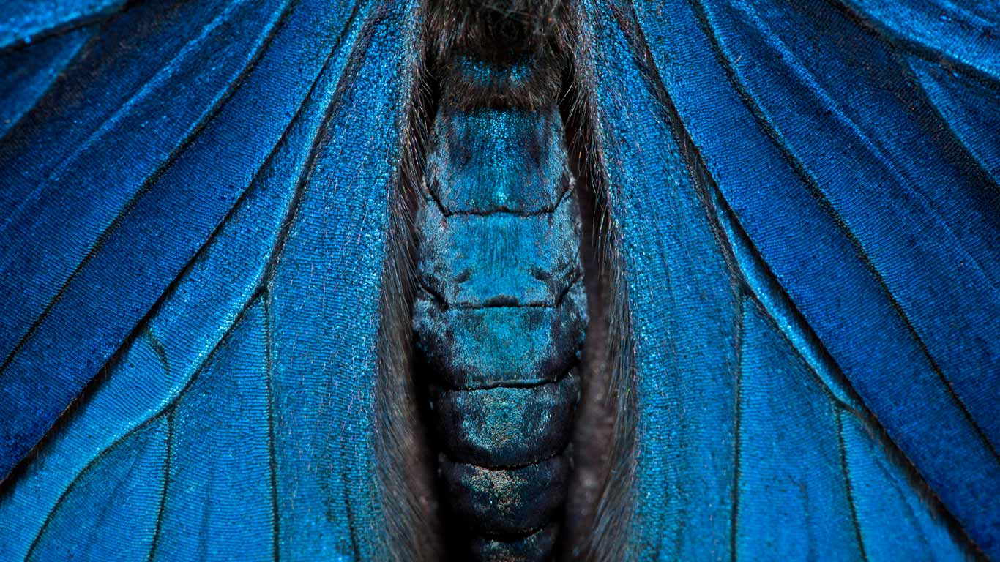

#### 20141022 North Fork of the Virgin River, Zion Canyon, Utah, USA (© Shutterstock)(Bing United Kingdom)

#### 20141021 The Solomon R. Guggenheim Museum, New York City (© Matt Mallams/Aurora Photos)(Bing United States)

#### 20141021 China National Library, Beijing (© Zens photo/Getty Images)(Bing United Kingdom)

#### 20141020 广东英德，英西峰林的小桥 (© VIEW STOCK RF/Age Fotostock)(Bing China)

#### 20141020 Izumo-taisha in Izumo, Japan (© AM Corporation/Aflo Co. Ltd./Alamy)(Bing United Kingdom)

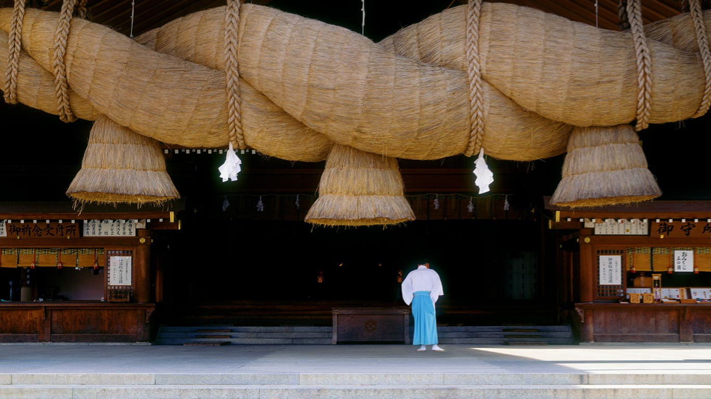

#### 20141020 Aerial view of Gosses Bluff meteorite crater, Northern Territory (© Ted Mead/Photolibrary/Getty Images)(Bing Australia)

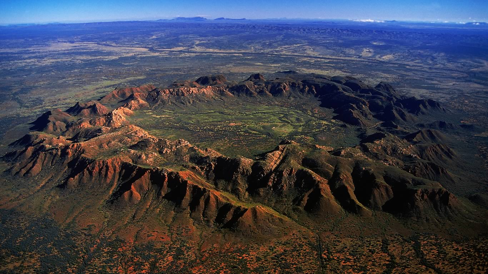

#### 20141020 Kastanien-Allee im Herbst, Stuttgart, Deutschland (© Ursula Sander/Moment Open/Getty Images)(Bing Deutschland)

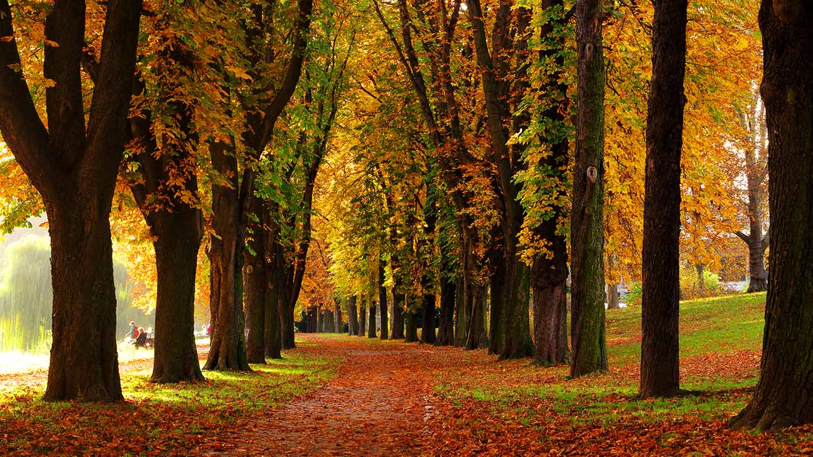

#### 20141020 ｢赤目四十八滝｣三重, 名張 (© Seigo Yamamura/Aflo Co. Ltd./Alamy)(Bing Japan)

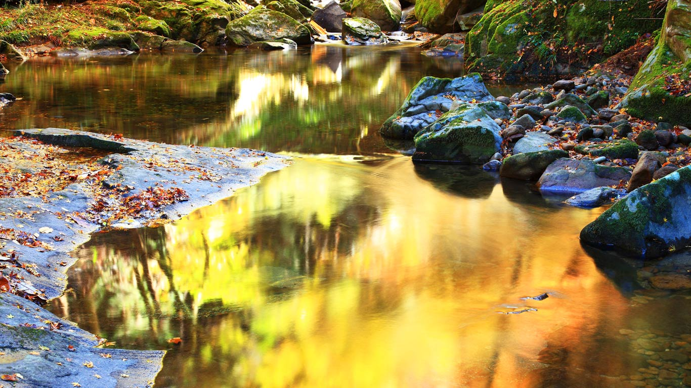

#### 20141019 Seedling mangroves in Cayos Cochinos, Honduras (© Mac Stone/Tandem Stills + Motion)(Bing United Kingdom)

#### 20141019 ｢平安神宮｣京都, 左京区 (© Sergii Rudiuk/Shutterstock)(Bing Japan)

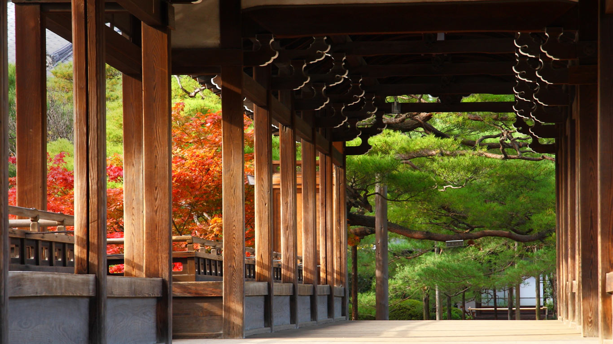

#### 20141019 新疆喀纳斯，禾木村 (© Fotosearch/Getty Images)(Bing China)

#### 20141018 Fromages saint-nectaire en cours d’affinage dans une cave, Haute-Loire, Auvergne (© Franz Marc Frei/LOOK Die Bildagentur der Fotografen GmbH/Alamy)(Bing France)

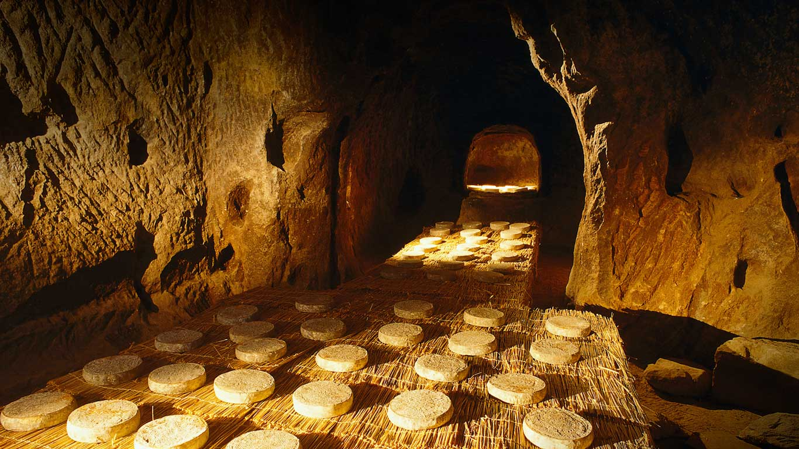

#### 20141018 Fox in Îles-de-Boucherville National Park near Montreal, Canada (© Rolland Gelly/ Getty Images)(Bing United Kingdom)

#### 20141017 The stepping stones on Perranporth beach, Cornwall, England (© Andrew Ray/Alamy)(Bing United Kingdom)

#### 20141017 Harriman State Park, Hudson River Valley, New York (© Arnab Banerjee/Gallery Stock)(Bing United States)

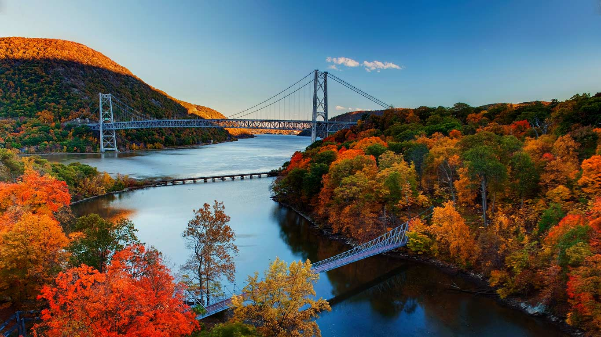

#### 20141016 Time-lapse image of the skies above the Siding Spring Observatory near Coonabarabran in New South Wales, Australia (© David Nunuk/Science Photo Library)(Bing Australia)

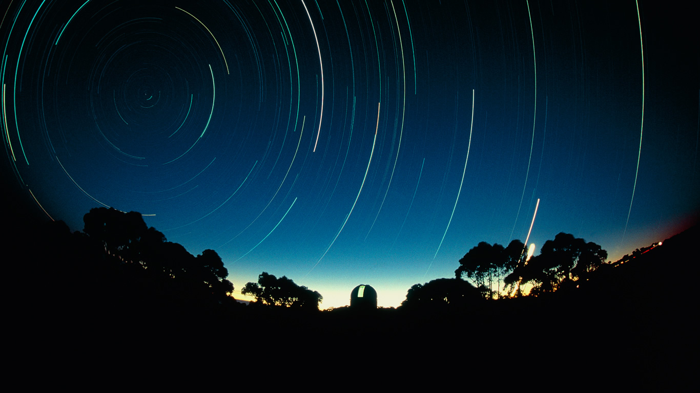

#### 20141016 Rosenkäfer und Distel (© Dr. Rüdiger Hess/geo-select fotoArt)(Bing Deutschland)

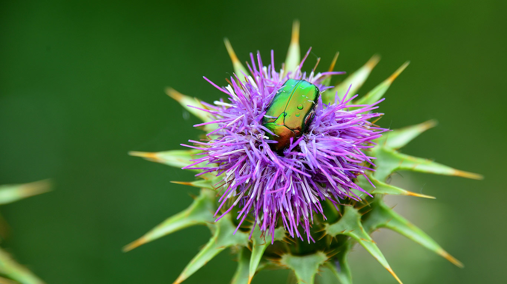

#### 20141016 Painted Dunes below Cinder Cone, Lassen Volcanic National Park, California, USA (© Kevin Schafer/Minden Pictures)(Bing United Kingdom)

#### 20141015 Palm Jumeirah in Dubai, United Arab Emirates (© AirPano)(Bing United Kingdom)

#### 20141014 White storks at Cabo Sardão, Portugal (© David Santiago Garcia/Aurora Photos)(Bing United Kingdom)

#### 20141014 The setting sun along the Dempster Highway, Yukon (© Robert Postma/First Light/Corbis)(Bing Canada)

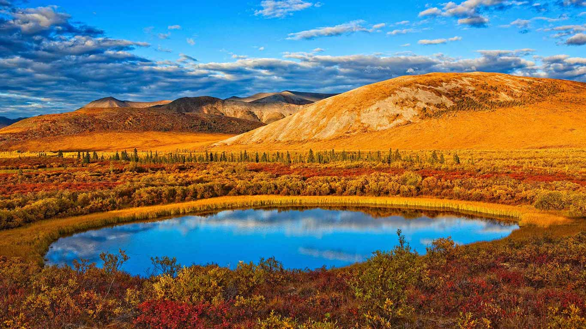

#### 20141013 Dry Island Buffalo Jump Provincial Park, Alberta, Canada (© Darwin Wiggett/Alamy)(Bing United Kingdom)

#### 20141012 Detail of Pearly King Costume, Covent Garden, London (© Steve Vidler/Corbis)(Bing United Kingdom)

#### 20141012 Barcolana regatta, Gulf of Trieste, Italy (© SIME/eStock Photo)(Bing United States)

#### 20141011 Matsumoto Castle, Japan (© Mitsushi Okada/Panorama Stock)(Bing United Kingdom)

#### 20141011 Aldeadávila Dam, Arribes del Duero, Salamanca, Spain (© David Santiago Garcia/Aurora Photos)(Bing United States)

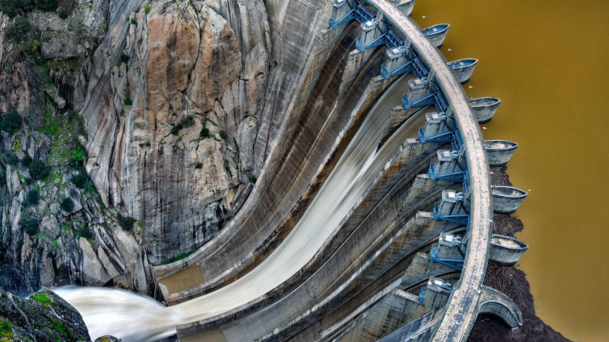

#### 20141010 Detail of a television tower illuminated during the Festival of Lights in 2011, Berlin, Germany (© Holger Burmeister/Alamy)(Bing United Kingdom)

#### 20141009 Marina Bay, Singapore (© Andy Lerner/Tandem Stills + Motion)(Bing United Kingdom)

#### 20141009 ｢秋の峠｣長野 (© GYRO PHOTOGRAPHY/Corbis)(Bing Japan)

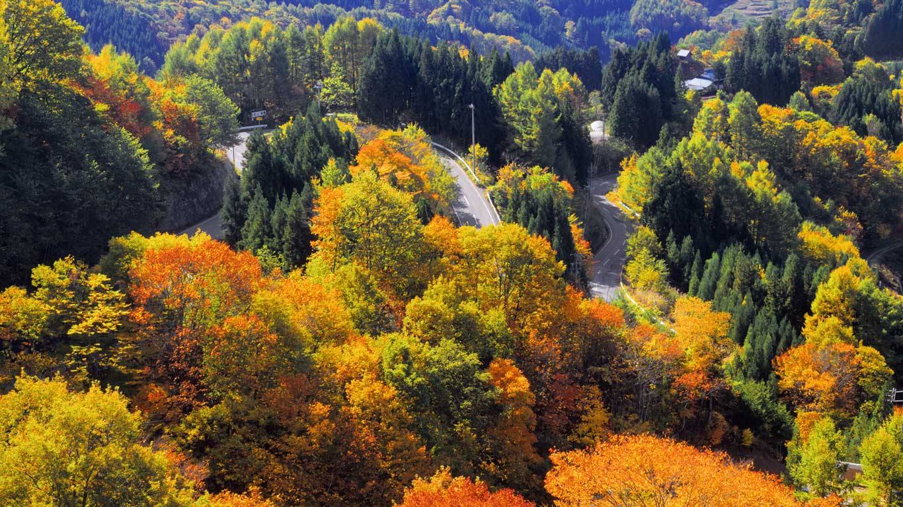

#### 20141008 Hauptwache mit Bürotürmen des Palaisquartier im Hintergrund, Frankfurt am Main, Hessen, Deutschland (© Sandra Raccanello/SIME/4Corners)(Bing Deutschland)

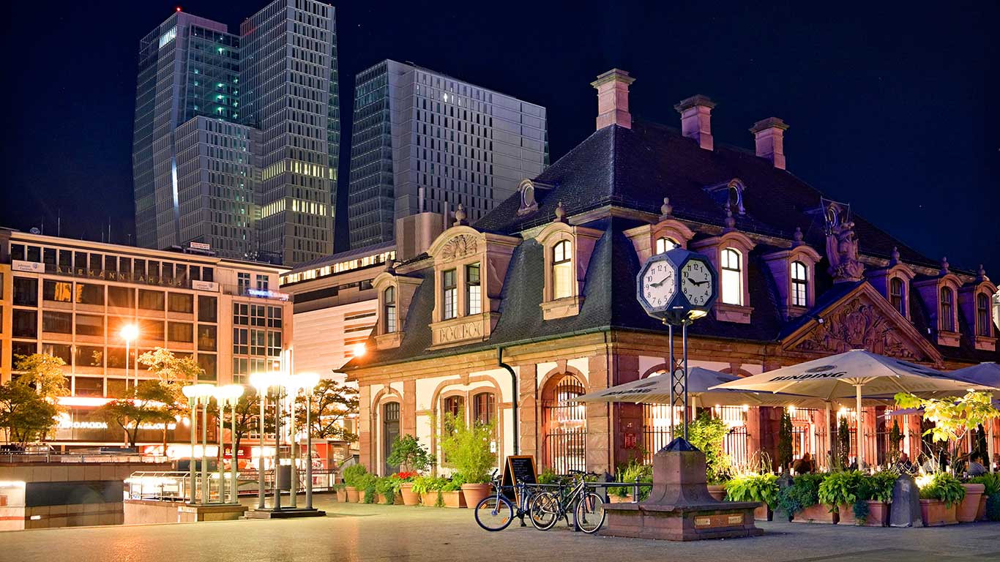

#### 20141008 Dallas Divide near Ridgway, Colorado, USA (© Stephanie Coffman/TandemStock)(Bing United Kingdom)

#### 20141007 Paleokaria Bridge over the Portaikos River near Trikala, Greece (© Hercules Milas/Alamy)(Bing United Kingdom)

#### 20141006 Koi carp, Kyoto (© Sharon Smith/Getty Images)(Bing United Kingdom)

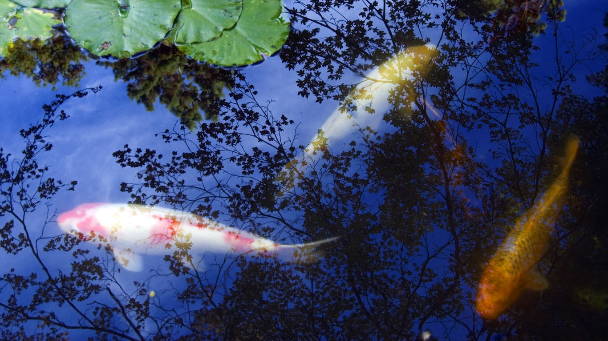

#### 20141006 Vue aérienne de la plage d’Hossegor, Landes, Aquitaine (© Colin Matthieu/Hemis/Alamy)(Bing France)

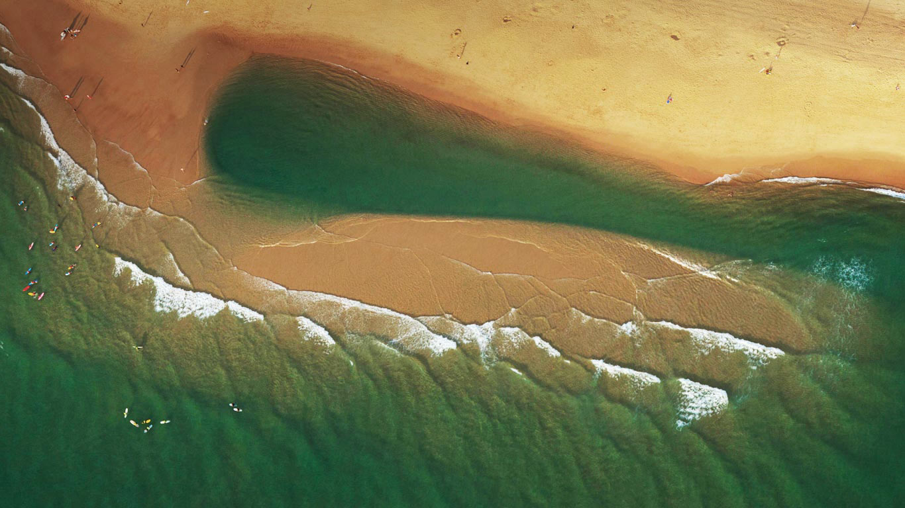

#### 20141006 Halfmoon fish in a kelp forest offshore from San Diego, California (© Richard Herrmann/Minden Pictures)(Bing United States)

#### 20141005 King penguin surrounded by chicks, South Georgia (© Steve Bloom Images/Alamy)(Bing United Kingdom)

#### 20141004 Sombrero Galaxy (Messier 104) as seen from NASA's Hubble Space Telescope (© STScI/AURA/NASA)(Bing United Kingdom)

#### 20141003 Feuerwerk über dem Reichstag, Berlin, Deutschland (© Axel Schmies/Novarc/Corbis)(Bing Deutschland)

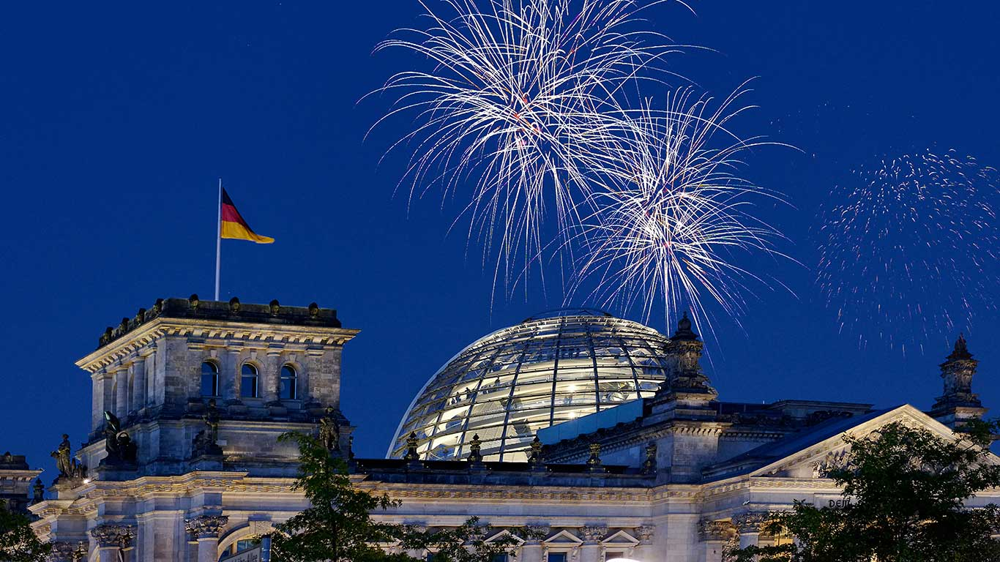

#### 20141003 People boarding trains at Überseequartier station in HafenCity, Hamburg, Germany (© Shutterstock)(Bing United Kingdom)

#### 20141002 Mountain brook in Red Rock Canyon in Waterton Lakes National Park, Canada (© Frank Krahmer/Corbis)(Bing United Kingdom)

#### 20141002 Silkworm cocoons at a weaving center in Luang Prabang, Laos (© David Noton Photography/Alamy)(Bing United States)

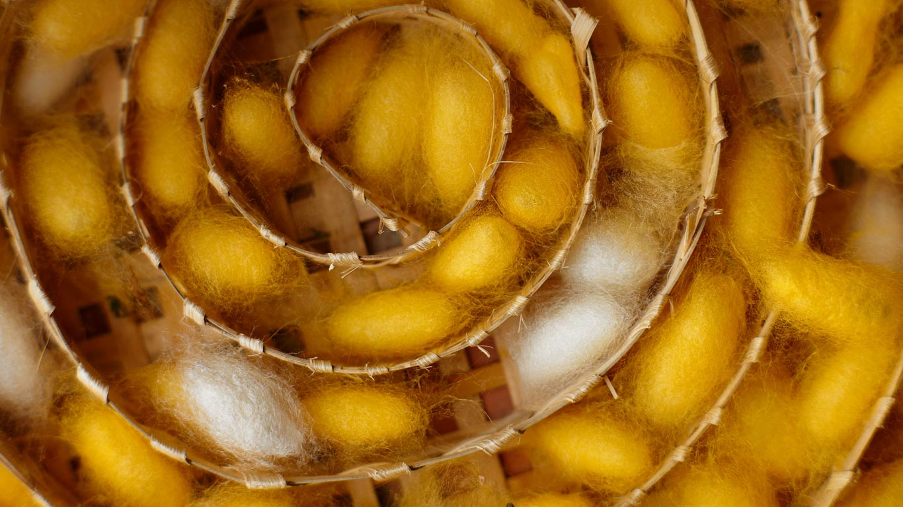

#### 20141002 菊花特写 (© View Stock/Getty Images)(Bing China)

#### 20141001 2009年10月1日国庆节，天安门广场上空的焰火 (© Yang Lei (c)/Xinhua Press/Corbis)(Bing China)

#### 20141001 Cathedral Peak, Yosemite National Park, California, USA (© Mark Brodkin/Rex Features)(Bing United Kingdom)

