#### 20141129 The 15th-century church of Rodel on the Isle of Harris (© Jim Richardson/Getty Images)(Bing United Kingdom)

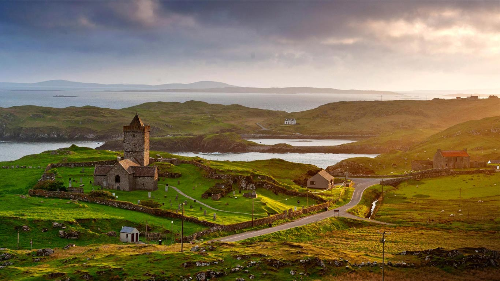

#### 20141128 土耳其特拉布宗，乌宗湖(长湖) (© Ozcan Malkocer/Getty Images)(Bing China)

#### 20141128 ｢貴船神社｣京都, 左京区 (© Rob Tilley/DanitaDelimont.com)(Bing Japan)

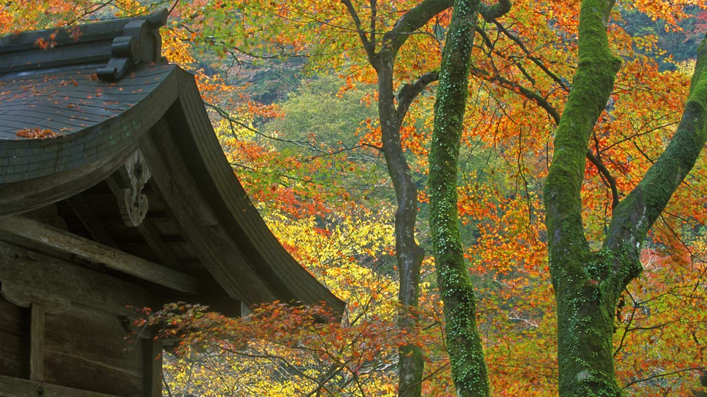

#### 20141128 Sperm whale off the coast of the Azores, Portugal (© Reinhard Dirscherl/Aurora Photos)(Bing United Kingdom)

#### 20141127 土耳其伊斯坦布尔，新清真寺(耶尼清真寺) (© Domingo Leiva/Moment/Getty Images)(Bing China)

#### 20141127 ｢ヒマワリの種を食べるエゾシマリス｣北海道 (© Shutterstock)(Bing Japan)

#### 20141127 Canada geese fly though Elk Island National Park, Alberta, Canada (© Paul Horsley/Corbis)(Bing United Kingdom)

#### 20141126 Siberian chipmunk eating sunflower seeds, Hokkaido, Japan (© Shutterstock)(Bing United Kingdom)

#### 20141126 Place Royale du Peyrou en fin de journée, Montpellier, Hérault, Languedoc-Roussillon (© Hans Georg Eiben/Getty Images)(Bing France)

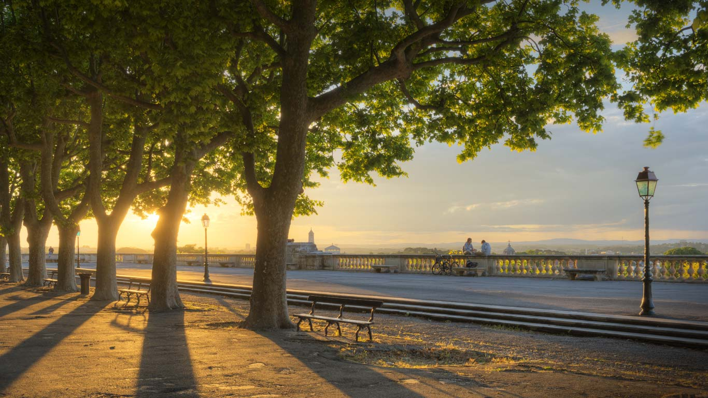

#### 20141126 ｢草津湯畑｣群馬, 草津 (© James D. Rogers/Getty Images)(Bing Japan)

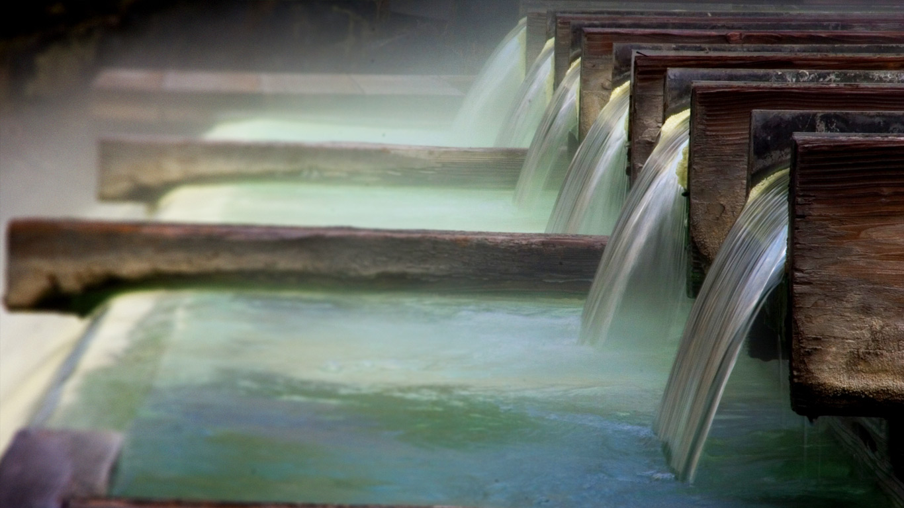

#### 20141125 Lamayuru Monastery, Kargil District, Western Ladakh, India (© Jochen Schlenker/Corbis)(Bing United Kingdom)

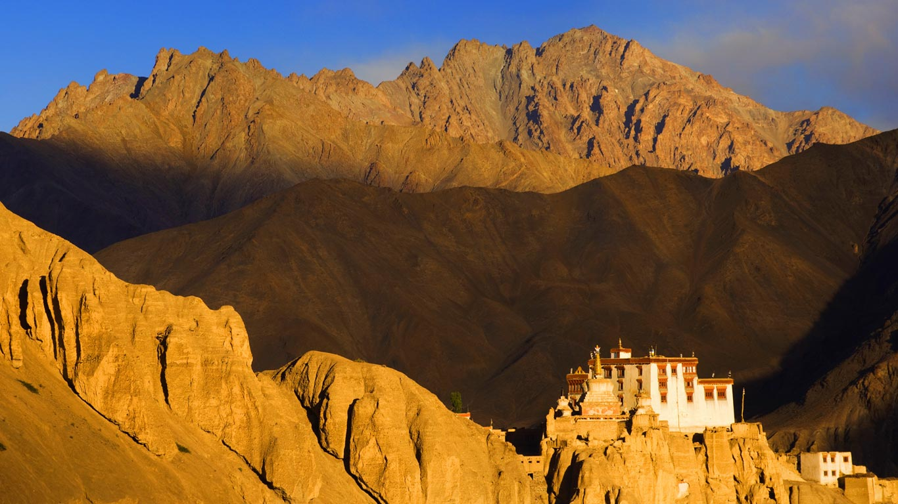

#### 20141125 Aspen trees in autumn foliage, San Juan Mountains near Telluride, Colorado (© Sergio Ballivian/Tandem Stills + Motion)(Bing United States)

#### 20141124 Train from Potrerillos mine to Diego de Almagro, Chile (© Jean-Marc Frybourg/Rex Features)(Bing United States)

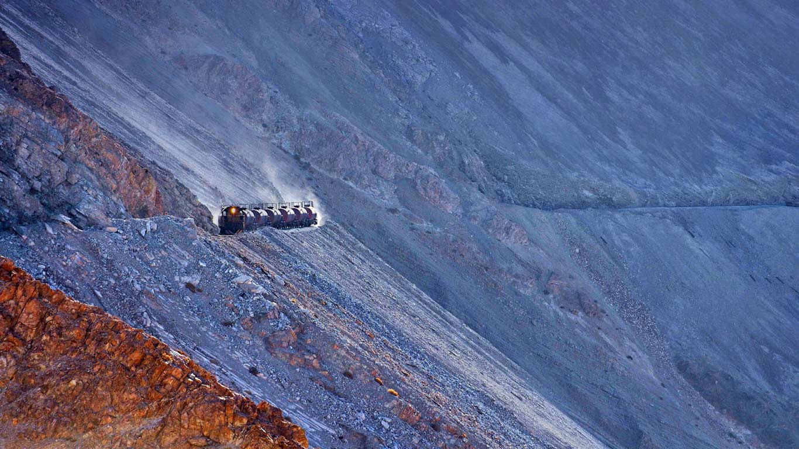

#### 20141124 Kloster Seeon, Chiemgau, Bayern, Deutschland (© Florian Werner/Look/Age Fotostock)(Bing Deutschland)

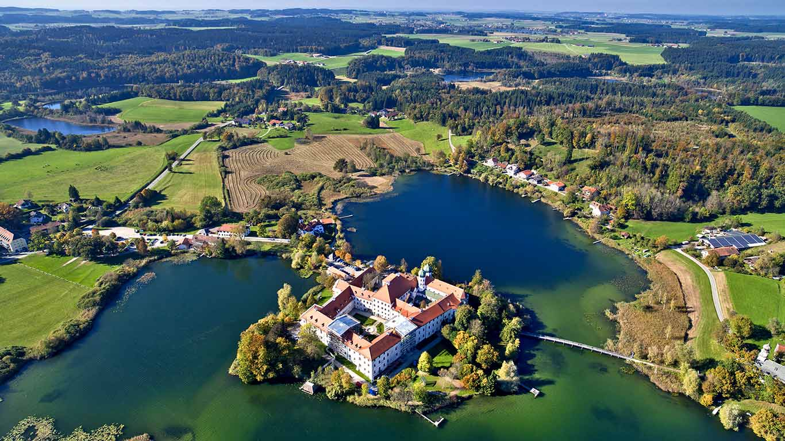

#### 20141124 Close-up view of a fire agate gemstone (© Darrell Gulin/Corbis)(Bing United Kingdom)

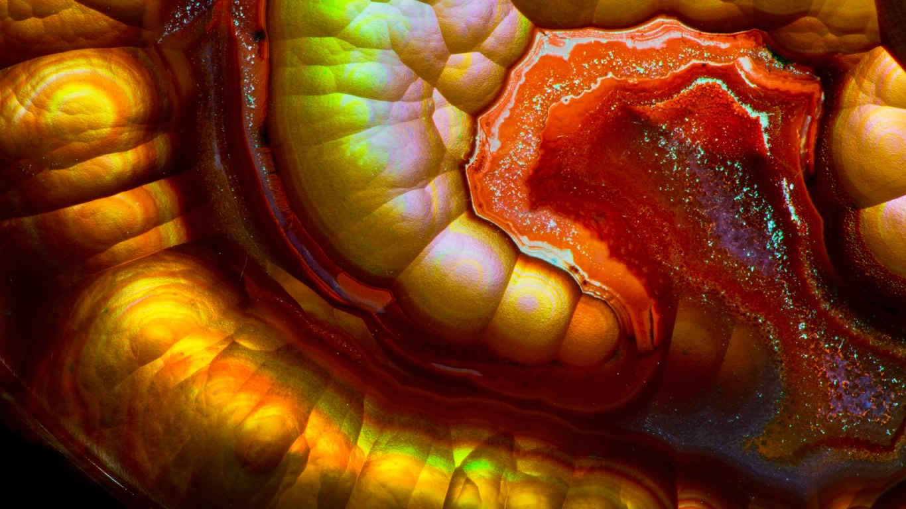

#### 20141124 北京首都机场T3航站楼部分建筑 (© Robert Harding Images/Masterfile)(Bing China)

#### 20141123 Blue and Green algae in the clear water of Grassi Lakes, near Canmore, Alberta, Canada (© Gaertner/Alamy)(Bing United Kingdom)

#### 20141122 Moose wading in Wonder Lake, Denali National Park and Preserve, Alaska, USA (© Ira Meyer/Getty Images)(Bing United Kingdom)

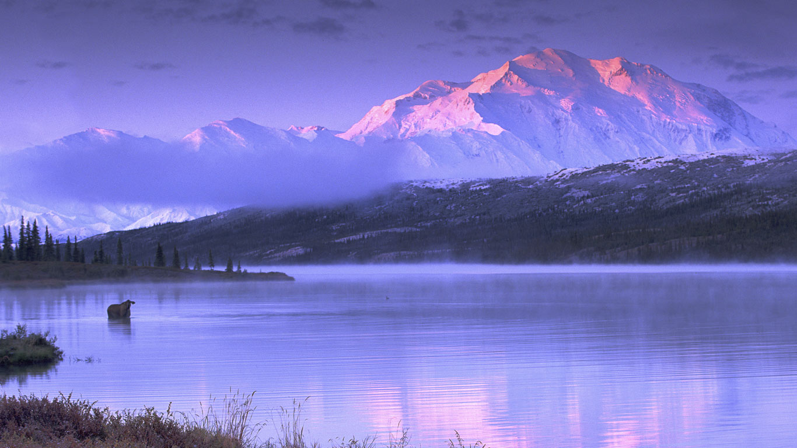

#### 20141122 Curtain Fig Tree near Yungaburra on the Atherton Tableland, Queensland (© Konrad Wothe/Minden Pictures)(Bing Australia)

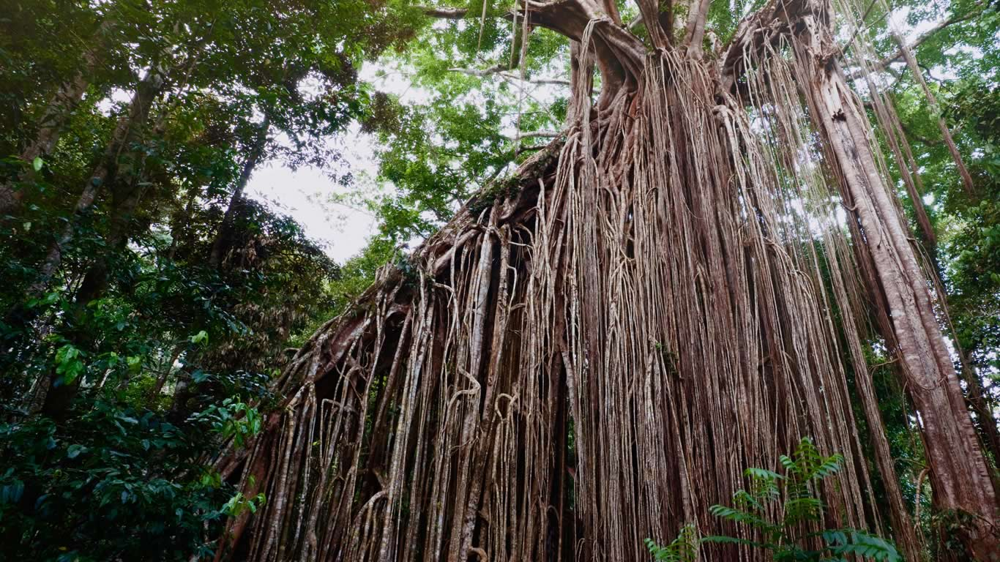

#### 20141122 行走在雪地中的丹顶鹤 (© Jeremy Woodhouse/Blend Images/Getty Images)(Bing China)

#### 20141121 纳米比亚埃托沙国家公园，相互问候的平原斑马 (© Mogens Trolle/Shutterstock)(Bing China)

#### 20141121 ｢夜の川崎港｣神奈川, 川崎 (© amanaimages/Corbis)(Bing Japan)

#### 20141121 Building façade and canal in Venice, Italy (© Jim C. Martin)(Bing United States)

#### 20141121 The Cutty Sark at night, Greenwich, London (© Tim Gartside/Alamy)(Bing United Kingdom)

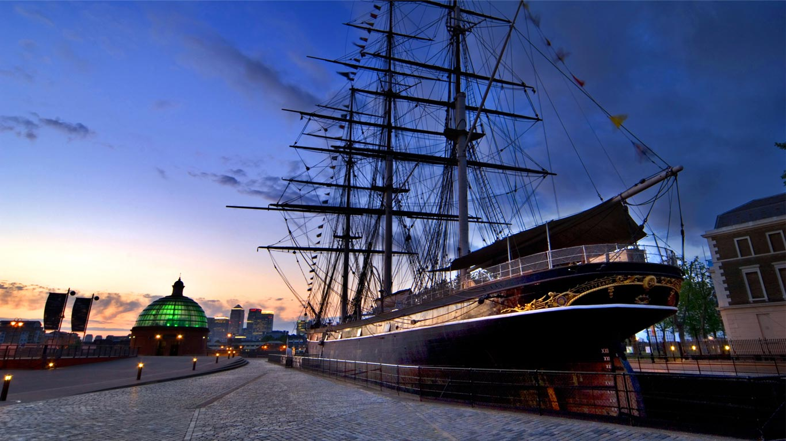

#### 20141120 Danny MacAskill completes a full five metre loop-the-loop on a bicycle in front of the London Eye (© Mission/Microsoft)(Bing United Kingdom)

#### 20141120 Vineyards in Beaujolais Region, France (© Flirt/Superstock)(Bing Canada)

#### 20141119 The Twelve Apostles near Port Campbell National Park in Australia (© Marcella Miriello/Shutterstock)(Bing United Kingdom)

#### 20141118 Tromsø, Norway (© Image Broker/Rex Features)(Bing United Kingdom)

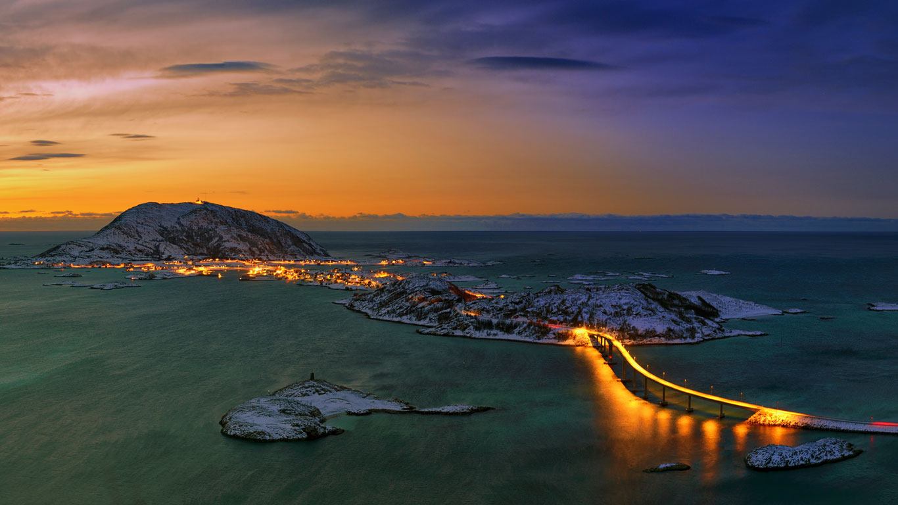

#### 20141117 Driftwood logs on the Pacific Coast, Wild Pacific Trail, Vancouver Island, British Columbia, Canada (© Ken Gillespie/All Canada Photos/Corbis)(Bing Canada)

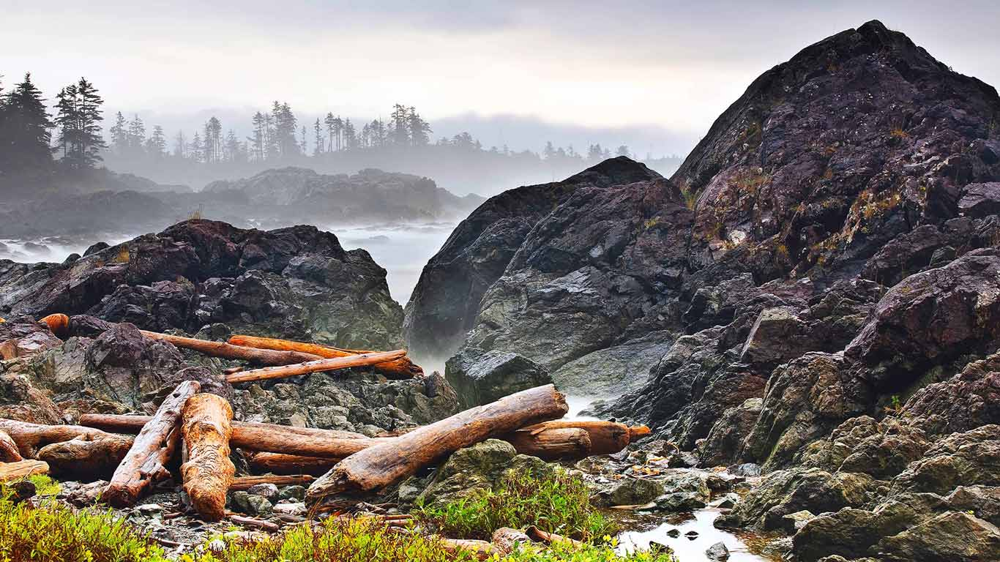

#### 20141117 Dunluce Castle, County Antrim, Northern Ireland (© Gareth Wray/Getty Images)(Bing United Kingdom)

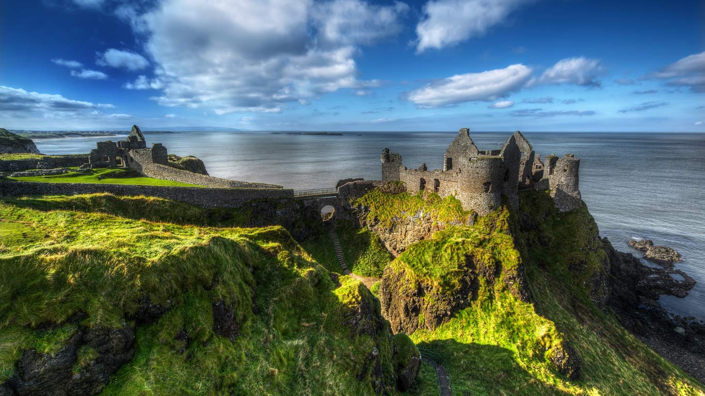

#### 20141117 Lowbush blueberry barrens near Meddybemps, Maine (© Rudi Sebastian/Getty Images)(Bing United States)

#### 20141117 广西桂林，阳朔附近 (© wu kailiang/Alamy)(Bing China)

#### 20141116 Jaisalmer, Rajasthan, India (© Axel Fassio/Getty Images)(Bing United Kingdom)

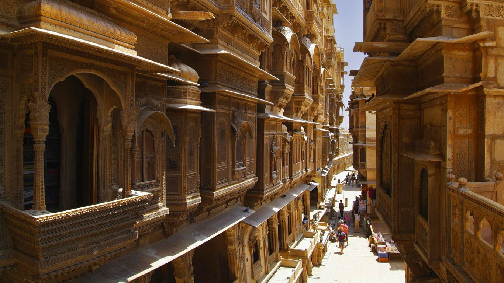

#### 20141115 堆叠的彩色铅笔 (© taweesak thiprod/Shutterstock)(Bing China)

#### 20141115 Traditional Nishijin textile weaving in Kyoto Japan (© Jeremy Hoare 2013/Age Fotostock)(Bing United Kingdom)

#### 20141115 A terrace-farmed volcano near Kisoro, Uganda (© Peter McBride/Axiom)(Bing United States)

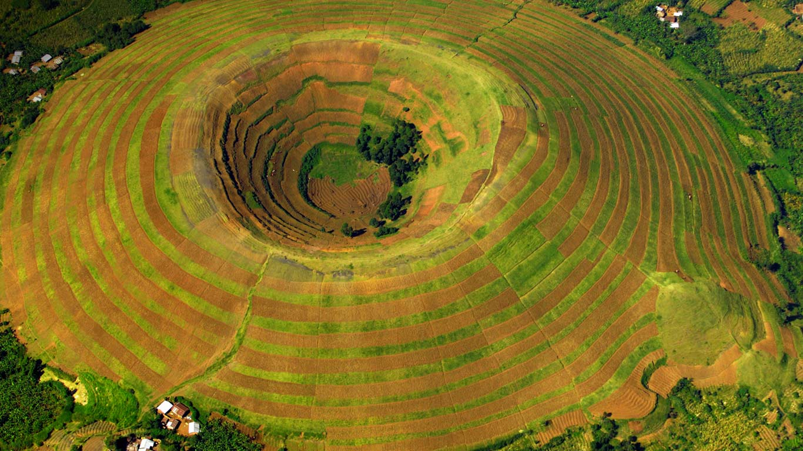

#### 20141114 Mountain goat on Mount Evans, near Denver, Colorado, USA (© Corbis Motion)(Bing United Kingdom)

#### 20141113 Wasserburg am Inn, Bayern, Deutschland (© Klaus Leidorf/Klaus Leidorf/Corbis)(Bing Deutschland)

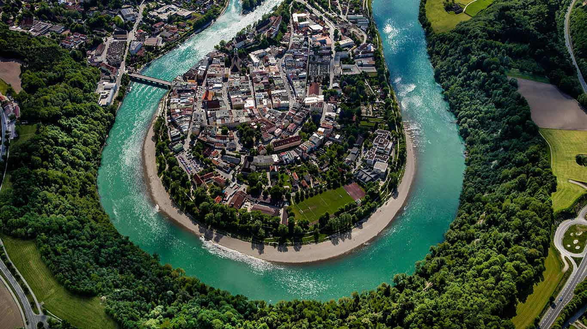

#### 20141113 Ring-tailed lemurs at Berenty Reserve in Madagascar (© Art Wolfe/Alamy)(Bing United Kingdom)

#### 20141113 Eastern Qing Tombs, Hebei Province, China (© Best View Stock/age fotostock)(Bing United States)

#### 20141112 广州市，中山大学东校区工学院广场 (© Hui Chen)(Bing China)

#### 20141112 Tranchées reconstituées du mémorial de Vimy, Pas-de-Calais (© Hemis/Alamy)(Bing France)

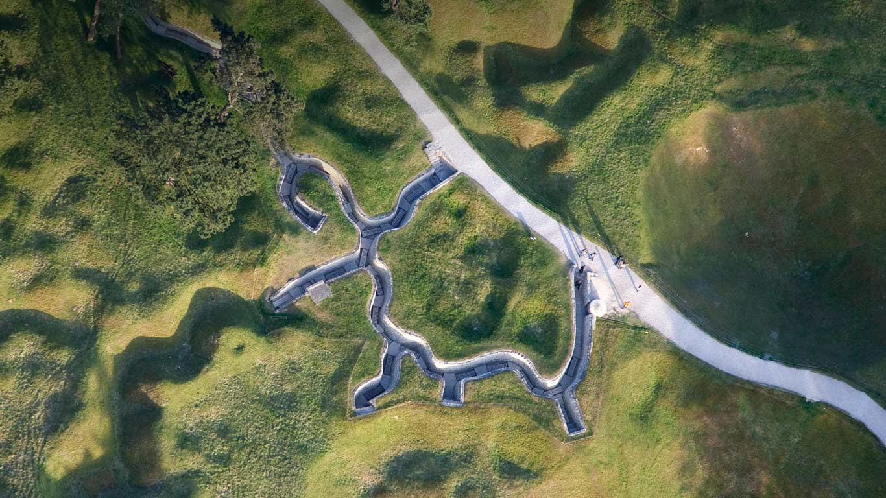

#### 20141112 Lady Musgrave Island coral atoll in the Great Barrier Reef, Australia (© D. Parer & E. Parer-Cook/Minden Pictures)(Bing Canada)

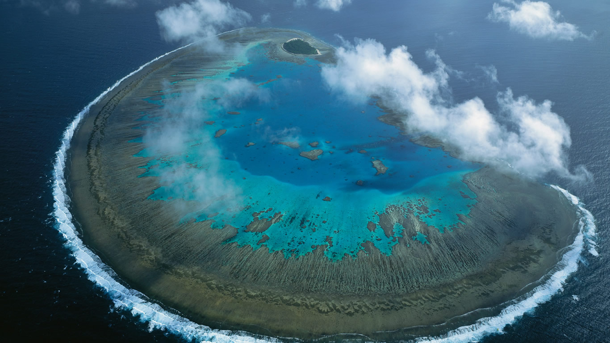

#### 20141112 California quail (© McPhoto/age fotostock)(Bing United Kingdom)

#### 20141111 A member of the Canadian Armed Forces wears a poppy prior to a Remembrance Day ceremony (© Cole Burston/Xinhua Press/Corbis)(Bing Canada)

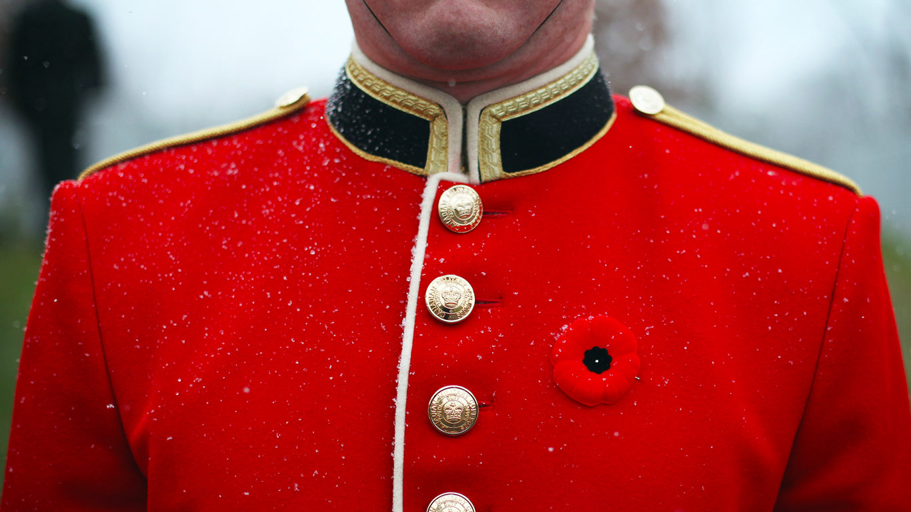

#### 20141111 Tower of London surrounded by ceramic poppies, art installation created by Paul Cummins in honour of the 100th anniversary of the beginning of World War I, London, England (© Philip Sayer/Alamy)(Bing United Kingdom)

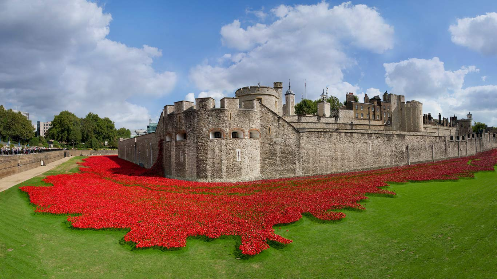

#### 20141111 美国南达科他州，黑尾土拨鼠 (© Danita Delimont/Gallo Images/Getty Images)(Bing China)

#### 20141110 Aït Benhaddou, Atlas Mountains, Morocco (© Douglas Pearson/Corbis)(Bing United Kingdom)

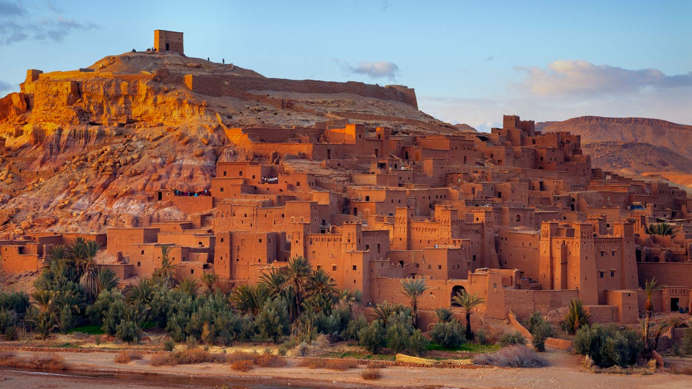

#### 20141109 Eldhraun lava field in the Laki fissure system, Iceland (© Hans Strand/Corbis)(Bing United States)

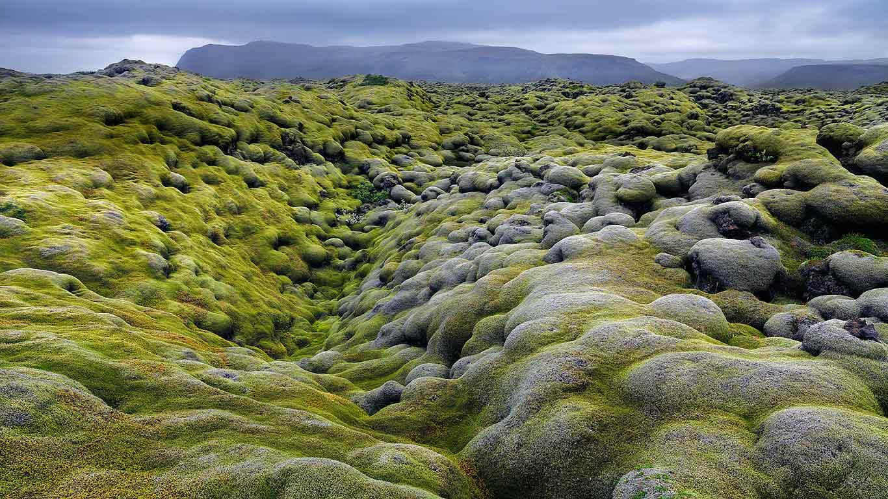

#### 20141109 Shamil Gimajew’s ‘We Are A People’ on the renovated East Side Gallery of the Berlin Wall, Berlin, Germany (© Andreas Muhs/Alamy)(Bing United Kingdom)

#### 20141108 ｢雪の中のタヌキ｣北海道, 上川郡 (© Datacraft/UIG/Age Fotostock)(Bing Japan)

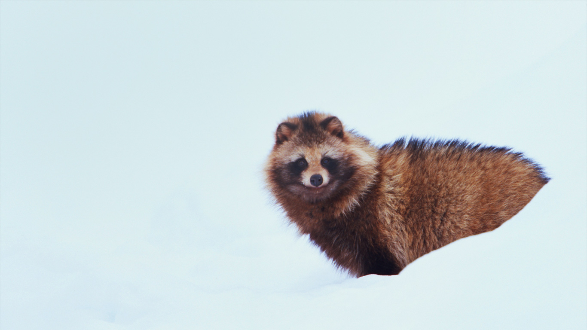

#### 20141108 Clevedon Pier, Clevedon, Somerset, England, UK (© Nick Cabla/Getty Images)(Bing United Kingdom)

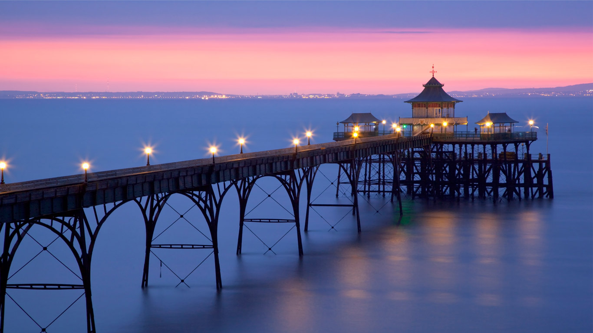

#### 20141108 Arachova, Greece (© Hercules Milas/Alamy)(Bing United States)

#### 20141107 Marble caves on General Carrera Lake, Chile (© David A. Barnes/Alamy)(Bing United Kingdom)

#### 20141107 冬霜中的蓝山雀和玫瑰果 (© Nature Picture Library/Britain On View/Getty Images)(Bing China)

#### 20141106 Paro Taktsang, a Buddhist monastery above the Paro Valley in Bhutan (© Peter Adams/Getty Images)(Bing United Kingdom)

#### 20141105 Grasshopper on Jonaskop, a mountain in South Africa (© Piotr Naskrecki/Corbis)(Bing United States)

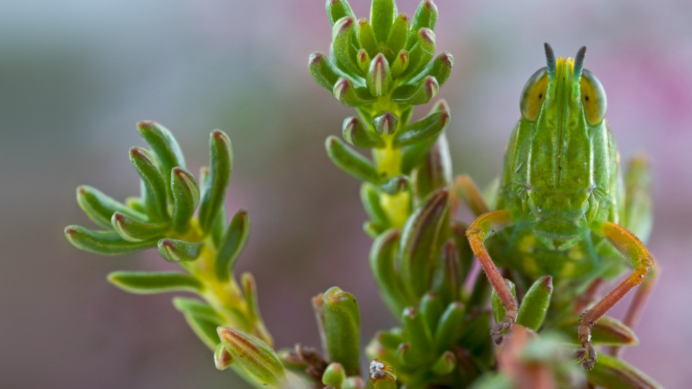

#### 20141105 Bonfire and firework display to celebrate the 5th of November anniversary of the 'Gunpowder Plot' (© Steve Allen/Shutterstock)(Bing United Kingdom)

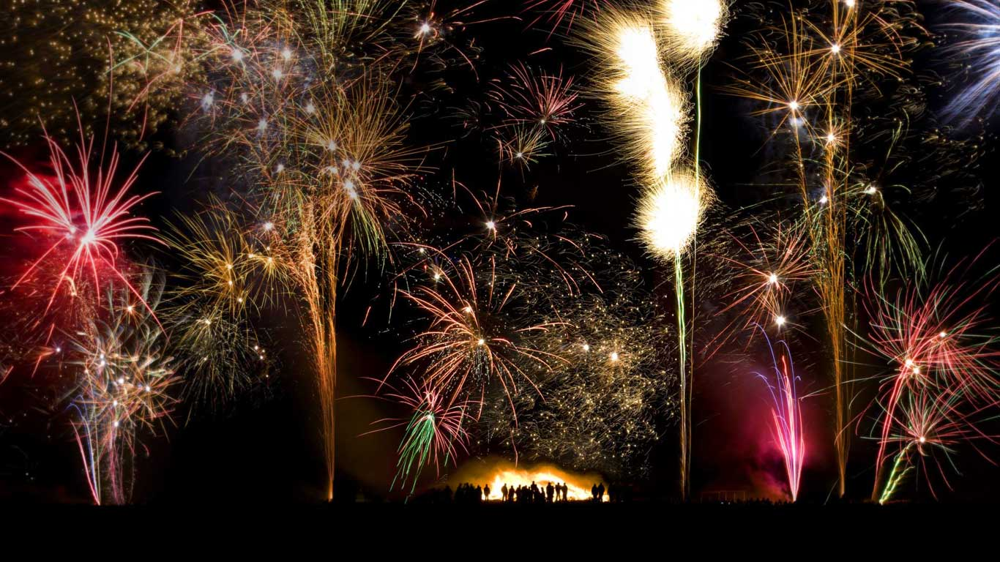

#### 20141104 Potato cod off the western coast of Australia (© NaturePL/Superstock)(Bing United Kingdom)

#### 20141104 四月新疆新源县的春之梦境 (© Danny Hu/Moment/Getty Images)(Bing China)

#### 20141104 Band of four horses galloping in central Australia (© Juniors Bildarchiv GmbH/Alamy)(Bing Australia)

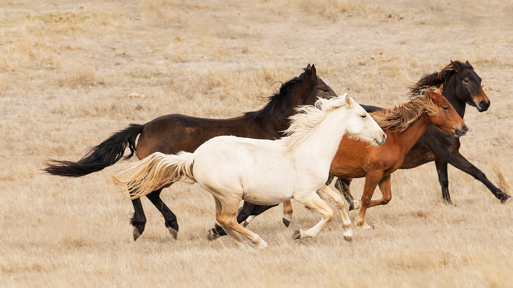

#### 20141104 Beaver Meadow in Green Mountain National Forest, Vermont (© George Steinmetz/Corbis)(Bing United States)

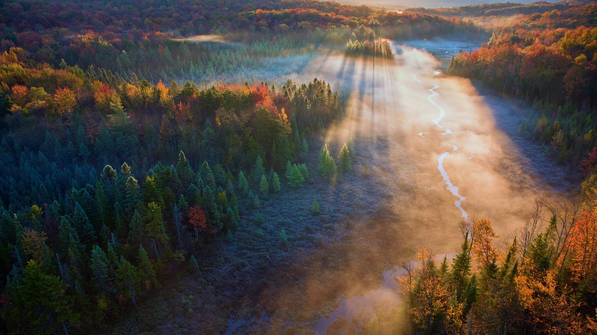

#### 20141103 Multicoques participant à la Route du Rhum, Saint-Malo, Ille-et-Vilaine, Bretagne en 2002 (© BlueGreen Pictures/Superstock)(Bing France)

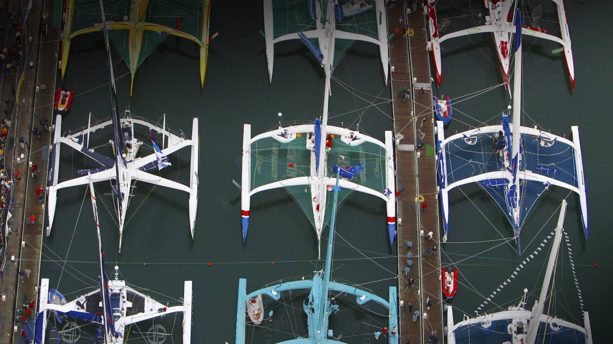

#### 20141103 Ring Nebula (M57) (© Robert Gendler/NASA)(Bing United Kingdom)

#### 20141102 Mineral heavy peaks, Spectrum Range, Mount Edziza Provincial Park, British Columbia, Canada (© Carr Clifton/Minden Pictures)(Bing United Kingdom)

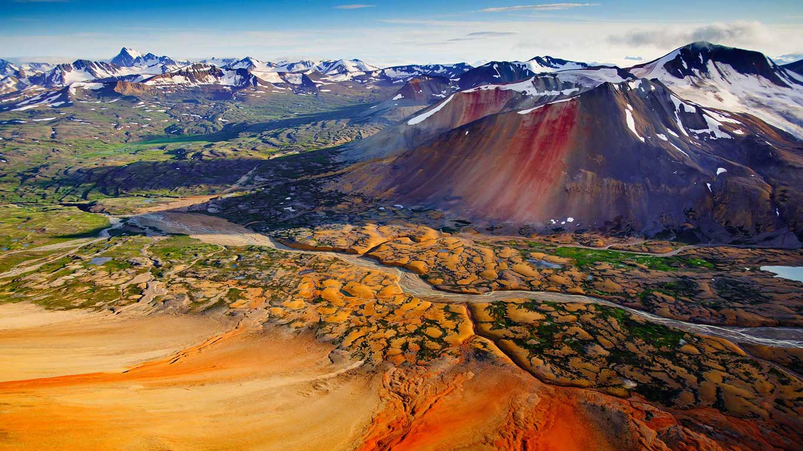

#### 20141102 Craig Goch Dam in the Elan Valley, Wales (© Joe Daniel Price/Getty Images)(Bing United States)

#### 20141101 Homage to legendary ghost stories (© Lindsay Daniels Design/Gary Spradling/Alamy, Corbis Images, Getty Images, plainpicture, Shutterstock, SuperStock)(Bing United Kingdom)

#### 20141101 Emperor tamarin in Manu National Park, Peru (© Thomas Marent/Minden Pictures)(Bing United Kingdom)

#### 20141101 Close-up of an artichoke (© I. Rozenbaum & F. Cirou/Alamy)(Bing United States)

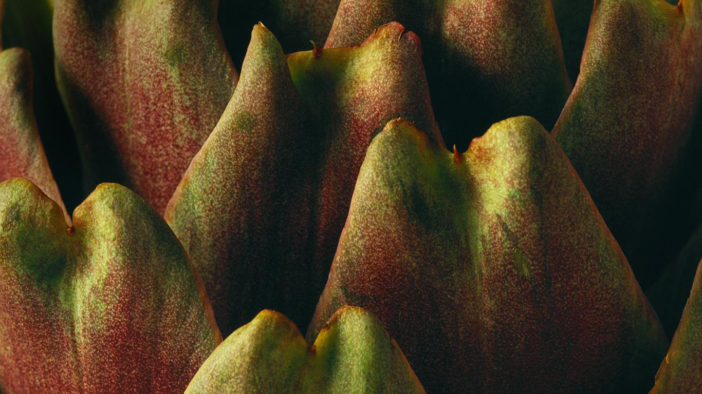

