#### 20141231 Fireworks on the glacial lake Jökulsárlón, Iceland (© Norbert Eisele-Hein/Aurora Photos)(Bing United Kingdom)

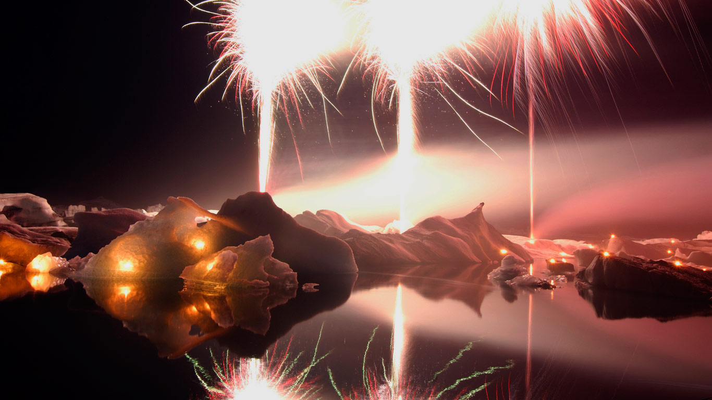

#### 20141231 Historic villages of Shirakawa-go and Gokayama, Japan (© Hung Wei/Shutterstock)(Bing United States)

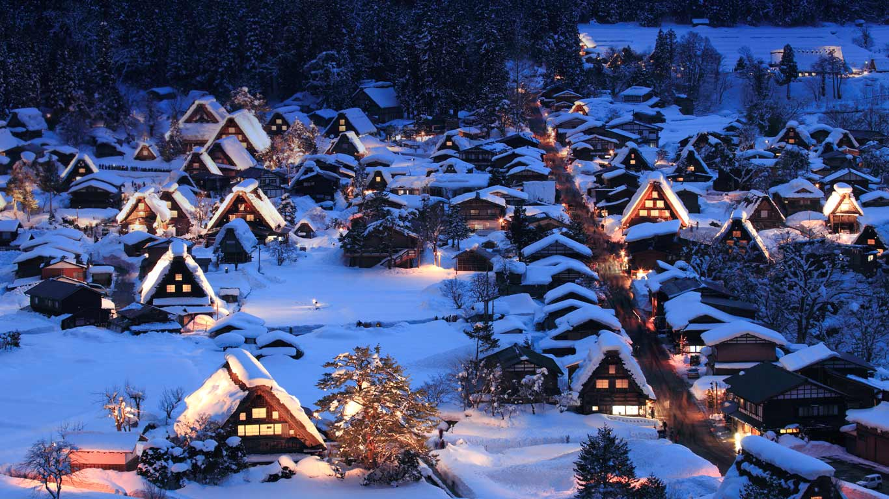

#### 20141230 Whistler Mountain in British Columbia, Canada (© Phil Tifo/Tandem Stills + Motion)(Bing United States)

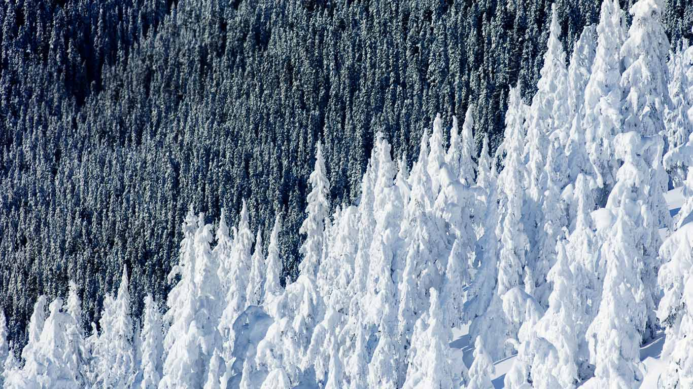

#### 20141230 Blue jay (© Christophe Sidamon-Pesson/Minden Pictures)(Bing United Kingdom)

#### 20141230 Ice castle with a sunburst and blue sky, Lake Louise, Alberta (© Michael Interisano/Design Pics RM/Age Fotostock)(Bing Canada)

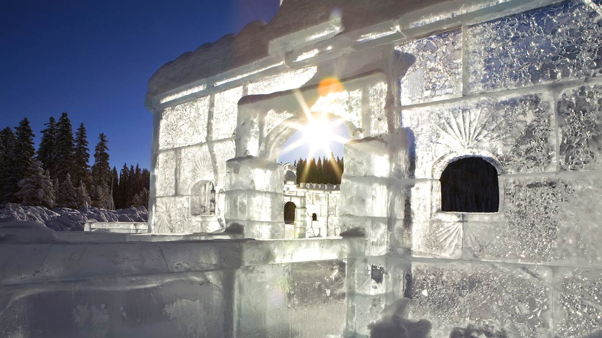

#### 20141229 Whooper swans, Lake Kussharo, Akan National Park, Japan (© Ben Cranke/Corbis)(Bing United Kingdom)

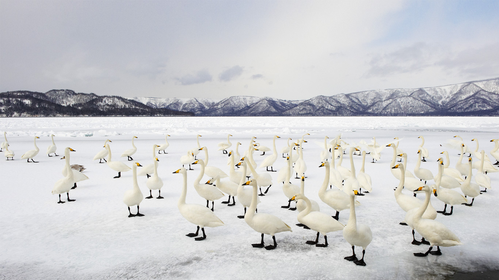

#### 20141229 澳大利亚，塔斯马尼亚岛，菲欣纳国家公园的酒杯湾 (© Di He)(Bing China)

#### 20141228 Eurasian lynx in the Bavarian Forest National Park, Germany (© Konrad Wothe/Minden Pictures)(Bing United Kingdom)

#### 20141227 Don 'Iceman' McNamara surfing in Kachemak Bay, Alaska (© Scott Dickerson/Tandem Stills + Motion)(Bing United States)

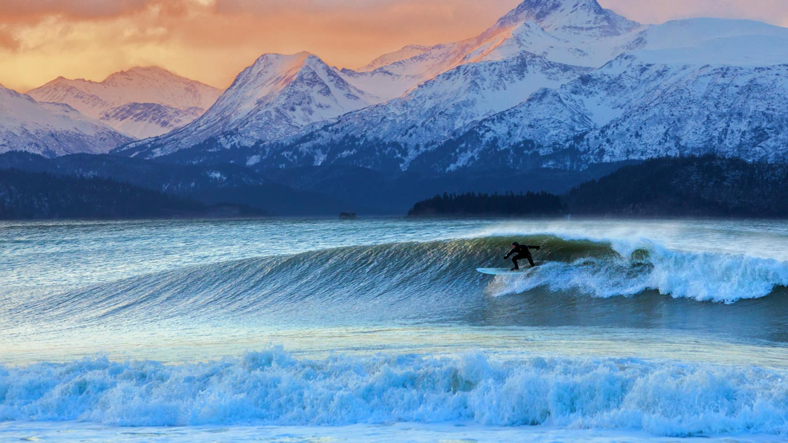

#### 20141227 The Capilano Suspension Bridge in Vancouver, British Columbia, Canada (© Andy Clark/Corbis)(Bing United Kingdom)

#### 20141226 Myrtle trees (Melaleuca) at Norman's Beach near Albany in Western Australia (© Yva Momatiuk & John Eastcott/Minden Pictures)(Bing Australia)

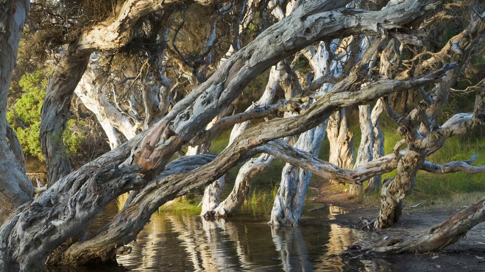

#### 20141226 Clifton Bridge in winter, Bristol (© Daugirdas Tomas Racys/Getty Images)(Bing United Kingdom)

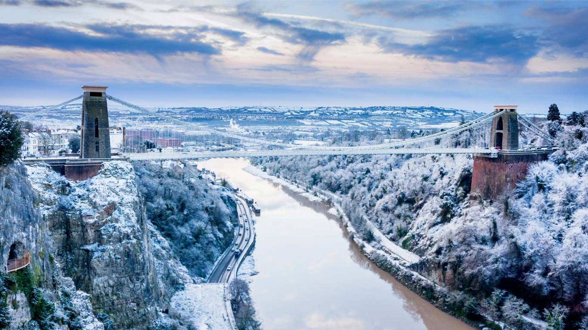

#### 20141225 ｢大通公園｣北海道, 札幌 (© JTB Photo/Superstock)(Bing Japan)

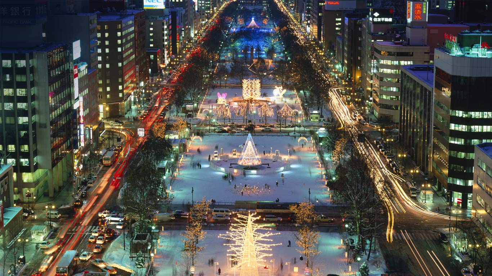

#### 20141225 Model train set amidst a winter scene (© Terry Wilson/Getty Images)(Bing United Kingdom)

#### 20141225 Cabin in the San Juan Mountains of Colorado (© Michael DeYoung/Corbis)(Bing United States)

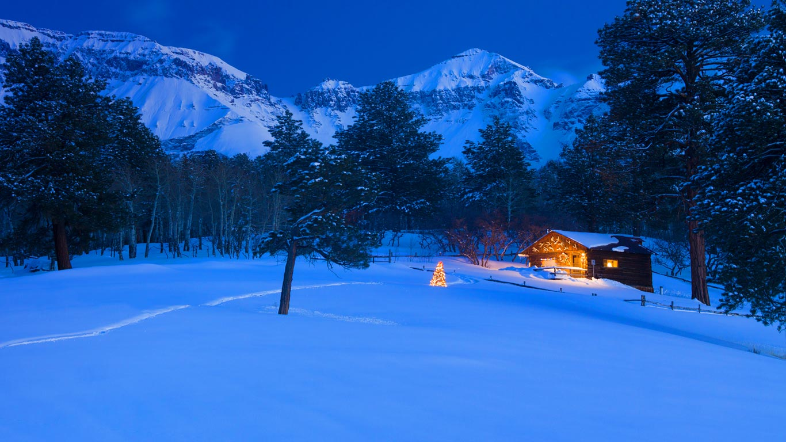

#### 20141225 Place Masséna à Nice illuminée pour les fêtes, Alpes-Maritimes, Provence-Alpes-Côte d’Azur (© Giancarlo Liguori/Shutterstock)(Bing France)

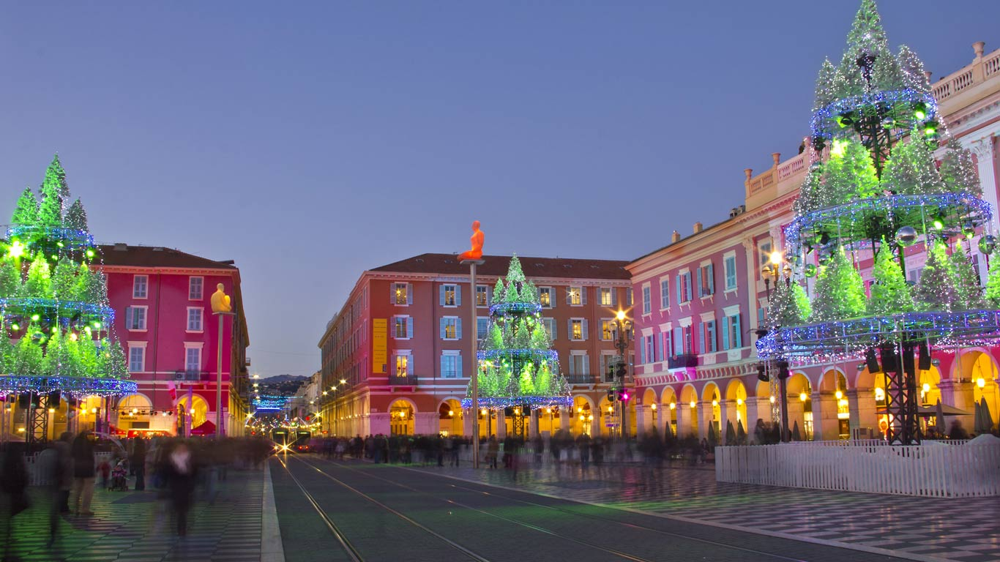

#### 20141225 Winterlicher Sonnenaufgang auf dem Gipfel des Brocken, Sachsen-Anhalt, Deutschland (© Günter Gräfenhain/Huber/4Corners)(Bing Deutschland)

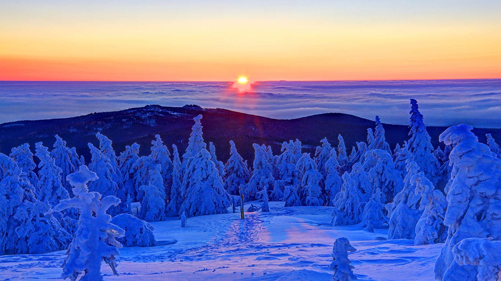

#### 20141224 Bristly haircap moss (Polytrichum piliferum), Nijmegen, Netherlands (© Misja Smits/Minden Pictures)(Bing United Kingdom)

#### 20141223 Christmas lights in a palm tree at a winery, Temecula Valley, California, USA (© Richard Cummins/Corbis)(Bing United Kingdom)

#### 20141222 Weihnachtsmarkt auf dem Rathausmarkt, Hamburg, Deutschland (© Robert Smith/Age Fotostock/Getty Images)(Bing Deutschland)

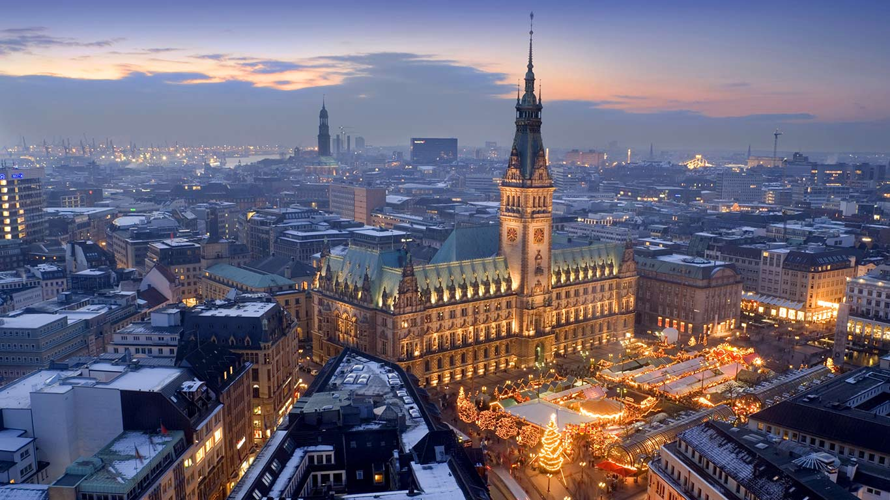

#### 20141222 Le Chateau Frontenac after a snow storm, Quebec City, Canada (© Korivo/Alamy)(Bing United Kingdom)

#### 20141222 Large-flowered Christmas Bell at Gibraltar Range National Park in New South Wales, Australia (© NHPA/Superstock)(Bing Australia)

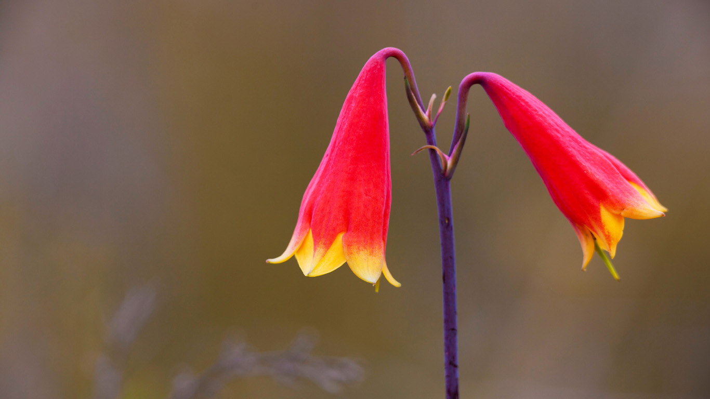

#### 20141221 People carry lanterns at the Burning The Clocks Festival on December 21, Brighton, England (© Dan Kitwood/Getty Images)(Bing United Kingdom)

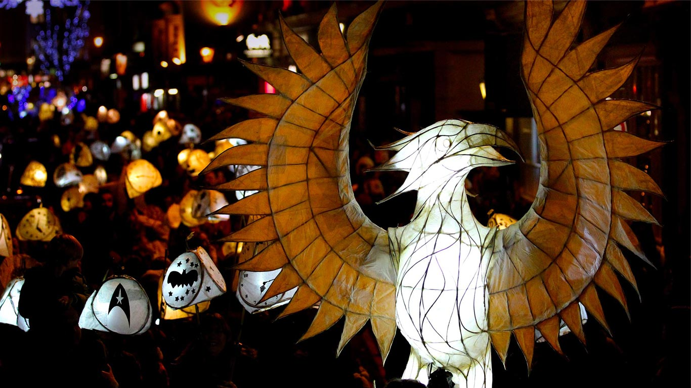

#### 20141220 ｢門司港駅｣福岡県, 北九州市 (© MIXA/Getty Images)(Bing Japan)

#### 20141220 Christmas decorations on the Avenue des Champs-Élysées, Paris, France (© Neil Farrin/Rex Features)(Bing United Kingdom)

#### 20141219 Holiday market in Old Town Square, Prague, Czech Republic (© Michal Sula/Rex Features)(Bing United Kingdom)

#### 20141218 Quokka mother and son on Rottnest Island, Western Australia (© Jean-Paul Ferrero/Mary Evans Picture Library Ltd/AGE Fotostock)(Bing Australia)

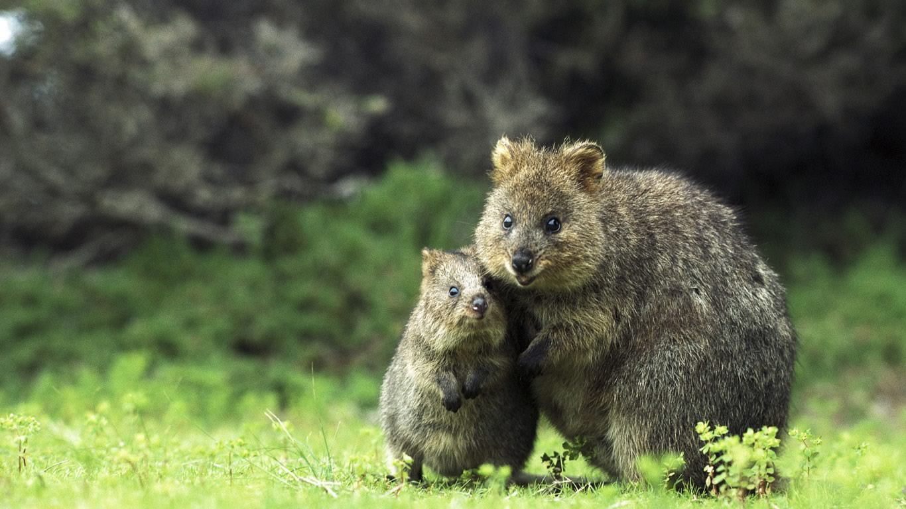

#### 20141218 Pōhutukawa (Metrosideros excelsa) tree blossoms on the Hauraki Gulf Coast, North Island, New Zealand (© sassphotos/Getty Images)(Bing United States)

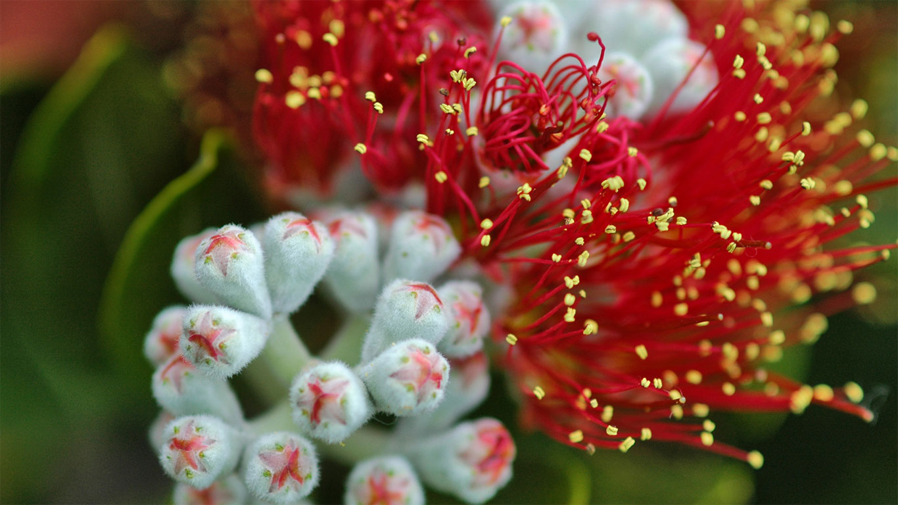

#### 20141218 Elk near Banff National Park, Alberta, Canada (© Todd Korol/Aurora Photos)(Bing United Kingdom)

#### 20141217 Patinoire devant l’hôtel de ville de Paris, Île-de-France (© Frederic Volkringen/Age Fotostock)(Bing France)

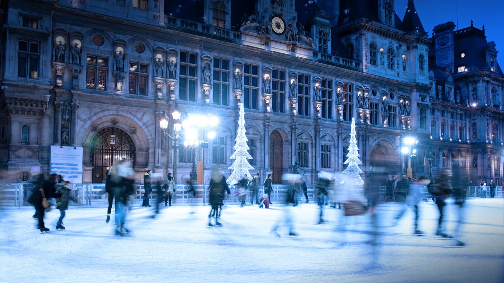

#### 20141217 View of painted buildings, Salvador Bahia, Brazil (© John W Banagan/Getty Images)(Bing United Kingdom)

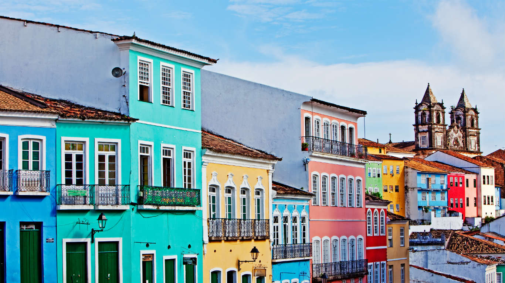

#### 20141216 The Trafalgar Square Menorah, London (© Stephen Chung/Alamy)(Bing United Kingdom)

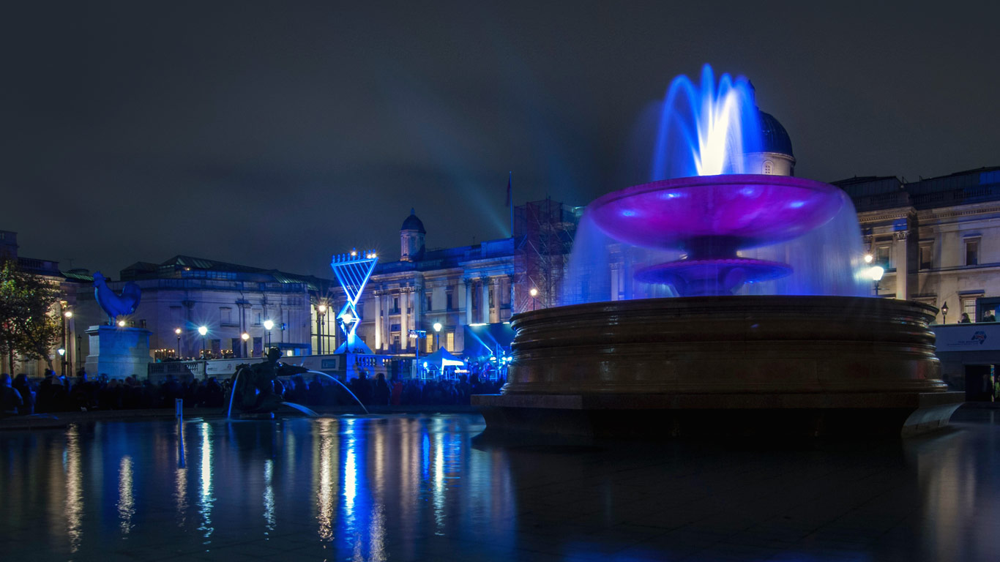

#### 20141215 Black Butte, seen from the Mount Jefferson Wilderness, Oregon, USA (© Marc Adamus/Aurora Photos)(Bing United Kingdom)

#### 20141215 Caves and coastal features at low tide of the Bay of Fundy at St. Martins, New Brunswick, Canada (© Jamie Roach/Shutterstock)(Bing Canada)

#### 20141214 Bohemian waxwings eating rowan berries (© Chuck Haney/Alamy)(Bing United Kingdom)

#### 20141213 Jamaa el-Fnaa market square, Marrakesh, Morocco (© Ian Egner/Aurora Photos)(Bing United States)

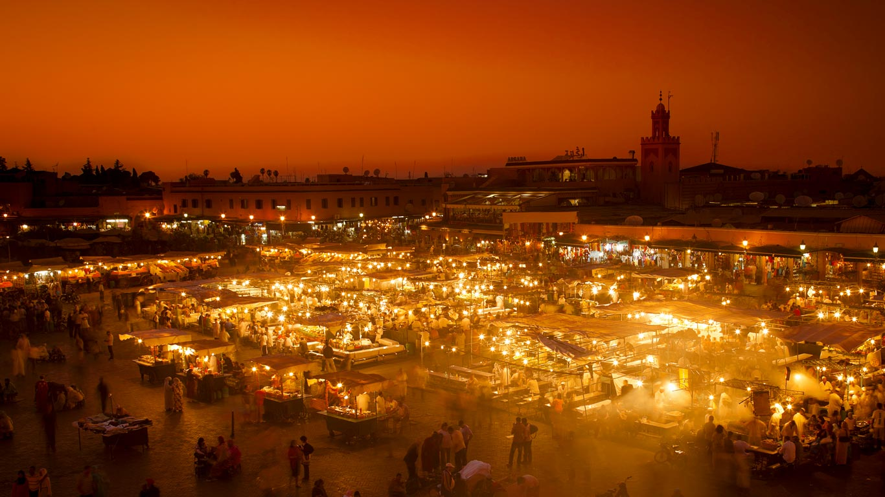

#### 20141213 Christmas market on Princes Street, Edinburgh (© Getty Images)(Bing United Kingdom)

#### 20141212 Blick von Berwang, Tirol, Österreich auf die Zugspitze im letzten Abendlicht (© Image Broker/Hemis/Age Fotostock)(Bing Deutschland)

#### 20141212 A stoat displaying its winter coat (© Berndt Fischer/age fotostock)(Bing United Kingdom)

#### 20141212 Golden sunrise over the polished granite and water of Georgian Bay, Ontario, Canada (© Peter Bowers/Getty Images)(Bing Canada)

#### 20141211 Zêzere River in Covão da Ametade, Serra da Estrela mountains, Portugal (© Joel Santos/Corbis)(Bing United Kingdom)

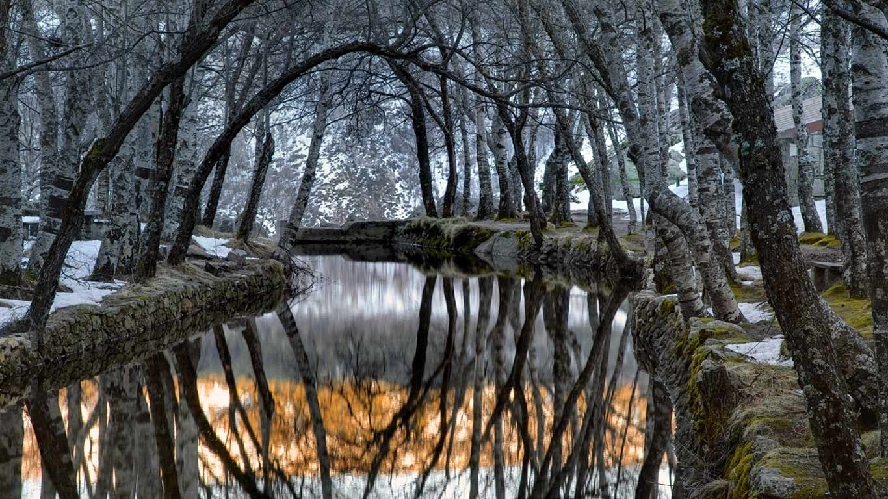

#### 20141211 Pinnacle Rocks at Mount Wellington in Tasmania, Australia (© Artie Photography/Getty Images)(Bing Australia)

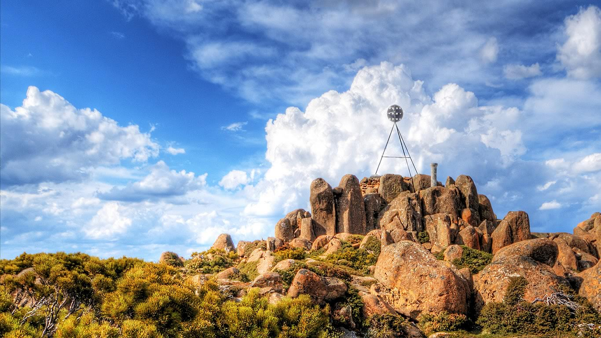

#### 20141210 Waitomo Caves, New Zealand (© Chris McLennan/Alamy)(Bing United Kingdom)

#### 20141209 Carew Castle, Pembrokeshire, Wales (© Chris Warren/Alamy)(Bing United Kingdom)

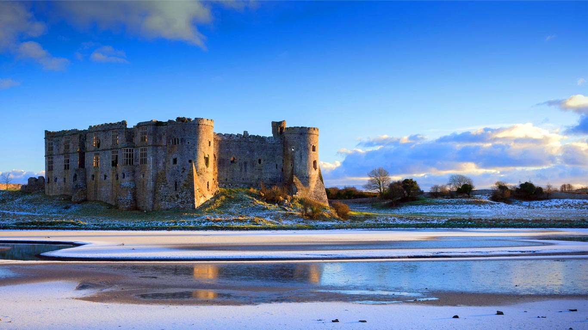

#### 20141209 Belogradchik Fortress and the Belogradchik rocks, Bulgaria (© 2bears/Shutterstock)(Bing United States)

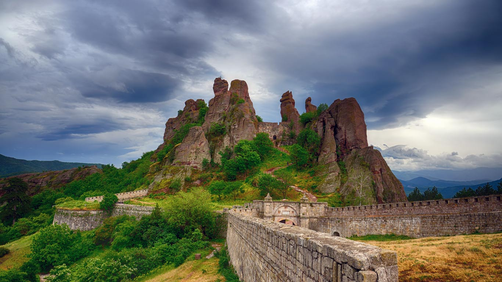

#### 20141208 ”Addition Subtraction” by computer artist Robert Hodgin (© Robert Hodgin)(Bing United States)

#### 20141208 Festival of Lights, Lyon, Rhône-Alpes, France (© Age Fotostock)(Bing United Kingdom)

#### 20141208 下雪了，许多黑颈鹤在雪中飞舞 (© zhouyousifang/Getty Images)(Bing China)

#### 20141207 Shanghai's roadways and skyline lit up at night (© Kevin Lee/Getty Images)(Bing United Kingdom)

#### 20141207 USS Arizona Memorial, Pearl Harbor, Hawaii (© Ed Robinson/Getty Images/SuperStock)(Bing United States)

#### 20141207 Adventskalender mit kleinen, aus Servietten gefalteten Säckchen (© Bon Appetit/Alamy)(Bing Deutschland)

#### 20141206 The Kjeragbolten boulder on Kjerag, a mountain, Rogaland, Norway (© Nataliia Anisimova/Alamy)(Bing United Kingdom)

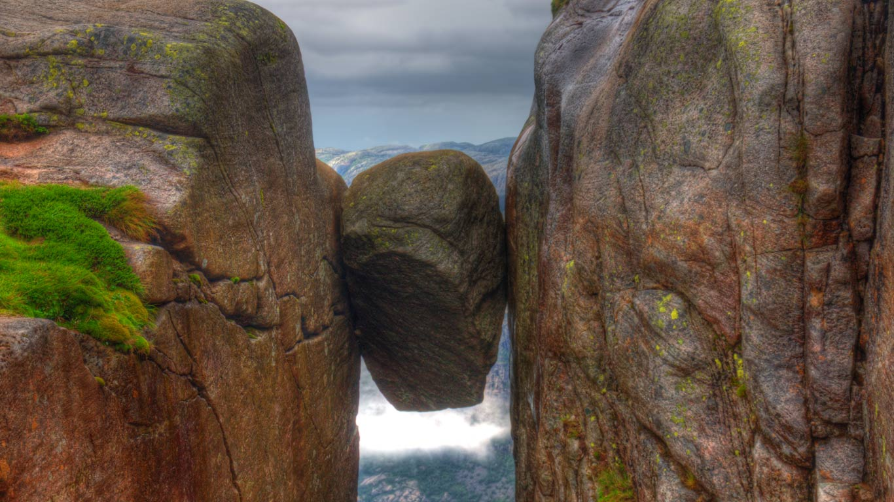

#### 20141205 Magnificent sea anemone host with blackfinned clownfish (© Chris Newbert/Minden Pictures)(Bing United Kingdom)

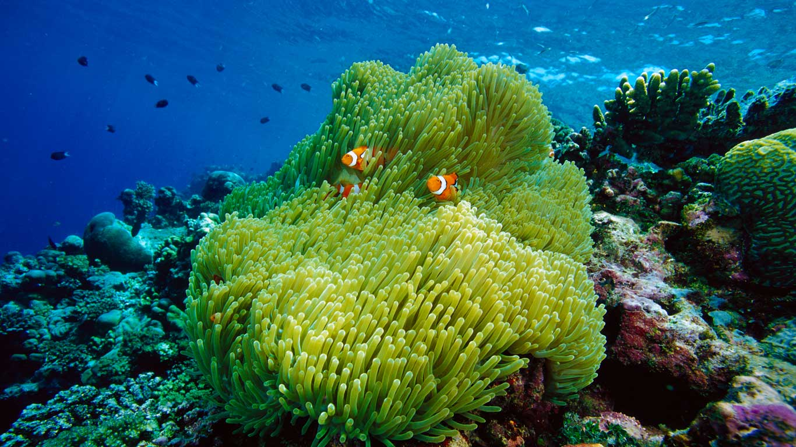

#### 20141204 Central Park, New York City, USA (© EschCollection/Getty Images)(Bing United Kingdom)

#### 20141204 Santons à Marseille,  Bouches-du-Rhône, Provence-Alpes-Côte d’Azur (© Catherine Hansen/Getty Images)(Bing France)

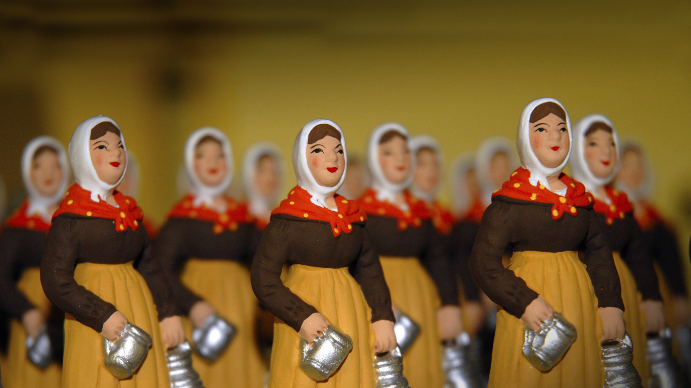

#### 20141203 Suwannee River delta, Florida (© Frans Lanting/Corbis)(Bing United States)

#### 20141203 Wildcat in Scotland (© Pete Cairns/Minden Pictures)(Bing United Kingdom)

#### 20141202 The Pennine Alps near Zermatt, Switzerland (© AirPano)(Bing United Kingdom)

#### 20141201 Fen wetland near Moon Point at Fraser Island, Queensland (© Peter Essick/Aurora Photos)(Bing Australia)

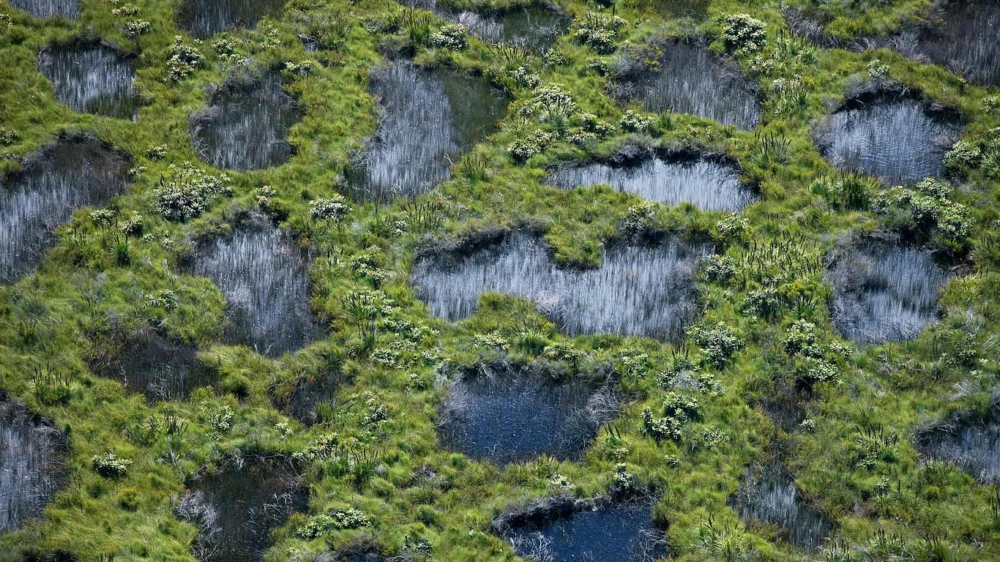

#### 20141201 Panoramic view of the Christmas Market in Nuremberg, Bavaria, Germany (© Eye Ubiquitous/Superstock)(Bing United Kingdom)

