#### 20150131 Mount Baker-Snoqualmie National Forest, Washington, USA (© Ethan Welty/Aurora Photos)(Bing United Kingdom)

#### 20150130 Village Bay on the island of Hirta, Scotland (© Jim Richardson/Getty Images)(Bing United Kingdom)

#### 20150130 Rhône Glacier ice grotto in Valais, Switzerland (© CEM/Getty)(Bing United States)

#### 20150130 Chamois en hiver en France (© Biosphoto/Superstock)(Bing France)

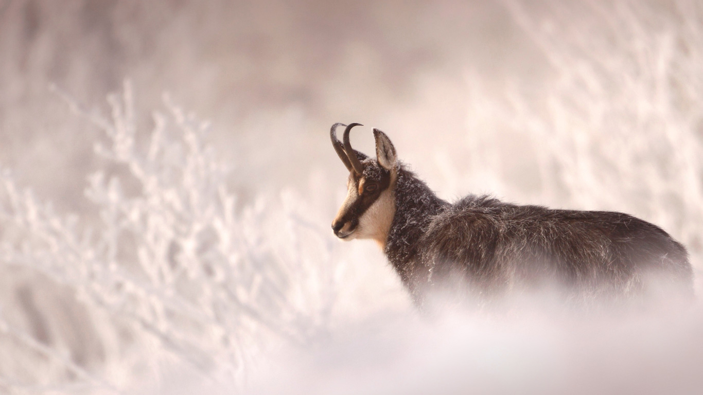

#### 20150129 Eurasian red squirrels in Finland (© Jorma Luhta/Minden Pictures)(Bing United Kingdom)

#### 20150129 A very cold winter morning at Lake Minnewanka in Banff National Park, Alberta, Canada (© Wayne Simpson/All Canada Photos/Corbis)(Bing Canada)

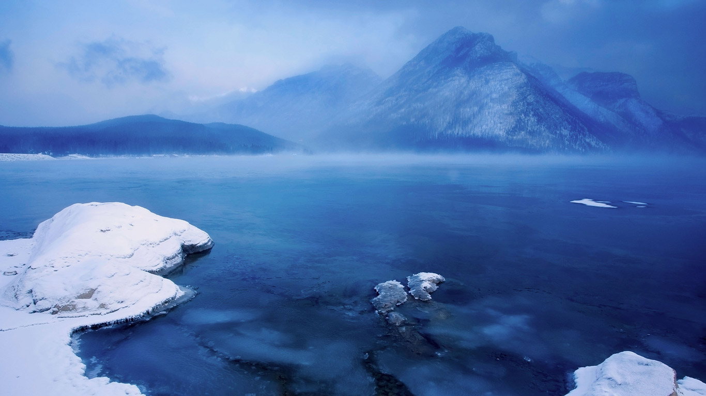

#### 20150128 Blick vom Hermannsberg nahe Bodolz, Bayern, Deutschland (© Ralf Eisenhut/Moment/Getty Images)(Bing Deutschland)

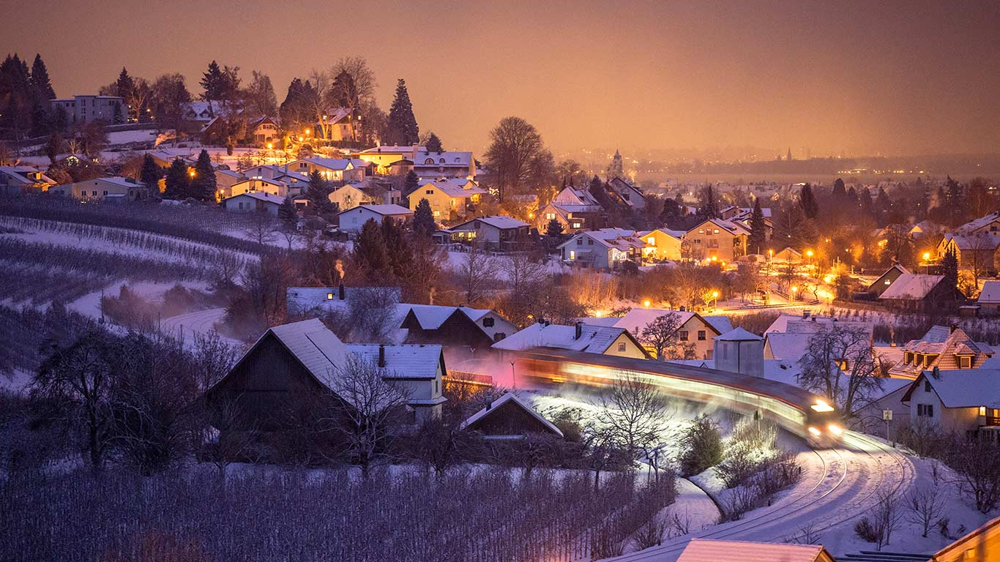

#### 20150128 Cranes moving cargo in a Bangkok, Thailand shipping port (© Getty Images)(Bing United Kingdom)

#### 20150127 A kayaker crosses Grey Lake in Torres del Paine National Park, Chile (© Marco Simoni/Aurora Photos)(Bing United Kingdom)

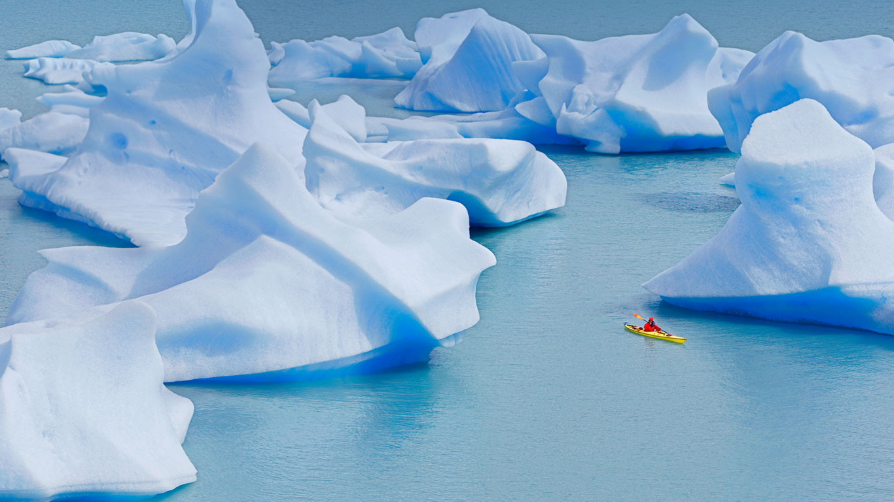

#### 20150126 美国加州圣地亚哥，日落时分使命湾的棕榈树林 (© Dancestrokes/Shutterstock)(Bing China)

#### 20150126 Red Kangaroos (macropus rufus) hopping in the Australian outback (© Gerard Lacz/Age Fotostock)(Bing United Kingdom)

#### 20150125 Aspen forest in the Wasatch Mountains, Utah (© Marc Muench/Tandem Stills + Motion)(Bing United States)

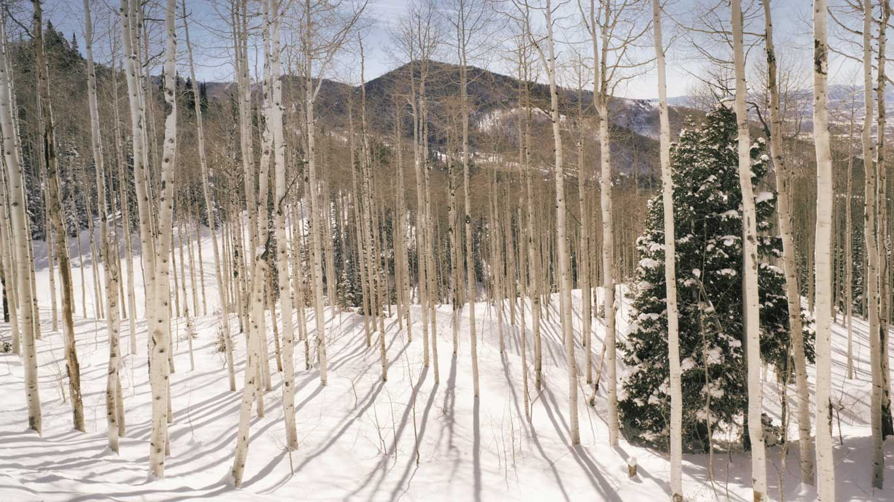

#### 20150125 Spiral staircase by Leonardo da Vinci in the Château de Chambord, Loir-et-Cher, France (© Sylvain Sonnet/Corbos)(Bing Canada)

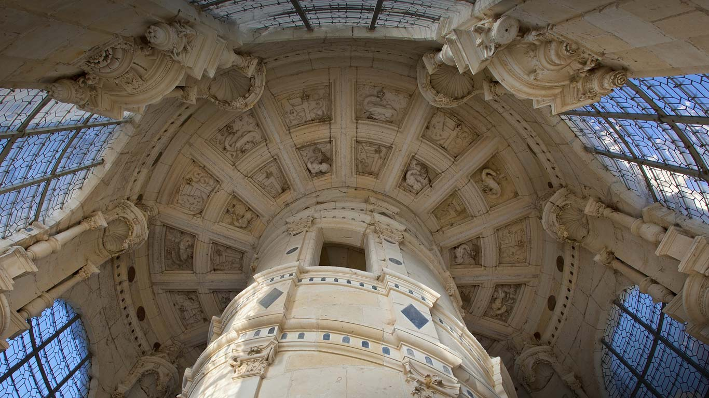

#### 20150125 Robert Burns Statue, Dunedin, New Zealand (© David Wall/Alamy)(Bing United Kingdom)

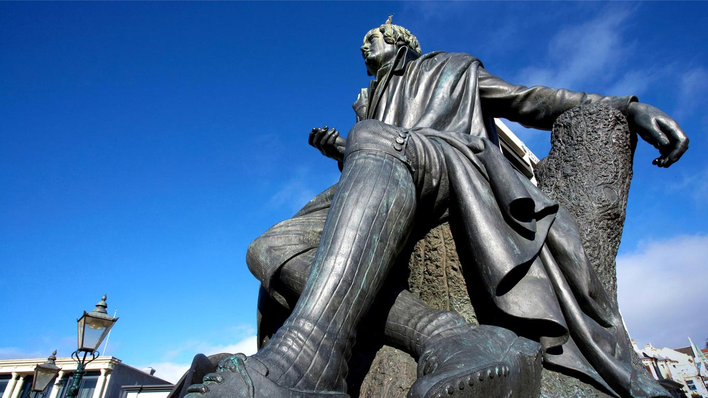

#### 20150124 Westfriedhof subway station in Munich, Germany (© Manfred J. Bail/Alamy)(Bing United Kingdom)

#### 20150124 美国拉斯维加斯，黄昏时分的拉斯维加斯大道 (© Stuart Dee/Photographer's Choice RF/Getty Images)(Bing China)

#### 20150123 African buffalo at a watering hole in Queen Elizabeth National Park, Uganda (© Joel Sartoire/Getty Images)(Bing United Kingdom)

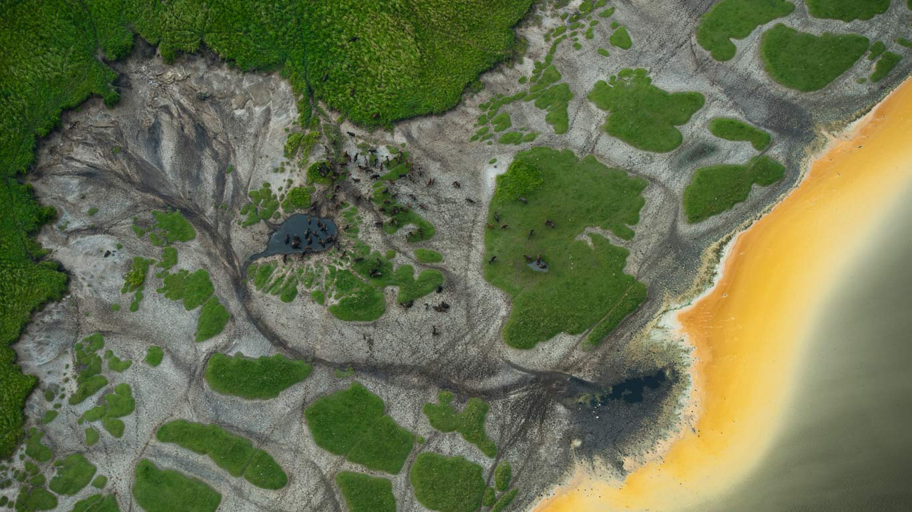

#### 20150123 美国旧金山，晨雾弥漫 (© David Safanda/Moment/Getty Images)(Bing China)

#### 20150122 美国纽约，城市风光 (© Alija/Vetta/Getty Images)(Bing China)

#### 20150122 Overcast morning at Neck Point Park, Nanaimo BC, Canada (© Scott Bennie/Shutterstock)(Bing Canada)

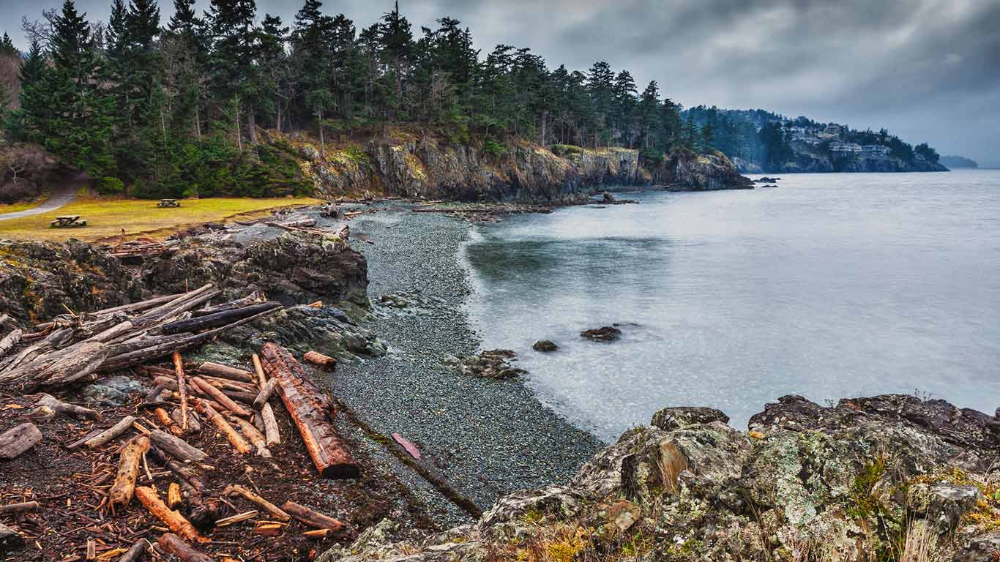

#### 20150122 Philipsburg, Sint Maarten (© Sean Pavone/Shutterstock)(Bing United Kingdom)

#### 20150121 Château de Chillon on Lake Geneva, Switzerland (© Philippe Saire Photography/Getty Images)(Bing United Kingdom)

#### 20150121 美国洛杉矶，游乐园夜景 (© Pete Saloutos/Blend Images/Brand X Pictures/Getty Images)(Bing China)

#### 20150120 美国夏威夷，峭壁下的热带珊瑚礁 (© Colin Anderson/Blend Images/Getty Images)(Bing China)

#### 20150120 Emperor penguin chicks in Antarctica (© Jan Vermeer/Minden Pictures)(Bing United Kingdom)

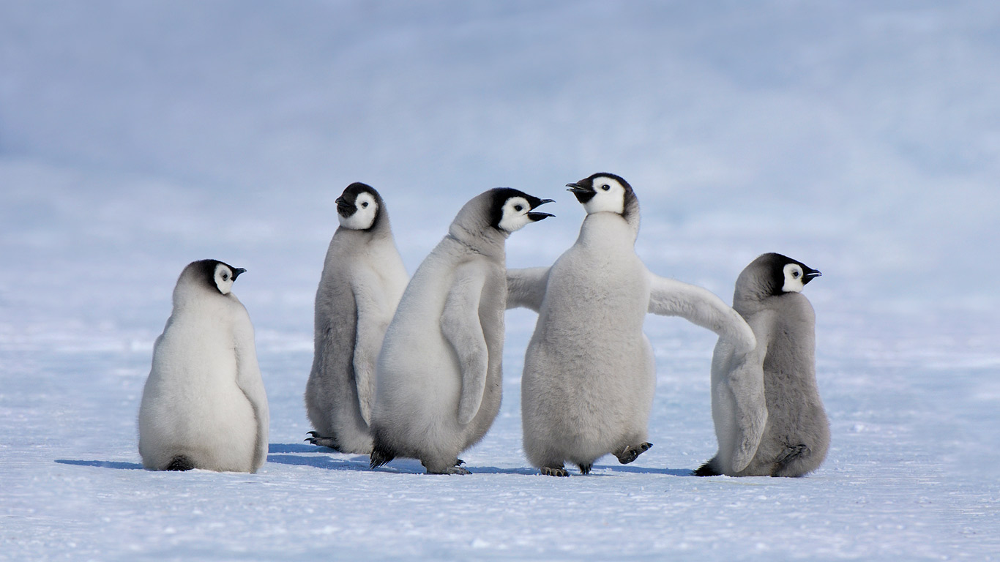

#### 20150119 View of castle Hohenschwangau, Bavaria, Germany (© Mespilia/Shutterstock)(Bing United Kingdom)

#### 20150119 Xavier Medina-Campeny’s “Homage to King” sculpture in Atlanta, Georgia (© L. Kragt Bakker/Shutterstock)(Bing United States)

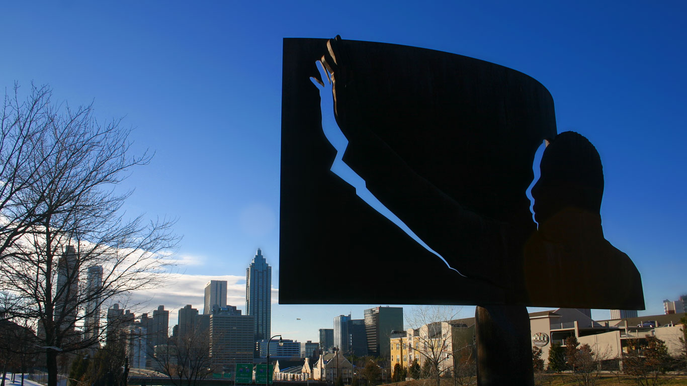

#### 20150118 Under a bridge spanning the Odiel River, Huelva, Spain (© Antonio Arcos aka Fotonstudio Photography/Getty Images)(Bing United Kingdom)

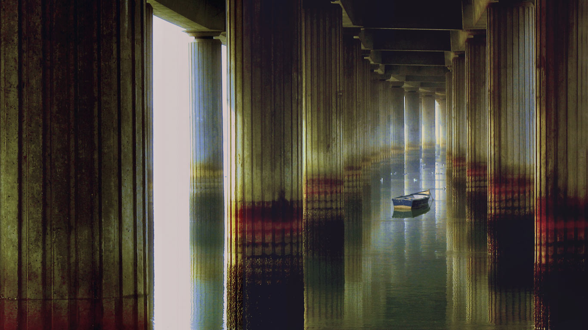

#### 20150117 Blue wildebeest herd at the Mara River in Masai Mara National Reserve, Kenya (© Winfried Wisniewski/Corbis)(Bing United Kingdom)

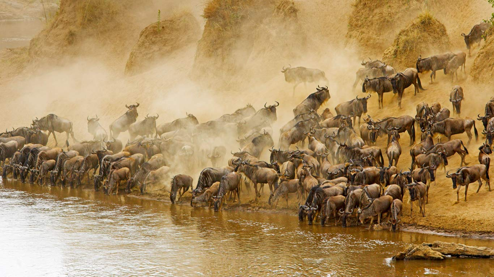

#### 20150116 Big Golden Guitar in Tamworth, New South Wales (© Stonemeadow Photography/Alamy)(Bing Australia)

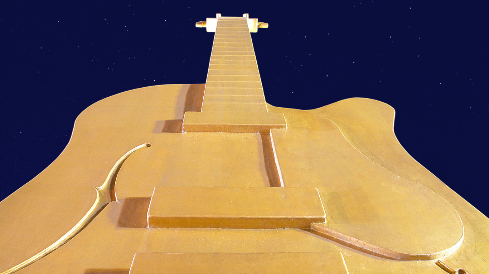

#### 20150116 Yosemite National Park after a snow storm, California (© Jeffrey Murray/Aurora Photos)(Bing United States)

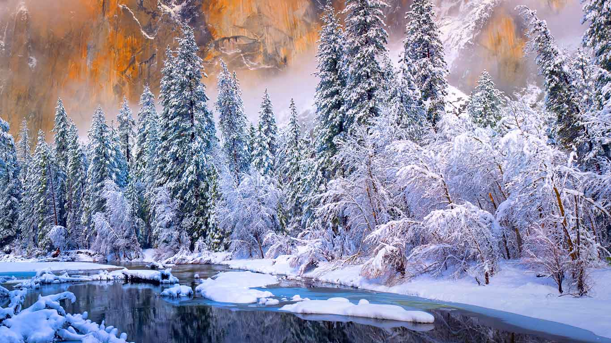

#### 20150116 风雪中孤独行走的企鹅 (© Gabe Rogel/Aurora/Getty Images)(Bing China)

#### 20150116 Tsingy de Bemaraha National Park, Madagascar (© Frans Lanting/Mint)(Bing United Kingdom)

#### 20150115 Gorges du Verdon, Var, Provence-Alpes-Côte d’Azur (© Camille Moirenc/Hemis.fr/Getty Images)(Bing France)

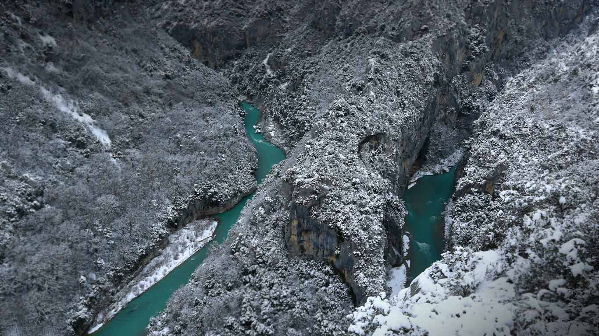

#### 20150115 Japanese tree frogs (© Shinji Kusano/Minden Pictures)(Bing United Kingdom)

#### 20150115 Crowfoot Mountain and Bow Lake, Banff National Park, Alberta, Canada (© Paul Zizka/All Canada Photos/Getty Images)(Bing Canada)

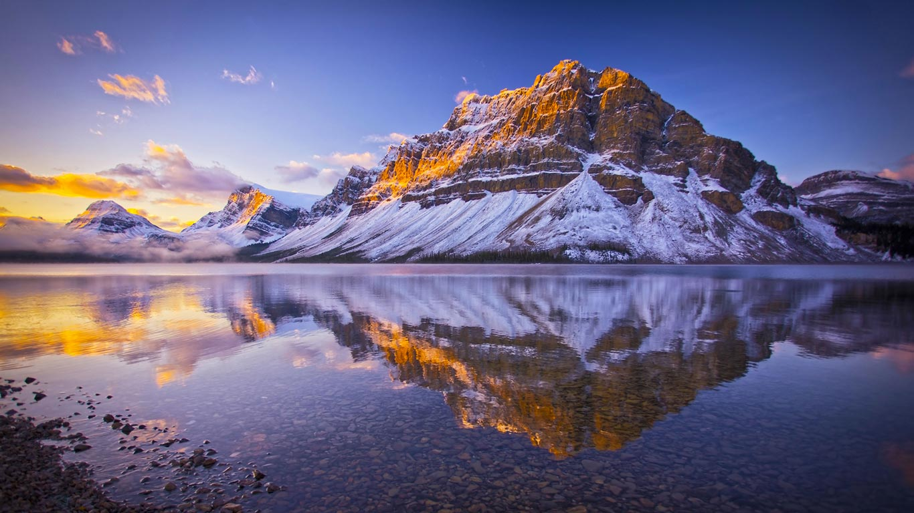

#### 20150114 Aurora borealis over Tombstone Territorial Park, Yukon, Canada (© Nagesh Mahadev)(Bing United Kingdom)

#### 20150113 Fingernail dancers’ hands in Thailand (© Raffaele Meucci/age fotostock)(Bing United States)

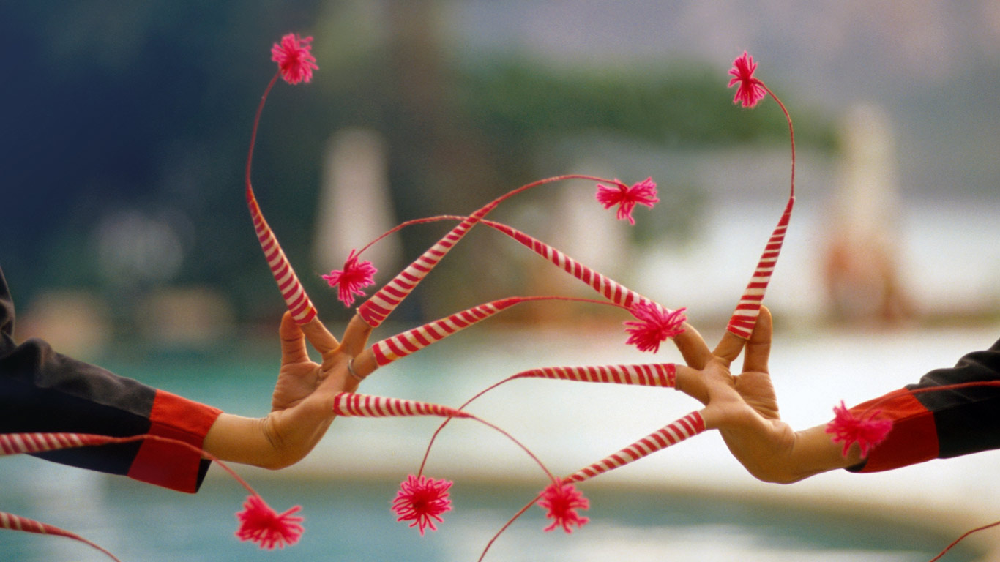

#### 20150113 Root structure in a mudflat near Norman River in Queensland, Australia (© Robin Smith/Getty Images)(Bing United Kingdom)

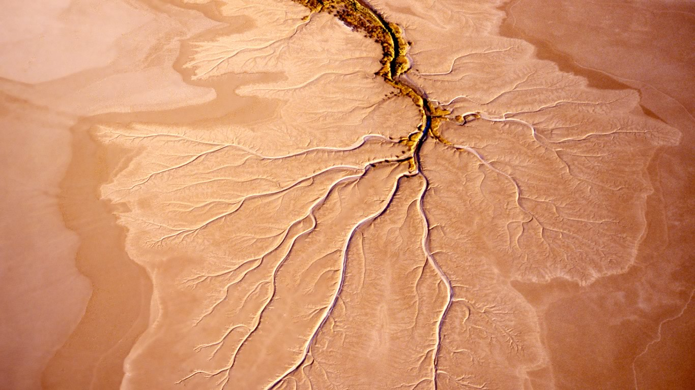

#### 20150113 „Gespensterwald“ bei Nienhagen, Mecklenburg-Vorpommern, Deutschland (© Sandra Bartocha/Nature Picture Library/Corbis)(Bing Deutschland)

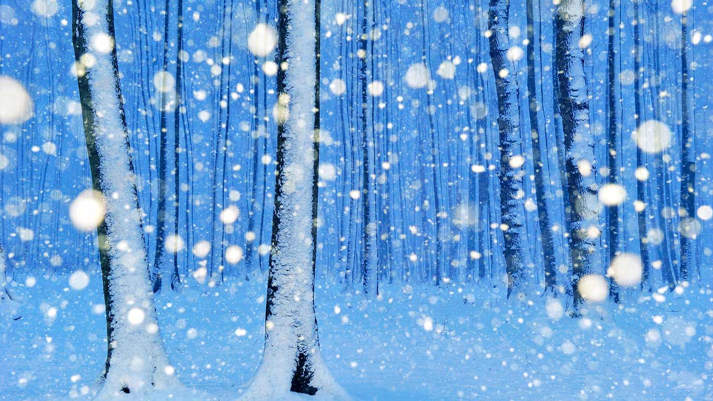

#### 20150112 Verona along the Adige River, Italy (© Franco Cogoli/4Corners Images)(Bing United Kingdom)

#### 20150112 Rassemblement après l’attentat commis dans les locaux de Charlie Hebdo, place de la République, Paris (© REX/LaurentVu/SIPA)(Bing France)

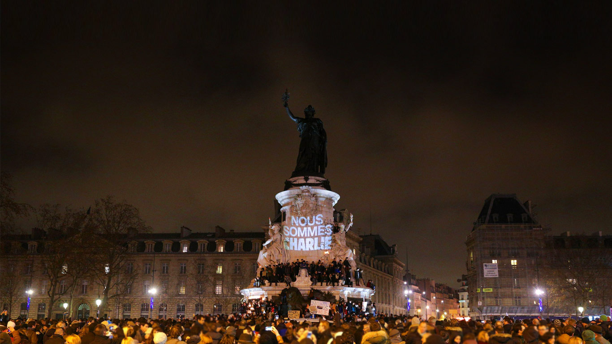

#### 20150111 Tributes of candles, pens and flowers at Place de la Republique, Paris, France (© Kristy Sparow/Getty Images)(Bing United Kingdom)

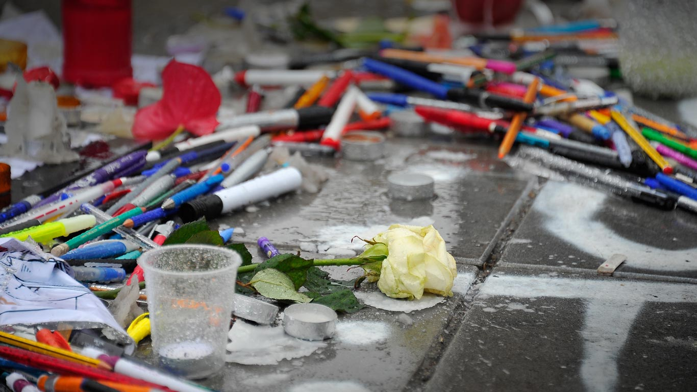

#### 20150110 European otter near Lelystad, Netherlands (© Ernst Dirksen/Minden Pictures)(Bing United Kingdom)

#### 20150109 Aerial view of trees in the outback of Queensland, Australia (© Richard Woldendorp/Getty Images)(Bing Australia)

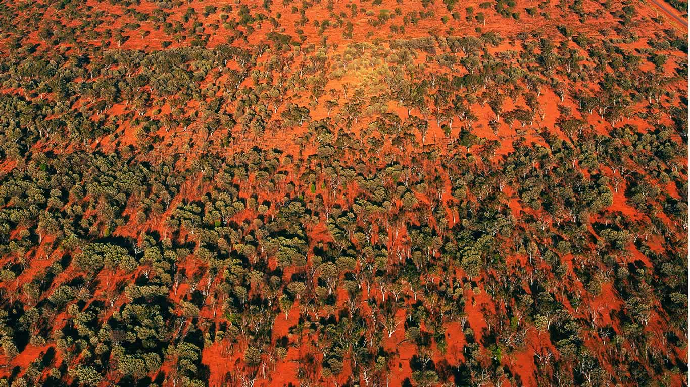

#### 20150109 Colourful sunrise over Corfe Castle, Dorset, United Kingdom (© Matt Gibson/Corbis)(Bing United Kingdom)

#### 20150109 Eltz Castle between Koblenz and Trier, Germany (© Nikiforov Alexander/Shutterstock)(Bing United States)

#### 20150108 Innenansicht des Deutschen Doms, Gendarmenmarkt, Berlin, Deutschland (© 68/altrendo travel/Ocean/Corbis)(Bing Deutschland)

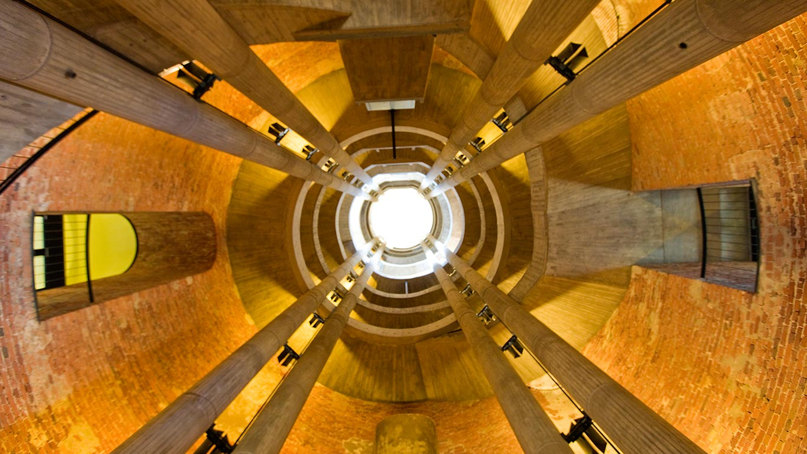

#### 20150108 Bryce Canyon National Park in winter, Utah, USA (© AirPano)(Bing United Kingdom)

#### 20150107 Evening view of the city skyline of Vancouver, Canada, from Stanley Park (© Paul Giamou/Aurora Photos)(Bing United Kingdom)

#### 20150107 日本阿尔卑斯山脉，雪中的日本猕猴 (© Konrad Wothe/Minden Pictures/Getty Images)(Bing China)

#### 20150107 Détail de la grille du château de Versailles montrant une couronne en or (© Dan Costa/Alamy)(Bing France)

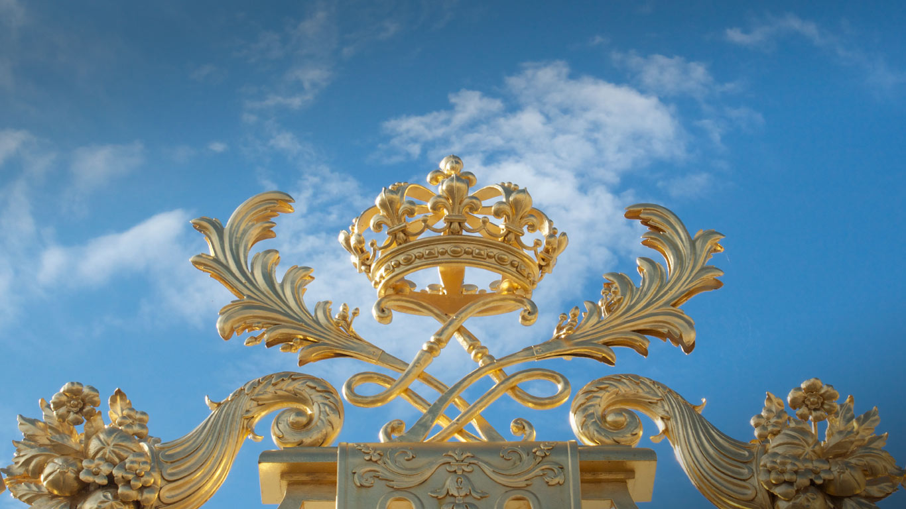

#### 20150106 People surfing at dusk, Geriba Beach, Buzios, Brazil (© Mark Leibowitz/Masterfile)(Bing United Kingdom)

#### 20150106 Lagoon near San Jose del Cabo, Baja California Sur, Mexico (© Frans Lanting/SuperStock)(Bing United States)

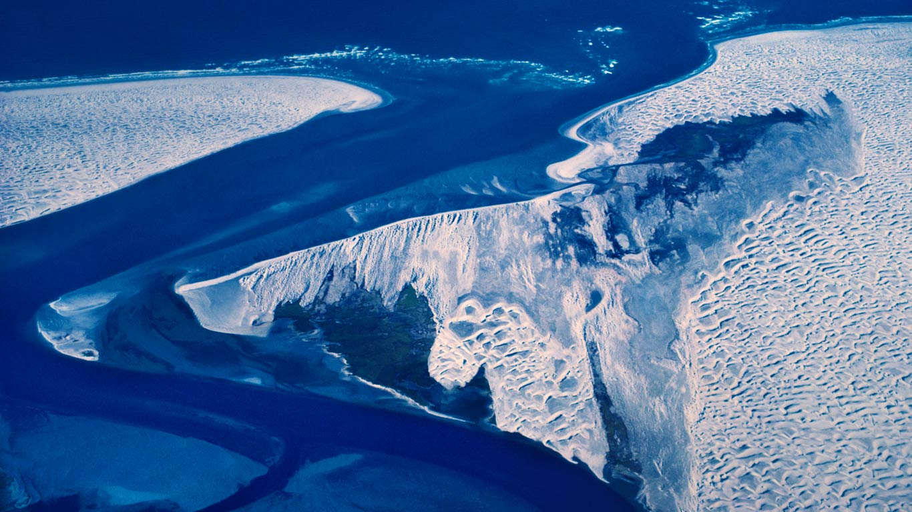

#### 20150105 ｢夜明けの霧｣山梨, 山中湖 (© Jeff Matsuya/Getty Images)(Bing Japan)

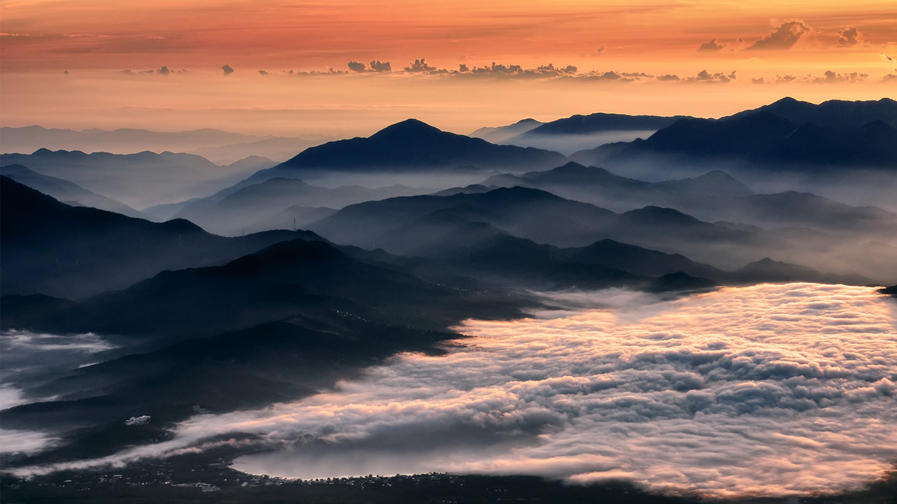

#### 20150105 A glimpse of the Harbin International Ice and Snow Sculpture Festival in Harbin, China (© Yang Wang)(Bing United Kingdom)

#### 20150104 Everglades National Park, Florida, USA (© Angelo Cavalli/Aurora Photos)(Bing United Kingdom)

#### 20150103 Red Deer (Cervus elaphus) stag in snowfall, Derbyshire, England, United Kingdom (© James Shooter/Minden)(Bing United Kingdom)

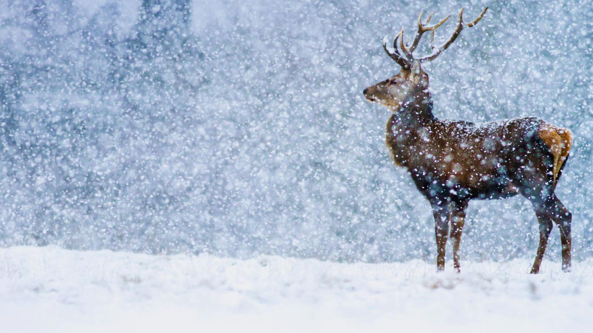

#### 20150103 Mendenhall Glacier near Juneau, Alaska (© John Hyde/age fotostock)(Bing United States)

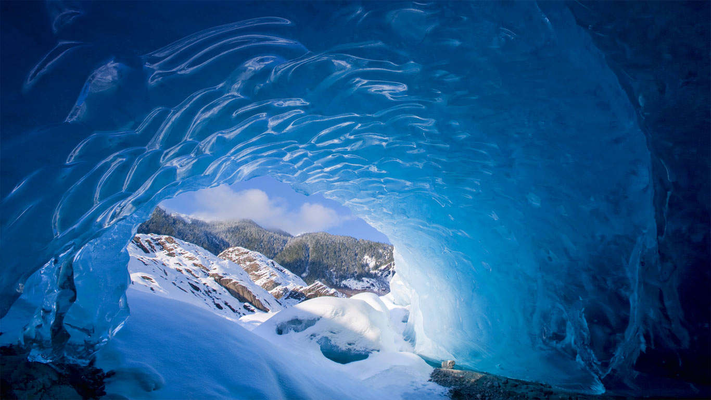

#### 20150102 Piscataqua River, Portsmouth, New Hampshire, USA (© Denis Tangney Jr./Getty Images)(Bing United Kingdom)

#### 20150102 Blick vom Wank auf Garmisch-Partenkirchen, Bayern, Deutschland (© FB-Fischer/imageBROKER/Alamy)(Bing Deutschland)

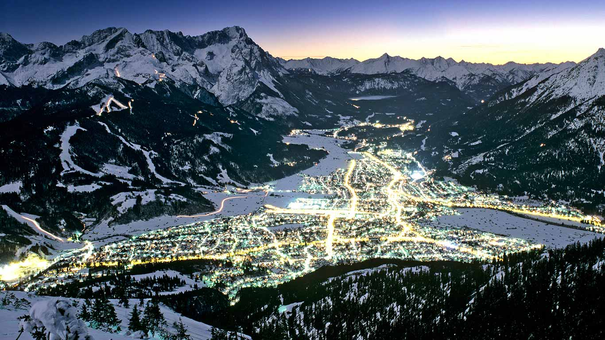

#### 20150102 上海外滩烟花秀 (© Danny Hu/Moment Open/Getty Images)(Bing China)

#### 20150101 台湾台北，在象山上观看台北日落 (© David Terrazas Morales/Corbis)(Bing China)

#### 20150101 Walrus on Frozen Strait, Hudson Bay, Nunavut, Canada (© Paul Souders/Corbis)(Bing United States)

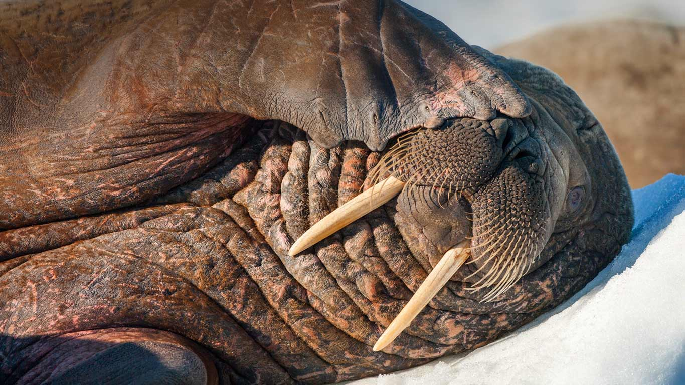

#### 20150101 Chêne couvert de glace, Jura, Franche-Comté (© Michel Loup/Minden Pictures)(Bing France)

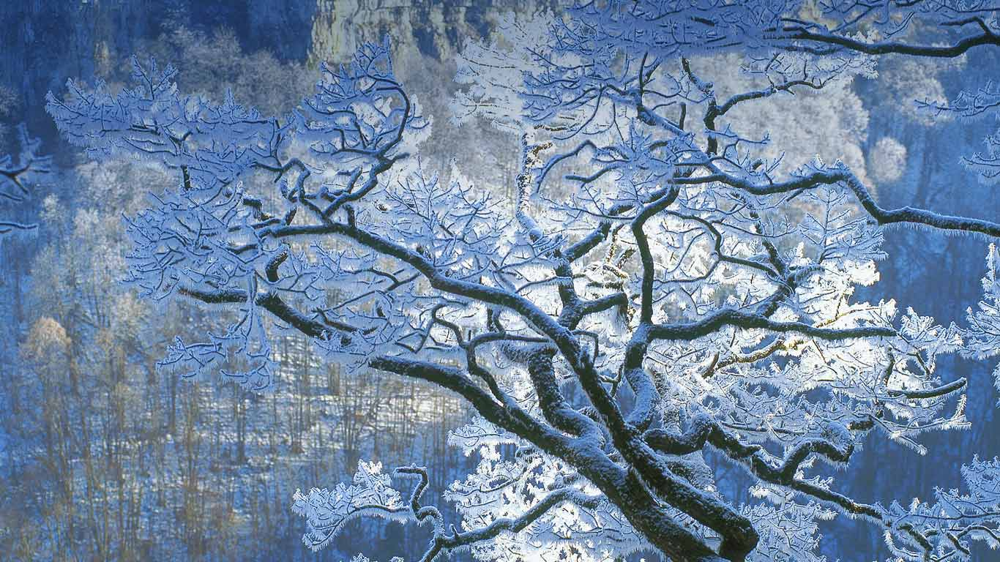

#### 20150101 Sunrise view from the 8th station on Mt. Fuji of the fog-covered Yamanaka Lake, Japan (© Jeff Matsuya/Getty Images)(Bing United Kingdom)

