#### 20150228 Sand dunes and yellow populus diversifolia trees along the lower part of the Talimu River, China (© George Steinmetz/Corbis)(Bing United Kingdom)

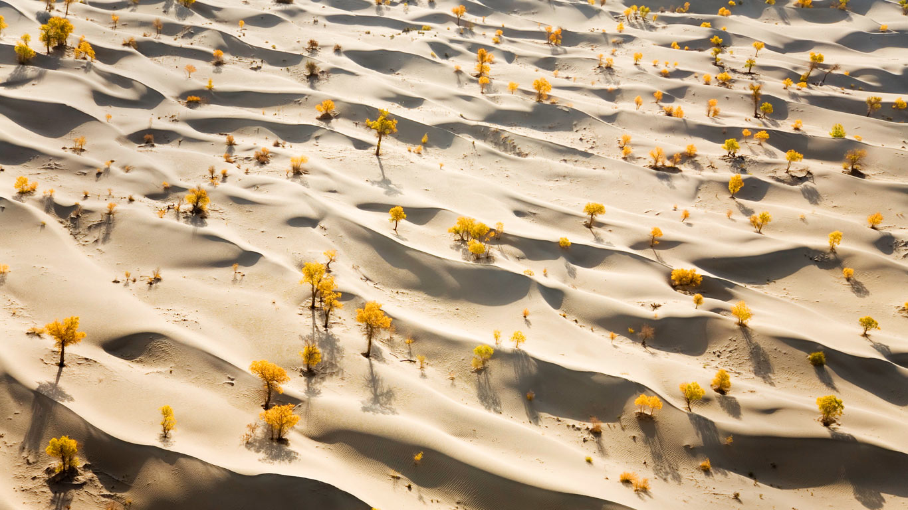

#### 20150228 Cinder cones in the crater of Haleakalā Volcano, Maui, Hawaii (© Dennis Maisel/Tandem Stills + Motion)(Bing United States)

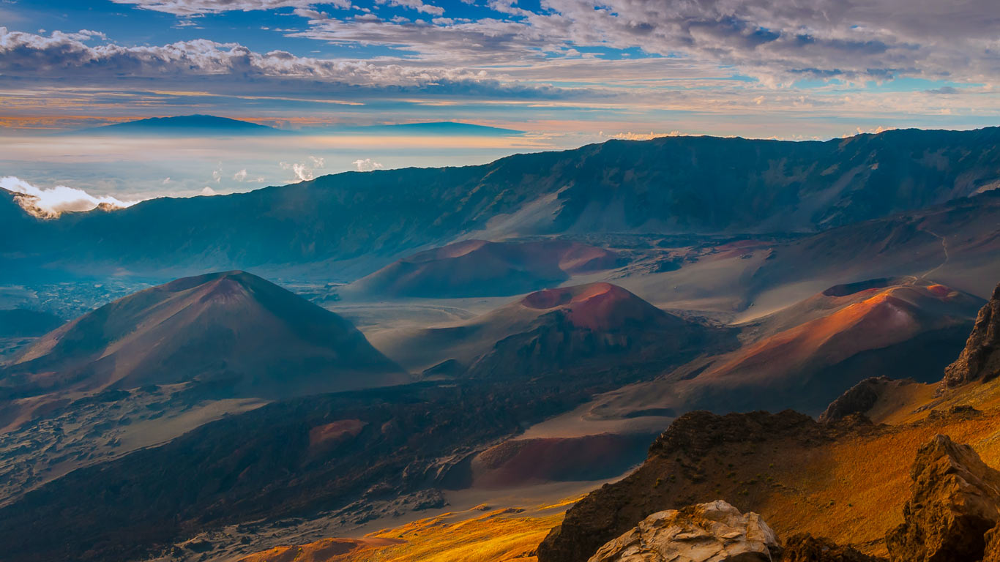

#### 20150227 Polar bear on a barrier island in the Beaufort Sea, Arctic National Wildlife Refuge, Alaska, USA (© Patrick Endres/plainpicture)(Bing United Kingdom)

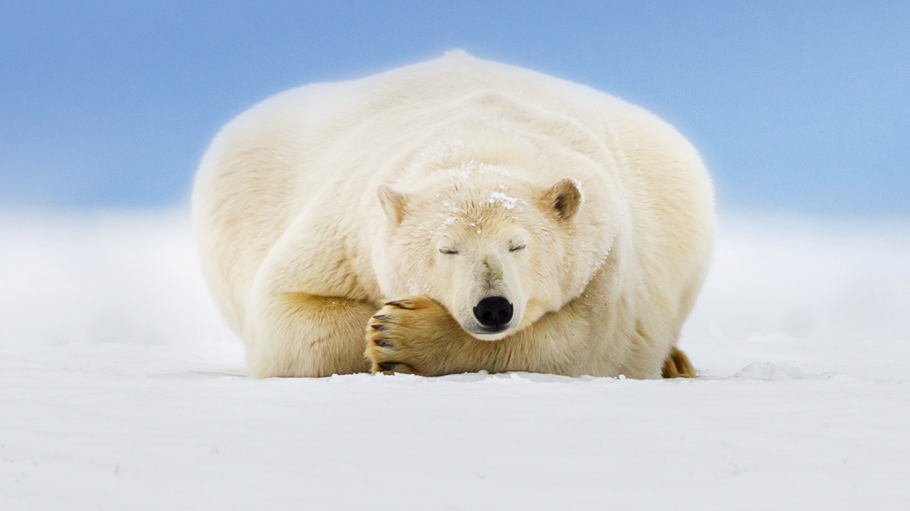

#### 20150226 Notre-Dame de Reims Cathedral, Marne, France (© Sylvain Sonnet/Corbis)(Bing United Kingdom)

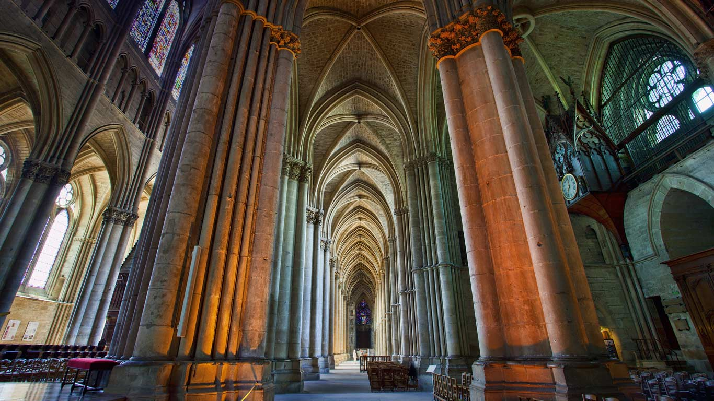

#### 20150226 American Falls as seen from Niagara Falls, Ontario, Canada, February 19, 2015 (© ZUMA/REX)(Bing United States)

#### 20150226 ｢梅とおみくじ｣京都, 北野天満宮 (© JTB Photo/Superstock)(Bing Japan)

#### 20150225 Music Wall of Fame, Mathew Street, Liverpool (© David Colbran/Alamy)(Bing United Kingdom)

#### 20150225 Palm canopy in the Daintree National Park, Queensland, Australia (© Konrad Wothe/Minden Pictures)(Bing Australia)

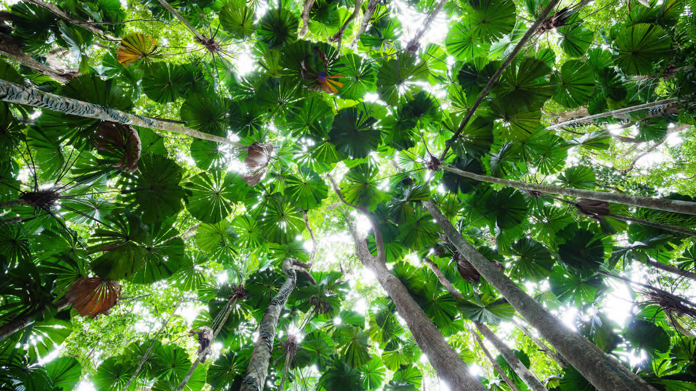

#### 20150224 The Redwood National and State Parks of California, USA (© David Fortney/Corbis Motion)(Bing United Kingdom)

#### 20150224 北京天坛春节期间，纸扇与红灯笼 (© Wiliam Perry/Alamy)(Bing China)

#### 20150223 马来西亚槟城，九皇爷庙 (© Ivan Hor/Moment/Getty Images)(Bing China)

#### 20150223 Blue monkey in the Kakamega Forest Reserve, Kenya (© Anup Shah/Minden Pictures)(Bing United Kingdom)

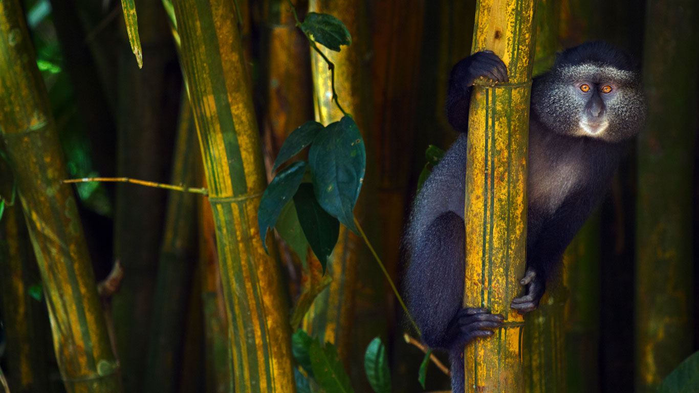

#### 20150222 Detail of York Minister, York, England (© Martin Bache/Alamy)(Bing United Kingdom)

#### 20150222 A southern viscacha in the Andes Mountains (© Chris Mattison/Minden Pictures)(Bing United States)

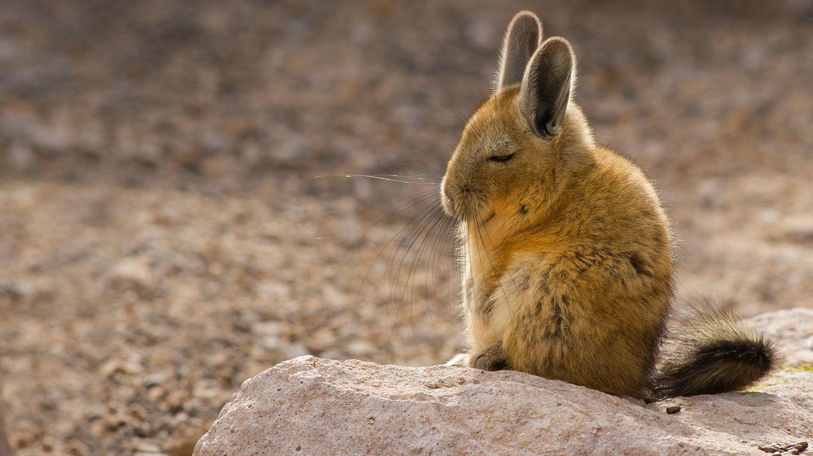

#### 20150222 Aerial over unknown lake in the Cariboo region of British Columbia Canada (© Mike Grandmaison/Corbis)(Bing Canada)

#### 20150222 新年装饰 ，小老虎 (© Imagemore Co. Ltd./Getty Images)(Bing China)

#### 20150221 Satellite photo of the Ganges Delta, India and Bangladesh (© Planet Observer/Universal Images Group/SuperStock)(Bing United Kingdom)

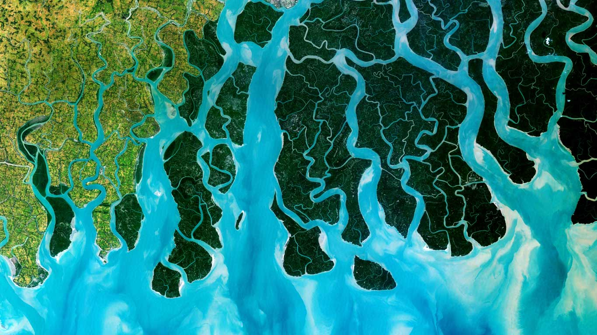

#### 20150221 装饰，玩具风车 (© Randy Faris/CORBIS)(Bing China)

#### 20150221 Vue générale au coucher du soleil de la Conciergerie, de la place et du théâtre du Châtelet, Paris, Île-de-France (© Arnaud Chicurel/Age fotostock)(Bing France)

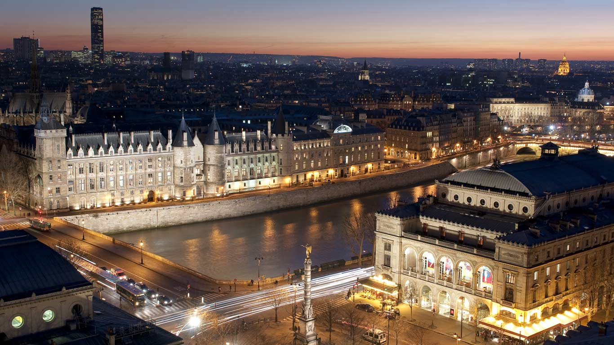

#### 20150220 装饰，荷包(香囊) (© Carlina Teteris/Moment Open/Getty Images)(Bing China)

#### 20150220 Fort Bourtange, Netherlands (© Amos Chapple/Rex Features)(Bing United Kingdom)

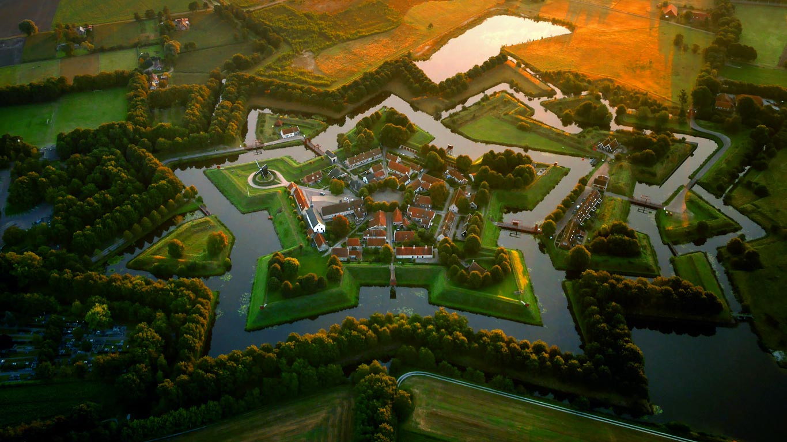

#### 20150220 Bethesda Terrace’s lower passage in Central Park, New York City (© Sean Pavone/Shutterstock)(Bing United States)

#### 20150219 Ammonite Fossil (© backgrounder/Alamy)(Bing Canada)

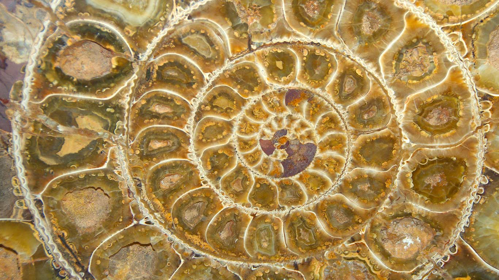

#### 20150219 台湾台北，大稻埕烟火 (© TPG/imageBROKER/Corbis)(Bing China)

#### 20150219 Rocky Mountain bighorn sheep in Kananaskis Country, Alberta, Canada (© Walter Nussbaumer/Corbis)(Bing United Kingdom)

#### 20150218 Loch Benevean in Glen Affric, Scotland (© BlueGreen Pictures/SuperStock)(Bing United Kingdom)

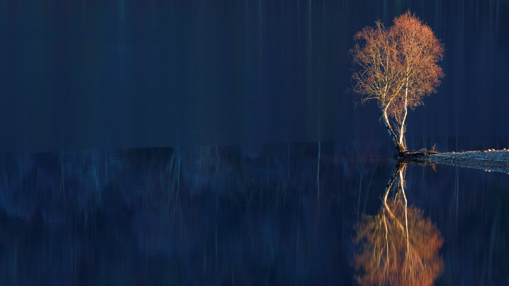

#### 20150217 Pappfiguren auf einem Karnevalswagen beim Rosenmontagszug in Düsseldorf, Nordrhein-Westfalen, Deutschland (© Karl F. Schöfmann/imageBROKER/Age Fotostock)(Bing Deutschland)

#### 20150217 View from Jackson Square, New Orleans, Louisiana (© Fotoluminate LLC/Shutterstock)(Bing United States)

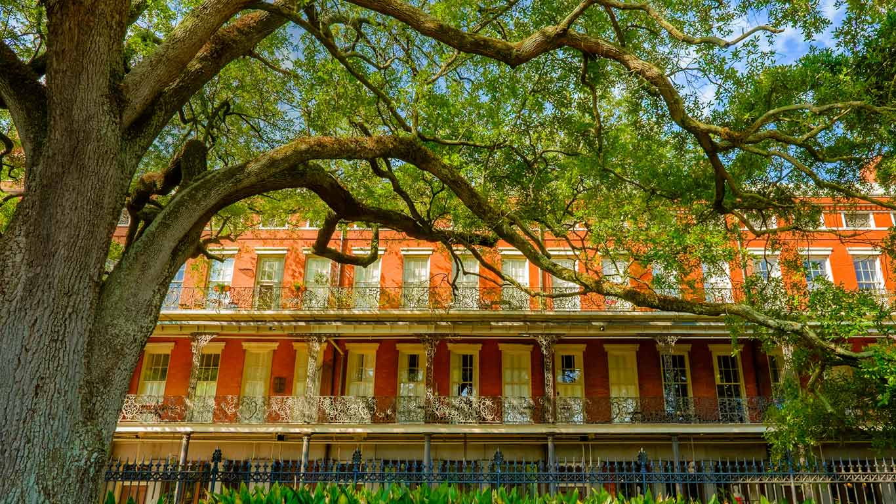

#### 20150217 Clione (© Datacraft/Age Fotostock)(Bing United Kingdom)

#### 20150216 United States Capitol, Washington, D.C. (© Hal Bergman/Getty Images)(Bing United States)

#### 20150216 Holuhraun volcanic eruption, Iceland (© Johnathan Ampersand Esper/Aurora Photos)(Bing United Kingdom)

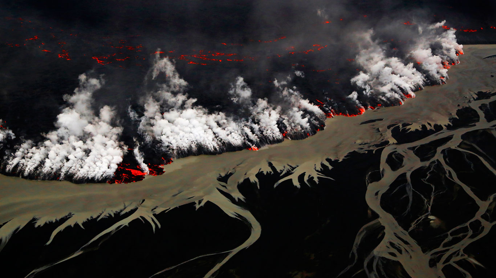

#### 20150215 Miniature snow houses made for the Kamakura Festival, Yokote, Japan (© JTB Media Creation, Inc./Alamy)(Bing United Kingdom)

#### 20150214 冰与火，冻结的伊利湖上空的朝阳 (© Joshua Bozarth/Flickr Open/Getty Images)(Bing China)

#### 20150214 The Heart Nebula (© Matthew Russell/Visuals Unlimited, Inc.)(Bing United Kingdom)

#### 20150214 Semperoper, Dresden, Sachsen, Deutschland (© imageBROKER/Superstock)(Bing Deutschland)

#### 20150213 Ponte Vecchio, a bridge over the Arno River in Florence, Italy (© Sylvain Sonnet/Corbis)(Bing United States)

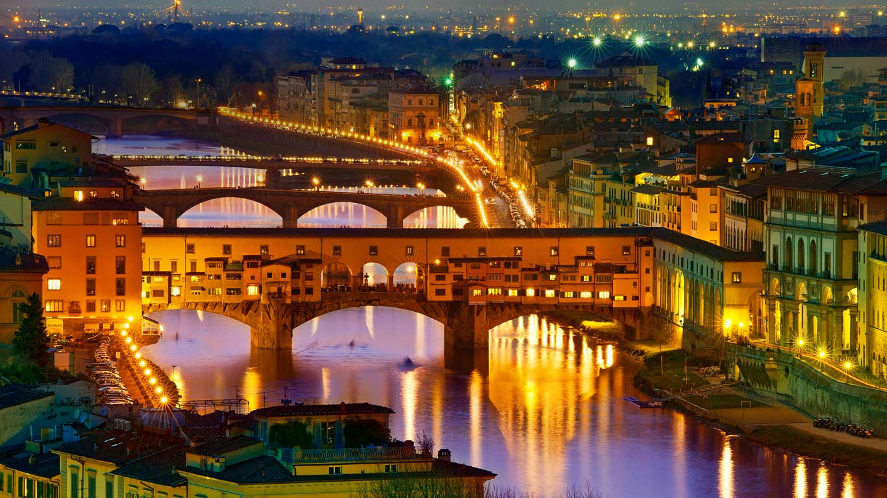

#### 20150213 Silhouette of young Indian boys playing cricket against a sunset background (© Tim Gainey/Alamy)(Bing United Kingdom)

#### 20150212 Cloister garden in Mont Saint Michel abbey in France (© Monkey Business Images/Rex Features)(Bing United Kingdom)

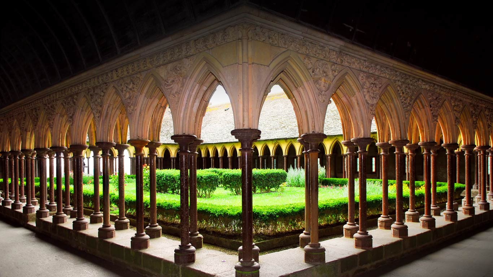

#### 20150211 Firehole River in Yellowstone National Park, Wyoming, USA (© Don White/SuperStock)(Bing United Kingdom)

#### 20150211 乡村婚宴中的小猪点心 (© Melinda Chan/Moment/Getty Images)(Bing China)

#### 20150210 Winterabend in Köln, Nordrhein-Westfalen, Deutschland (© Fridmar Damm/4Corners)(Bing Deutschland)

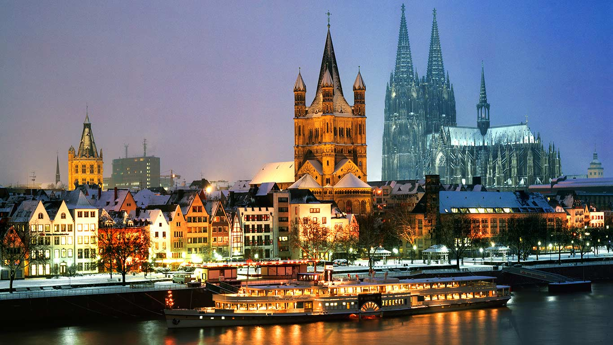

#### 20150210 Northern pygmy-owl, Glacier National Park, Montana, USA (© Steven Gnam/Tandem Stills + Motion)(Bing United Kingdom)

#### 20150209 Dusk overlooking St Ives Harbour, Cornwall, England (© Ian Woolcock/Shutterstock)(Bing United Kingdom)

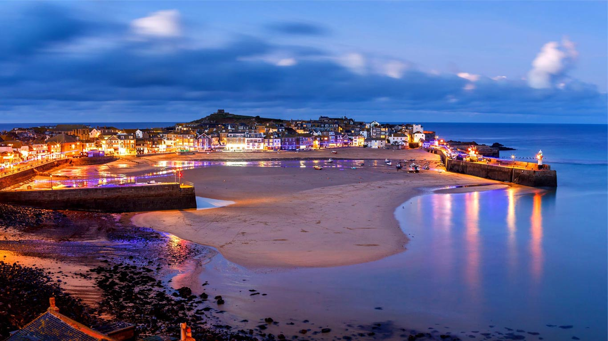

#### 20150209 Scots Pines in winter, Birds Hill Provincial Park, Manitoba, Canada (© Mike Grandmaison/Corbis)(Bing Canada)

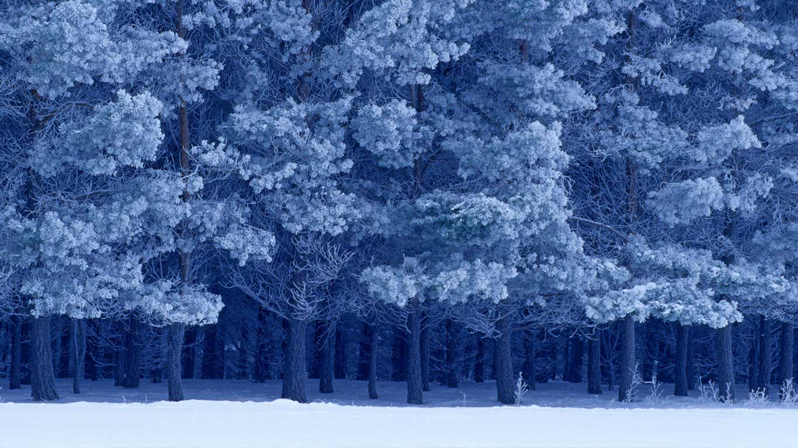

#### 20150208 Val Thorens, Savoie, Rhône-Alpes (© Neale Haynes/Rex Features)(Bing France)

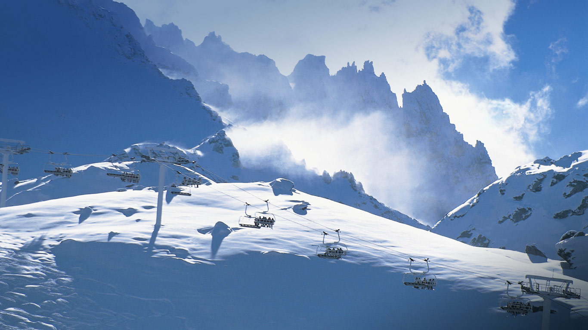

#### 20150208 Gordon Dam, Tasmania, Australia (© Steve Daggar Photography/Getty Images)(Bing United Kingdom)

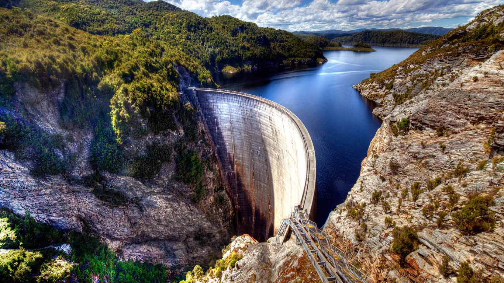

#### 20150207 ｢あおさ海苔養殖場｣三重, 志摩 (© GYRO PHOTOGRAPHY/amanaimages/Corbis)(Bing Japan)

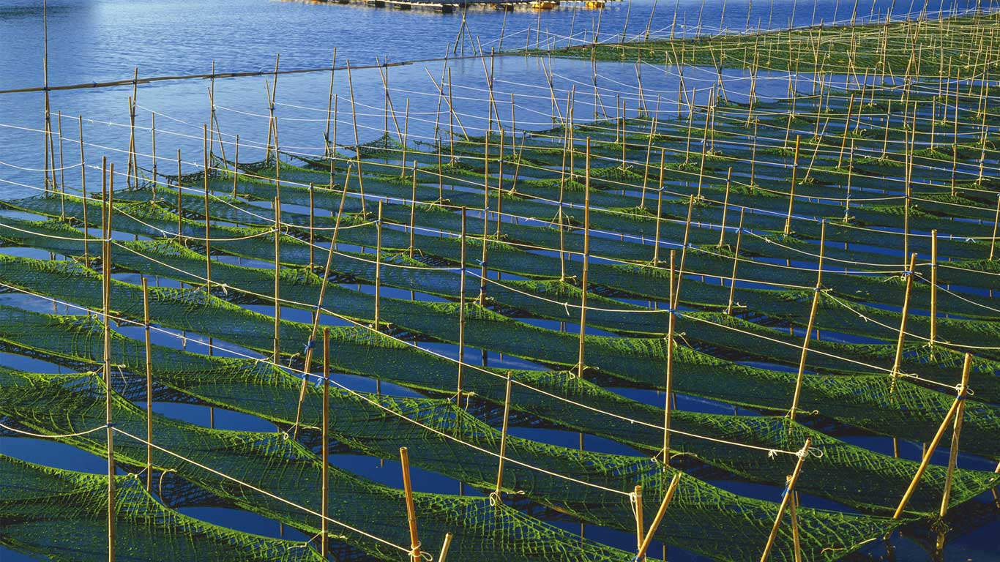

#### 20150207 Muskox in the Brooks Range, Alaska, USA (© Steven Kazlowski/Corbis)(Bing United Kingdom)

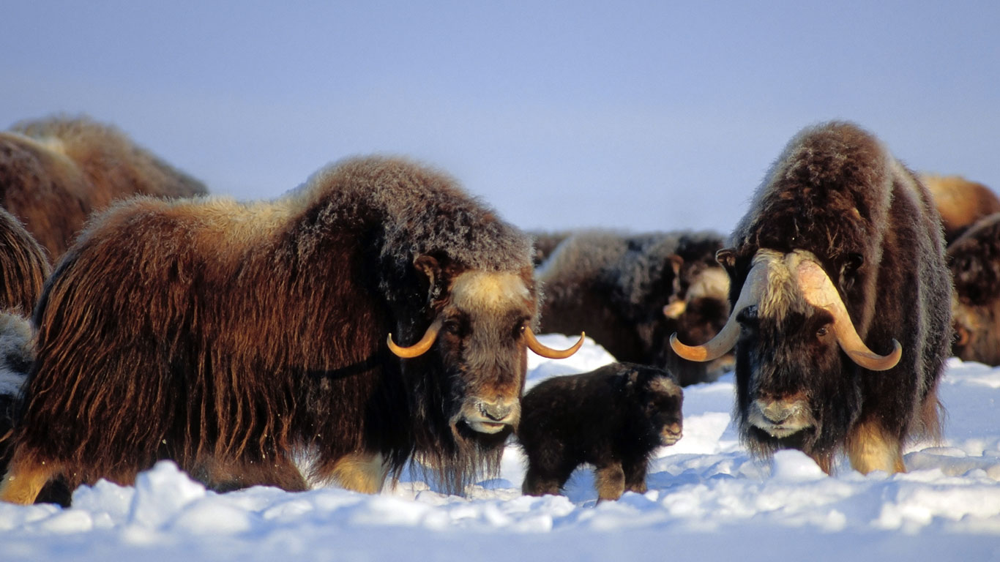

#### 20150206 Rugby Union, close-up of a scrum tackle (© Steve Stock/Alamy)(Bing United Kingdom)

#### 20150206 Ronda in Málaga Province, Spain (© Marcp_dmoz on Flickr/Getty Images)(Bing United States)

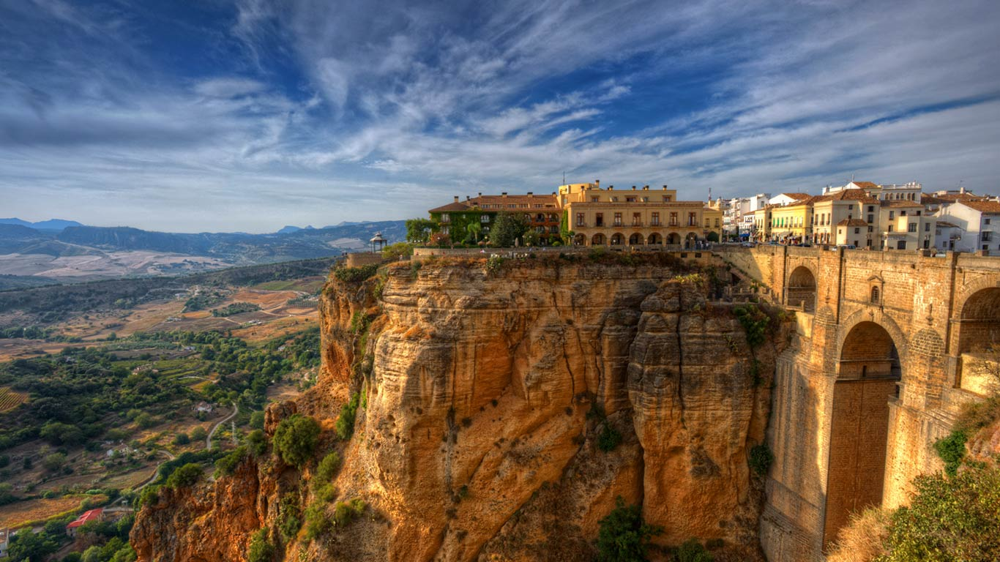

#### 20150206 Tall ship Eye of the Wind in Tasmania, Australia (© John Hay/Getty Images)(Bing Australia)

#### 20150205 Sellin Pier in winter, Ruegen Island, Mecklenburg-Western Pomerania, Germany (© Kohls/Aurora Photos)(Bing United Kingdom)

#### 20150205 Flood in the Planina Plain, in the karst basin of the Ljubljanica River, Slovenia (© Ales Komovec/Rex Features)(Bing United States)

#### 20150204 The European Synchrotron Radiation Facility, Grenoble, France (© Peter Ginter/Corbis)(Bing United States)

#### 20150204 ｢支笏湖氷濤まつり｣北海道, 千歳市 (© JTB MEDIA CREATION, Inc./Alamy)(Bing Japan)

#### 20150204 Plum blossoming in spring (© atiger/Shutterstock)(Bing United Kingdom)

#### 20150203 Kalk Bay near Cape Town, South Africa (© Michael McSweeney/Corbis)(Bing United Kingdom)

#### 20150202 Aurora borealis light up the night sky over the Yukon River in the Yukon (© Robert Postma/All Canada Photos/Getty Images)(Bing Canada)

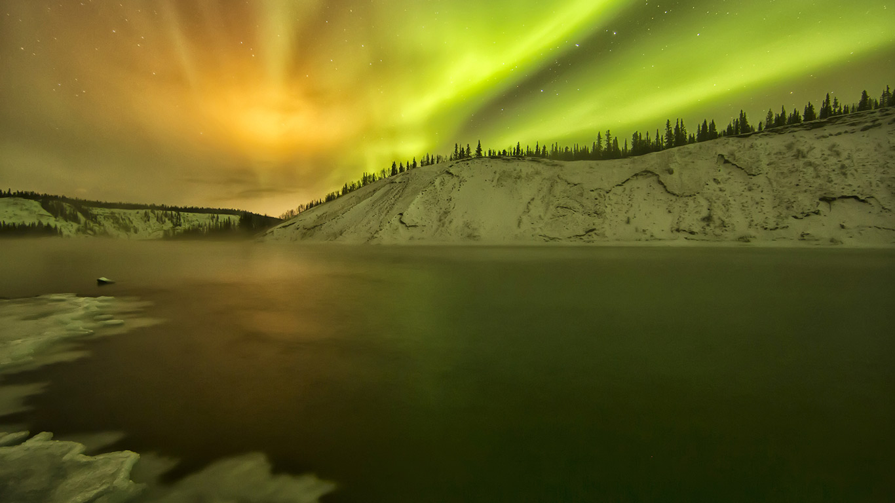

#### 20150202 Alpine marmot (© Michael Dietrich/Alamy)(Bing United States)

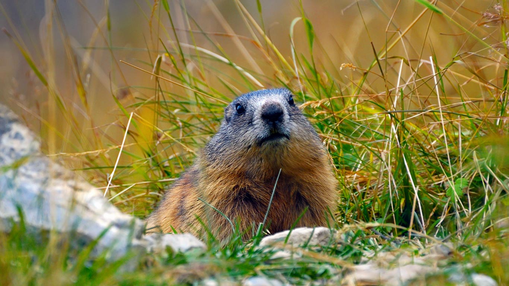

#### 20150202 Elderberry stem cross section (© Gilles Martin/Minden Pictures)(Bing United Kingdom)

#### 20150201 Opal mine tunnels at Coober Pedy in South Australia (© John Frumm/hemis.fr/Alamy)(Bing Australia)

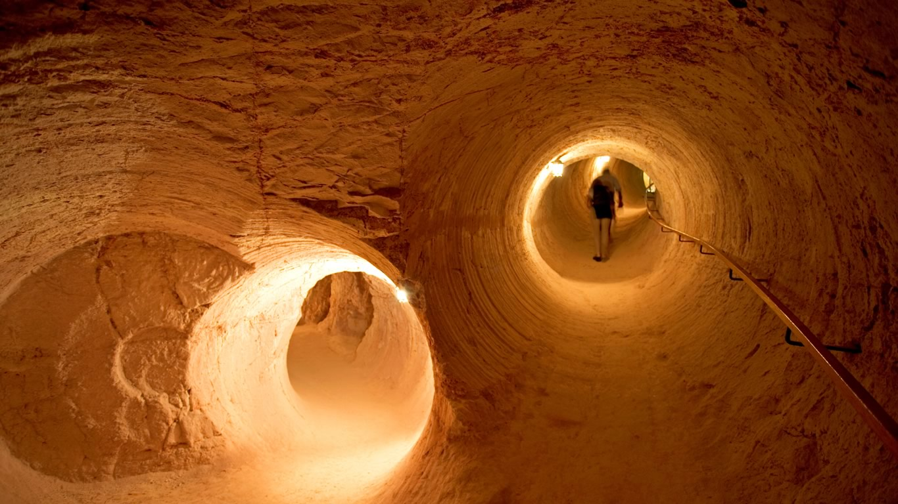

#### 20150201 Upper Antelope Canyon, Navajo Tribal Park, Arizona, USA (© Mat Rick/Tandem Stills + Motion)(Bing United Kingdom)

