#### 20150430 Kayak to sightseeing under the mountain, Alberta (© kroomjai/Shutterstock)(Bing Canada)

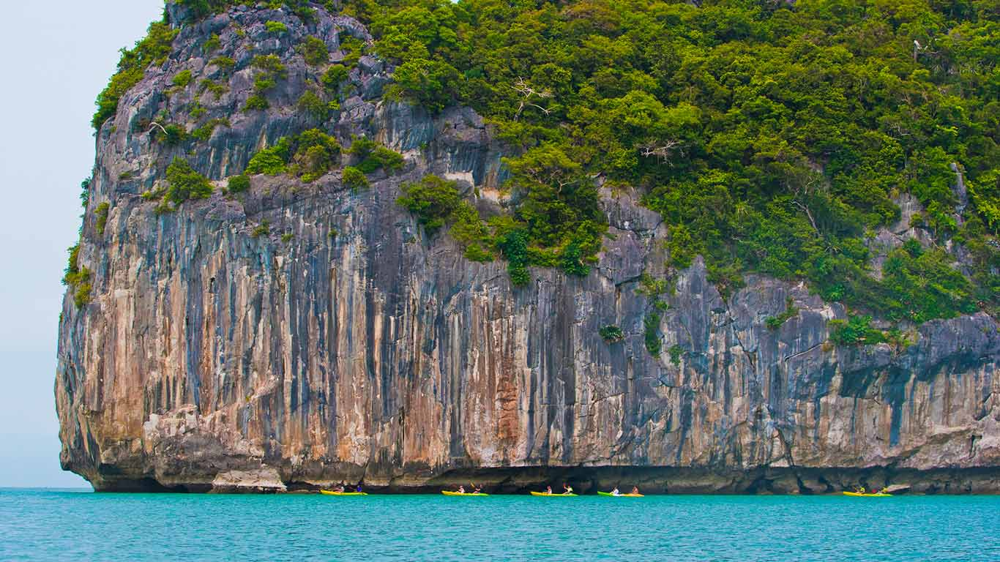

#### 20150430 Drummer with a bodhran at a pagan Beltane fire ceremony (© David Isaacson/Alamy)(Bing United Kingdom)

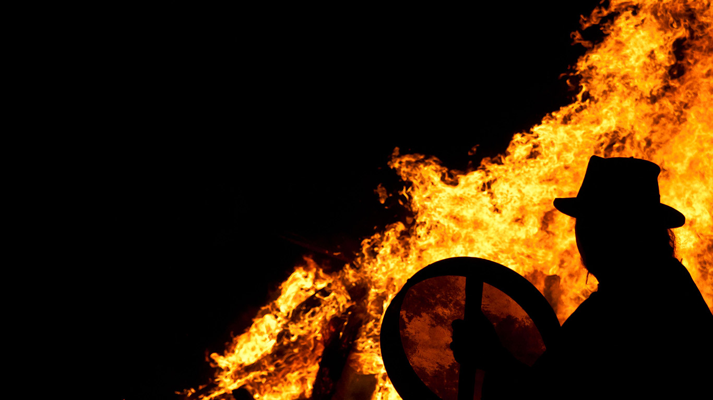

#### 20150429 Fountains in the park Planten un Blomen, Hamburg, Germany (© Andreas Rose/Corbis)(Bing United Kingdom)

#### 20150428 Devetàshka cave near Lovech, Bulgaria (© Marholev/E+/Getty Images)(Bing United States)

#### 20150428 Cambridge University Botanic Garden, Cambridge, England (© Harpur Garden Library/Corbis)(Bing United Kingdom)

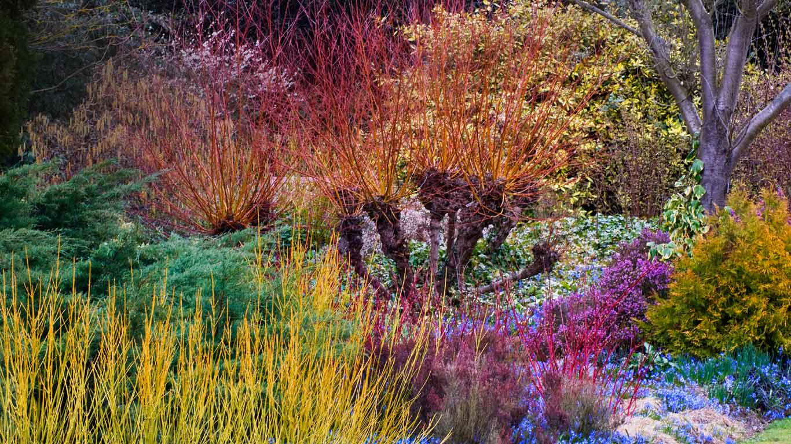

#### 20150427 Sway bridge at The Palace of the Lost City, North West Province, South Africa (© Heinrich van den Berg/Alamy)(Bing United Kingdom)

#### 20150427 Grange aux dîmes lors des Nuits Lumière à Bourges, Cher, Centre-Val de Loire (© Jean-Pierre Degas/Getty Images)(Bing France)

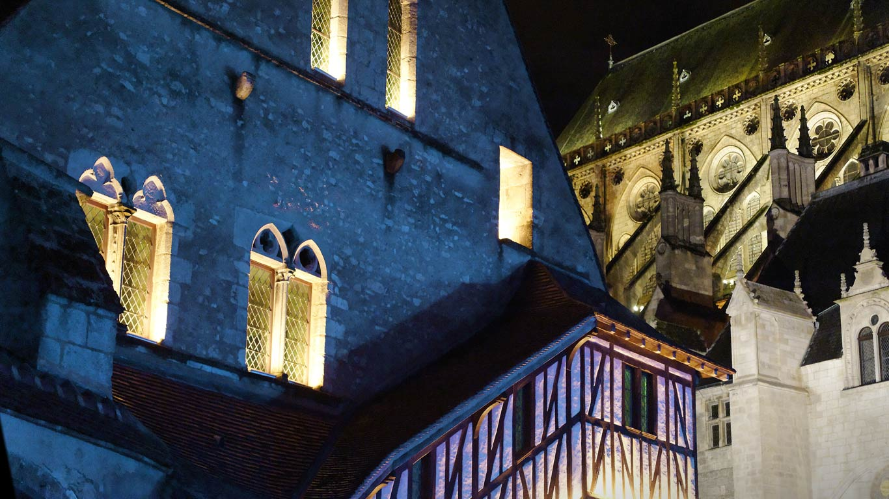

#### 20150426 Lihu Bridge, Wuxi, China (© 200/Moment Open/Getty Images)(Bing United States)

#### 20150426 Kelp goose on Cole-Cole Beach, Chiloé National Park, Chiloé Island, Chile (© SIME/eStock Photo)(Bing United Kingdom)

#### 20150425 Buildings in an abandoned ghost town of Bents, Saskatchewan, Canada (© Scott Prokop/Shutterstock)(Bing United Kingdom)

#### 20150425 Anzac Day at Currumbin, Queensland in 2014 (© Chris Hyde/Getty Images)(Bing Australia)

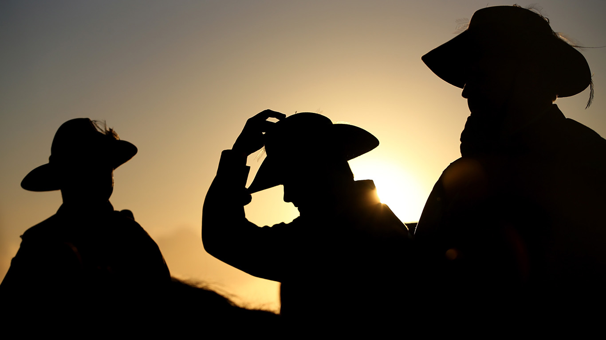

#### 20150424 Geometer moth larvae, aka an inchworm (© Joe Petersburger/Getty Images)(Bing United Kingdom)

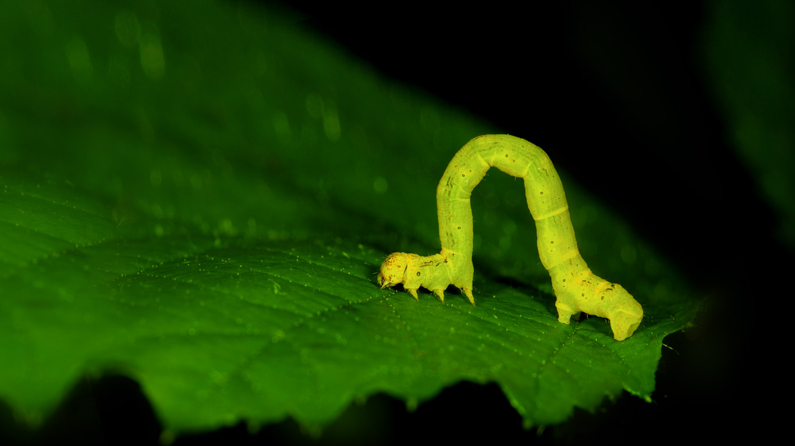

#### 20150424 Foothill Regional Park near Windsor, California (© Ron Koeberer/Tandem Stills + Motion)(Bing United States)

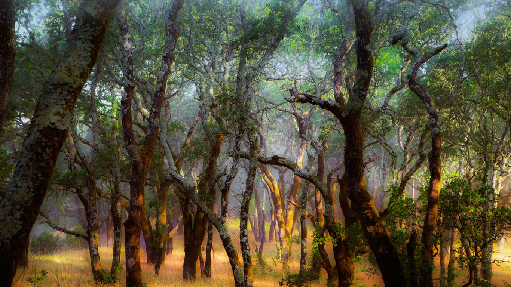

#### 20150423 City of London Coat of Arms (© Pete Spiro/Shutterstock)(Bing United Kingdom)

#### 20150422 Hoh Rainforest, Olympic National Park, Washington, USA  (© ARCO/P Frischknecht/age fotostock)(Bing United Kingdom)

#### 20150421 Cascade dans le Jura, Franche-Comté, France (© Suteracher/Shutterstock)(Bing France)

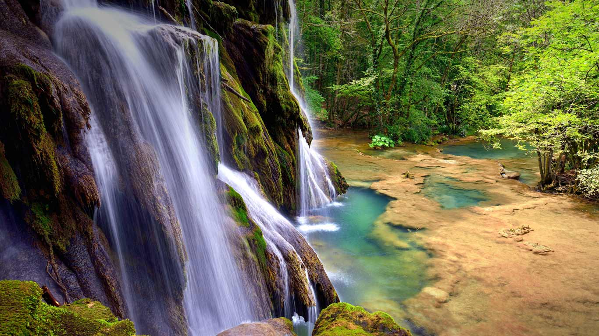

#### 20150421 Hikers near Hverfjall, Iceland (© Joseph Calev)(Bing United Kingdom)

#### 20150421 Aerial view of farmland, near Vancouver, BC, Canada (© Brendan Meadows/Cultura/plainpicture)(Bing Canada)

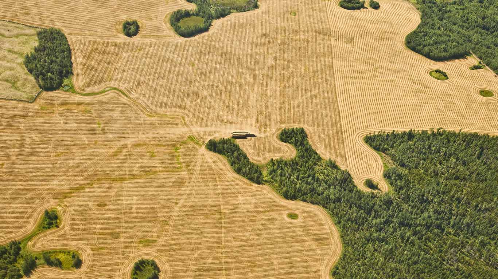

#### 20150421 Bluespotted ribbontail ray (Taeniura lymma) in the Indian Ocean (© Jeff Rotman/NPL/Minden Pictures)(Bing Australia)

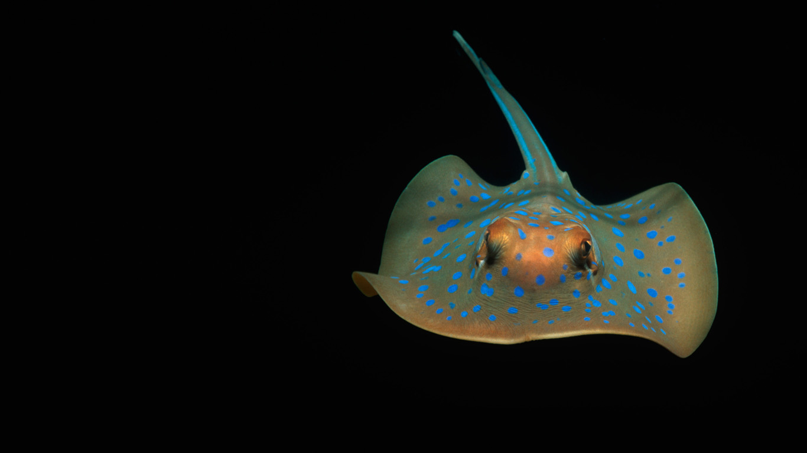

#### 20150420 Sun defrosts half a meadow in Tulfes, Austria (© F1 Online/REX)(Bing United Kingdom)

#### 20150419 Aerial picture, field structure before rice harvestation, Guilin, Guanxi, China (© imageBROKER/Superstock)(Bing United Kingdom)

#### 20150419 West Gate at Oklahoma City National Memorial, Oklahoma City, Oklahoma (© Anne Rippy/Getty Images)(Bing United States)

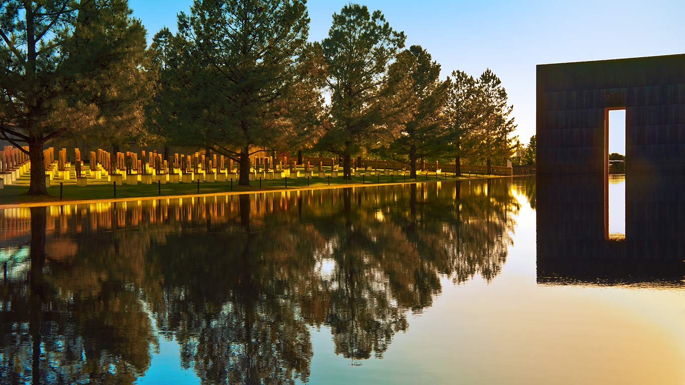

#### 20150418 Pear Lake in Sequoia National Park, California (© Marc Muench/Tandem Stills + Motion)(Bing United Kingdom)

#### 20150417 Green and yellow canola fields in spring (© Boris Stroujko/Shutterstock)(Bing United Kingdom)

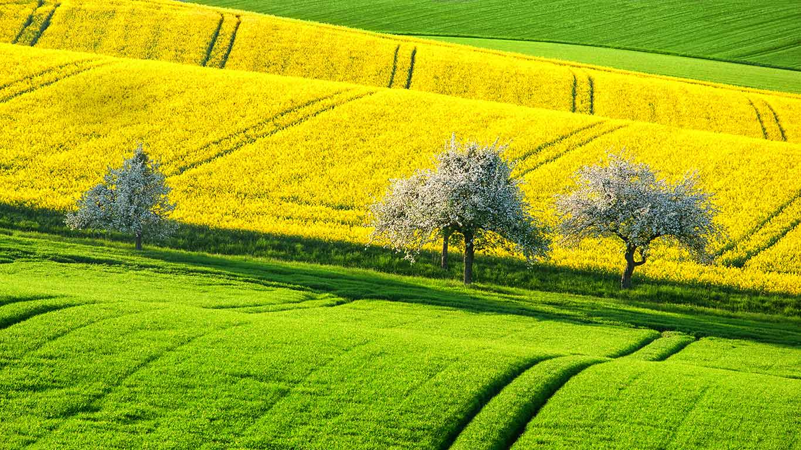

#### 20150417 Sonnenuntergang am Bannwaldsee, Allgäu, Bayern, Deutschland (© Ingmar Weseman/E+/Getty Images)(Bing Deutschland)

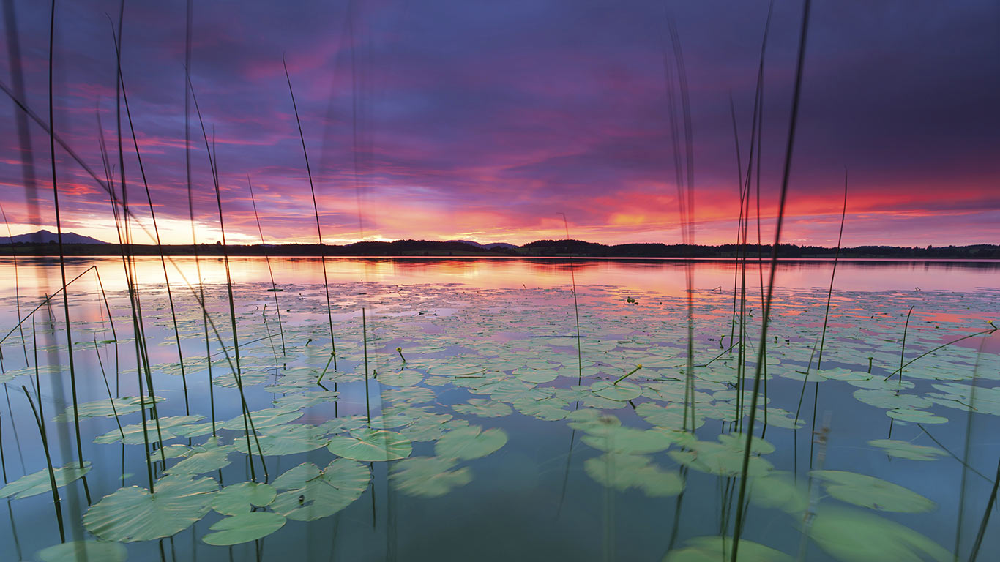

#### 20150416 长曝光拍摄，街道上的汽车 (© Mxing Photography/Flickr Open/Getty Images)(Bing China)

#### 20150416 Spring on Mount Yoshino in Nara Prefecture, Japan (© Sean Pavone/Alamy)(Bing United Kingdom)

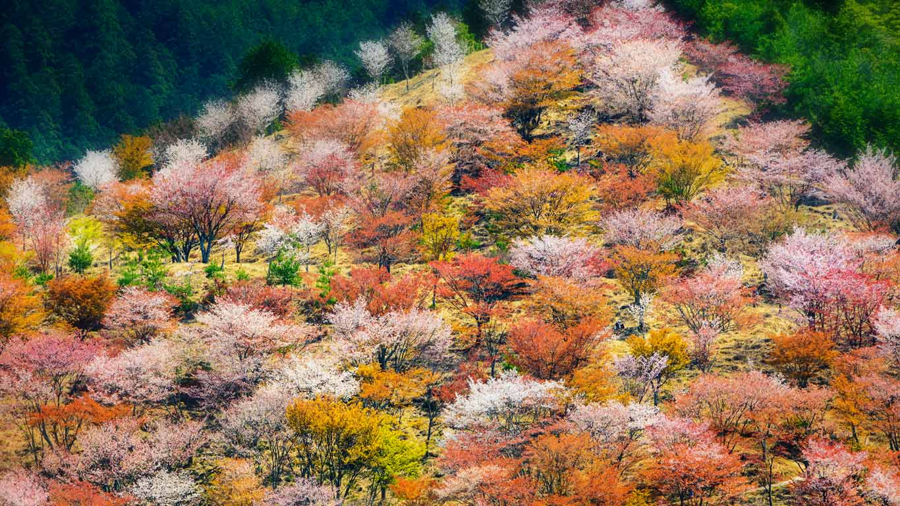

#### 20150415 Fern and gum trees in Sherbrooke Forest, Victoria, Australia (© Koolstock/MasterFile)(Bing Australia)

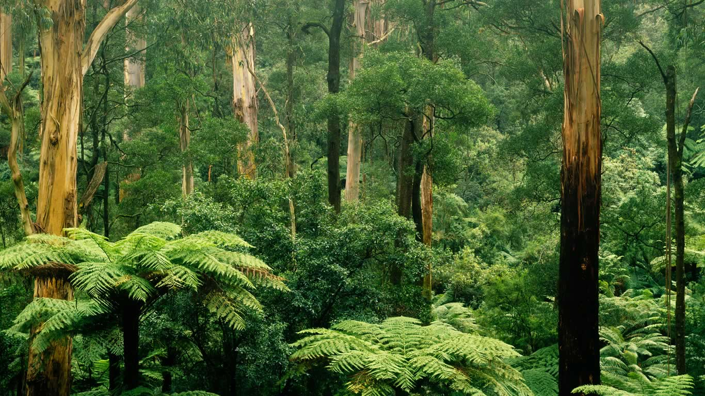

#### 20150415 Late spring on the Canal du Midi in Toulouse, Haute-Garonne, Midi-Pyrénées, France (© Yuryev Pavel/Shutterstock)(Bing United Kingdom)

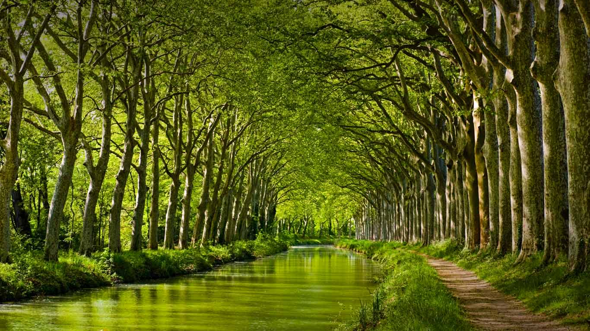

#### 20150414 Japanese robin, Yatsugatake, Nagano, Japan (© Gouichi Wada/Minden Pictures)(Bing United Kingdom)

#### 20150414 Birch trees in the fog Thunder Bay, Ontario, Canada (© Design Pics/Axiom)(Bing Canada)

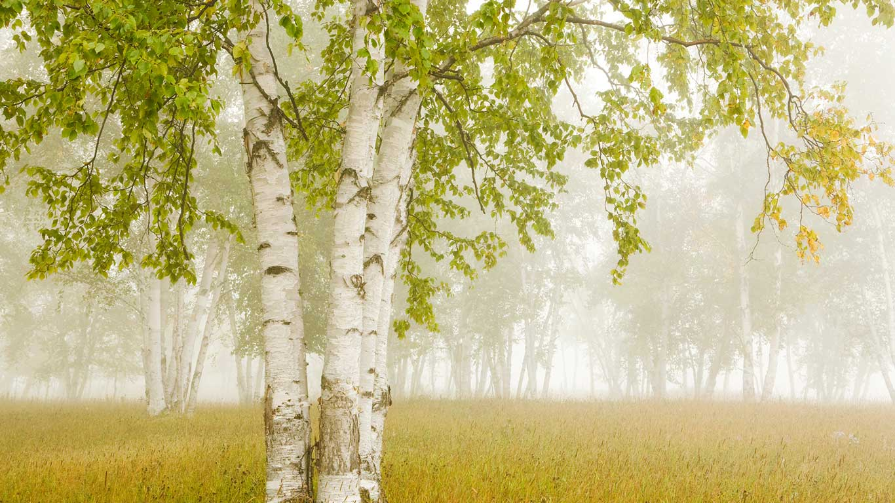

#### 20150413 Akshardham in Delhi, India  (© AirPano)(Bing United Kingdom)

#### 20150412 Carrick-a-Rede rope bridge near Ballintoy, Northern Ireland (© Chris Hill/Getty Images)(Bing United Kingdom)

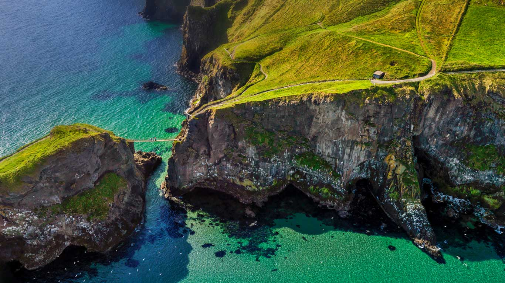

#### 20150411 ｢桜と大阪城｣大阪 (© Sean Pavone/Shutterstock)(Bing Japan)

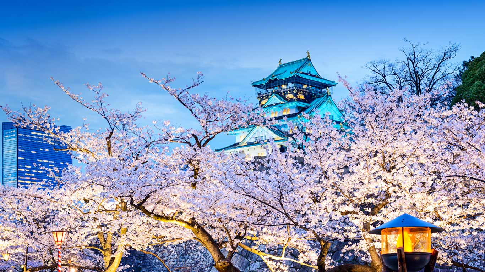

#### 20150411 冬季海滨，灯塔上空的北极光 (© RelaxFoto.de/E+/Getty Images)(Bing China)

#### 20150411 Pair of Great Crested Grebes (Podiceps cristatus) during their elaborate courtship dance (© Andrew Parkinson/Corbis)(Bing United Kingdom)

#### 20150411 Monet's water garden in Giverny, France (© Oleg Bakhirev/Shutterstock)(Bing United States)

#### 20150410 Glaspyramide in Zwiesel, Bayern, Deutschland (© Dr. Rüdiger Hess/geo-select fotoArt)(Bing Deutschland)

#### 20150410 Black-webbed tree frogs (© Hendy MP/Solent News/REX)(Bing United Kingdom)

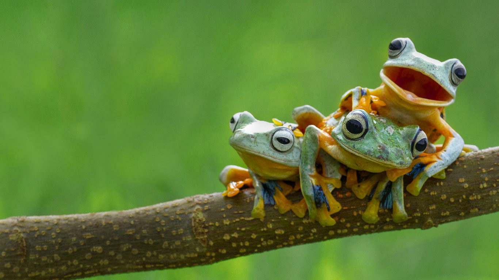

#### 20150409 Engine Room of Brunel's historic SS Great Britain at Bristol (© urbanbuzz/Shutterstock)(Bing United Kingdom)

#### 20150409 Lightning north of Perth, Western Australia (© Craig Eccles/Solent News/Rex Features)(Bing Australia)

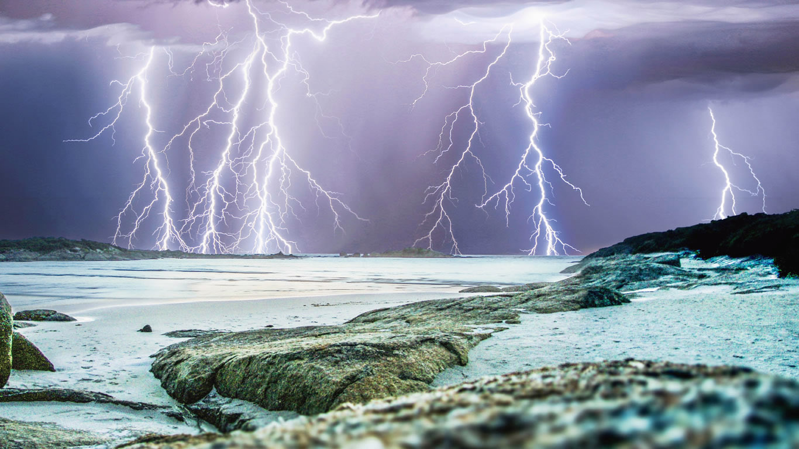

#### 20150408 Gardena Pass and the Sella Group in the Dolomites, Italy (© Shutterstock)(Bing United Kingdom)

#### 20150407 Feldhase im Frühling, Hessen, Deutschland (© Michael Breuer/Age Fotostock)(Bing Deutschland)

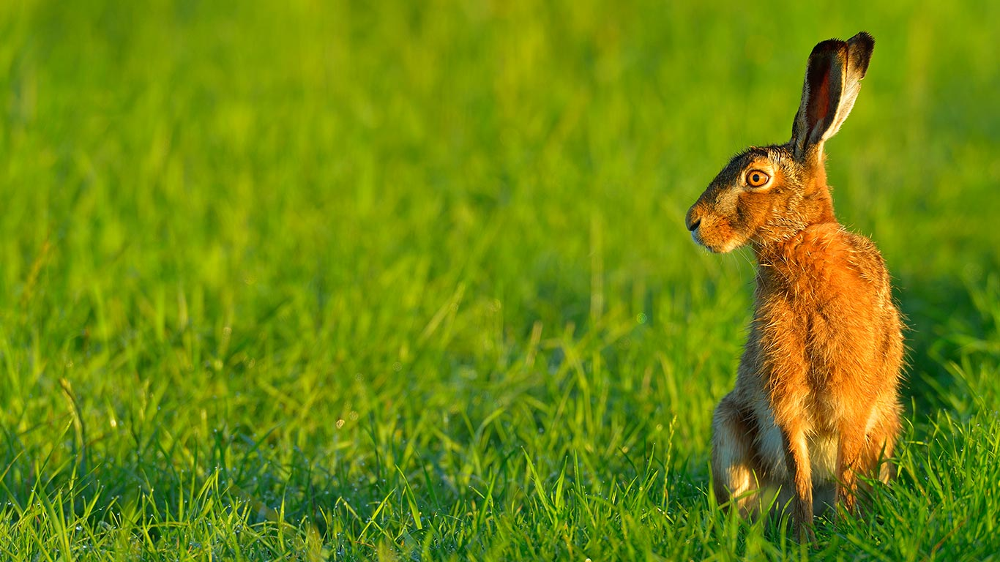

#### 20150407 Silhouetted man standing in front of multi-coloured glass windows of Montreal's Palais des Congres Montreal, Quebec, Canada (© Mark Tomalty/Axiom)(Bing United Kingdom)

#### 20150407 North American beaver in Denali National Park and Preserve, Alaska (© Yva Momatiuk & John Eastcott/Corbis)(Bing United States)

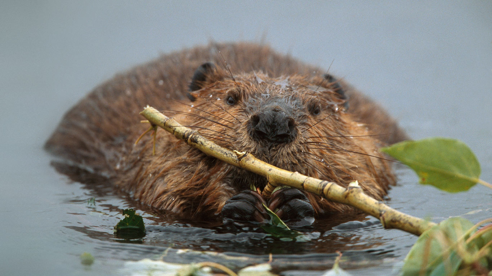

#### 20150406 画作 (© View Stock/Superstock)(Bing China)

#### 20150406 Diver in a cenote near Akumal, Mexico (© Paul Nicklen/Getty Images)(Bing United Kingdom)

#### 20150405 An osterbaum (Easter tree) in Saalfeld, Germany (© Chromorange/Alamy)(Bing United Kingdom)

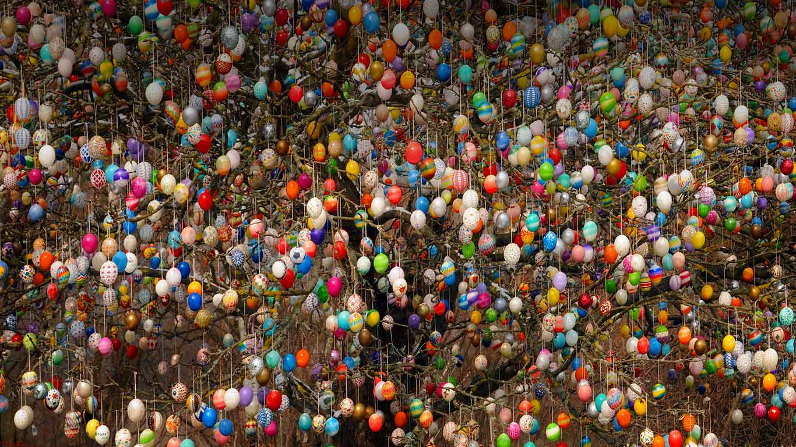

#### 20150404 Petrified wood in the Petrified Forest National Park, Arizona, USA (© Ian Shive/Tandem Stills + Motion)(Bing United Kingdom)

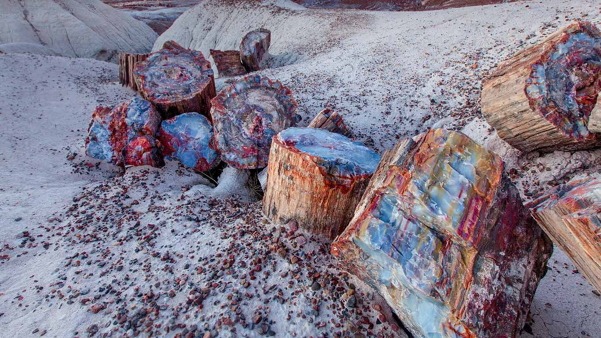

#### 20150404 Red fox mother play-fighting with kit (© Konrad Wothe/Minden Pictures)(Bing United States)

#### 20150403 High Angle View Of Lake, Akamina Ridge, British Columbia, Canada (© Design PIcs/Axiom)(Bing Canada)

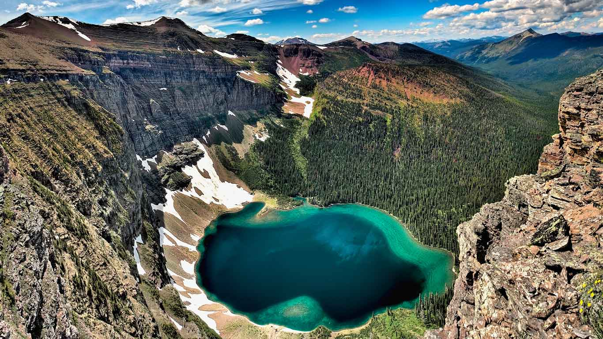

#### 20150403 Hikers on Franz Josef Glacier, New Zealand (© Keri Oberly/Aurora Photos)(Bing United Kingdom)

#### 20150402 Flood plains in the Pantanal, Brazil (© Luciano Candisani/Minden Pictures)(Bing United Kingdom)

#### 20150402 Bunda Cliffs on the Great Australian Bight, South Australia (© Oliver Strewe/Lonely Planet Images/Getty Images)(Bing Australia)

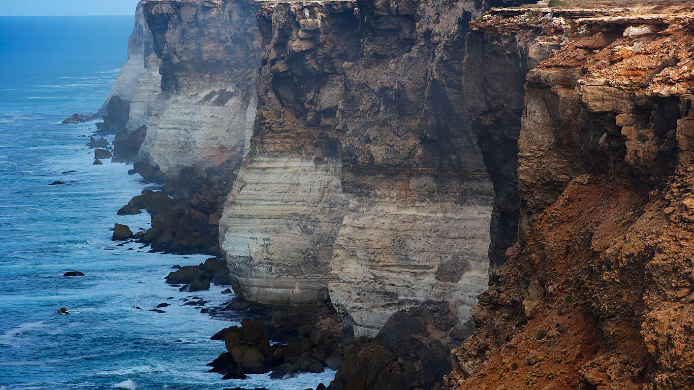

#### 20150401 Kittens in a basket (© skynesher/Creatas Video/Getty Images)(Bing United States)

#### 20150401 Bing Palm Search (© Bing.com/Superstock)(Bing United Kingdom)

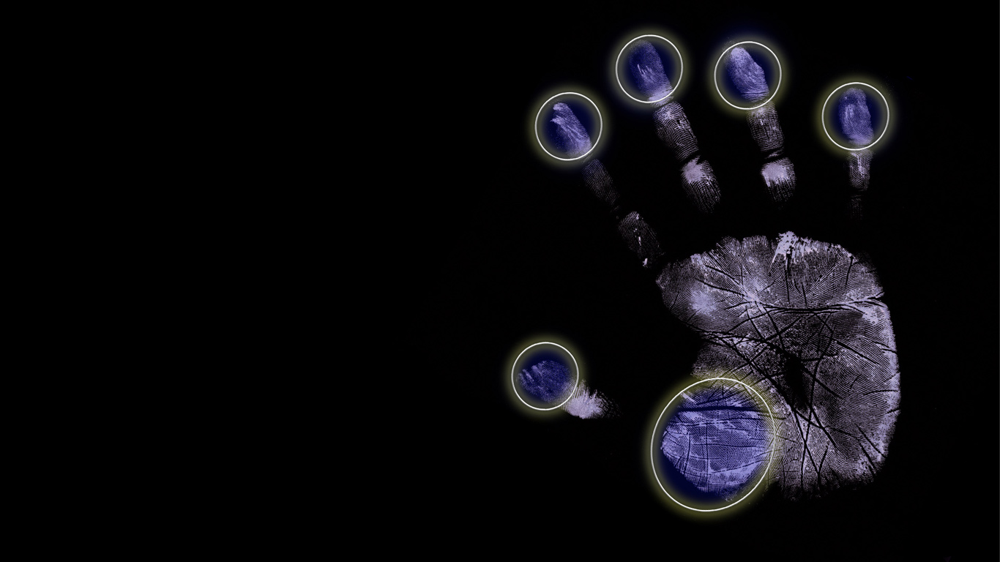

