#### 20150531 A living bridge in the East Khasi Hills district of Meghalaya, India (© Timothy Allen/Getty Images)(Bing United Kingdom)

#### 20150531 Bode-Museum und Monbijoubrücke, Museumsinsel, Berlin, Deutschland (© SIME/eStock Photo)(Bing Deutschland)

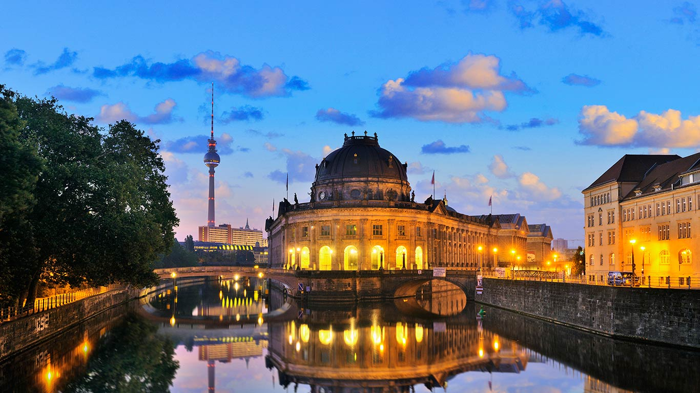

#### 20150530 Herd of impalas in Masai Mara National Reserve, Kenya (© Jonathan & Angela Scott/Getty Images)(Bing United Kingdom)

#### 20150529 Sơn Đoòng Cave in Phong Nha-Kẻ Bàng National Park, Vietnam (© Getty Images)(Bing United Kingdom)

#### 20150528 Palais du Pharo at dusk in Marseille, Provence-Alpes-Côte d'Azur, France (© Yves Andre/Getty Images)(Bing United Kingdom)

#### 20150528 Cherry orchards bloom in Mason County, Michigan (© Jeffrey Wickett/SuperStock)(Bing United States)

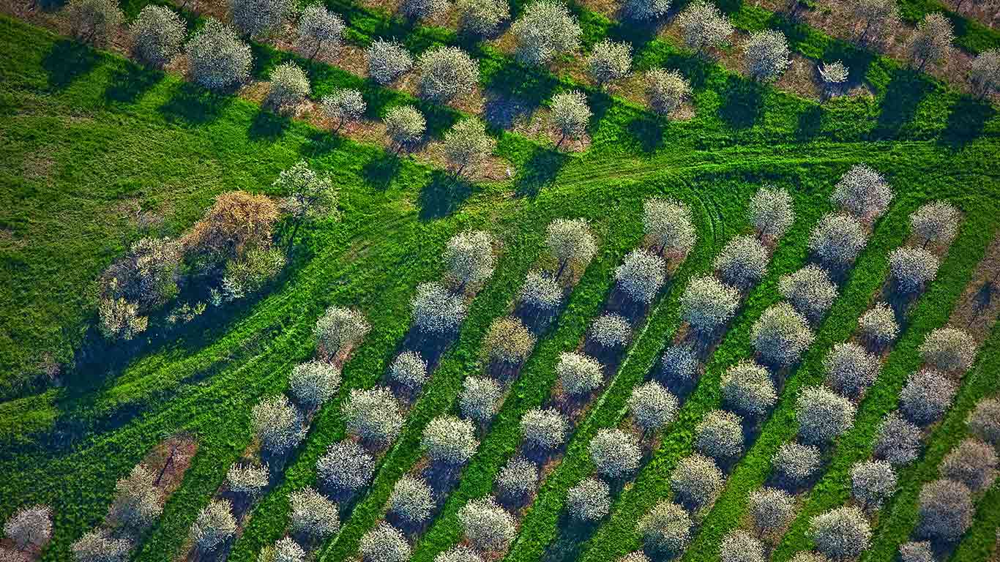

#### 20150528 上海复旦大学，邯郸路校区子彬院 (© Rong Qian)(Bing China)

#### 20150527 A fog-shrouded Golden Gate Bridge in San Francisco, USA (© Della Huff/Alamy)(Bing United Kingdom)

#### 20150526 Red-eared slider turtle (© Ammit Jack/Alamy)(Bing United Kingdom)

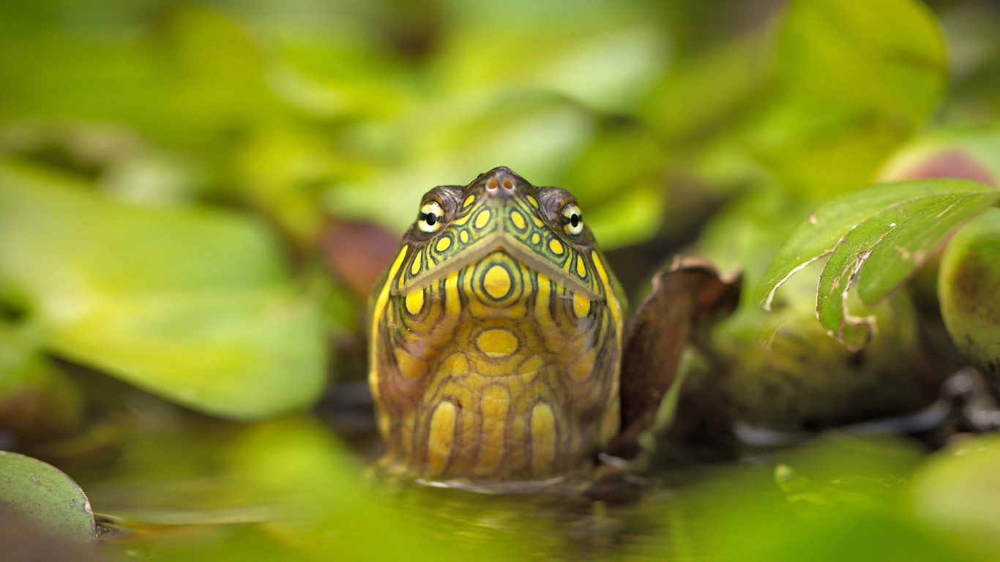

#### 20150526 Horned grebe carrying its chick (© Winfried Wisniewski/Minden Pictures)(Bing United States)

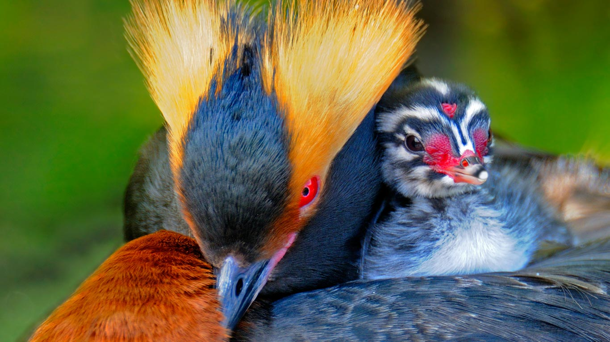

#### 20150526 Seaplane berth at blue hour, Vancouver, Canada  (© JamesChen/Shutterstock)(Bing Canada)

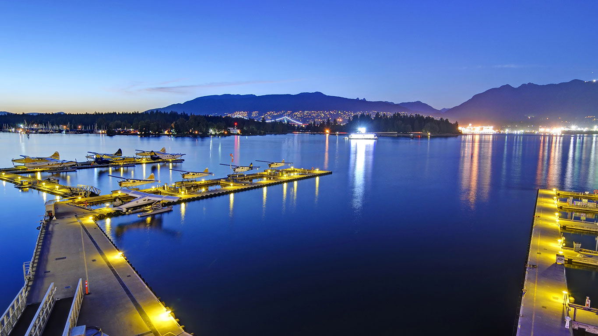

#### 20150526 Rock art at Carnarvon National Park in Queensland, Australia (© Michael Runkel/ImageBroker/Alamy)(Bing Australia)

#### 20150525 Lantern floating ceremony at Ala Moana Beach Park, Oahu, Hawaii (© Douglas Peebles Photography/Alamy)(Bing United States)

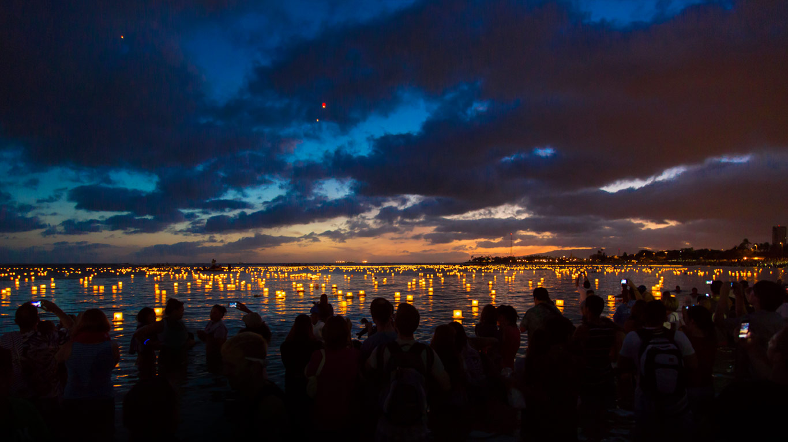

#### 20150525 Boscastle harbour on the Cornish coast of England (© BlueGreen Pictures/SuperStock)(Bing United Kingdom)

#### 20150524 Sand dune, Sossusvlei, Namibia (© Erik Joosten/Minden Pictures)(Bing United Kingdom)

#### 20150523 View to parliament building, town hall tower and statue of goddess Pallas Athene by twilight, Vienna, Austria (© Westend61/Getty Images)(Bing United Kingdom)

#### 20150523 ｢富士山と東京スカイツリー｣千葉県, 市川市 (© Masanori Yamanashi/Aflo/Corbis)(Bing Japan)

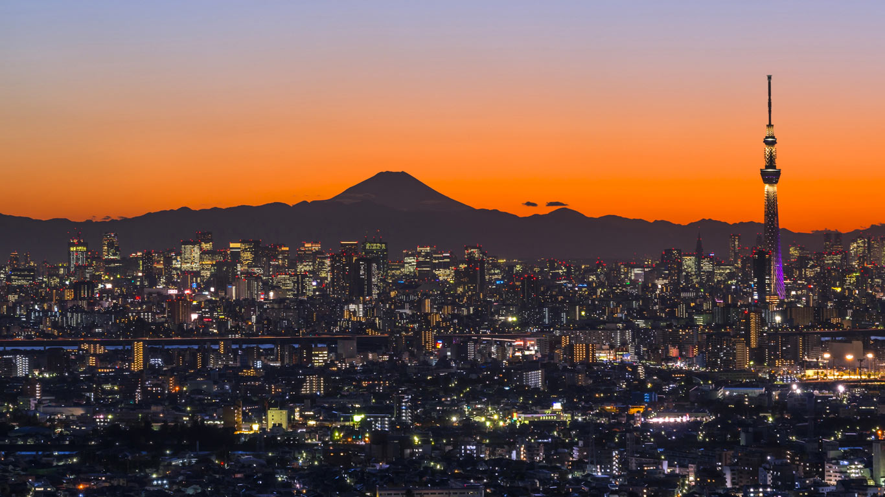

#### 20150522 Crater Lake, Oregon, USA (© Roshin Lal Ramesan)(Bing United Kingdom)

#### 20150522 美国亚利桑那州，大峡谷国家公园，科罗拉多河与大理石峡谷 (© Gavin Heffernan/Shutterstock)(Bing China)

#### 20150521 The Colorado River and Marble Canyon, Grand Canyon National Park, Arizona, USA (© Gavin Heffernan/Shutterstock)(Bing United Kingdom)

#### 20150520 Three hot air balloons flying over mountain wilderness in Canada with puffy clouds and blue sky. (© Michele Cornelius/Alamy)(Bing Canada)

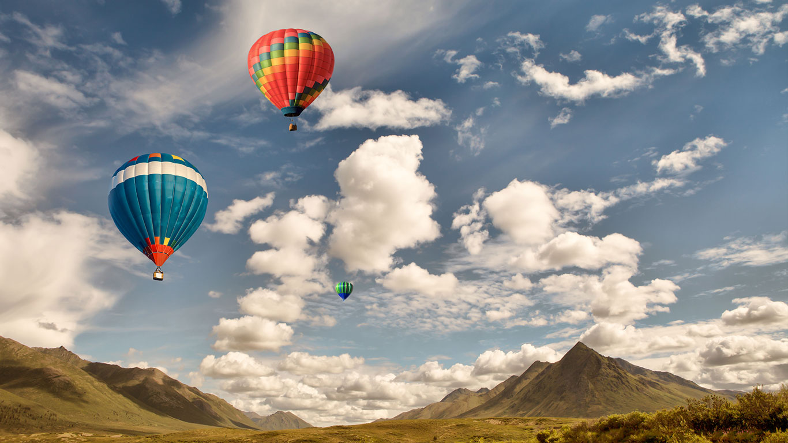

#### 20150520 Flower hat jelly (© Frans Lanting/plainpicture)(Bing United Kingdom)

#### 20150520 南极洲威德尔海，帝企鹅在暴风雪中 (© Frans Lanting/Mint Images/Getty Images)(Bing China)

#### 20150520 ｢ムラサキアミホコリ｣日本 (© Masana Izawa/Nature Production/Minden Pictures)(Bing Japan)

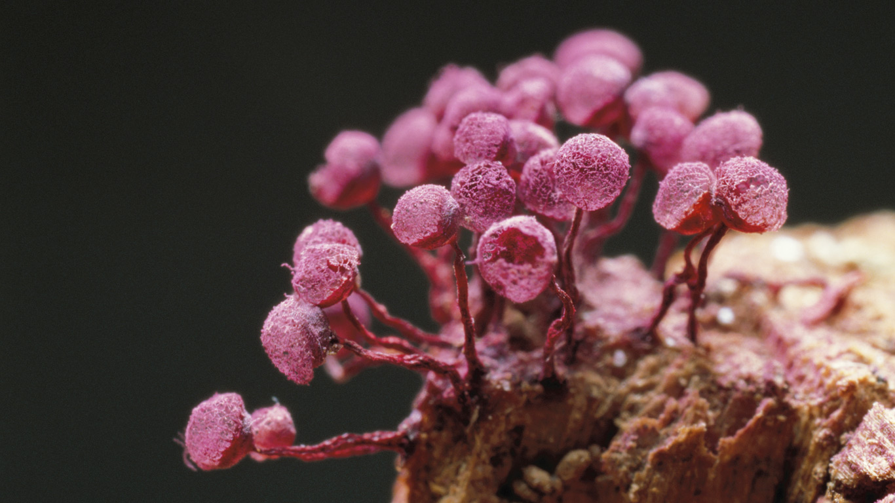

#### 20150519 Mount Saint Helens, Washington, USA (© Diane Cook and Len Jenshel/Getty Images)(Bing United Kingdom)

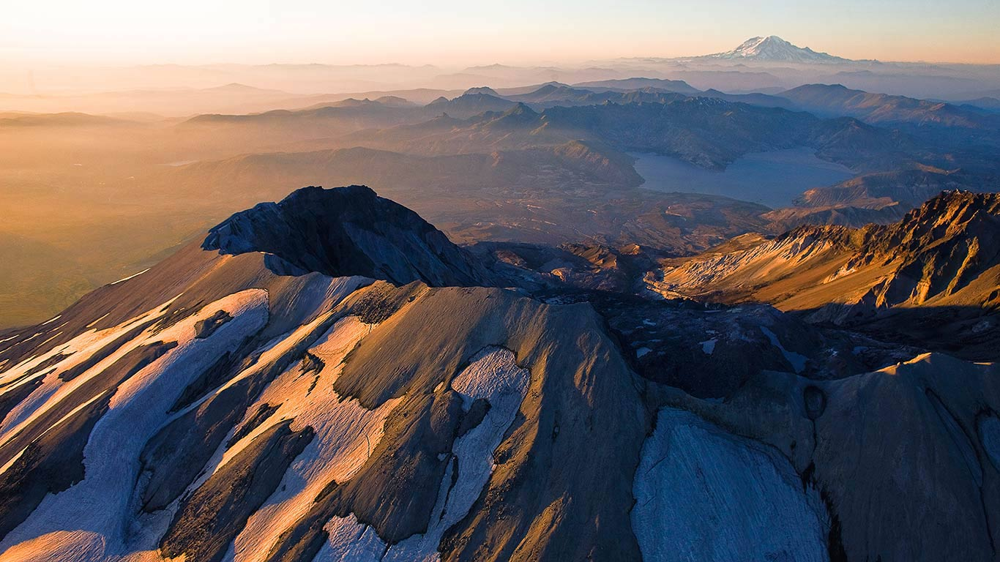

#### 20150519 香港，清晨薄雾中的狮子山 (© William C. Y. Chu/Moment/Getty Images)(Bing China)

#### 20150518 Green Bridge of Wales in Pembrokeshire Coast National Park, Wales (© Billy Stock/Corbis)(Bing United Kingdom)

#### 20150518 Central Hall of the Natural History Museum, London, United Kingdom (© John Kellerman/Alamy)(Bing Canada)

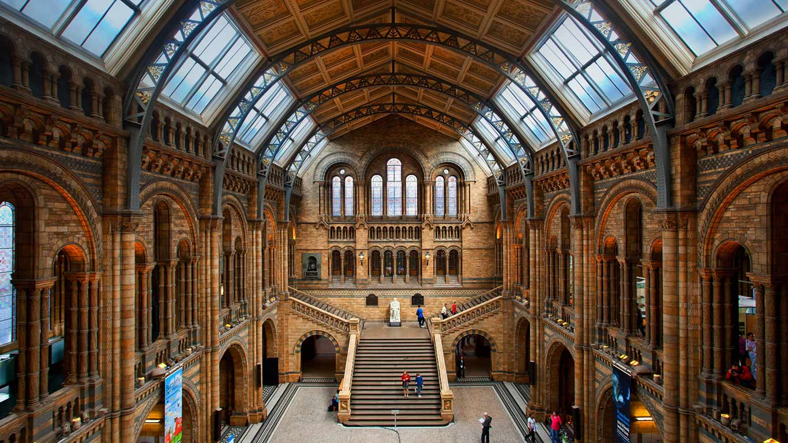

#### 20150518 美国怀俄明州，黄石国家公园，灰狼在下雪的清晨仰天长啸 (© Barrett Hedges/National Geographic Magazines/Getty Images)(Bing China)

#### 20150517 ‘Family of Menhirs' by Manolo Paz, A Coruña, Galicia, Spain (© Oscar Dominguez/Tandem Stills + Motion)(Bing United States)

#### 20150517 Houseboats at Fisherman's Wharf marina, Victoria, British Columbia, Canada (© Shaun Cunningham/Alamy)(Bing United Kingdom)

#### 20150516 两只小鸟在树枝上休息 (© Alfredo Piedrafita/RooM/Getty Images)(Bing China)

#### 20150516 Jerusalem River Waterfalls, Tasmania, Australia (© Ted Mead/Getty Images)(Bing Canada)

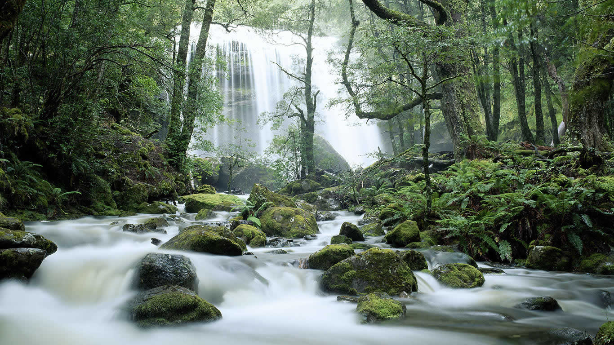

#### 20150516 US Navy F/A-18F Super Hornet creating a sonic boom (© Darek Siusta/REX)(Bing United States)

#### 20150516 Snow goose migration at the Saint-François River, Quebec, Canada (© David Doubilet/Getty Images)(Bing United Kingdom)

#### 20150515 Kirschbaum-Allee im Schlossgarten Schwetzingen, Baden-Württemberg, Deutschland (© blickwinkel/Layer/Alamy)(Bing Deutschland)

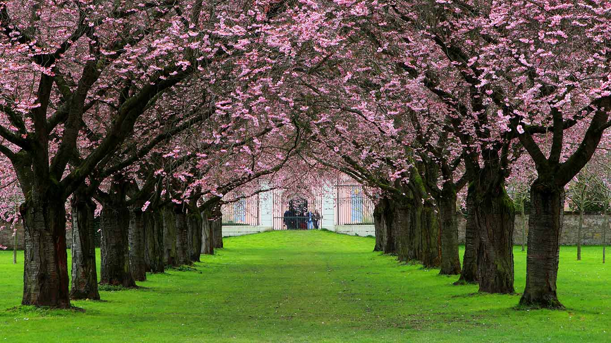

#### 20150515 Black-tailed prairie dogs in Wind Cave National Park, South Dakota, USA (© James Hager/age fotostock)(Bing United Kingdom)

#### 20150514 2009年4月3日北京，朱红墙旁的鸟儿正在享受美好的天气 (© ADRIAN BRADSHAW/EPA/Corbis)(Bing China)

#### 20150514 Archie, a Columbian mammoth specimen at the University of Nebraska State Museum in Lincoln, Nebraska, USA (© Joel Sartore/Getty Images)(Bing United Kingdom)

#### 20150513 Le Suquet, Old Town of Cannes, Alpes-Maritimes, Provence-Alpes-Côte d'Azur, France (© Sylvain Sonnet/Getty Images)(Bing United Kingdom)

#### 20150512 Marina Bay skyline in Singapore (© Martin Puddy/Getty Images)(Bing United Kingdom)

#### 20150511 Tatuamunha River estuary, Brazil (© Luciano Candisani/Minden Pictures)(Bing United States)

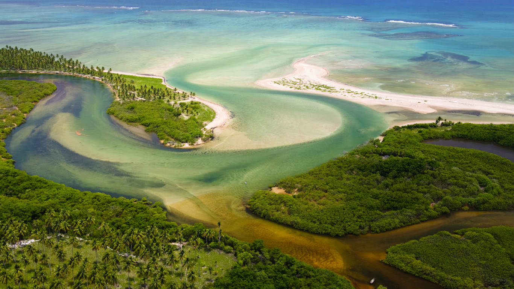

#### 20150511 Smoo Cave in Durness, Scotland, United Kingdom (© GS/Gallery Stock)(Bing United Kingdom)

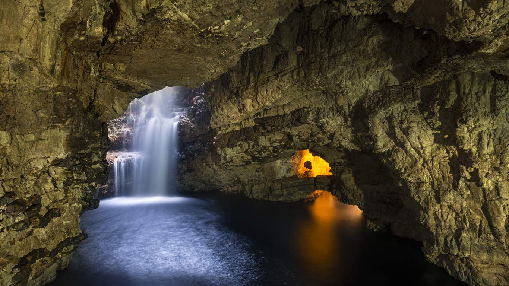

#### 20150510 Eurasian Eagle-owl (Bubo bubo) standing amongst Bluebells during rainfall, Suffolk, England (© Paul Sawer/Corbis)(Bing United Kingdom)

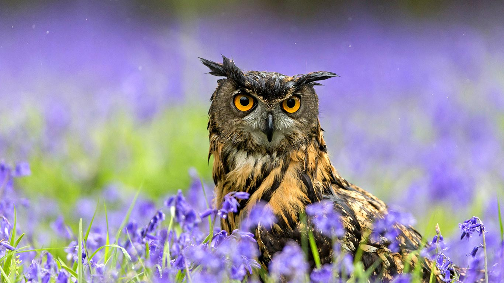

#### 20150510 Mother wolf and pup (© Ronald Wittek/age fotostock)(Bing United States)

#### 20150509 Springtime in Europe (© European Space Agency (ESA/VITO))(Bing United Kingdom)

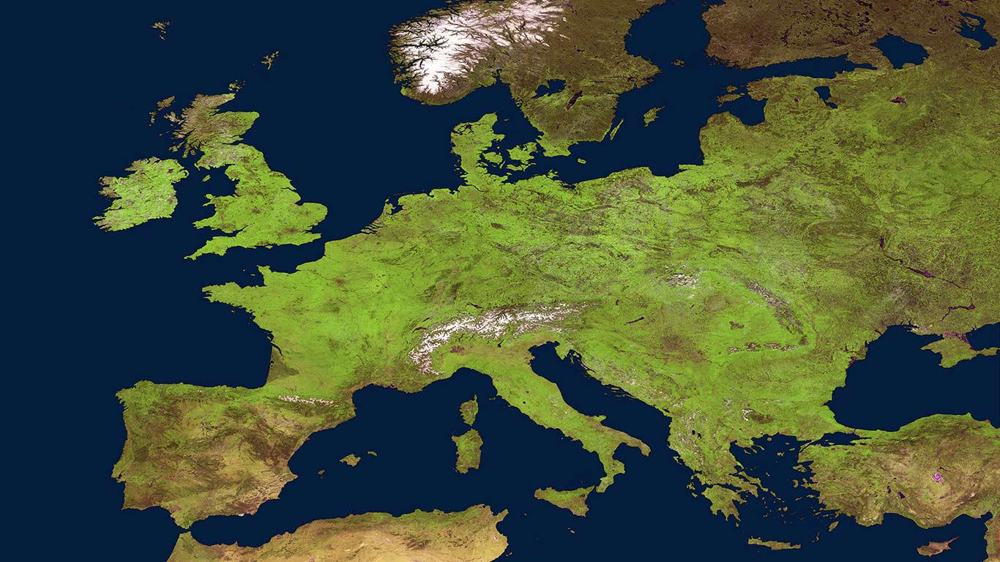

#### 20150509 Arc de Triomphe de l’Étoile à Paris, Île-de-France (© PEC Photo/Getty Images)(Bing France)

#### 20150508 Poplar trees in Po Valley, Italy (© Eddy Galeotti/Alamy)(Bing United Kingdom)

#### 20150507 莲叶 (© VIEW STOCK RF/Age Fotostock)(Bing China)

#### 20150507 10 Downing Street, Whitehall, London (© Nathan King/Alamy)(Bing United Kingdom)

#### 20150507 Mist in a valley near Bathurst in New South Wales, Australia (© Simon Critchley/Alamy)(Bing Australia)

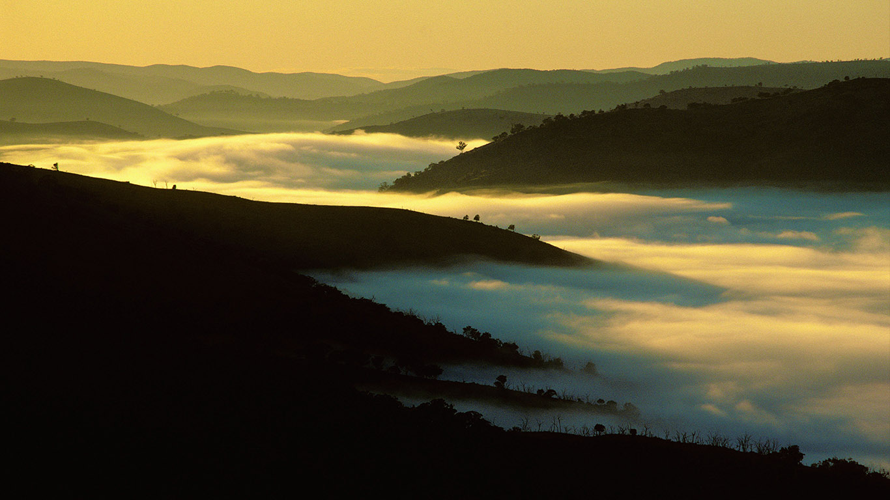

#### 20150506 ｢こいのぼり｣ (© Robert Harding Picture Library/Age Fotostock)(Bing Japan)

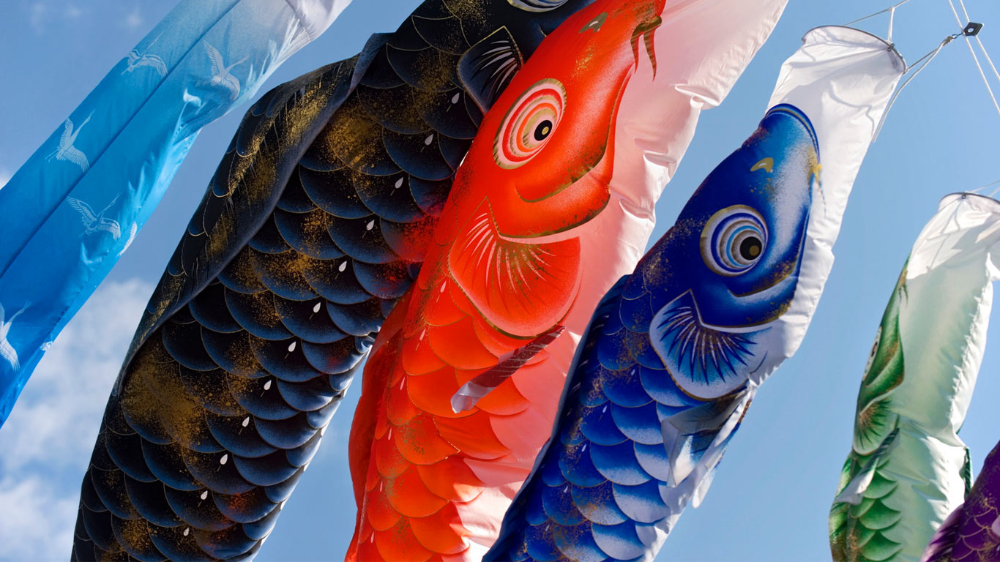

#### 20150506 Blick vom Heidelberger Schlossgarten auf die Stadt Heidelberg, Baden-Württemberg Deutschland (© Insung Choi/Tandem Stills + Motion)(Bing Deutschland)

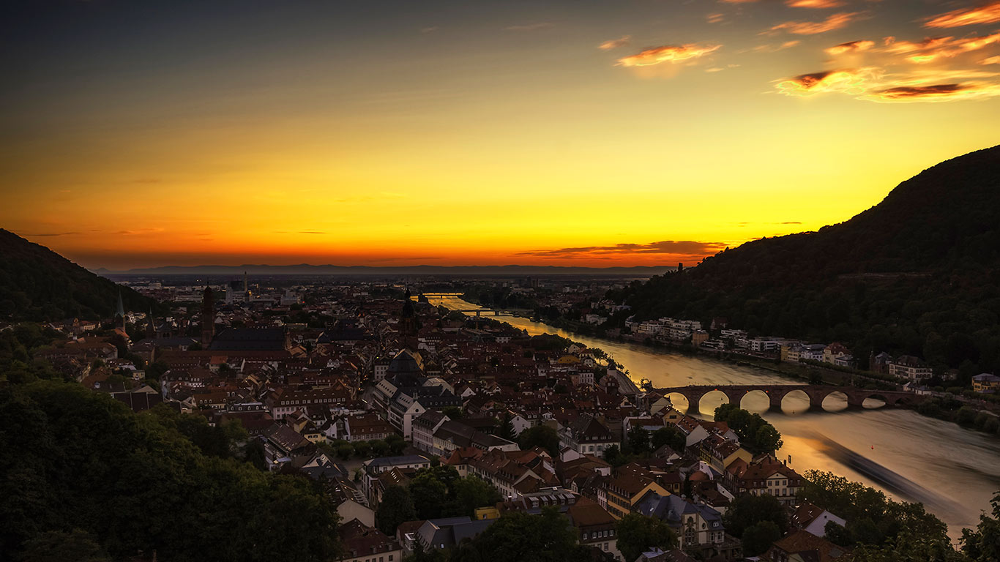

#### 20150506 North American porcupine (© Minden Pictures/SuperStock)(Bing United Kingdom)

#### 20150505 Aztec headdress detail (© Marcia Chambers/Alamy)(Bing United States)

#### 20150505 Crystal Shower Falls, Dorrigo National Park, New South Wales, Australia (© Jochen Schlenker/Masterfile)(Bing Canada)

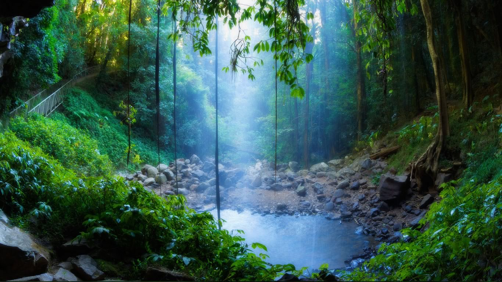

#### 20150505 Pass over the Atlas Mountains above the Dadès Gorges, Morocco (© Art Wolfe/Mint Images)(Bing United Kingdom)

#### 20150504 The Koknese Castle ruins in Koknese, Latvia (© Andrejs Zemdega/Getty Images)(Bing United Kingdom)

#### 20150503 Southern white rhinoceros mother and calf (© Theo Allofs/Masterfile)(Bing United Kingdom)

#### 20150502 Rocky shoreline in Saguenay-St. Lawrence Marine Park, Quebec, Canada (© Yves Marcoux/plainpicture)(Bing United Kingdom)

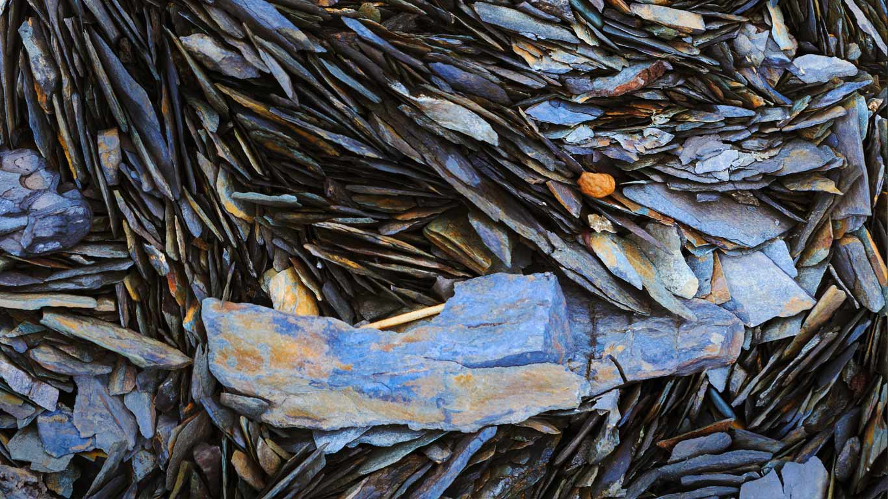

#### 20150502 Muguet de mai (© Sergey Orlov/Alamy)(Bing France)

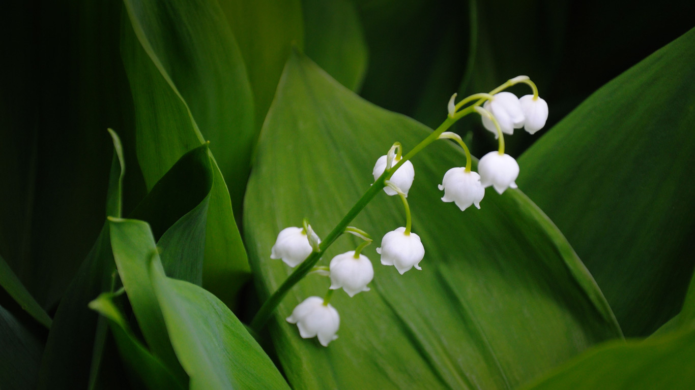

#### 20150502 四川九寨沟，游人如织 (© Vadim Petrakov/Shutterstock)(Bing China)

#### 20150501 Tulip fields in Noordoostpolder, Netherlands (© Siebe Swart/plainpicture)(Bing United Kingdom)

