#### 20150630 Eibsee, Garmisch-Partenkirchen, Bavaria, Germany (© Mattes René/Corbis)(Bing United Kingdom)

#### 20150630 Bungle Bungle Range in Purnlulu National Park, Western Australia (© James D. Morgan/Rex Features)(Bing Australia)

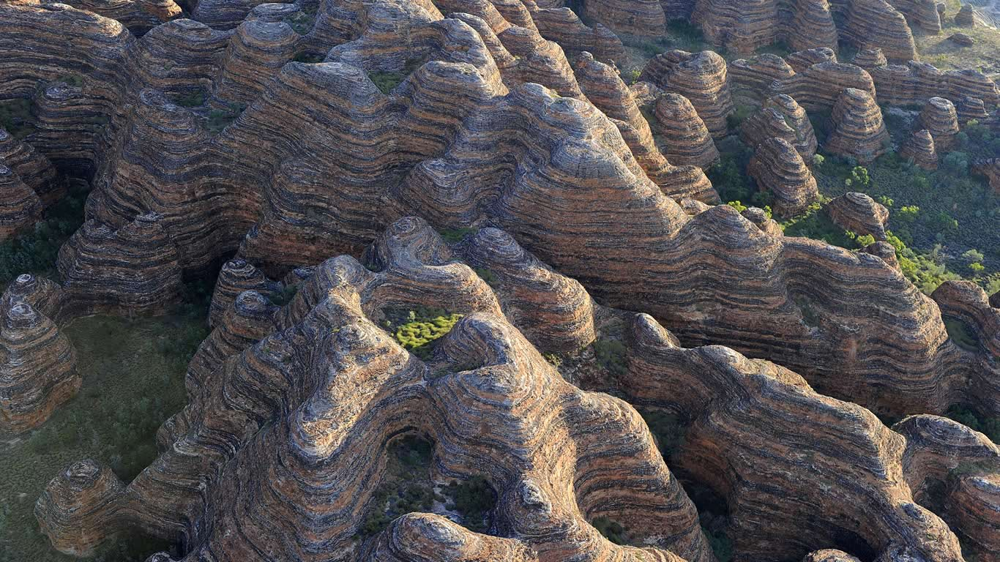

#### 20150629 Great Britain Flag made up of green tennis balls (© ecco3d/Shutterstock)(Bing United Kingdom)

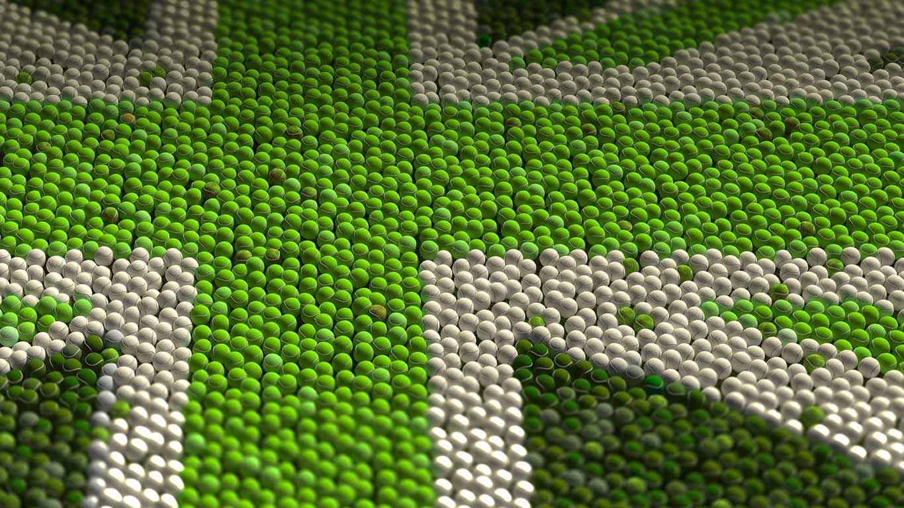

#### 20150629 White asparagus cultivation in Abensberg, Germany (© Leon Fischer/Westend61/plainpicture)(Bing United States)

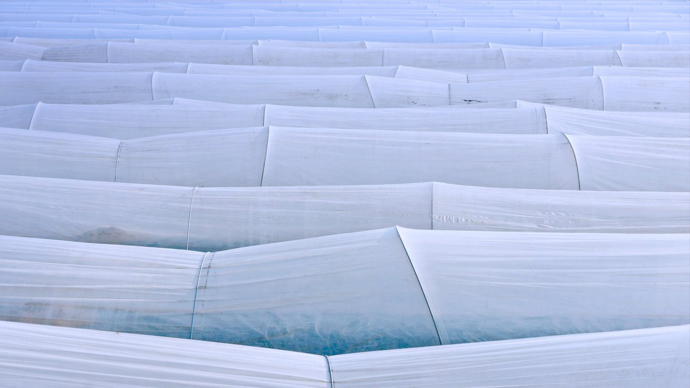

#### 20150628 Torcross, South Devon, England (© Sebastian Wasek/age fotostock)(Bing United Kingdom)

#### 20150628 Giant lobelia in Mount Kenya National Park, Kenya (© Martin Zwick/Danita Delimont)(Bing United States)

#### 20150627 Rainbow flag and clapping hands (© Navid Baraty/Moment/Getty Images)(Bing United Kingdom)

#### 20150626 Stupas in Kakku, Shan State, Myanmar (© mname/Shutterstock)(Bing United States)

#### 20150626 Playing in Cathedral magic (© Emily Bennet for the Bing Originals photo competition)(Bing United Kingdom)

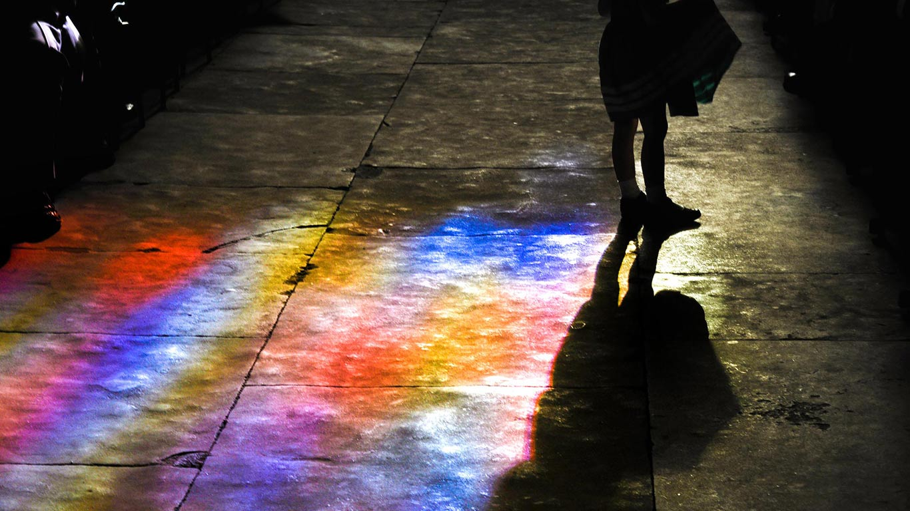

#### 20150625 Sacramento National Wildlife Refuge, California, USA (© Corbis)(Bing United Kingdom)

#### 20150624 Stained glass fleur-des-lis, Gravelbourg, Saskatewchan, Canada (© Craig Aurness/Corbis)(Bing Canada)

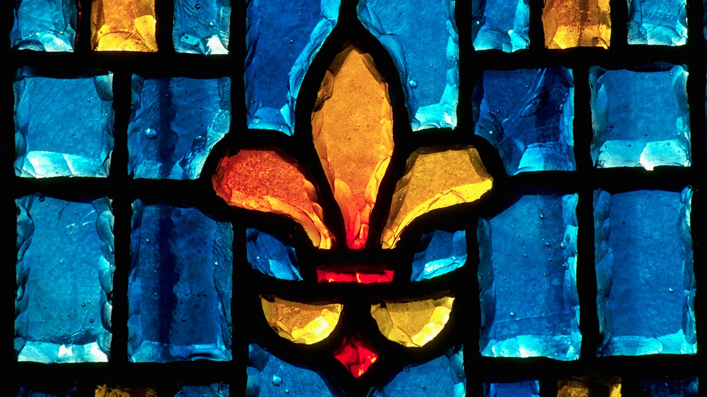

#### 20150624 Dusk at Coolangatta on the Gold Coast in Queensland, Australia (© David Wall/Alamy)(Bing Australia)

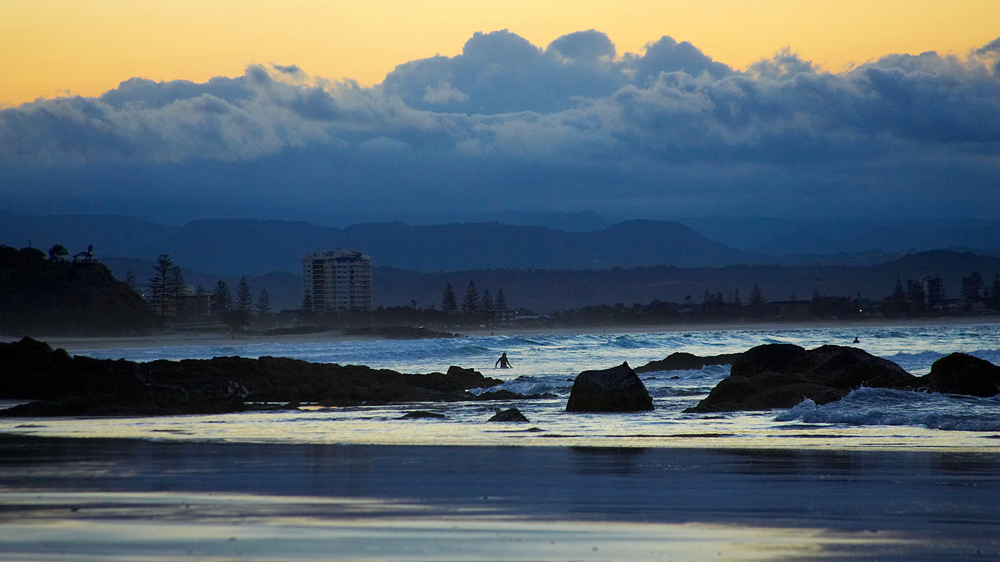

#### 20150624 Tyrrhenian Sea off the coast of Capo d'Orlando, Sicily, Italy (© Antonino Bartuccio/SIME/4Corners)(Bing United Kingdom)

#### 20150623 北京圆明园的睡莲 (© John Warburton Lee/Superstock)(Bing China)

#### 20150623 Adjder oasis near Timimoun, Algeria (© George Steinmetz/Corbis)(Bing United Kingdom)

#### 20150622 Guitare Aria de style Gibson 335 (© Claude Thibault/Alamy)(Bing France)

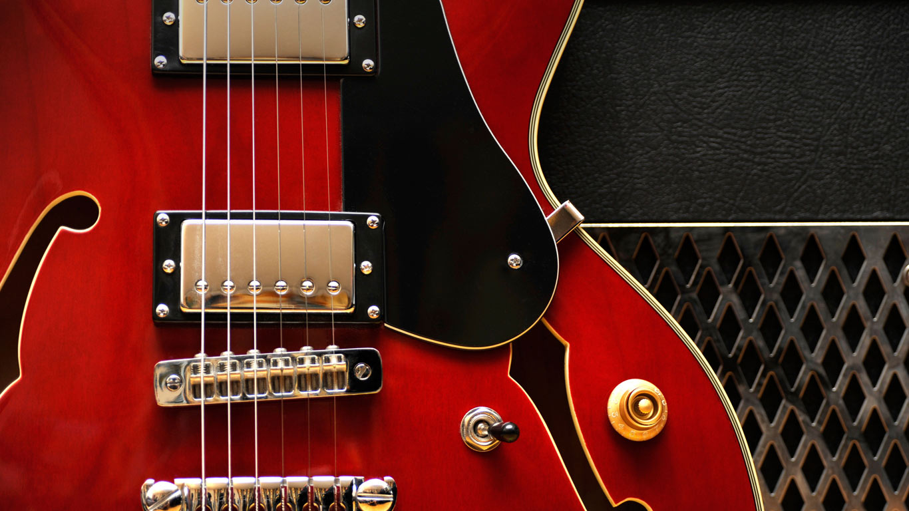

#### 20150622 Neversink Pit, Jackson County, Alabama, USA (© George Steinmetz/Corbis)(Bing United Kingdom)

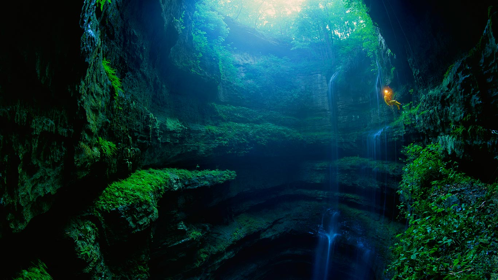

#### 20150621 Male giraffe and two calves (© Richard du Toit/age fotostock)(Bing United States)

#### 20150621 端午节 (© Pai-Shih Lee/Moment/Getty Images)(Bing China)

#### 20150621 Neolithic standing stones are the Unesco World Heritage Site in  Avebury, Wiltshire (© James Osmond/Getty Images)(Bing United Kingdom)

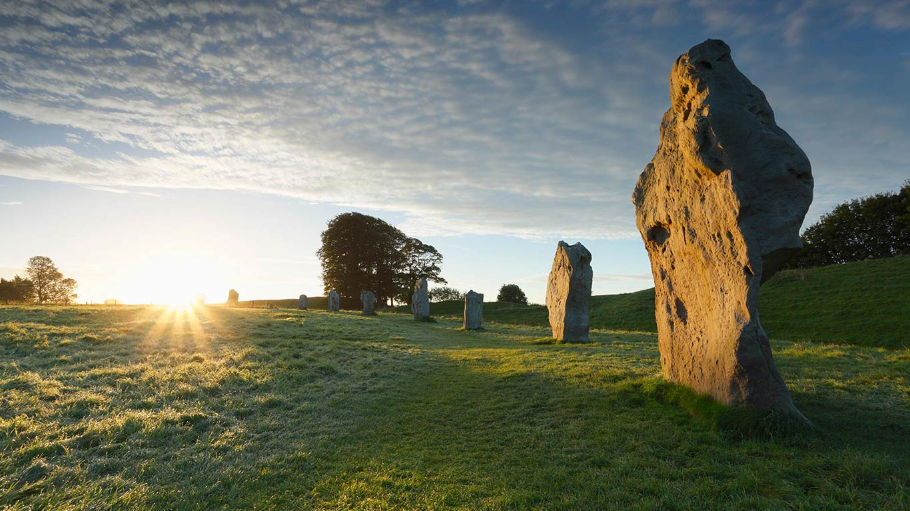

#### 20150620 Tunnel of Love in Klevan, Ukraine (© Amos Chapple/Getty Images)(Bing United Kingdom)

#### 20150619 Vue aérienne de la Butte du Lion  commémorant la bataille de Waterloo, Braine-l’Alleud, Belgique (© Jean-Philippe Van Damme/REX)(Bing France)

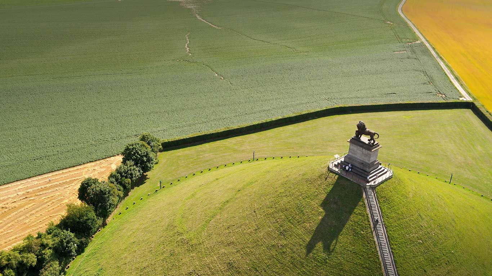

#### 20150619 Banded clinging crab and Ricordea florida coral (© Coral Morphologic)(Bing United Kingdom)

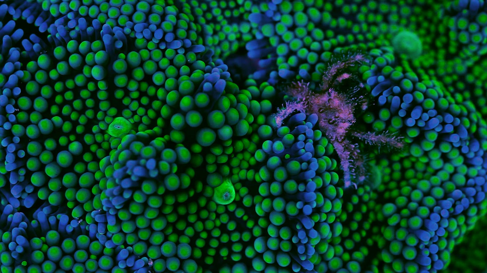

#### 20150618 A gerenuk in Samburu National Reserve, Kenya (© Paul Souders/Aurora Photos)(Bing United Kingdom)

#### 20150617 Snow gum on Razorback Ridge in Alpine National Park, Victoria, Australia (© LOOK Die Bildagentur der Fotografen GmbH/Alamy)(Bing Australia)

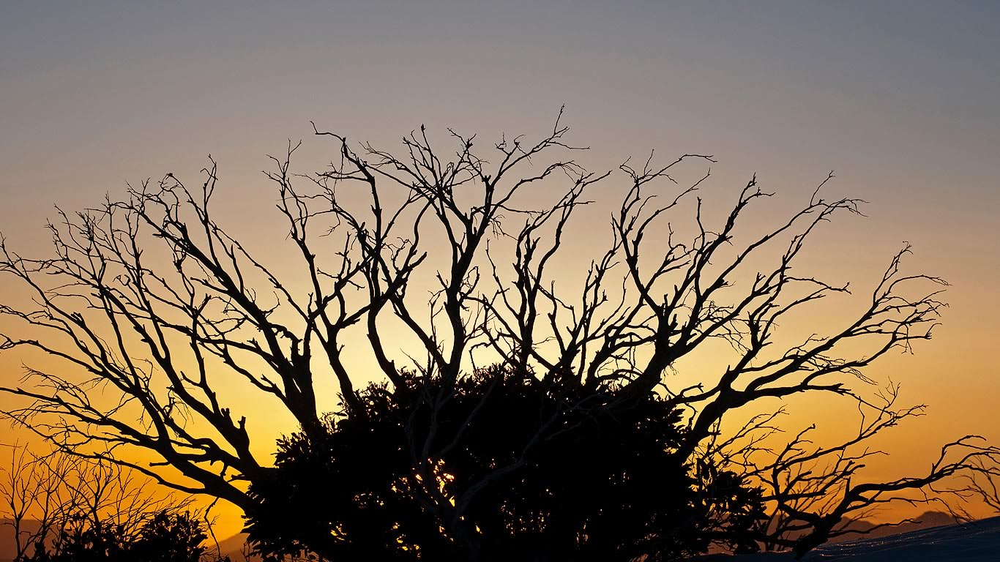

#### 20150617 ‘Olympic Iliad’ sculpture by Alexander Liberman, located in Seattle, Washington (© Muralee Raghavan)(Bing United States)

#### 20150617 Shafts of light work their way across the Borrowdale valley in the English Lake District National park (© John Finney Photography/Getty Images)(Bing United Kingdom)

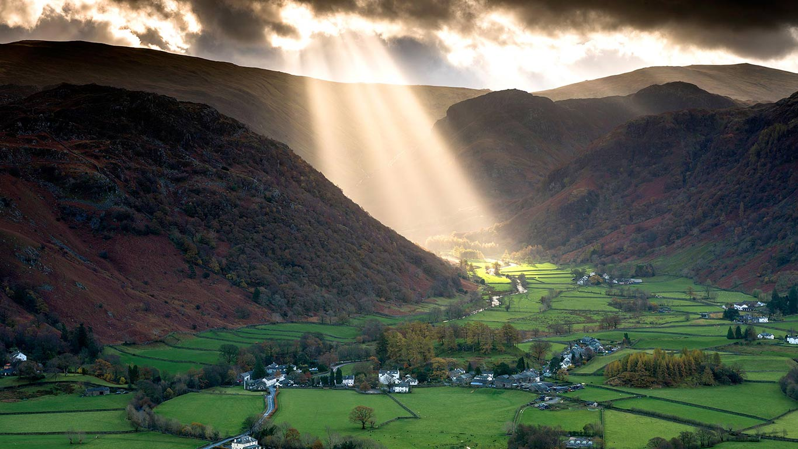

#### 20150616 The crystal grotto of Painshill, a park in Cobham, England (© Think James Photo/Gallery Stock)(Bing United Kingdom)

#### 20150615 Owens Lake in southern California, USA (© Andrei Duman/Tandem Stills + Motion)(Bing United Kingdom)

#### 20150614 Lobster traps stacked against a red fishing shed in Newfoundland, Canada (© David Kleyn/Alamy)(Bing United Kingdom)

#### 20150614 Old Glory flies over George Washington Bridge in New York City (© Russell Kord/Alamy)(Bing United States)

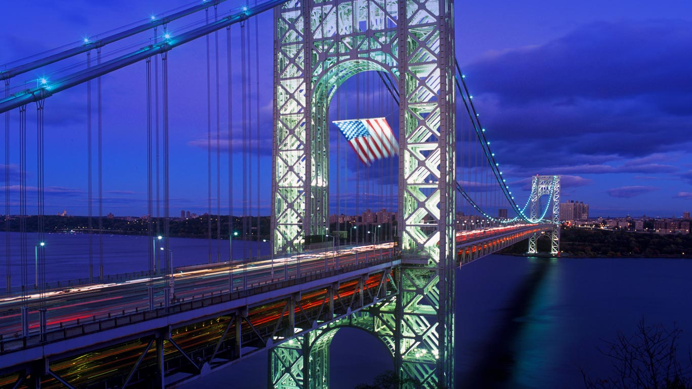

#### 20150613 Lesser flamingos on Lake Natron in Tanzania (© Art Wolfe/Alamy)(Bing United States)

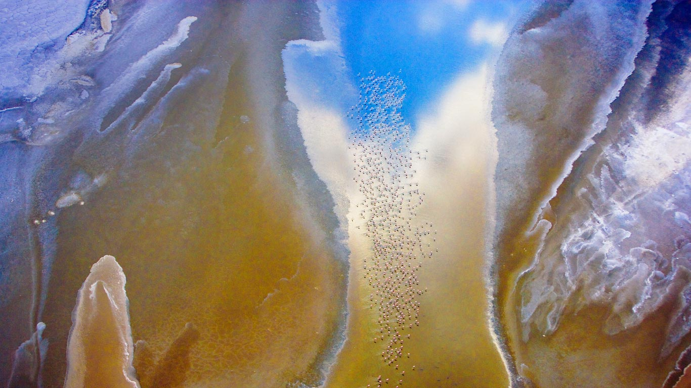

#### 20150613 Piscine naturelle de la baie d’Oro, île des Pins, Nouvelle-Calédonie (© Mako photo/Getty Images)(Bing France)

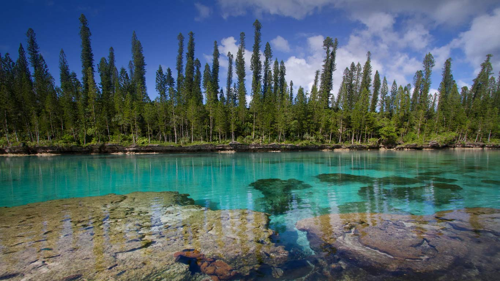

#### 20150613 Cedar Breaks National Monument, Utah, USA (© David Pinzer Photography/Corbis)(Bing United Kingdom)

#### 20150612 Macarelleta Beach, Menorca, Spain (© Michele Falzone/Getty Images)(Bing United Kingdom)

#### 20150612 ｢ヤマアジサイ｣ (© Tetsuya Tanooka/Aflo/Getty Images)(Bing Japan)

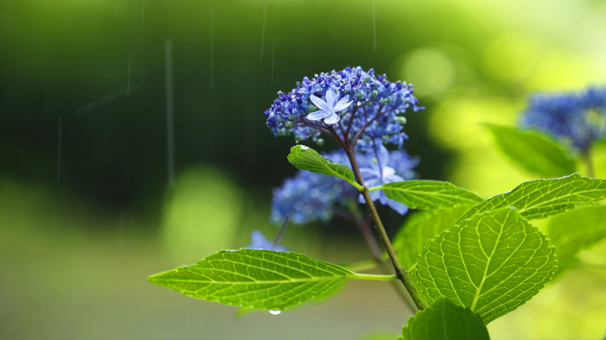

#### 20150611 Mistaya Canyon is a canyon in the western part of Alberta, Canada. (© Stas Moroz/Shutterstock)(Bing Canada)

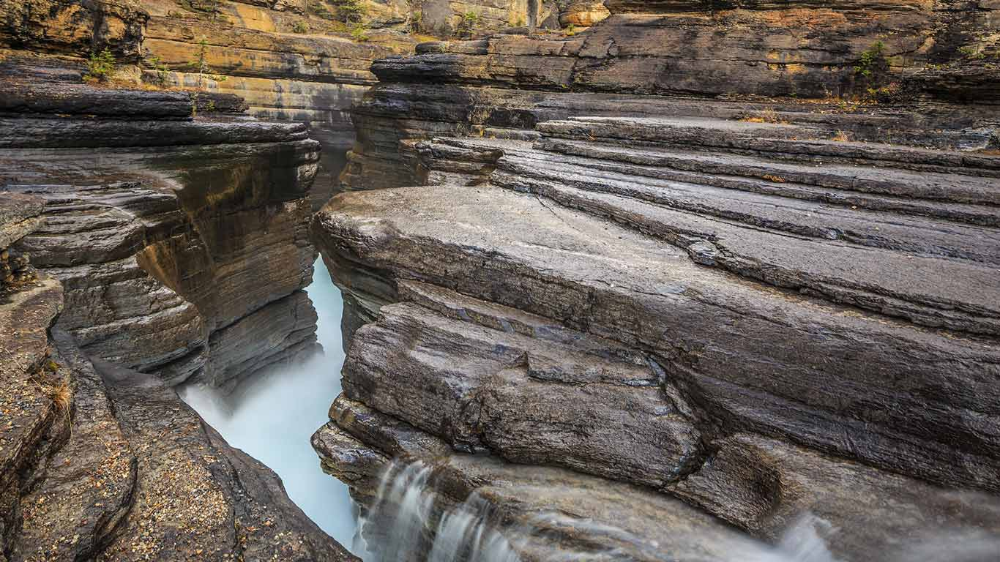

#### 20150611 Close-up detail of a giant clam near the Whitsunday Islands, Australia (© Tanya Punitt/Shutterstock)(Bing United Kingdom)

#### 20150610 Ponta do Sol, Island of Madeira, Portugal (© Mikael Svensson/Johner/plainpicture)(Bing United Kingdom)

#### 20150609 Barn owl (© Christoph Bosch/Alamy)(Bing United Kingdom)

#### 20150608 A phytoplankton bloom off the Atlantic coast of South America (© NASA)(Bing United Kingdom)

#### 20150608 Blick auf das Karwendelgebirge am Wagenbrüchsee bei Klais, Bayern, Deutschland (© Piriya Photography/Moment Open/Getty Images)(Bing Deutschland)

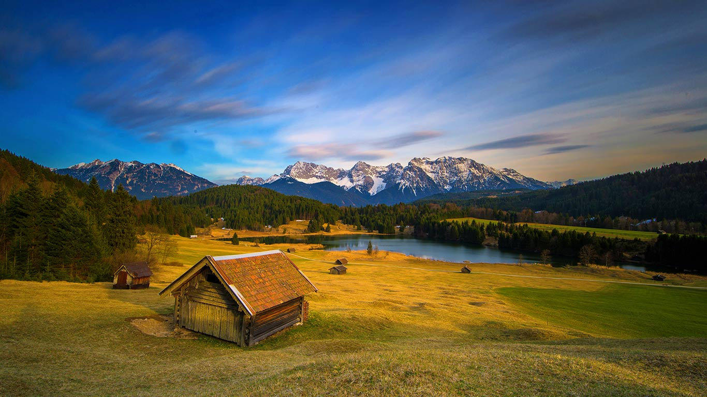

#### 20150607 Gardens at Villandry Castle, Loire Valley, France (© Emilie Chaix/Getty Images)(Bing United Kingdom)

#### 20150607 Nächtliche Luftaufnahme des Olympiastadions in Berlin (© euroluftbild.de/Vario Images/Age Fotostock)(Bing Deutschland)

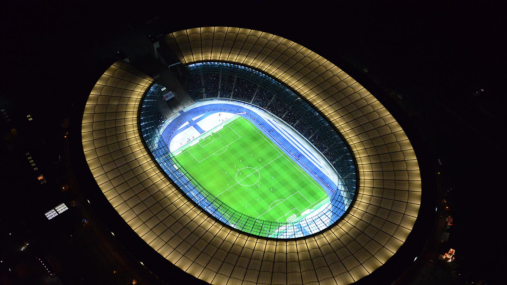

#### 20150606 Climbers ascend Mount McKinley in Denali National Park and Preserve, Alaska, USA (© Luke Humphrey)(Bing United Kingdom)

#### 20150605 Parvati River in Kasol, Himachal Pradesh, India (© SIME/eStock Photo)(Bing United Kingdom)

#### 20150605 Road to Uluru/Ayers Rock in the Northern Territory, Australia (© Martin Harvey/Photolibrary/Getty Images)(Bing Australia)

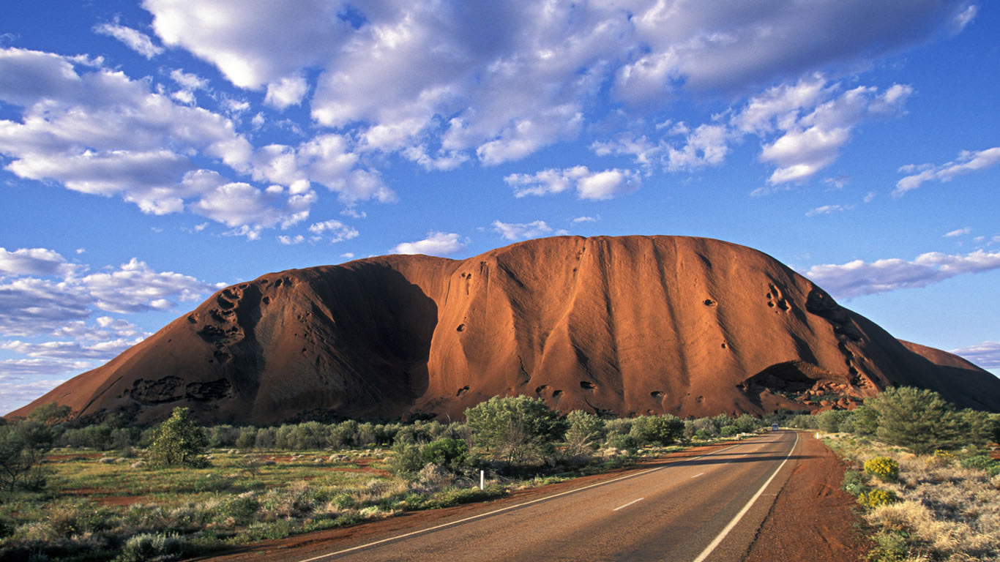

#### 20150604 Lava from Kilauea volcano in Hawaii, USA (© Toshi Sasaki/Getty Images)(Bing United Kingdom)

#### 20150603 Pont du Vénéon, parc national des Écrins, Alpes françaises (© Marco Maccarini/Getty Images)(Bing France)

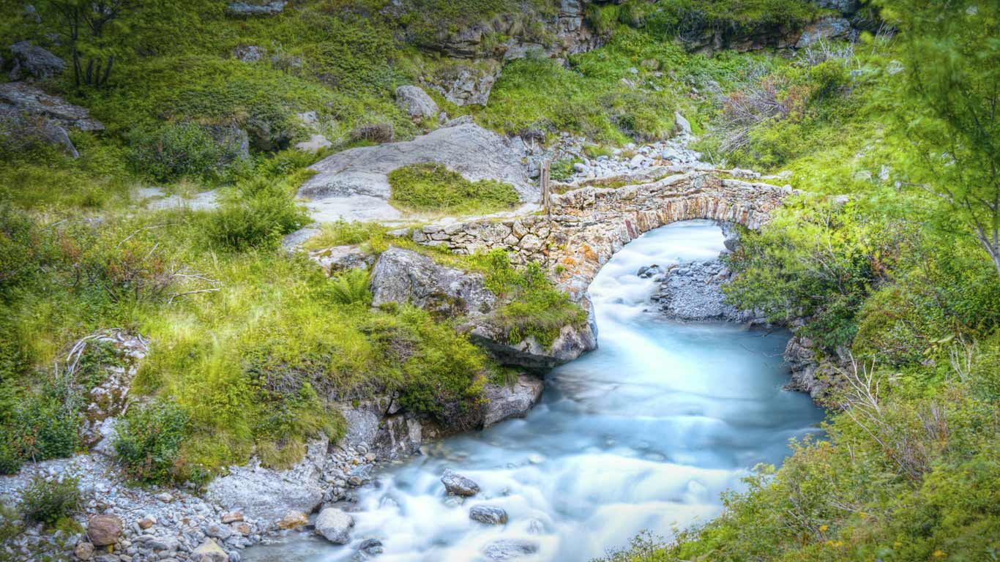

#### 20150603 Sunset on Pian Grande plateau, Perugia district, Italy (© SIME/eStock Photo)(Bing United Kingdom)

#### 20150602 Fen located near McClelland, north of Fort McMurray, Canada. (© Peter Essick/Aurora Photos)(Bing Canada)

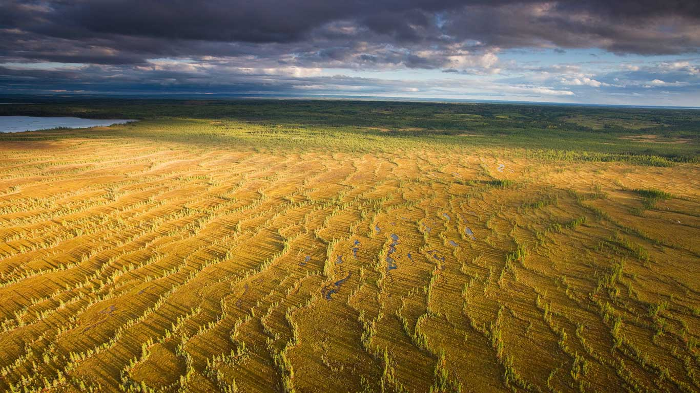

#### 20150602 Cozumel Island coati, Cozumel Island, Mexico (© Kevin Schafer/Minden Pictures)(Bing United Kingdom)

#### 20150602 上海豫园，小男孩在逗弄鱼群 (© Keren Su/Corbis)(Bing China)

#### 20150601 Atacama Large Millimeter Array (ALMA) in the Atacama desert, Chile (© Dave Yoder/Corbis)(Bing United Kingdom)

