#### 20150731 'Waterlicht' art installation at Museumplein (Museum Square) in Amsterdam, Netherlands (© Studio Roosegaarde/REX Shutterstock)(Bing United Kingdom)

#### 20150730 Wild Horse Wind and Solar Facility on Whiskey Dick Mountain, Washington (© Jim Meyers)(Bing United States)

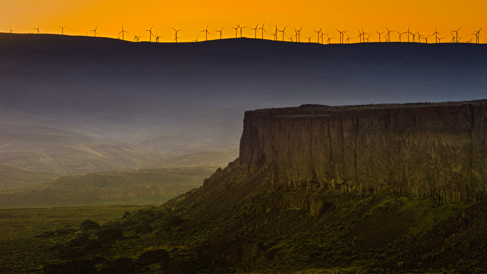

#### 20150730 View of the Florence Cathedral from the tower of Palazzo Vecchio in Florence, Italy (© Insung Choi/Tandem Stills + Motion)(Bing United Kingdom)

#### 20150729 Giant panda at Bifengxia Panda Base in Ya’an, China (© Eric Baccega/Minden Pictures)(Bing United Kingdom)

#### 20150729 Marktplatz von Goslar, Niedersachsen, Deutschland (© SIME/eStock Photo)(Bing Deutschland)

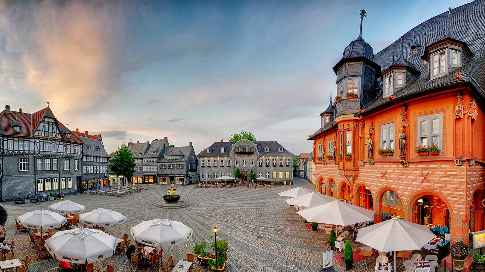

#### 20150728 Great Sandhills at sunset; Saskatchewan, Canada (© Robert Postma/Design Pics/plainpicture)(Bing Canada)

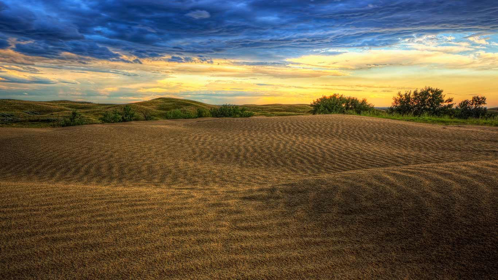

#### 20150728 Lavender field on the Valensole plateau, Provence-Alpes-Côte d'Azur, France (© Marc Trigalou/Getty Images)(Bing United Kingdom)

#### 20150728 Coledale Beach near Wollongong in NSW, Australia (© Carlo Olegario/Moment/Getty Images)(Bing Australia)

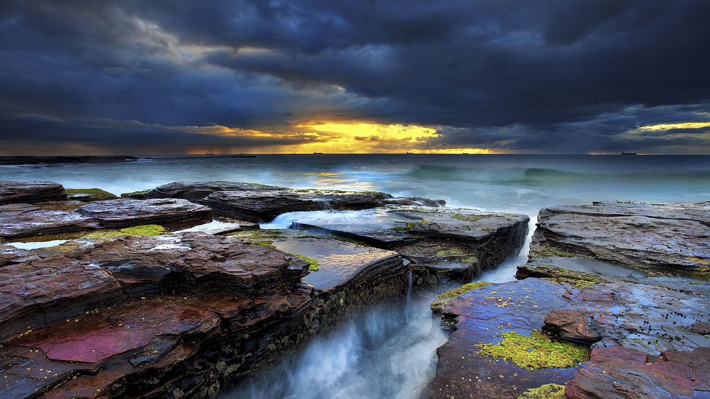

#### 20150727 A bagpiper on Arisaig beach in Scotland (© ColsTravel/Alamy)(Bing United Kingdom)

#### 20150726 Acacia trees in Lewa Wildlife Conservancy, Kenya (© Marc Muench/Tandem Stills + Motion)(Bing United Kingdom)

#### 20150725 Surface of a tomato leaf (© Steve Gschmeissner/Science Photo/Getty Images)(Bing United Kingdom)

#### 20150724 Spoon Lake, Mt. Cheam, Chilliwack, BC, Canada (© Jason Wilde/Tandem Stills + Motion)(Bing Canada)

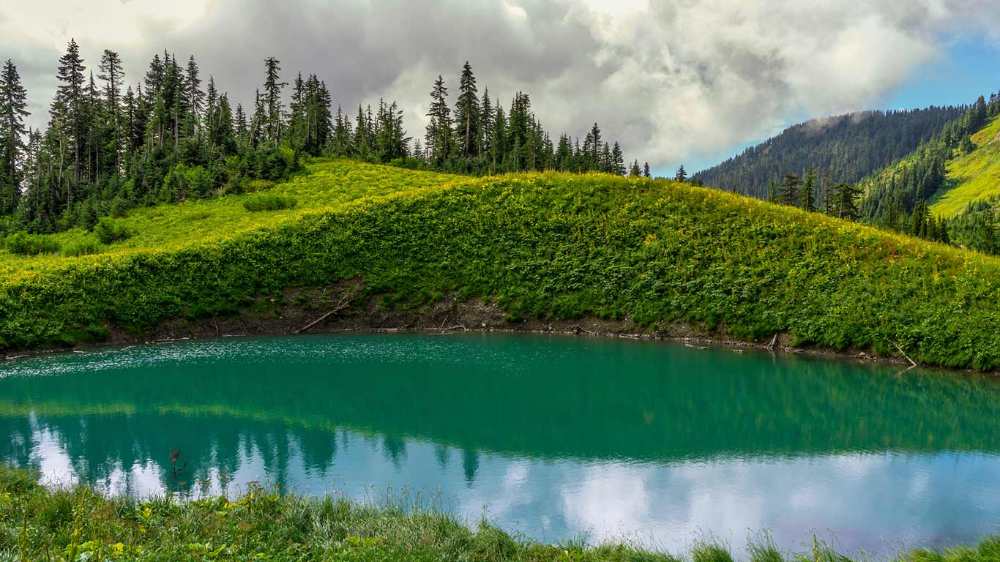

#### 20150724 Black skimmers on Cape May, New Jersey, USA (© Ingo Arndt/Minden Pictures)(Bing United Kingdom)

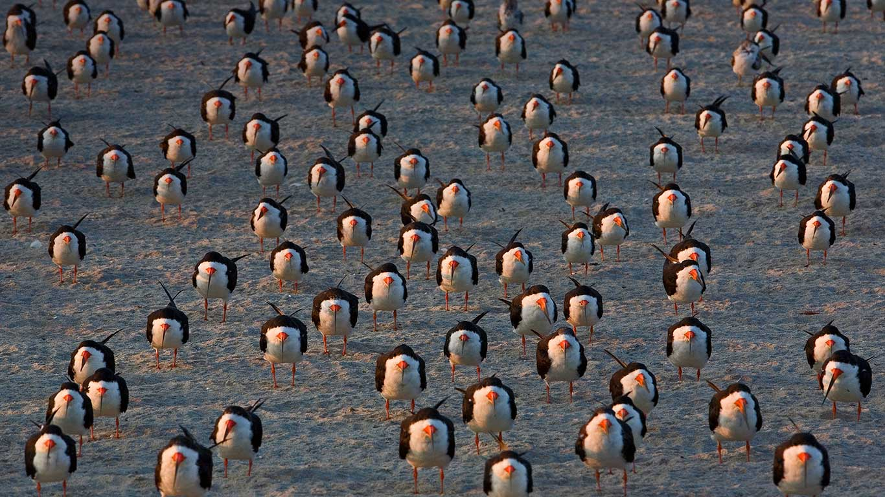

#### 20150724 舟山市海滩上的游客 (© Xinhua News Agency/Rex Features)(Bing China)

#### 20150723 Fog in Megalong Valley, New South Wales, Australia (© Andrew Peacock/Tandem Stills + Motion)(Bing Australia)

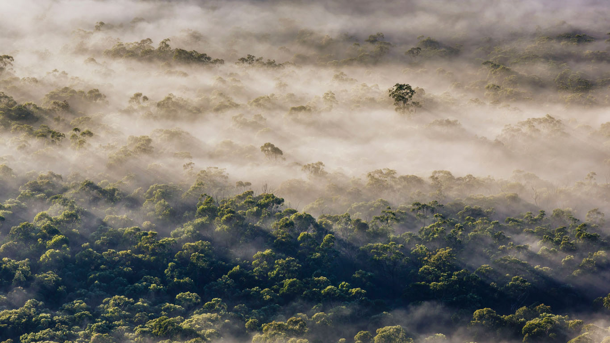

#### 20150723 Interior view of Fukuoka Tower in Fukuoka, Japan (© EQRoy/Shutterstock)(Bing United Kingdom)

#### 20150722 Humpback whales in Stephens Passage near Admiralty Island, Alaska, USA (© AlaskaStock/Masterfile)(Bing United Kingdom)

#### 20150722 ｢天橋立｣京都,  傘松公園 (© JTB Photo\UIG)(Bing Japan)

#### 20150721 Insel Rügen, Mecklenburg-Vorpommern, Deutschland (© Pete Leonard/Lithium/Age Fotostock)(Bing Deutschland)

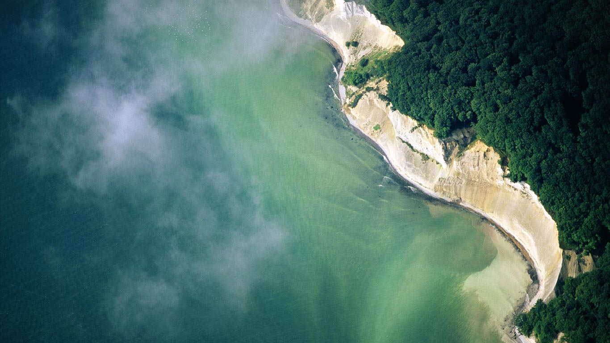

#### 20150721 Vue aérienne d’un maelstrom  dans la Baie de Somme, Cayeux-sur-Mer, Picardie (© Francis Leroy/Hemis/Corbis)(Bing France)

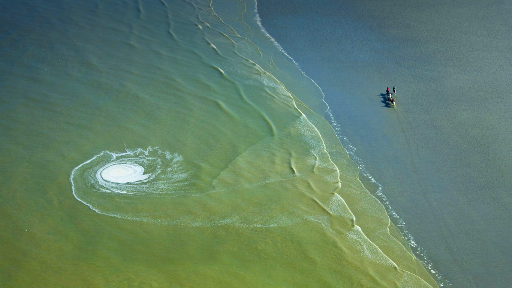

#### 20150721 Buildings in the Grand Place, Brussels, Belgium (© Charles Bowman/Corbis)(Bing United Kingdom)

#### 20150720 Natural arch at Ponta da Piedade, near Lagos, Portugal (© MedioTuerto/Getty Images)(Bing United Kingdom)

#### 20150719 Bow of the SS Great Britain, Bristol, England (© James Osmond/Alamy)(Bing United Kingdom)

#### 20150718 An organic farm in the Roztocze region of Poland (© Marek Piotrowski/Alamy)(Bing United States)

#### 20150718 Durdle Door at sunrise, Dorset, England (© Antony Spencer Photography/Getty Images)(Bing United Kingdom)

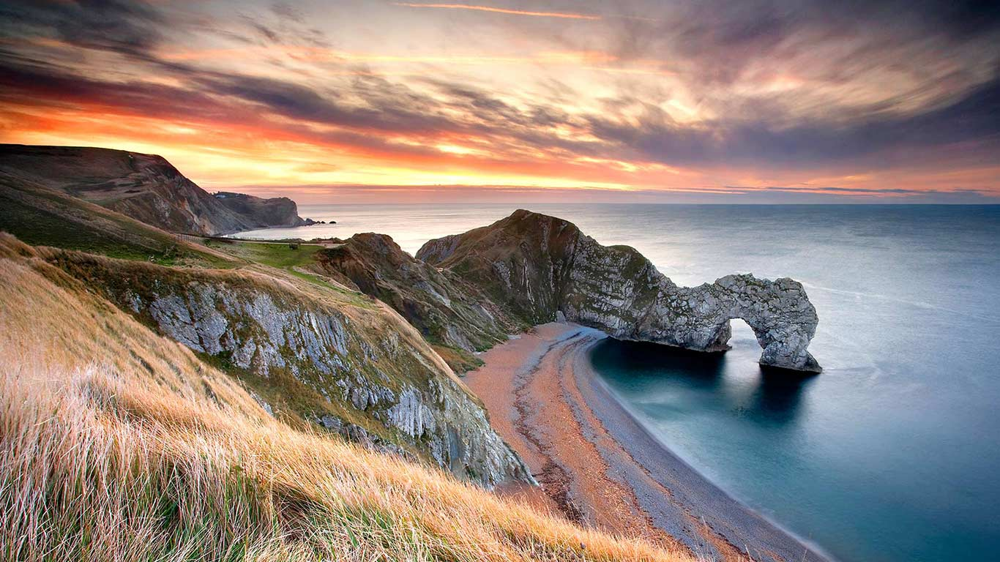

#### 20150717 Cricket balls sitting together (© Vikki Ellis/Alamy)(Bing Australia)

#### 20150717 Lake O’Hara in Yoho National Park, British Columbia, Canada (© Nelu Goia/Shutterstock)(Bing United Kingdom)

#### 20150716 Macro photograph of a blue banded bee (© Yudy Sauw/Solent News/REX)(Bing United Kingdom)

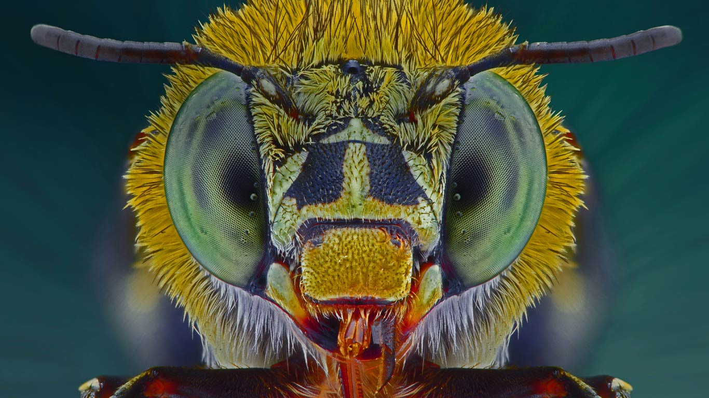

#### 20150715 False Creek and Vancouver skyline, British Columbia (© Prisma Bildagentur AG/Alamy)(Bing Canada)

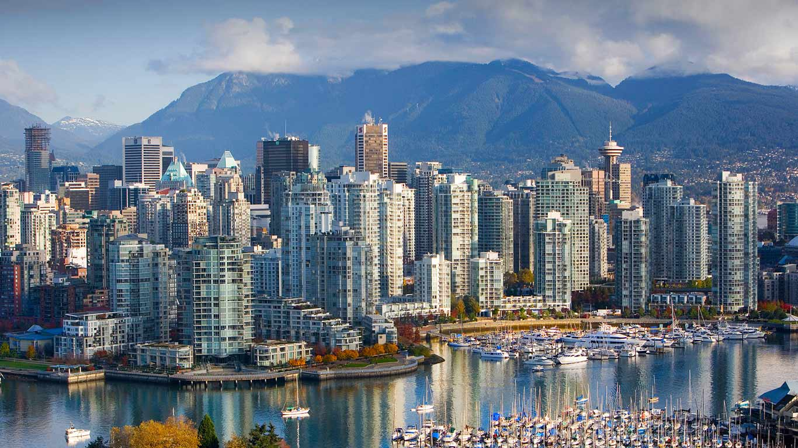

#### 20150715 Rainbow at Loch Inchard in North West Highlands, Scotland (© Westend61/Superstock)(Bing United Kingdom)

#### 20150715 Photo prise depuis la tour de la Chaîne le 14 Juillet, avec vue sur les Francofolies et le feu d’artifice, La Rochelle, Poitou-Charentes (© Sebastien Gaborit/Getty Images)(Bing France)

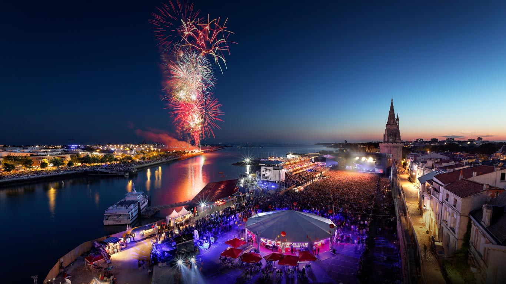

#### 20150714 Paris, France (© Liam Hammersley/Tandem Motion +Stills)(Bing United Kingdom)

#### 20150713 The beach at Coronado, California, USA (© Ted Horowitz/Corbis)(Bing United Kingdom)

#### 20150712 Moussa Castle near Deir el Qamar, Lebanon (© Zahraa Saleh/Shutterstock)(Bing United Kingdom)

#### 20150711 Aboriginal rock art in Carnarvon National Park, Queensland, Australia (© Michael Runkel/ImageBroker/Alamy)(Bing United Kingdom)

#### 20150711 Limestone formations on Lord Howe Island, Australia (© Robert Francis/Corbis)(Bing Australia)

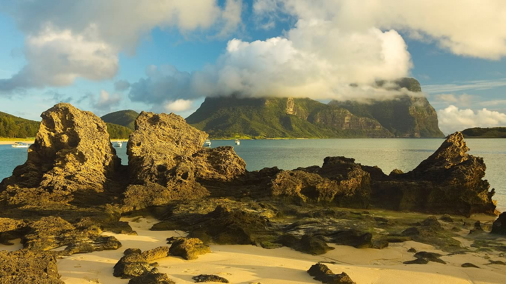

#### 20150711 Sonnenuntergang am Strand von Sylt, Schleswig-Holstein, Deutschland (© Beate Zoeliner/F1online/Age Fotostock)(Bing Deutschland)

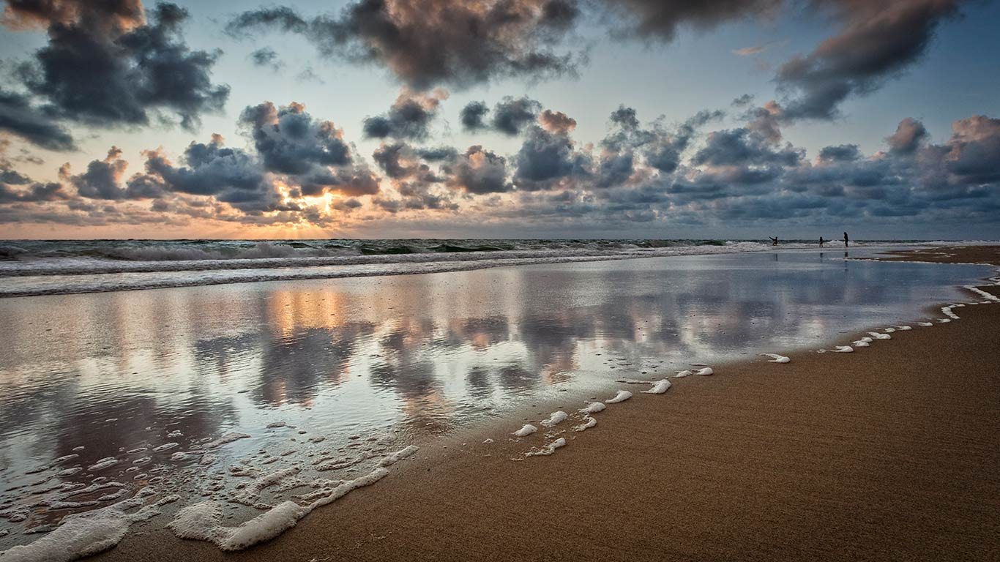

#### 20150711 Hui Hang caravan trail, crossing the border of Anhui and Zhejiang Provinces, China (© atiger/Shutterstock)(Bing United States)

#### 20150710 Mangroves in Staniel Cay, Exumas, Bahamas (© Jimmy White/Offset.com)(Bing United Kingdom)

#### 20150709 Wishbone Falls at Mount Aspiring National Park on South Island, New Zealand (© Corbis)(Bing United Kingdom)

#### 20150708 落日余晖下的山东 (© Sipa Asia/Rex Features)(Bing China)

#### 20150708 Mountain reflection in a thaw-lake in the permafrost in Tombstone Territorial Park, Yukon Territory (© Ron Erwin/All Canada Photos/Getty Images)(Bing Canada)

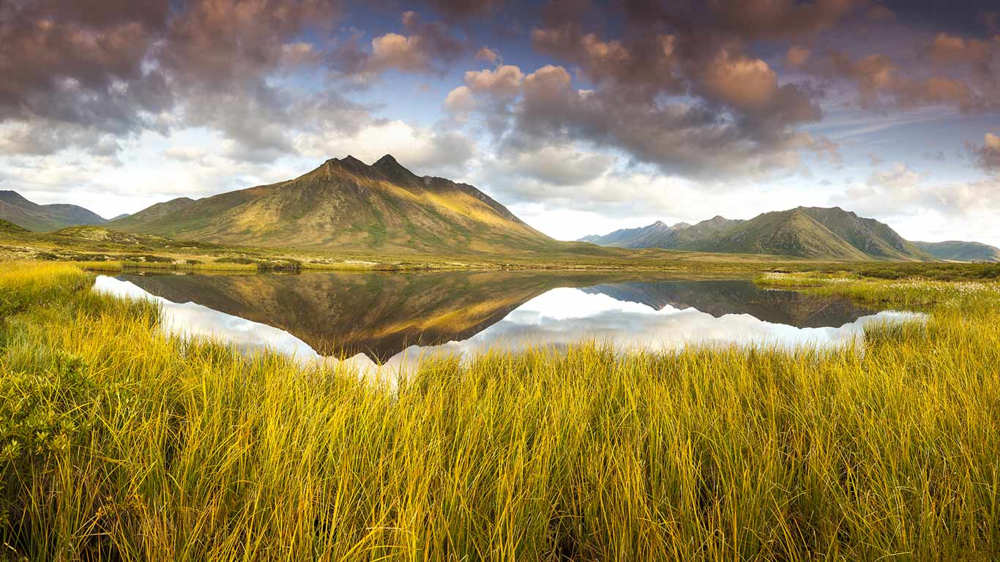

#### 20150708 ｢飛瀧神社｣和歌山, 熊野古道 (© Sean Pavone/Shutterstock)(Bing Japan)

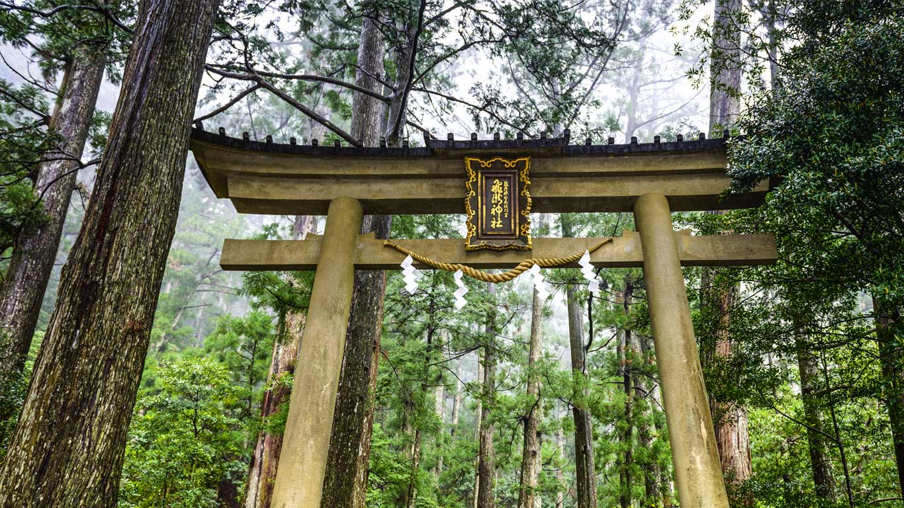

#### 20150708 Cricket balls (© Vikki Ellis/Alamy)(Bing United Kingdom)

#### 20150707 Teatro municipal, Ouro Preto, Minas Gerais, Brazil (© M&G Therin-Weise/age fotostock)(Bing United Kingdom)

#### 20150707 Kauffman Center for the Performing Arts, Kansas City, Missouri (© Dominik Zaugg/Tandem Stills + Motion)(Bing United States)

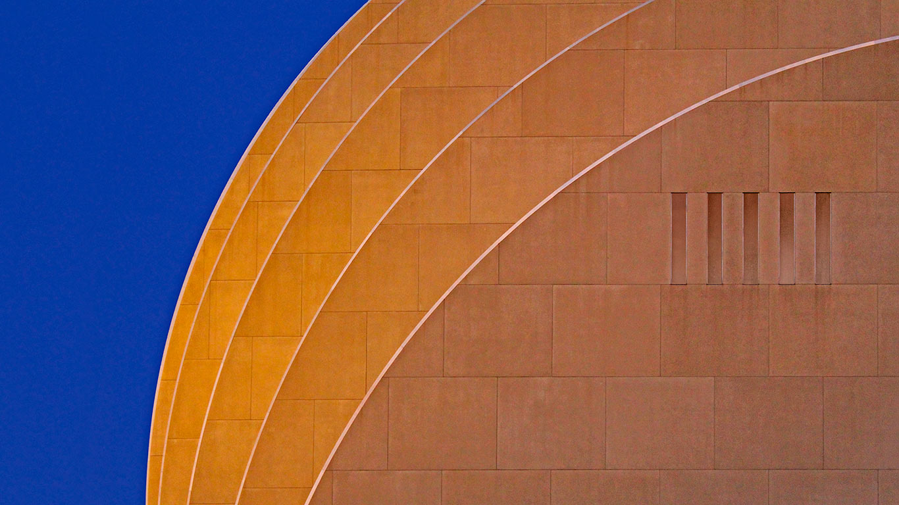

#### 20150707 Blick vom Herzogenhorn auf das Bernauer Hochtal, Bernau und die Schweizer Alpen (© Brigitte Merz/Look/Age Fotostock)(Bing Deutschland)

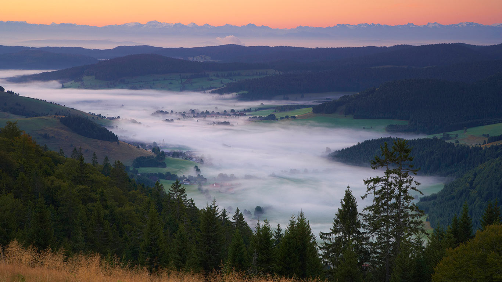

#### 20150706 Stilt fishing in Koggala, Sri Lanka (© Kimberley Coole/Getty Images)(Bing United Kingdom)

#### 20150705 The Golden Temple in Punjab, India (© Kimberley Coole/Lonely Planet Images/Getty Images)(Bing United Kingdom)

#### 20150705 Moulins à vent historiques près de Rotterdam, Pays-Bas (© Magati/Shutterstock)(Bing France)

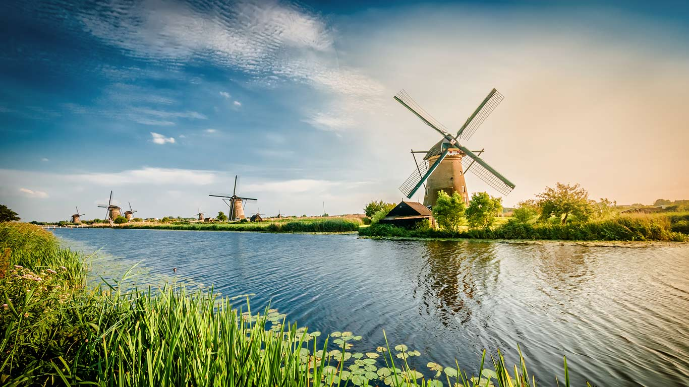

#### 20150705 Black spruce trees in Superior National Forest, Minnesota (© Jim Brandenburg/Minden Pictures)(Bing United States)

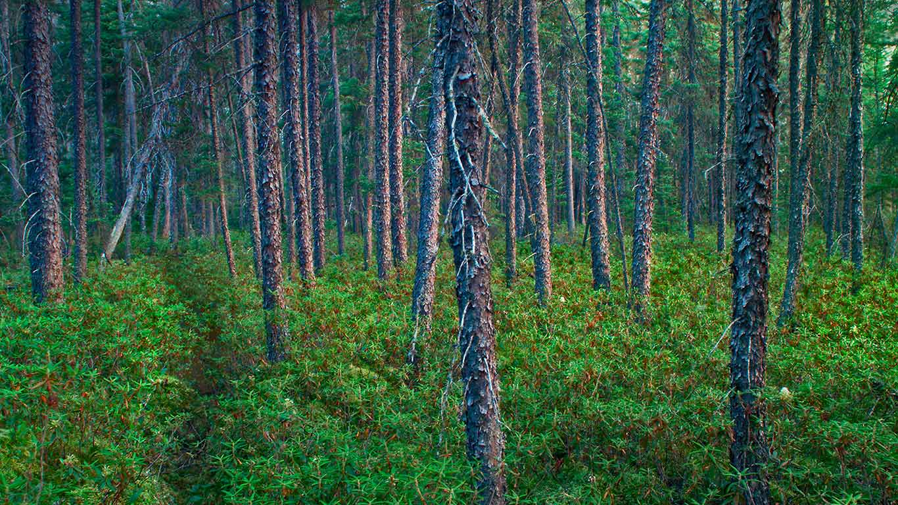

#### 20150704 Spider Rock in Canyon de Chelly National Monument, Arizona, USA (© Steve Allen/Alamy)(Bing United Kingdom)

#### 20150704 Fireworks over the Potomac River in Washington, DC (© Matt Marsala/Shutterstock)(Bing United States)

#### 20150703 A lioness at night in the Sabi Sand Game Reserve, South Africa (© Brendon Cremer/Minden Pictures)(Bing United Kingdom)

#### 20150703 ｢夜明けの富士山｣ (© Kazounori Matsuo/Moment/Getty Images)(Bing Japan)

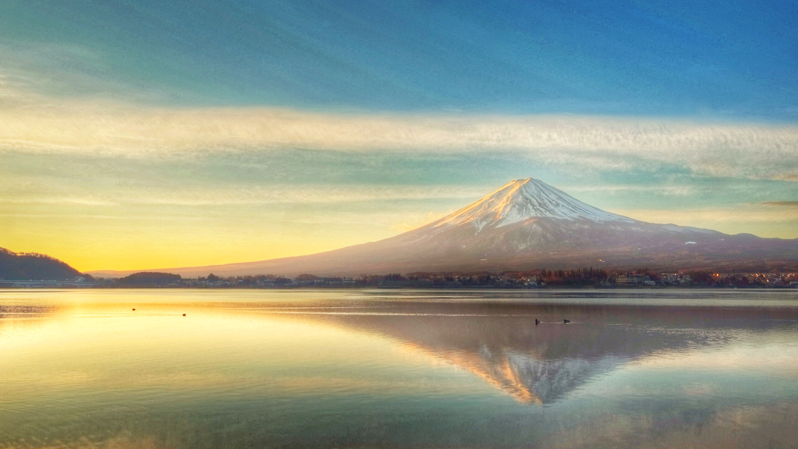

#### 20150702 Indian peacock in Yala National Park, Sri Lanka (© Kevin Schafer/Minden Pictures)(Bing United Kingdom)

#### 20150701 Numa Falls in Kootenay National Park, British Columbia, Canada (© r.classen/Shutterstock)(Bing United Kingdom)

#### 20150701 Downtown Vancouver with Canada Day Celebration fireworks (© Natalyak/Shutterstock)(Bing Canada)

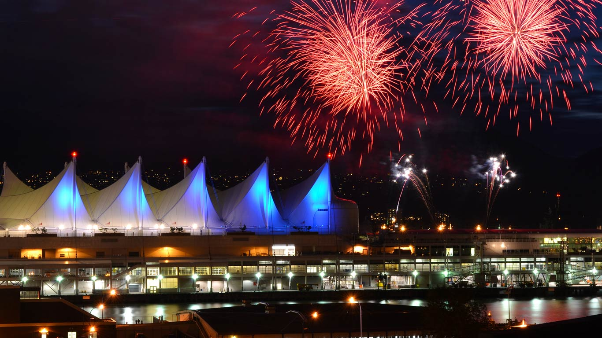

#### 20150701 鸟瞰法国卢瓦尔河地区旺代省的滨海布雷蒂尼奥勒 (© Francis Leroy/Hemis/Corbis)(Bing China)

