#### 20150831 Metropol Parasol in Seville, Spain (© Felipe Rodriquez/age fotostock)(Bing United Kingdom)

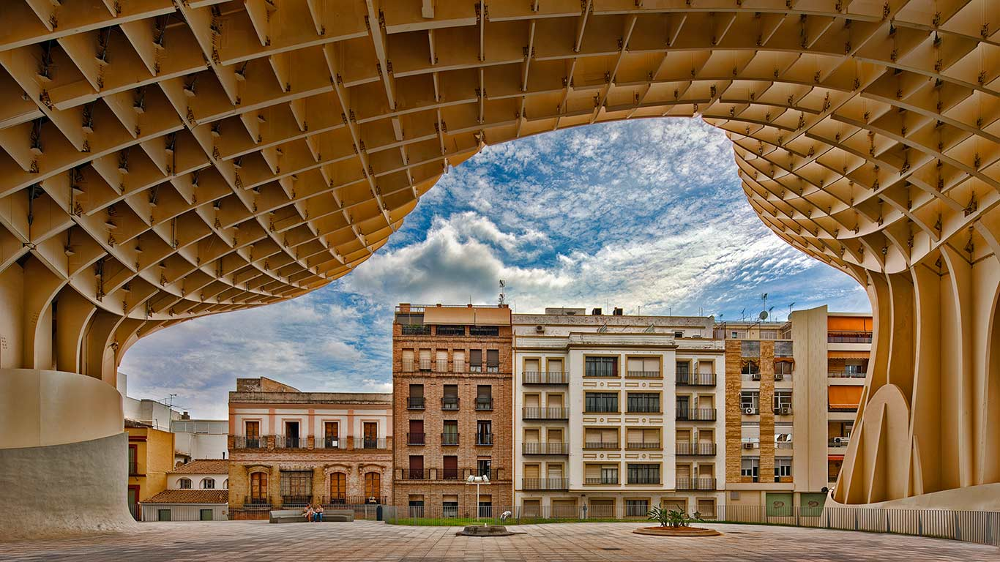

#### 20150830 A Nile crocodile soaks in the Okavango Delta, Botswana (© Richard Du Toit/Minden Pictures)(Bing United Kingdom)

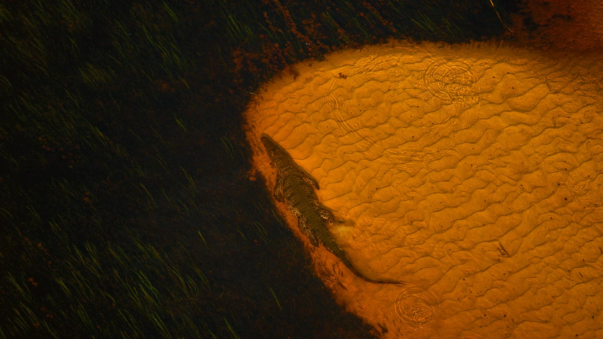

#### 20150829 The Royal Edinburgh Military Tattoo, Scotland (© Martin Scott Powell/Gallery Stock)(Bing United Kingdom)

#### 20150828 The polder landscape near Jisp, Netherlands (© Frans Lemmens/Alamy)(Bing United Kingdom)

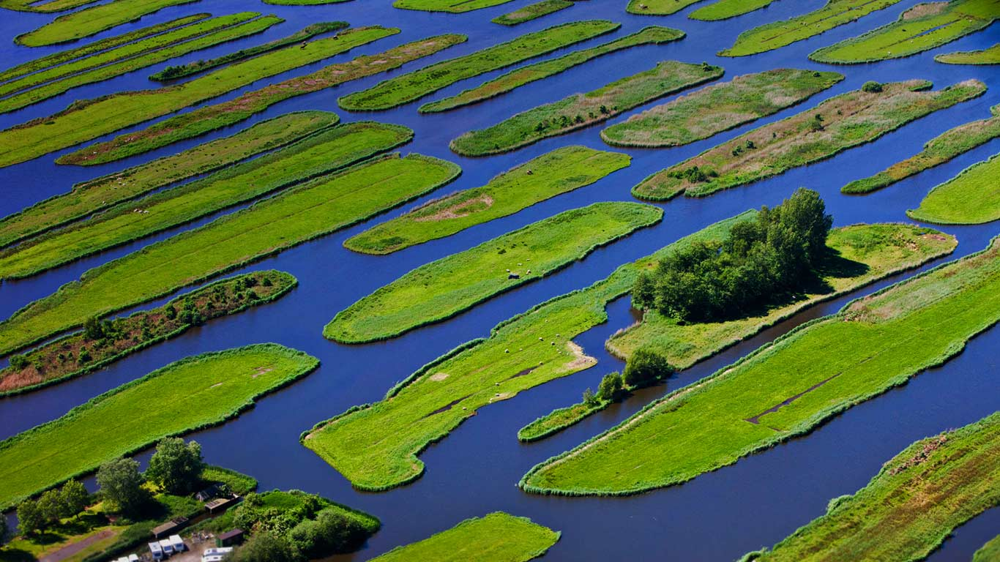

#### 20150827 Palais Garnier in Paris, France (© John Kellerman/Alamy)(Bing United Kingdom)

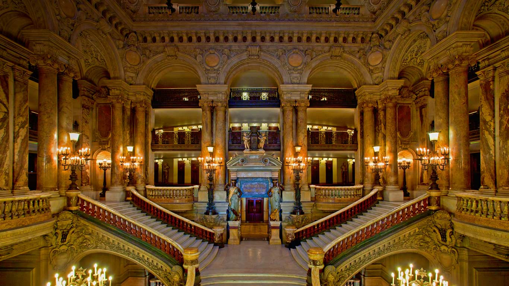

#### 20150826 Cape gannet diving for fish off Port St. Johns, Wild Coast, Eastern Cape, South Africa (© FLPA/FLPA/SuperStock)(Bing United Kingdom)

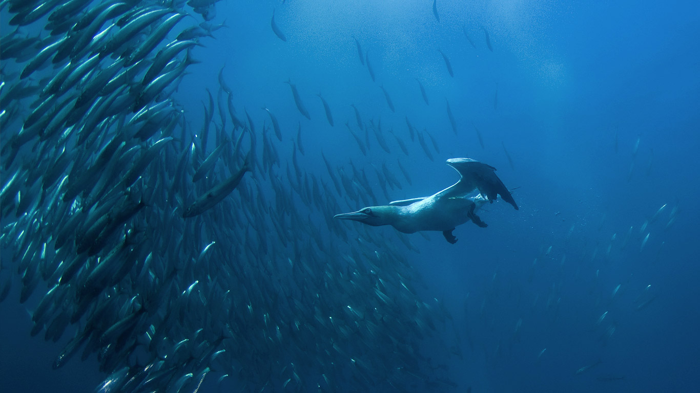

#### 20150825 Visitors in Yellowstone National Park (© Jason Savage/Tandem Stills + Motion)(Bing United Kingdom)

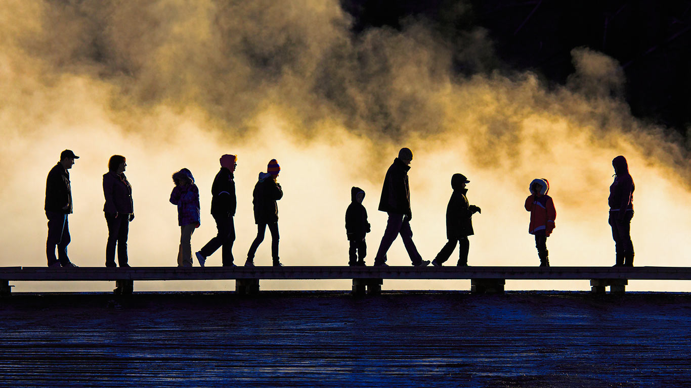

#### 20150825 Star trails at Cape Woolamai in Victoria, Australia (© Lincoln Harrison/Solent News/Rex Features)(Bing Australia)

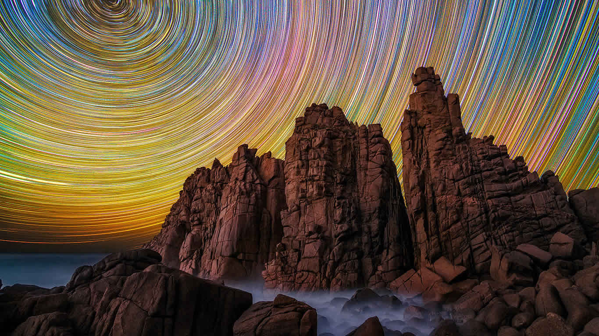

#### 20150825 Sonnenaufgang über der Ruine Wegelnburg, Nothweiler, Pfälzerwald, Rheinland-Pfalz, Deutschland (© Raimund Linke/Getty Images)(Bing Deutschland)

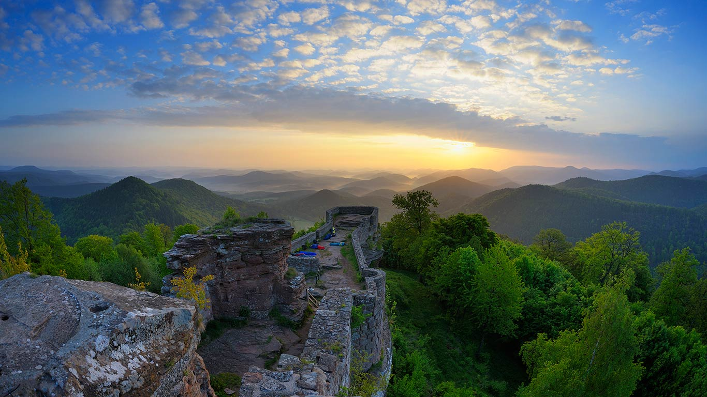

#### 20150825 Crab traps and fishermen’s sheds in seaside village of Victoria By The Sea, Prince Edward Island, Canada (© Greg Vaughn/Alamy)(Bing Canada)

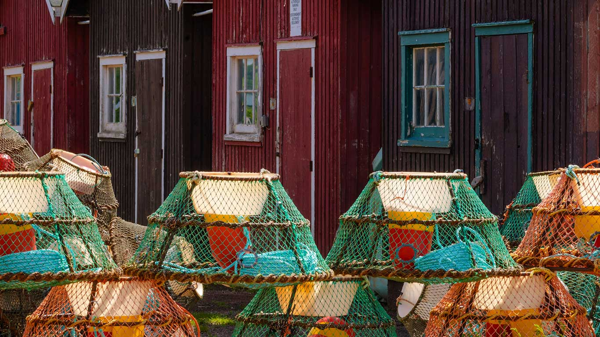

#### 20150824 Port de Saint-Tropez, Var, Provence-Alpes-Côte d'Azur (© Sylvain Sonnet/Getty Images)(Bing France)

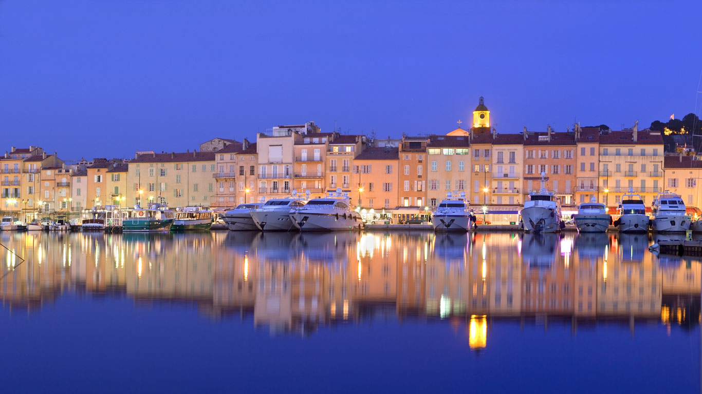

#### 20150824 Lightning over Kowloon, Hong Kong (© Daniel Chui/Moment/Getty Images)(Bing United Kingdom)

#### 20150824 中国，暴雨将至，秋意渐浓 (© Peking Nietzsche/500px)(Bing China)

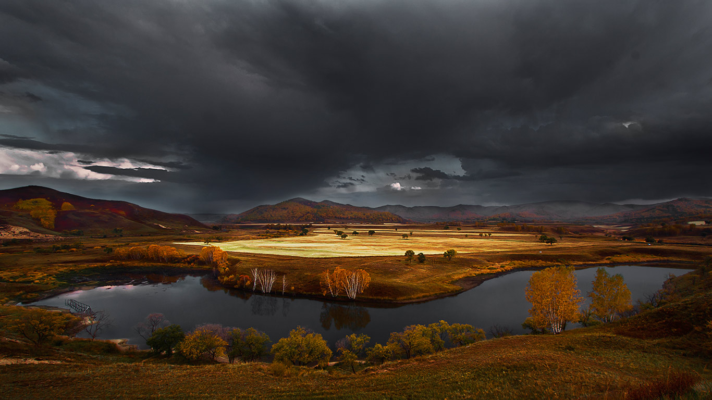

#### 20150823 A spectacled bear cub in Maquipucuna Cloudforest Reserve, Ecuador (© Pete Oxford/Minden Pictures)(Bing United Kingdom)

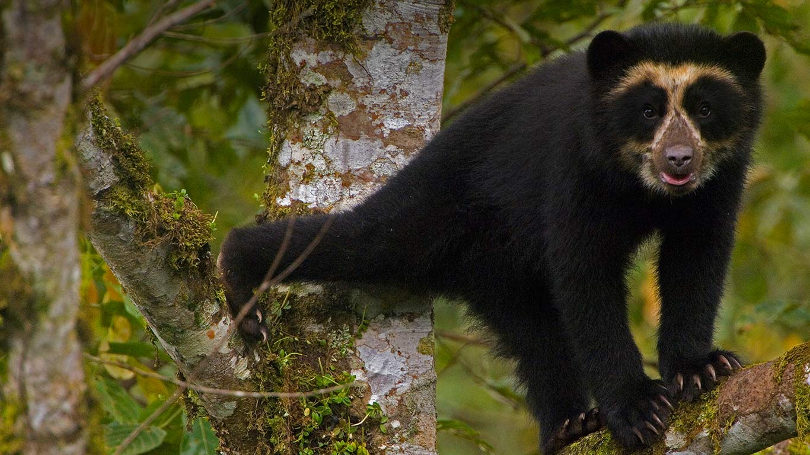

#### 20150822 Long Pine Key in Everglades National Park, Florida (© Tandem Stills + Motion)(Bing United Kingdom)

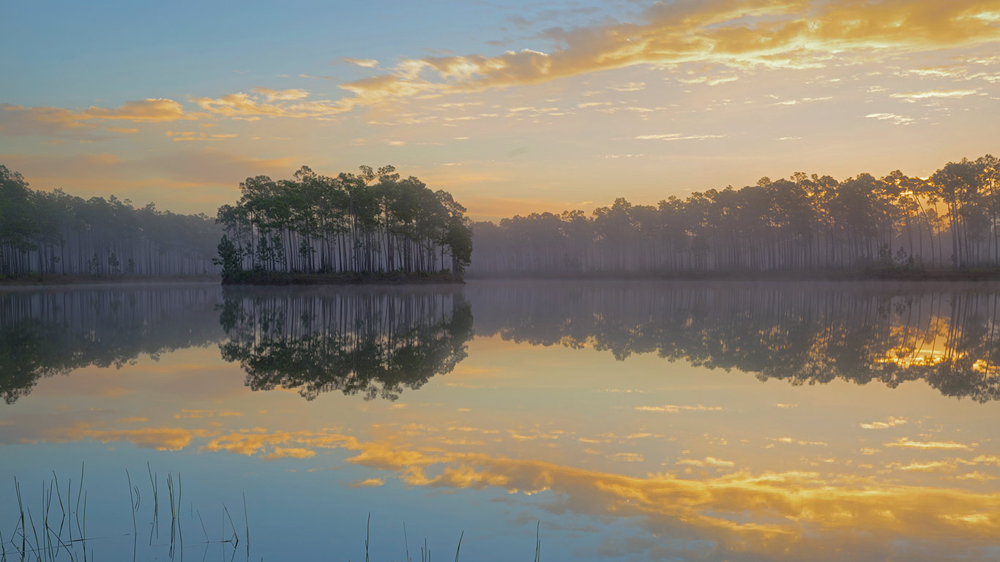

#### 20150821 'Wonderland' sculpture by Jaume Plensa, outside The Bow tower in Calgary, Alberta, Canada (© Michael Wheatley/SuperStock)(Bing United Kingdom)

#### 20150821 中国，桂林，小鸟依偎在一起 (© View Stock/Getty Images)(Bing China)

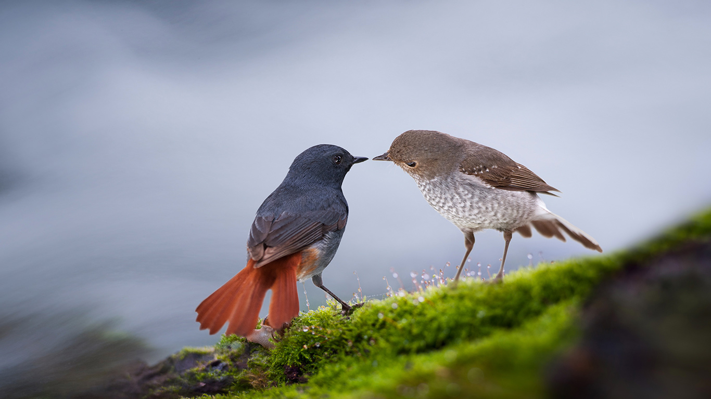

#### 20150820 Gecko and insect on rainy day, Indonesia (© Shikhei Goh/Getty Images)(Bing United Kingdom)

#### 20150820 Campobello Island, East Quoddy (Head Harbour) Lighthouse, New Brunswick, Canada (© Alan Copson/JAI/Corbis)(Bing Canada)

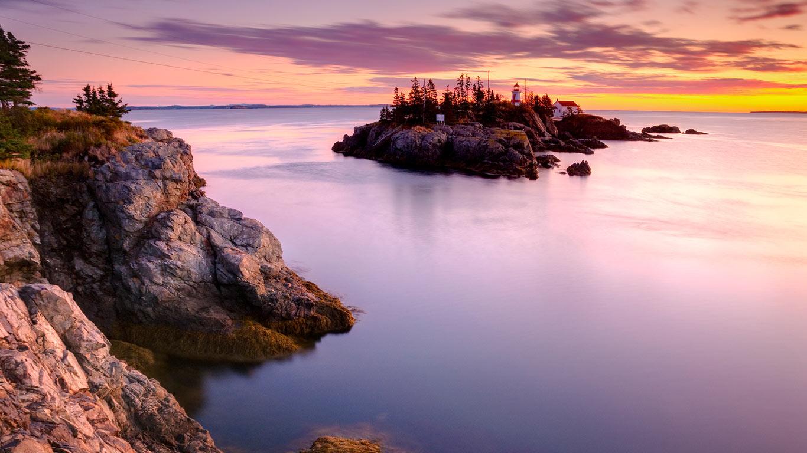

#### 20150819 Jardin des plantes près de la Grande mosquée de Paris, Île-de-France (© Yann Arthus-Bertrand/Corbis)(Bing France)

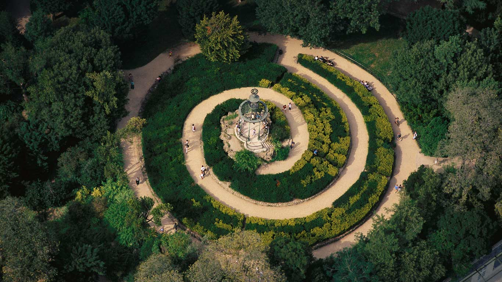

#### 20150819 Termite mounds in Litchfield National Park, Northern Territory, Australia (© Ingo Arndt/Minden Pictures)(Bing Australia)

#### 20150819 Eingang des Botanischen Gartens in Karlsruhe, Baden-Württemberg, Deutschland (© Markus Lange/imageBROKER/Alamy)(Bing Deutschland)

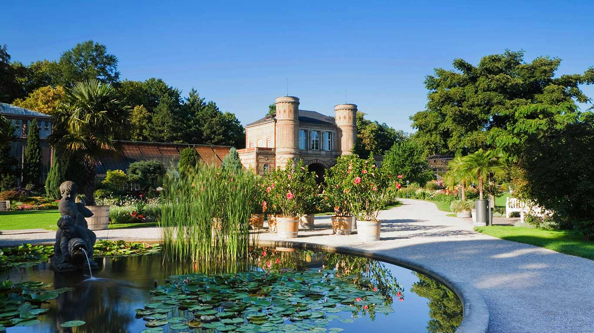

#### 20150819 A glacier in Wrangell-St. Elias National Park and Preserve, Alaska (© Frans Lanting/Gallery Stock)(Bing United Kingdom)

#### 20150818 Mulbekh Monastery in the Zanskar region of Ladakh, Jammu and Kashmir, India (© Lethang Photography/Getty Images)(Bing United Kingdom)

#### 20150817 U Bein Bridge, Amarapura, Myanmar (© Moment Select/Getty Images)(Bing United Kingdom)

#### 20150816 Tiger and Turtle - Magic Mountain, an art installation in Angerpark, Duisburg, Germany (© Image Broker/REX)(Bing United Kingdom)

#### 20150815 Macro picture of a variety of bristly haircap moss (© Misja Smits/Buiten-Beeld/plainpicture)(Bing United Kingdom)

#### 20150814 Warwick Long Bay, Bermuda (© SIME/eStock Photo)(Bing United Kingdom)

#### 20150814 Macquarie Lighthouse in Sydney, Australia (© Igor Kasalovic/500px)(Bing Australia)

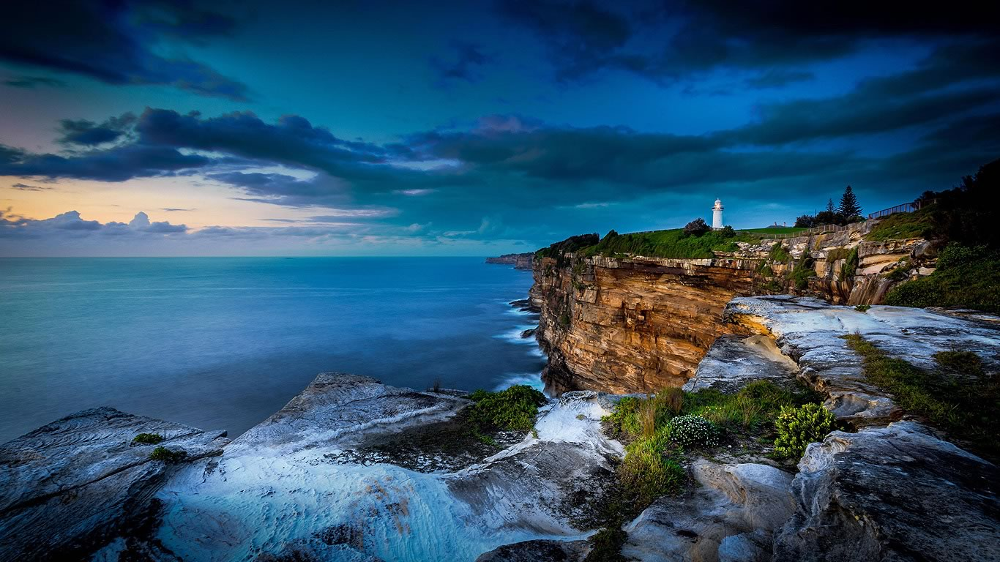

#### 20150814 Défilé lors du festival interceltique de Lorient, Morbihan, Bretagne (© Aurora Photos)(Bing France)

#### 20150813 Purple-tipped sea anemones off the coast of Vancouver Island, British Columbia, Canada (© Brandon Cole/Offset)(Bing United Kingdom)

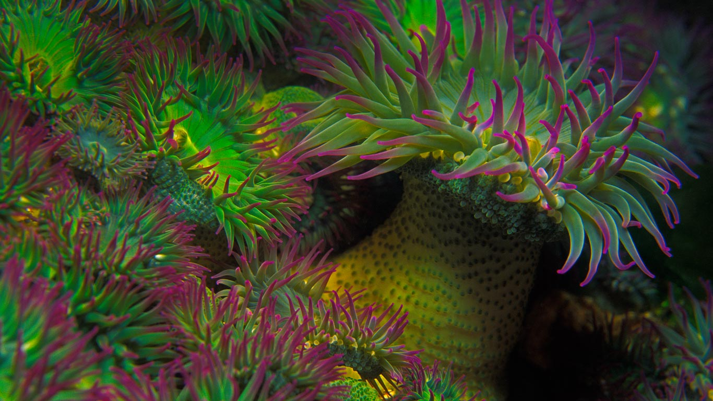

#### 20150812 African elephants (© James Hager/Offset)(Bing United Kingdom)

#### 20150812 Baumwipfelpfad im Nationalpark Bayerischer Wald, Neuschönau, Bayern, Deutschland (© Dr. Rüdiger Hess/geo-select fotoArt)(Bing Deutschland)

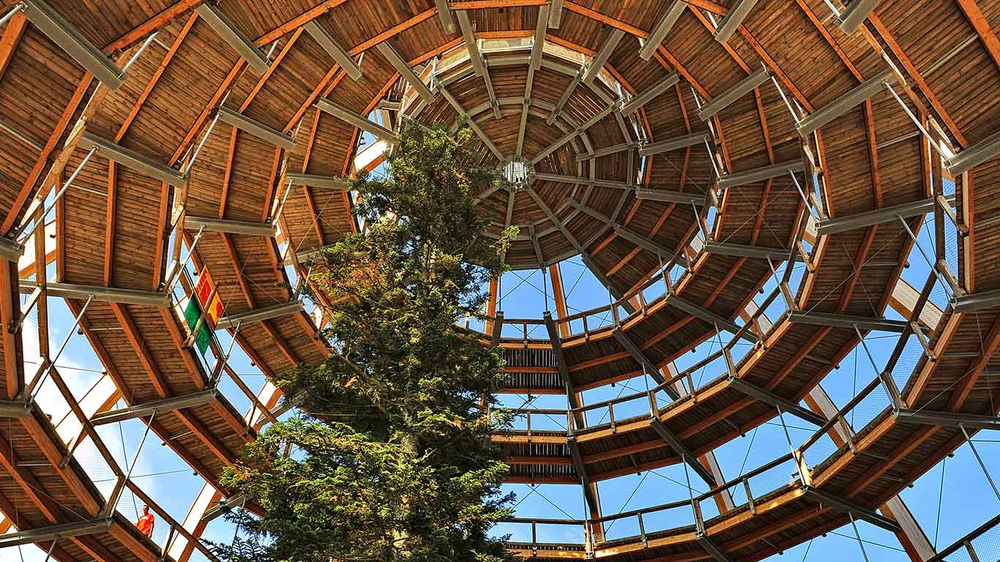

#### 20150812 Sunset on the north shore of Prince Edward Island, Canada (© Robert Harding World Imagery RF/Alamy)(Bing Canada)

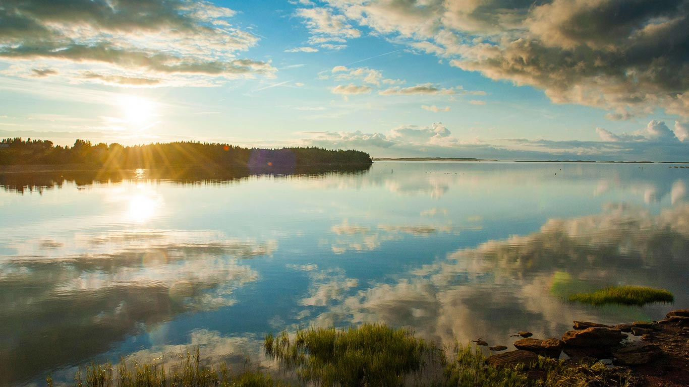

#### 20150812 ｢富士の笠雲｣ (© Akihiro Shibata/Solent News/Rex Features)(Bing Japan)

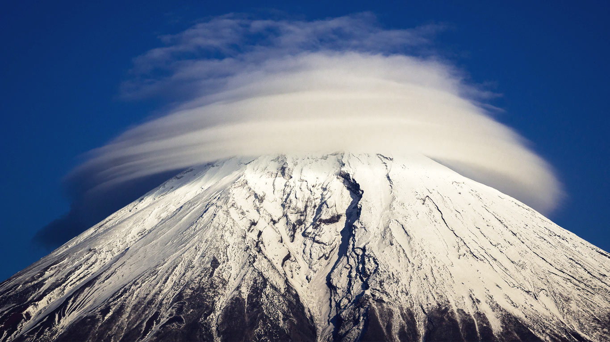

#### 20150811 Star trails over Mount Shasta in California (© Brad Goldpaint/Aurora Photos)(Bing United Kingdom)

#### 20150810 Antelope Canyon near Page, Arizona (© S.R.Lee Photo Traveller/Shutterstock)(Bing United Kingdom)

#### 20150809 Marina Bay illuminated for Singapore's 50th National Day (© Then Chih Wey/Xinhua/Alamy)(Bing United Kingdom)

#### 20150809 中国，北京，秋色映在紫禁城的护城河中 (© Christian Kober/Aurora Photos)(Bing China)

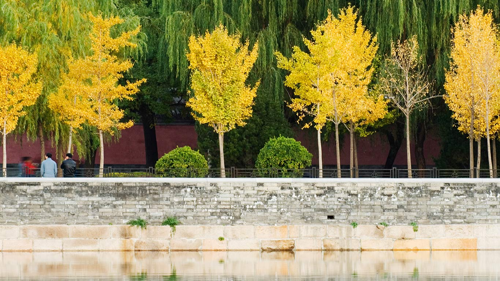

#### 20150808 Competitors in the Nehru Trophy Boat Race in Alappuzha, India (© Ashit Desai/Corbis)(Bing United Kingdom)

#### 20150808 Voie lactée et perséide, La Corogne, Espagne (© Carlos Fernandez/Getty Images)(Bing France)

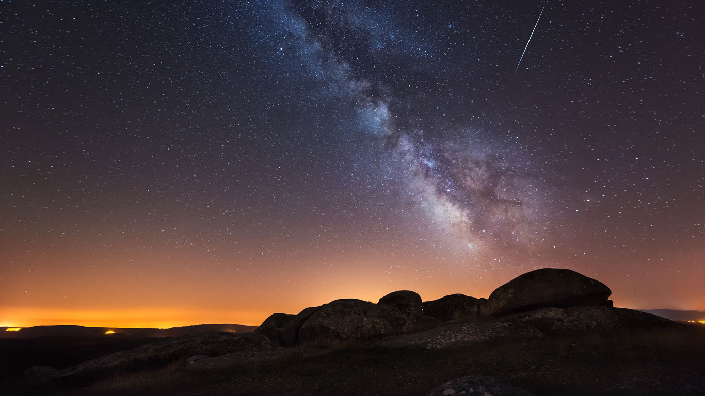

#### 20150808 Hanging Rock in the Macedon Ranges, Victoria, Australia (© Auscape/Universal Images Group/Getty Images)(Bing Australia)

#### 20150807 ｢とうろう流し｣広島, 元安川 (© epa european pressphoto agency b.v./KIMIMASA MAYAMA/Alamy)(Bing Japan)

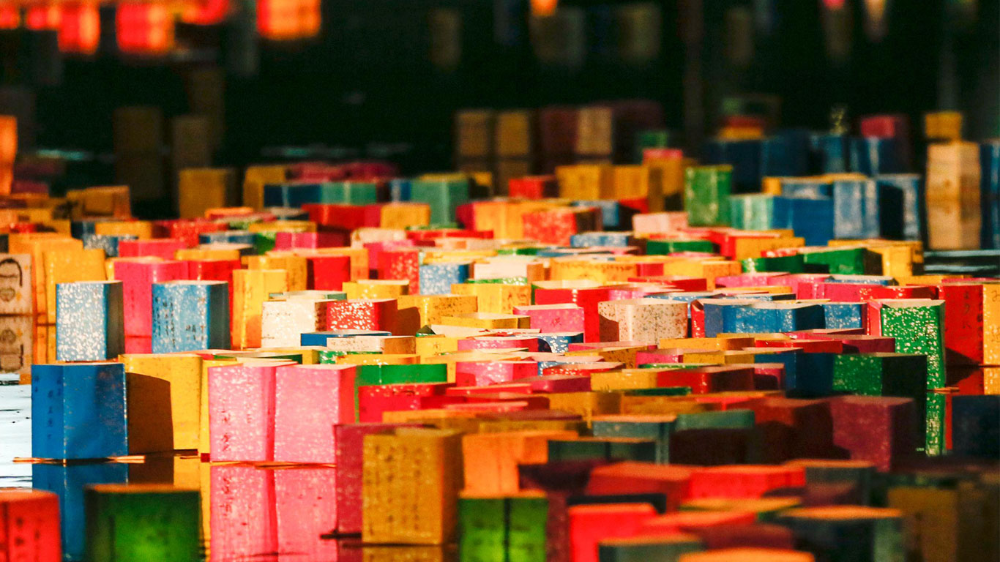

#### 20150807 Cenote Samula near Valladolid, Yucatán Peninsula, Mexico (© ML Sinibaldi/Lithium/age fotostock)(Bing United Kingdom)

#### 20150806 A road to Arenal Volcano National Park in Costa Rica (© Stefano Amantini/Corbis)(Bing United Kingdom)

#### 20150806 Blick vom Hochhaus KölnTriangle auf Köln und den Rhein bei Nacht (© bildbroker.de/Alamy)(Bing Deutschland)

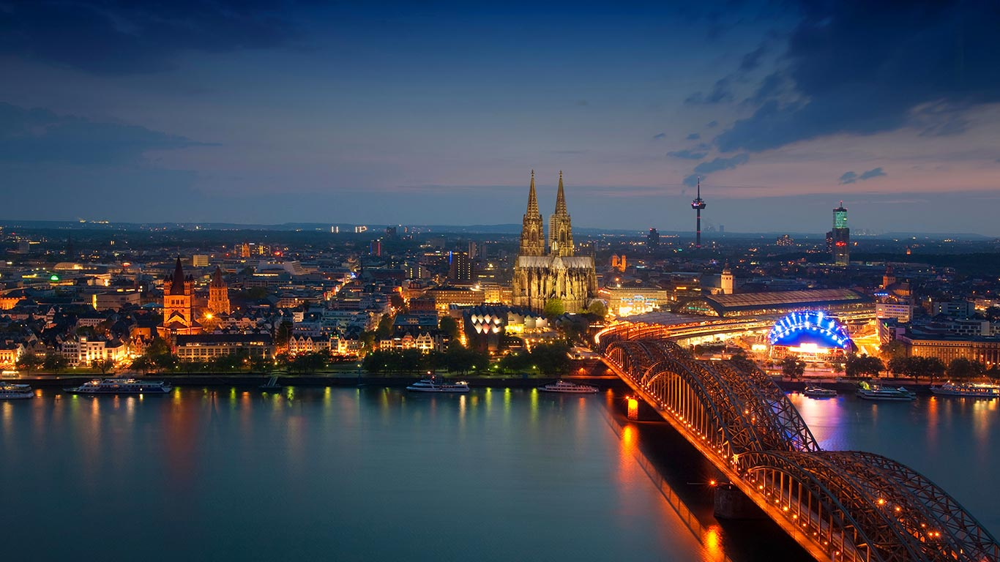

#### 20150805 Ship wreckage near Tromsø, Norway (© Daniel Osterkamp/Getty Images)(Bing United Kingdom)

#### 20150804 Gateshead Millennium Bridge in Newcastle upon Tyne, England (© Graeme Peacock/Alamy)(Bing United Kingdom)

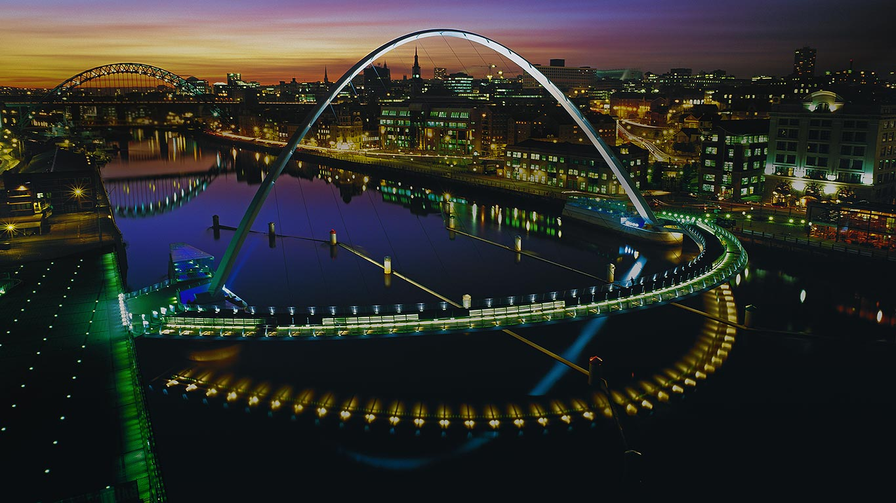

#### 20150803 Treacherous Rock islands of Five Finger Rapids in Yukon River near town of Carmacks, Yukon Territory, Canada  (© Pi-Lens/Shutterstock)(Bing Canada)

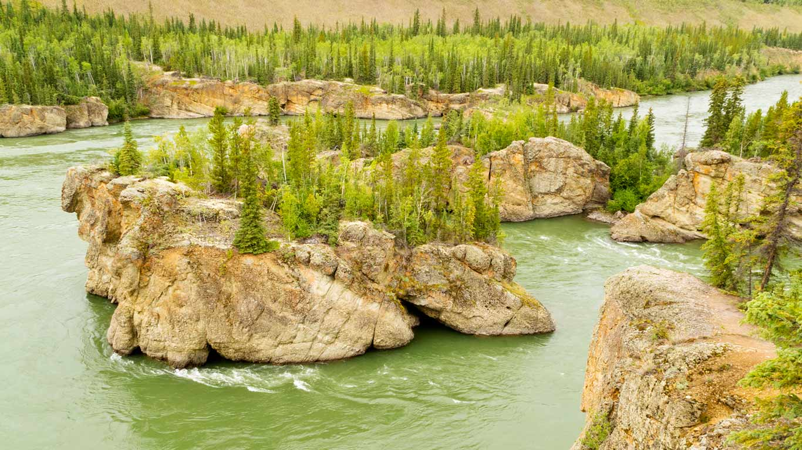

#### 20150803 American bison near Fort Pierre, South Dakota (© Jim Brandenburg/Minden Pictures)(Bing United Kingdom)

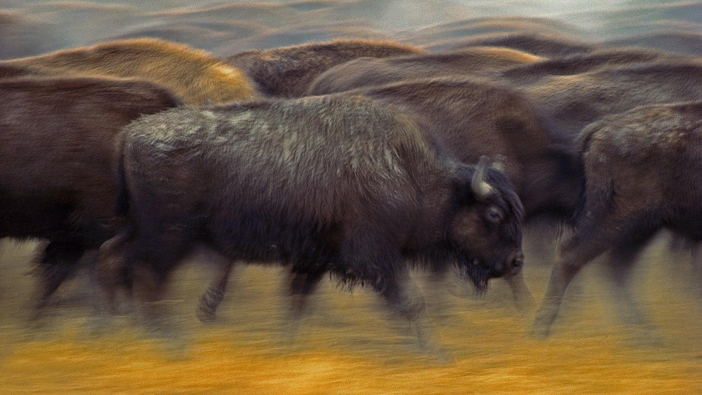

#### 20150802 Siesta the donkey greets Sudo the dog in Melbourne, Australia (© Sarah Matray/REX Shutterstock)(Bing United Kingdom)

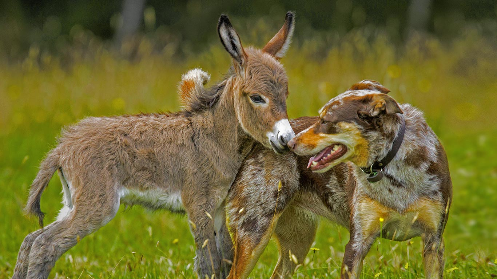

#### 20150801 Seaside resort on the Adriatic coast of Italy’s Emilia-Romagna region (© Bernhard Lang/Getty Images)(Bing United Kingdom)

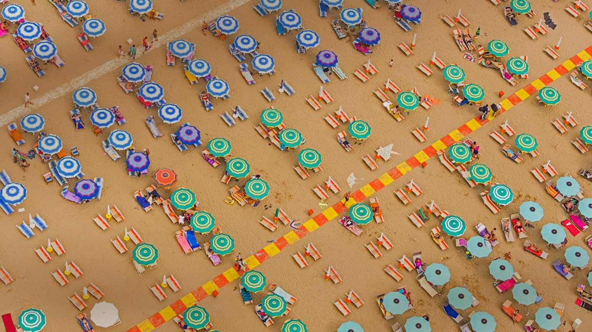

