#### 20150930 Spider Walk in Hancock Gorge, Karijini National Park, Western Australia (© B. Schmid/Amana Images/plainpicture)(Bing Australia)

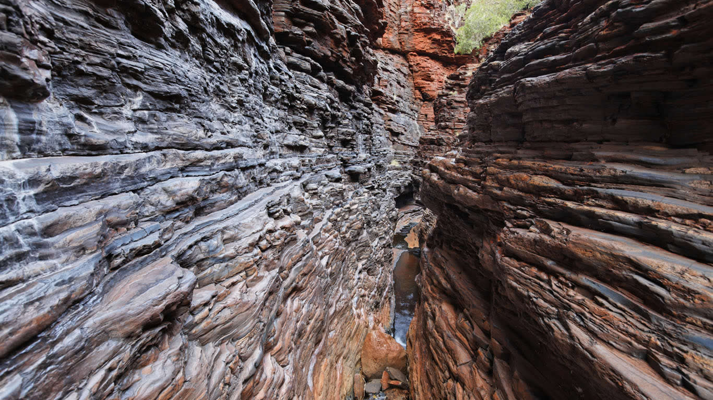

#### 20150930 The road up Mauna Kea on the Big Island of Hawaii (© Gary S. Chapman/Shutterstock)(Bing United Kingdom)

#### 20150930 Hoover Dam, on the border between Arizona and Nevada (© George Steinmetz/Corbis)(Bing United States)

#### 20150929 Volcanic crater off Santiago Island, Galápagos Islands (© Frans Lanting/Corbis)(Bing United Kingdom)

#### 20150928 [中秋快乐] 北京，月亮从颐和园的十七拱桥上升起 (© Grant Fant/Getty Images)(Bing China)

#### 20150928 Wicker cultivation in the village of Cañamares, Cuenca, Spain (© David Santiago Garcia/Aurora Photos)(Bing United Kingdom)

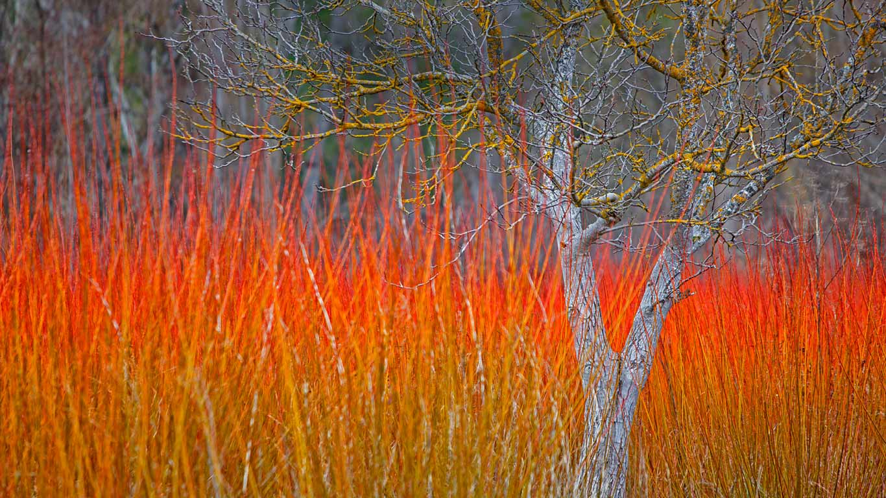

#### 20150927 Loch Ness in the Scottish Highlands at sunset (© Gordie Broon Photography/Getty Images)(Bing United Kingdom)

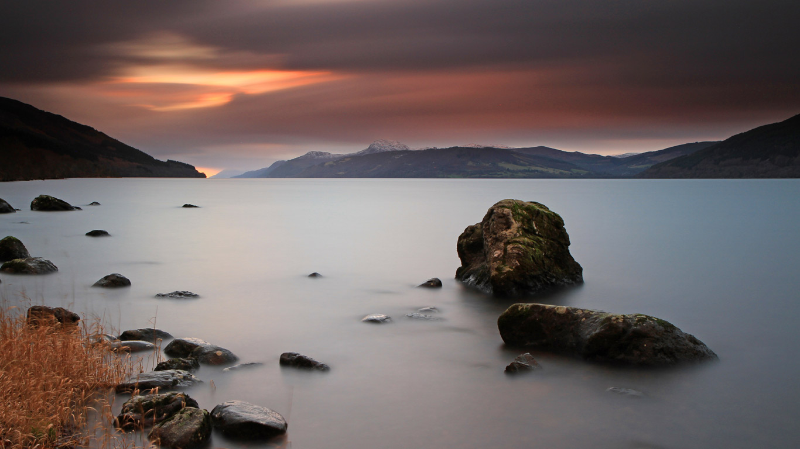

#### 20150926 Elakala Waterfall #1 in Blackwater Falls State Park, West Virginia (© Randall Sanger/Tandem Stills + Motion)(Bing United Kingdom)

#### 20150925 Japanese dwarf flying squirrel (© Shiroh Yabe/SEBUN PHOTO/amanaimages/Corbis)(Bing United Kingdom)

#### 20150925 Chevreuil dans un paysage automnal, Sud de la France (© Niclas Andersson/Plain Picture)(Bing France)

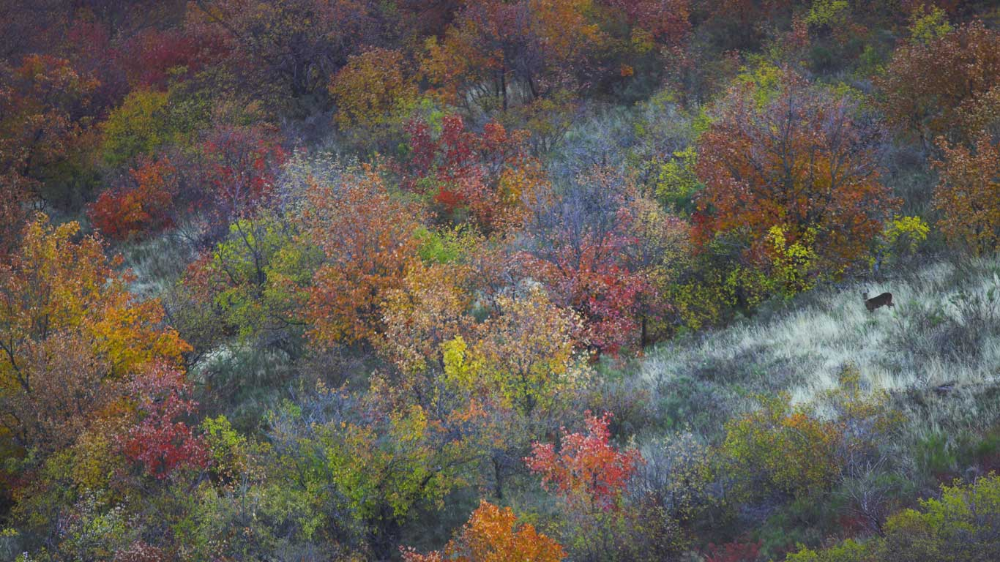

#### 20150924 [今日秋分] 新疆，阿勒泰，阳光划过晨雾 (© Allensima/Getty Images)(Bing China)

#### 20150924 Pink Mulla Mulla in the Northern Territory, Australia (© Doug Steley A/Alamy)(Bing Australia)

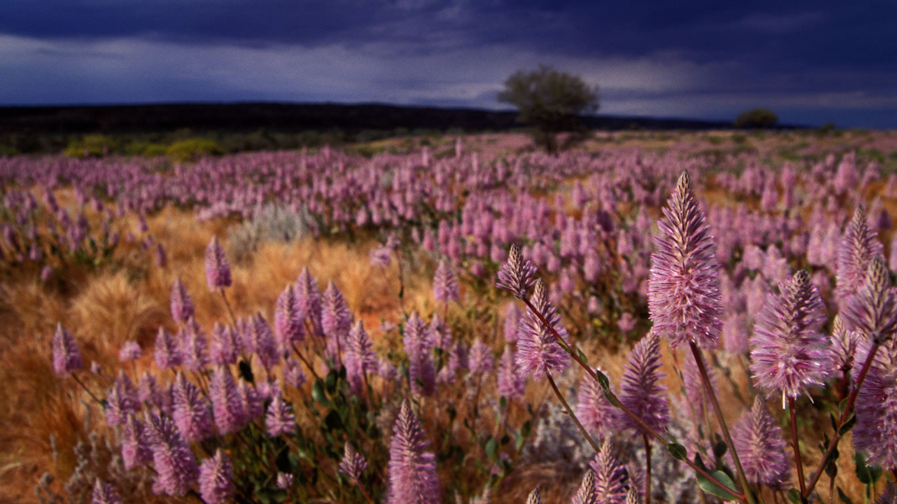

#### 20150924 Cathedral-Basilica of Mary, Dorchester Square, Montreal, Canada (© Alan Copson/AWL Images/Getty Images)(Bing Canada)

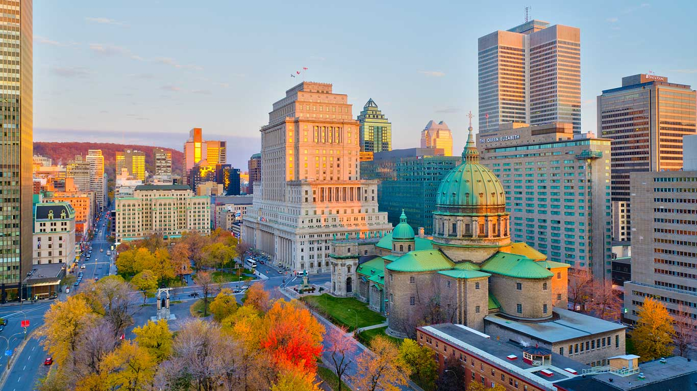

#### 20150924 Moselschleife bei Bremm, Rheinland-Pfalz, Deutschland (© Huber/Sime/eStock Photo)(Bing Deutschland)

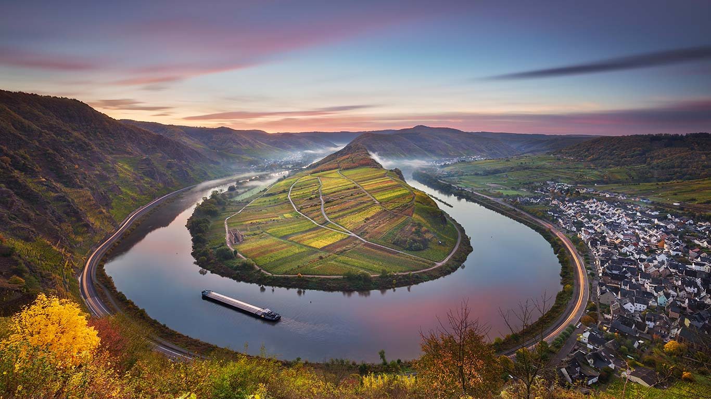

#### 20150924 Jaswant Thada in Jodhpur, India (© Lucas Vallecillos/age fotostock)(Bing United Kingdom)

#### 20150923 Maroon Lake and the Maroon Bells peaks, Colorado (© Inge Johnsson/Alamy)(Bing United Kingdom)

#### 20150922 Hobbiton, near Matamata, North Island, New Zealand (© imageBROKER/Rex Features)(Bing United Kingdom)

#### 20150921 Mauve stinger jellyfish, Ixtapa Zihuatanejo, Mexico (© Christian Vizl/Tandem Stills + Motion)(Bing United Kingdom)

#### 20150920 Vue crépusculaire du Musée des Confluences, Lyon, Rhône-Alpes (© VIEW Pictures Ltd/Alamy)(Bing France)

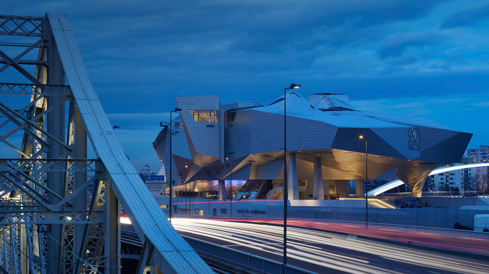

#### 20150920 Grjótagjá cave near Mývatn lake in Iceland (© Joerg Abendroth/Tandem Stills + Motion)(Bing United Kingdom)

#### 20150919 Joueurs de rugby en train de faire une mêlée (© XC/Shutterstock)(Bing France)

#### 20150919 Interior of a beer tent at Oktoberfest in Munich, Germany (© WRIGHT/Superstock)(Bing United Kingdom)

#### 20150918 Blakiston falls, Waterton Lakes National Park, Alberta (© Scott Bennie/Shutterstock)(Bing Canada)

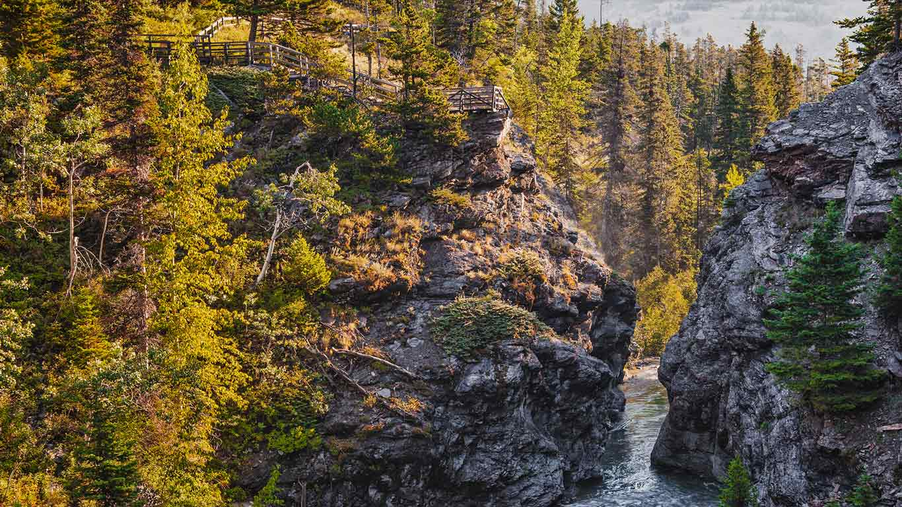

#### 20150918 Rugby union players battle for the ball in a scrum (© xc/Shutterstock)(Bing United Kingdom)

#### 20150917 Segovia, Spain (© Sean Pavone/Shutterstock)(Bing United Kingdom)

#### 20150916 The Milky Way over Capitol Reef National Park in Utah (© Dave Lane/NASA)(Bing United Kingdom)

#### 20150915 Birch trees on the Bashang Plateau, China (© Aaron Ng Photography/Getty Images)(Bing United Kingdom)

#### 20150914 Male black-naped monarch (© kajornyot/Shutterstock)(Bing United Kingdom)

#### 20150913 A red fox (Vulpes vulpes) yawning in the morning light in Lifton, Devon (© Ross Hoddinott/Nature Picture Library/Corbis)(Bing United Kingdom)

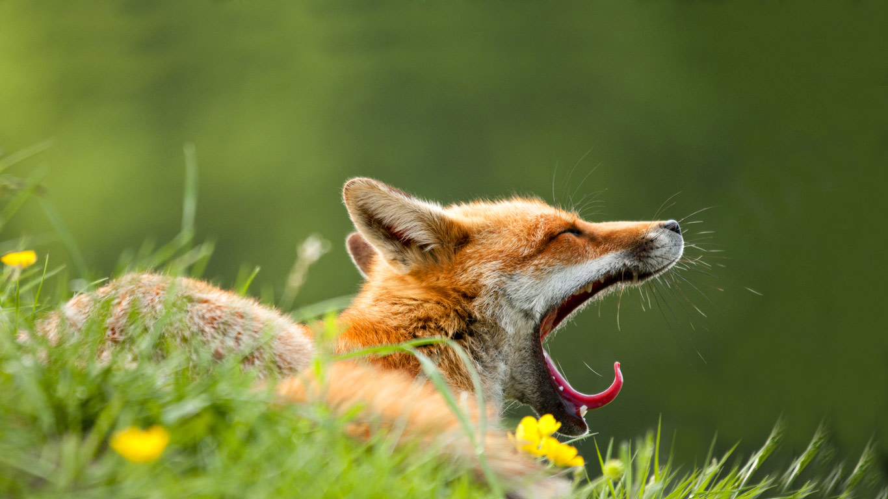

#### 20150913 Grey seals at Heligoland, Germany (© Robert Harding Picture Library/SuperStock)(Bing United States)

#### 20150913 Eucalyptus trees in New South Wales, Australia (© Eastcott Momatiuk/The Image Bank/Getty Images)(Bing Australia)

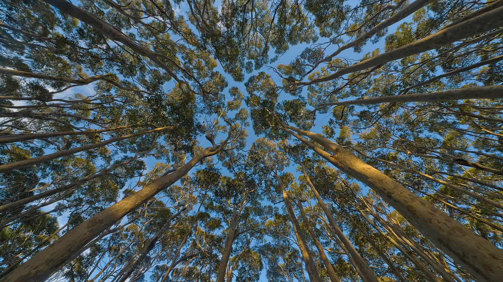

#### 20150912 Lagoon of Uña, near Cuenca, Spain (© David Santiago Garcia/Aurora Photos)(Bing United States)

#### 20150912 Charoite-bearing rock found in the Sakha Republic, Russia (© Bernardo Cesare/Corbis)(Bing United Kingdom)

#### 20150911 The Pentagon Memorial in Arlington, Virginia (© Joseph Sohm/Corbis)(Bing United States)

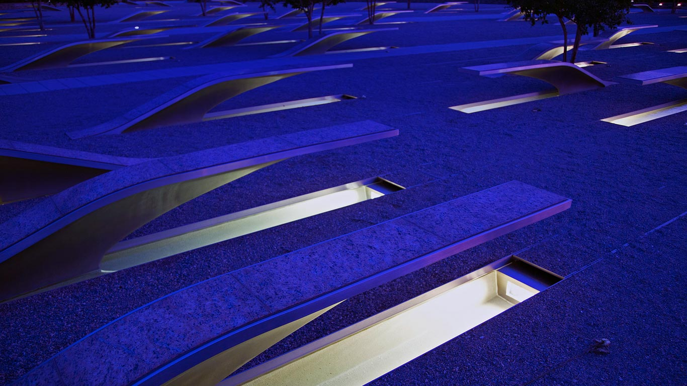

#### 20150911 Kuhglocken in einer Almhütte, Ruhpolding, Chiemgauer Alpen, Bayern, Deutschland (© Dr. Rüdiger Hess/geo-select fotoArt)(Bing Deutschland)

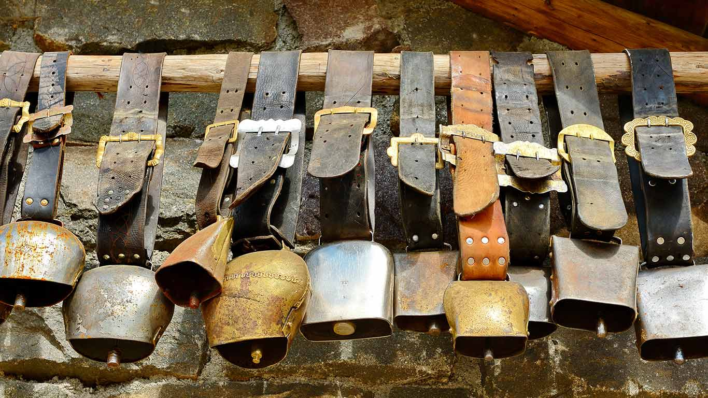

#### 20150911 Gorges of Tarn in Cévennes National Park, Languedoc-Roussillon, France (© Jan Wlodarczyk/Alamy)(Bing United Kingdom)

#### 20150910 Natural Bridges State Beach, Santa Cruz, California (© Fotofeeling/Westend61/plainpicture)(Bing United Kingdom)

#### 20150909 A coal tit taking a break (© NHPA/SuperStock)(Bing United Kingdom)

#### 20150908 School buses parked in a lot (© Space Images/Blend Images/Getty Images)(Bing United States)

#### 20150908 ‘Greeting to the Sun’ installation by Nikola Bašić, Zadar, Croatia (© Ivan Coric/Alamy)(Bing United Kingdom)

#### 20150908 Coles Bay in Freycinet National Park, Tasmania, Australia (© Steve Daggar Photography/Moment Open/Getty Images)(Bing Australia)

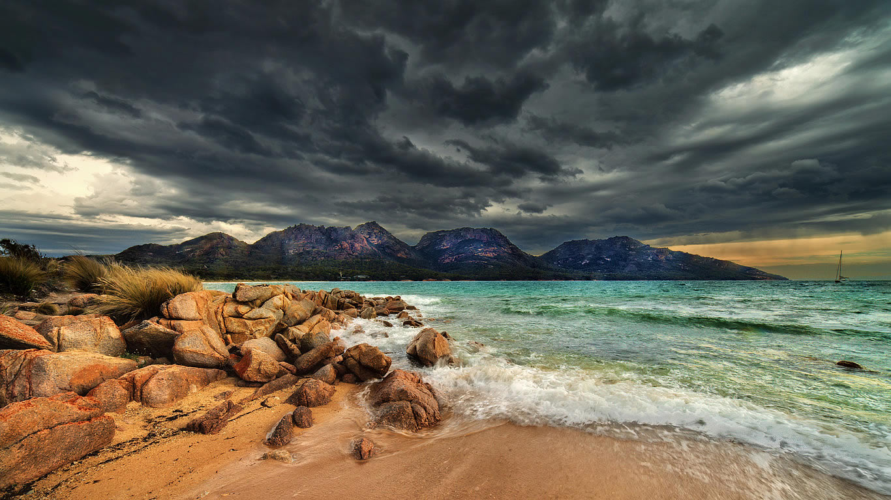

#### 20150907 An otter peeks out from a hole in the ice in Riding Mountain National Park, Manitoba, Canada (© Mike Cavaroc/Tandem Stills + Motion)(Bing Canada)

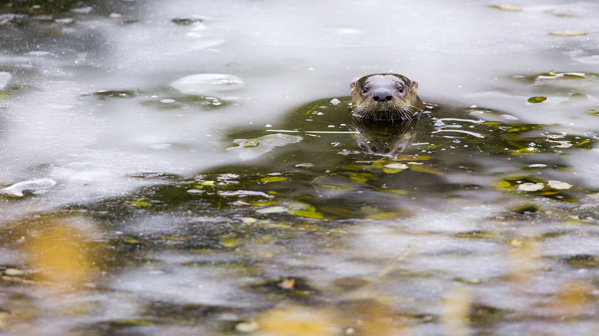

#### 20150907 Sunset near Ely, Minnesota (© Jim Brandenburg/Minden Pictures)(Bing United Kingdom)

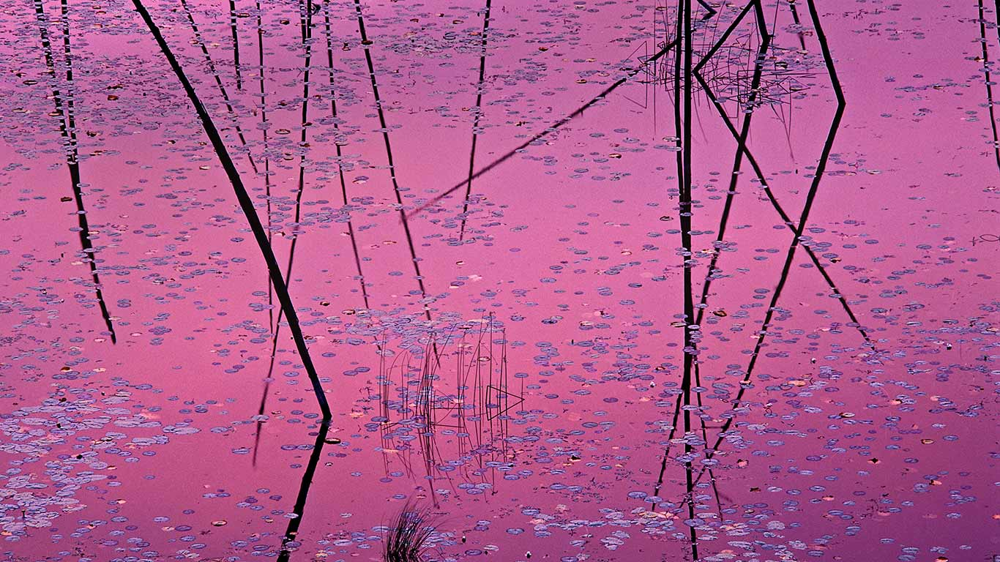

#### 20150907 Leafcutter ants in Boca Tapada, Costa Rica (© Bence Mate/Visuals Unlimited/Corbis)(Bing United States)

#### 20150906 Manhattan’s Financial District as seen from Brooklyn Heights, New York (© Andrew C. Mace/Getty Images)(Bing United Kingdom)

#### 20150905 Heather growing in Cairngorms National Park, Scotland (© Sebastian Kennerknecht/Minden Pictures)(Bing United Kingdom)

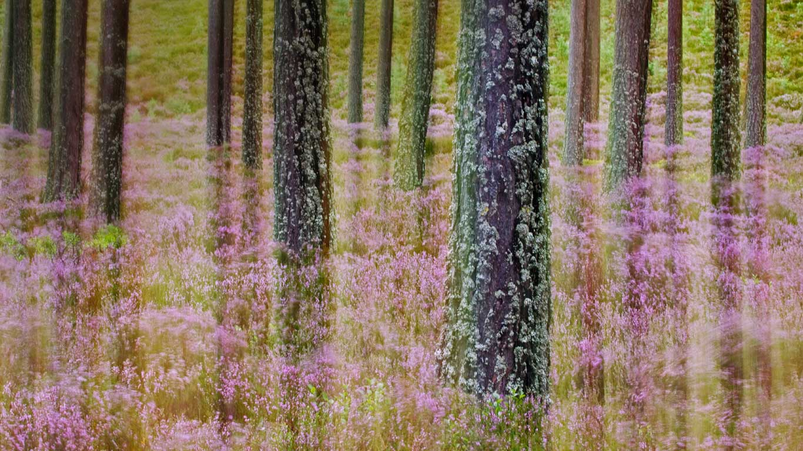

#### 20150905 Funkturm und Messegelände, Berlin, Deutschland (© fhm/Moment/Getty Images)(Bing Deutschland)

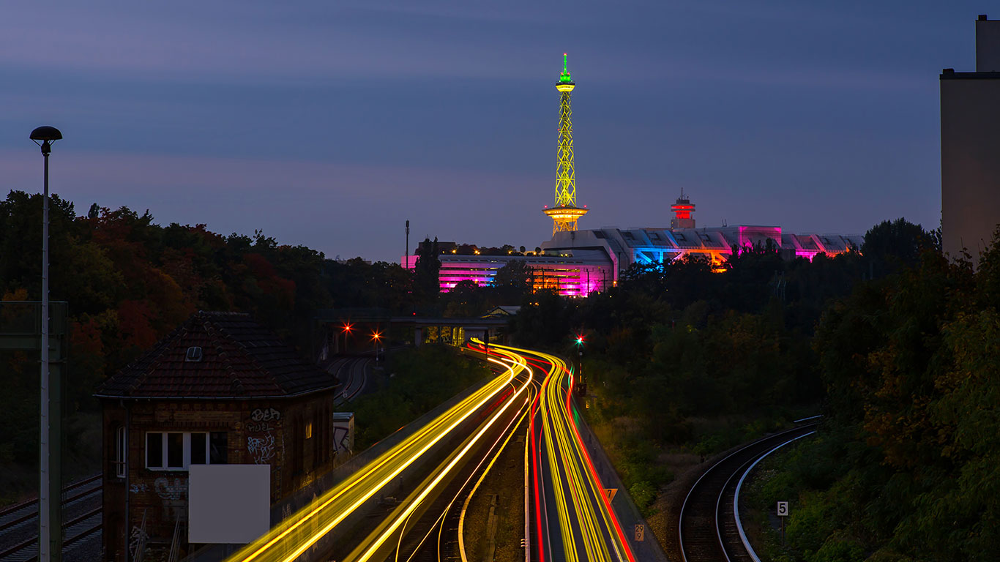

#### 20150904 Blackpool Illuminations, Lancashire, England (© Jason Friend Photography Ltd/Photodisc/Getty Images)(Bing United Kingdom)

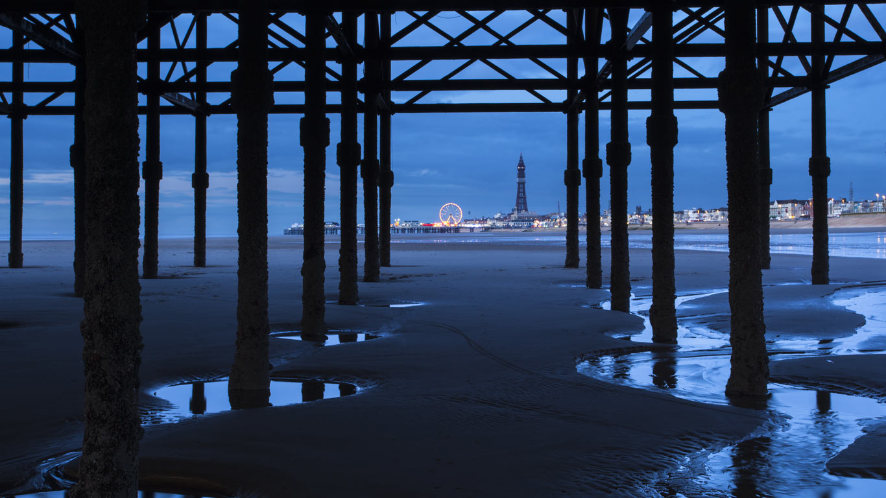

#### 20150903 A moose walks through a small pond in northern Alberta, Canada (© Todd Korol/Aurora Photos)(Bing Canada)

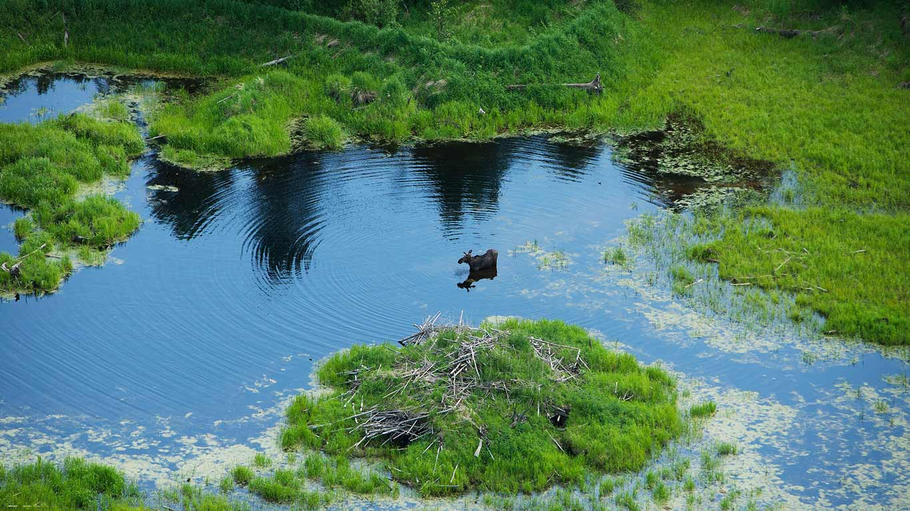

#### 20150903 Galápagos sea lion mother and pup on Floreana Island, Ecuador (© Tui De Roy/Minden Pictures)(Bing United Kingdom)

#### 20150902 Two snails atop a mushroom (© Marianna Armata/Getty Images)(Bing United Kingdom)

#### 20150901 Strokkur geyser near the Hvítá River in Iceland (© Zinaida Sopina/Shutterstock)(Bing United Kingdom)

#### 20150901 Louis XIV statue and spinning Ferris wheel at Place Bellecour in Lyon, France (© Arnaud Chicurel/Getty Images)(Bing United States)

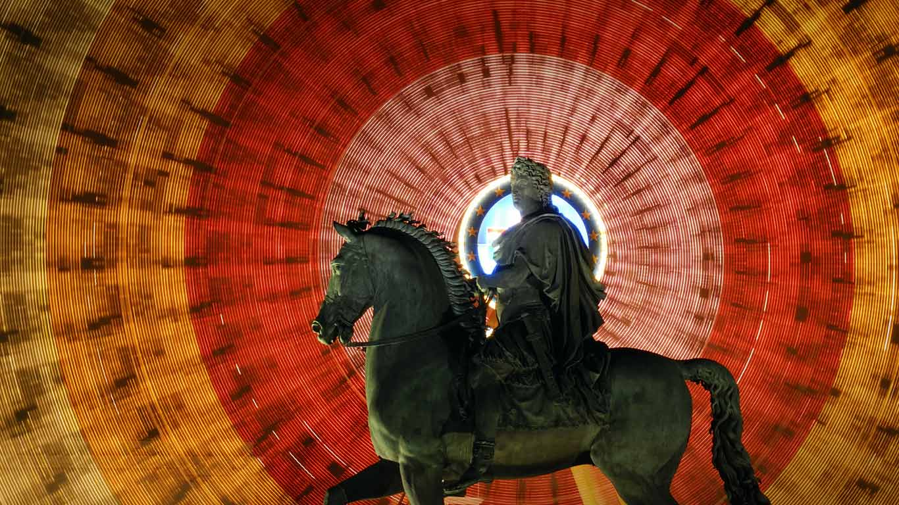

#### 20150901 Acacia pycnantha, or Golden Wattle (© Panorama Stock)(Bing Australia)

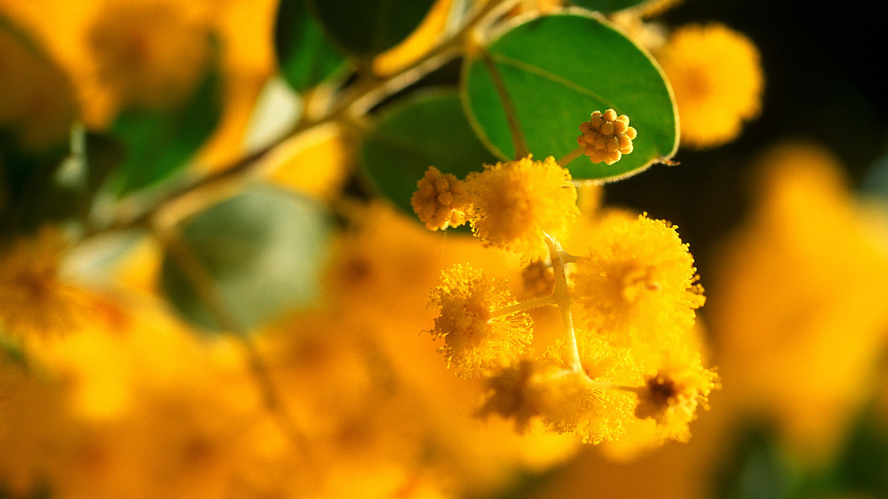

