#### 20151031 Happy Halloween! (© Shutterstock)(Bing United Kingdom)

#### 20151030 Marshall Point Lighthouse near Port Clyde, Maine (© Stephen Ippolito/REX)(Bing United Kingdom)

#### 20151030 Kaskaden der Wasserspiele im Bergpark Wilhelmshöhe, Kassel, Hessen, Deutschland (© Burcak Yalaman/Getty Images)(Bing Deutschland)

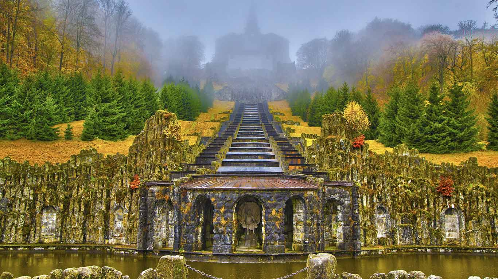

#### 20151029 A weeping willow tree (© Rolf Nussbaumer Photography/Alamy)(Bing United States)

#### 20151029 South Nahanni River, Nahanni National Park Reserve, Northwest Territories, Canada (© Daryl Benson/Corbis)(Bing United Kingdom)

#### 20151029 ｢オーバーラウジッツ学術図書館｣ドイツ, ゲルリッツ (© Florian Monheim/Arcaid/Corbis)(Bing Japan)

#### 20151029 MacKenzie Falls, Grampians National Park, Victoria, Australia (© Joe Vogan/Alamy)(Bing Australia)

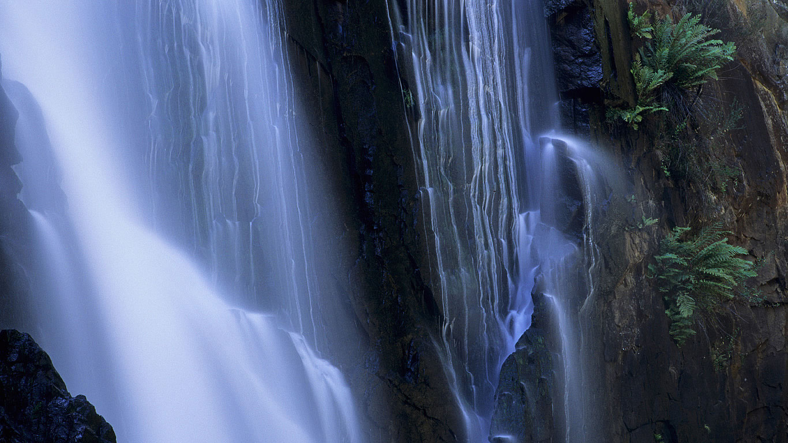

#### 20151028 A male red deer in London’s Richmond Park (© Ian Schofield/Offset)(Bing United Kingdom)

#### 20151027 Brooklyn Bridge-City Hall/Chambers Street subway station ceiling, New York City (© Mick C./500px)(Bing United States)

#### 20151027 Ilulissat Icefjord, Greenland (© Stefan Eisend/Alamy Stock Photo)(Bing United Kingdom)

#### 20151026 Xingping on the Li River in Guangxi Province, China (© naes/Getty Images)(Bing United Kingdom)

#### 20151026 Von Raureif überzogene Elbe-Landschaft, Hamburg-Kirchwerder, Deutschland (© blickwinkel/Alamy Stock Photo)(Bing Deutschland)

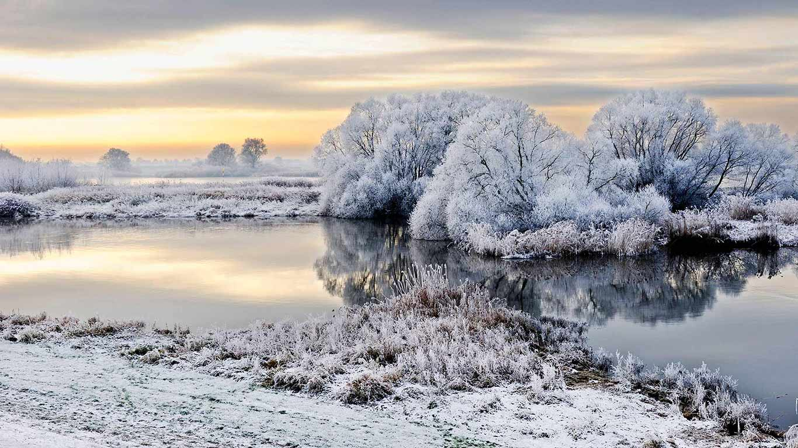

#### 20151025 Sego Canyon pictograms, Utah (© Gary Whitton/Alamy)(Bing United Kingdom)

#### 20151024 Castell y Gwynt on Glyder Fach in Snowdonia, Wales (© SIME/eStock Photo)(Bing United Kingdom)

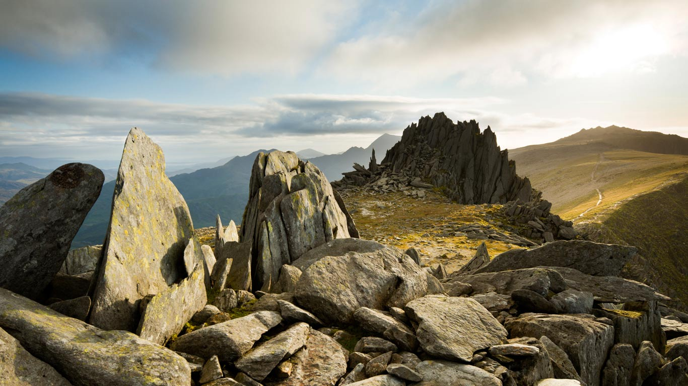

#### 20151023 Labyrinth of the Cathedral, Chartres, France (© Sylvain Sonnet/Getty Images)(Bing United Kingdom)

#### 20151022 Skagsanden, Lofoten Islands, Norway (© imageBROKER/REX Shutterstock)(Bing United Kingdom)

#### 20151021 Vue sur le Puy-en-Velay, le Rocher de Corneille et la chapelle Saint-Michel d’Aiguilhe, Haute-Loire, Auvergne (© GALA Images/Alamy Stock Photo)(Bing France)

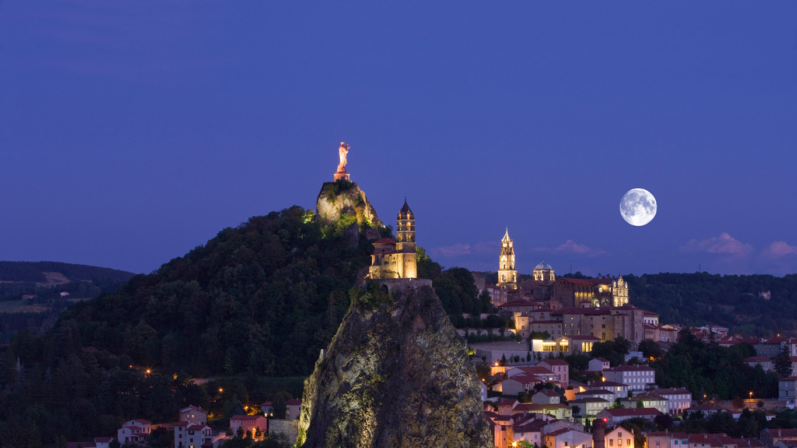

#### 20151021 Flatiron Building, New York City (© Tony Shi Photography/Getty Images)(Bing United Kingdom)

#### 20151021 Herbstliche Allee, Dinkelsbühl, Bayern, Deutschland (© Aflo Relax/Masterfile)(Bing Deutschland)

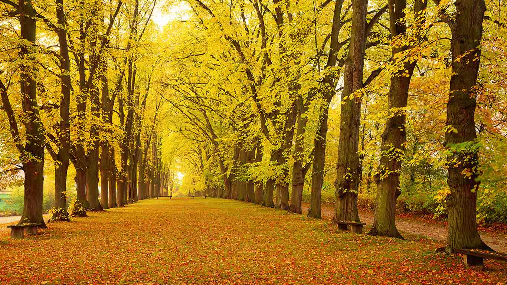

#### 20151020 Blue Mountain Vineyard in fall, Okanagan Falls, Okanagan Valley, British Columbia, Canada (© David Nunuk/All Canada Photos/Getty Images)(Bing Canada)

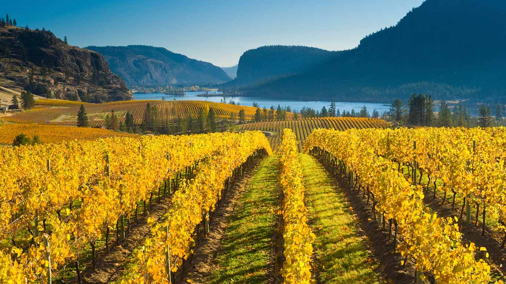

#### 20151020 Crested pigeon in Uluru-Kata Tjuta National Park, Australia (© Photodigitall.nl/Shutterstock)(Bing United Kingdom)

#### 20151019 ‘Spark art’ photography (© DI Mandl Alexander/Solent News/REX)(Bing United Kingdom)

#### 20151018 Autumn aspens in Grand Teton National Park, Wyoming (© Matt Anderson Photography/Getty Images)(Bing United Kingdom)

#### 20151017 Tintagel on the Atlantic coast of Cornwall (© Rolf E. Staerk/Shutterstock)(Bing United Kingdom)

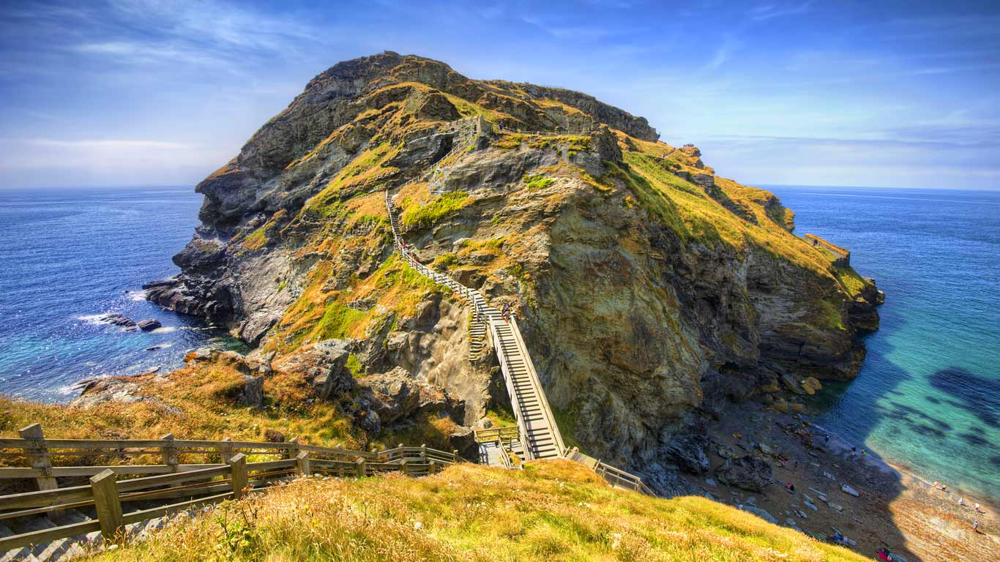

#### 20151017 Chigmit Mountains and Lake Clark National Park and Preserve, Alaska (© Ian Shive/Tandem Stills + Motion)(Bing United States)

#### 20151016 Male gemsboks clash at Etosha National Park, Namibia (© Johan Swanepoel/Shutterstock)(Bing United Kingdom)

#### 20151015 Rapa River delta in Sarek National Park, Sweden (© George Steinmetz/Corbis)(Bing United Kingdom)

#### 20151014 Webb Bridge in Melbourne, Victoria, Australia (© Travelscape Images/Alamy)(Bing Australia)

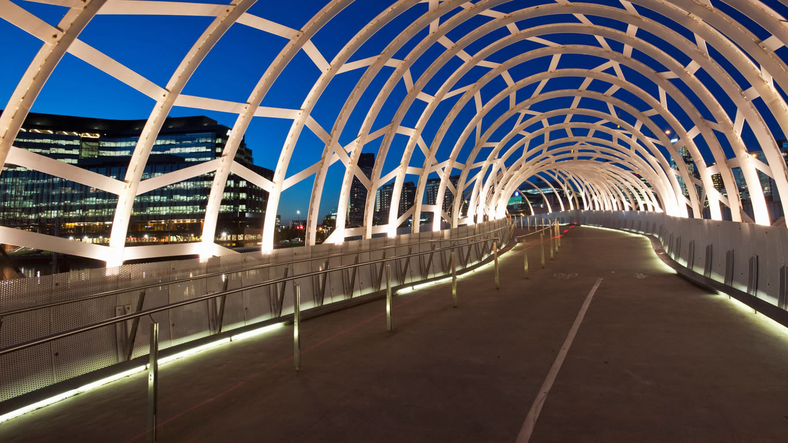

#### 20151014 A tarsier at rest, Bohol Island, Philippines (© Deddeda/Getty Images)(Bing United Kingdom)

#### 20151013 Tourteaux fromagés, spécialités du Poitou (© Julian Elliott Photography/Getty Images)(Bing France)

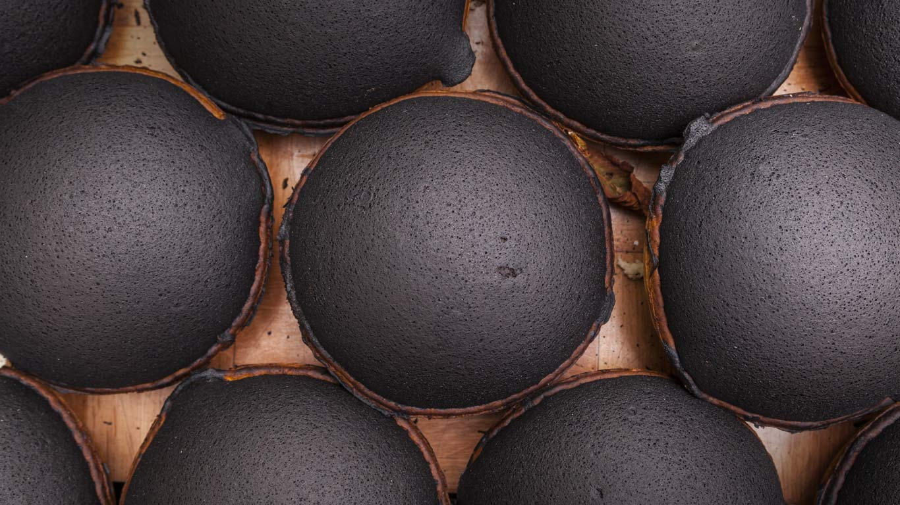

#### 20151013 The Venetian Harbour and Old Town of Chania, Greece (© Hercules Milas/Alamy)(Bing United Kingdom)

#### 20151012 Festival Squash for sale at a farm produce market, Canada (© 167/Pete Ryan/Ocean/Corbis)(Bing Canada)

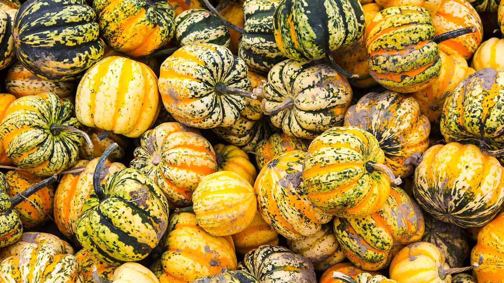

#### 20151012 Boardwalk of Cayeux-sur-Mer, France (© Bryant Nicolas/Alamy)(Bing United Kingdom)

#### 20151011 A conker on dry autumn leaves (© Aksenya/Shutterstock)(Bing United Kingdom)

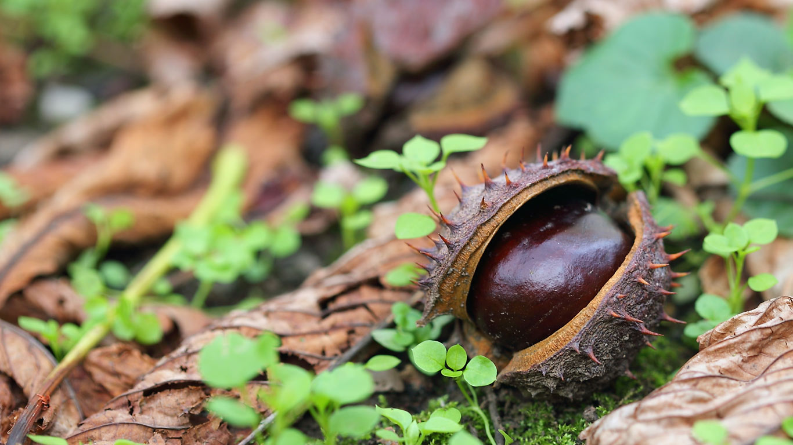

#### 20151010 NASA's robotic rover Curiosity at Mount Sharp on Mars (© NASA/JPL-Caltech/MSSS)(Bing United Kingdom)

#### 20151010 ｢紅葉と松本城｣長野, 松本 (© Rudy Sulgan/Corbis)(Bing Japan)

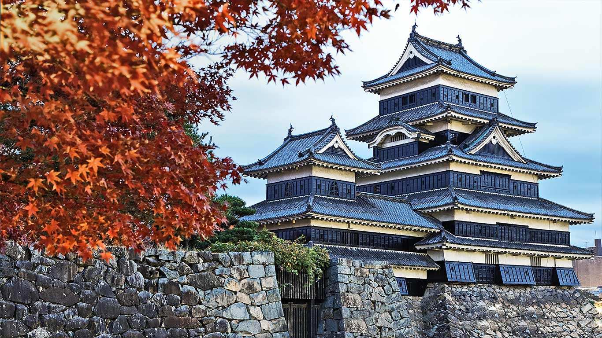

#### 20151010 Humboldt-Universität, Juristische Fakultät, Festival of Lights, Berlin, Deutschland (© Agencja Fotograficzna Caro/Alamy)(Bing Deutschland)

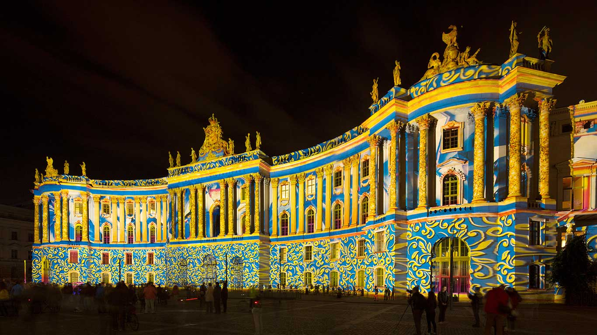

#### 20151009 [今日寒露] 中国，江西，婺源，晨雾与阳光 (© Ping Yan/REX Shutterstock)(Bing China)

#### 20151009 Water droplets on rough-stalked feather moss (© Duncan Usher/Minden Pictures)(Bing United Kingdom)

#### 20151008 Fall foliage in Hudson Valley, New York (© Corbis)(Bing United Kingdom)

#### 20151008 Cushion plants and ferns in Walls of Jerusalem National Park, Tasmania, Australia (© Grant Dixon/Lonely Planet Images/Getty Images)(Bing Australia)

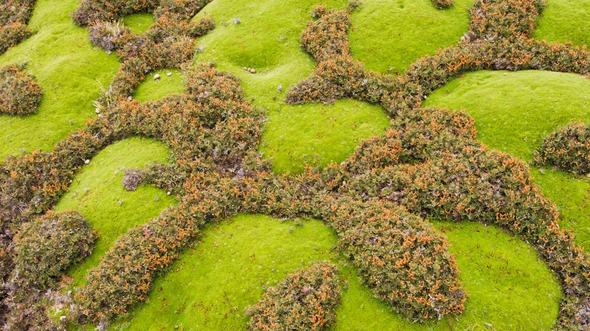

#### 20151007 Northern Saw-whet Owl (Aegolius acadicus) perching in a wild rose bush, British Columbia, Canada (© Tim Fitzharris/Minden Pictures)(Bing Canada)

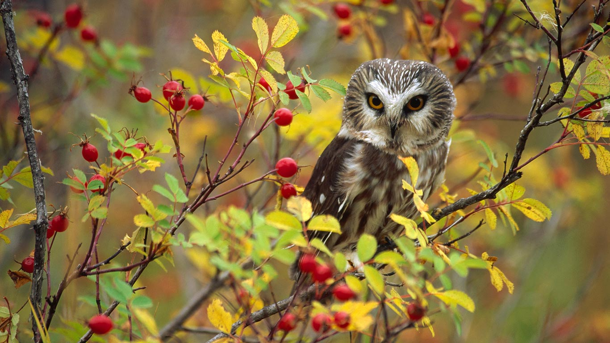

#### 20151007 Saturniid moth, Yasuni National Park, Ecuador (© Pete Oxford/Minden Pictures)(Bing United Kingdom)

#### 20151007 Speicherstadt, Hamburg, Deutschland (© Patrick Baum/500px)(Bing Deutschland)

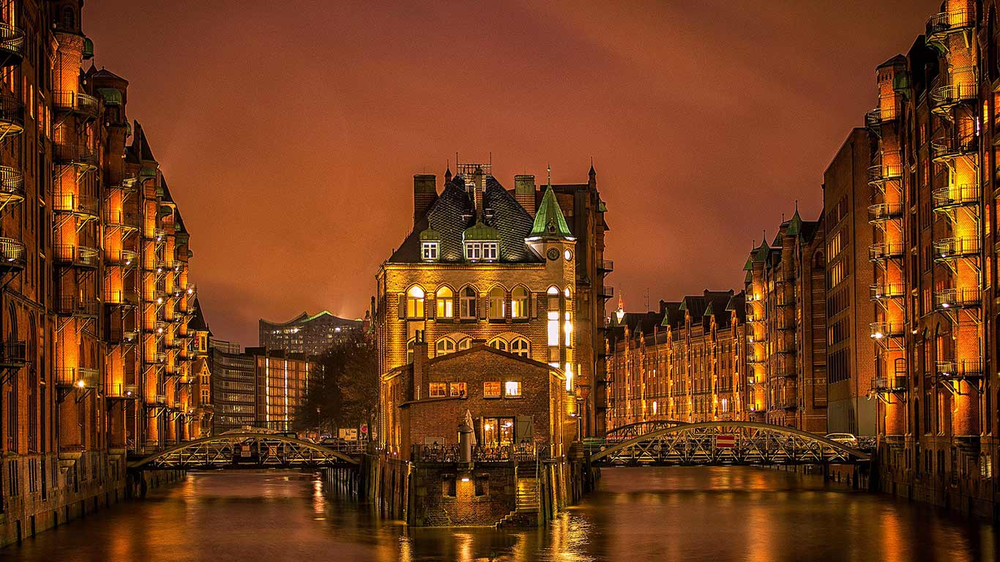

#### 20151007 Vignes côtes-du-rhône sur les coteaux des Dentelles de Montmirail, Gigondas, Vaucluse, PACA (© Adam Eastland/Alamy)(Bing France)

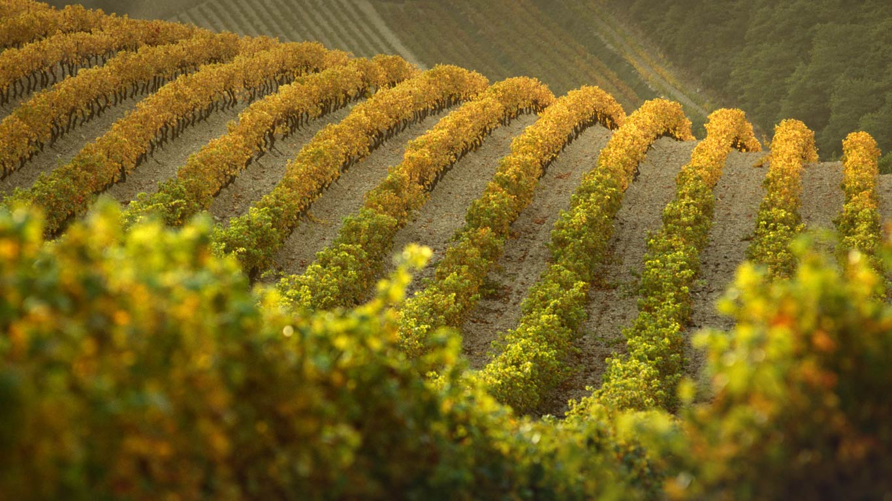

#### 20151006 Elephant Trunk Hill, Guilin, China (© Ajancso/Shutterstock)(Bing United Kingdom)

#### 20151005 Rainbow over Pretzfeld, Franconian Switzerland, Bavaria, Germany (© Dr. Rüdiger Hess/geo-select fotoArt)(Bing United Kingdom)

#### 20151004 Frankfurt am Main, Hessen, Deutschland (© ER_09/Shutterstock)(Bing Deutschland)

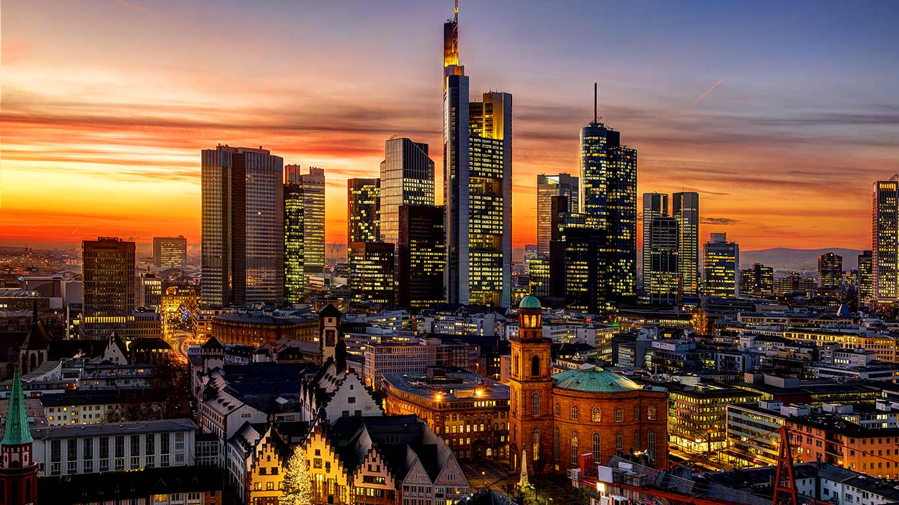

#### 20151004 The Carina Nebula (© NASA, ESA, N. Smith [University of California, Berkeley], and the Hubble Heritage Team [STScI/AURA])(Bing United Kingdom)

#### 20151003 Hot air balloons flying during the Albuquerque International Balloon Fiesta, New Mexico (© Blaine Harrington III/Corbis)(Bing United Kingdom)

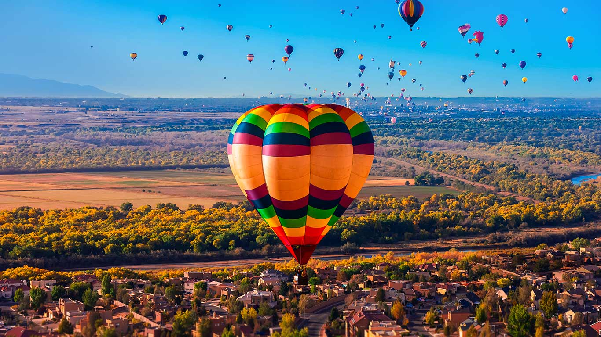

#### 20151002 [国庆快乐] 中国，四川，成都，礼花在黄龙溪古镇上空绽放。 (© Sipa Press/REX Shutterstock)(Bing China)

#### 20151002 Colourful façade of a building in Little India, Singapore (© Blue Sky Studio/Shutterstock)(Bing United Kingdom)

#### 20151001 Vue aérienne de Dinard, Ille-et-Villaine, Bretagne (© Camille Moirenc/Hemis.fr)(Bing France)

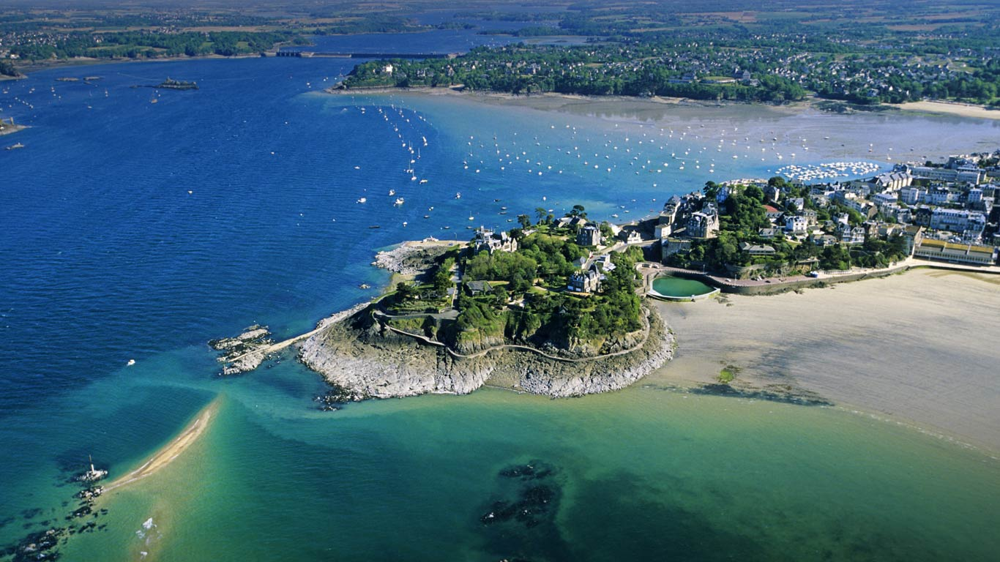

#### 20151001 Algae-covered pebbles at Church Ope Cove, Dorset, England (© Adam Burton/Robert Harding World Imagery/Getty Images)(Bing United Kingdom)

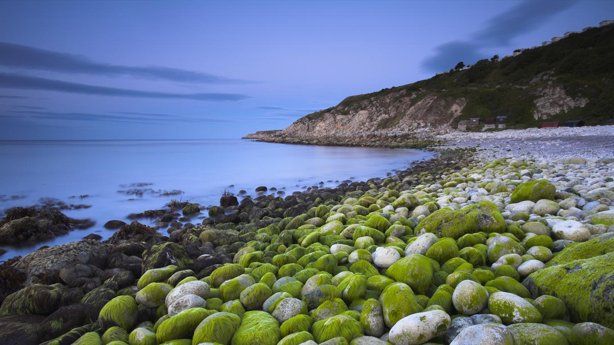

#### 20151001 Japanese maples in national historical site Butchart Gardens, Vancouver Island, British Columbia, Canada (© 2009fotofriends/Shutterstock)(Bing Canada)

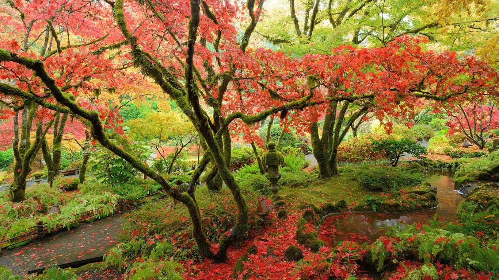

