#### 20151130 Highland dancers in Scotland (© Reuters/David Moir)(Bing United Kingdom)

#### 20151129 West Fork of Oak Creek Canyon in Arizona (© Tandem Stills + Motion)(Bing United Kingdom)

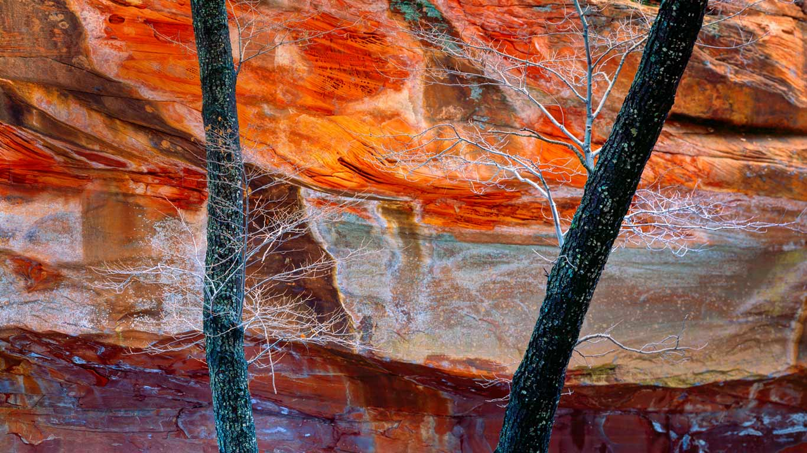

#### 20151128 Architectural detail of Rinpung Dzong in Paro, Bhutan (© Ocean/Corbis)(Bing United States)

#### 20151128 ｢地獄谷野猿公苑｣長野, 下高井郡 ( ©   ShutterStock )(Bing Japan)

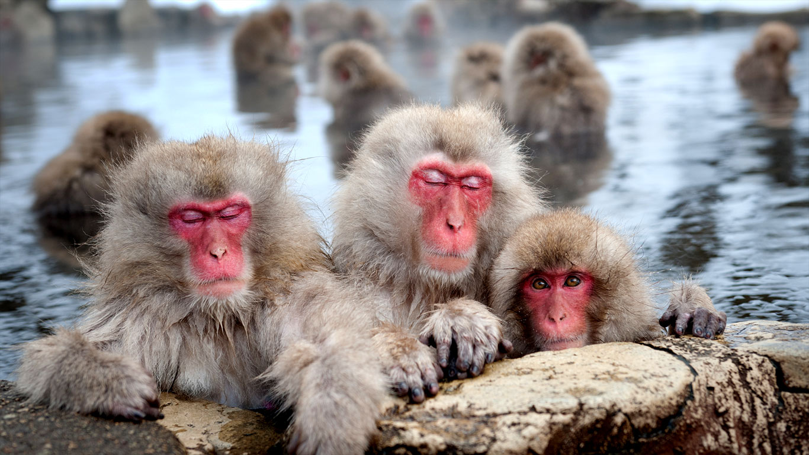

#### 20151128 Alnwick Castle on a frosty winter morning in Northumberland, England (© Adam Burton/robertharding/plainpicture)(Bing United Kingdom)

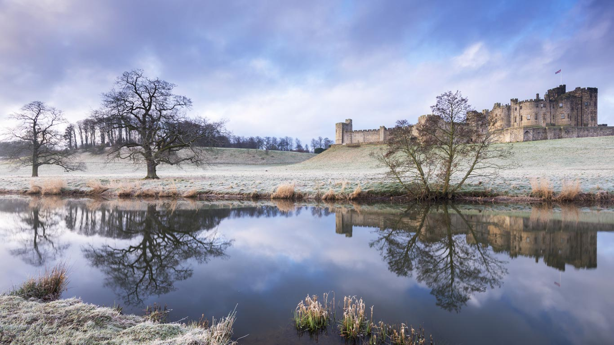

#### 20151127 Govăjdia blast furnace, Ghelari, Romania (© Grigore Roibu/plainpicture)(Bing United Kingdom)

#### 20151126 Yosemite National Park, California (© James O'Neil/Getty Images)(Bing United Kingdom)

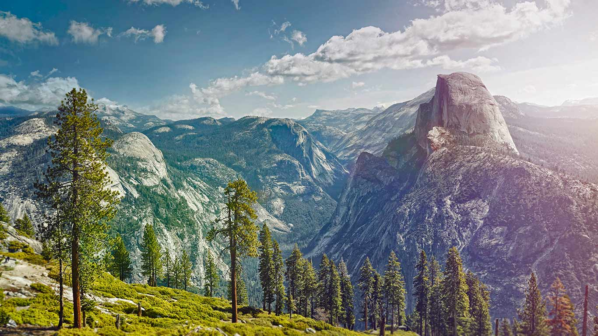

#### 20151126 Wild turkeys in Rio Grande, Texas (© Radius Images/Getty Images)(Bing United States)

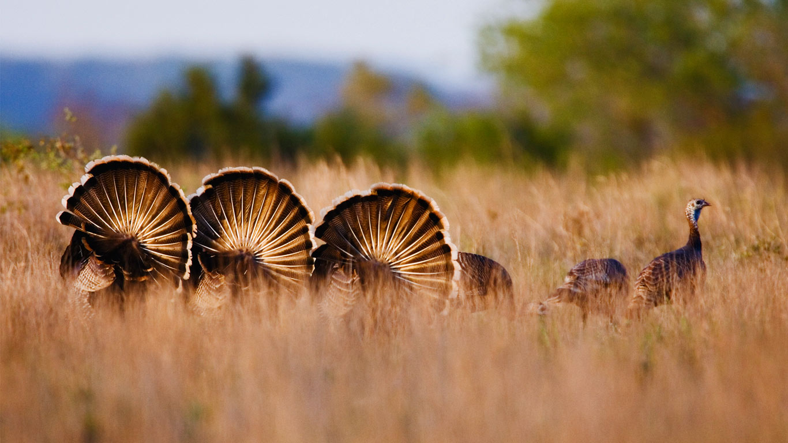

#### 20151125 Fire lanterns released during Loi Krathong in Chiang Mai, Thailand (© Kevin Landwer-Johan/Alamy)(Bing United Kingdom)

#### 20151124 [今日小雪]山西省，五台山，台怀镇，显通寺 (© Karl Johaentges/LOOK Die Bildagentur der Fotografen)(Bing China)

#### 20151124 Marine iguana eating algae off Fernandina Island, Galapagos Islands, Ecuador (© Tui De Roy/Minden Pictures)(Bing United Kingdom)

#### 20151124 Berchtesgadener Land, Bayern, Deutschland mit Blick auf Golling, Österreich (© Frank Fischbach/Alamy Stock Photo)(Bing Deutschland)

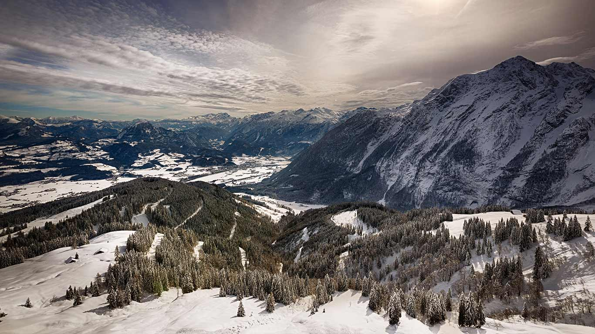

#### 20151123 Modica, Sicily, Italy (© Robert Harding World Imagery/Offset)(Bing United Kingdom)

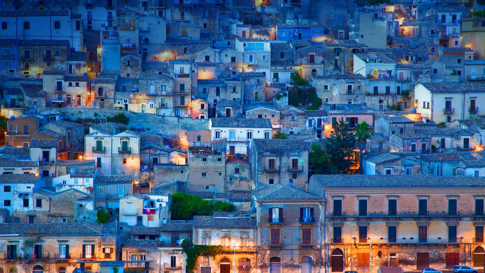

#### 20151123 Pipe segments for the Fort Peck Dam in Montana (© Margaret Bourke-White/The LIFE Picture Collection/Getty Images)(Bing United States)

#### 20151123 Abstract patterns in the wind polished ice of Abraham Lake, Alberta (© Alan Majchrowicz/age fotostock Spain S.L./Corbis)(Bing Canada)

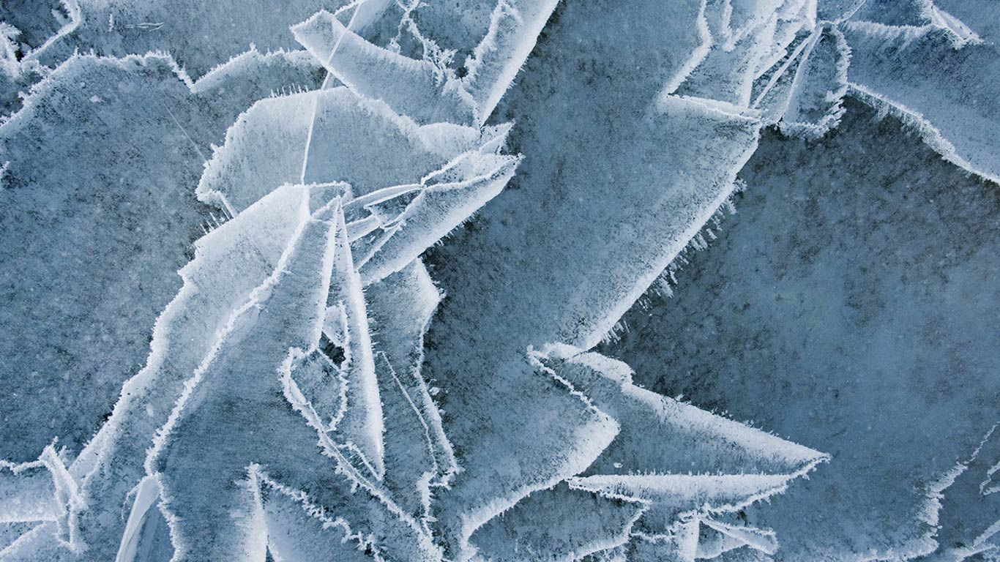

#### 20151122 Verreaux's sifaka in Berenty Reserve, Madagascar (© Cyril Ruoso/Minden Pictures)(Bing United Kingdom)

#### 20151121 Lake Superior Provincial Park, Ontario, Canada (© Don Johnston/Corbis)(Bing United Kingdom)

#### 20151120 Natural Bridge at Springbrook N.P. in Queensland, Australia (© Chameleon's Eye/Shutterstock)(Bing Australia)

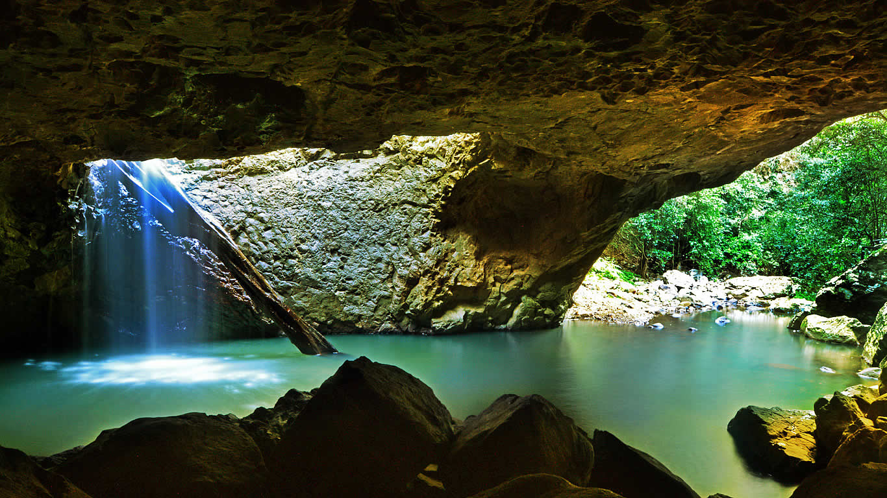

#### 20151120 The moon as seen from the International Space Station (© NASA)(Bing United Kingdom)

#### 20151120 View from the Cupola of the International Space Station (© NASA)(Bing United States)

#### 20151119 Museum at Prairiefire in Overland Park, Kansas (© Derek Siagle/Getty Images)(Bing United States)

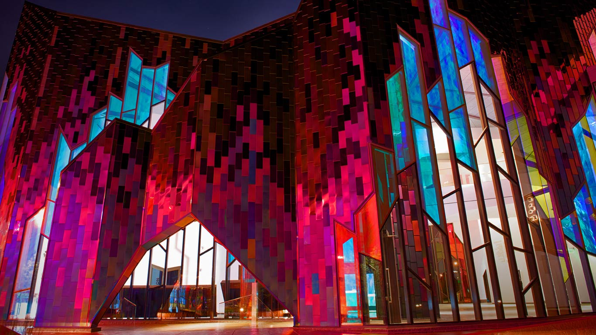

#### 20151119 Montagne de la Lance près de Dieulefit, Drôme, Rhône-Alpes (© Jean Gill/Getty Images)(Bing France)

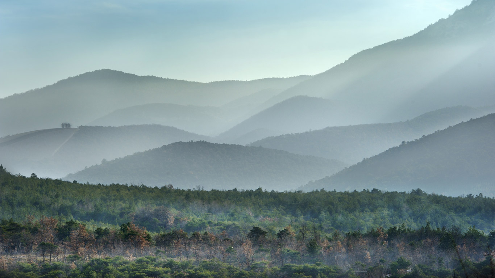

#### 20151119 Black grouse males, Bergslagen, Sweden (© E. Haarberg/Corbis)(Bing United Kingdom)

#### 20151118 Kanas National Nature Reserve in Xinjiang Province, China (© zhouyousifang/Getty Images)(Bing United Kingdom)

#### 20151118 Kloster Maulbronn, Baden-Württemberg, Deutschland (© Michael Weber/imageBROKER/age fotostock)(Bing Deutschland)

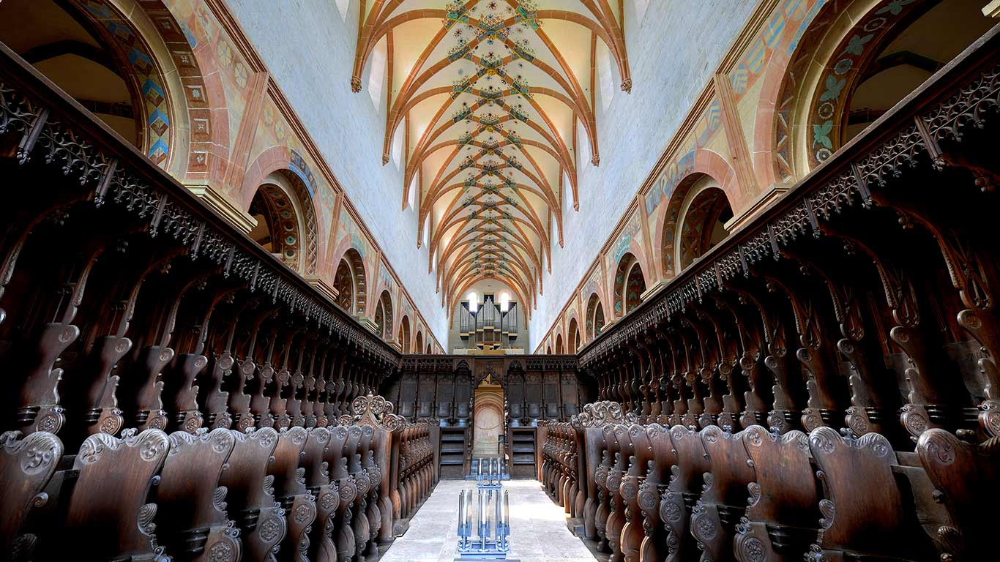

#### 20151118 Bougies disposées en forme de cœur en hommage aux victimes des attentats de Paris, Vieux-Port de Marseille le 14 novembre 2015 (© Jean-Paul Pelissier/Reuters)(Bing France)

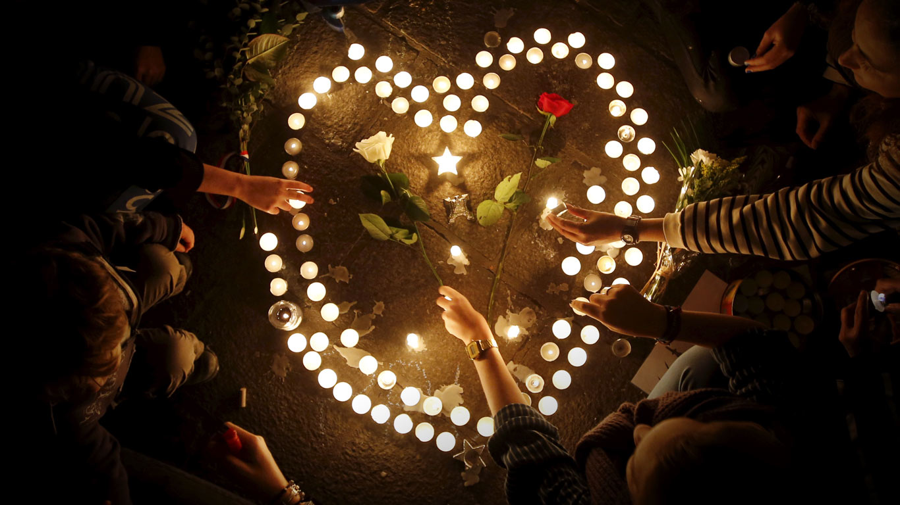

#### 20151117 View of the Eiffel Tower from the Trocadero (© Stefano Brozzi/SIME/4Corners)(Bing Australia)

#### 20151117 法国，巴黎，埃菲尔铁塔 (© Stefano Brozzi/SIME/4Corners)(Bing China)

#### 20151117 Reykjavik, Iceland (© Arctic-Images/Getty Images)(Bing United Kingdom)

#### 20151116 View of the Eiffel Tower from the Trocadero (© Stefano Brozzi/SIME/4Corners)(Bing United Kingdom)

#### 20151116 Des bougies sont allumées lors d’un rassemblement à Hong Kong en hommage aux victimes des attentats commis à Paris, 14 novembre 2015 (© Kin Cheung/AP)(Bing France)

#### 20151115 Epupa Falls between Angola and Namibia (© Frank Tusch/plainpicture)(Bing United Kingdom)

#### 20151114 Rock formations on The Loop, Kalbarri National Park, Australia (© R. Ian Lloyd/Masterfile)(Bing United Kingdom)

#### 20151113 Island of Janitzio in Lake Pátzcuaro, Mexico (© Brian Overcast/Alamy)(Bing United Kingdom)

#### 20151112 White Bluffs wilderness, Washington (© Jon Cornforth/Danita Delimont)(Bing United Kingdom)

#### 20151112 © Frank Sommariva/imageBROKER/Corbis(Bing Canada)

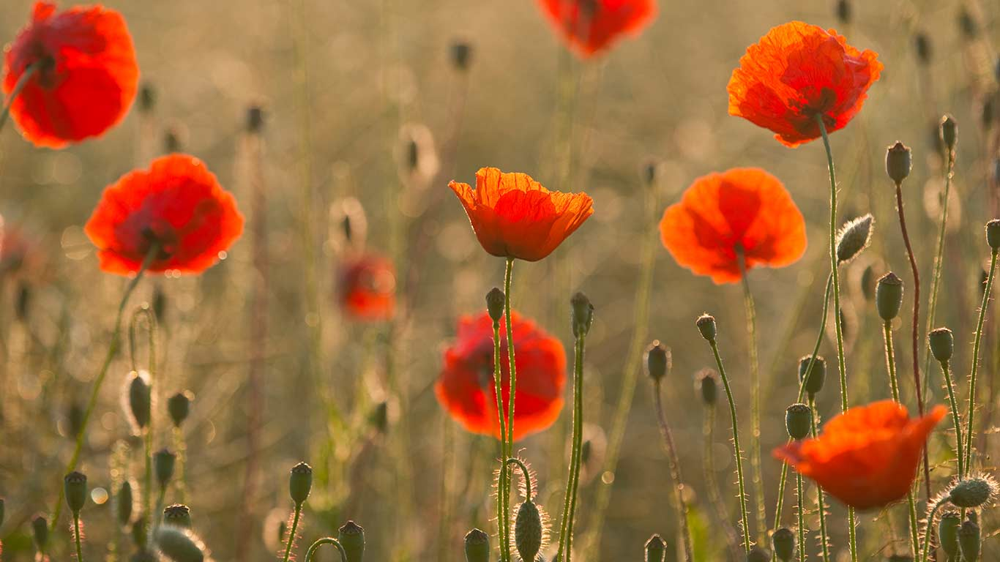

#### 20151112 Escalier de l’arc de triomphe de l’Étoile, Paris (© Art Wolfe/Plain Picture)(Bing France)

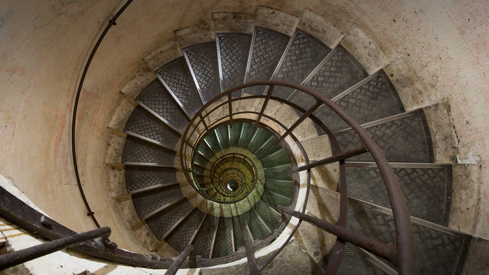

#### 20151111 World War II Memorial, Washington, DC (© Ixefra/Getty Images)(Bing United States)

#### 20151111 Schafherde mit Ziege, Main-Spessart, Bayern, Deutschland (© Dr. Rüdiger Hess/geo-select fotoArt)(Bing Deutschland)

#### 20151111 A field of poppies in the South Downs National Park near Brighton (© Antony Spencer Photography/Moment/Getty Images)(Bing United Kingdom)

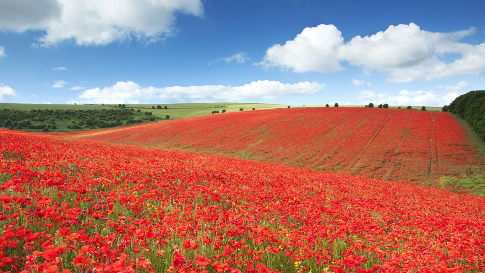

#### 20151110 Aerial view of Chinatown, Singapore (© Eddie Cheng/500px)(Bing United Kingdom)

#### 20151109 [今日立冬] 中国，吉林，雾凇与公路 (© Zhijun Sun/TAO Images Limited/Alamy Stock Photo)(Bing China)

#### 20151109 Catatumbo lightning over Zulia, Venezuela (© TOURISM MINISTRY/Xinhua Press/Corbis)(Bing United Kingdom)

#### 20151108 Pygmy goats headbutting (© Robert Pickett/Visuals Unlimited, Inc.)(Bing United Kingdom)

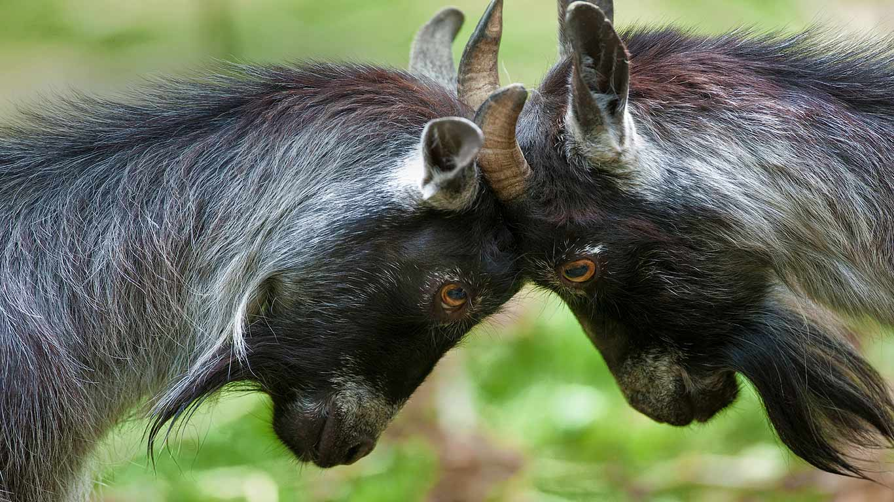

#### 20151108 © Shutterstock(Bing Canada)

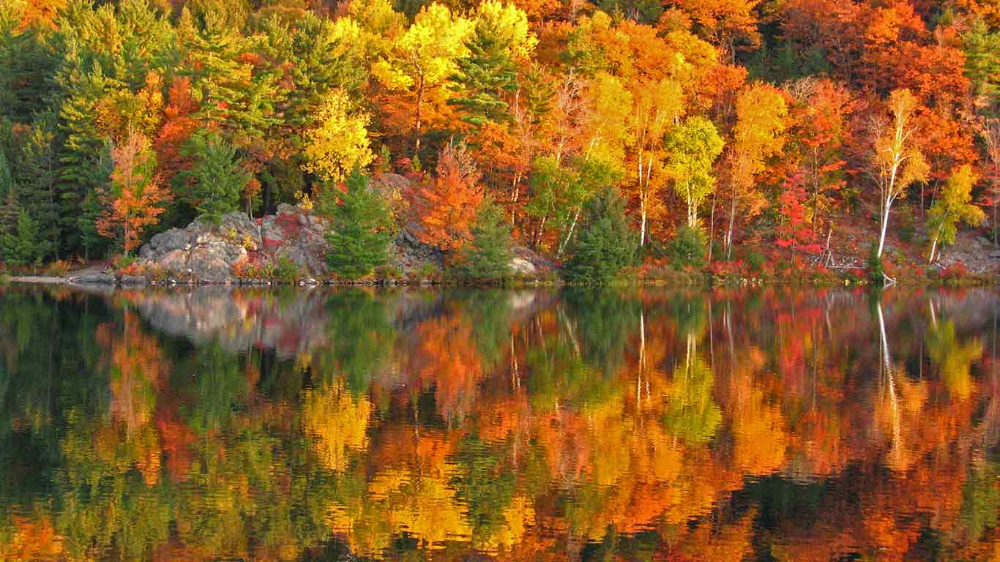

#### 20151107 Crown Point at Columbia River Gorge, Oregon (© JPL Designs/Shutterstock)(Bing United States)

#### 20151107 Corfe Castle shrouded in mist at sunrise in Dorset (© Mark Bauer/Loop Images/Corbis)(Bing United Kingdom)

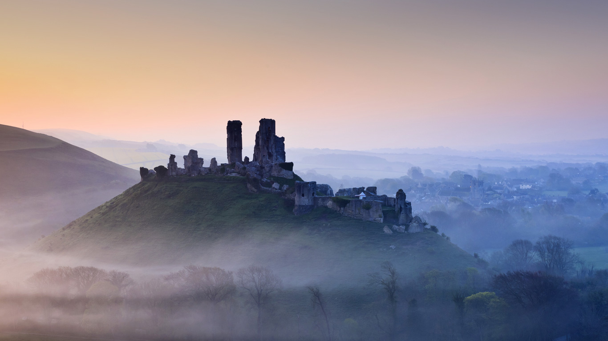

#### 20151106 Sea anemone off the coast of Thailand (© ThanakonHD/Creatas/Getty Images)(Bing United Kingdom)

#### 20151105 A fireworks display in Battersea Park, London (© Roger Cracknell 01/classic/Alamy Stock Photo)(Bing United Kingdom)

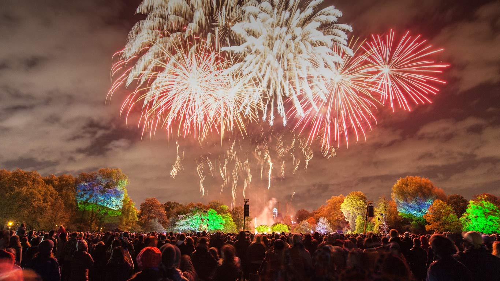

#### 20151104 A great grey owl on the hunt (© Jan Vermeer/Minden Pictures)(Bing United Kingdom)

#### 20151104 Emerald lake, Yoho National park (© Feng Yu/Shutterstock)(Bing Canada)

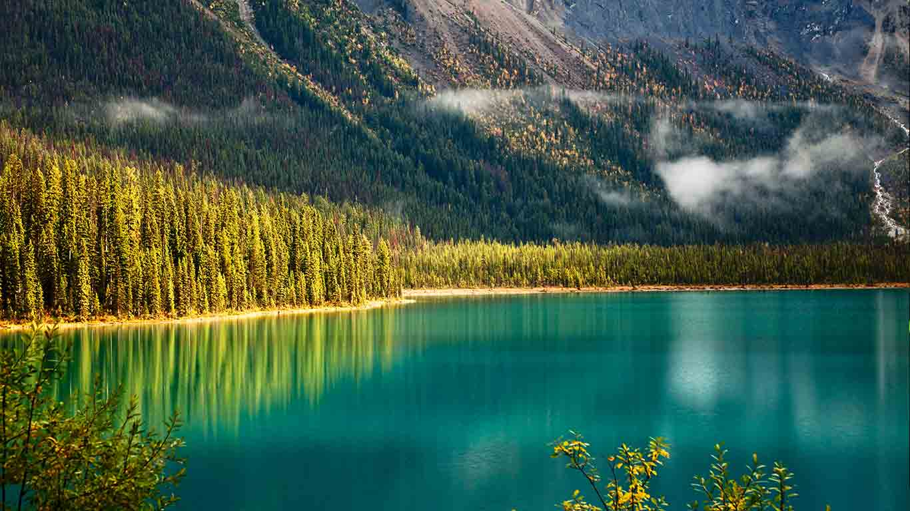

#### 20151103 Archers at the Meiji Shrine, Tokyo, Japan (© Rob Tilley/Danita Delimont)(Bing United Kingdom)

#### 20151102 Wave Rock near Hyden in Western Australia (© Eye Ubiquitous/age fotostock)(Bing Australia)

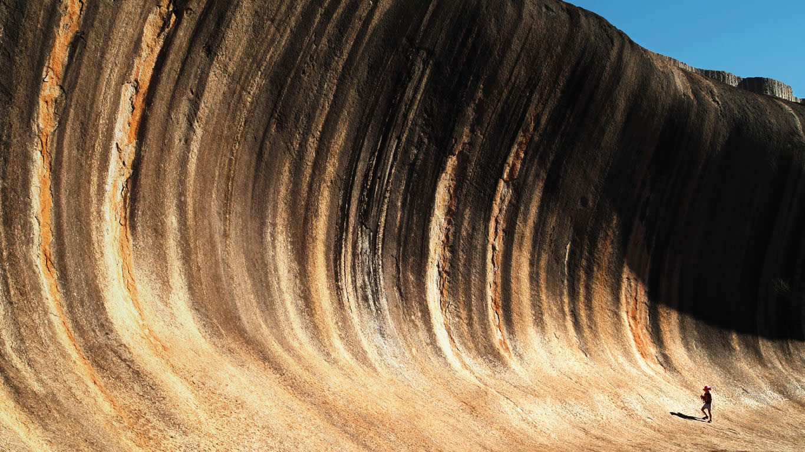

#### 20151102 Fall Colours, Toad River, Northern British Columbia (© Yves Marcoux/Design Pics)(Bing Canada)

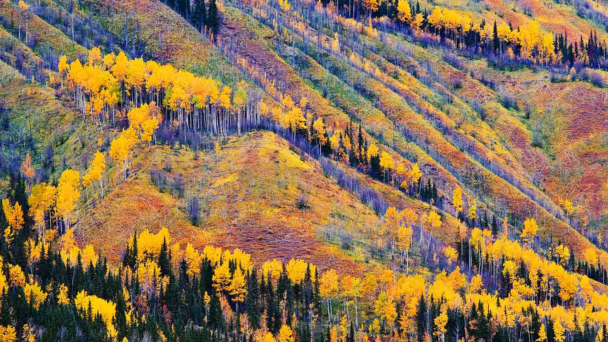

#### 20151102 Jardin du Luxembourg, Paris, France (© Jean-Pierre Lescourret/Getty Images)(Bing United Kingdom)

#### 20151101 Day of the Dead calavera figurines (© Inti St. Clair/Blend Images/Getty Images)(Bing United Kingdom)

