#### 20160430 Cirrus clouds over Guadalupe Mountains National Park, Texas (© Viktor Posnov/Getty Images)(Bing United Kingdom)

#### 20160429 Oak tree canopy in Roudsea Wood, Cumbria (© Chris Mattison/Minden Pictures)(Bing United Kingdom)

#### 20160428 A view of the distant hills from 'Atom' above Wycoller village (© David McCulloch/Alamy)(Bing United Kingdom)

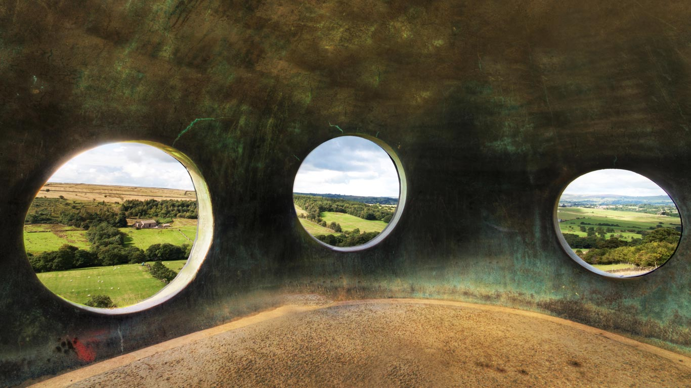

#### 20160427 Grampians National Park (Gariwerd) in Victoria, Australia (© Ingo Oeland/Alamy)(Bing Australia)

#### 20160427 Common kestrel hunting for rodents (© Bertie Gregory/Corbis)(Bing United Kingdom)

#### 20160426 Tassilolinde, Wessobrunn, Bayern, Deutschland (© Florian Werner/Getty Images)(Bing Deutschland)

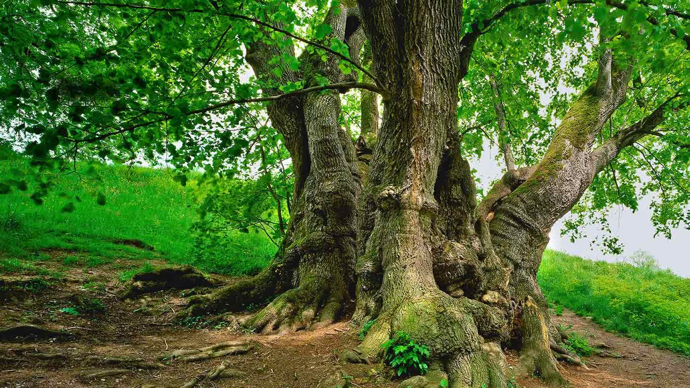

#### 20160426 Sunlight reflecting on rice paddy terraces, Yuanyang County, China (© Eastphoto/age fotostock)(Bing United Kingdom)

#### 20160425 Oasis town of Taghit, Algeria (© George Steinmetz/Corbis)(Bing United Kingdom)

#### 20160425 Common Sundew (Drosera rotundifolia), Prince Rupert, B.C. (© Minden Pictures)(Bing Canada)

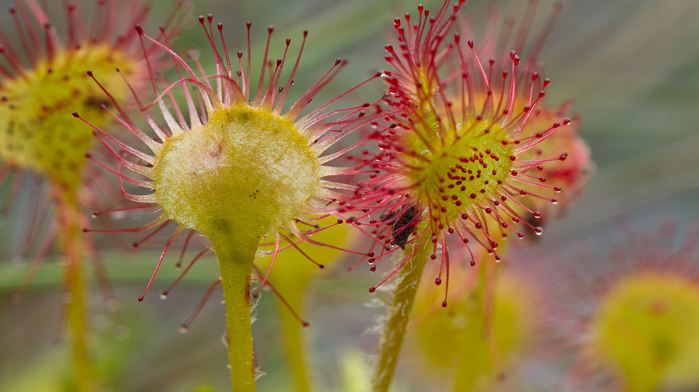

#### 20160424 Kilauea erupting, Hawai’i Volcanoes National Park (© Art Wolfe/Getty Images)(Bing United Kingdom)

#### 20160424 American bison on the Little Missouri River in Theodore Roosevelt National Park, North Dakota (© Tom & Pat Leeson/Science Photo Library)(Bing United States)

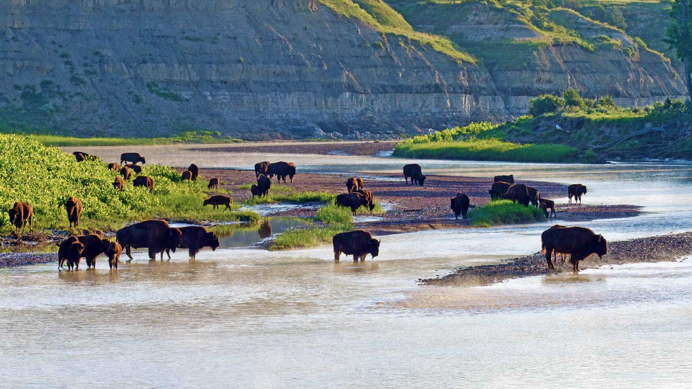

#### 20160424 Hopfen (© jeka1984/Getty Images)(Bing Deutschland)

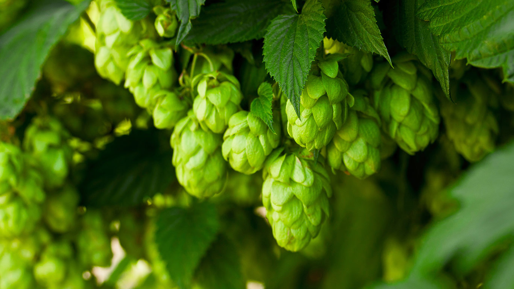

#### 20160423 Stained glass windows showing St George and the Dragon at St George's Hall, Liverpool (© Lee Beel/Alamy)(Bing United Kingdom)

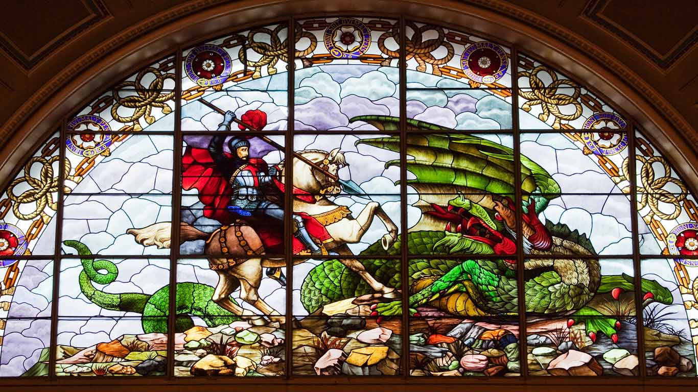

#### 20160422 Pièces de puzzle dans un bassin, festival international des jardins de Chaumont-sur-Loire, Loir-et-Cher (© Biosphoto/Superstock)(Bing France)

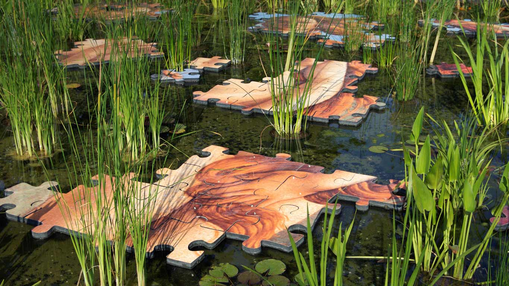

#### 20160422 Aerial view of Everglades National Park in Florida (© Juan Carlos Muñoz/age fotostock/Alamy)(Bing United States)

#### 20160422 Bloom of microscopic phytoplankton scattered across the surface of the Black Sea (© NASA/Corbis)(Bing United Kingdom)

#### 20160421 Putty Beach in New South Wales, Australia (© Steve Daggar Photography/Moment/Getty Images)(Bing United Kingdom)

#### 20160421 North Window Arch in Arches National Park, Utah (© Clarence Spencer)(Bing United States)

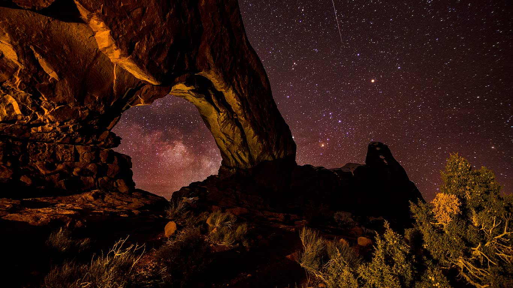

#### 20160420 A group of joggers run across the Humber Bay Arch Bridge in Toronto, Canada (© Mark Blinch/REUTERS)(Bing United Kingdom)

#### 20160420 【今日谷雨】四川省，正在梯田里插秧的农民 (© China Stringer Network/Reuters)(Bing China)

#### 20160420 Newfound Gap in the Great Smoky Mountains National Park between North Carolina and Tennessee (© Darrell Gulin/Exactostock-1598/SuperStock)(Bing United States)

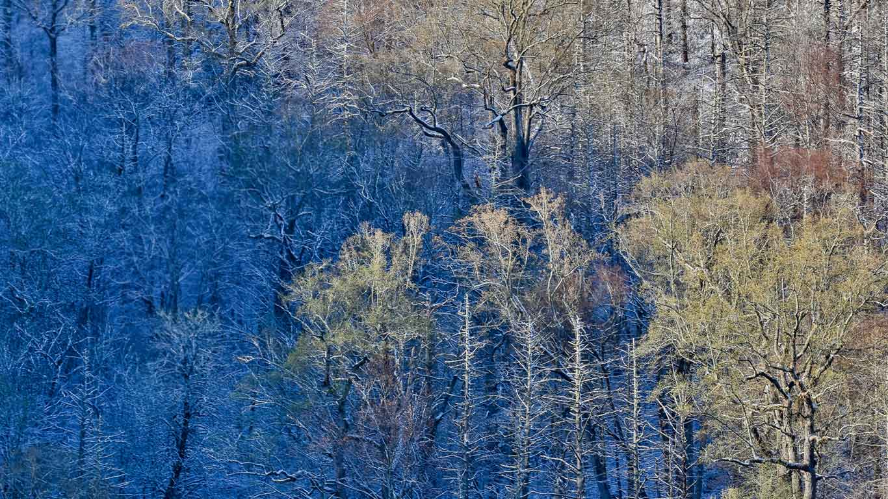

#### 20160419 ｢光の祭典｣フランス, リヨン (© Hemis.fr/Superstock)(Bing Japan)

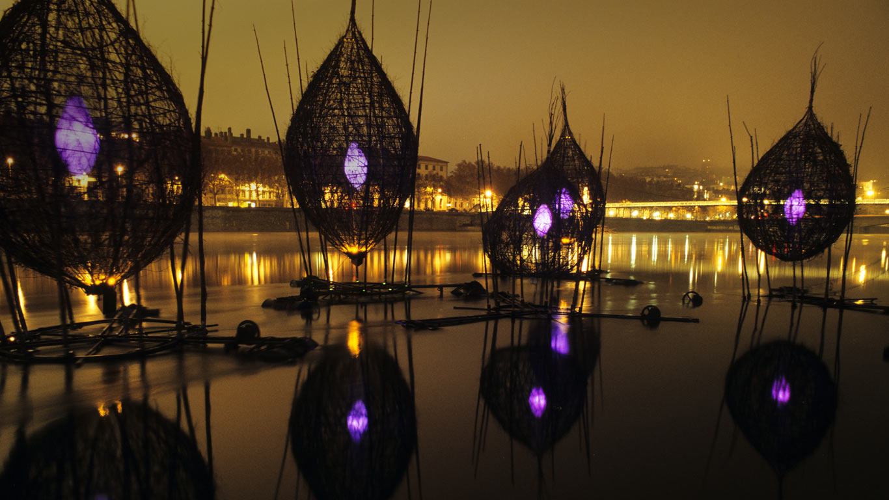

#### 20160419 Western gull chick in Channel Islands National Park, California (© George H.H. Huey/Alamy)(Bing United Kingdom)

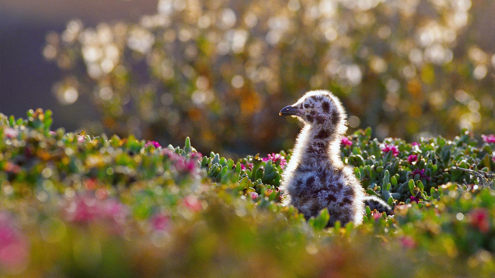

#### 20160418 Tepees area, Petrified Forest National Park, Arizona (© Wilsilver77/Getty Images)(Bing United States)

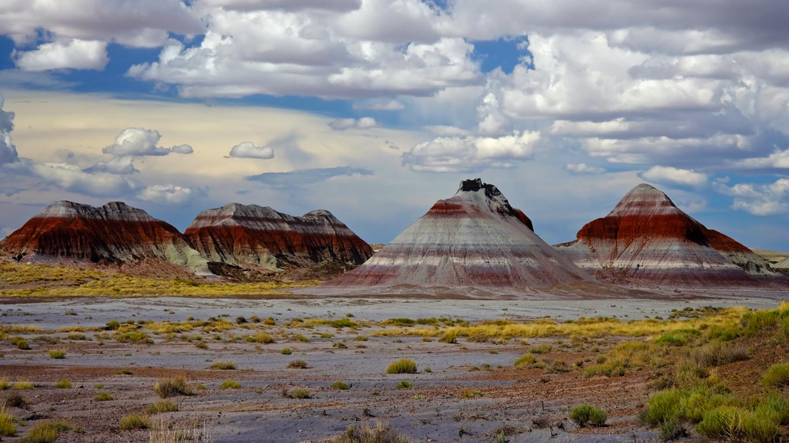

#### 20160418 A road winding through Cheddar Gorge, Somerset (© SIME/eStock Photo)(Bing United Kingdom)

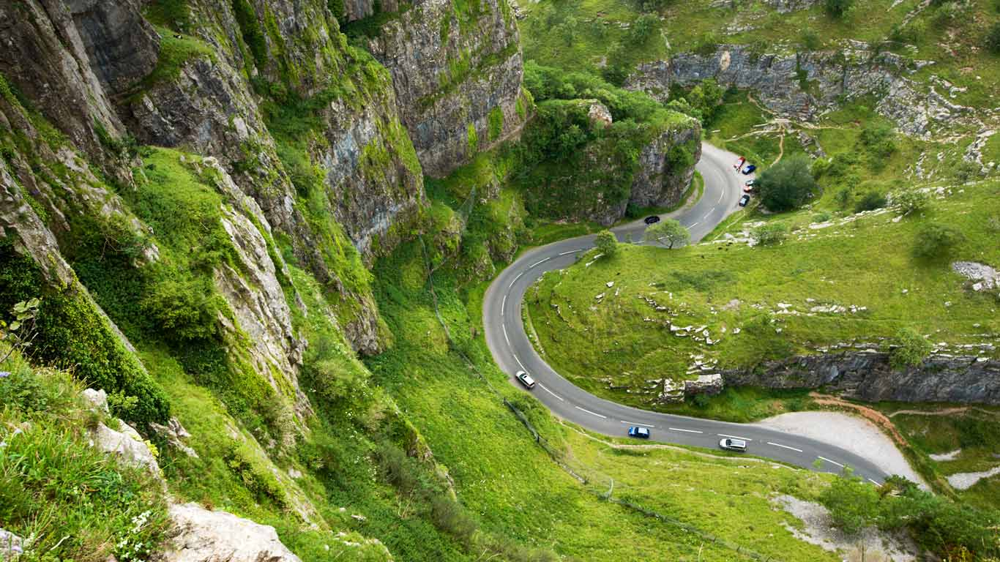

#### 20160417 Milky Way over Namgyal Tsemo Monastery in Leh, Ladakh, India (© Panom Bounak/500px)(Bing Canada)

#### 20160417 Swiftcurrent Lake in Glacier National Park, Montana (© Dean Fikar/Getty Images)(Bing United States)

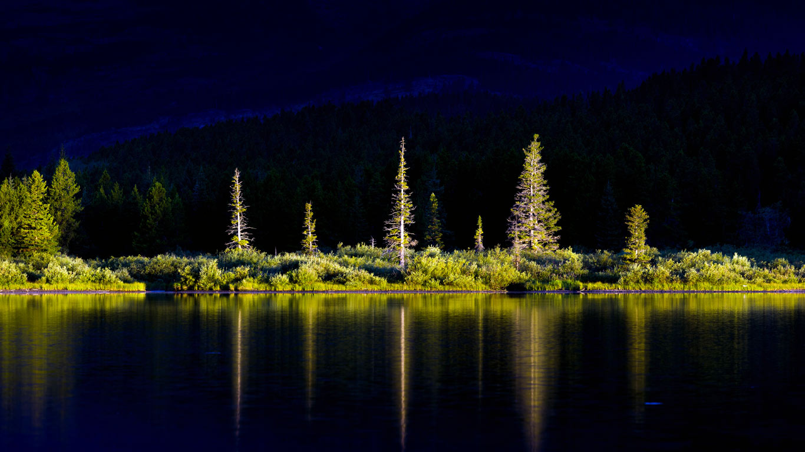

#### 20160417 Fishing docks on the Sado Estuary, near Comporta, Portugal (© Francesco Carovillano/Tandem Stills + Motion)(Bing United Kingdom)

#### 20160416 ｢吉野の桜｣奈良, 吉野山 (© Sean Pavone/Alamy Stock Photo)(Bing Japan)

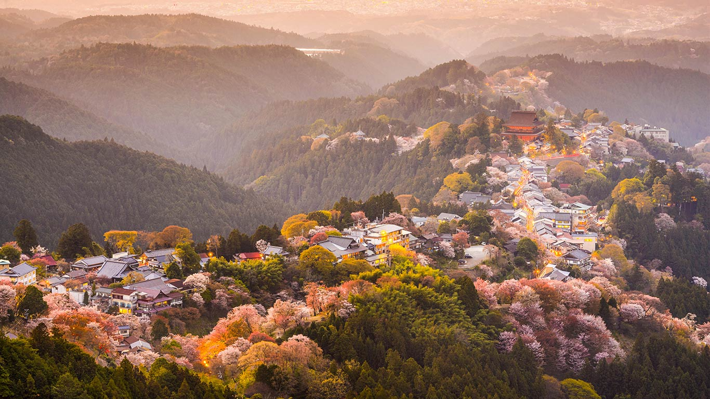

#### 20160416 Waterfall and moss, Shenandoah National Park, Virginia (© Oliver Gerhard/imageBROKER/Alamy)(Bing United States)

#### 20160416 Friendship Square in Dalian, China (© Rob Whitworth/Getty Images)(Bing United Kingdom)

#### 20160415 A snorkeller in the Mediterranean Sea at Cabo de Gata-Níjar Natural Park in Spain (© David Santiago Garcia/Aurora Photos)(Bing United Kingdom)

#### 20160414 Gare Saint-Lazare Train Station, Paris, France (© Hal Bergman/Getty Images)(Bing United Kingdom)

#### 20160414 Alpine yellow gum trees and wildflowers in Tasmania (© Marc Anderson/Alamy)(Bing Australia)

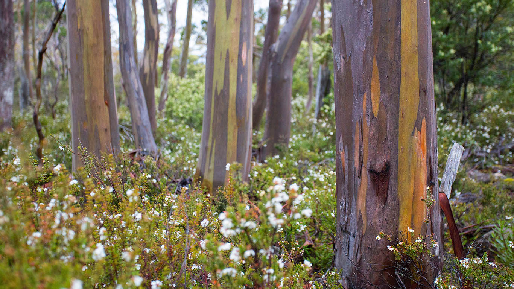

#### 20160413 Spring trees in a misty valley, Lively, Sudbury, Ontario (© Don Johnston/All Canada Photos/Age Fotostock)(Bing Canada)

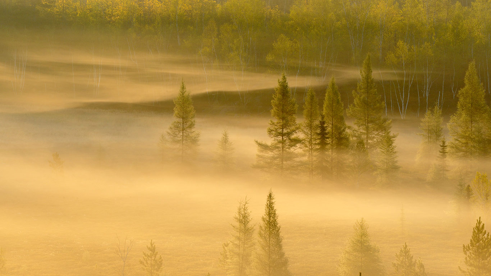

#### 20160413 The Singing Ringing Tree Panopticon over Burnley (© Alan Novelli/Alamy)(Bing United Kingdom)

#### 20160412 Composite satellite image of the Ugab River in Namibia (© NASA)(Bing United Kingdom)

#### 20160412 Basstölpel, Helgoland, Schleswig-Holstein, Deutschland (© Edwin Giesbers/NPL/Minden Pictures)(Bing Deutschland)

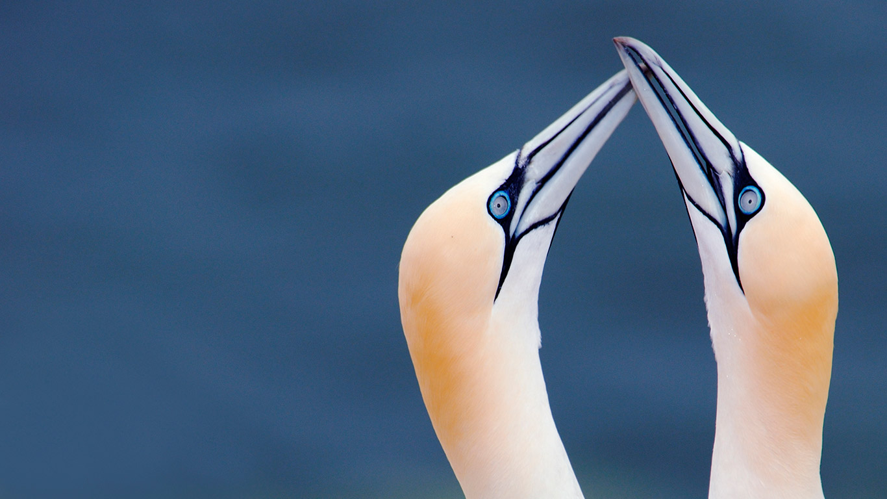

#### 20160411 Cave on the Jordanian shore of the Dead Sea near Zara Spring (© George Steinmetz/Corbis)(Bing United Kingdom)

#### 20160410 Coffee sprouts in Costa Rica (© Istvan Kadar Photography/Getty Images)(Bing United Kingdom)

#### 20160409 上海交大徐汇校区老图书馆 (© Xin Du)(Bing China)

#### 20160409 ｢弘前城｣青森, 弘前市 (© Aflo/Corbis)(Bing Japan)

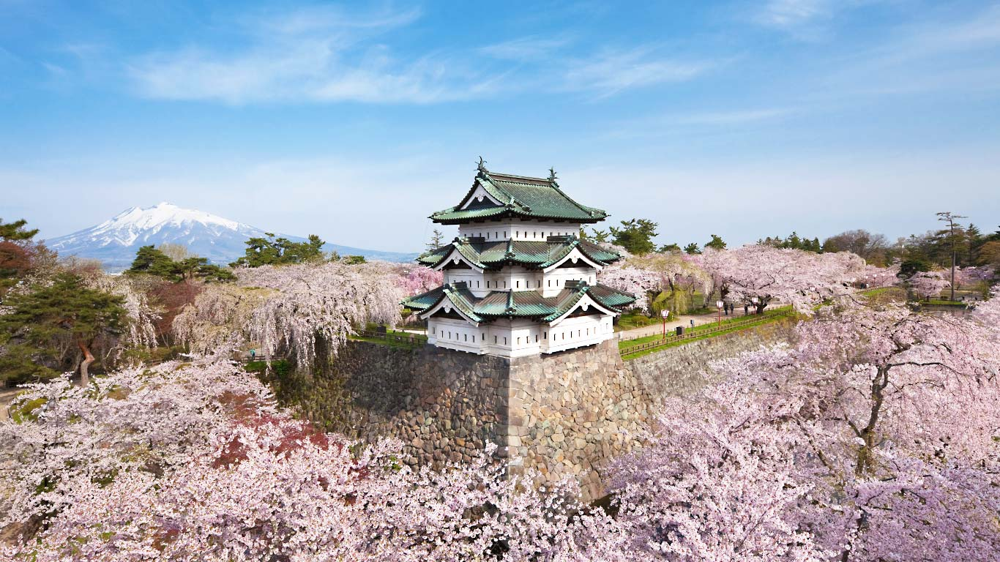

#### 20160409 Riders and horses compete at Aintree Racecourse (© Shaun Botterill/Getty Images)(Bing United Kingdom)

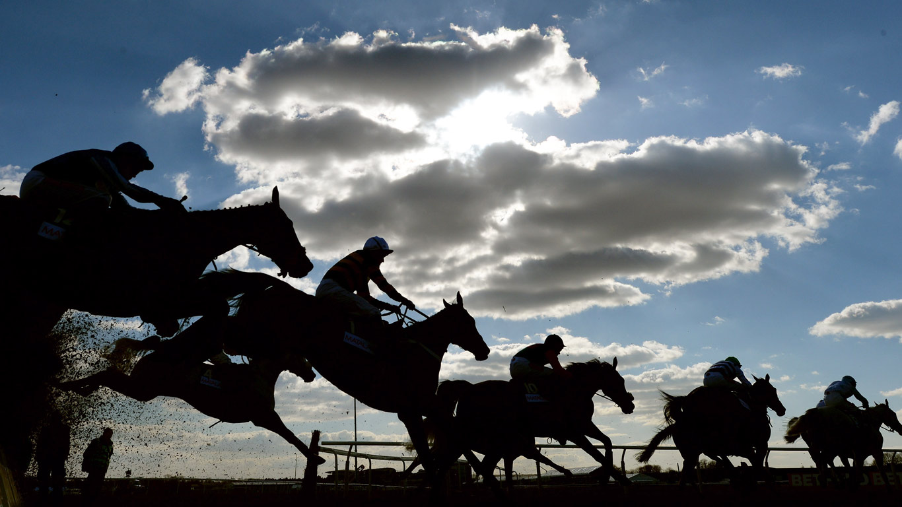

#### 20160408 Long-tailed glossy starlings (© FuYi Chen/500px)(Bing United Kingdom)

#### 20160407 Sunrise at Pura Ulun Danu Bratan temple in Bali, Indonesia (© Rat007/Shutterstock)(Bing United Kingdom)

#### 20160406 Opening ceremony of the 1896 Olympic Games in Panathinaiko Stadium, Athens, Greece (© Eye Ubiquitous/UIG/Getty Images)(Bing United Kingdom)

#### 20160405 【今日清明】云栖凉亭（© Andy Brandl/Getty Images）(Bing China)

#### 20160405 Massive selenite crystals in the Cave of the Crystals in Naica, Mexico (© Carsten Peter/Getty Images)(Bing United Kingdom)

#### 20160405 Leuchtturm Westerheversand, Westerhever, Schleswig-Holstein, Deutschland (© Volker Banken/plainpicture)(Bing Deutschland)

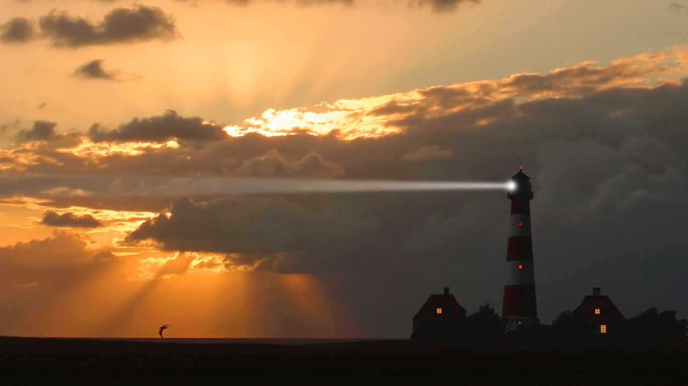

#### 20160404 Rannoch Moor, Scotland (© Jason Friend/Loop Images/Superstock)(Bing United Kingdom)

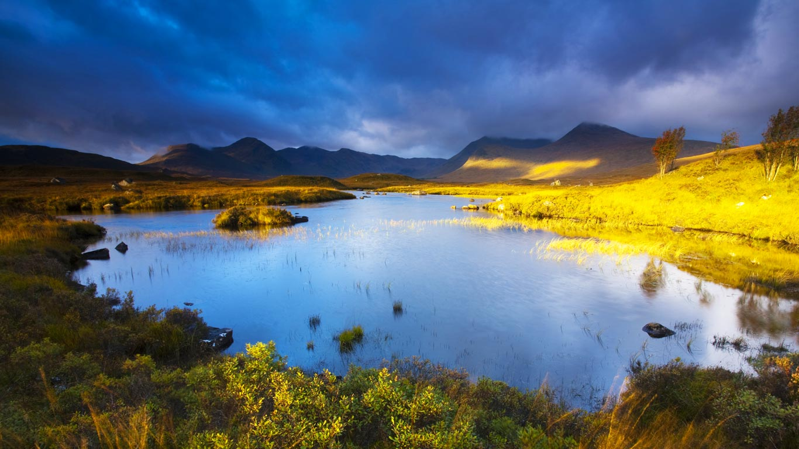

#### 20160404 Athlètes participant au 39e marathon de Paris, le 12 avril 2015 (© EPA/Ian Langsdon/Alamy)(Bing France)

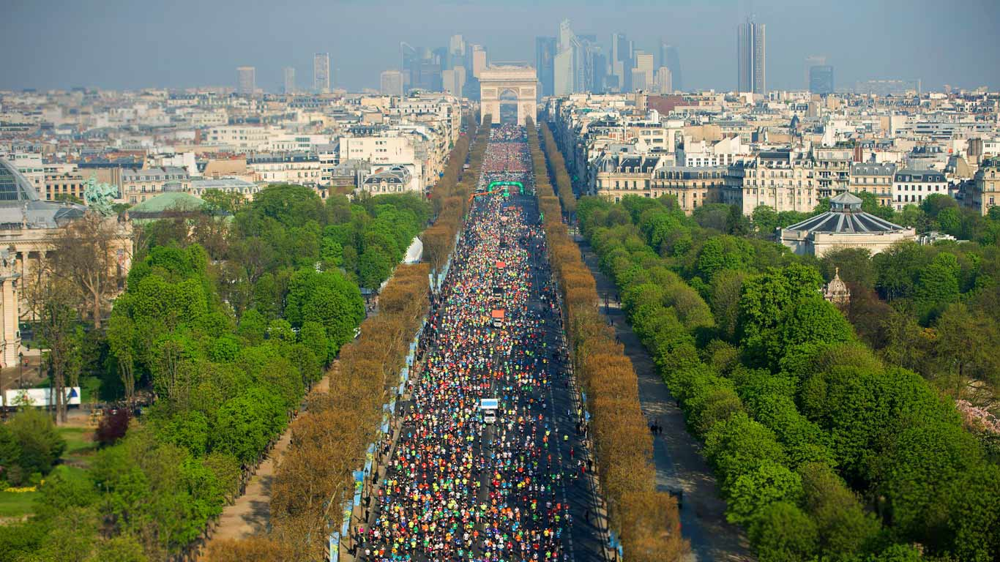

#### 20160403 Reflection on the lake at Bergpark Wilhelmshöhe in Kassel, Germany (© Chinch Gryniewicz/plainpicture)(Bing United Kingdom)

#### 20160403 Scanning electron microscope (SEM) image of vaterite (© Science Photo Library)(Bing United States)

#### 20160402 White Pocket in the Vermilion Cliffs National Monument, Arizona (© Harun Mehmedinovic/Tandem Stills + Motion)(Bing United Kingdom)

#### 20160402 Kakadu National Park in the Northern Territory, Australia (© Danita Delimont/Getty Images)(Bing Australia)

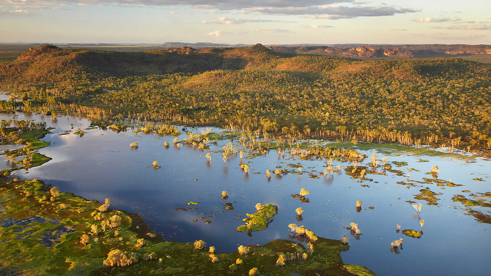

#### 20160401 Puffins (© Nicram Sabod/Shutterstock)(Bing United Kingdom)

