#### 20160531 Paraglider over Lake Thun, Switzerland (© Uli Wiesmeier/Getty Images)(Bing United Kingdom)

#### 20160531 瓦登海域的北弗里西亚群岛中，Norderoog岛的鸟瞰图，石勒苏益格－荷尔斯泰因州，德国 (© Holger Weitzel/imageBROKER/Alamy)(Bing China)

#### 20160530 Guard at the Tomb of the Unknowns, Arlington National Cemetery, Virginia (© Mira/Alamy)(Bing United States)

#### 20160530 Rose Garden, Butchart Gardens, Greater Victoria, B.C. (© Elfi Kluck/Getty Images)(Bing Canada)

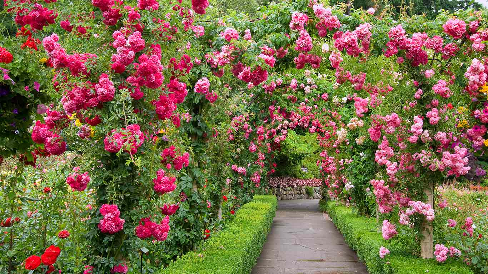

#### 20160530 Dyed silk hanging to dry in Marrakech, Morocco (© David Noton Photography/Alamy)(Bing United Kingdom)

#### 20160529 Mural in the Desert View Watchtower at Grand Canyon National Park, Arizona (© Richard Nowitz/National Geographic Creative/Alamy)(Bing United Kingdom)

#### 20160528 Namib Desert at the Atlantic Ocean in Africa (© Robert Harding World Imagery/Offset)(Bing United Kingdom)

#### 20160527 Striped skunk kit smelling a wildflower (© Tim Fitzharris/Minden Pictures)(Bing United Kingdom)

#### 20160526 Lake Siskiyou reflects snowy Mount Shasta in northern California (© Walter Bibikow/Danita Delimont/Alamy)(Bing United Kingdom)

#### 20160525 An elevated walkway in the Lujiazui district of Shanghai, China (© Mark Harris/Getty Images)(Bing United Kingdom)

#### 20160525 Gewitter über dem Bodensee, Konstanz, Baden-Württemberg, Deutschland (© imagebroker.net/SuperStock)(Bing Deutschland)

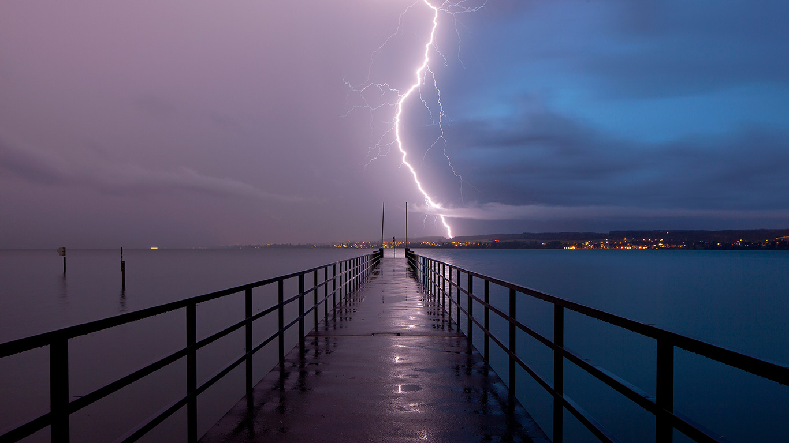

#### 20160524 A green sea turtle shows off its shell (© Sergi Garcia Fernandez/Minden Pictures)(Bing United Kingdom)

#### 20160523 Burano in the Venetian Lagoon, Italy (© Digitaler Lumpensammler/Getty Images)(Bing United Kingdom)

#### 20160521 An aerial view of football pitches in London (© Cityscape Digital/Gallery Stock)(Bing United Kingdom)

#### 20160521 Blooming butterweed in Congaree National Park, South Carolina (© Jeff Lepore/Alamy)(Bing United States)

#### 20160520 A red grouse at Cairngorms National Park, Scotland (© Frischknecht/blickwinkel/Alamy)(Bing United Kingdom)

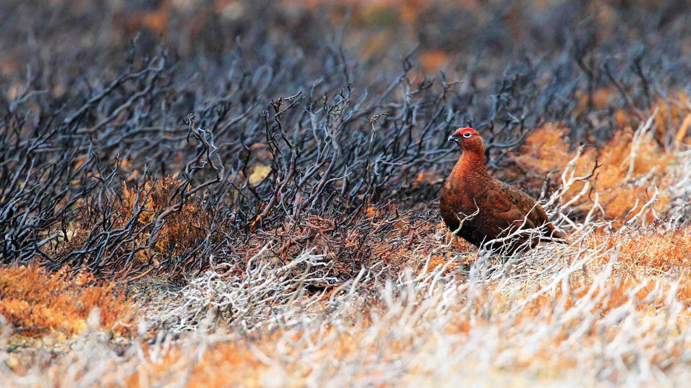

#### 20160519 Installation by land artist Paul de Kort in De Biesbosch National Park, Netherlands (© Frans Lemmens/Alamy)(Bing United Kingdom)

#### 20160518 Inside the Natural History Museum, London (© BEW Authors/BE&W/age fotostock)(Bing United Kingdom)

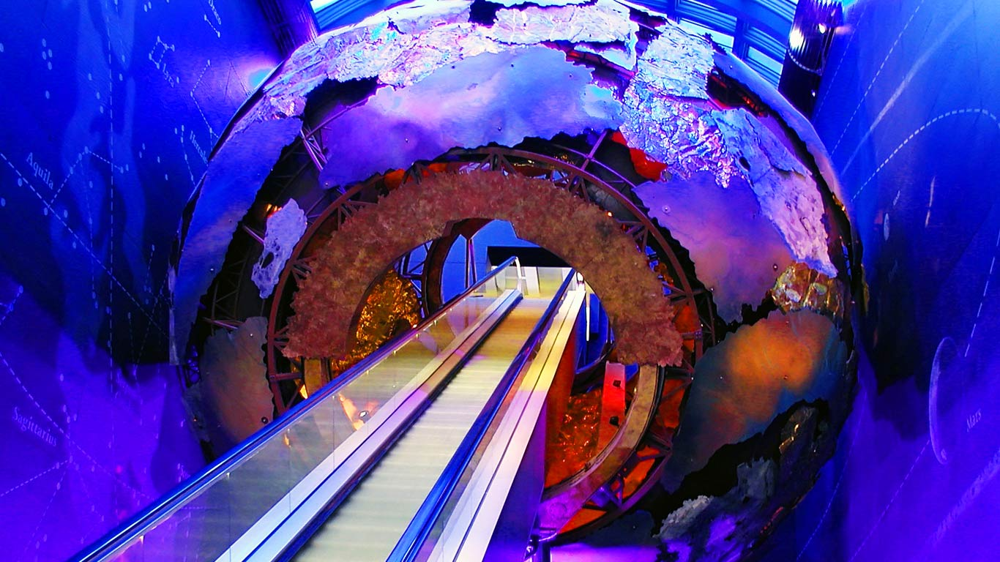

#### 20160518 The Biosphere museum in Montreal, Canada (© Guenther Schwermer/REX/Shutterstock)(Bing United States)

#### 20160517 Inside an ice cave in Oregon's Three Sisters Wilderness (© Marc Adamus/Aurora Photos)(Bing United Kingdom)

#### 20160516 Coloured scanning electron micrograph of a seven-spot ladybird in flight (© Power and Syred/Science Photo Library)(Bing United Kingdom)

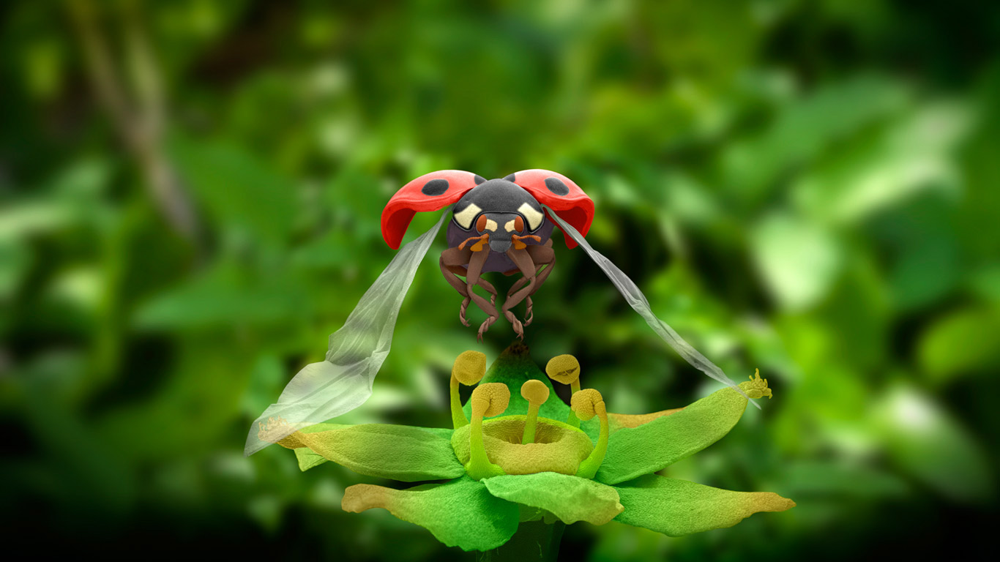

#### 20160515 Fox kits playing in the Rocky Mountain foothills near Cascade, Montana (© Jason Savage/Tandem Stills + Motion)(Bing United Kingdom)

#### 20160515 Red and purple tulips in front of the Peace Tower, part of the Parliament buildings in Ottawa. (© Danielle Donders/Getty Images)(Bing Canada)

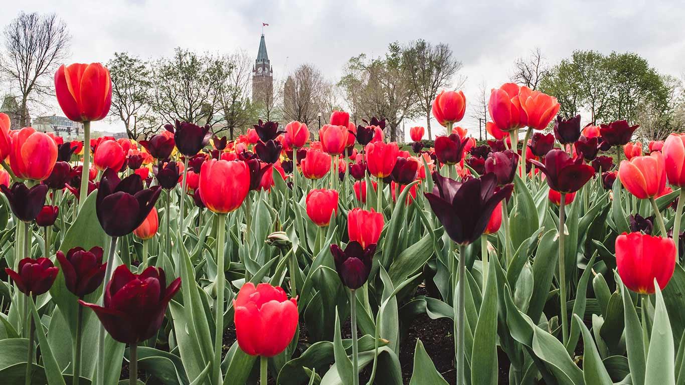

#### 20160514 Milky Way above Mount Rainier in Mount Rainier National Park, Washington (© Brad Goldpaint/Aurora Photos)(Bing United States)

#### 20160514 The Globe Arena at night in Stockholm, Sweden (© Maskot/Superstock)(Bing United Kingdom)

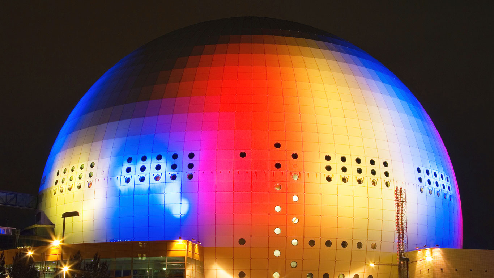

#### 20160513 Orcus in the Gardens of Bomarzo in Italy (© Canadastock/Shutterstock)(Bing United Kingdom)

#### 20160513 Man fishes in the Ord River at Kununurra, Western Australia (© Andrew McInnes/Alamy)(Bing Australia)

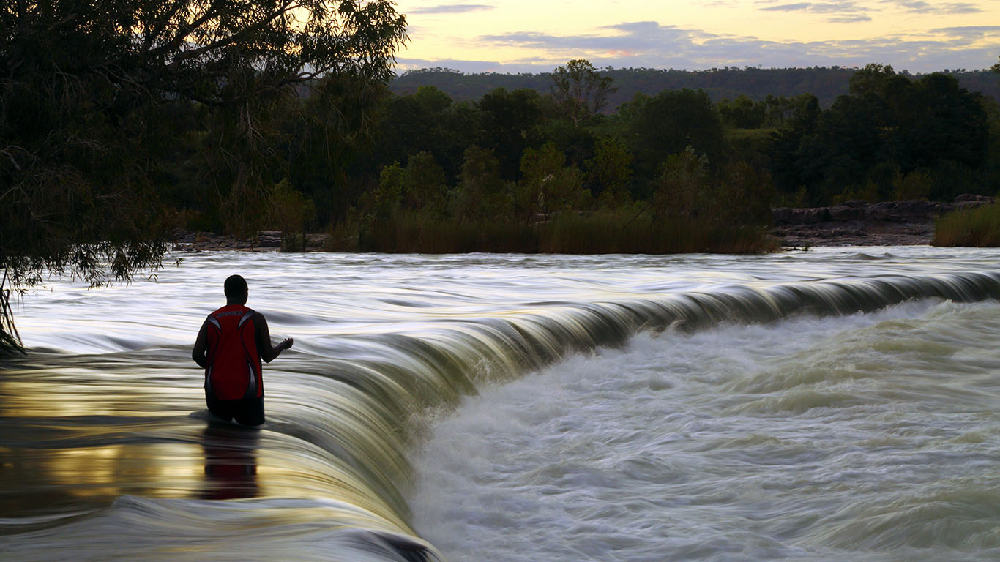

#### 20160512 Lavender blooming in northern Thailand (© Tanat Loungtip/Alamy)(Bing United Kingdom)

#### 20160511 Dolwyddelan Castle in Wales (© Jim Richardson/National Geographic Creative/Alamy)(Bing United Kingdom)

#### 20160510 “Nomade d'Antibes” de Plensa, bastion Saint-Jaume, Antibes, Alpes-Maritimes (© Stéphane Lemaire/hemis.fr/Alamy)(Bing France)

#### 20160510 Dianatempel im Hofgarten, München, Bayern, Deutschland (© Rüdiger Hess/geo-select FotoArt)(Bing Deutschland)

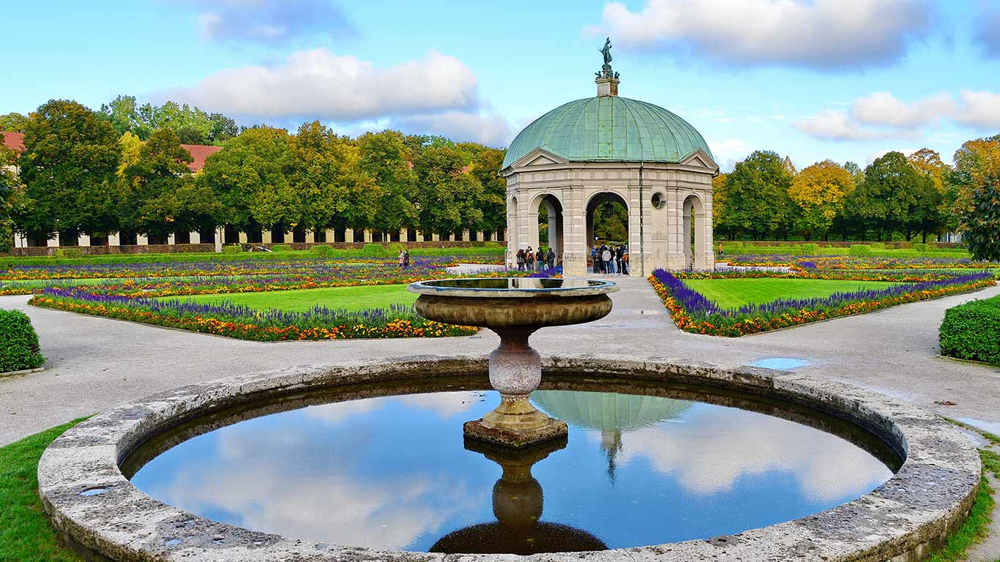

#### 20160510 Wreckage of the SS Thistlegorm in the Red Sea (© Alex Mustard/Minden Pictures)(Bing United Kingdom)

#### 20160509 Xinyuan County, China (© Danny Hu/Getty Images)(Bing United Kingdom)

#### 20160508 Galápagos sea lion and pup, Rábida Island, Galápagos Islands, Ecuador (© Pete Oxford/Minden Pictures)(Bing United States)

#### 20160508 Concert hall of the Heydar Aliyev Center in Baku, Azerbaijan (© VIEW Pictures Ltd/Alamy)(Bing United Kingdom)

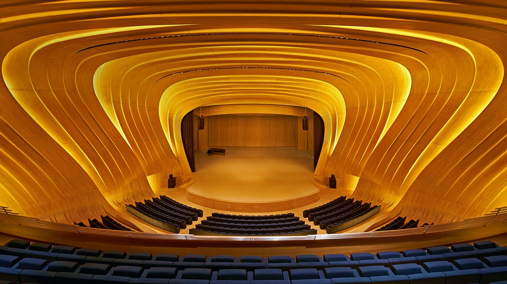

#### 20160507 Gates of the Arctic National Park and Preserve, Alaska (© 167/Michael Melford/Corbis)(Bing United Kingdom)

#### 20160507 Flinders Street Station in Melbourne, Victoria, Australia (© Ashley Cooper/Aurora)(Bing Australia)

#### 20160506 【今日立夏】细竹竿上休憩的红蜻蜓 (© d3sign/Getty Images)(Bing China)

#### 20160506 Cilaos  sur l’île de la Réunion (© Fabrice Michaïlesco/500px)(Bing France)

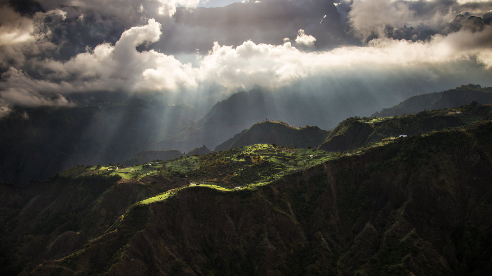

#### 20160506 A Cape white-eye perched (© Rob Hofmeyr/Mammoth HD)(Bing United Kingdom)

#### 20160505 【青年节】中国吉林省，毕业生用遥控无人机拍摄的毕业照 (© Xinhua News Agency/REX/Shutterstock)(Bing China)

#### 20160505 Giant mural in the Las Palmitas neighbourhood of Pachuca, Hidalgo state, Mexico (© Omar Torres/Getty Images)(Bing United Kingdom)

#### 20160505 Cinnamon Fern (Osmunda cinnamomea), Canada (© Minden Pictures)(Bing Canada)

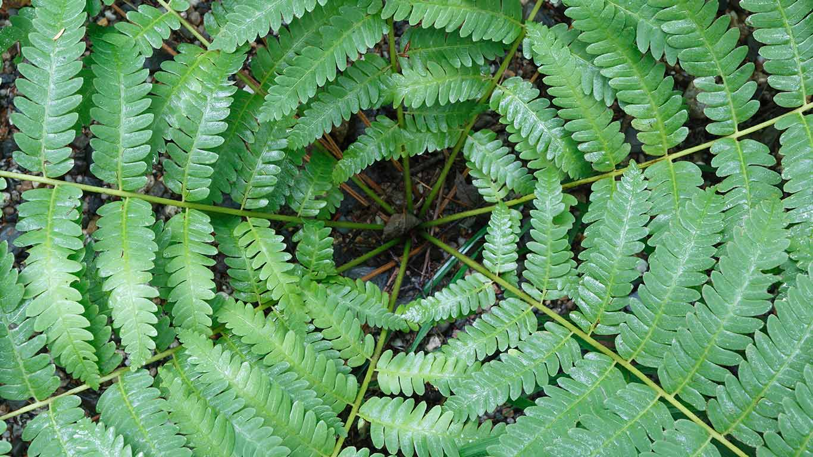

#### 20160504 Milky Way over Sleaford Bay on the Eyre Peninsula, South Australia (© John White Photos/Moment Open/Getty Images)(Bing United Kingdom)

#### 20160504 Young chacma baboon in Moremi Game Reserve, Okavango Delta, Botswana (© Chris Schmid/Aurora Photos/Offset)(Bing United States)

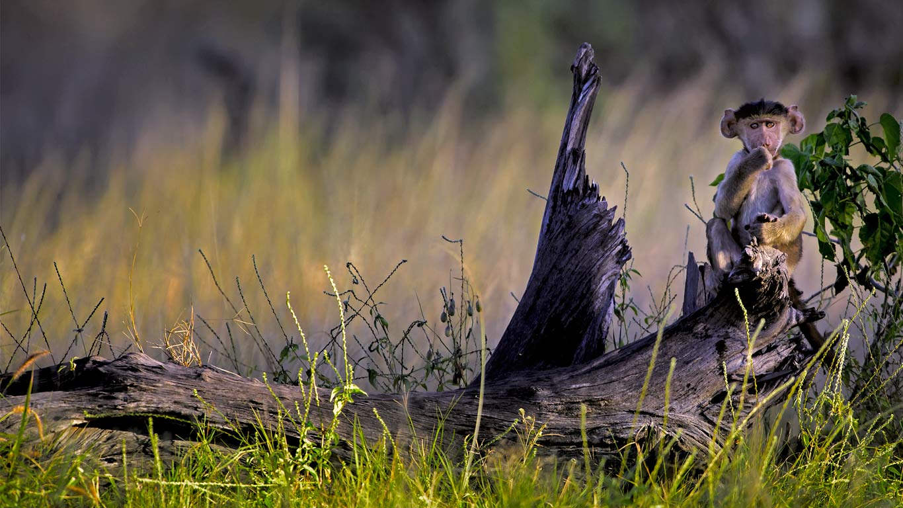

#### 20160503 The Northern Beaches in Sydney, New South Wales, Australia (© Ian Bird/Rex Features)(Bing Australia)

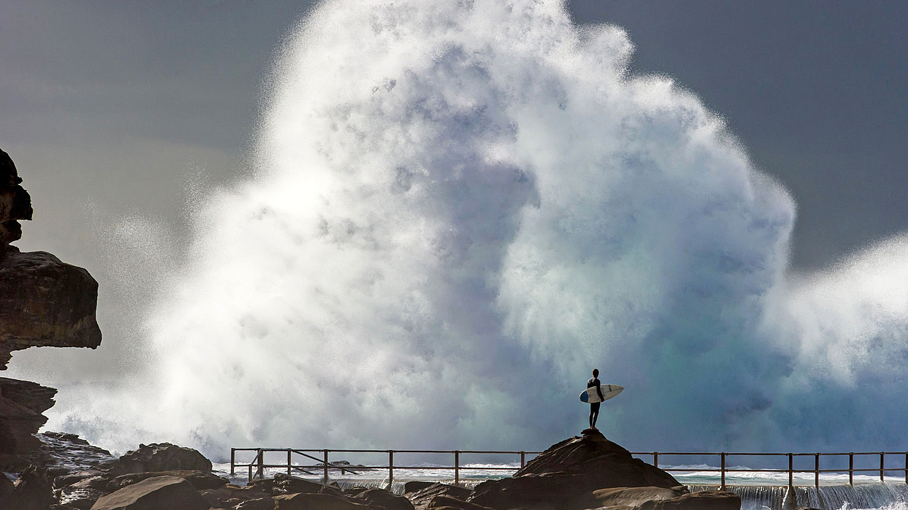

#### 20160503 Hot springs on Mount Roraima, Venezuela (© Waldyr Neto/Getty Images)(Bing United Kingdom)

#### 20160503 Volcan Kawah Ijen sur l’île de Java, Indonésie (© Geoffroy Dechevrand)(Bing France)

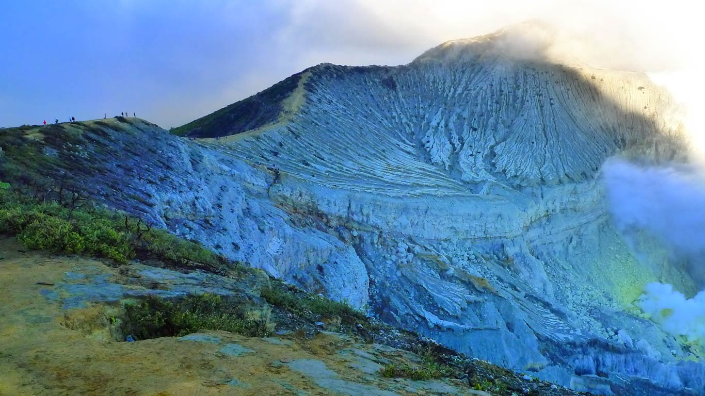

#### 20160502 Anechoic chamber, Copenhagen, Denmark (© Alastair Philip Wiper/Science Photo Library)(Bing United Kingdom)

#### 20160502 Orgues basaltiques et bottes de pailles à Murol, parc des Volcans d'Auvergne (© Francis Cormon/Hemis/Corbis)(Bing France)

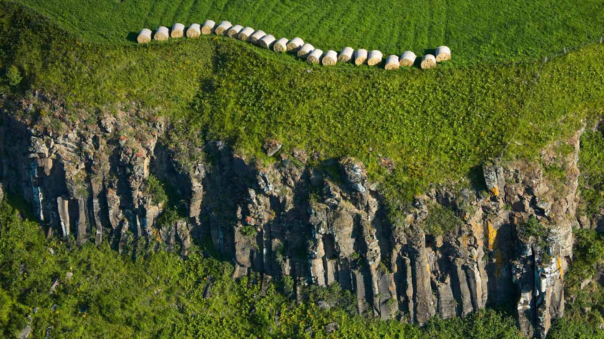

#### 20160502 ｢富士山と茶畑｣静岡, 富士市 (© Norikazu Satomi/Alamy)(Bing Japan)

#### 20160501 Prairie smoke blossoms (© Jim Brandenburg/Minden Pictures)(Bing United Kingdom)

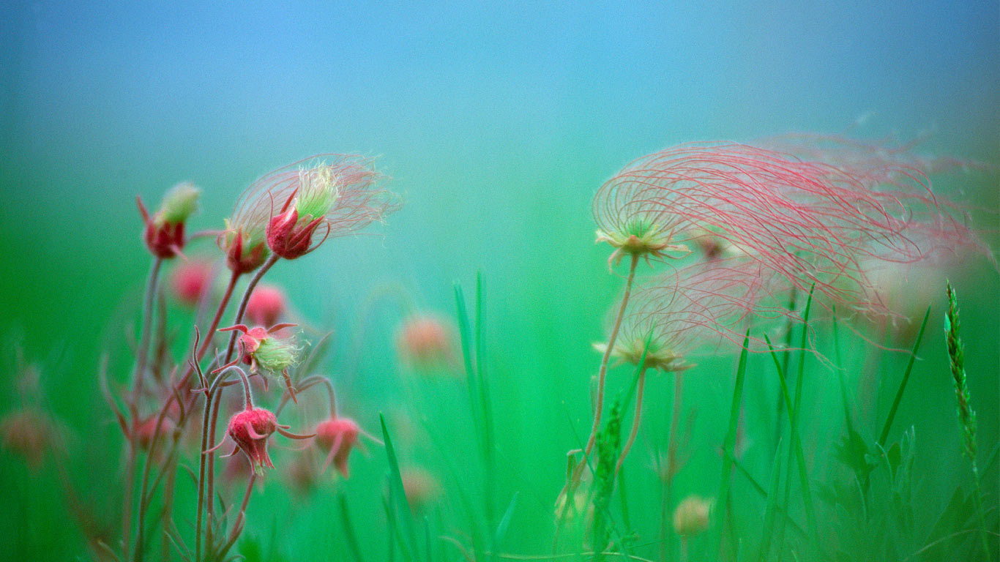

#### 20160501 Plumeria flowers in Hawaii (© Darrell Gulin/Getty Images)(Bing United States)

