#### 20160630 Dolmen de La Borda ou des Pascarets la nuit à Eyne, Pyrénées-Orientales (© Inaki Relanzon/Minden Pictures)(Bing France)

#### 20160630 Japanese dwarf flying squirrel in Rishiri-Rebun-Sarobetsu National Park, Japan (© HTB/NHK Video Bank Creative/Getty Images)(Bing United Kingdom)

#### 20160629 Farm plots in southwestern Kansas (© NASA/GSFC/METI/ERSDAC/JAROS, and U.S./Japan ASTER Science Team)(Bing United Kingdom)

#### 20160628 Große Saarschleife bei Mettlach, Saarland, Deutschland (© Manfred J. Bail/Westend61/Corbis)(Bing Deutschland)

#### 20160628 Licancabur volcano on the border of Bolivia and Chile (© ESO/B. Tafreshi/REX/Shutterstock)(Bing United Kingdom)

#### 20160627 Rufus the Hawk keeps pigeons away on Centre Court at Wimbledon (© Oli Scarff/Getty Images)(Bing United Kingdom)

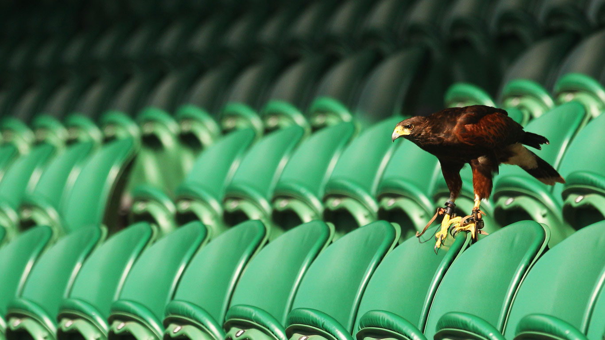

#### 20160627 Wreck of SS Dicky at Dicky Beach in Caloundra, Queensland, Australia (© wargunner/Shutterstock)(Bing Australia)

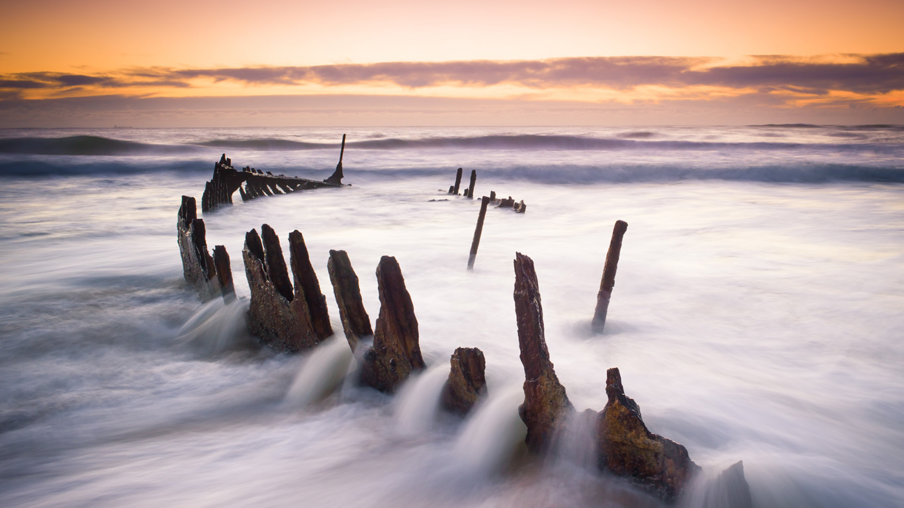

#### 20160626 Ankarokaroka canyon in Ankarafantsika National Park, Madagascar (© Bernard Castelein/Minden Pictures)(Bing United Kingdom)

#### 20160625 The Pride parade in London (© Paul Brown/Alamy)(Bing United Kingdom)

#### 20160624 ｢スーパーセル｣フランス, アルザス＝シャンパーニュ＝アルデンヌ＝ロレーヌ地域圏 (© Max Conrad/500px)(Bing Japan)

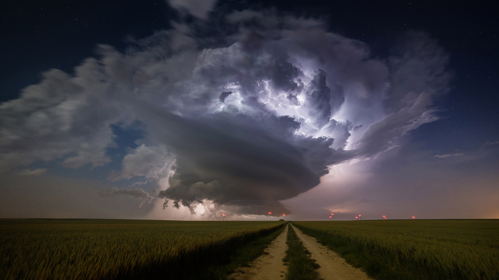

#### 20160624 Mesquite Flat Sand Dunes in Death Valley National Park, California (© Don White/SuperStock/Alamy)(Bing United Kingdom)

#### 20160623 Matera, Italy (© Cavan Images/Offset)(Bing United Kingdom)

#### 20160622 Silhouette d’un trompettiste dans une rue d’Arles, Bouches-du-Rhône, PACA (© Ivan Nesterov/Alamy)(Bing France)

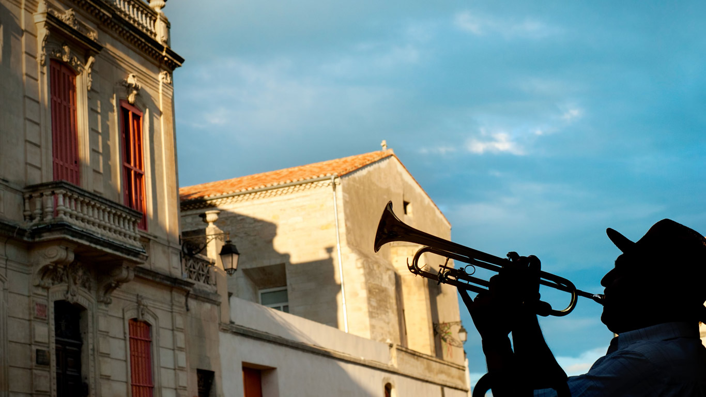

#### 20160622 Kobbvatnet Lake in Sørfold, Norway (© Martin Heck/Nimia)(Bing United Kingdom)

#### 20160621 A Giraffe in South Africa (© Lilly Husbands/Offset)(Bing United Kingdom)

#### 20160620 'Sun Tunnels' by artist Nancy Holt near Lucin, Utah (© Lindsay Daniels/Tandem Stills +Motion)(Bing United Kingdom)

#### 20160620 Royal penguins at Macquarie Island, Tasmania (© Brett Phibbs/Cultura RM/Alamy)(Bing Australia)

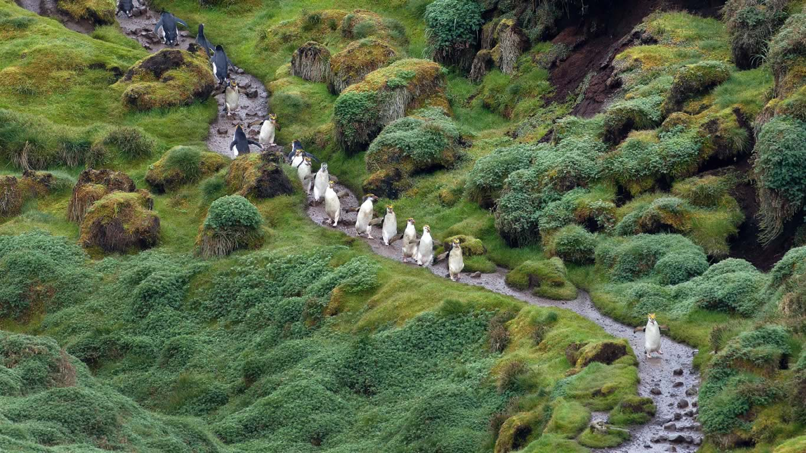

#### 20160619 A gold-and-white marmoset and his young in the Amazon Rainforest, Brazil (© Nick Gordon/Minden Pictures)(Bing United Kingdom)

#### 20160618 Caroline Atoll, Kiribati (© Brian J. Skerry/Getty Images)(Bing United Kingdom)

#### 20160618 A group of California Sea Lion (Zalophus californianus) raising their heads and barking Barkley Sound, Vancouver Island (© Matthew Maran/Minden Pictures)(Bing Canada)

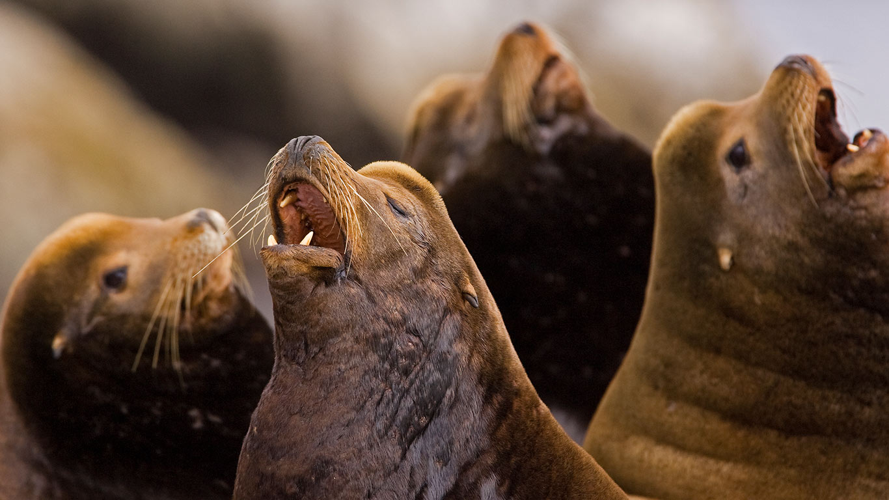

#### 20160617 Réserve naturelle nationale de Saint-Martin, îlet Pinel, Saint-Martin (© Philippe Castagna/500px)(Bing France)

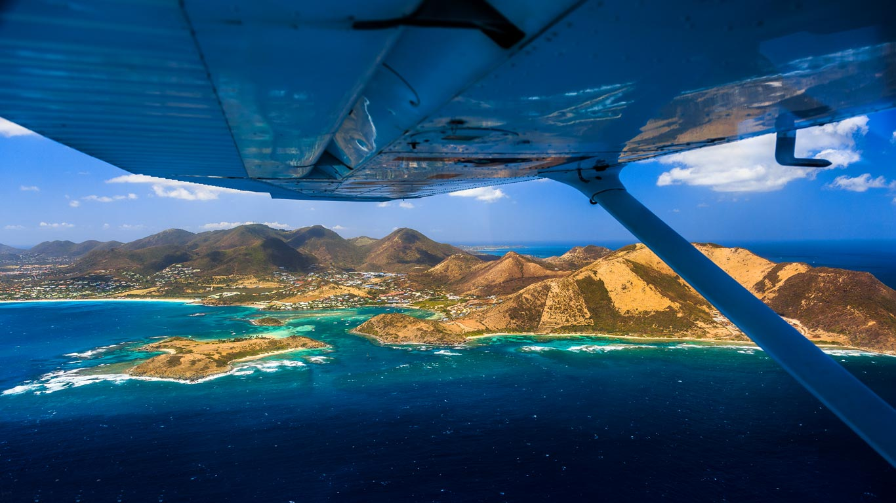

#### 20160617 Flowering heather in the Netherlands (© Bendiks Westerink/Minden Pictures)(Bing United Kingdom)

#### 20160617 Swamp Forest, Tow Hill Ecological Reserve, B.C. (© David Nunuk/Getty Images)(Bing Canada)

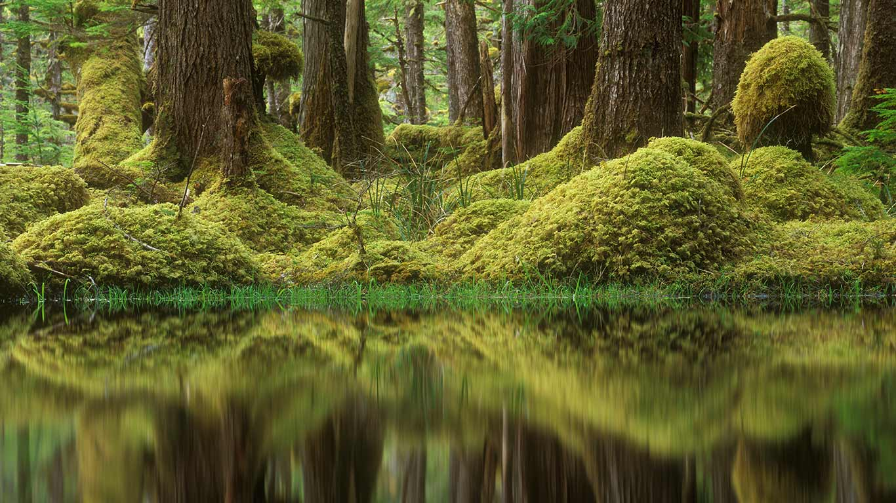

#### 20160616 Percé Rock in Gaspé Peninsula, Quebec, Canada (© Don Johnston/age fotostock)(Bing United Kingdom)

#### 20160615 Gare do Oriente in Lisbon, Portugal (© Stefan Kiefer/Superstock)(Bing United Kingdom)

#### 20160615 Wedeler Marsch, Wedel, Schleswig-Holstein, Deutschland (© Rüdiger Hess/geo-select FotoArt)(Bing Deutschland)

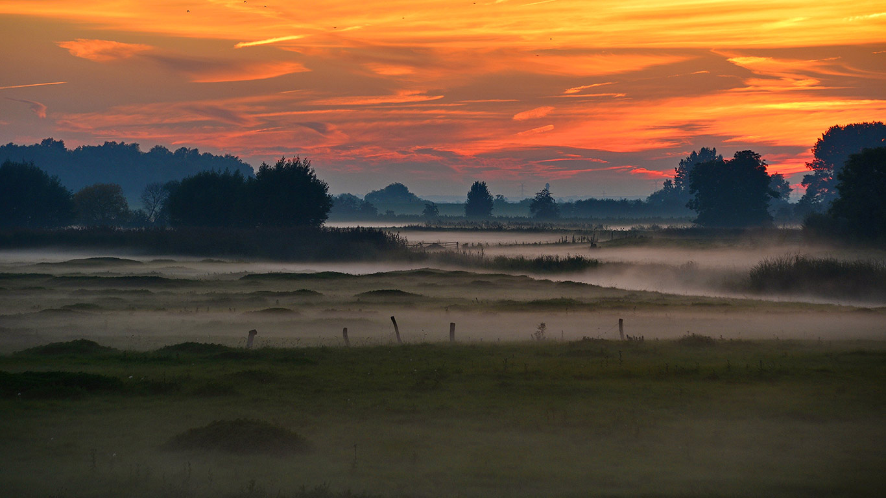

#### 20160614 American flag tribute in Middletown, Ohio to victims of the September 11 attacks (© Norman Kent/Getty Images)(Bing United States)

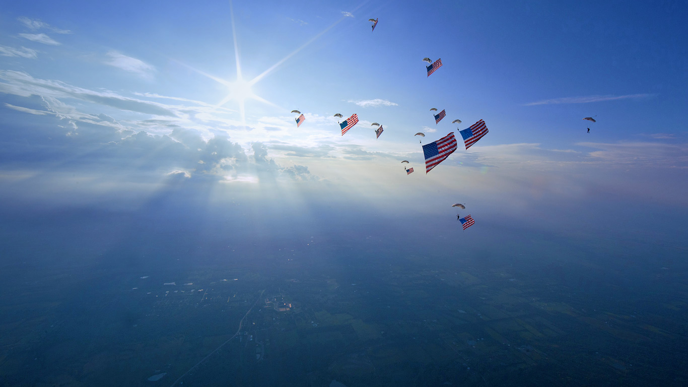

#### 20160614 Calypso Orchids, Banff National Park, Alberta (© Paul Zizka/Getty Images)(Bing Canada)

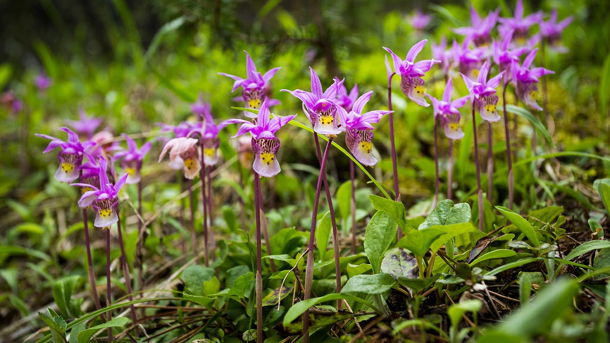

#### 20160614 Bombo Headland at Kiama, New South Wales, Australia (© Attakorn Bk/Getty Images)(Bing United Kingdom)

#### 20160613 Tun Sakaran Marine Park, Malaysia (© timefocusfilms/Nimia)(Bing United Kingdom)

#### 20160612 Butterflies in the Park of Castelli Romani, Italy (© Solent News/Splash News/Corbis)(Bing United Kingdom)

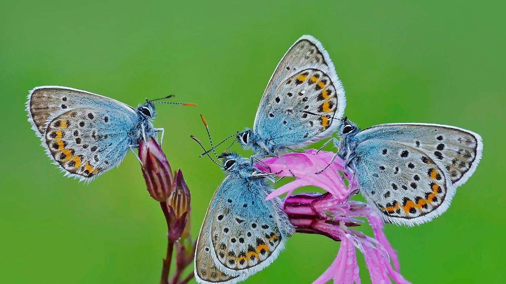

#### 20160612 Castle Butte in Big Muddy Valley of Saskatchewan (© Mcmaster Studio/Alamy Stock Photo)(Bing Canada)

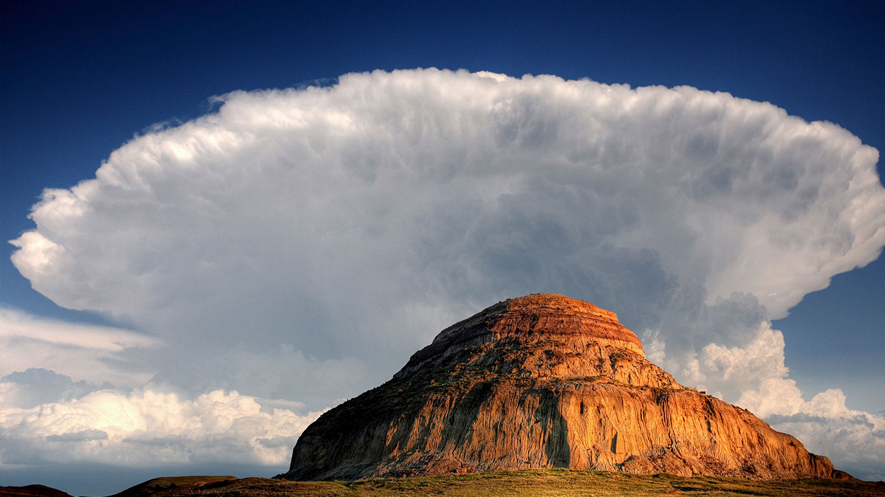

#### 20160611 The Queen's Guard near Buckingham Palace, London (© Oversnap/Getty Images)(Bing United Kingdom)

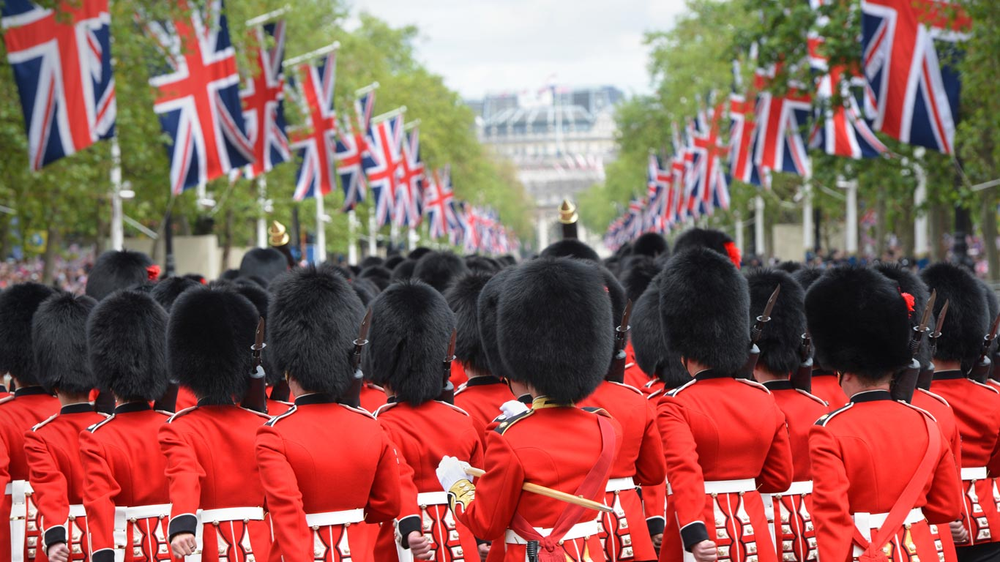

#### 20160610 Stade de France, Saint-Denis, France (© Offside/REX/Shutterstock)(Bing United Kingdom)

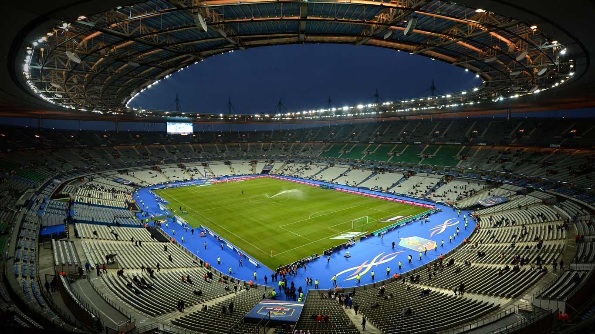

#### 20160610 【端午节】龙舟竞赛特写 (© EasyBuy4u/Getty Images)(Bing China)

#### 20160610 Coyote in Black Canyon of the Gunnison National Park, Colorado (© Jeff Diener/Aurora Photos)(Bing United States)

#### 20160609 Ice pillars in a cave at Durmitor, Montenegro (© Marko Radovanovic/Aurora Photos)(Bing United Kingdom)

#### 20160608 Humpback whale in Cierva Cove, Antarctica (© Robert Harding World Imagery/Offset)(Bing United Kingdom)

#### 20160607 ｢立山黒部アルペンルート｣富山, 立山 (© JTB PHOTO COMMUNICATI/AGE Fotostock)(Bing Japan)

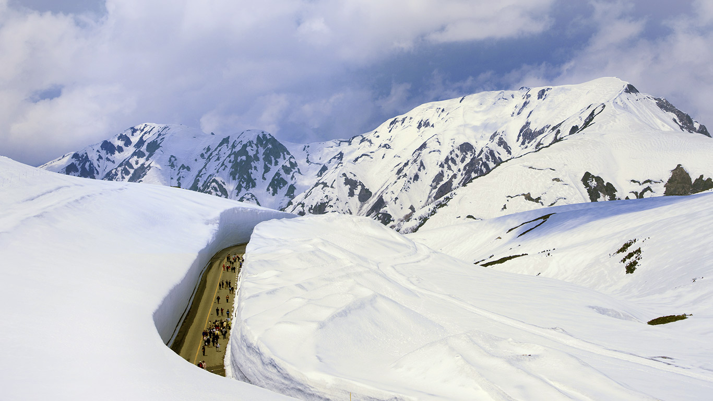

#### 20160607 The Hoba meteorite near Grootfontein, Namibia (© Maciej Tomkow/Nimia)(Bing United Kingdom)

#### 20160606 Schloss Sanssouci, Potsdam, Brandenburg, Deutschland (© Iain Masterton/Getty Images)(Bing Deutschland)

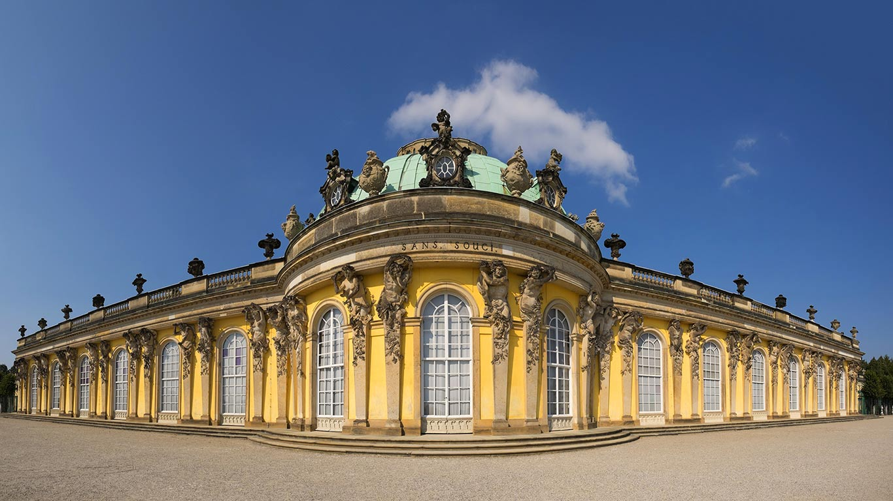

#### 20160606 Pointe du Hoc, Cricqueville-en-Bessin, France (© Francis Cormon/Getty Images)(Bing United Kingdom)

#### 20160605 Cathedral and Museum Ludwig, Cologne, North Rhine-Westphalia, Germany (© Heinz Wohner/Getty Images)(Bing United Kingdom)

#### 20160604 Giant kelp forest near San Clemente Island, California (© Richard Hermann/Visuals Unlimited, Inc.)(Bing United Kingdom)

#### 20160603 Aftermath of a forest fire in Yellowstone National Park, Wyoming (© Stephanie Coffman/Tandem Stills + Motion)(Bing United States)

#### 20160603 View towards Isle of Rum from Isle of Eigg in the Scottish Inner Hebrides (© Lee Frost/robertharding/Alamy)(Bing United Kingdom)

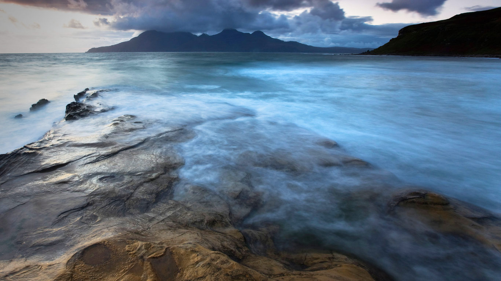

#### 20160603 Cross River Falls, B.C. Rockies (© John E Marriott/Getty Images)(Bing Canada)

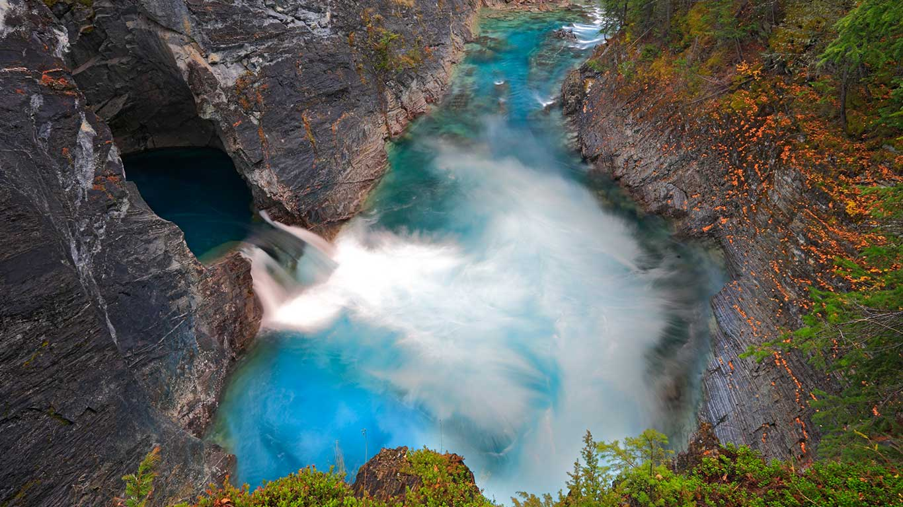

#### 20160602 Martin Place during Vivid Sydney in NSW, Australia (© Leah-Anne Thompson/Shutterstock)(Bing Australia)

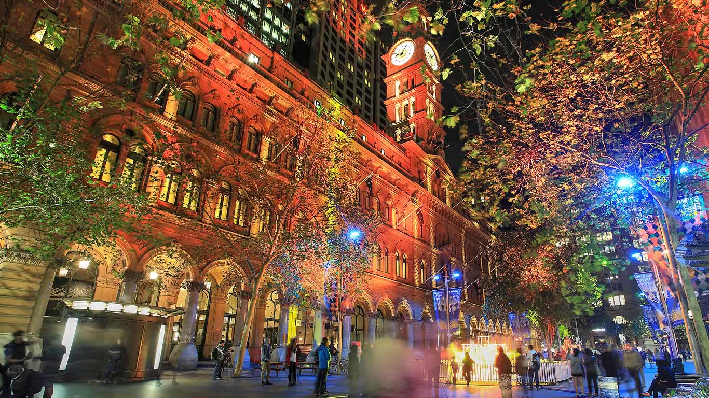

#### 20160602 【六一儿童节】中国沈阳，蒲河小学的学生在排练皮影戏 (© epa european pressphoto agency b.v./Alamy Stock Photo)(Bing China)

#### 20160602 View of the Cornwall coast (© Allan Baxter/Getty Images)(Bing United Kingdom)

#### 20160602 Aerial of Cavendish Beach, PEI National Park, Prince Edward Island (© BarrettÊ&ÊMacKay/Getty Images)(Bing Canada)

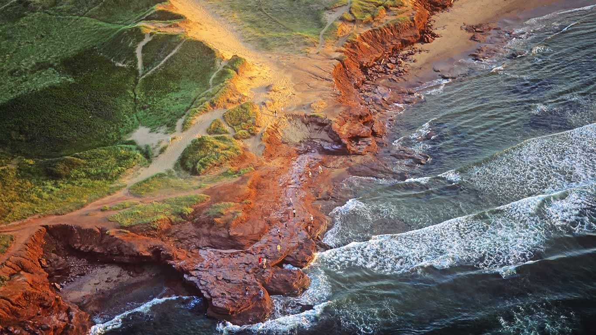

#### 20160601 To Sua Ocean Trench in Lotofaga, Upolu, Samoa (© Danita Delimont/Offset)(Bing United Kingdom)

#### 20160601 Superb lyrebird in Marysville State Forest, Australia (© Donovan Wilson/500px)(Bing United Kingdom)

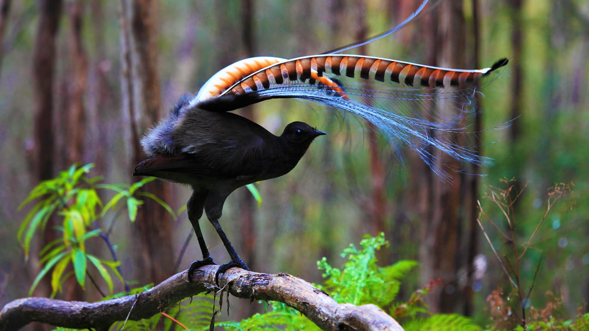

