#### 20160731 Valley of the Giants, Denmark, Western Australia (© Paul Street/Alamy)(Bing Australia)

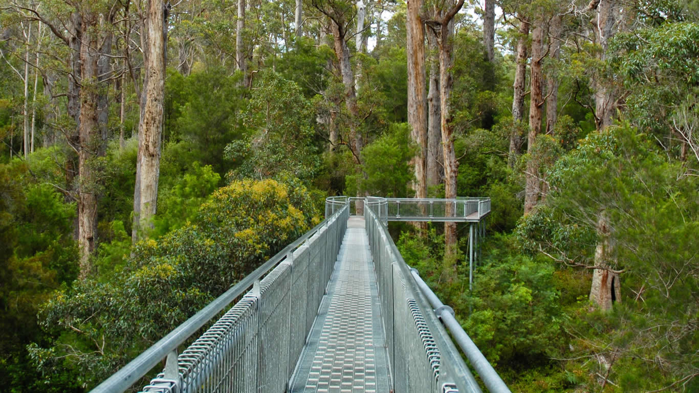

#### 20160731 Village of Ko Panyi, Phang Nga Bay, Thailand (© Yann Arthus-Bertrand/Getty Images)(Bing United Kingdom)

#### 20160730 ｢隅田川花火大会｣東京, 隅田川 (© ZhangXun/Getty Images)(Bing Japan)

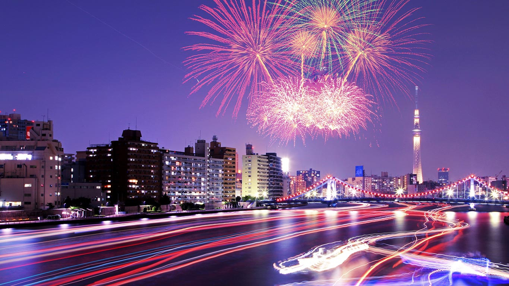

#### 20160730 Statue of Bobby Moore outside Wembley Stadium, London (© Richard Heathcote/The FA/Contributor/Getty Images)(Bing United Kingdom)

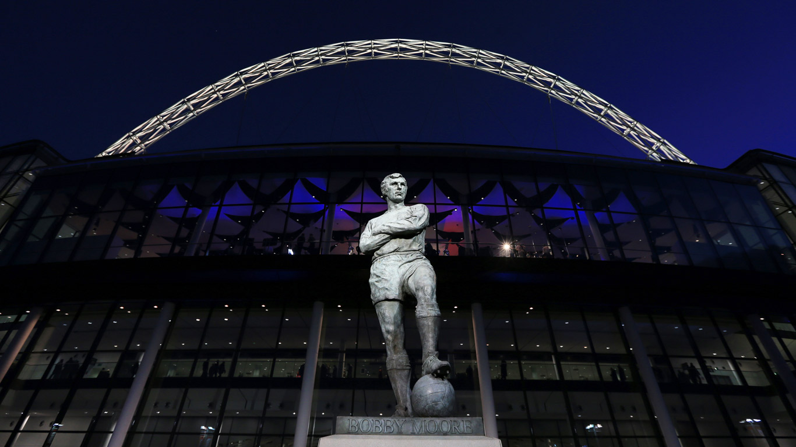

#### 20160729 Takachiho Gorge on Kyushu, Japan (© Shayne Hill Xtreme Visuals/Getty Images)(Bing United Kingdom)

#### 20160729 Western moose in Isle Royale National Park, Michigan (© Jim Brandenburg/Minden Pictures)(Bing United States)

#### 20160729 A foggy morning at the iconic Lake Louise in Alberta (© Grant Ordelheide/Tandem Stills)(Bing Canada)

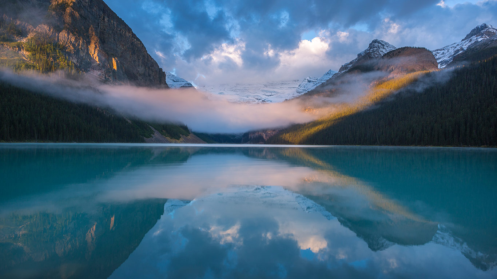

#### 20160728 Castelluccio in Monti Sibillini National Park, Italy (© Brian Jannsen/Alamy)(Bing United Kingdom)

#### 20160727 A Eurasian coot resting on one leg in Derbyshire (© Andrew Parkinson/Minden Pictures)(Bing United Kingdom)

#### 20160726 Tower Bridge in London (© Mapics/Getty Images)(Bing United Kingdom)

#### 20160726 Partiturseite zur Oper Parsifal von Richard Wagner, Richard-Wagner-Museum, Bayreuth, Bayern, Deutschland (© De Agostini/A. Dagl/age fotostock)(Bing Deutschland)

#### 20160725 Detail of the inside of a sunflower, Boulder, Colorado (© Peter Dennen/Aurora Photos)(Bing United Kingdom)

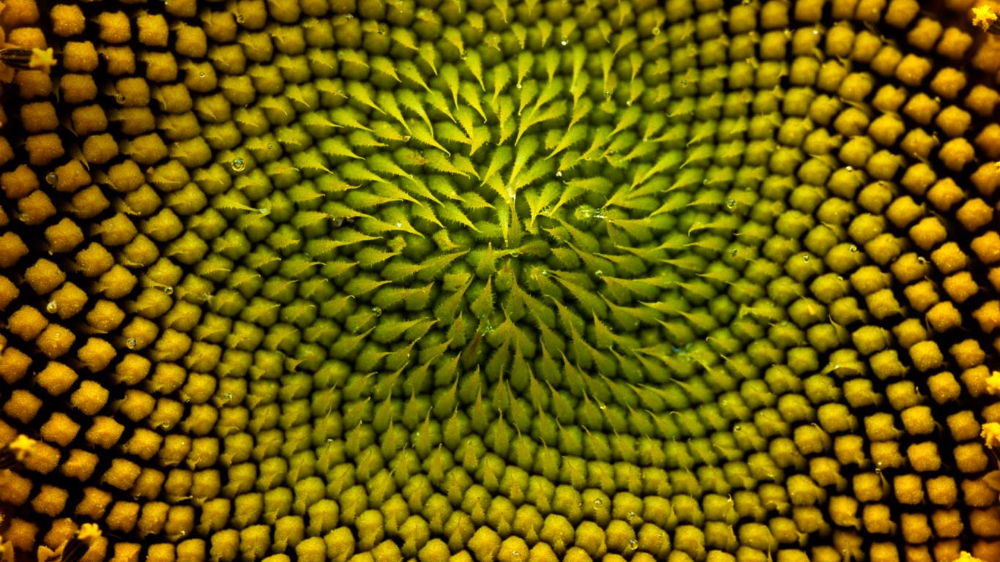

#### 20160725 Frozen tarn in the Walls of Jerusalem National Park, Tasmania (© Ted Mead/Getty Images)(Bing Australia)

#### 20160724 Zanzibar red colobus monkeys in Zanzibar, Tanzania (© Thomas Marent/Minden Pictures)(Bing United States)

#### 20160724 Sinkhole in Xuan’en County, Hubei, China (© Xinhua News Agency/REX/Shutterstock)(Bing United Kingdom)

#### 20160723 Blue Pond in Biei, Hokkaido, Japan (© JTB Photo/UIG/Getty Images)(Bing United Kingdom)

#### 20160723 【今日大暑】苦瓜 (© konmesa/Shutterstock)(Bing China)

#### 20160722 Twilight over St Michael's Mount in Mount's Bay, Cornwall (© Brian Jannsen/Alamy)(Bing United Kingdom)

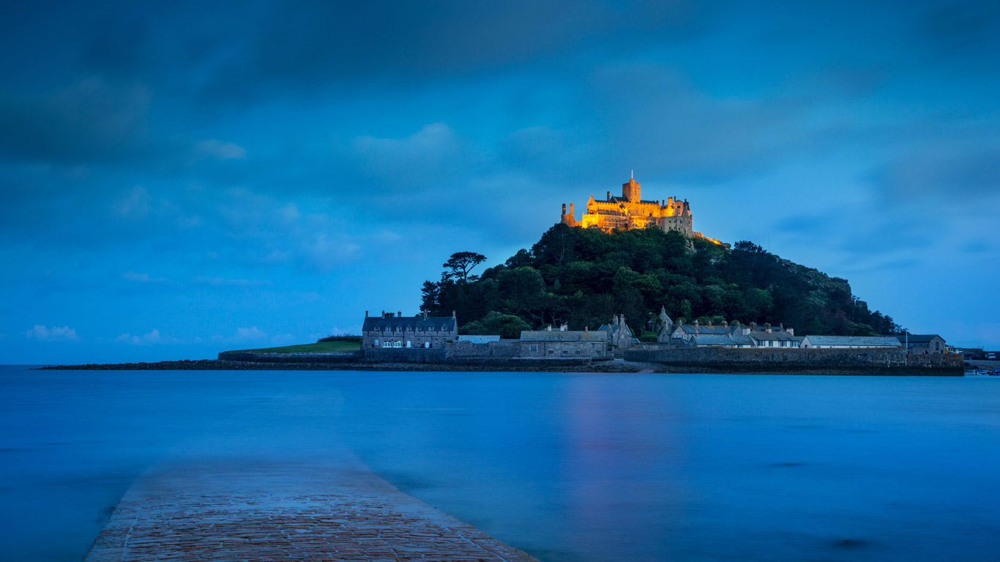

#### 20160722 Headlights streaking through Badlands National Park, South Dakota (© Adam Hester/Getty Images)(Bing United States)

#### 20160722 Nuxalk petroglyphs, Bella Coola, coastal B.C. (© Wayne Lynch/All Canada Photos/Superstock)(Bing Canada)

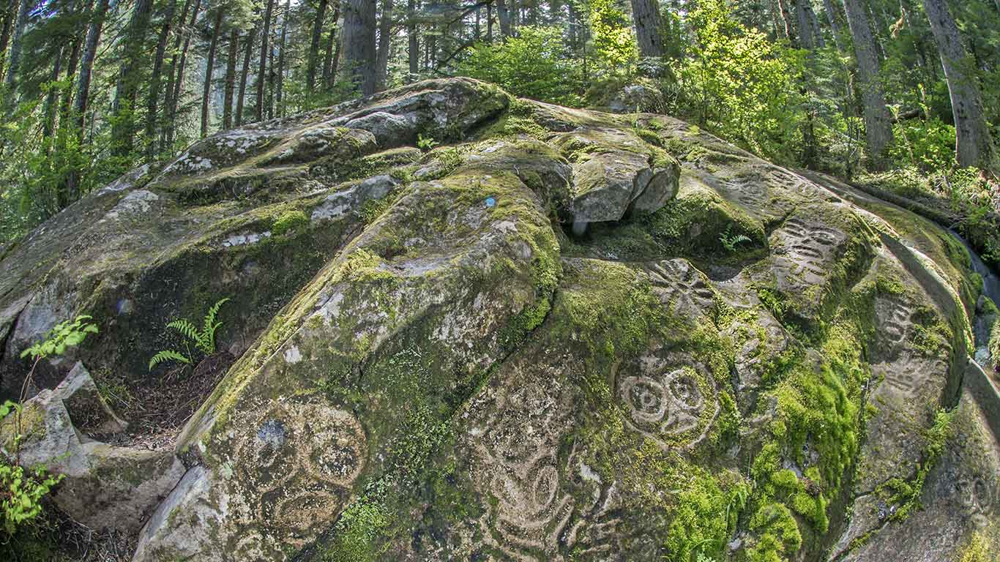

#### 20160722 ｢天橋立｣京都, 宮津市 (© JTB Photo Communication/Superstock)(Bing Japan)

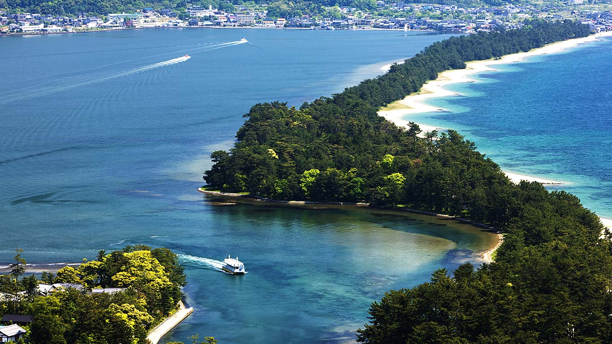

#### 20160721 View from Stac Pollaidh over Inverpolly in the Northwest Highlands of Scotland (© Tobias Richter/LOOK-foto/Getty Images)(Bing United Kingdom)

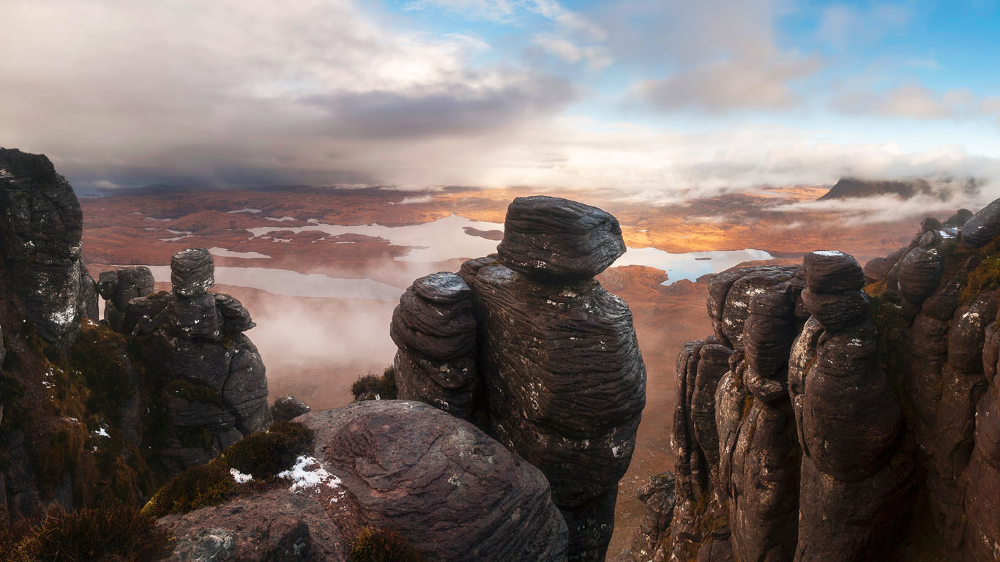

#### 20160720 Eclipse of the Moon (© Christopher Collins/Alamy)(Bing United Kingdom)

#### 20160719 Coucher de soleil au-dessus de la mer, Nice, Alpes-Maritimes (© Valery Trillaud/age footstock/Superstock)(Bing France)

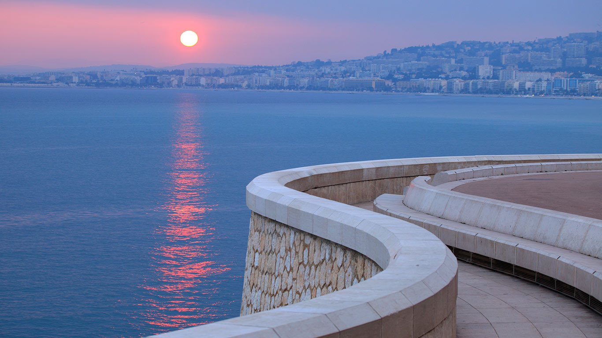

#### 20160719 Neon Museum, Las Vegas, Nevada (© Kerrick James/Getty Images)(Bing United Kingdom)

#### 20160718 Drapeau français au milieu des fleurs et bougies d’un mémorial en hommage aux victimes de l’attentat de Nice, le 15 juillet 2016 à Nice (© AP Photo/Luca Bruno)(Bing France)

#### 20160718 Aerial view of Diamond Head, Oahu, Hawaii (© Biederbick & Rumpf/Offset)(Bing United Kingdom)

#### 20160717 Baie des Anges à Nice, Alpes-Maritimes (© Malaussena Benoit/Getty Images)(Bing France)

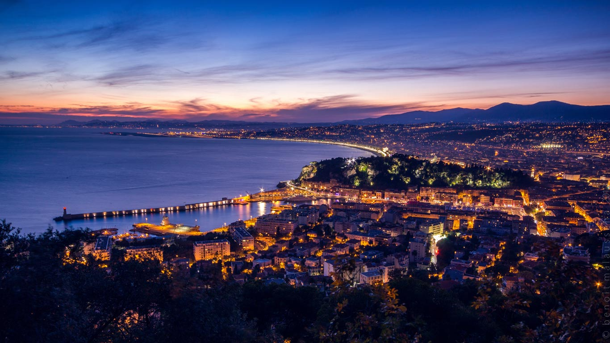

#### 20160717 Beach huts in Muizenberg, South Africa (© Getty Images)(Bing United Kingdom)

#### 20160716 Yser River in West Flanders, Belgium (© Wouter Pattyn/Minden Pictures)(Bing United Kingdom)

#### 20160715 Feu d’artifice du 14 Juillet au-dessus du Vieux-Port de Marseille, Provence-Alpes-Côte d’Azur (© Hemis/Alamy Stock)(Bing France)

#### 20160715 Humpback whale off the shore of Kenai Fjords National Park, Alaska (© Ron Niebrugge/Alamy)(Bing United Kingdom)

#### 20160715 Sockeye Salmon (Oncorhynchus nerka) migrating upstream, Adams River, Roderick Haig-Brown Provincial Park, B.C. (© Yva Momatiuk and John Eastcott/Minden(Bing Canada)

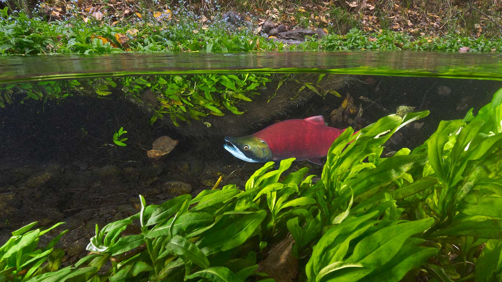

#### 20160714 Yellow-footed rock-wallaby mother with joey (© Danita Delimont/Getty Images)(Bing Australia)

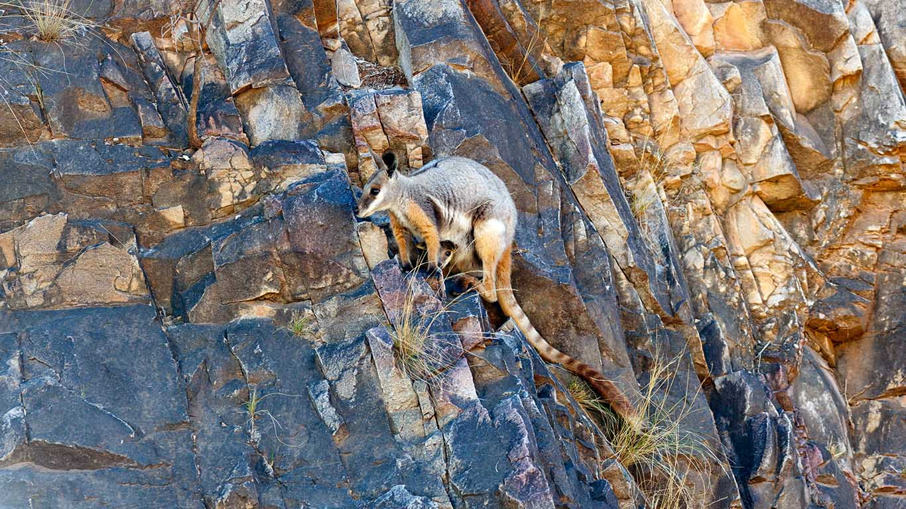

#### 20160714 White Rim Road seen from Island in the Sky in Canyonlands National Park, Utah (© Alexander Messenger/Tandem Stills + Motion)(Bing United Kingdom)

#### 20160714 Badlands near Drumheller in Alberta (© hdsidesign/Shutterstock)(Bing Canada)

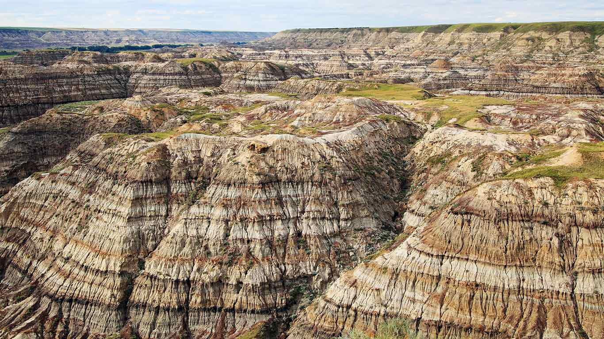

#### 20160713 Train Night Market in Ratchada, Bangkok, Thailand (© FUN FUN PHOTO/Shutterstock)(Bing United Kingdom)

#### 20160712 Eroding rock at Cathedral Cove on North Island, New Zealand (© crbellette/Shutterstock)(Bing United Kingdom)

#### 20160711 London and surroundings photographed from the International Space Station (© NASA)(Bing United Kingdom)

#### 20160710 A puma in Torres del Paine National Park, Chile (© Benjamin Lowy/Getty Images)(Bing United Kingdom)

#### 20160710 The Lincoln Memorial, Washington, DC (© Dennis K. Johnson/Getty images)(Bing United States)

#### 20160709 The Osterseen in Upper Bavaria, Germany (© Florian Werner/Alamy)(Bing United Kingdom)

#### 20160708 【今日小暑】火烧云下的元阳梯田 (© Jon Bratt/Getty Images)(Bing China)

#### 20160708 Columbian lilies on Hurricane Ridge, Olympic National Park, Washington (© Dennis Frates/Alamy)(Bing United Kingdom)

#### 20160707 Reichstag Dome in Berlin, Germany (© Holger Mette/Shutterstock)(Bing United Kingdom)

#### 20160706 Burrowing owl chicks (© Mark Bridger/Shutterstock/Offset)(Bing United Kingdom)

#### 20160705 Exterior of the Musée du quai Branly in Paris, France (© Trevor Hunt/Getty Images)(Bing United Kingdom)

#### 20160705 Leuchtturm und Bayerischer Löwe an der Hafeneinfahrt von Lindau, Bayern, Deutschland (© José Antonio Moreno/age fotostock)(Bing Deutschland)

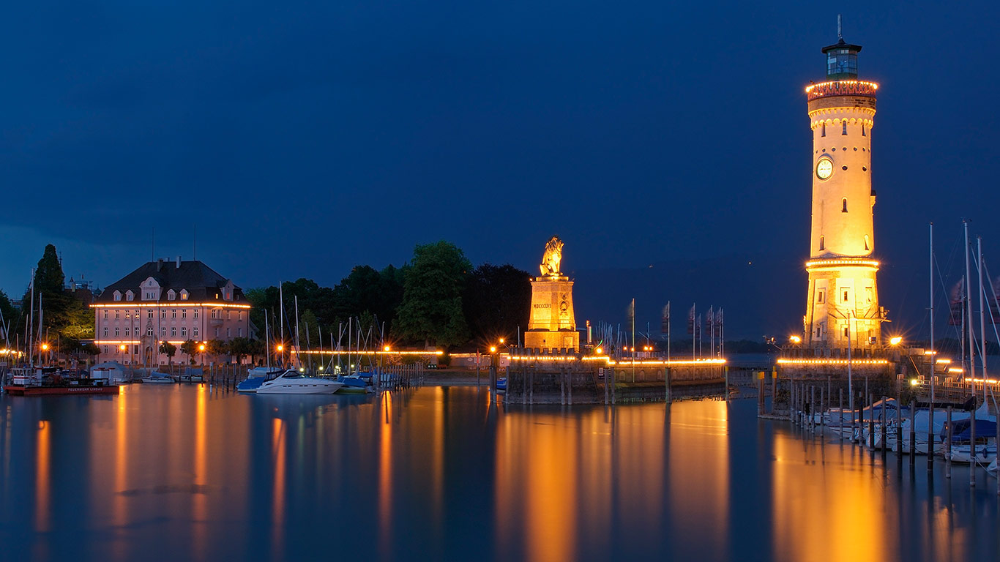

#### 20160705 基安特赞小镇上的葡萄园，上莱茵，阿尔萨斯，法国 (© Don White/Alamy)(Bing China)

#### 20160704 Spot-fin porcupinefish near Hawaii (© David Fleetham/Visuals Unlimited, Inc.)(Bing United Kingdom)

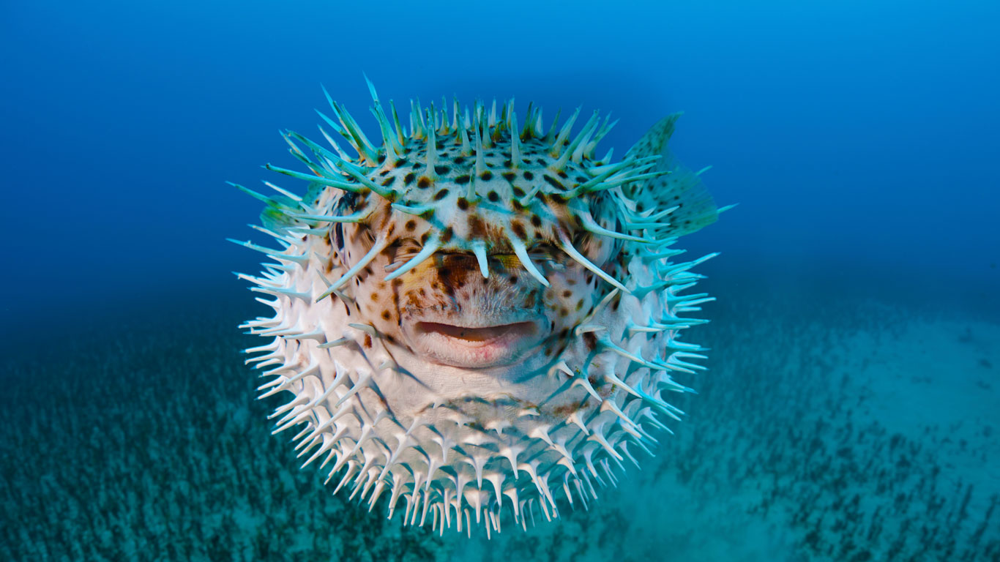

#### 20160704 Lifeguard station at Lummus Park in South Beach, Miami, Florida (© Image: Travelpix Ltd/Getty Images; Video/Sound: Shutterstock/Getty; Music: “Stars and Stripes Forever” by John Philip Sousa)(Bing United States)

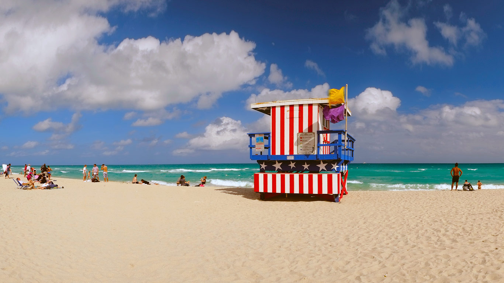

#### 20160703 Schönbrunn Palace photographed from behind Neptune Fountain in Vienna, Austria (© Marco Romani/Getty Images)(Bing United Kingdom)

#### 20160702 Rapsfelder bei Duderstadt, Eichsfeld, Niedersachsen, Deutschland (© H & D Zielske/LOOK-foto/Getty Images)(Bing Deutschland)

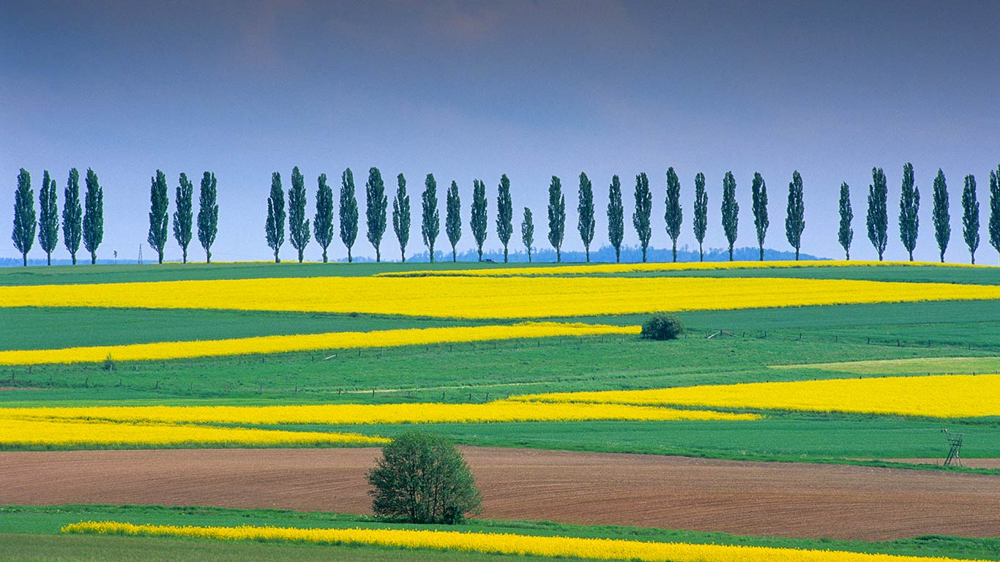

#### 20160702 Coastal waters off Bylot Island, Nunavut, Canada (© Andrew Peacock/Offset)(Bing United Kingdom)

#### 20160702 Parliament House at night in Canberra, Australian Capital Territory (© Tony Bowler/Alamy)(Bing Australia)

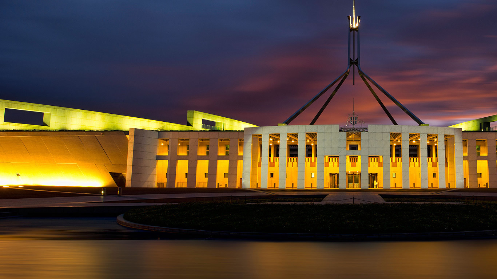

#### 20160702 ｢アジサイ｣ (© yuhorakushin/Getty Images)(Bing Japan)

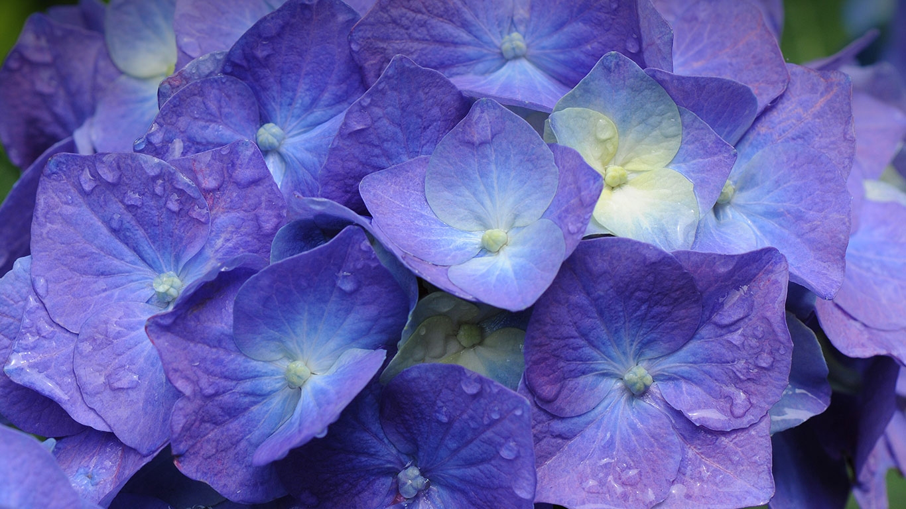

#### 20160701 The Watchman Peak in Crater Lake National Park, Oregon (© Dennis Frates/Alamy)(Bing United Kingdom)

#### 20160701 Celebration of lights, fireworks display at English Bay, Vancouver, BC (© Lijuan Guo/Shutterstock)(Bing Canada)

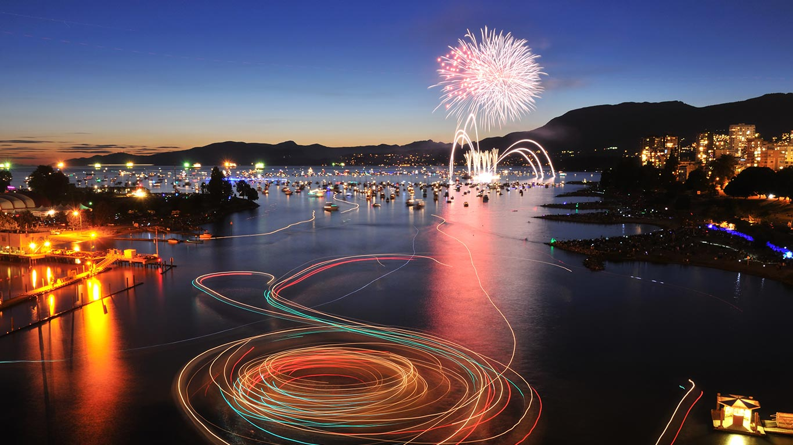

