#### 20160831 Bonifacio on the island of Corsica, France (© BIOSPHOTO/Alamy)(Bing United Kingdom)

#### 20160830 Strandkörbe auf Wangerooge, Ostfriesische Inseln, Niedersachsen, Deutschland (© Huber/Sime/eStock Photo)(Bing Deutschland)

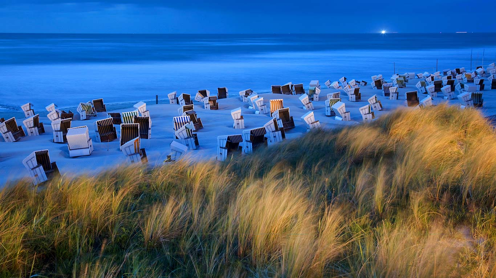

#### 20160830 Moray Inca ruins near Maras, Peru (© Panoramic Images/Getty Images)(Bing United Kingdom)

#### 20160829 The Notting Hill Carnival in London (© Paul Brown/Alamy)(Bing United Kingdom)

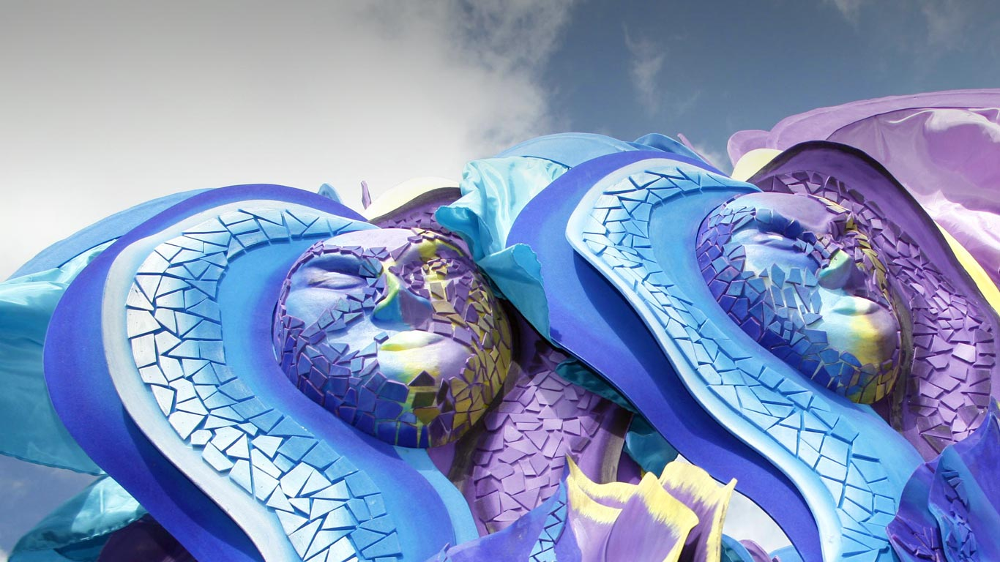

#### 20160828 Fishing lodges on the Tree River in the Kitikmeot Region of Nunavut, Canada (© Jason Pineau/Getty Images)(Bing United Kingdom)

#### 20160827 Spoon Lake, Mt. Cheam, Chilliwack, B.C. (© Jason Wilde/Tandem Stills)(Bing Canada)

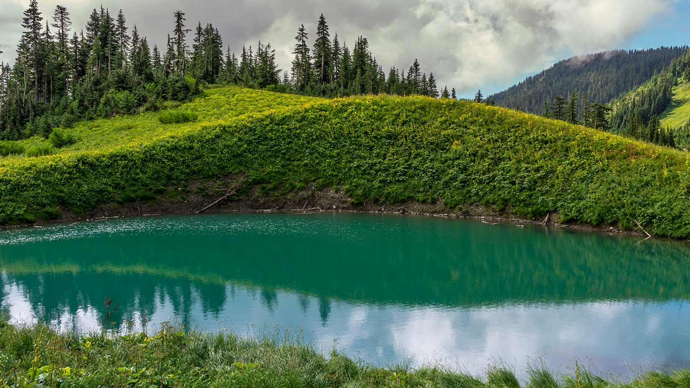

#### 20160827 Afon Ogwen, a river in Snowdonia National Park, Wales (© Graham Eaton/Minden Pictures)(Bing United Kingdom)

#### 20160826 Market Hall in Rotterdam, Netherlands (© Tetra Images/Offset)(Bing United Kingdom)

#### 20160825 Symonds Yat Rock overlooking the River Wye (© Ahmad Alsharhan/Alamy)(Bing United Kingdom)

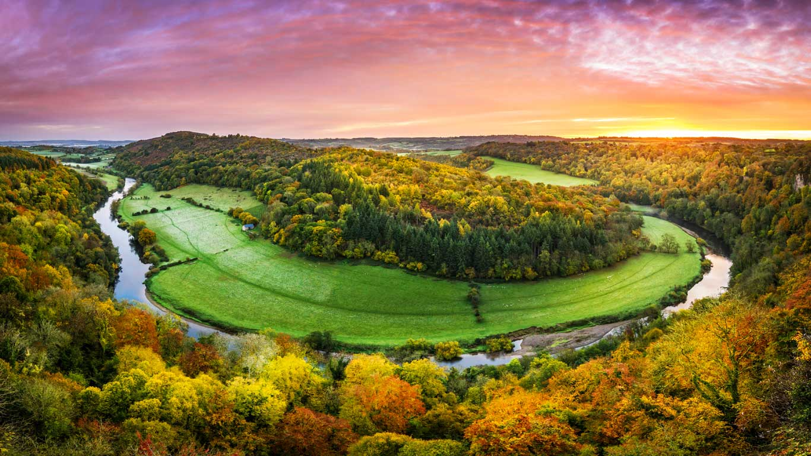

#### 20160825 Berg Lake Trail, Mount Robson Provincial Park, B.C. (© Brandon Smith/Alamy Stock Photo)(Bing Canada)

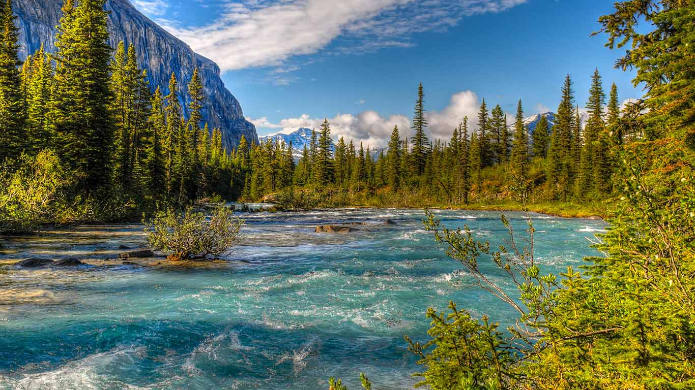

#### 20160824 【今日处暑】西藏风化地貌 (© aaaaimages/Moment/Getty Images)(Bing China)

#### 20160824 The Temple of Jupiter and Mount Vesuvius from Pompeii, Italy (© Design Pics Inc/REX/Shutterstock)(Bing United Kingdom)

#### 20160823 A coral reef in the Red Sea near Egypt (© cinoby/iStock/Getty Images)(Bing United Kingdom)

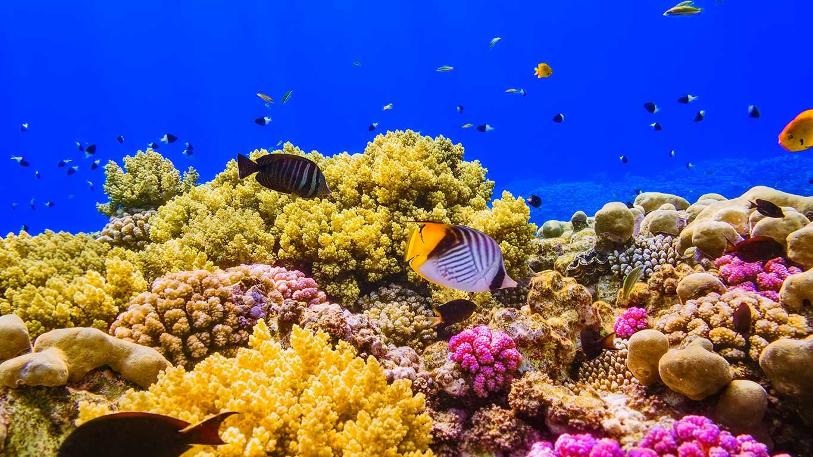

#### 20160823 Nächtlich beleuchtete Staumauer der Edertalsperre, Waldeck, Hessen, Deutschland (© Thorsten Wege/500px)(Bing Deutschland)

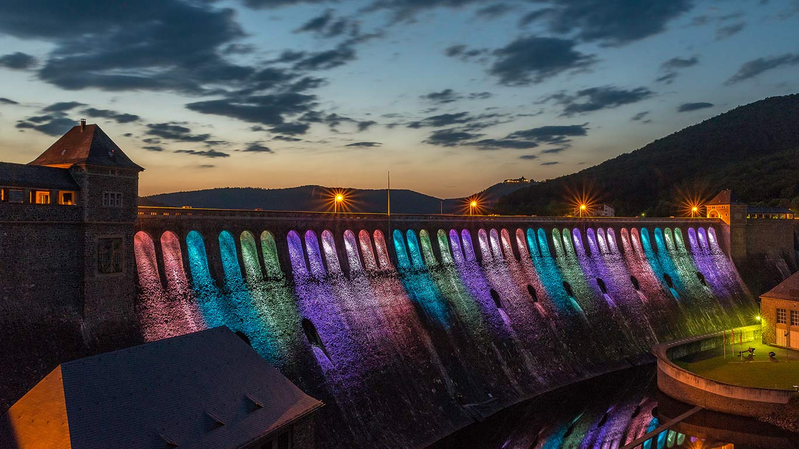

#### 20160822 Owlman of the Nazca Lines in Peru (© Laura Fafone/Getty Images)(Bing United Kingdom)

#### 20160821 Rio de Janeiro from Sugarloaf Mountain, Brazil (© Juan Carlos Ruiz/500px)(Bing United Kingdom)

#### 20160821 Mortlock Wing, State Library of South Australia (© Raymond Warren/Alamy)(Bing Australia)

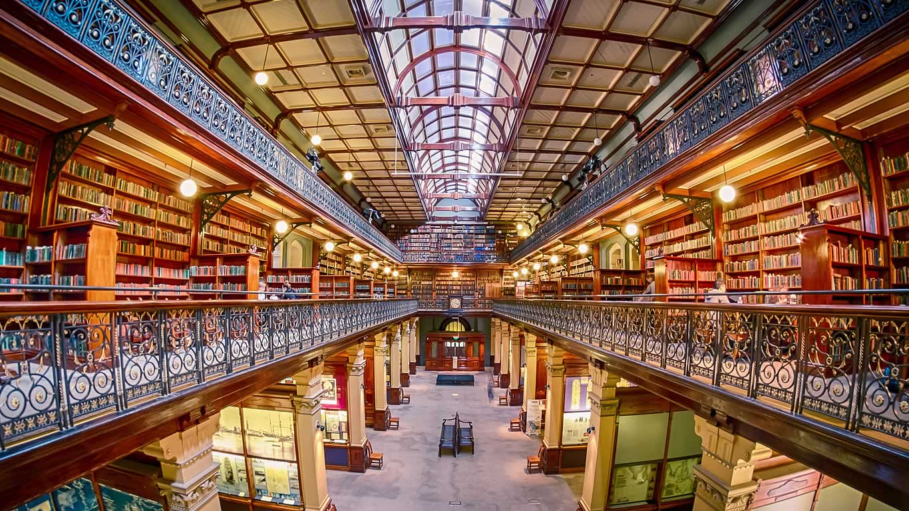

#### 20160820 Maria Lenk Aquatics Centre, Rio de Janeiro, Brazil (© Buda Mendes/Getty Images)(Bing United Kingdom)

#### 20160819 Common kingfishers perched on a camera lens (© Sijanto/Getty Images)(Bing United Kingdom)

#### 20160818 Centre d’entraînement de l’hippodrome de Maisons-Laffitte, Yvelines, Île-de-France (© Yann Arthus-Bertrand/Getty Images)(Bing France)

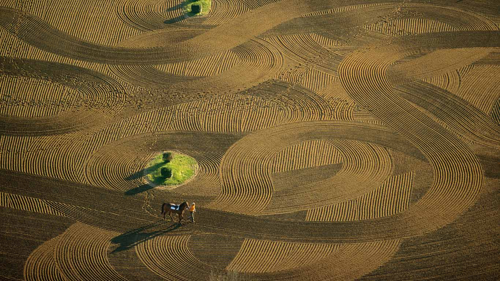

#### 20160818 Fort Jefferson in Dry Tortugas National Park, Florida (© Miami2you/Shutterstock)(Bing United Kingdom)

#### 20160817 A red pincushion bloom at Kirstenbosch National Botanical Garden, Cape Town, South Africa (© Mint Images/Frans Lanting)(Bing United Kingdom)

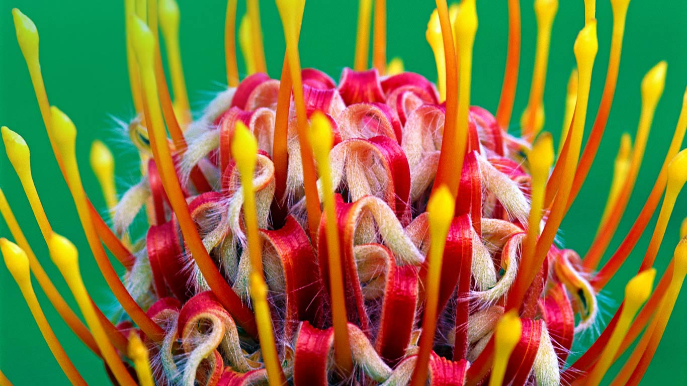

#### 20160817 ｢五山送り火｣京都 (© JTB MEDIA CREATION, Inc./Alamy Stock Photo)(Bing Japan)

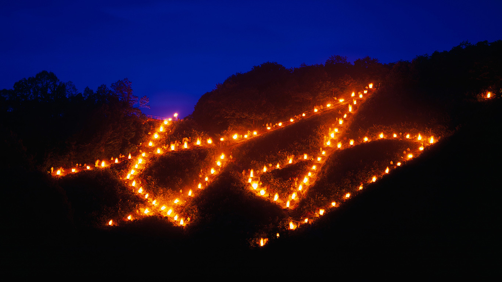

#### 20160816 The Pinnacles in Nambung National Park, Western Australia (© Ozimages/Alamy)(Bing Australia)

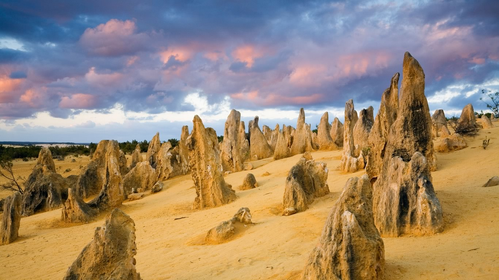

#### 20160816 Playa de Las Teresitas at San Andrés, Tenerife (© Cornelia Doerr/age fotostock)(Bing United Kingdom)

#### 20160815 Rio de Janeiro including Maracanã Stadium illuminated at night, Brazil (© Corey Jenkins/Alamy)(Bing United Kingdom)

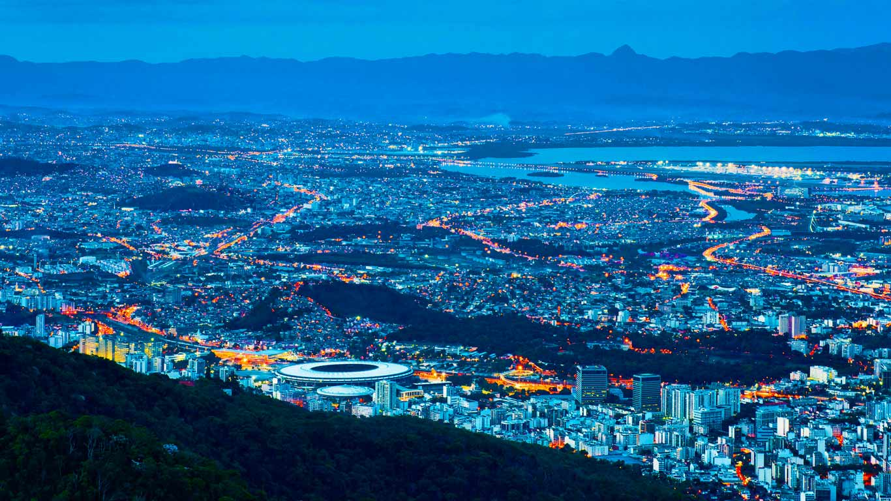

#### 20160815 A Eurasian lynx in Šumava National Park, Czech Republic (© Niall Benvie/Minden Pictures)(Bing United States)

#### 20160814 Tea plantation in Kericho County, Kenya (© Yann Arthus-Bertrand/Getty Images)(Bing United Kingdom)

#### 20160813 Matterhorn, Switzerland (© Markus Eichenberger Photo & Film Productions/Nimia)(Bing United States)

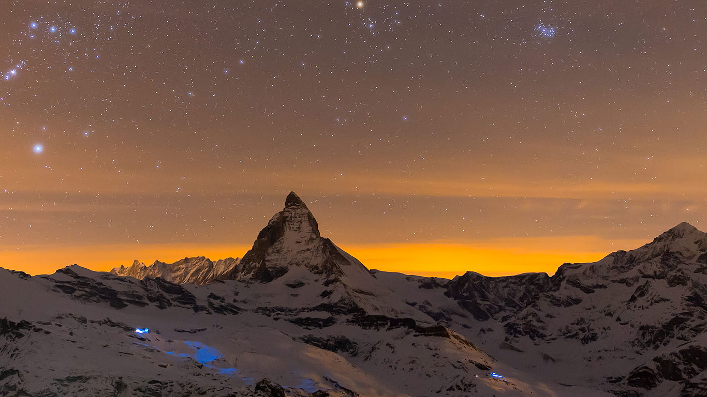

#### 20160813 Bacon Creek, Mount Baker-Snoqualmie National Forest, Washington (© Ethan Welty/Tandem Stills + Motion)(Bing United Kingdom)

#### 20160812 Elephants in Addo Elephant National Park, South Africa (© Johan Swanepoel/Alamy)(Bing United Kingdom)

#### 20160811 Ruderboote auf der Regattastrecke bei Oberschleißheim, Bayern, Deutschland (© Delta Image/Westend61 GmbH/Alamy Stock Photo)(Bing Deutschland)

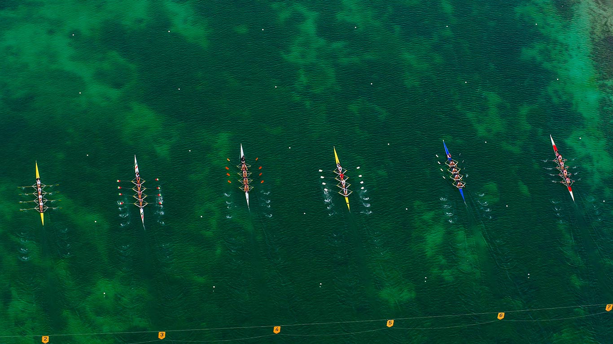

#### 20160811 Palm trees over Maho Bay, Virgin Islands National Park (© Shutterstock)(Bing United States)

#### 20160811 Blue Hen Falls, Cuyahoga Valley National Park, Ohio (© Patrick Jennings/Shutterstock)(Bing United Kingdom)

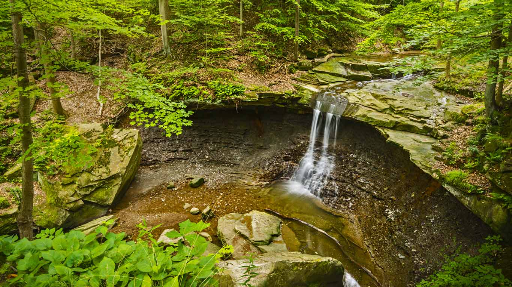

#### 20160810 【今日七夕】内蒙古阿尔山国家森林公园的一对天鹅 (© Blue Jean Images/Getty Images)(Bing China)

#### 20160810 Smithsonian touring exhibition at the 1904 St. Louis World’s Fair (© Bygone Collection/Alamy)(Bing United States)

#### 20160810 Dunraven Bay on the Glamorgan Heritage Coast, South Wales (© Adam Burton/Alamy)(Bing United Kingdom)

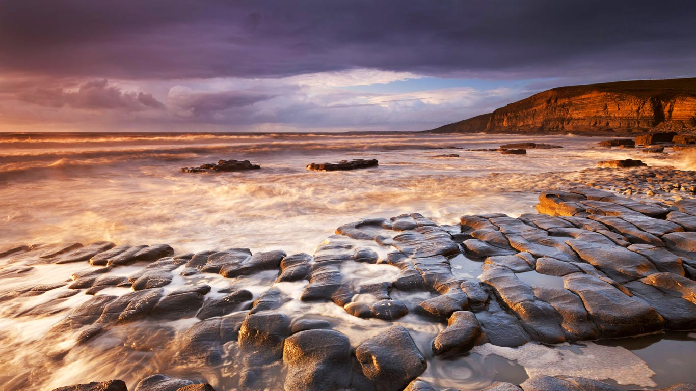

#### 20160809 Sand patterns made by pufferfish near Amami Oshima, Kagoshima, Japan (© Yoji Okata/Minden Pictures)(Bing United Kingdom)

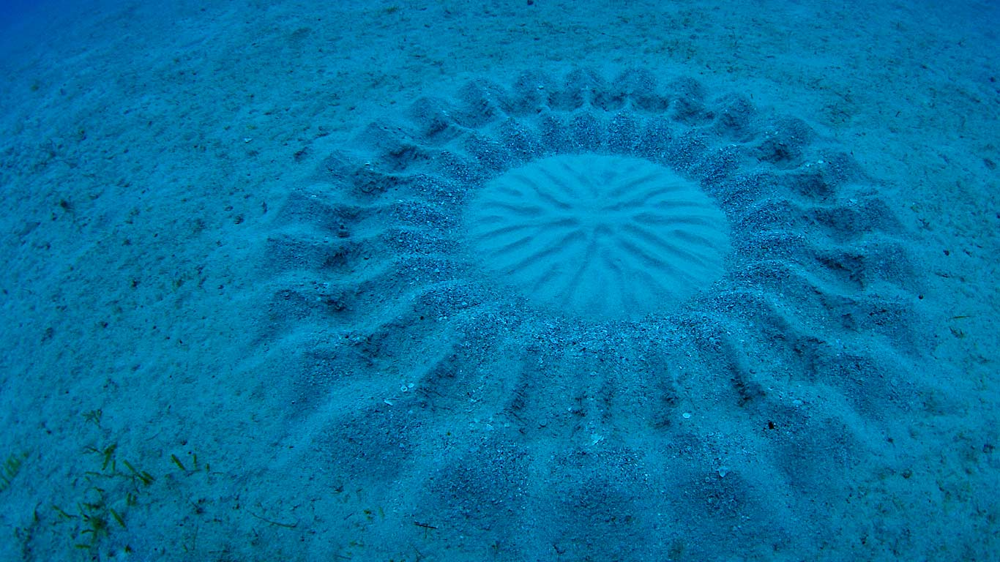

#### 20160808 篁岭家家户户正在晒辣椒和菊花，江西婺源 (© Xinhua/REX Shutterstock)(Bing China)

#### 20160808 Mar Saba monastery overlooking the Kidron Valley, Jerusalem, Israel (© Roman Pesarenko/500px)(Bing United Kingdom)

#### 20160807 Exterior of Mehrangarh Fort in Jodhpur, India (© Lucas Vallecillos/age fotostock)(Bing United Kingdom)

#### 20160807 ｢原爆ドーム｣広島, 平和記念公園 (© Kimimasa Mayama/epa european pressphoto agency b.v./Alamy)(Bing Japan)

#### 20160807 Chicago Harbor Light on Lake Michigan (© Tim Klein/Gallery Stock)(Bing United States)

#### 20160806 Saxon Switzerland National Park, Germany (© Andreas Vogel/500px)(Bing United Kingdom)

#### 20160805 Fireworks explode above the Maracanã Stadium in Rio de Janeiro, Brazil (© Buda Mendes/Getty Images)(Bing United Kingdom)

#### 20160805 Lapacho ou arbre sacré des Incas, montagne de Kaw, Guyane française (© Yann Arthus-Bertrand/Getty Images)(Bing France)

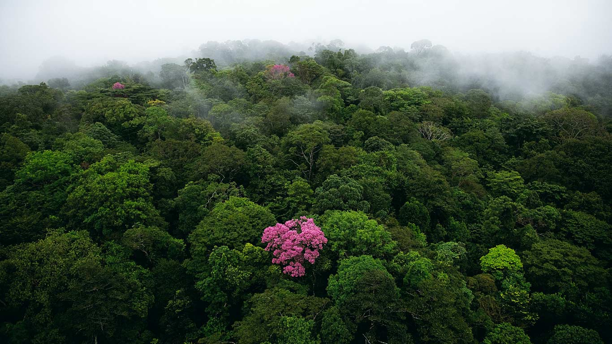

#### 20160804 Jesup Path in Acadia National Park, Maine (© Pat & Chuck Blackley/Alamy)(Bing United States)

#### 20160804 Thredbo River in Kosciuszko National Park, Australia (© Ted Mead/Getty Images)(Bing Australia)

#### 20160804 A European roller preening in Bulgaria (© Marion Vollborn/Minden Pictures)(Bing United Kingdom)

#### 20160804 American Bisons, Elk Island National Park, Alberta (© Thomas Peter Widmann/Age Fotostock)(Bing Canada)

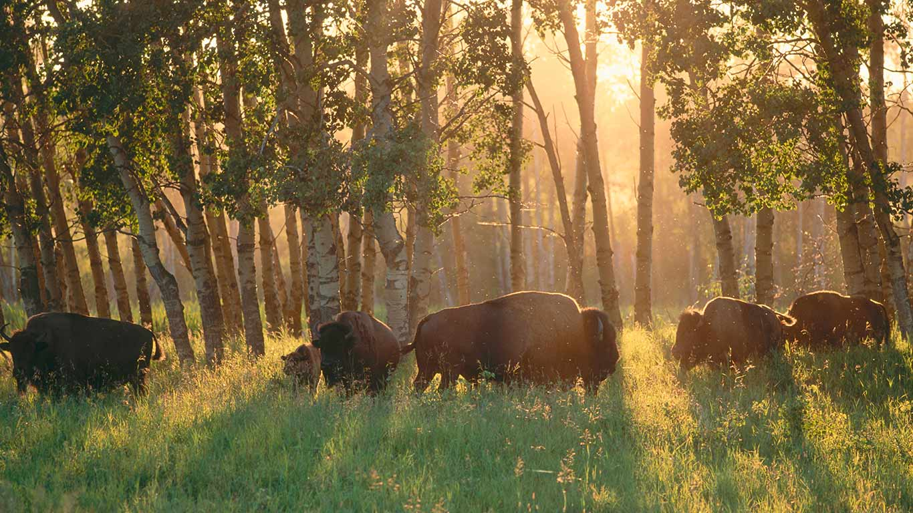

#### 20160803 Sun setting in Dartmoor National Park, Devon (© Jonathan Scott/Nimia)(Bing United Kingdom)

#### 20160802 Harbin Opera House in Harbin, China (© Hufton and Crow/VIEW Pictures Ltd/Alamy)(Bing United Kingdom)

#### 20160801 Views from Strid Wood over the River Wharfe in North Yorkshire (© Natalie Sternberg/4Corners)(Bing United Kingdom)

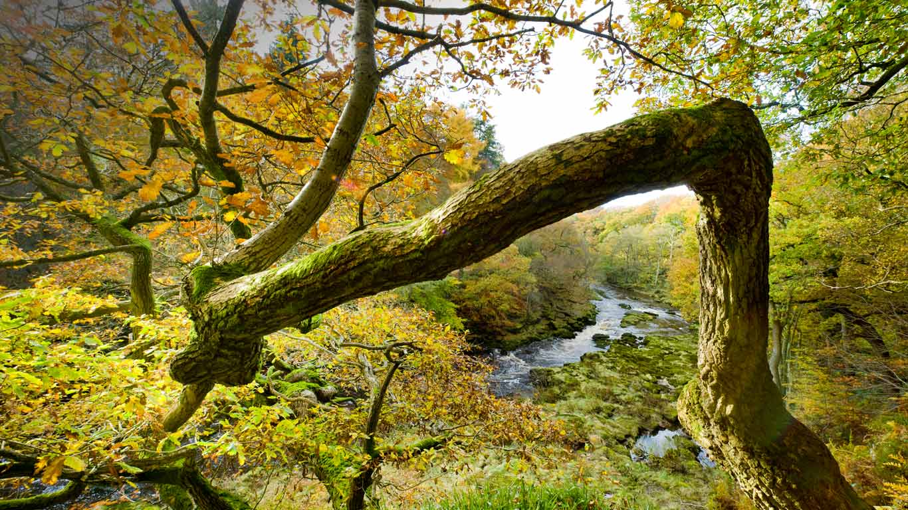

#### 20160801 African lionesses in Masai Mara National Reserve, Kenya (© Daniel J Cox/Getty Images)(Bing United States)

