#### 20160930 Trees covered in moss at Monk’s Dale in the Peak District, Derbyshire (© R A Kearton/Getty Images)(Bing United Kingdom)

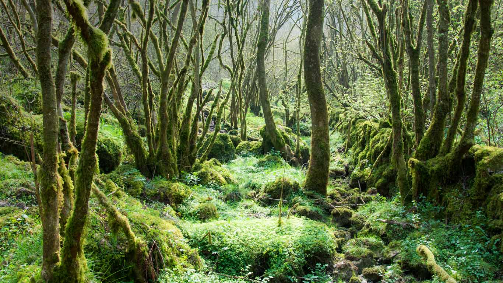

#### 20160929 Whooper swans on Lake Kussharo, Hokkaido, Japan (© Ocean/Corbis)(Bing United Kingdom)

#### 20160929 Pincushion protea flowers near the Bay of Fires in Tasmania, Australia (© Frank Krahmer/Getty Images/Corbis Documentary)(Bing Australia)

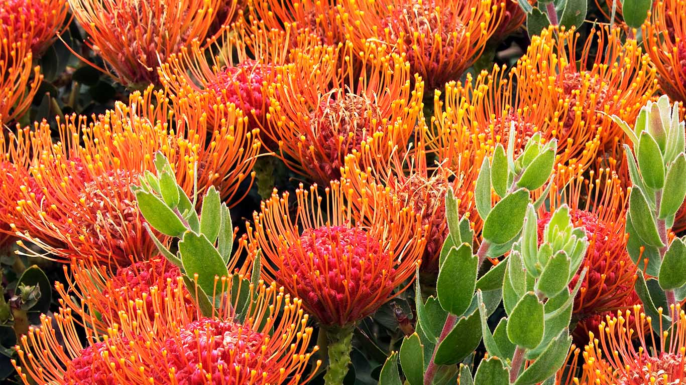

#### 20160928 Clouds over Mont Ventoux, France (© Drone Under/Nimia)(Bing United Kingdom)

#### 20160927 ｢嫁ヶ島と袖師地蔵｣島根, 松江市 (© MIXA/http://www.superstock.com/Superstock)(Bing Japan)

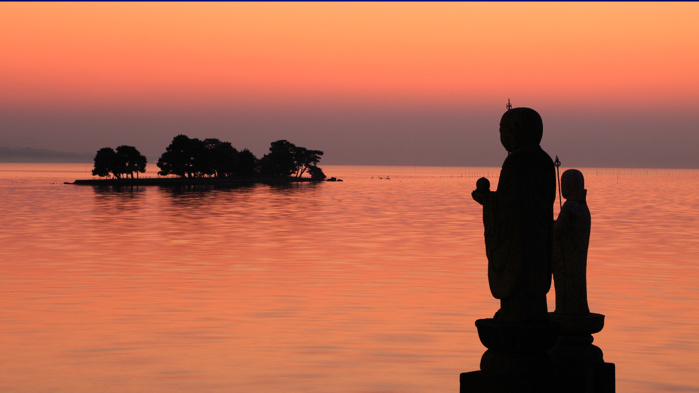

#### 20160927 Trwyn Du Lighthouse in Anglesey off the north-west coast of Wales (© Kris Williams/500px)(Bing United Kingdom)

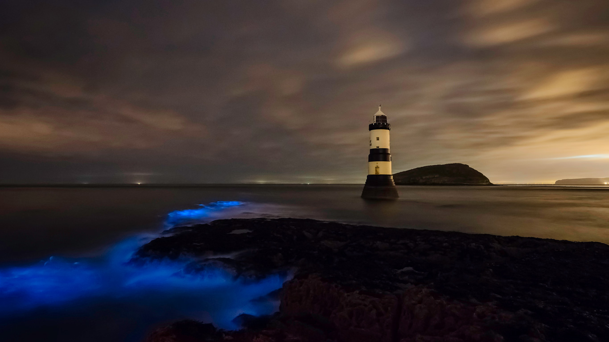

#### 20160927 Island in Fenton Lake, Lake Superior Provincial Park, Ontario, Canada (© Mike Grandmaison/Getty Images)(Bing United States)

#### 20160927 Sunset in the town of Fleur de Lys, Dorset Trail, Nfld. (© Rolf Hicker/Age Footstock)(Bing Canada)

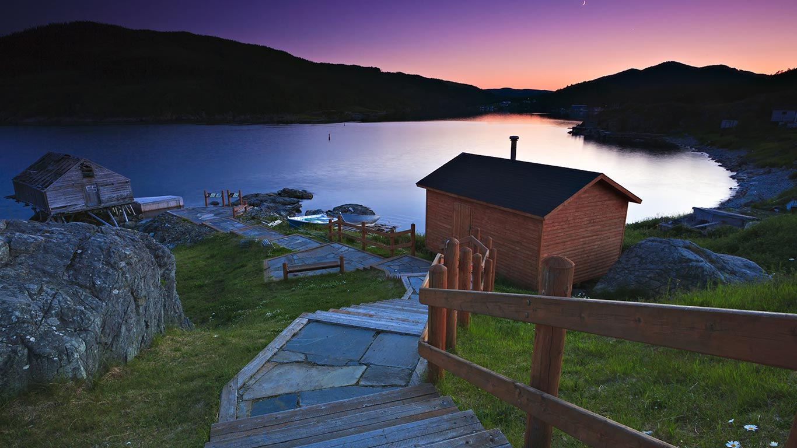

#### 20160926 Marais salants à Ars-en-Ré, île de Ré, Charente-Maritime (© Francis Leroy/hemis.fr/Getty Images)(Bing France)

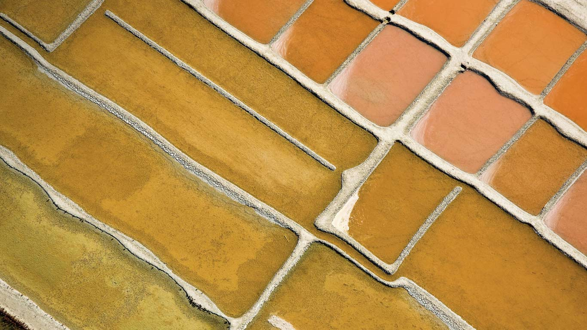

#### 20160926 Harpa Concert Hall in Reykjavík, Iceland (© Juan Carlos Muñoz/age fotostock)(Bing United Kingdom)

#### 20160925 Wicker fields near Cuenca, Spain (© David Santiago Garcia/Aurora Photos)(Bing United Kingdom)

#### 20160924 European hares in tall grass (© Jackie Bale/Getty Images)(Bing United Kingdom)

#### 20160923 Isabel Centre for the Performing Arts, Kingston, Ont. (© View Pictures/REX/Shutterstock)(Bing Canada)

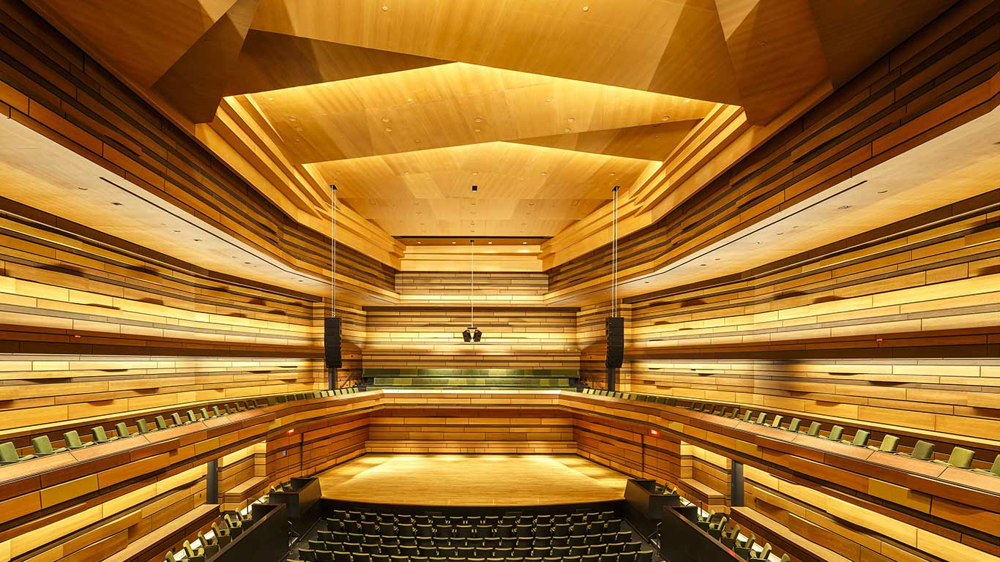

#### 20160923 【今日秋分】大丰收的稻草束，广西龙胜各族自治县 (© Federico Ravassard/500px)(Bing China)

#### 20160923 Great Sand Dunes National Park and Preserve, Colorado (© Ian Shive/Tandem Stills + Motion)(Bing United Kingdom)

#### 20160922 Autumn colours in Cheshire (© 2015 Light and Time Productions/Nimia)(Bing United Kingdom)

#### 20160921 Treppenhaus im Jagdschloss Granitz, Insel Rügen, Mecklenburg-Vorpommern, Deutschland (© mauritius images GmbH/Alamy)(Bing Deutschland)

#### 20160921 Castelmezzano, Italy (© Federico Ravassard/500px)(Bing United Kingdom)

#### 20160920 Cône volcanique de Vulcania, Saint-Ours-les-Roches, Puy-de-Dôme, Auvergne (© imageBROKER/Alamy Stock Photo)(Bing France)

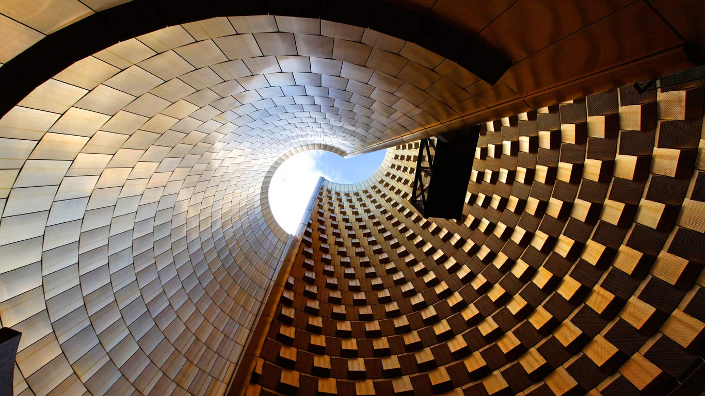

#### 20160920 Narrow Neck Plateau, Blue Mountains, NSW, Australia (© Braedostok/Alamy)(Bing Australia)

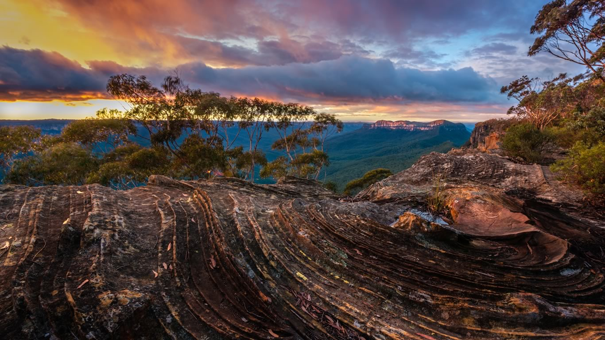

#### 20160920 Ladakh, India (© Nutthavood Punpeng/500px)(Bing United Kingdom)

#### 20160919 Red-lored parrots in Ecuador (© Pete Oxford/Minden Pictures)(Bing United Kingdom)

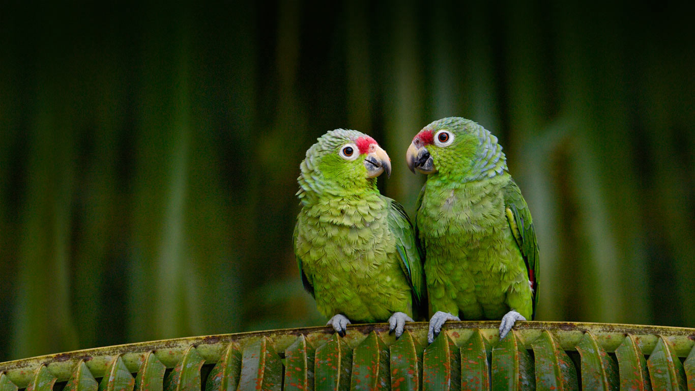

#### 20160918 Fog over Sofia, Bulgaria (© Ivan Dimitrov/Solent News/REX/Shutterstock)(Bing United Kingdom)

#### 20160917 Amusement ride at Oktoberfest in Munich, Germany (© Wolfilser/Shutterstock)(Bing United Kingdom)

#### 20160917 Man lacing skates (© Darren Greenwood/Getty Images)(Bing Canada)

#### 20160916 Interior ceiling view of Webb Chapel Park Pavilion, Dallas, Texas (© ARCHPHOTO/Gallery Stock)(Bing United Kingdom)

#### 20160916 【今日中秋】各式各样的月饼模具，浙江 (© greenlin/Moment Open/Getty)(Bing China)

#### 20160915 Matsushima Bay at night with full moon, Matsushima town, Miyagi prefecture, Japan (© Hiroyuki Yamaguchi/Getty Images)(Bing United Kingdom)

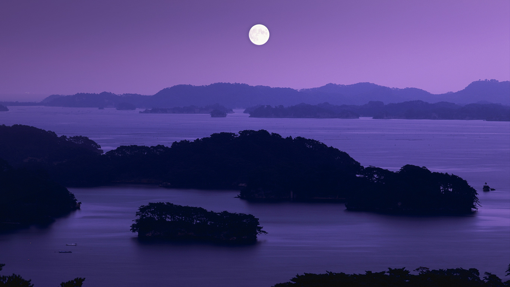

#### 20160914 Sugar glider (© Scott Linstead/Science Source)(Bing Australia)

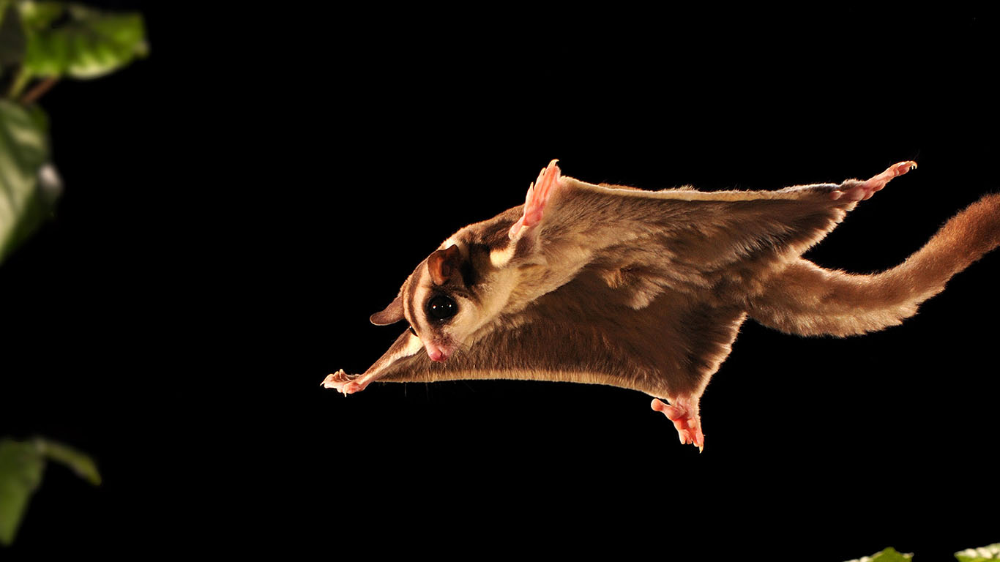

#### 20160914 Roussanou Monastery in Meteora, Greece (© Stian Rekdal/Nimia)(Bing United Kingdom)

#### 20160913 Luftbild der „Slinky Springs to Fame“-Brücke über den Rhein-Herne-Kanal, Oberhausen, Nordrhein-Westfalen, Deutschland (© imageBROKER/Alamy)(Bing Deutschland)

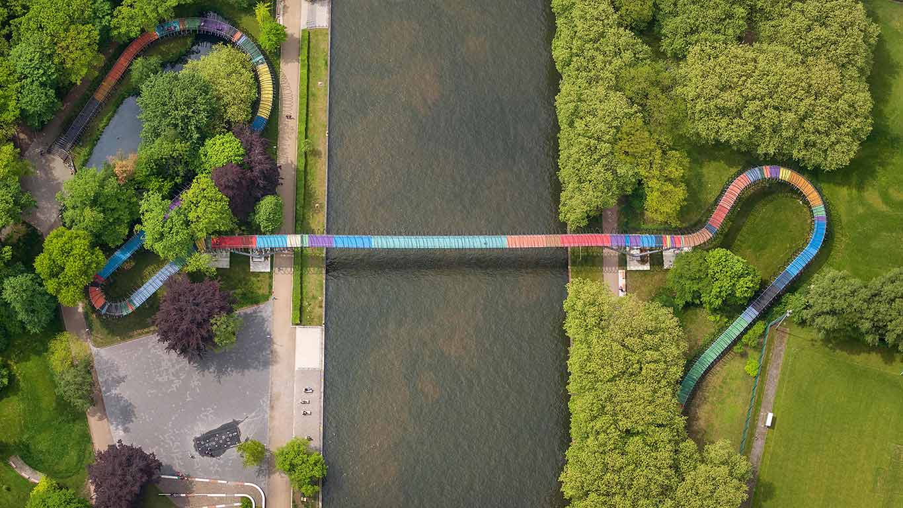

#### 20160913 A Roald Dahl-themed maze in York (© Andrew McCaren/LNP/Rex/Shutterstock)(Bing United Kingdom)

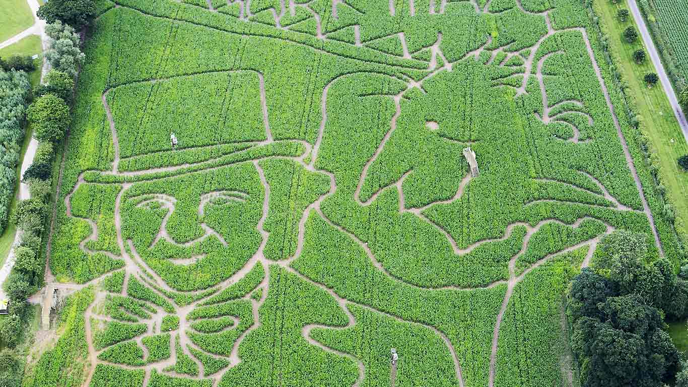

#### 20160912 Champs de lavande sur le plateau de Valensole, Alpes-de-Haute-Provence, PACA (© Andrea Pavan/PhotoFVG/SIME/4Corners)(Bing France)

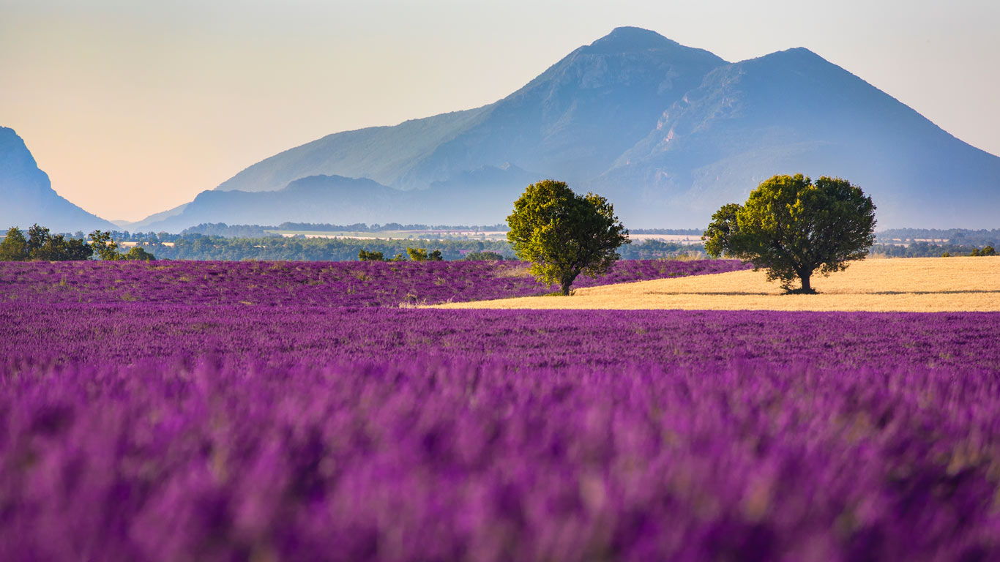

#### 20160912 A school of razorfish swims for cover among the branches of a red sea whip, Kimbe Bay, New Britain, Papua New Guinea (© David Doubilet/Getty Images)(Bing United Kingdom)

#### 20160911 桑斯附近的约纳河，约纳部，勃艮第 (© Florentin Gagoum/500px)(Bing China)

#### 20160911 Columnar basalt stone in the Umpqua National Forest, Oregon (© Jaynes Gallery/Danita Delimont)(Bing United Kingdom)

#### 20160911 ‘Postcards’–The Staten Island September 11 Memorial, New York (© Gozooma/Gallery Stock)(Bing United States)

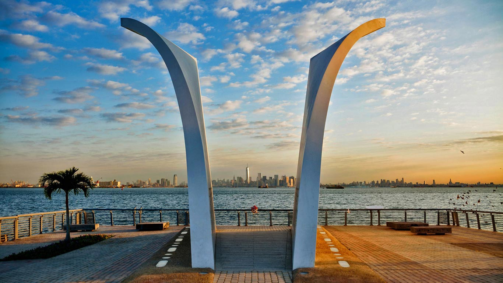

#### 20160910 Acoustic sound panels in the roof of the Royal Albert Hall, London (© chrisstockphotography/Alamy)(Bing United Kingdom)

#### 20160909 Scots pine trees on Sula island, Sogn og Fjordane, Norway (© Orsolya Haarberg/Minden Pictures)(Bing United Kingdom)

#### 20160908 35mm Reel of Film (© MasterFile)(Bing Canada)

#### 20160908 Stockholm Public Library in Stockholm, Sweden (© Gallery Stock)(Bing United Kingdom)

#### 20160908 【今日白露】东江上的一叶扁舟，广东省 (© Li Feng/500px)(Bing China)

#### 20160908 Vineyard in Barossa Valley, South Australia (© Troyana/Getty Images)(Bing Australia)

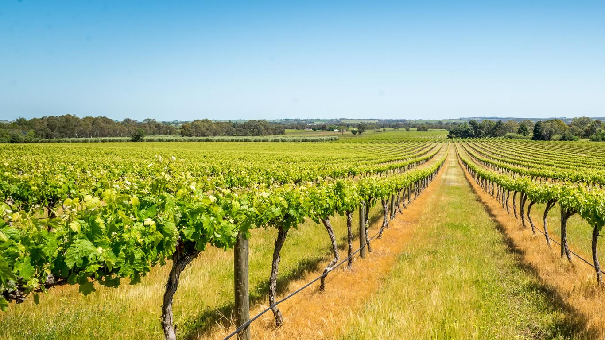

#### 20160907 Coastal Spain seen from the International Space Station (© Scott Kelly/NASA/Alamy)(Bing United Kingdom)

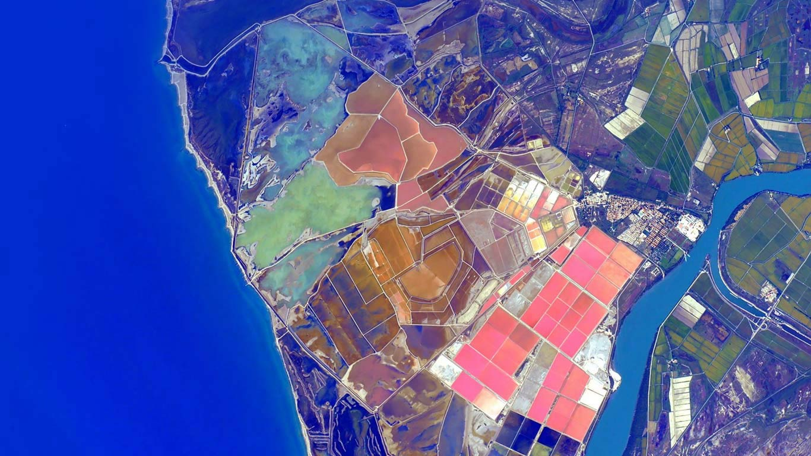

#### 20160906 Badegäste am Silbersee II, Haltern am See, Nordrhein-Westfalen, Deutschland (© imageBROKER/REX/Shutterstock/Rex Images)(Bing Deutschland)

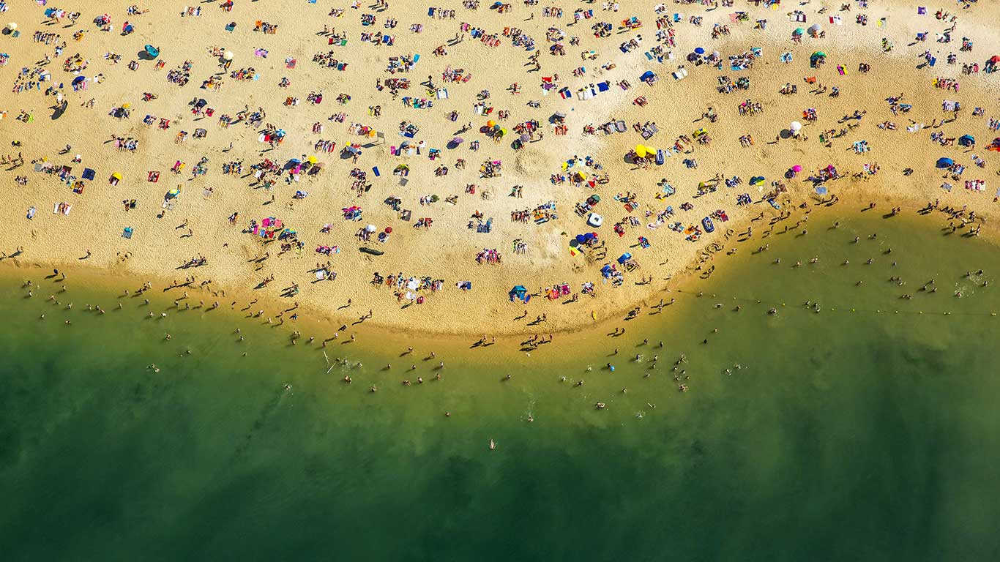

#### 20160906 Waterfalls in Phnom Kulen National Park, Cambodia (© f9photos/Shutterstock)(Bing United Kingdom)

#### 20160905 Workers applying stucco to a wall of a new building (© Ognian Medarov/500px)(Bing United States)

#### 20160905 The Tarr Steps across the River Barle in Exmoor National Park, Somerset (© Sebastian Wasek/age fotostock)(Bing United Kingdom)

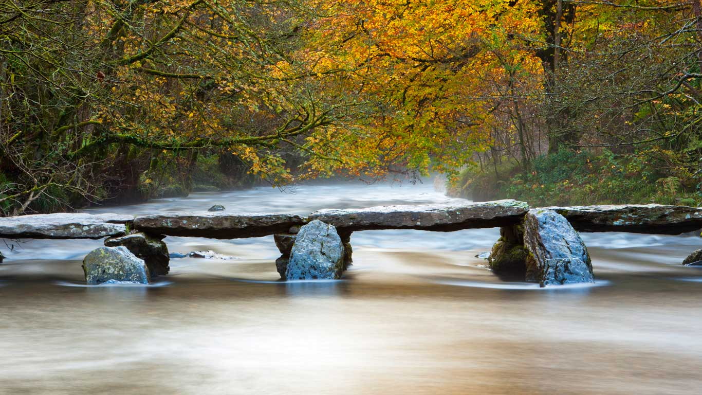

#### 20160904 A flock of sheep grazing in Tuscany, Italy (© 500px/Aurora Photos)(Bing United States)

#### 20160904 Portage Lake in Chugach National Forest, Alaska (© Ron Niebrugge/Alamy)(Bing United Kingdom)

#### 20160903 Moscow International Business Centre in Russia (© Nikolay Rykov/Getty Images)(Bing United Kingdom)

#### 20160902 Troupeau d’oies domestiques en Dordogne (© Philippe Body/Hemis/Corbis)(Bing France)

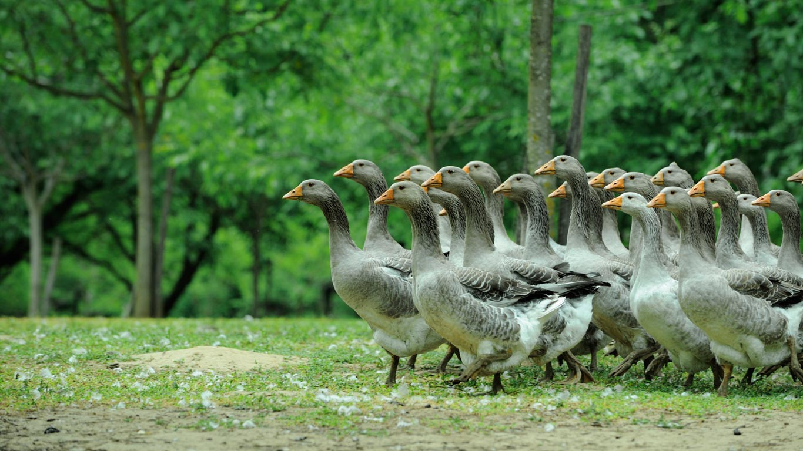

#### 20160902 Burchell's zebras crossing the Makgadikgadi Pan in Botswana (© Richard Du Toit/Minden Pictures)(Bing United Kingdom)

#### 20160901 Northern gannets on the Saltee Islands, Ireland (© Bart Breet/Minden Pictures)(Bing United Kingdom)

