#### 20161031 九寨沟国家公园内的枫树 (© Cornelia Doerr/Getty Images)(Bing China)

#### 20161031 A haunted graveyard (© Shutterstock/Getty Images)(Bing United Kingdom)

#### 20161030 Vue depuis la Roche d'Oëtre dans la Suisse normande, Calvados, Normandie (© Lucas Heitz/Alamy Stock Photo)(Bing France)

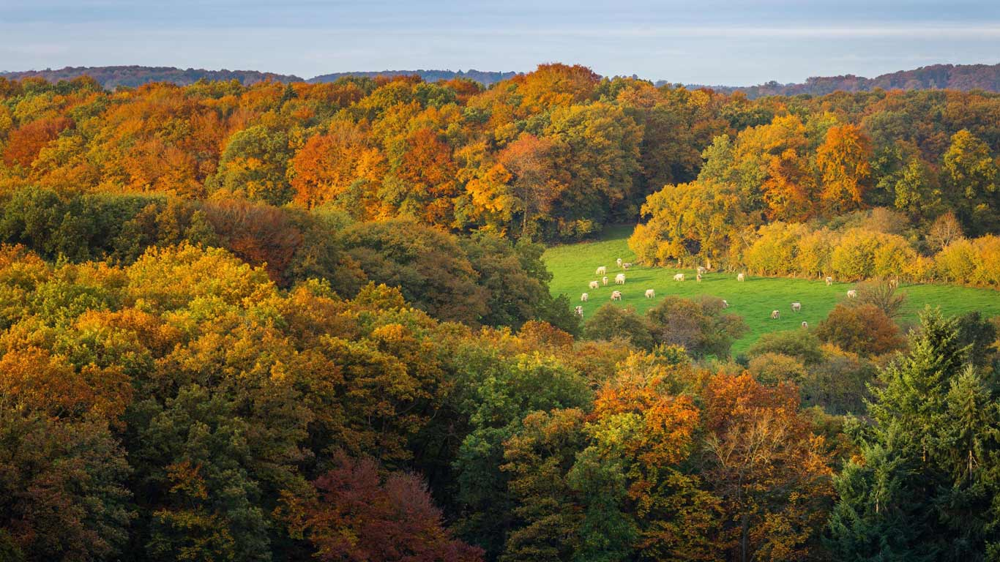

#### 20161030 Phyllidia coelestis, a sea slug (© Jurgen Freund/Aurora Photos)(Bing United Kingdom)

#### 20161030 An African leopard in the Londolozi Private Game Reserve, South Africa (© Sergey Gorshkov/Minden Pictures)(Bing United States)

#### 20161030 Rangoli and lamps during Diwali festival in India (© DrSKN08/Moment Open/Getty Images)(Bing Canada)

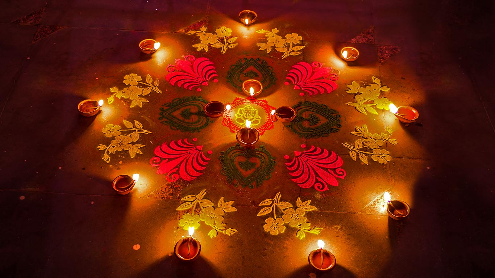

#### 20161029 Grey-headed flying fox (© Craig Dingle/Getty Images)(Bing United Kingdom)

#### 20161028 Mist across the Transylvanian countryside in Romania (© Alex Robciuc/REX/Shutterstock)(Bing United Kingdom)

#### 20161027 Boats on Derwentwater in the Lake District National Park, Cumbria (© Adam Burton/AWL Images/Getty Images)(Bing United Kingdom)

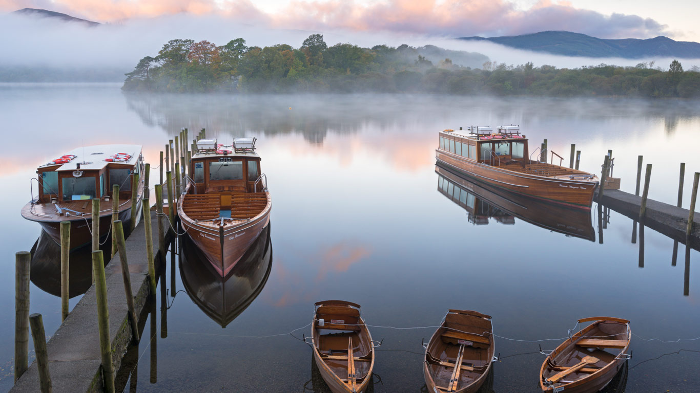

#### 20161026 Red Fox (Vulpes vulpes) Canada (© Mark Raycroft/Minden Pictures)(Bing Canada)

#### 20161026 Mainschleife bei Nordheim, Bayern, Deutschland (© Rüdiger Hess/geo-select FotoArt)(Bing Deutschland)

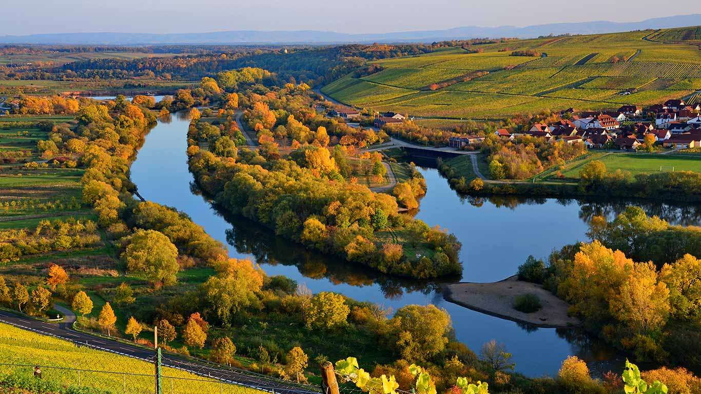

#### 20161026 Female greater kudu in Chobe National Park, Botswana (© WorldFoto/Aurora Photos)(Bing United Kingdom)

#### 20161025 Gypsum claypans in Francois Peron National Park, Western Australia (© Yann Arthus-Bertrand/Getty Images)(Bing Australia)

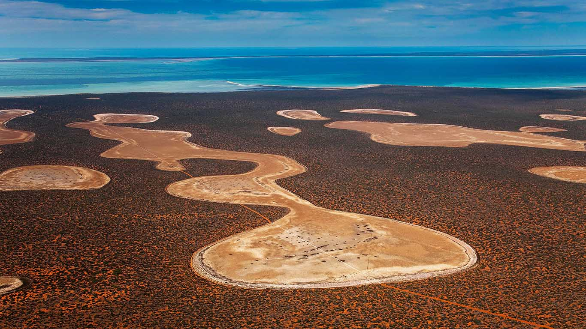

#### 20161025 The eruption of Eyjafjallajökull at Fimmvörðuháls Pass in Iceland (© moodboard/Cultura/Getty Images)(Bing United Kingdom)

#### 20161024 King River tidal flats near Wyndham, Australia (© Ralph Lee Hopkins/Offset)(Bing United Kingdom)

#### 20161023 Schönbrunn Palace gardens in Vienna, Austria (© badahos/Shutterstock)(Bing United Kingdom)

#### 20161023 Grenouille rousse dans le parc naturel régional de la forêt d’Orient, Champagne (© Andres M. Dominguez/Minden Pictures)(Bing France)

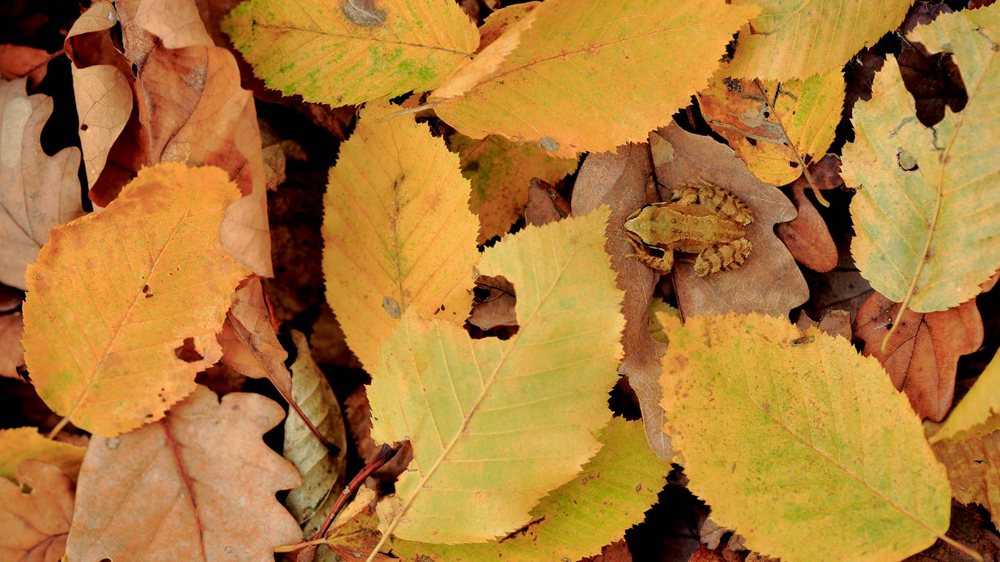

#### 20161022 Messner Mountain Museum in the Clouds on Monte Rite, Italy (© Alberto Simonetti/Getty Images)(Bing United States)

#### 20161022 Mount Tarawera on the North Island, New Zealand (© Look Foto/Aurora Photos)(Bing United Kingdom)

#### 20161021 The ceiling of the Arab Room at Cardiff Castle (© Neil McAllister/Alamy)(Bing United Kingdom)

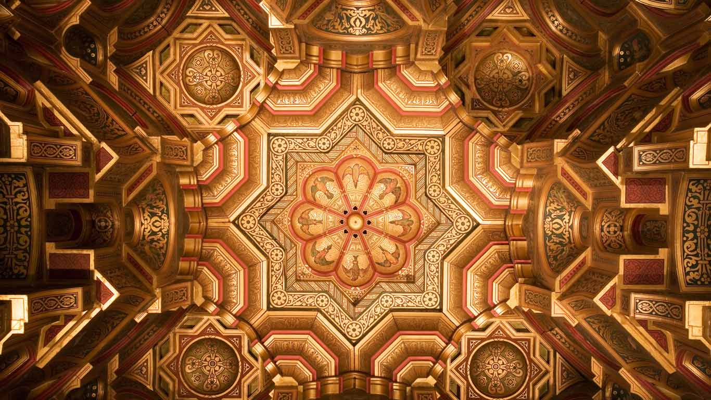

#### 20161020 Ashland Bridge in Yorklyn, Delaware (© Robert Kirk/Getty Images)(Bing United Kingdom)

#### 20161019 Riesenglanzschnecke auf einem taubenetzten Grashalm, Bayern, Deutschland (© Konrad Wothe/Minden Pictures)(Bing Deutschland)

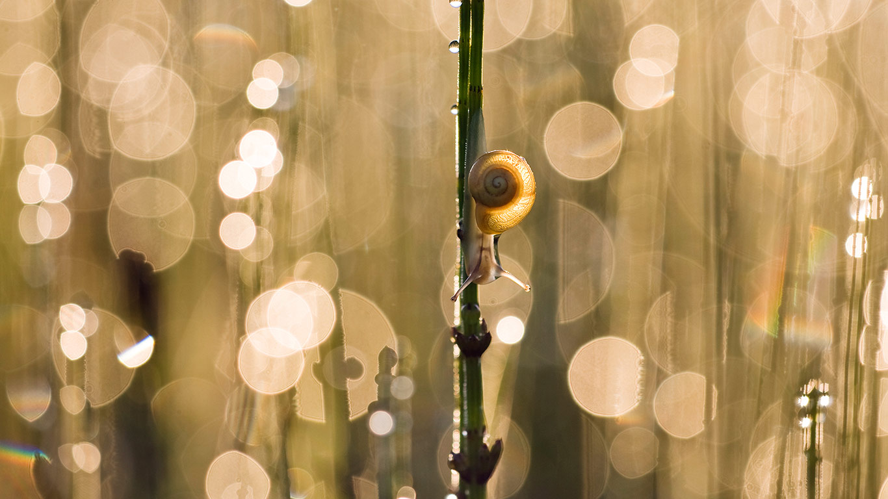

#### 20161019 Sunset on Hạ Long Bay, Vietnam (© Banana Republic Images/Shutterstock)(Bing United Kingdom)

#### 20161018 Limestone cliffs in Foradada, Catalonia, Spain (© Inaki Relanzon/Minden Pictures)(Bing United Kingdom)

#### 20161018 Nature's Window at Kalbarri National Park, Western Australia (© Andrew Bertuleit/Getty Images)(Bing Australia)

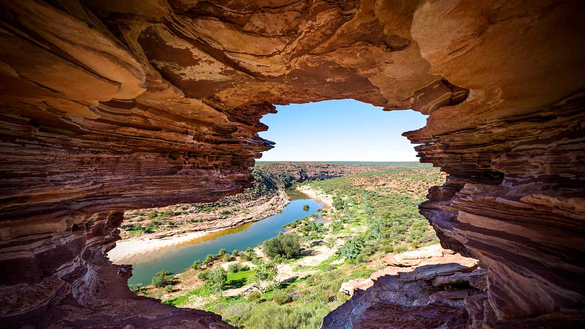

#### 20161017 Château de la Madeleine au bord de la Seine, Pressagny-l'Orgueilleux, Normandie (© Francis Cormon/hemis.fr/Getty Images)(Bing France)

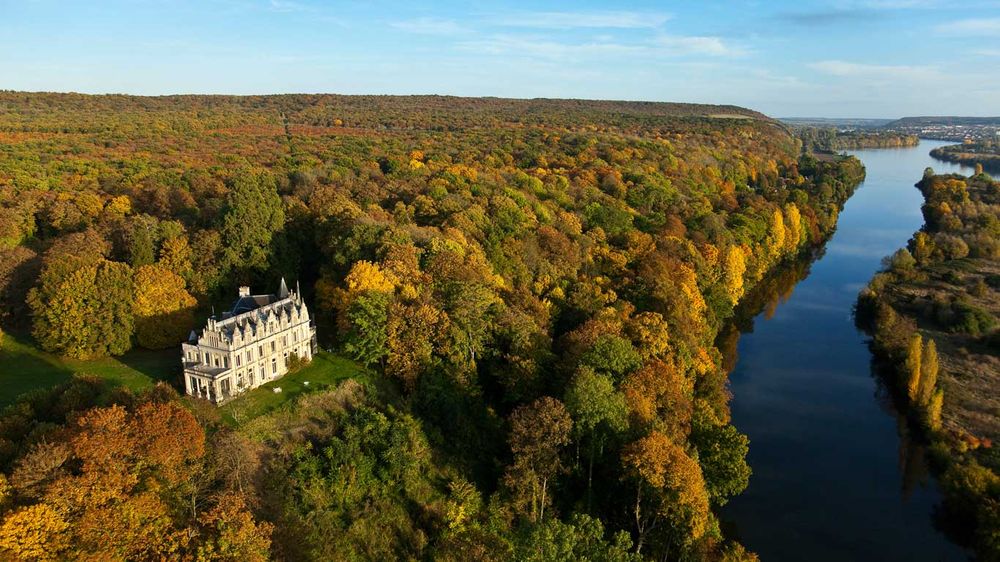

#### 20161017 Greater flamingos in Tanzania (© DLILLC/Corbis/VCG Getty Images)(Bing United Kingdom)

#### 20161016 A boat in the Ganges river at Varanasi, India (© David Santiago Garcia/Aurora Photos)(Bing United Kingdom)

#### 20161016 Autumn foliage reflected in pond with lily pads, Que. (© Mike Grandmaison/Getty Images)(Bing Canada)

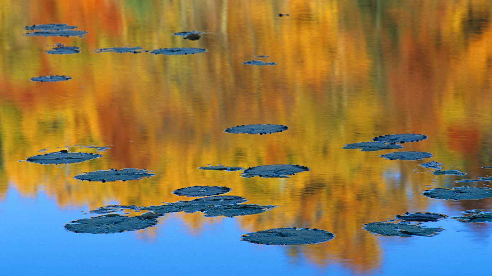

#### 20161015 Cherry orchards in the Columbia River Gorge National Scenic Area, Oregon (© Jaynes Gallery/Danita Delimont)(Bing United States)

#### 20161015 Lacs des Cheserys with Aiguilles de Chamonix, Chamonix, Haute-Savoie, France (© David Pattyn/Minden Pictures)(Bing United Kingdom)

#### 20161014 Volcanic slopes in Pinnacles National Park, California (© Don Smith/Getty Images)(Bing United Kingdom)

#### 20161013 Aerial view of Sheffield Park and Garden in East Sussex (© Clive Nichols/Corbis Documentary/Getty Images)(Bing United Kingdom)

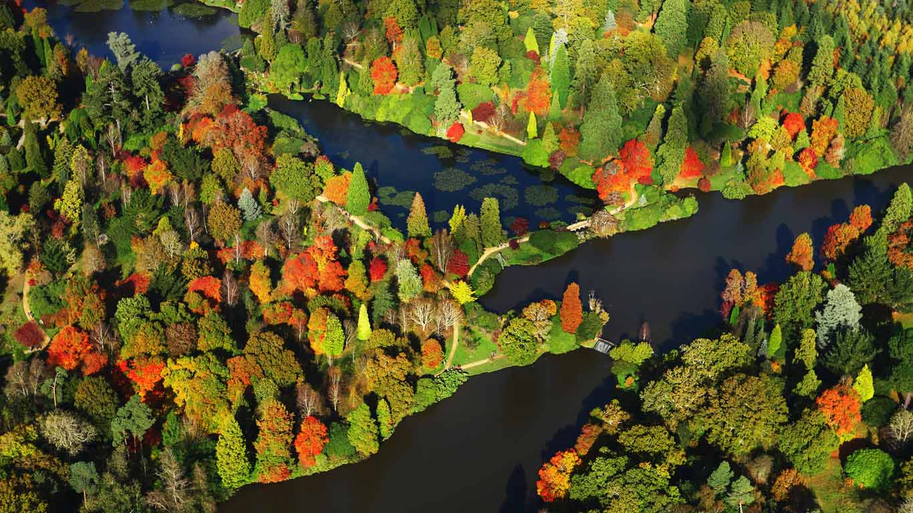

#### 20161012 Mountain trail in Madeira, Portugal (© Rusinka/Shutterstock)(Bing United Kingdom)

#### 20161011 A yellow-fronted woodpecker in Brazil (© Rafael Guadeluppe/Getty Images)(Bing United Kingdom)

#### 20161011 Sunshine Squash at a farm produce market (© 167/Pete Ryan/Ocean/Corbis)(Bing Canada)

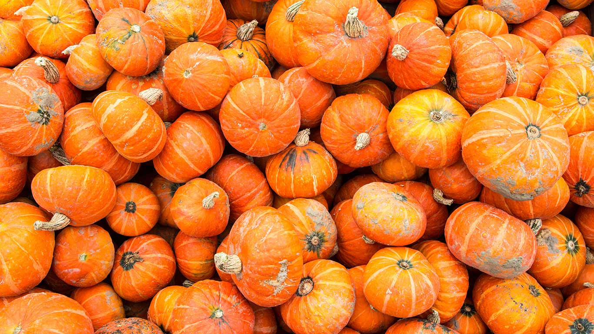

#### 20161010 Autumn in the East Siberian taiga, Russia (© Serguei Fomine/500px)(Bing United States)

#### 20161010 Testing mirror segments for the James Webb Space Telescope (© NASA)(Bing United Kingdom)

#### 20161009 Zuiderduintjes in the West Frisian Islands, Netherlands (© Pete Leonard/Getty Images)(Bing United Kingdom)

#### 20161008 The Berlin Cathedral illuminated during the Festival of Lights in Berlin, Germany (© Paul Zinken/Alamy)(Bing United Kingdom)

#### 20161007 A harbour seal near Islay, Scotland (© Laurie Campbell/Minden Pictures)(Bing United Kingdom)

#### 20161006 Hong Kong, China (© Banana Republic Images/Shutterstock)(Bing United Kingdom)

#### 20161005 Emperor penguin adult and chicks, Snow Hill Island, Antarctica (© Mike Hill/Getty Images)(Bing United Kingdom)

#### 20161004 Small island cays west of Great Exuma in the Bahamas photographed from the International Space Station (© NASA)(Bing United Kingdom)

#### 20161004 Harde de chamois en automne, Vosges (© Berndt Fischer/Age fotostock)(Bing France)

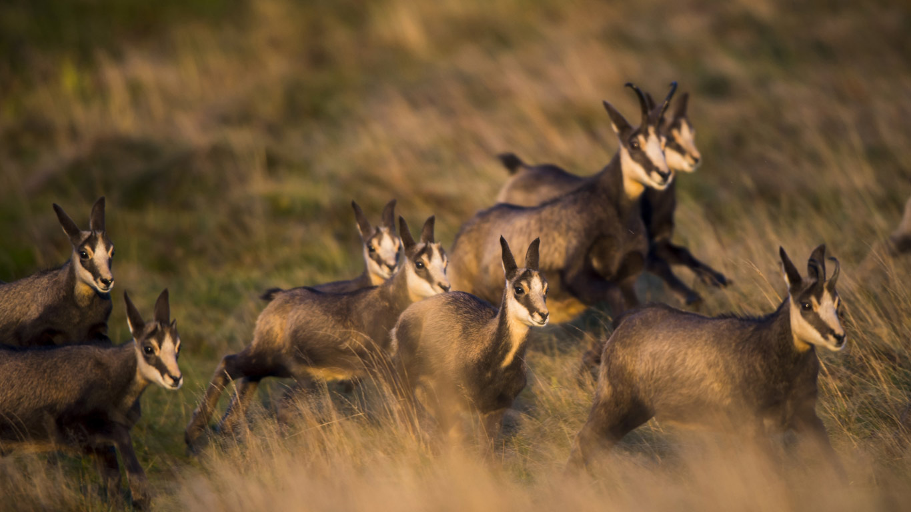

#### 20161003 Cliff dwelling at Canyon de Chelly National Monument in Arizona (© Design Pics/Offset)(Bing United Kingdom)

#### 20161002 门头沟区永定楼的星夜，北京 (© Viewstock/Getty Images)(Bing China)

#### 20161002 Rakotzbrücke aka the Devil's Bridge in Rhododendron Park, Kromlau, Saxony, Germany (© Fotoatelier Berlin/Getty Images)(Bing United Kingdom)

#### 20161002 Acoustic sound panels in the ceiling of the Royal Albert Hall, London (© chrisstockphotography/Alamy)(Bing United States)

#### 20161001 Iron Canyon Trail near Park City, Utah (© Patrick Brandenburg/Tandem Stills + Motion)(Bing United Kingdom)

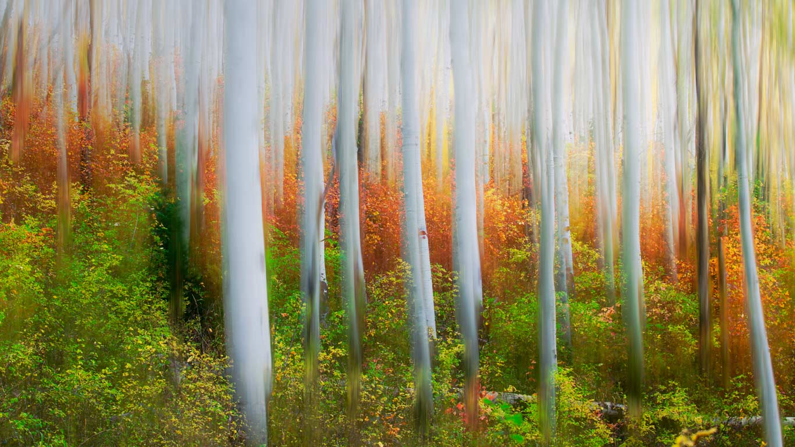

