#### 20161130 The Saltire projected onto Edinburgh Castle (© Ian Macrae Young/Alamy)(Bing United Kingdom)

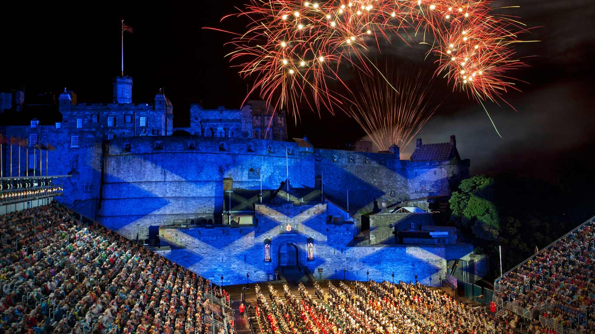

#### 20161130 Gray Jay at Riding Mountain National Park, Manitoba (© creighton359/Getty Images)(Bing Canada)

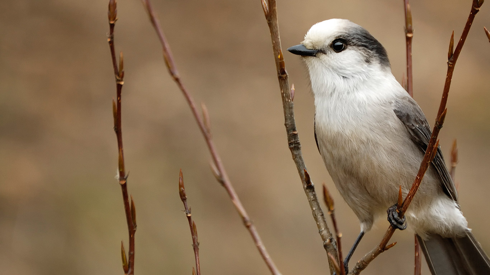

#### 20161129 San Francisco-Oakland Bay Bridge with San Francisco in the background, California (© Engel Ching/Alamy)(Bing United Kingdom)

#### 20161128 Antique radiometers at the Royal Society's headquarters in London (© Peter Macdiarmid/Staff/Getty Images)(Bing United Kingdom)

#### 20161127 The tower at Victoria Beach, Laguna Beach, California (© Jon Bilous/Shutterstock)(Bing United Kingdom)

#### 20161126 A field of primitive sea pens, Hussar Point, B.C. (© Mauricio Handler/National Geographic Creative/Getty Images)(Bing Canada)

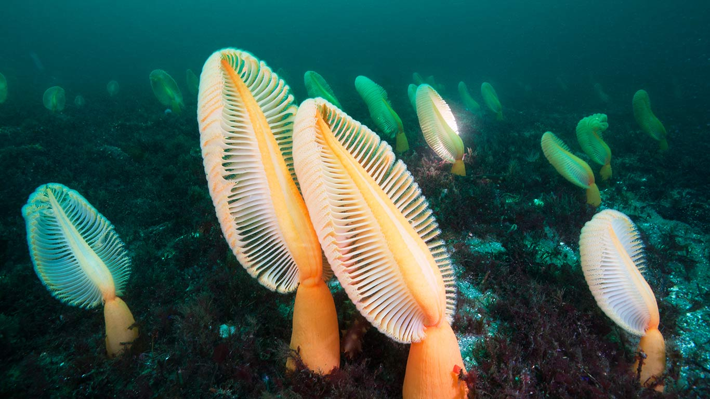

#### 20161126 Weihnachtsmarkt in Coburg, Bayern, Deutschland (© Rüdiger Hess/geo-select FotoArt)(Bing Deutschland)

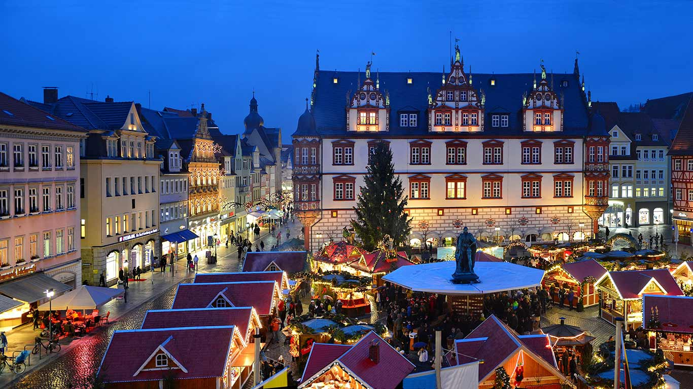

#### 20161126 Fire urchins (aka red urchins) in Lembeh Strait, North Sulawesi, Indonesia (© Jurgen Freund/NPL/Minden Pictures)(Bing United Kingdom)

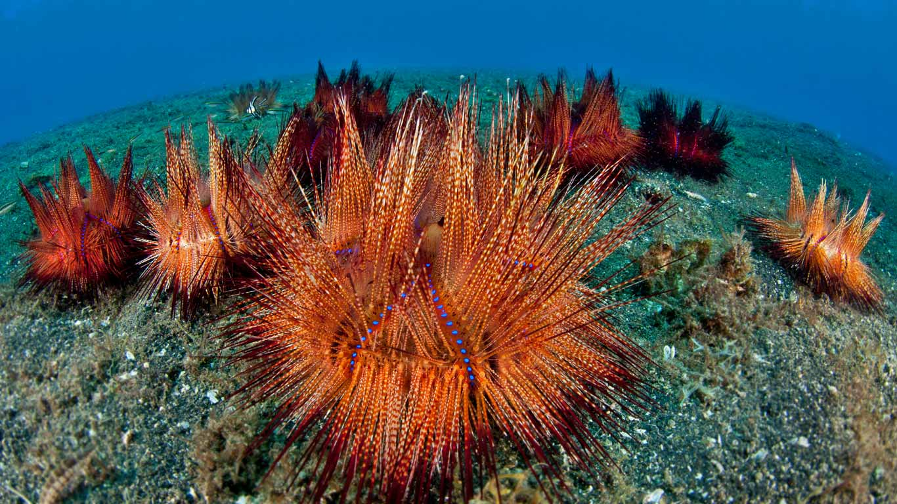

#### 20161125 Black-legged kittiwake colony on cliffs, Ireland (© Michel Gunther/Biosphoto/Minden Pictures)(Bing United Kingdom)

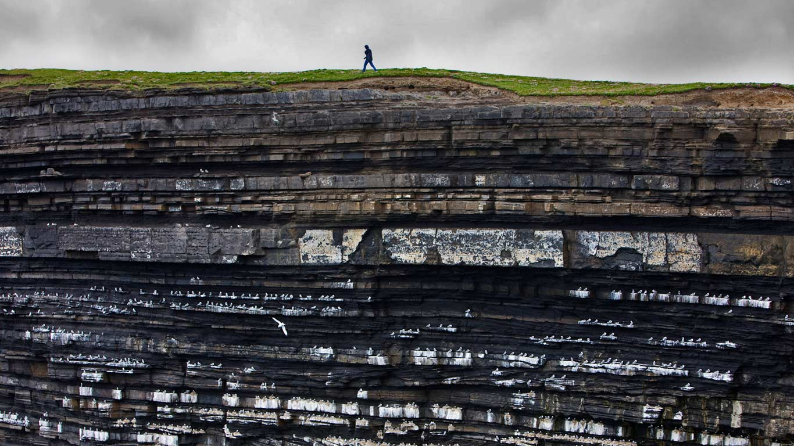

#### 20161125 An ocellated turkey in Guatemala (© Peter Waechtershaeuser/Minden Pictures)(Bing United States)

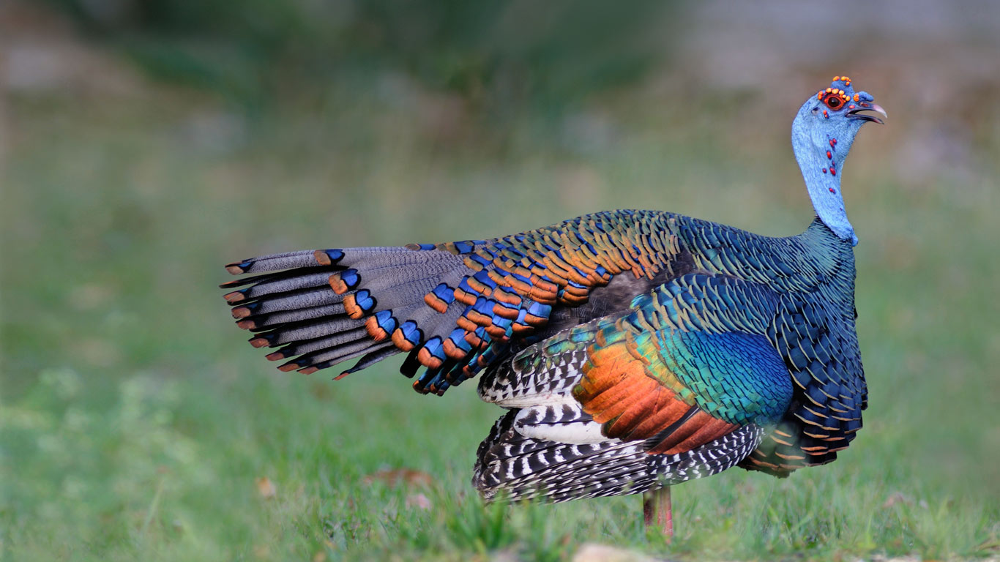

#### 20161125 ｢五泉市の雪景色｣新潟 (© JTB Photo/UIG via Getty Images)(Bing Japan)

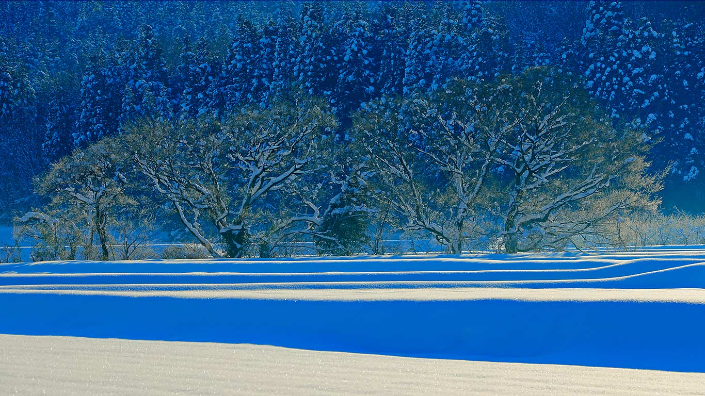

#### 20161125 Pont Jacques-Chaban-Delmas au travers d’un tram, Bordeaux, Aquitaine (© Arnaud Bertrande/Getty Images)(Bing France)

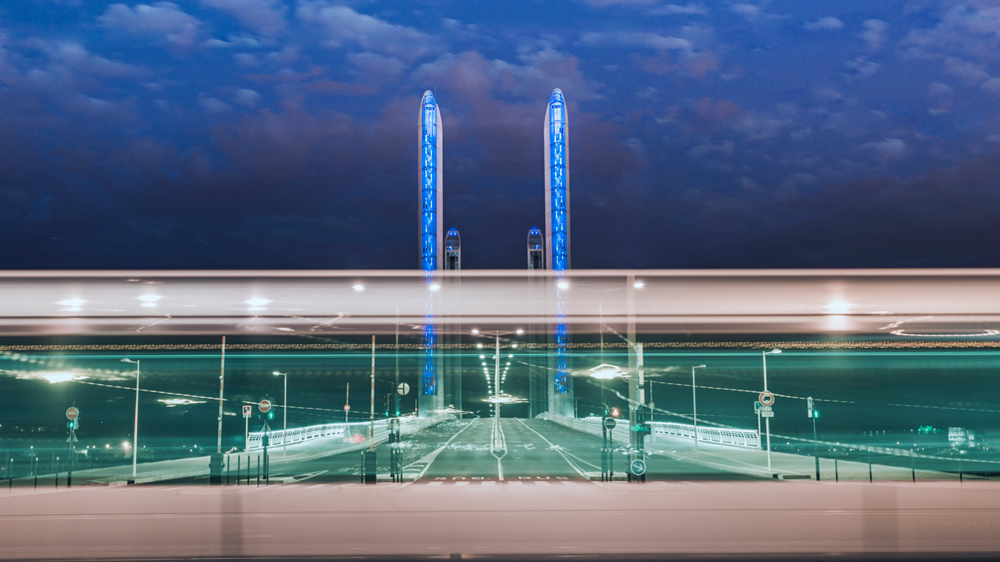

#### 20161124 Blackchurch Rock on the North Devon coast (© Mike Wilson/Nature's Beauty/Aurora Photos)(Bing United Kingdom)

#### 20161123 【今日小雪】充满阳光味道的关庙面，台湾台南 (© 850075/Shutterstock)(Bing China)

#### 20161123 Chile's Calbuco volcano erupting in April 2015 (© Martin Bernetti/Getty Images)(Bing United Kingdom)

#### 20161122 Erawan National Park, Kanchanaburi Province, Thailand (© Banana Republic Images/Shutterstock)(Bing United Kingdom)

#### 20161122 Sonnenuntergang am Biggeblick, Attendorn, Sauerland, Nordrhein-Westfalen, Deutschland (© blickwinkel/Ziese/Zoonar GmbH/Alamy Stock Photo)(Bing Deutschland)

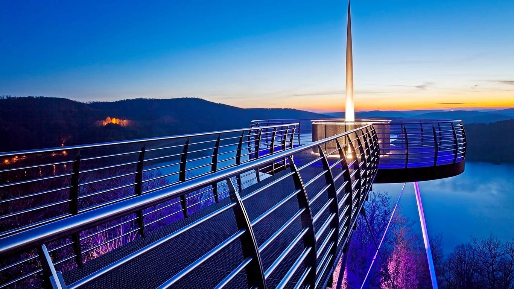

#### 20161121 Salina Turda salt mine in Turda, Romania (© Biris Paul Silviu/Getty Images)(Bing United Kingdom)

#### 20161120 Mural in George Town, Penang, Malaysia (© JTB Photo/UIG/Getty Images)(Bing United Kingdom)

#### 20161120 The Virgin River in Zion National Park, Utah (© Marc Adamus/Aurora Photos)(Bing United States)

#### 20161119 Pelicans on a beach in Queensland, Australia (© Mark Rayner/500px)(Bing Australia)

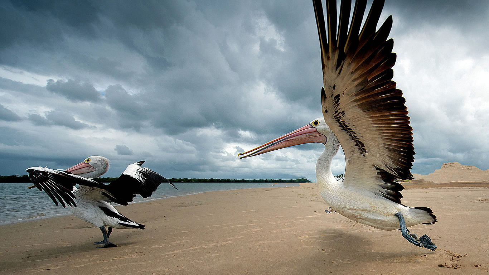

#### 20161119 Cattle egrets atop a Burchell's zebra in Rietvlei Nature Reserve, South Africa (© Richard Du Toit/Minden Pictures)(Bing United Kingdom)

#### 20161119 Narwhal (Monodon monoceros) showing tusks above water in Baffin Island, Nunavut (© Eric Baccega/Minden Pictures)(Bing Canada)

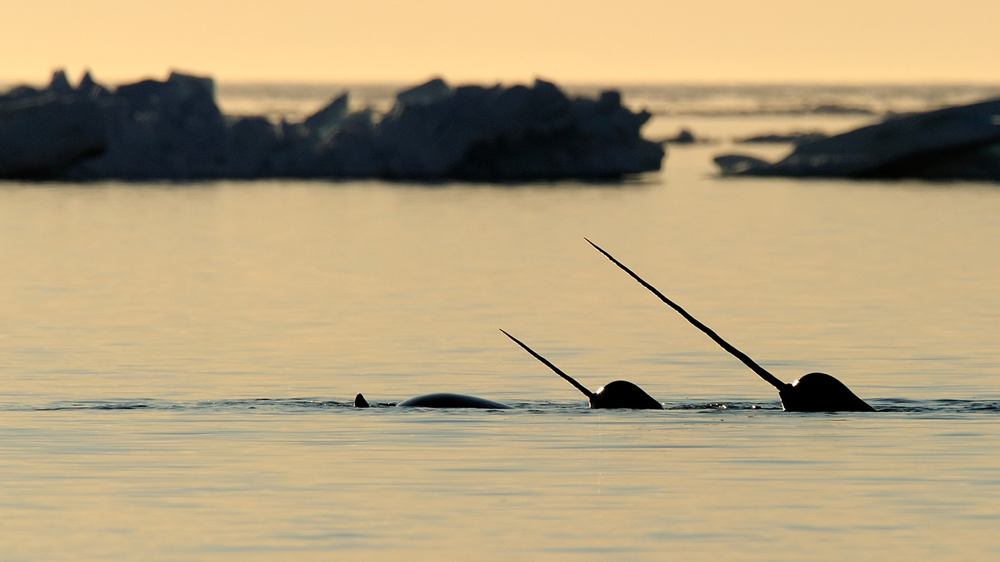

#### 20161118 Mushrooms in the Dark Dunes near Den Helder, Netherlands (© Daniel Laan/500px)(Bing United Kingdom)

#### 20161117 Vineyards near Beaujeu, Rhône, France (© Richard Semik/Shutterstock)(Bing United Kingdom)

#### 20161116 Mount Scott in Wichita Mountains National Wildlife Refuge, Oklahoma (© Tim Fitzharris/Minden Pictures)(Bing United Kingdom)

#### 20161115 ｢熊野那智大社｣和歌山県 (© JTB PHOTO COMMUNICATI/JTB Photo Communications, Inc./age fotostock)(Bing Japan)

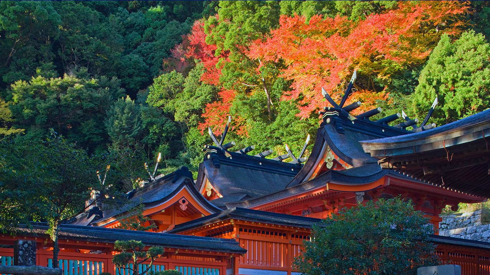

#### 20161115 Silhouette of a heron (© Don Mammoser/Shutterstock)(Bing United Kingdom)

#### 20161115 Cadolzburg, Bayern, Deutschland (© Rüdiger Hess/geo-select FotoArt)(Bing Deutschland)

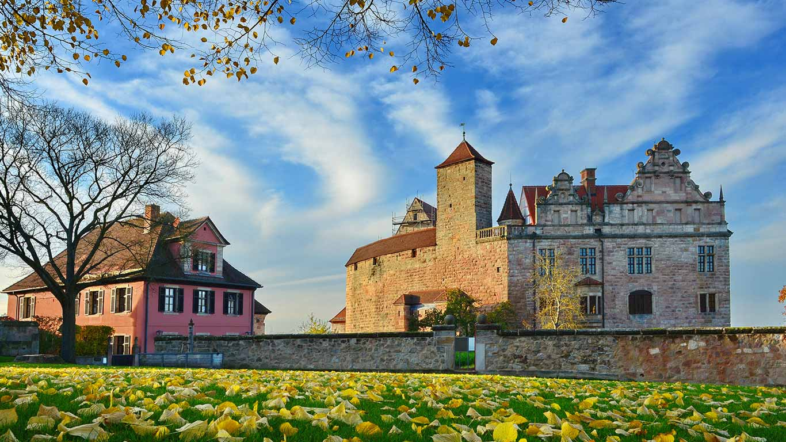

#### 20161114 Hungerburgbahn funicular railway station, Innsbruck, Austria (© imageBROKER/Alamy)(Bing United Kingdom)

#### 20161113 Granite rocks off Flinders Island, Tasmania, Australia (© Aurora Photos/Masterfile)(Bing United Kingdom)

#### 20161113 Bottle caps in a sculpture by Kerrie Argent at Cottesloe, Western Australia (© domonabike/Alamy)(Bing Australia)

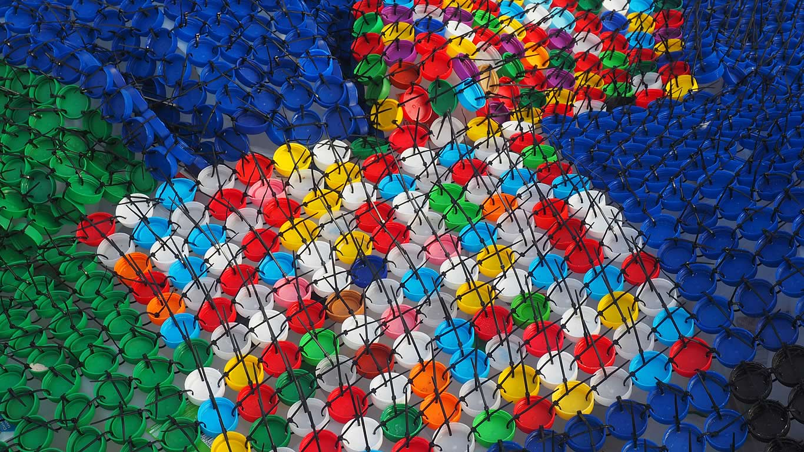

#### 20161112 “一只”丹顶鹤 (© Bobby Joshi/500px)(Bing China)

#### 20161112 The Korean War Veterans Memorial, Washington, DC (© George Ostertag/SuperStock)(Bing United States)

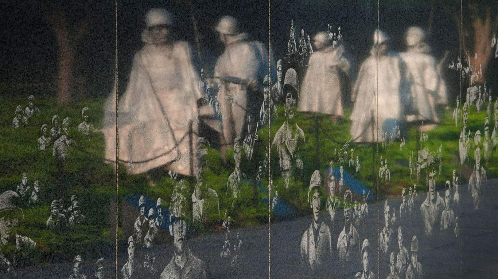

#### 20161112 European hedgehog in Emsland, Germany (© Erhard Nerger/Alamy)(Bing United Kingdom)

#### 20161112 Ossuaire de Douaumont, Meuse, Grand Est (© Georgios Makkas/Alamy Stock Photo)(Bing France)

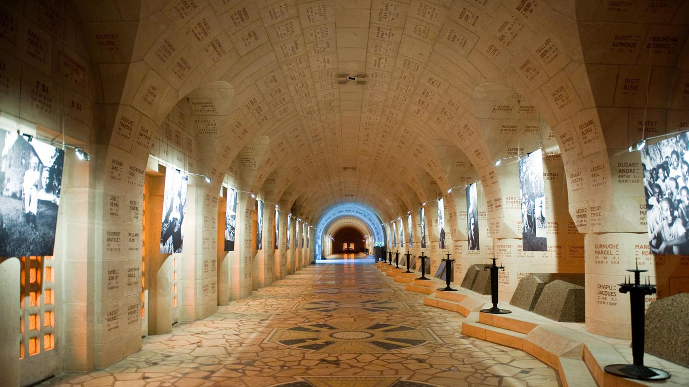

#### 20161111 Remembrance Day parade and service in London, Ont. (© Jonny White/Demotix/Corbis)(Bing Canada)

#### 20161111 Poppy display at the Tower of London (© Gillian Lloyd/Alamy)(Bing United Kingdom)

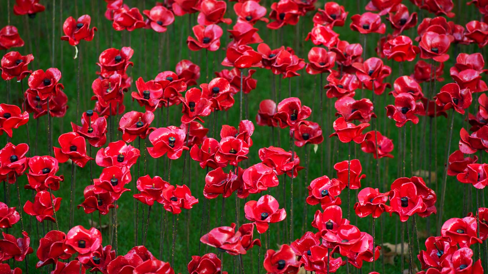

#### 20161110 Kintamani, Bali, Indonesia (© Bobby Joshi/500px)(Bing United Kingdom)

#### 20161109 The Washington Monument and US Capitol Building from the steps of the Lincoln Memorial, Washington, DC (© Steve Heap/Shutterstock)(Bing United States)

#### 20161109 Aurora borealis over the Arctic Henge in Raufarhöfn, Iceland (© Stian Rekdal/Nimia)(Bing United Kingdom)

#### 20161108 Nottuln, Münsterland, North Rhine-Westphalia, Germany (© Hans Blossey/age fotostock)(Bing Canada)

#### 20161108 Aerial view of small rocky islands in Lake Superior, Thunder Bay, Ontario, Canada (© Rolf Hicker/Getty Images)(Bing United Kingdom)

#### 20161108 Jenolan Caves, New South Wales, Australia (© Andrew Bertuleit/Corbis Documentary/Getty Images)(Bing Australia)

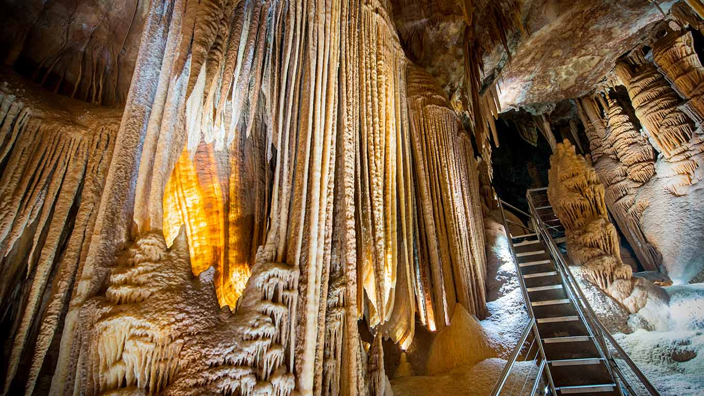

#### 20161108 【今日立冬】一条被冰冻“定格”了的小溪，九寨沟县，四川省 (© Jin Xing/Moment/Getty Images)(Bing China)

#### 20161108 ｢新宿御苑の紅葉｣東京,  新宿 (© Photos from Japan, Asia and othe of the world/Getty Images)(Bing Japan)

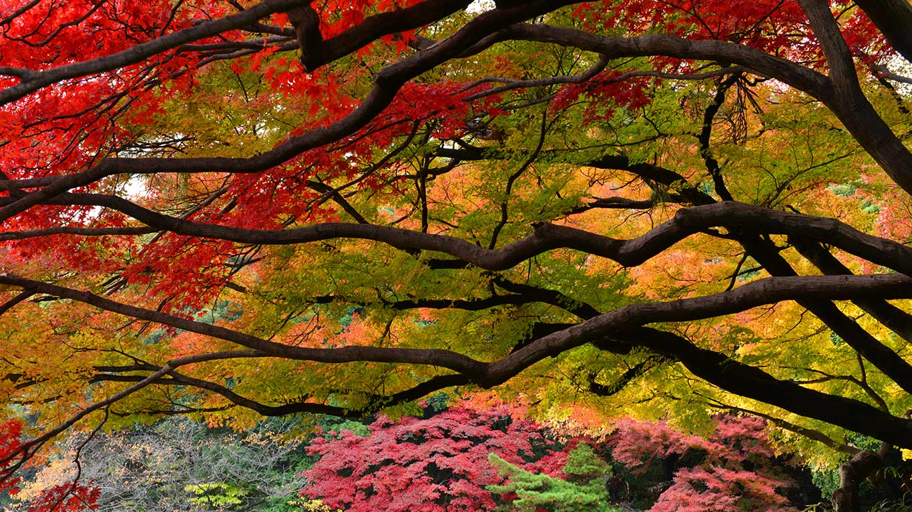

#### 20161107 Early snowfall near Fairbanks, Alaska (© Patrick Endres/plainpicture)(Bing United Kingdom)

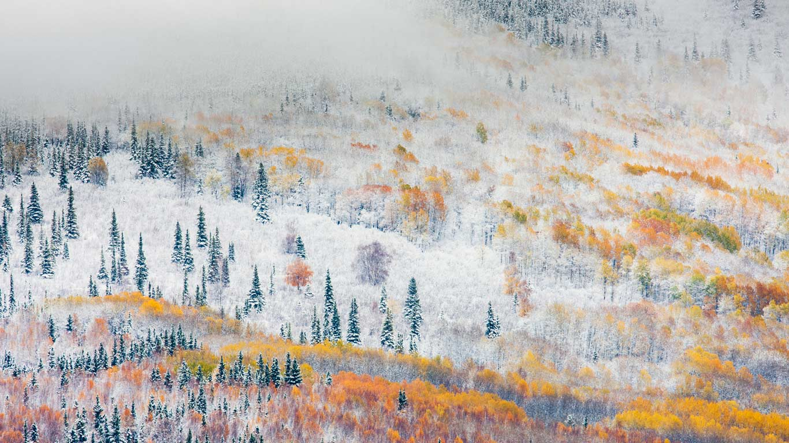

#### 20161106 Clock in Union Station, Toronto, Canada (© Zoran Stanojevic/Alamy)(Bing United States)

#### 20161106 Q’iswa Chaka rope bridge over the Apurimac River, Peru (© Wigbert Roth/Getty Images)(Bing United Kingdom)

#### 20161105 Fireworks over Gunwharf Quays, Portsmouth (© Peter Lewis/Photographer's Choice/Getty Images)(Bing United Kingdom)

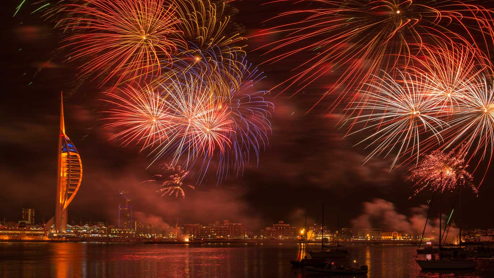

#### 20161104 Houten, Netherlands (© Herman van den Berge/500px)(Bing United Kingdom)

#### 20161103 Intérieur de l’église Saint-Joseph du Havre, Seine-Maritime, Normandie (© Maarten Hoek/500px)(Bing France)

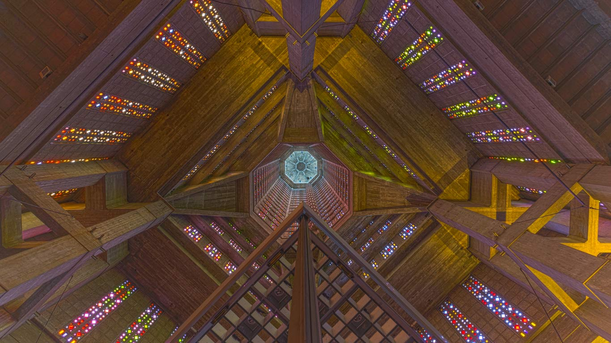

#### 20161103 The Caño Cristales River in the Serranía de la Macarena mountains of Colombia (© Tom Till/Alamy)(Bing United Kingdom)

#### 20161102 Village nestled between mountains and the St. Lawrence River, Charlevoix, Que. (© Robert Chiasson/Getty Images)(Bing Canada)

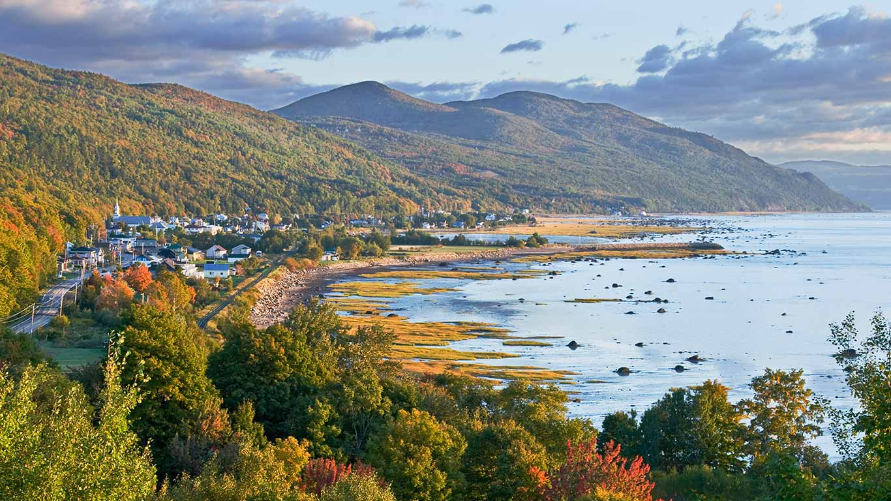

#### 20161102 The Church of Saints Primus and Felician in Jamnik, Slovenia (© Ian Middleton/Alamy)(Bing United Kingdom)

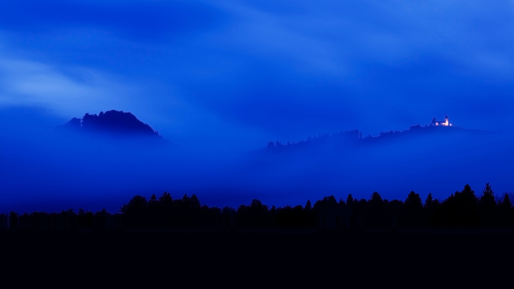

#### 20161102 Sand forming a new landscape on Fraser Island, Queensland, Australia (© Peter Essick/Aurora Photos)(Bing Australia)

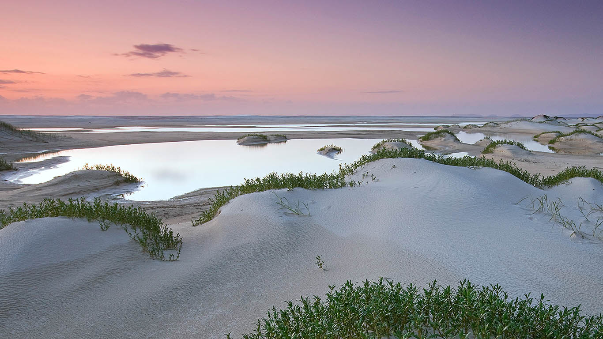

#### 20161101 ｢小さなジャック・オー・ランタン｣ (© Leigh Prather/Leigh Prather/Alamy)(Bing Japan)

#### 20161101 Mural of sugar skull (calavera) in Oaxaca, Mexico (© Judy Bellah/Alamy)(Bing United Kingdom)

#### 20161101 Schwarzwalduhren-Werkstatt, Hexenlochmühle, Furtwangen, Baden-Württemberg, Deutschland (© F1 Online/REX/Shutterstock)(Bing Deutschland)

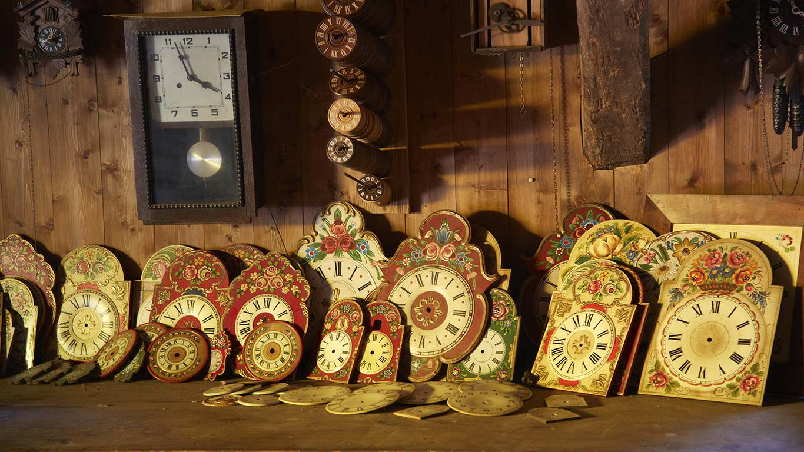

