#### 20161231 New Year’s Eve fireworks above the Sydney Harbour Bridge in Sydney, Australia (© James D. Morgan/REX/Shutterstock)(Bing United Kingdom)

#### 20161230 Hohenzollern Castle near Stuttgart, Germany (© Jürgen Eisele/500px)(Bing United Kingdom)

#### 20161230 Drei Frischlinge im Schnee, Deutschland (© Duncan Usher/Alamy Stock Photo)(Bing Deutschland)

#### 20161229 ｢リエド要塞｣フランス, エクス島 (© Francis Leroy/hemis.fr/Getty Images)(Bing Japan)

#### 20161229 A red deer in the snow (© Getty Images)(Bing United Kingdom)

#### 20161229 The Athabasca River in Jasper National Park in Alberta, Canada (© Ron Harris/Offset)(Bing United States)

#### 20161228 Red-crowned cranes in Akan National Park, Hokkaido, Japan (© Vincent Munier/Minden Pictures)(Bing United Kingdom)

#### 20161227 ｢雪の日光東照宮｣栃木県 (© JTB Photo/Universal Images Group Editorial/Getty)(Bing Japan)

#### 20161227 Colourful houses in Tromsø, Norway (© Tomasz Misiukiewicz/500px)(Bing United Kingdom)

#### 20161227 Château de Chambord en hiver, Loir-et-Cher, Centre-Val de Loire (© Pascal Ducept/hemis.fr/Getty Images)(Bing France)

#### 20161227 Schwimmender Weihnachtsbaum im Museumshafen Carolinensiel, Niedersachsen, Deutschland (© Manfred Habel/mauritius images GmbH/Alamy Stock Photo)(Bing Deutschland)

#### 20161226 Southampton Common, England (© David Baker/Gallery Stock)(Bing United Kingdom)

#### 20161225 Weihnachten in Wallgau, Bayern, Deutschland (© Huber/Sime/eStock Photo)(Bing Deutschland)

#### 20161225 Snow globes in Trentino-Alto Adige/South Tyrol, Italy (© Carlo Trolese/500px)(Bing United Kingdom)

#### 20161224 ｢なばなの里のイルミネーション｣三重 (© Julian Krakowiak/Freelance Photography Japan/Alamy)(Bing Japan)

#### 20161224 The Langdale Pikes with an illuminated Christmas tree, Lake District National Park (© Tonywestphoto/Getty Images)(Bing United Kingdom)

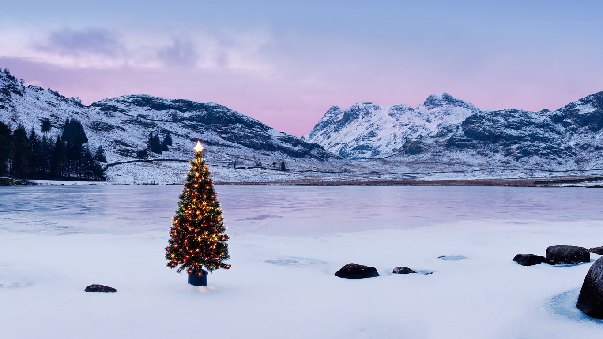

#### 20161223 The Dome in Edinburgh, Scotland (© Marty McKillop/500px)(Bing United Kingdom)

#### 20161223 Arènes de Nîmes lors de la période de Noël, Gard, Occitanie (© Guichaoua/Alamy)(Bing France)

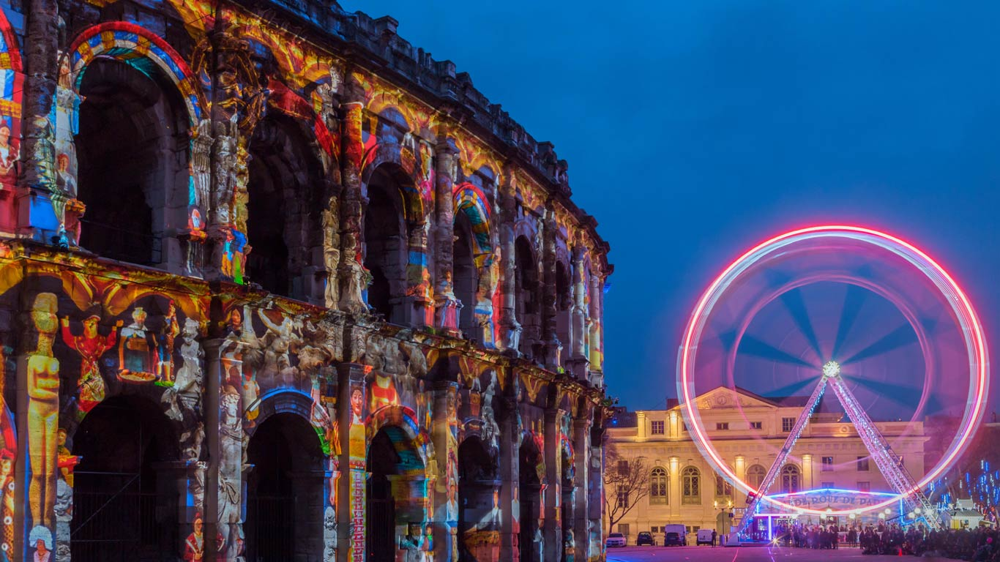

#### 20161222 The Parliament building illuminated with Christmas lights in Victoria, B.C. (© davemantel/Getty Images)(Bing Canada)

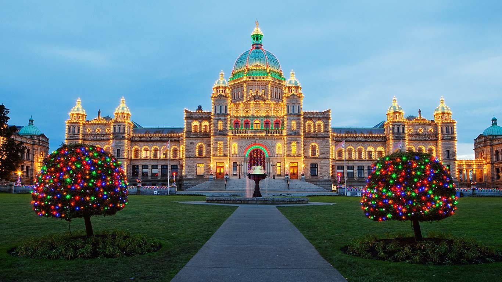

#### 20161222 Manhattan Beach Pier, California (© Mat Rick Photography/Aurora Photos)(Bing United Kingdom)

#### 20161222 【今日冬至】中国古人滑冰图 (© Stock Connection/REX/Shutterstock)(Bing China)

#### 20161221 A European crested tit lands on a pine tree in France (© Emmanuel Baechler/Minden Pictures)(Bing United Kingdom)

#### 20161220 A saguaro cactus decorated with lights in Arizona (© Gallery Stock)(Bing United Kingdom)

#### 20161219 A tree farm near Elmira, Idaho (© Woods Wheatcroft/Aurora Photos)(Bing United Kingdom)

#### 20161218 Necklace sea star on a magnificent sea anemone near Sipadan Island, Borneo (© Norbert Wu/Minden Pictures)(Bing United Kingdom)

#### 20161218 ｢聖母の岩｣フランス, ビアリッツ (© Galdric Pons/500px)(Bing Japan)

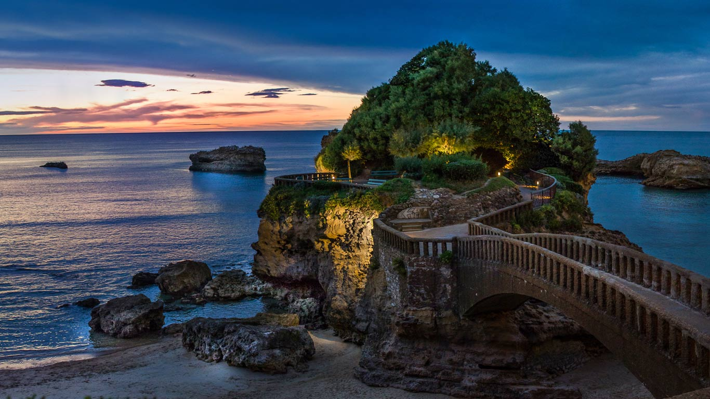

#### 20161217 Christmas lights in Mousehole, Cornwall (© David Chapman/Alamy)(Bing United Kingdom)

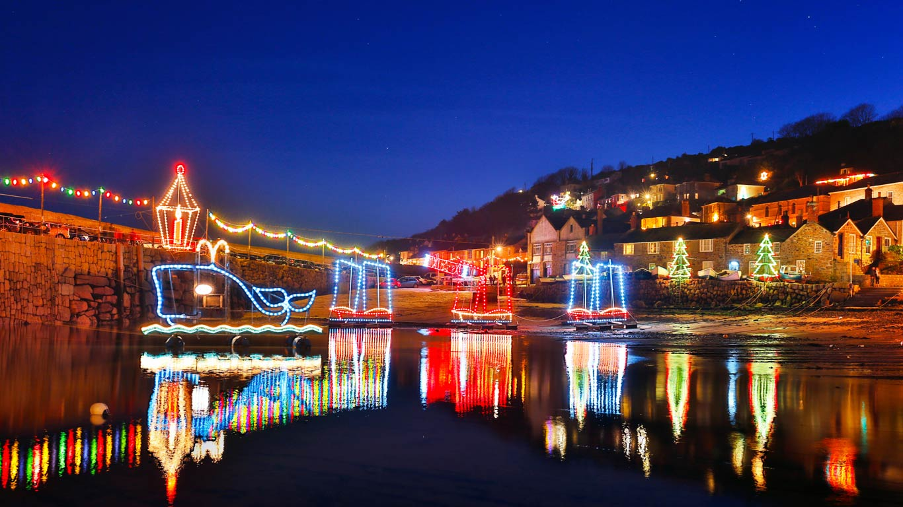

#### 20161216 Sunset on a snowy field in Switzerland (© Alexander Dragunov/500px)(Bing United States)

#### 20161216 Farolitos light the Inn and Spa at Loretto in Santa Fe, New Mexico (© Ian Shive/Tandem Stills + Motion)(Bing United Kingdom)

#### 20161216 Olympic Cauldron and Christmas trees, Jack Poole Plaza, Vancouver, B.C. (© Michael Wheatley/Alamy Stock Photo)(Bing Canada)

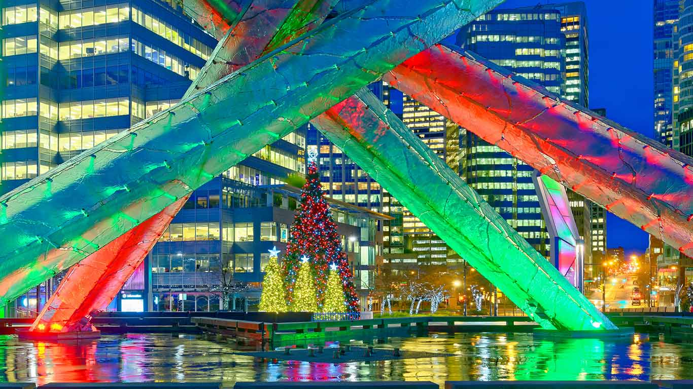

#### 20161215 Veliko Tarnovo, Bulgaria (© valentinrussanov/Getty Images)(Bing United Kingdom)

#### 20161215 Nuytsia floribunda at Cape Le Grand National Park, Western Australia (© Suzanne Long/Alamy)(Bing Australia)

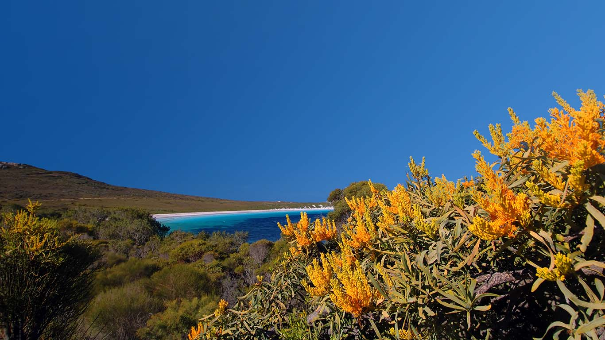

#### 20161214 Francois' langur infant with mother (© Taronga Zoo/REX Shutterstock)(Bing Australia)

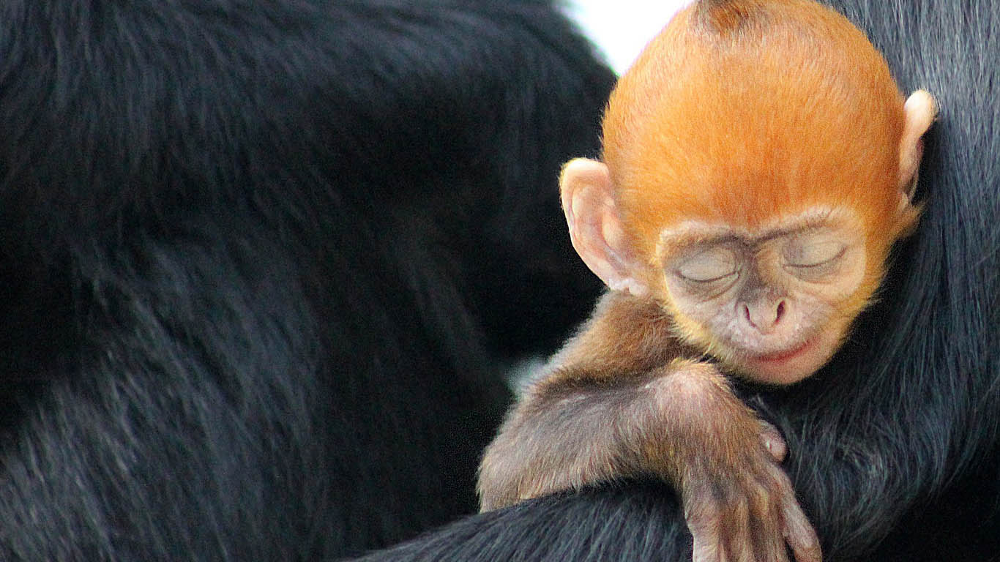

#### 20161214 Black-headed night monkeys in Pacaya Samiria National Park, Peru (© Cyril Ruoso/Minden Pictures)(Bing United Kingdom)

#### 20161214 Boules de Noël en vente dans le marché de Noël de Colmar, Haut-Rhin (© Jon Hicks/Getty Images)(Bing France)

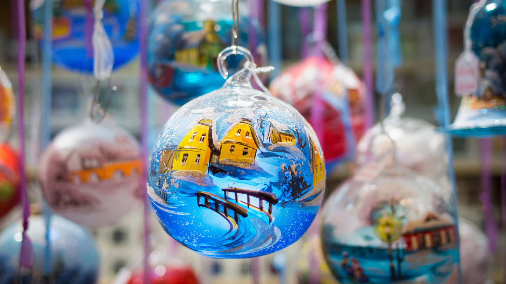

#### 20161213 Luftbild von Schloss Oberwerries, Lippeauen, Hamm, Nordrhein-Westfalen, Deutschland (© Hans Blossey/imageBROKER/Alamy Stock Photo)(Bing Deutschland)

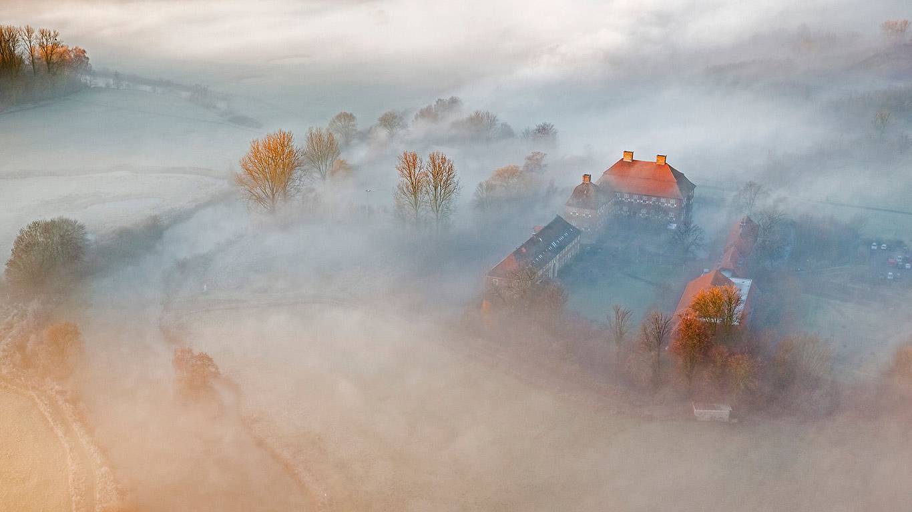

#### 20161213 Inside Fromme-Birney Round Barn in Mullinville, Kansas (© Garret Suhrie/Tandem Stills + Motion)(Bing United Kingdom)

#### 20161212 Landsat 8 satellite’s infrared photo of fields in Kazakhstan (© NASA)(Bing United Kingdom)

#### 20161211 A rural portion of Gmina Barczewo, Olsztyn County, Poland (© jesiotr9/Getty Images)(Bing United Kingdom)

#### 20161211 Lavender and papaver at Royal Botanic Garden, Sydney, Australia (© Daniele Catellani/Getty Images)(Bing Australia)

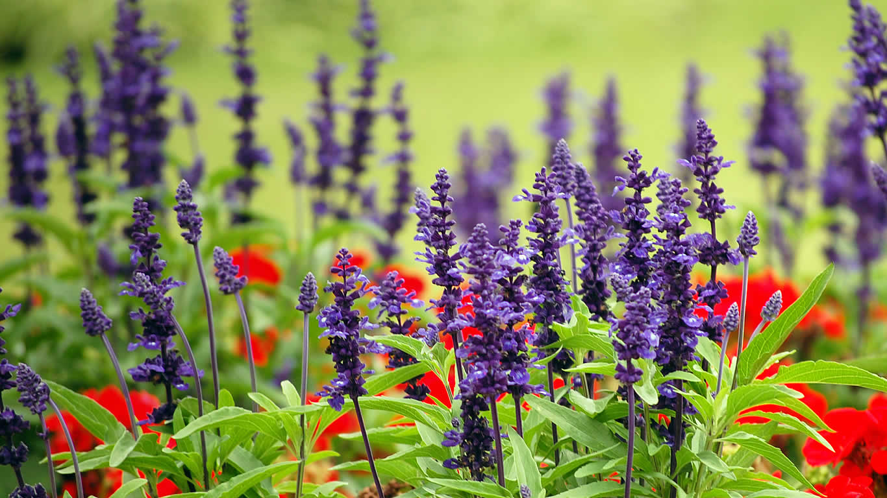

#### 20161210 Luminaria festival at Cliff Palace in Mesa Verde National Park, Colorado (© Richard Ellis/Alamy)(Bing United Kingdom)

#### 20161209 Climbers ascending Jungfrau in the Bernese Alps, Switzerland (© plainpicture/Cultura/Lost Horizon Images)(Bing United Kingdom)

#### 20161208 ｢ツルウメモドキにとまるシマエナガ｣北海道 (© Gouichi Wada/Nature Production/MINDEN PICTURES INC)(Bing Japan)

#### 20161208 A pedestrian skyway in Hong Kong’s Wan Chai District, China (© timestock22/Nimia)(Bing United Kingdom)

#### 20161208 艾德林根高地上的晨雾，普法芬温克尔，巴伐利亚，德国 (© WestEnd61/REX/Shutterstock)(Bing China)

#### 20161207 The Peace Bridge, Calgary (© Joe Daniel Price/Getty Images)(Bing Canada)

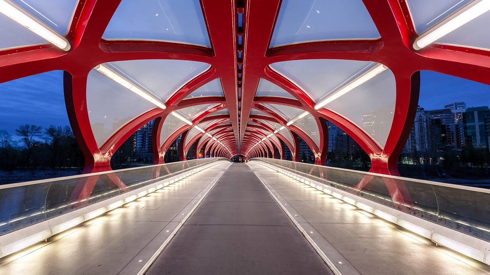

#### 20161207 【今日大雪】黄山风景区，安徽省 (© Adam Wong/Prime/500px)(Bing China)

#### 20161207 Navy personnel at the first Pearl Harbor Remembrance in 1942, Kaneohe Bay, Hawaii (© Bettmann/Getty Images)(Bing United States)

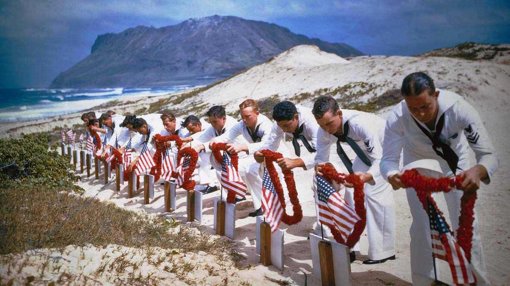

#### 20161207 Bath Christmas Market, Somerset, England (© Matt Cardy/Stringer/Getty Images News)(Bing United Kingdom)

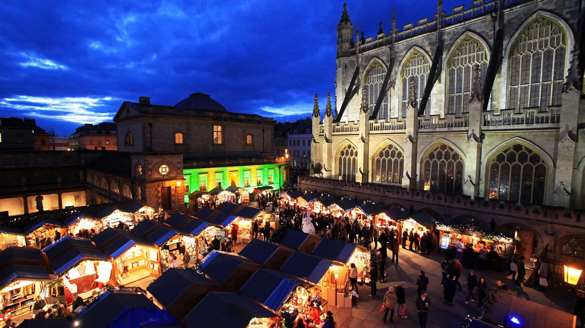

#### 20161206 Tangle Creek Falls, Jasper National Park, Alberta (© Daryl Benson/Masterfile)(Bing Canada)

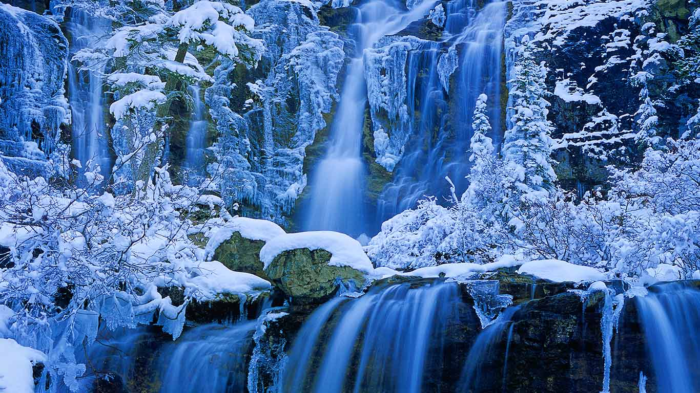

#### 20161206 A frozen waterfall in Korouoma, Finland (© Niall Benvie/Minden Pictures)(Bing United Kingdom)

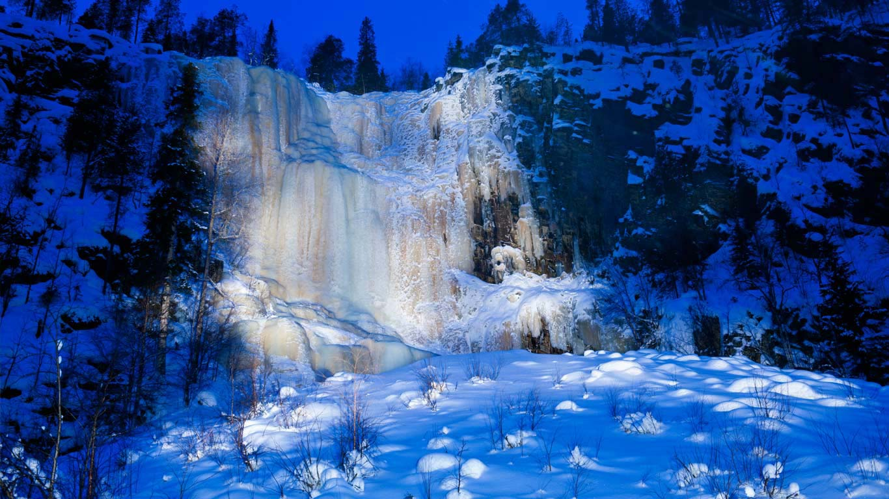

#### 20161206 Gros plan d’un renard roux dans le parc national de la Vanoise, Savoie (© Benjamin Barthelemy/Minden Pictures)(Bing France)

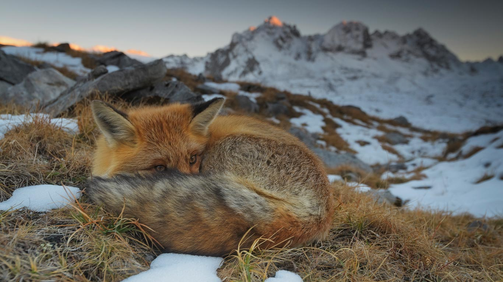

#### 20161205 The Christmas tree at Trafalgar Square, London (© Stuart Black/robertharding/SuperStock)(Bing United Kingdom)

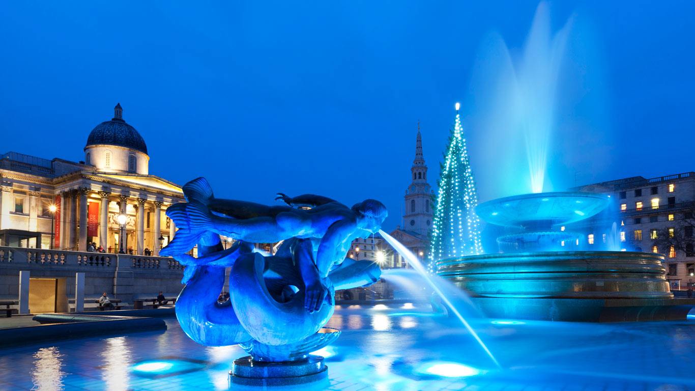

#### 20161205 Semiconductor manufacturing at Infineon Technologies in Villach, Austria (© Krisztian Bocsi/Bloomberg/Getty Images)(Bing United States)

#### 20161204 Quinoa plants in Peru (© Westend61 GmbH/Alamy)(Bing United Kingdom)

#### 20161203 Red grouse in the Scottish Highlands (© Mark Sisson/REX/Shutterstock)(Bing United Kingdom)

#### 20161202 Resurrection Bay at Kenai Fjords National Park, Alaska (© Ron Niebrugge/Alamy)(Bing United Kingdom)

#### 20161201 Skate park in St Kilda, Victoria, Australia (© Brett Price/age fotostock)(Bing Australia)

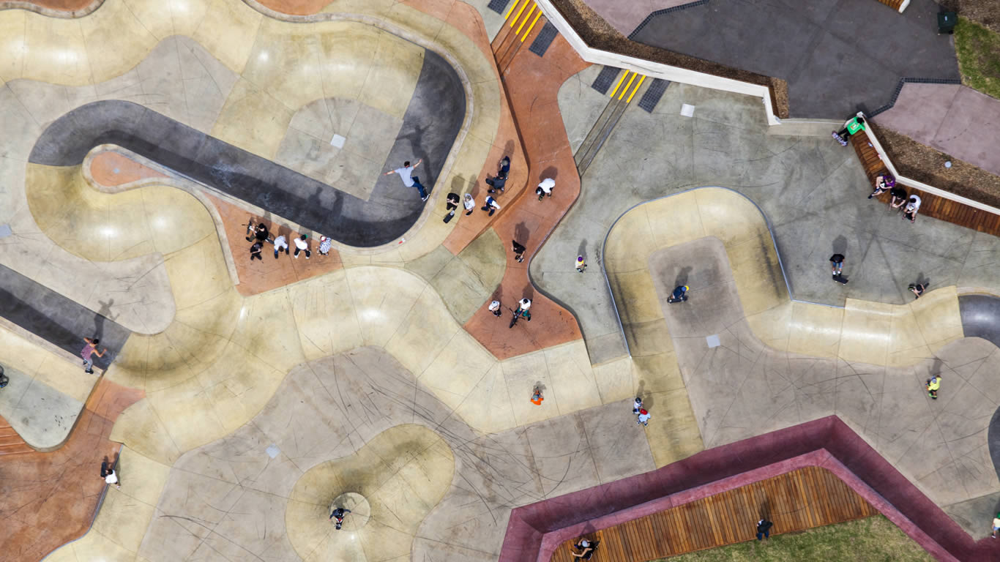

#### 20161201 Vue panoramique sur le Mont Pourri, massif de la Vanoise, Savoie (© Benjamin Barthelemy/Minden Pictures)(Bing France)

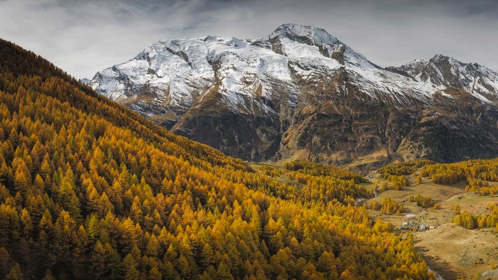

#### 20161201 Cierva Cove on the Antarctic Peninsula (© Aurora Photos/Offset)(Bing United Kingdom)

