#### 20170131 中国传统木门上的对联 (© Keren Su/Getty Images)(Bing China)

#### 20170131 The Mont Blanc massif, seen from Mont Salève, France (© Niggli/Nimia)(Bing United Kingdom)

#### 20170131 „Windklang“-Skulptur auf dem Erbeskopf, Hunsrück, Rheinland-Pfalz, Deutschland (© Hans-Peter Merten/Getty Images)(Bing Deutschland)

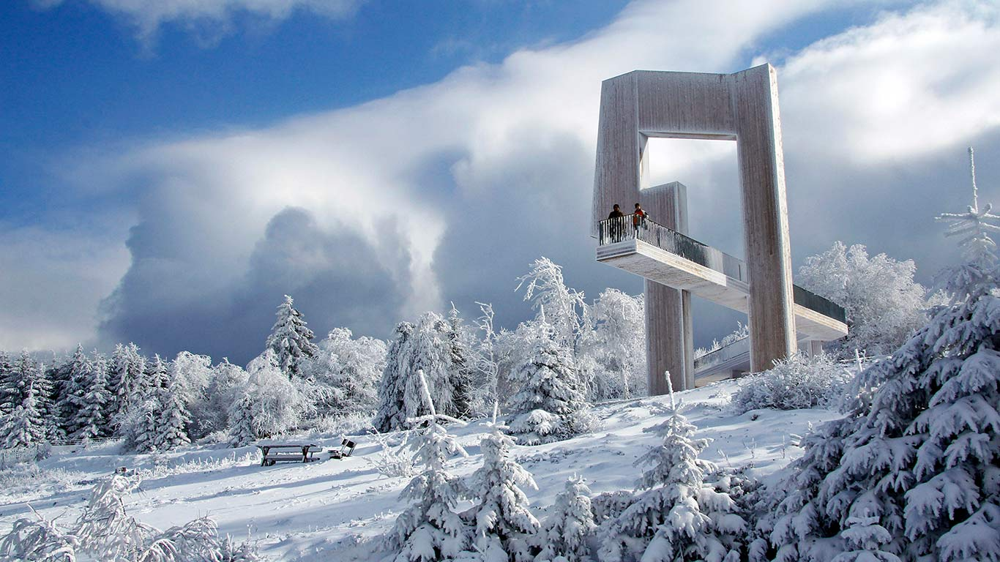

#### 20170130 A muskox and her calf in Dovrefjell-Sunndalsfjella National Park, Norway (© Christina Krutz/Getty Images)(Bing United Kingdom)

#### 20170130 月河古镇一户人家门前画着的门神 ，浙江 (© Keren Su/China Span/Getty Images)(Bing China)

#### 20170129 一只雄性红腹锦鸡 (© Darlyne A. Murawski/Getty Images)(Bing China)

#### 20170129 A giant barrel cactus and yucca plants in the Chihuahuan Desert, Mexico (© Patricio Robles Gil/Minden Pictures)(Bing United Kingdom)

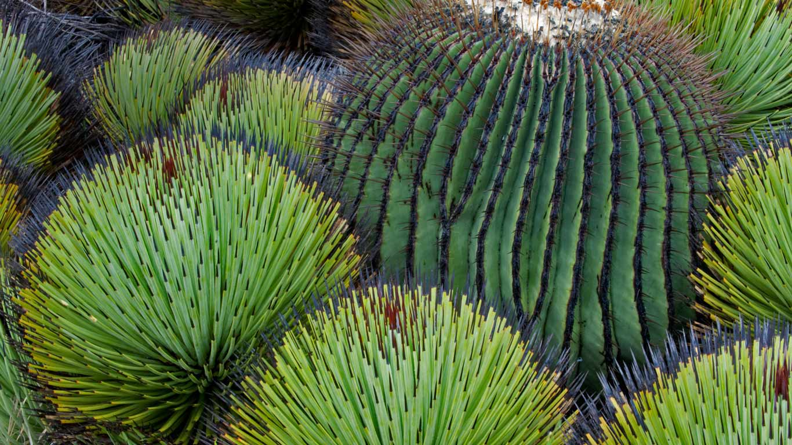

#### 20170128 A brown leghorn rooster (© Lukchai Chaimongkon/Getty Images)(Bing United Kingdom)

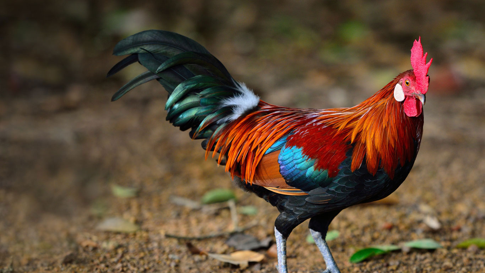

#### 20170128 红筷子和蒸笼，中国 (© Dudley Wood/Alamy Stock Photo)(Bing China)

#### 20170127 Villers Abbey in Villers-la-Ville, Belgium (© Patty Piturlea/500px)(Bing United Kingdom)

#### 20170127 Ice skates in cubbies in Colorado (© Michelle Enfield/Alamy Stock Photo)(Bing Canada)

#### 20170126 Silhouette of red kangaroos in Sturt National Park, New South Wales (© Mitsuaki Iwago/Minden Pictures)(Bing Australia)

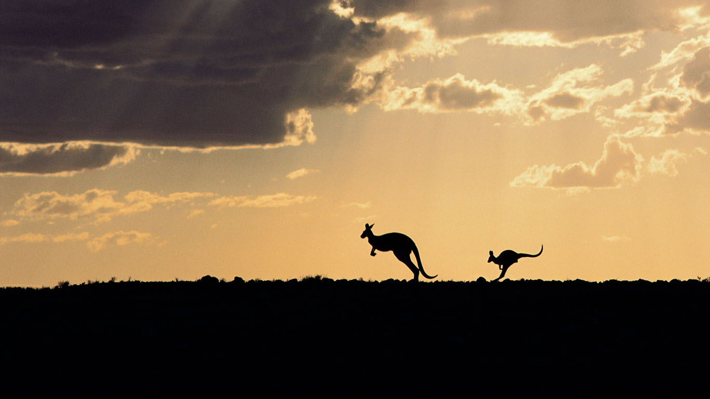

#### 20170126 The Great Barrier Reef photographed from the International Space Station (© NASA)(Bing United Kingdom)

#### 20170125 Brig o' Doon in Ayrshire, Scotland (© George Robertson/Alamy)(Bing United Kingdom)

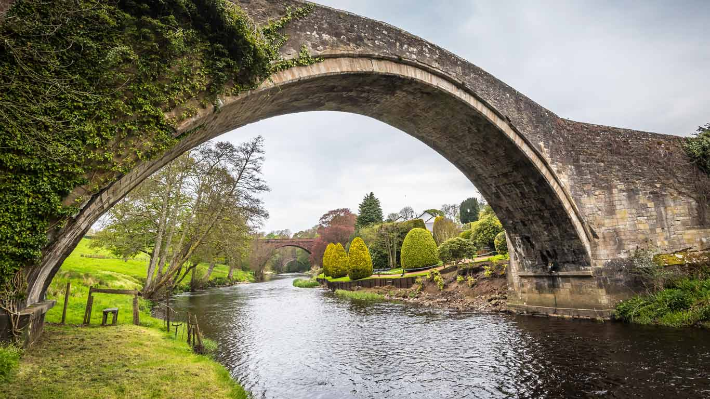

#### 20170124 Fireflies illuminate a forest in Shikoku, Japan (© Hiroya Minakuchi/Minden Pictures)(Bing United Kingdom)

#### 20170124 Japan Bridge, La Défense, Paris (© Julian Elliott Photography/Photolibrary/Getty Images)(Bing France)

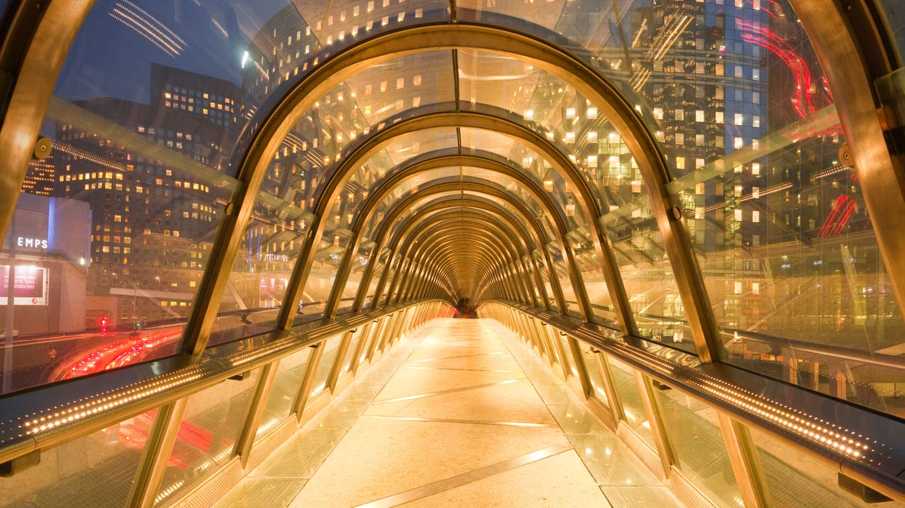

#### 20170124 ｢夜の五稜郭」北海道, 函館市 (©  Image House/Getty Images)(Bing Japan)

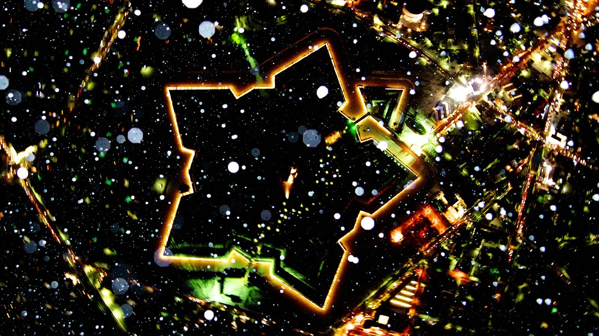

#### 20170123 Trailing azalea growing on a scree slope in Rondane National Park, Norway (© Radomir Jakubowski/Minden Pictures)(Bing United Kingdom)

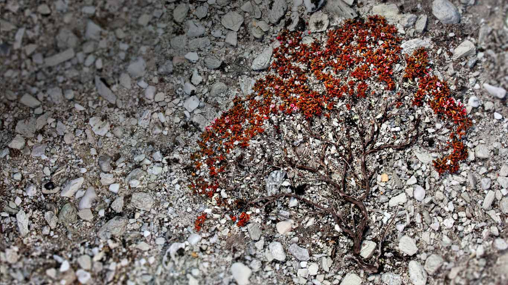

#### 20170122 Pfeiffer Beach at Pfeiffer Big Sur State Park, California (© Jingyu Wu/500px)(Bing United Kingdom)

#### 20170121 A red squirrel in Cairngorms National Park, Scotland (© Sue Demetriou/Offset)(Bing United Kingdom)

#### 20170121 【今日大寒】哈尔滨国际冰雪节盛开的烟花，黑龙江哈尔滨 (© Aly Song/REUTERS)(Bing China)

#### 20170120 ｢ヴァインフェルダー・マール｣ドイツ, ラインラント＝プファルツ州 (© Winfried Schäfer/Alamy)(Bing Japan)

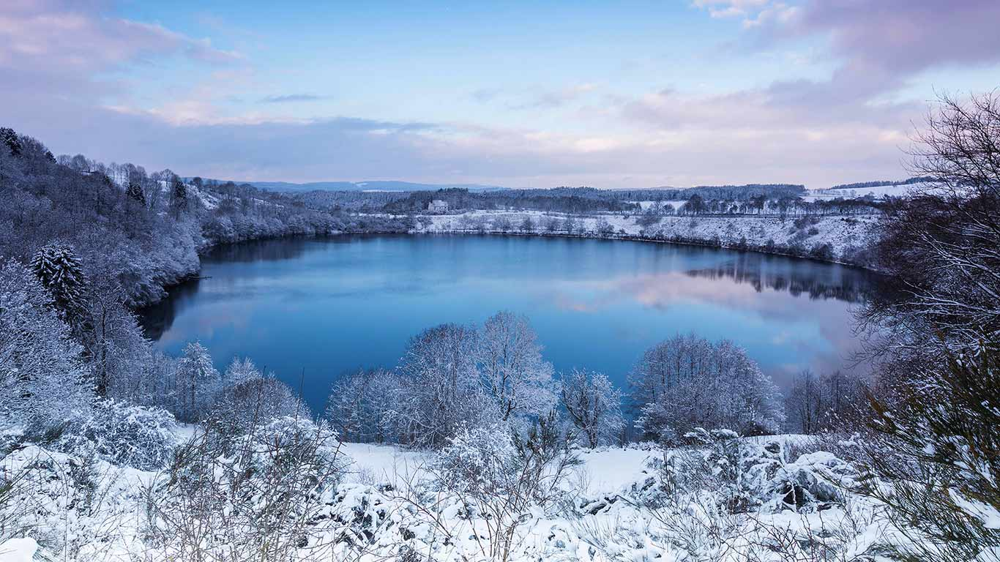

#### 20170120 Gentoo penguin on Cuverville Island, Antarctica (© Ben Cranke/Minden Pictures)(Bing United Kingdom)

#### 20170119 Minerva Terrace in Mammoth Hot Springs of Yellowstone National Park, Wyoming (© Tim Fitzharris/Minden Pictures)(Bing United Kingdom)

#### 20170118 Bora Bora in the Leeward Islands of French Polynesia (© Frans Lanting/Getty Images)(Bing United Kingdom)

#### 20170118 Knox College building interior at University of Toronto, Ont. (© SPrada/Getty Images)(Bing Canada)

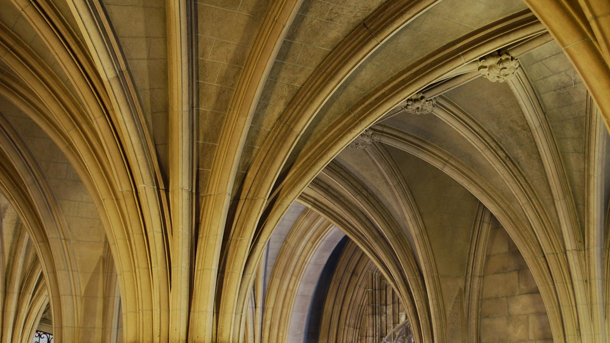

#### 20170117 Heavy frost in Las Médulas, Spain (© Juan Carlos Muñoz/age fotostock)(Bing United Kingdom)

#### 20170116 Martin Luther King, Jr. Memorial at Yerba Buena Gardens, San Francisco, California (© Josh Norem/500px)(Bing United States)

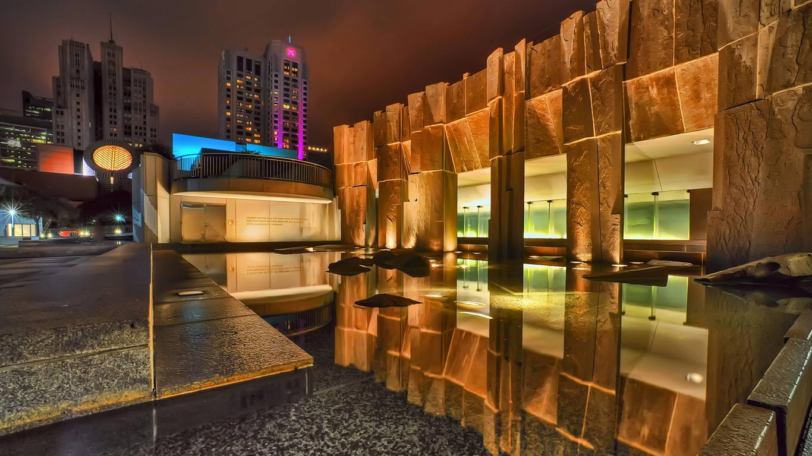

#### 20170116 Mountain hares touching noses in Scotland (© Mark Hamblin/age fotostock)(Bing United Kingdom)

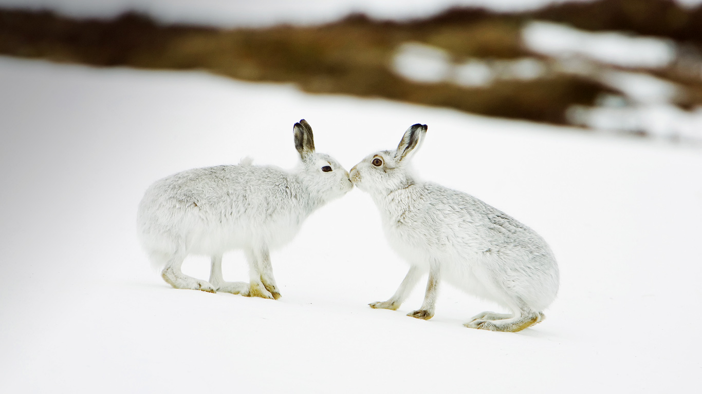

#### 20170116 Journey Behind the Falls in winter in Niagara Falls, Ont. (© Larissa Sakhnenko/500px)(Bing Canada)

#### 20170116 Double-barred finch flock at Gregory River, Queensland, Australia (© Martin Willis/Minden Pictures)(Bing Australia)

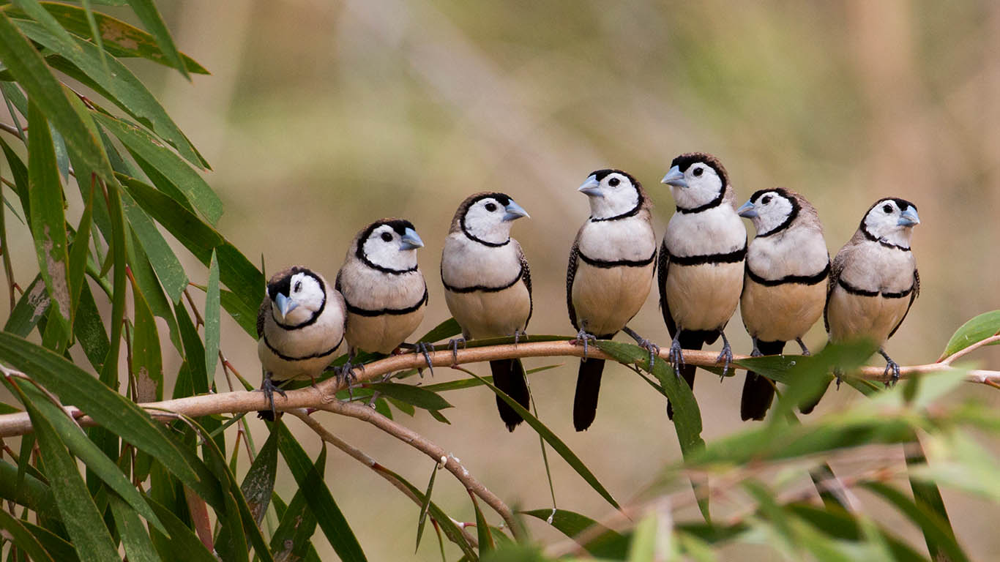

#### 20170115 The Reading Room at the British Museum’s Great Court in London (© Aardvark/Alamy)(Bing United Kingdom)

#### 20170114 Kongde Ri mountain looms over Namche Bazaar in Sagarmatha National Park, Nepal (© Andrew Peacock/Aurora Photos)(Bing United Kingdom)

#### 20170113 Lunettes at Mungo National Park, New South Wales, Australia (© Steffen and Alexandra Sailer/Pantheon/Superstock)(Bing Australia)

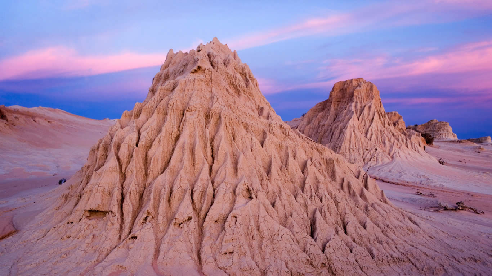

#### 20170113 Rhesus macaques in the Wulingyuan wilderness near Zhangjiajie, China (© Xinhua News Agency/REX/Shutterstock)(Bing United Kingdom)

#### 20170113 Athabasca Glacier and northern lights in Jasper, A.B. (© Jesús M. García/Getty Images)(Bing Canada)

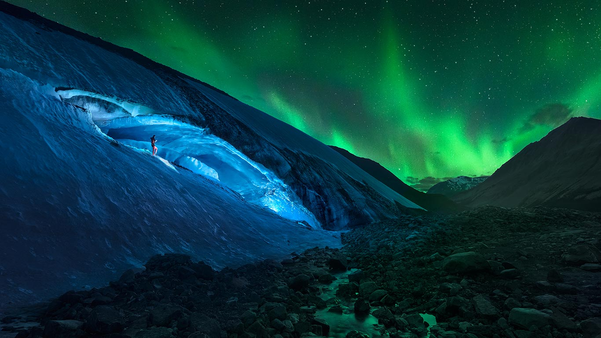

#### 20170112 Temple of Valadier, Genga, Italy (© Westend61/Getty Images)(Bing United Kingdom)

#### 20170112 Glasfassade der Elbphilharmonie, Hamburg, Deutschland (© Iain Masterton/Alamy Stock Foto)(Bing Deutschland)

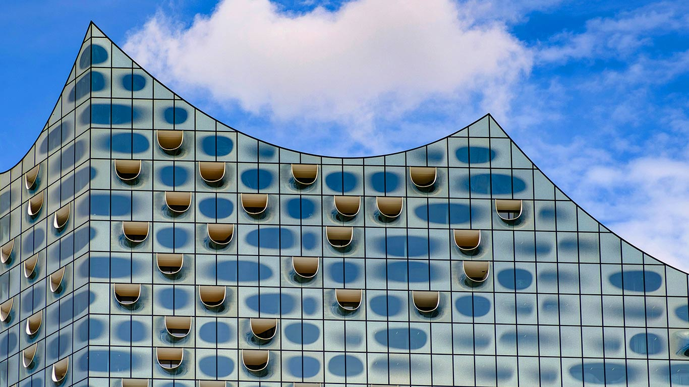

#### 20170111 An irrigation system in southern Egypt (© NASA Images)(Bing United Kingdom)

#### 20170111 Gouffre Berger à Engins, Isère, Auvergne-Rhône-Alpes (© Robbie Shone/Getty Images)(Bing France)

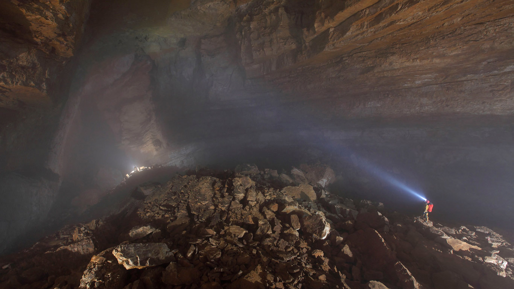

#### 20170110 Eifel National Park, North Rhine-Westphalia, Germany (© Danny Laps/Minden Pictures)(Bing United Kingdom)

#### 20170109 Ross Fountain at Butchart Gardens in Victoria, British Columbia, Canada (© Reimar 8/Alamy)(Bing United Kingdom)

#### 20170108 Trakai Island Castle in Trakai, Lithuania (© Conor MacNeill/Tandem Stills + Motion)(Bing United Kingdom)

#### 20170108 ｢湖面に映るピック・デュ・ミディ・ドッソ｣フランス, ピレネー山脈 (© Arnaud Bertrande/Getty Images)(Bing Japan)

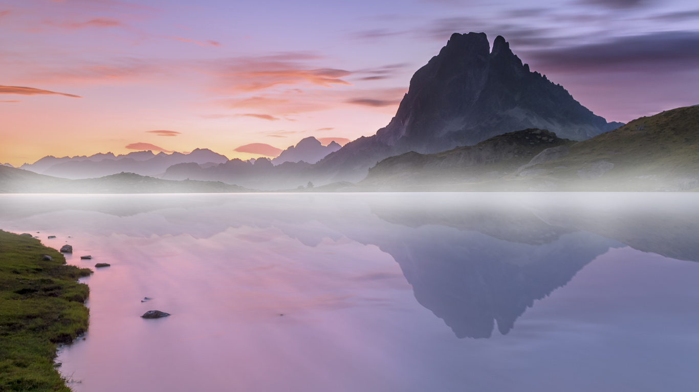

#### 20170107 Bunte Tücher auf einem Stoffmarkt in Fürth, Bayern, Deutschland (© Rüdiger Hess/geo-select FotoArt)(Bing Deutschland)

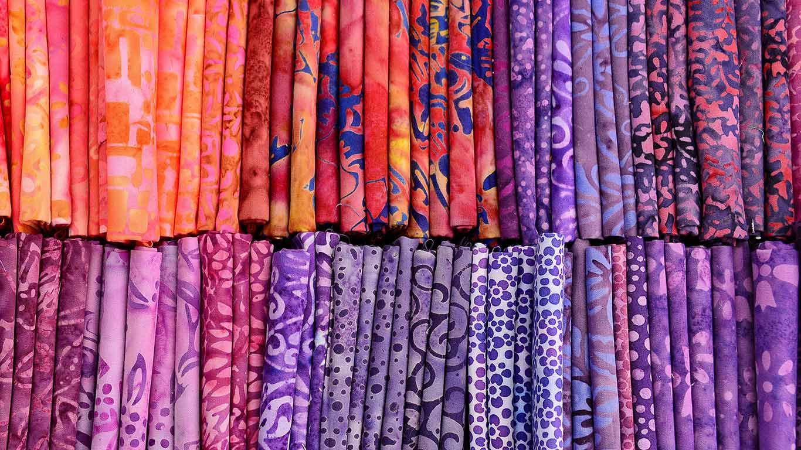

#### 20170107 Caravane dans le désert, Broome, Australie-Occidentale (© Jarrad Seng/500px)(Bing France)

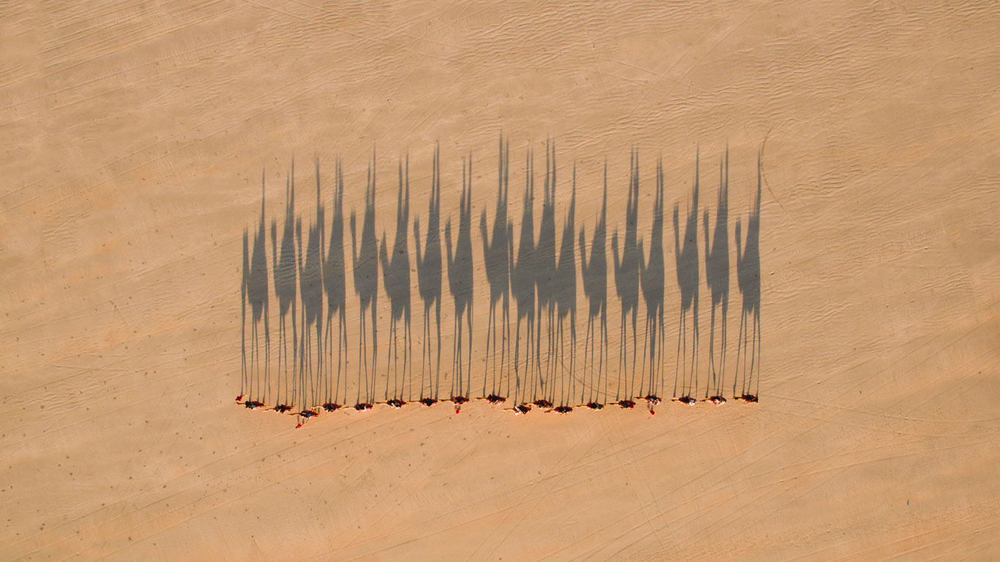

#### 20170107 Coyote in Marymoor Park, Redmond, Washington (© Joseph Calev)(Bing United Kingdom)

#### 20170106 Karaweik palace barge on Kandawgyi Lake, Rangoon, Burma (© Etakundoy/Shutterstock)(Bing United Kingdom)

#### 20170105 Pen y Fan in the Brecon Beacons National Park, South Wales (© Esen Tunar Photography/Getty Images)(Bing United Kingdom)

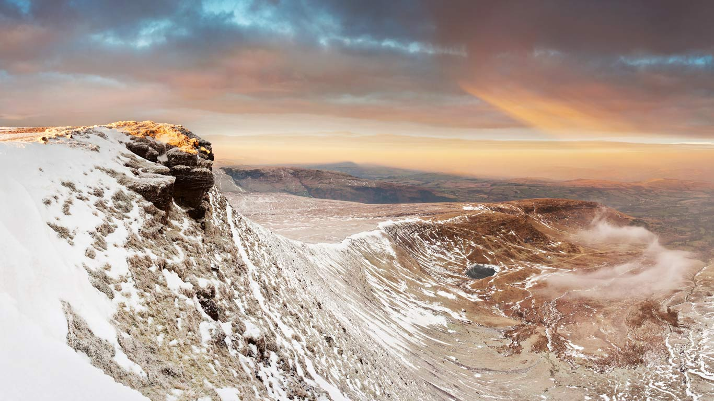

#### 20170104 Lake Wakatipu near Queenstown, New Zealand (© Raimondo Restelli/500px)(Bing United Kingdom)

#### 20170103 Rehe in der Abenddämmerung nahe Herrischried, Schwarzwald, Baden-Württemberg, Deutschland (© Christian Wesner/500px)(Bing Deutschland)

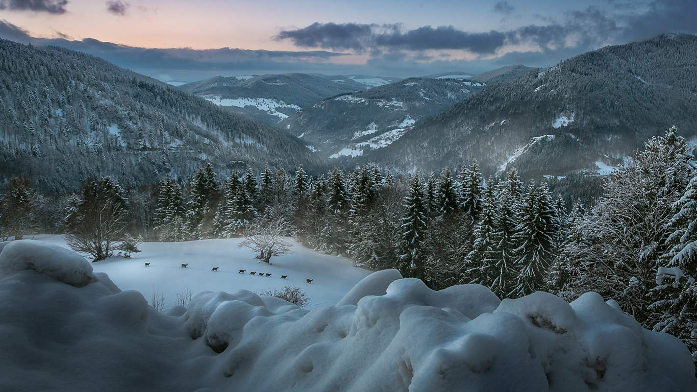

#### 20170103 ｢和筆｣ (© Beyond/Beyond/Superstock)(Bing Japan)

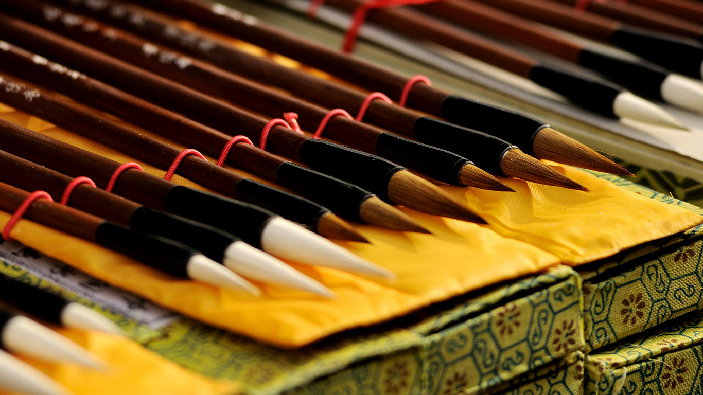

#### 20170103 An underwater view of Aktun Ha cenote near Tulum, Quintana Roo, Mexico (© Christian Vizl/Tandem Stills + Motion)(Bing United Kingdom)

#### 20170102 Ravensbourne college building on the Greenwich Peninsula, London (© Steve Vidler/Superstock)(Bing United Kingdom)

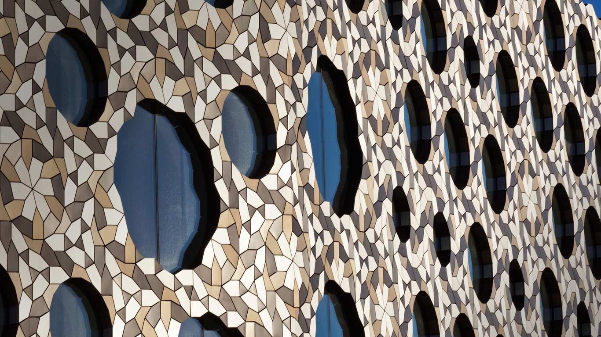

#### 20170102 ｢野迫川村の日の出｣奈良 (© JTB MEDIA CREATION, Inc/JTB MEDIA CREATION, Inc/Alamy)(Bing Japan)

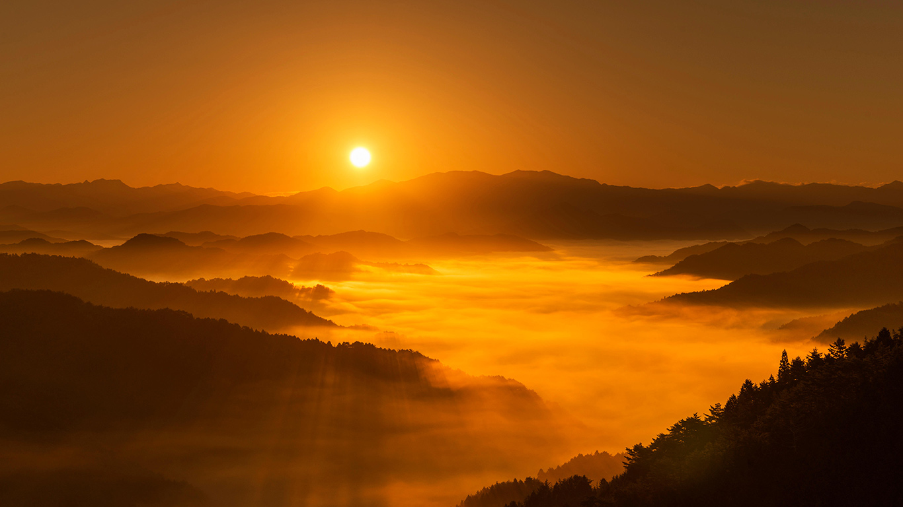

#### 20170102 【今日元旦】在“香港眼”摩天轮上跨年，香港 (© Garan Jay/500px)(Bing China)

#### 20170102 A climber in the Cabinet Mountains Wilderness in Montana (© Steven Gnam/Tandem Stills + Motion)(Bing United States)

#### 20170101 Pair of Ural owls in Hokkaido, Japan (© JTB Media Creation, Inc./Alamy)(Bing United Kingdom)

