#### 20170228 A member of the Pin Stripe Brass Band plays the trumpet during King's Day festivities in New Orleans, 2015 (© Gerald Herbert/AP Photo)(Bing United Kingdom)

#### 20170227 North American river otters in Yellowstone National Park, Wyoming (© mlharing/istock/Getty Images)(Bing United Kingdom)

#### 20170226 Feather star clinging to harp gorgonian in the Great Barrier Reef, Queensland (© Fred Bavendam/Minden Pictures/plainpicture)(Bing Australia)

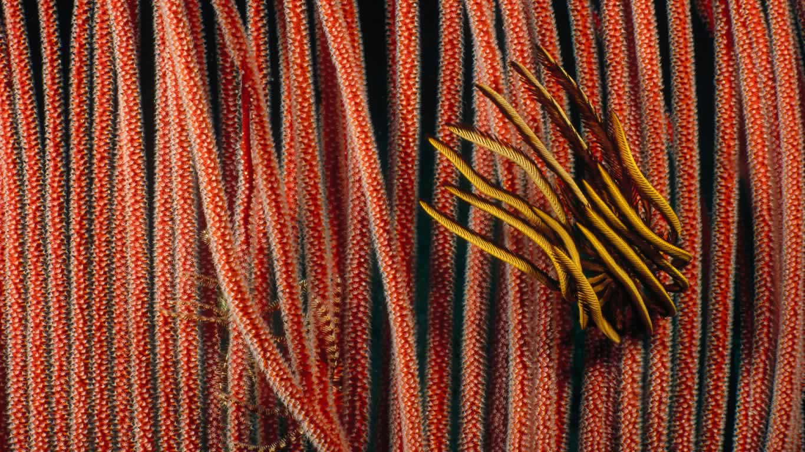

#### 20170226 View of Griffith Observatory, Los Angeles, California (© Walter Bibikow/Getty Images)(Bing United Kingdom)

#### 20170225 Two hoatzins, perched in Brazil (© Morten Ross/500px)(Bing United Kingdom)

#### 20170224 ｢雲海と富士山｣ (© SHOSEI/Aflo)(Bing Japan)

#### 20170224 The abandoned village of Houtouwan on Shengshan Island, China (© VCG/Getty Images)(Bing United Kingdom)

#### 20170223 The Opera Ball at the Vienna State Opera, Austria (© APA-PictureDesk GmbH/REX/Shutterstock)(Bing United Kingdom)

#### 20170222 Retro music speakers hanging on a wall (© Martin M303/Getty Images)(Bing United Kingdom)

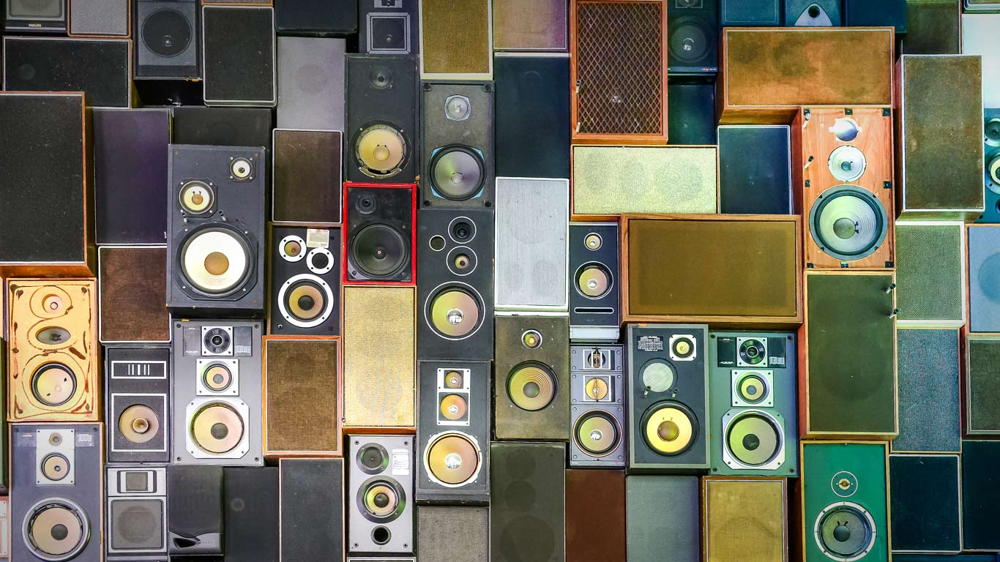

#### 20170221 Îlot Nuami dans l’atoll de Nokanhui au sud de l’île des Pins, Nouvelle-Calédonie (© Hope Productions/Yann Arthus Bertrand/Getty Images)(Bing France)

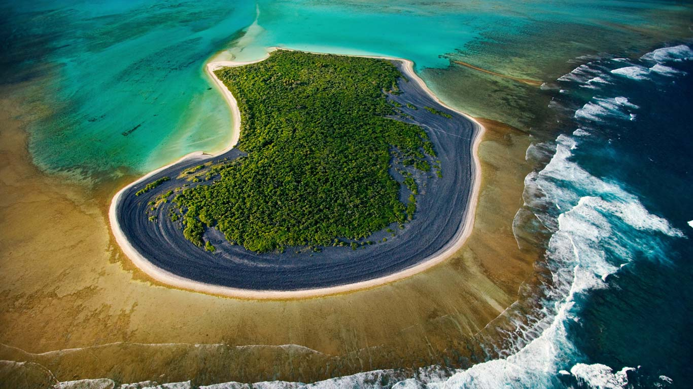

#### 20170221 Ice in a crater of the Vastitas Borealis region of Mars (© VUZE/NASA/Alamy)(Bing United Kingdom)

#### 20170221 Wisentherde, Sababurg, Hessen, Deutschland (© Duncan Usher/Minden Pictures)(Bing Deutschland)

#### 20170220 Somme River estuary, France (© Philippe Frutier/plainpicture)(Bing United Kingdom)

#### 20170220 Mount Rushmore in South Dakota (© guillaumelynn/Shutterstock)(Bing United States)

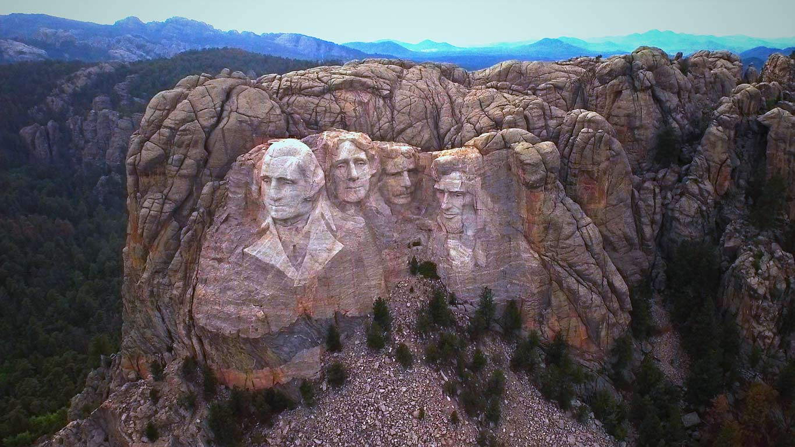

#### 20170220 Confederation Hall at the Parliament Building in Ottawa, Ont. (© Peter Langer/Getty Imgaes)(Bing Canada)

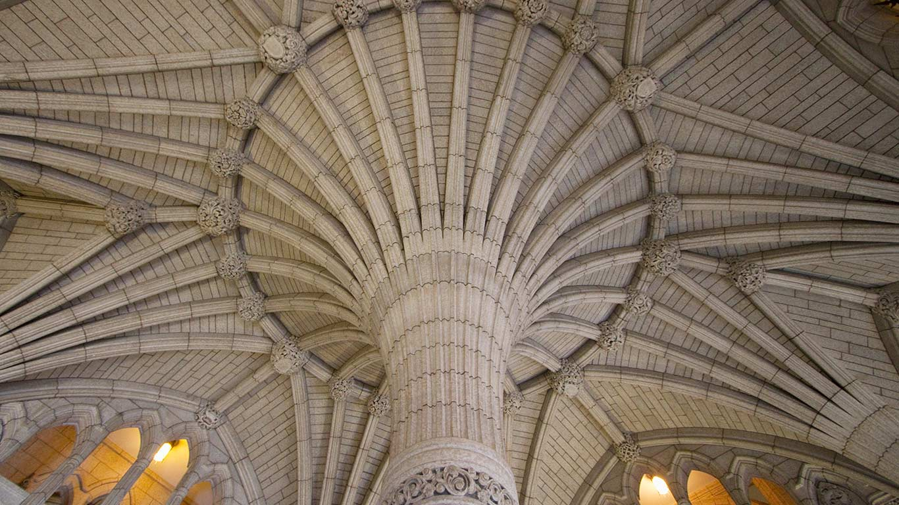

#### 20170220 Surfers at Bar Beach near Newcastle, New South Wales (© Fairfax Media/Getty Images)(Bing Australia)

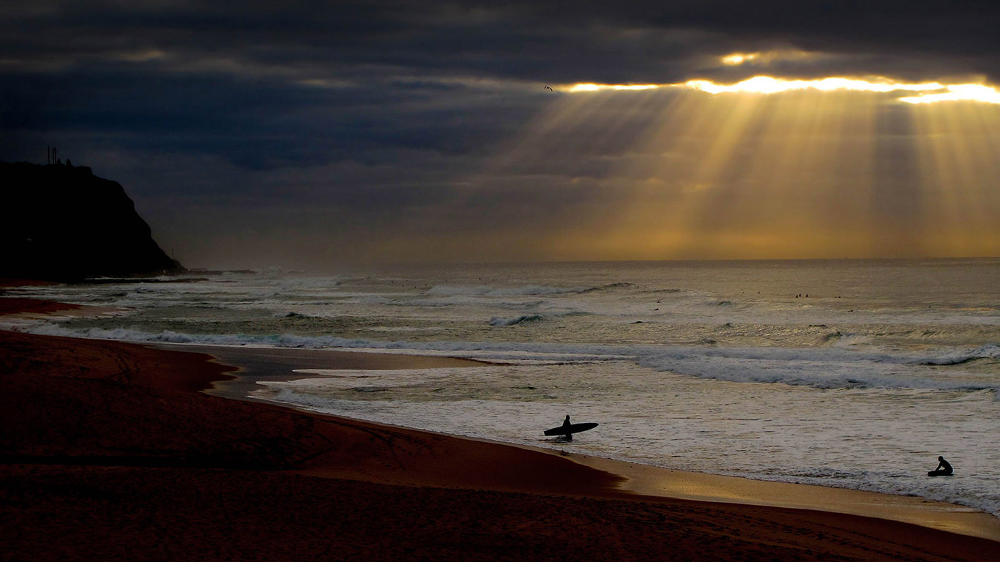

#### 20170219 Torronsuo National Park in Finland (© Teemu Tretjakov/500px)(Bing United Kingdom)

#### 20170219 Frost on the banks of the Taylor River on the road to Tofino, B.C. (© Aurora Photos/Offset)(Bing Canada)

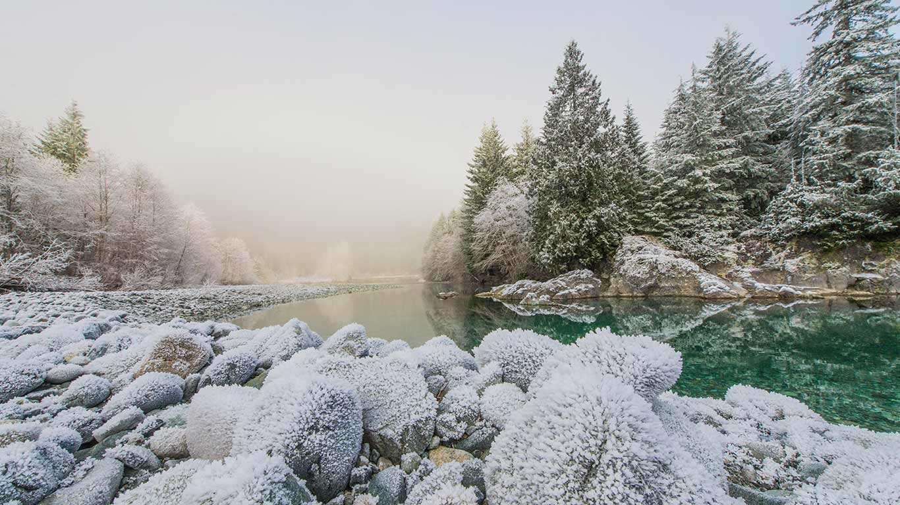

#### 20170219 ｢グリートジールの双子風車｣ドイツ, ニーダーザクセン州 (© Andreas Pacek/Westend61/age fotostock)(Bing Japan)

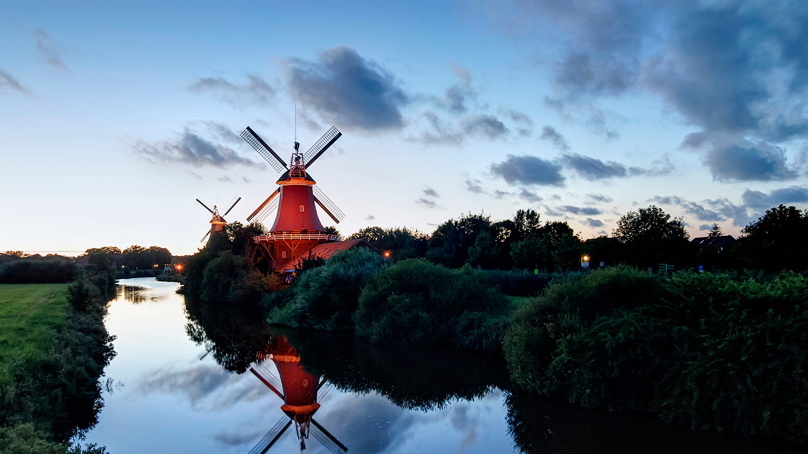

#### 20170218 Vieste on the Adriatic coast of Italy (© Peter Adams Photography Ltd/Alamy)(Bing United Kingdom)

#### 20170217 Waterfalls in a canyon of Siberia’s Putorana Plateau, Russia (© Sergey Gorshkov/Minden Pictures)(Bing United Kingdom)

#### 20170217 Forêt gelé, sentier de la Serreyrède dans le parc national des Cévennes (© Hemis/Alamy Stock Photo)(Bing France)

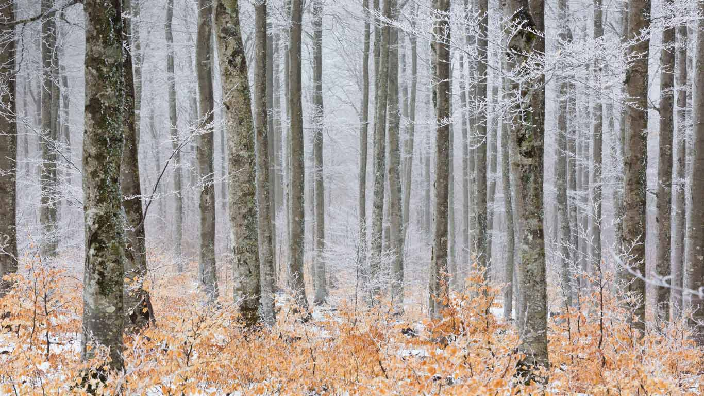

#### 20170216 James Turrell’s ‘Twilight Epiphany’ Skyspace at Rice University, Houston, Texas (© Alex Fradkin/Gallery Stock)(Bing United States)

#### 20170216 Jedburgh Abbey in the Scottish Borders (© Markus Keller/imageBROKER/age fotostock)(Bing United Kingdom)

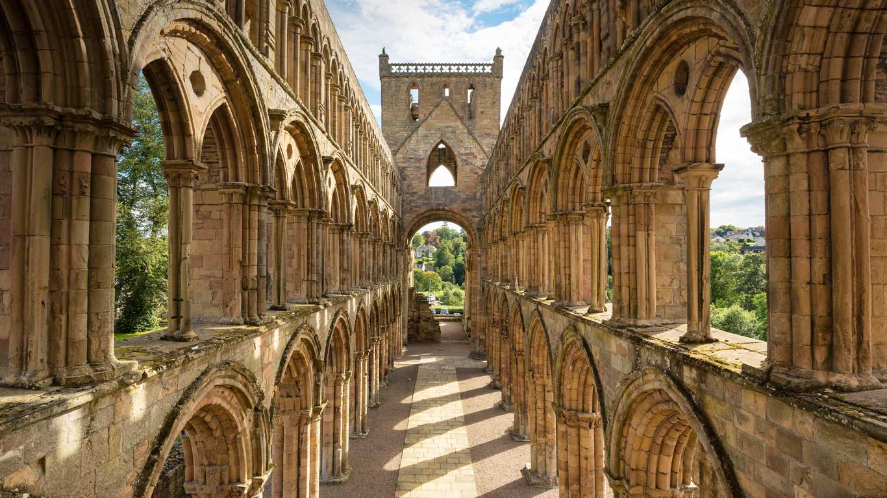

#### 20170216 Ice sculpture of fish, illuminated at night in Confederation Park, Ottawa (© Vlad G/Shutterstock.com)(Bing Canada)

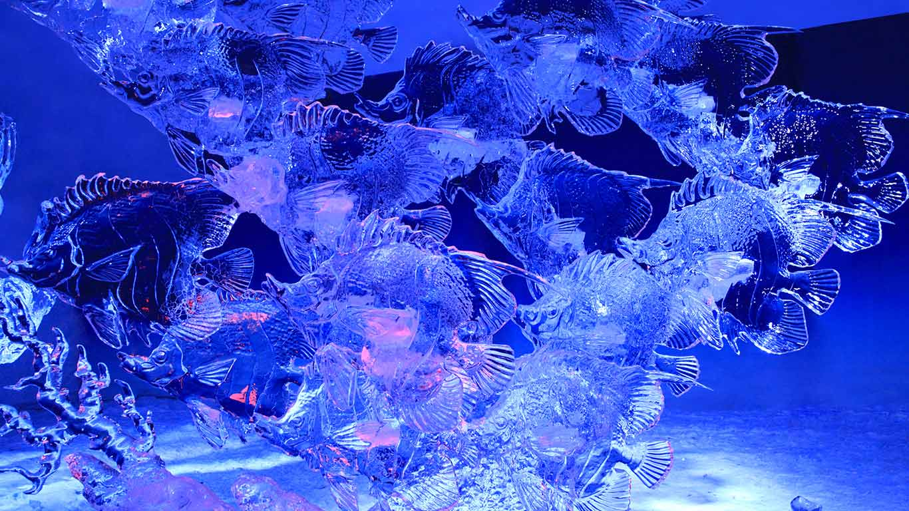

#### 20170215 一片叶子上的热带爪哇麻雀 (© CREATISTA/Getty Images)(Bing China)

#### 20170215 Elephants crossing Luangwa River, Zambia (© Frans Lanting/Gallery Stock)(Bing United Kingdom)

#### 20170214 Stieglitz und Erlenzeisige bei der winterlichen Futtersuche auf den Blütenständen einer Distel, Deutschland (© Duncan Usher/Minden Pictures)(Bing Deutschland)

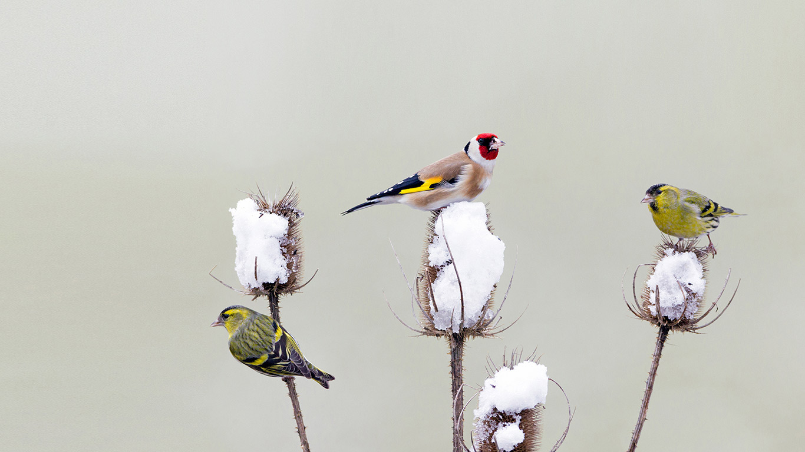

#### 20170214 Wilson Stump on Yakushima Island, Japan (© Mitsushi Okada/Getty Images)(Bing United Kingdom)

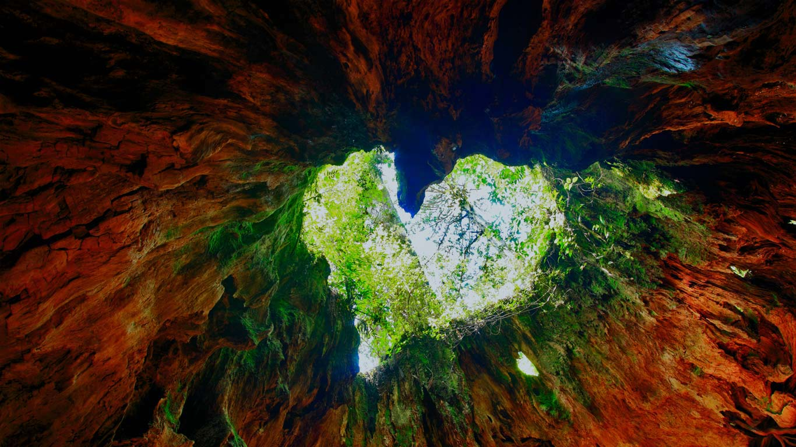

#### 20170213 Satin bowerbird in Bunya Mountains National Park, Queensland (© Martin Willis/Minden Pictures)(Bing Australia)

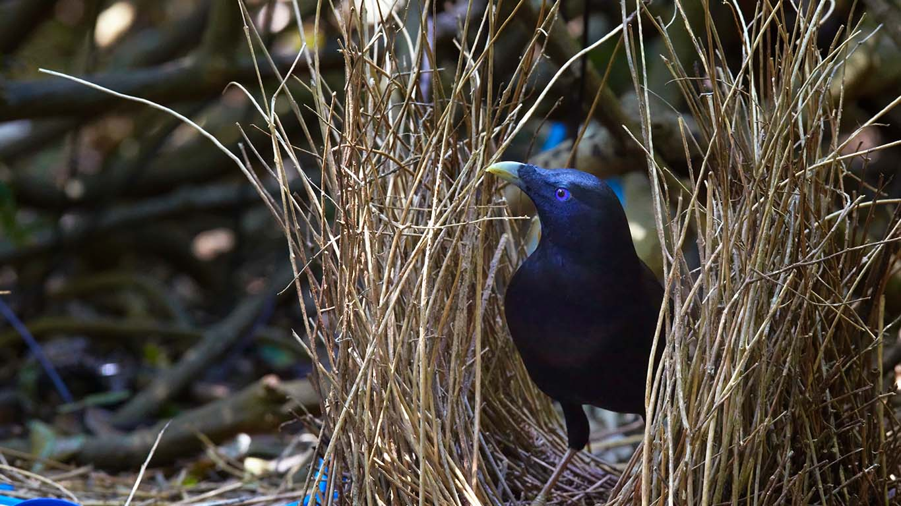

#### 20170213 Hallwylfjellet at Adventdalen, Norway (© Ethan Welty/Aurora Photos)(Bing United Kingdom)

#### 20170213 ｢バルト海に伸びる防波堤｣ドイツ, メクレンブルク＝フォアポンメルン州 (© blickwinkel/Herrmann/Alamy Stock Photo)(Bing Japan)

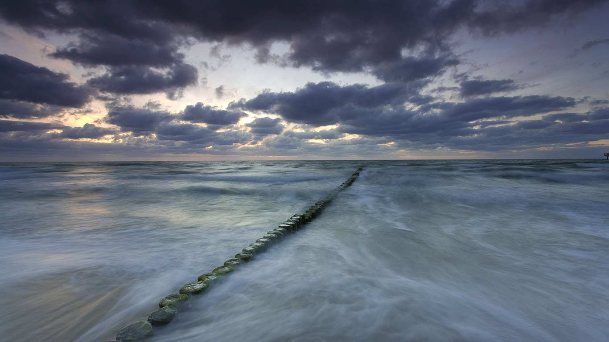

#### 20170212 北京潘家园集市上琳琅满目的花灯 (© Adrienne Bresnahan/Getty Images)(Bing China)

#### 20170212 Upside-down jellyfish in Jardines de la Reina National Park, Cuba (© Pete Oxford/Minden Pictures)(Bing United Kingdom)

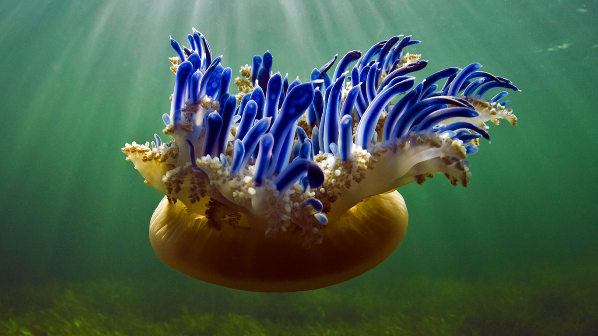

#### 20170211 Surreal swallows in a spring snowstorm in Whitehorse, Yukon (© Keith Williams/500px)(Bing Canada)

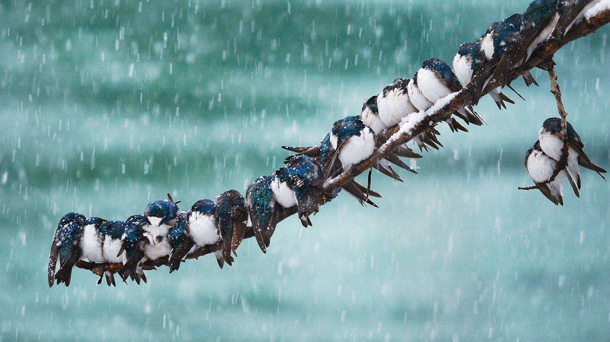

#### 20170211 Beach near Tofino, Vancouver Island, Canada (© Cavan Images/Offset)(Bing United Kingdom)

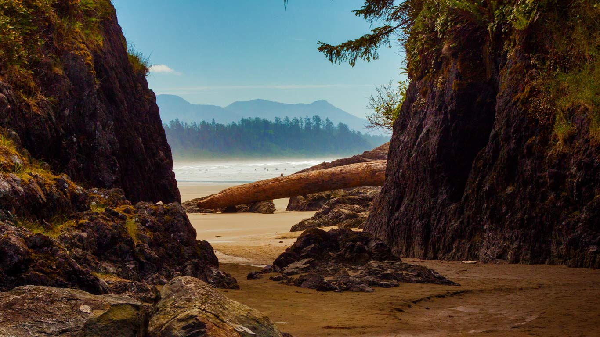

#### 20170211 Cairns sur une plage de l’île de Bréhat, Bretagne (© RolfSt/Getty Images)(Bing France)

#### 20170211 ｢オーレーの夕暮れ｣フランス, ブルターニュ地域圏 (© Francesco Carovillano/Tandem Stills)(Bing Japan)

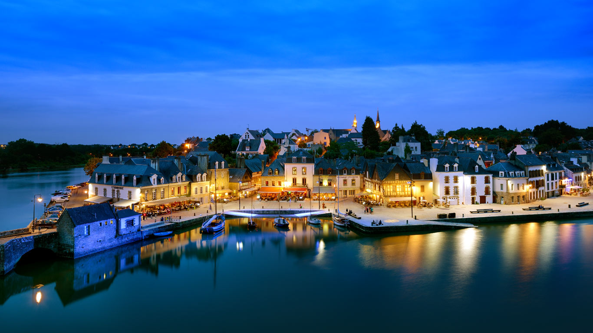

#### 20170210 Low winter sunlight and frost in the Yorkshire Dales (© Andrew Bret Wallis/Getty Images)(Bing United Kingdom)

#### 20170210 Boardman Tree Farm in Boardman, Oregon (© Garret Suhrie/REX/Shutterstock)(Bing United States)

#### 20170209 Male Himalayan monal in Sagarmāthā National Park, Nepal (© Patricio Robles Gil/Minden Pictures)(Bing United Kingdom)

#### 20170209 Mangroves in Garigal National Park, Sydney, New South Wales (© Cassandra Hannagan/Fancy Images/plainpicture)(Bing Australia)

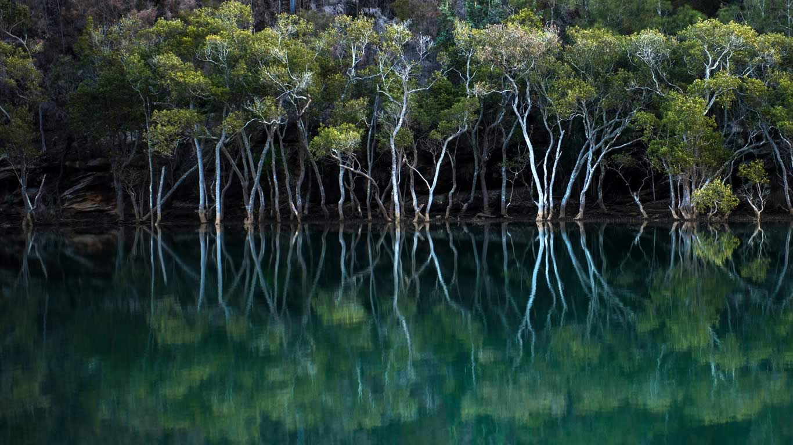

#### 20170209 ｢バンベルクの旧市庁舎｣ドイツ, バイエルン州 (© Rudy Balasko/Getty Images)(Bing Japan)

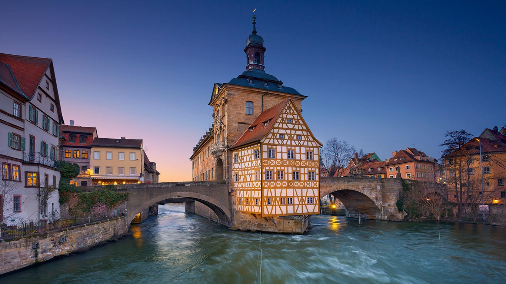

#### 20170208 Itapuã Lighthouse in Salvador, Bahia, Brazil (© Uiler Costa/Offset)(Bing United Kingdom)

#### 20170207 ｢雪の大迷路｣北海道, 札幌 (© KIM KYUNG-HOON/REUTERS/Reuters)(Bing Japan)

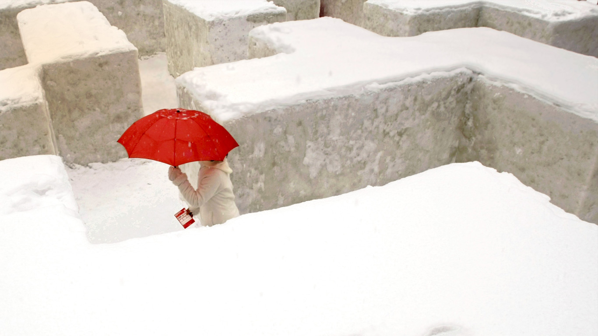

#### 20170207 Sunrise over Utah Lake near Provo, Utah (© Nimia)(Bing United Kingdom)

#### 20170207 Eiszapfen in der Oswaldhöhle bei Muggendorf, Wiesenttal, Fränkische Schweiz, Bayern, Deutschland (© Martin Siepmann/Getty Images)(Bing Deutschland)

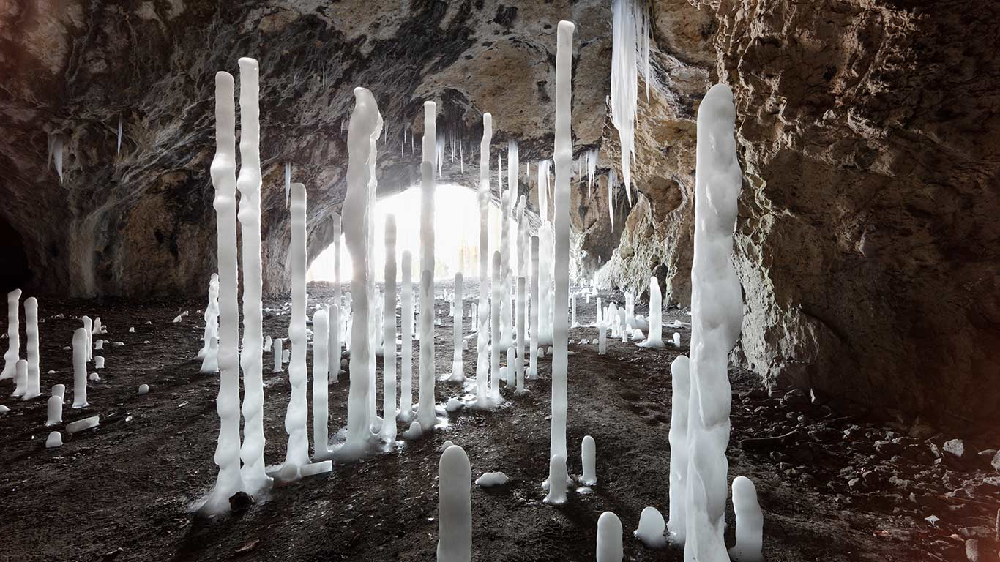

#### 20170206 Stairwell in the Department of Philosophy building of New York University, New York City (© Alex Fradkin/Gallery Stock)(Bing United Kingdom)

#### 20170205 King penguins at Volunteer Point, Falkland Islands (© Luciano Candisani/Minden Pictures)(Bing United Kingdom)

#### 20170204 【今日立春】长尾山雀，日本 (© Gouichi Wada/Nature Production/MINDEN PICTURES INC)(Bing China)

#### 20170204 Forest path in Padley Gorge in Derbyshire (© James Mills/500px)(Bing United Kingdom)

#### 20170203 Palau de la Música Catalana in Barcelona, Spain (© Luis Davilla/age fotostock)(Bing United Kingdom)

#### 20170202 Alpine marmots near the Grossglockner High Alpine Road, Austria (© Weimann/Getty Images)(Bing United States)

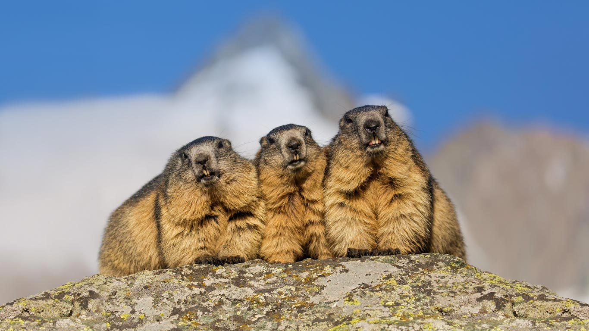

#### 20170202 A barrel jellyfish and Atlantic horse mackerel at Kimmeridge Bay, Isle of Purbeck, Dorset (© Steve Trewhella/FLPA/Minden Pictures)(Bing United Kingdom)

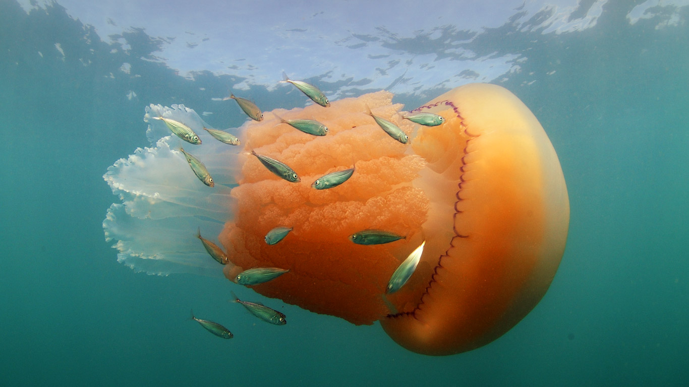

#### 20170201 The Smithsonian Institution's National Museum of African American History and Culture in Washington, DC (© Jahi Chikwendiu/The Washington Post via Getty Images)(Bing United States)

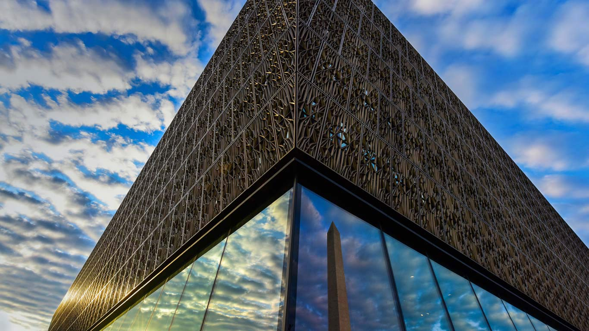

#### 20170201 Ghost fungi on a tree in the Atherton Tablelands, Queensland (© Jurgen Freund/NPL/Minden Pictures)(Bing Australia)

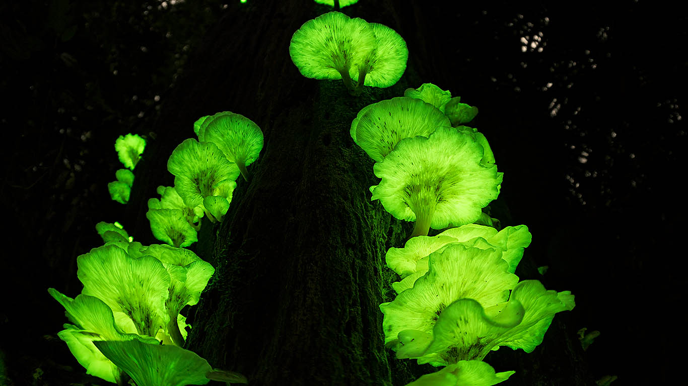

#### 20170201 Flame Towers and skyline of Baku, Azerbaijan (© railelectropower/Getty Images)(Bing United Kingdom)

#### 20170201 Glacier with lakes, St Elias Range, Yukon (© tibu/Getty Imgaes)(Bing Canada)

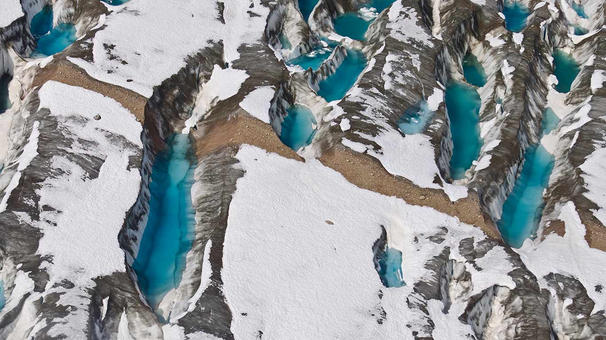

