#### 20170331 Reflection of Ormiston Gorge, Northern Territory (© Ingo Oeland/Getty Images)(Bing Australia)

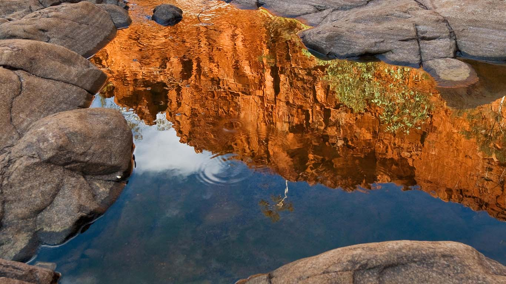

#### 20170331 The ‘Spiral Jetty’ at Great Salt Lake, Utah (© Cameron Davidson/Gallery Stock)(Bing United Kingdom)

#### 20170331 Trouveau de vaches au col des Tentes, Hautes-Pyrénées, Occitanie (© Guichaoua/Alamy)(Bing France)

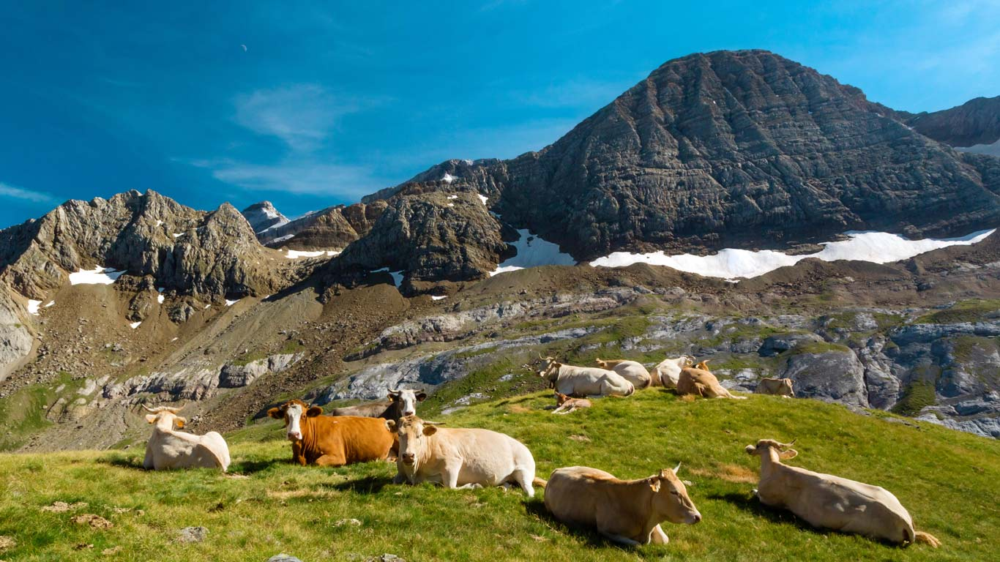

#### 20170330 Description: Chateau Frontenac at dusk in Quebec City (© Songquan Deng/Alamy Stock Photo)(Bing Canada)

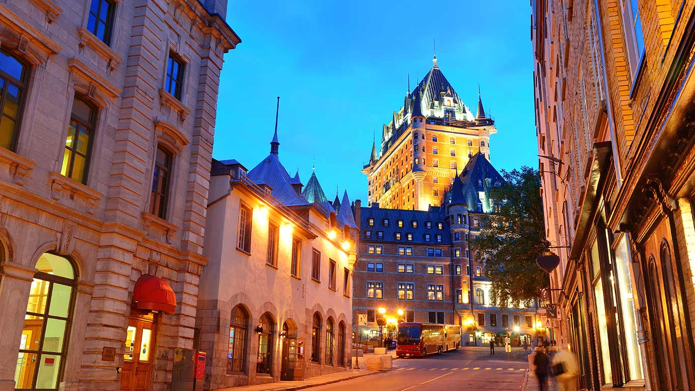

#### 20170330 An elevated trail at Cradle Mountain-Lake St Clair National Park in Tasmania, Australia (© Sean Crane/Minden Pictures)(Bing United Kingdom)

#### 20170329 Lacy's Caves on the banks of River Eden near Little Salkeld, Cumbria (© Ashley Cooper/Alamy)(Bing United Kingdom)

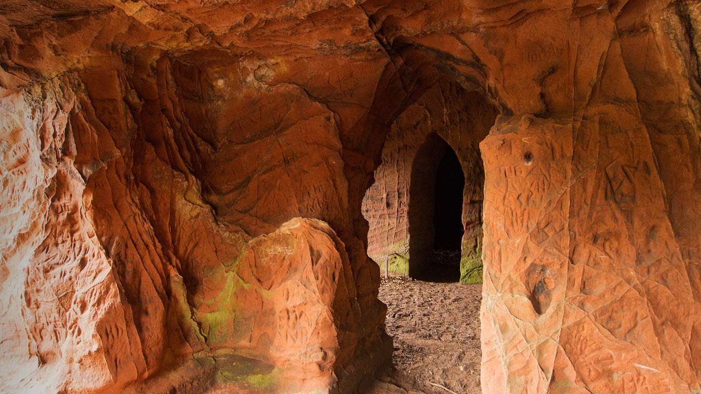

#### 20170328 Scarlet rosefinch male perching (© Arterra Picture Library/Alamy)(Bing United Kingdom)

#### 20170327 ｢パルトナック峡谷｣ドイツ, バイエルン州 (© Westend61/Getty Images)(Bing Japan)

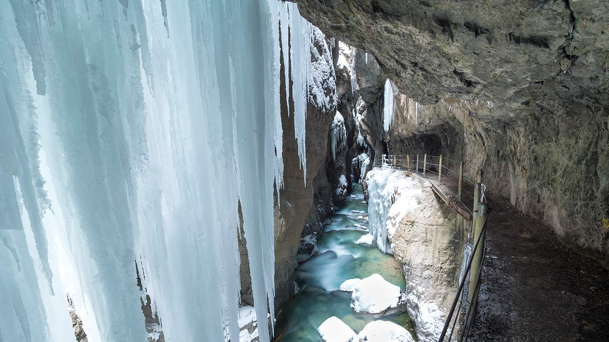

#### 20170327 Hveravellir hot spring on Kjölur plateau, Iceland (© Mliberra/Getty Images)(Bing United Kingdom)

#### 20170327 St. Pauli-Landungsbrücken bei Sonnenuntergang, Hamburg, Deutschland (© WestEnd61/REX/Shutterstock)(Bing Deutschland)

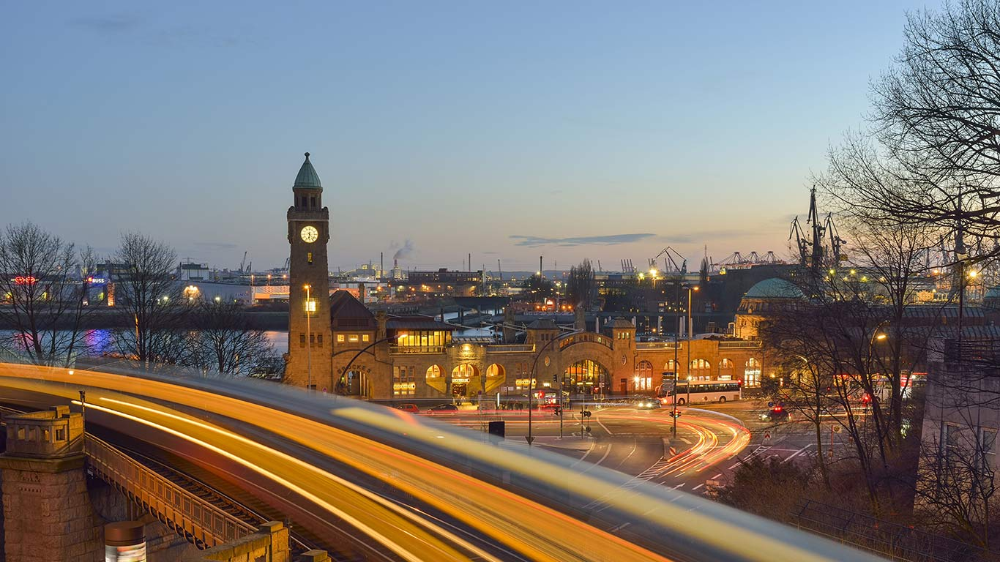

#### 20170326 Pine sapling in burnt heather at Strabrechtse Heide, Netherlands (© Heike Odermatt/Minden Pictures)(Bing United States)

#### 20170326 Cotentin donkey and foal in Normandy, France (© Klein and Hubert/Minden Pictures)(Bing United Kingdom)

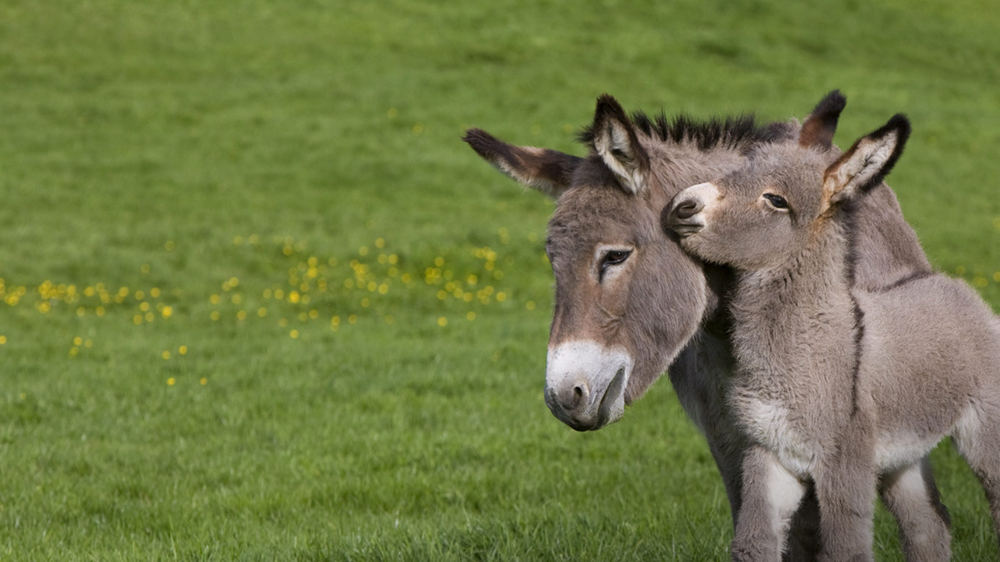

#### 20170325 Springtime near the village of Aínsa-Sobrarbe, Spain (© Hans Kruse/500px)(Bing United Kingdom)

#### 20170325 ｢高遠の桜｣長野, 高遠城址公園 (© JTB MEDIA CREATION, Inc./JTB MEDIA CREATION, Inc./Alamy)(Bing Japan)

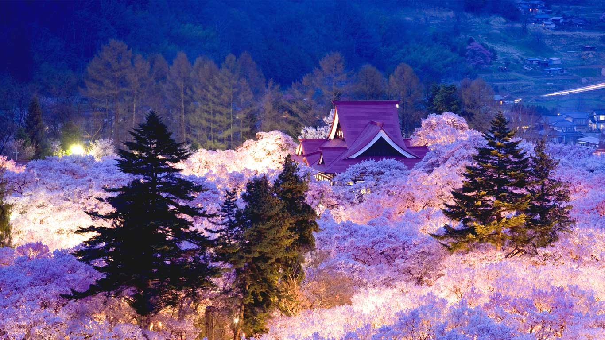

#### 20170325 View of stars from Jenolan Caves, New South Wales, Australia (© Carlos Orue/Getty Images)(Bing Australia)

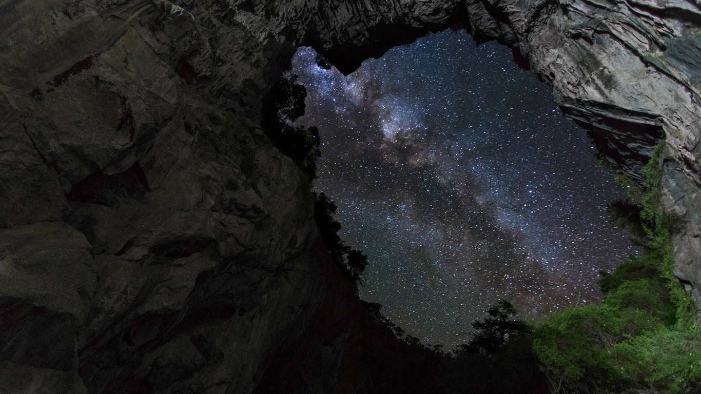

#### 20170324 Stair Hole near Lulworth Cove in Dorset (© Jonathan Dillon/Alamy)(Bing United Kingdom)

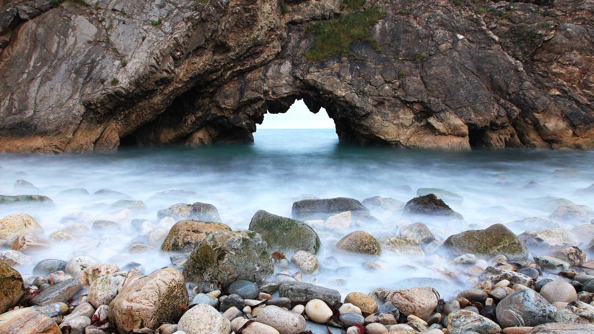

#### 20170324 Interior of an Igloo in Baffin Island, Nunavut (© Paul Zizka/Aurora Photos)(Bing Canada)

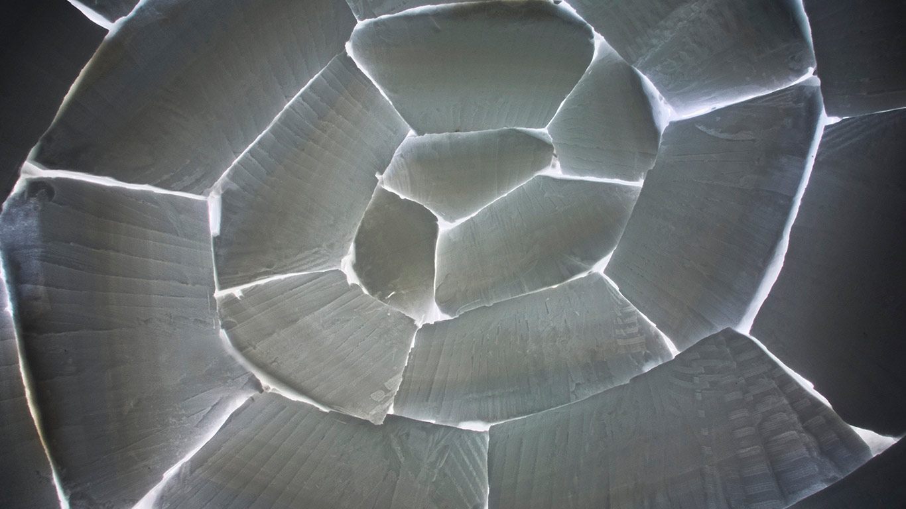

#### 20170324 Two Brothers rock formation at Baía dos Porcos beach, Fernando de Noronha, Brazil (© Alex Saberi/Getty Images)(Bing Australia)

#### 20170323 Storm near Lamar, Colorado (© john finney photography/Getty Images)(Bing United Kingdom)

#### 20170322 Yinlianzhui Waterfall near Anshun, Guizhou Province, China (© Top Photo Group/Getty Images)(Bing United Kingdom)

#### 20170322 ｢フロイデンベルグ｣ドイツ, ノルトライン＝ヴェストファーレン州 (© Urbanmyth/Alamy)(Bing Japan)

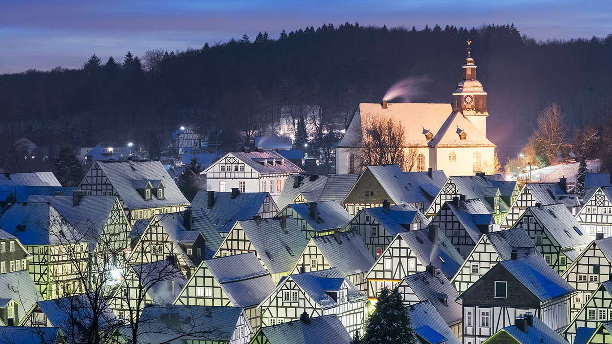

#### 20170321 Light display on Sydney Opera House for the Vivid festival in 2016 (© Adam Foster/500px)(Bing Australia)

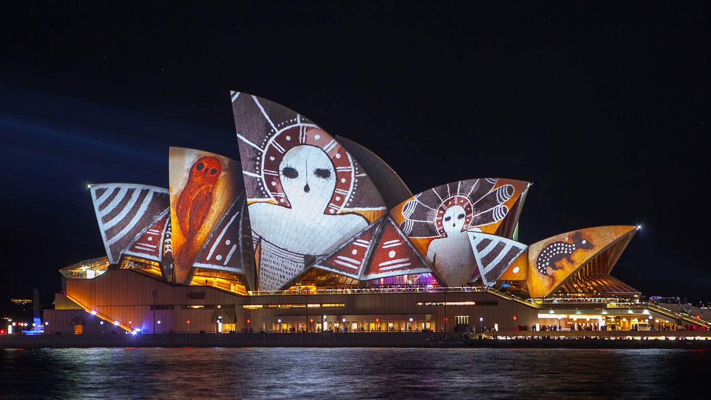

#### 20170321 Ein Europäischer Ziesel schnuppert an den Blüten eines Klatschmohns, Deutschland (© blickwinkel/Alamy Stock Photo)(Bing Deutschland)

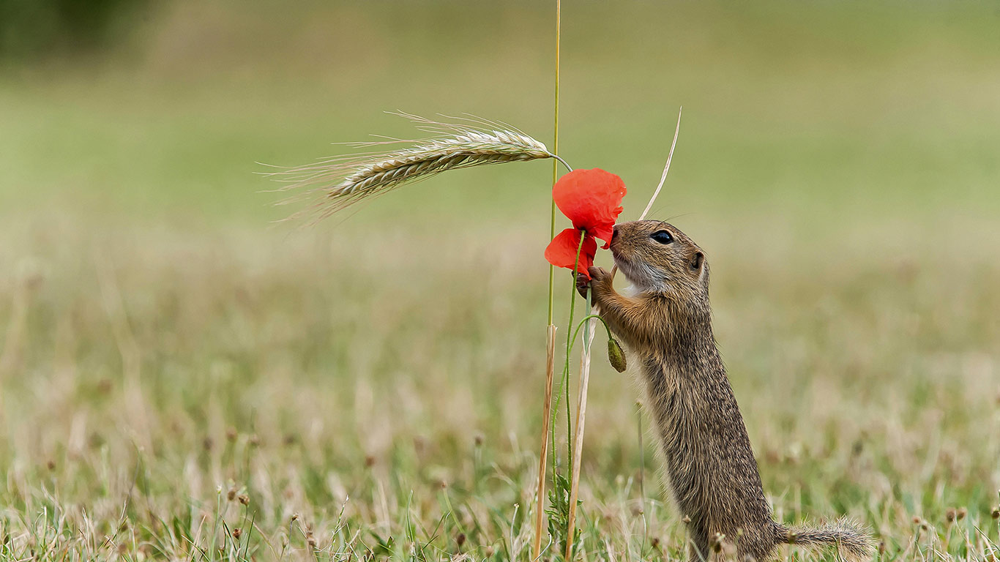

#### 20170321 Vue aérienne d’une forêt tempérée décidue au printemps, Picardie (© Michel Bureau/Minden Pictures)(Bing France)

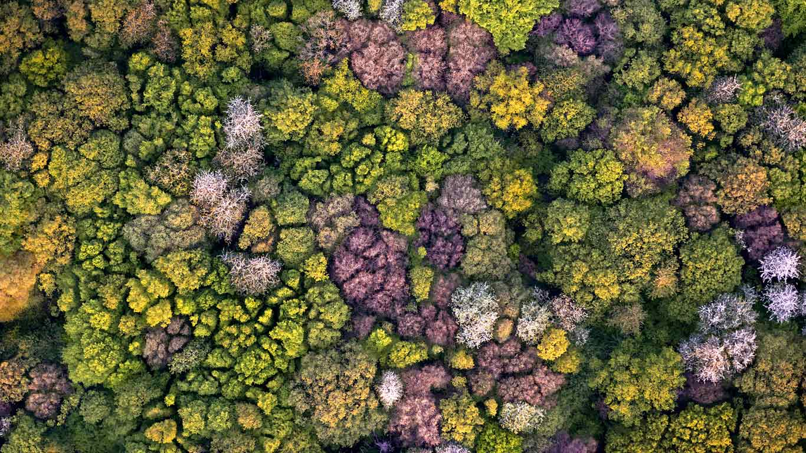

#### 20170321 An adult black bear in the Tongass National Forest of Alaska (© Mark Kelley/Tandem Stills + Motion)(Bing United Kingdom)

#### 20170320 Equinox at the Salk Institute for Biological Studies, San Diego, California (© Sameer Mundkur/500px)(Bing United Kingdom)

#### 20170319 An ice tunnel inside Matanuska Glacier, Alaska (© Lynn Wegener/Offset)(Bing United Kingdom)

#### 20170318 African wild dogs in Kruger National Park, South Africa (© Richard Du Toit/Minden Pictures)(Bing United Kingdom)

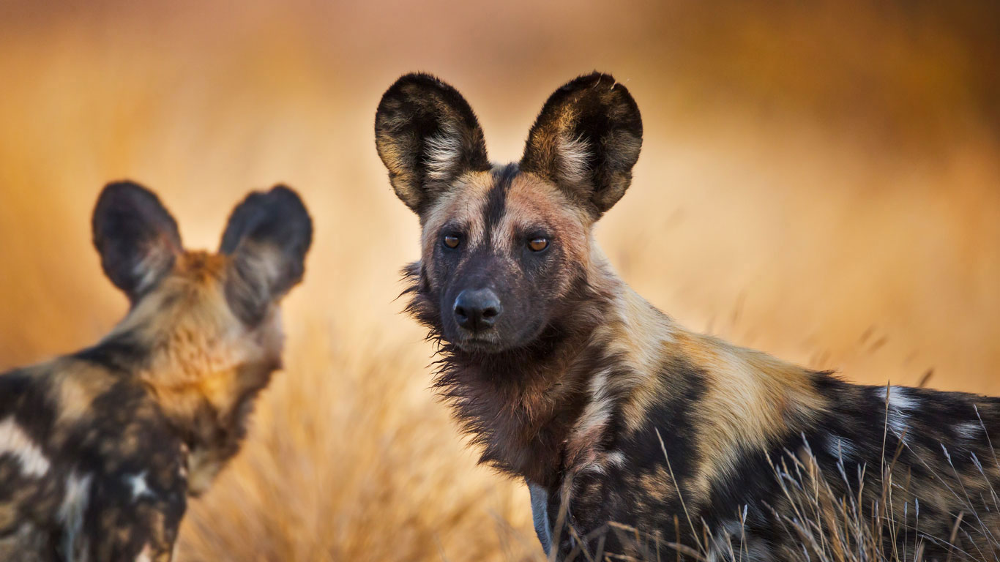

#### 20170317 Five Fingers Strand near Malin Head, Ireland (© Cahir Davitt/age fotostock)(Bing United Kingdom)

#### 20170317 Littoral dans le massif de l'Estérel, PACA (© Franck Chaput/Hemis.fr/Alamy)(Bing France)

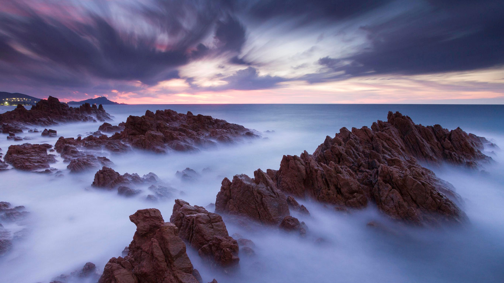

#### 20170316 Kilchurn Castle on Loch Awe in Argyll and Bute, Scotland (© Derek Croucher/Alamy)(Bing United Kingdom)

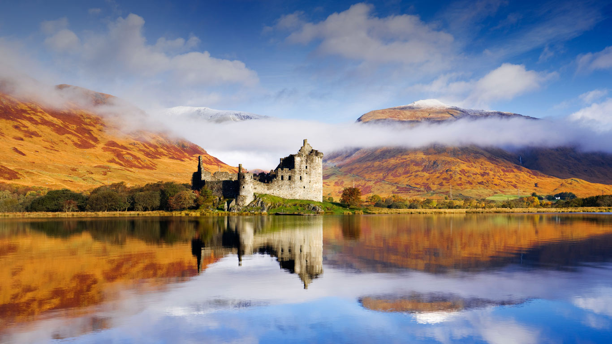

#### 20170315 Lands End in San Francisco, California (© Toby Harriman/Nimia)(Bing United Kingdom)

#### 20170315 Hot air balloons seen from Lake Burley Griffin, Canberra, Australian Capital Territory (© Peter Guo/500px)(Bing Australia)

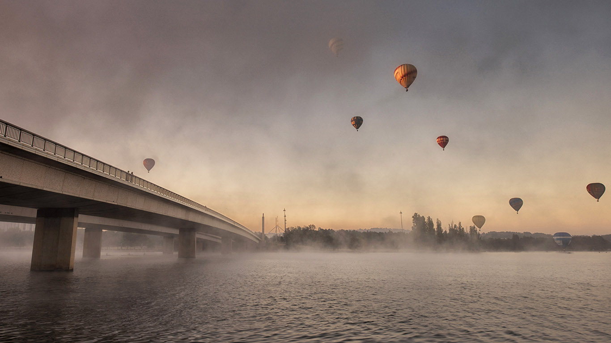

#### 20170314 Blick vom Brocken auf einen Zug der Brockenbahn im Winter, Sachsen-Anhalt, Deutschland (© GS/Gallery Stock)(Bing Deutschland)

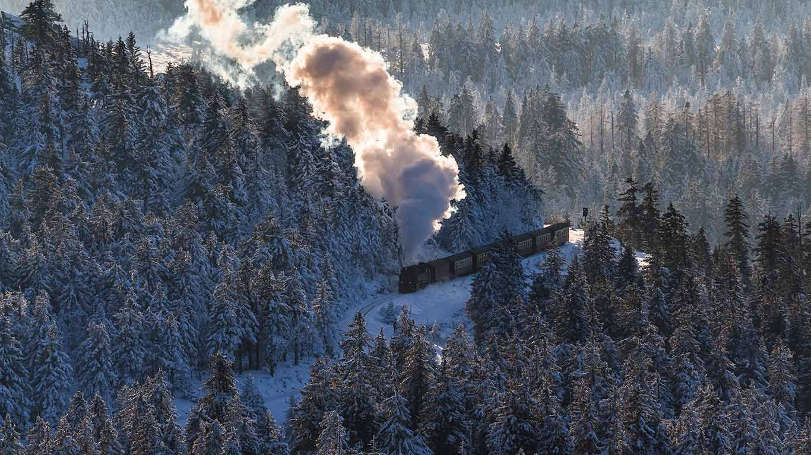

#### 20170314 Enhanced image of a cross section of a pine stem (© Garry DeLong/Getty Images)(Bing United Kingdom)

#### 20170313 Holi celebrations in Munich, Germany (© Geo Messmer/500px)(Bing Australia)

#### 20170313 A Holi festival in Washington, DC (© Devesh Tripathi/500px)(Bing United Kingdom)

#### 20170312 ｢東日本大震災追悼のキャンドル｣広島 (© The Asahi Shimbun/The Asahi Shimbun/Getty)(Bing Japan)

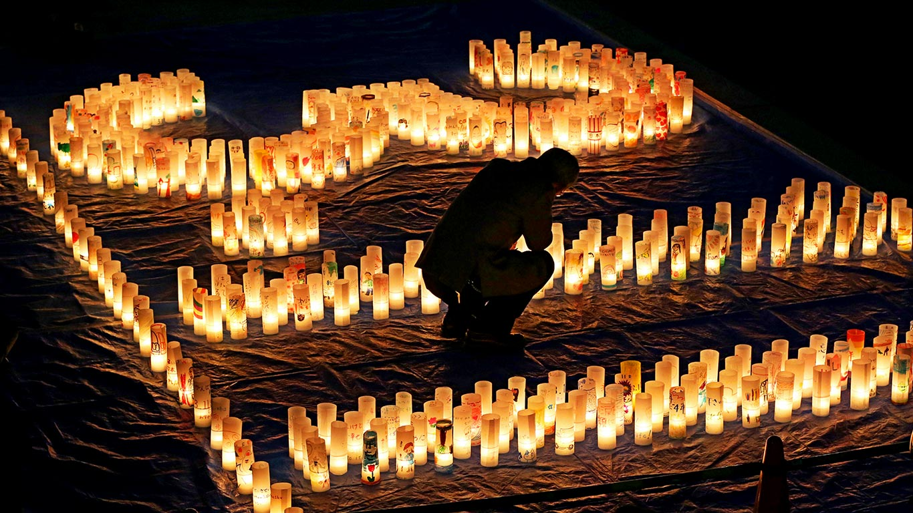

#### 20170312 A blue-footed booby dives off San Cristóbal Island, Ecuador (© Tui De Roy/Minden Pictures)(Bing United States)

#### 20170312 Interior of the Broch of Mousa on Mousa island, Scotland (© National Geographic Creative/Alamy)(Bing United Kingdom)

#### 20170311 Blanchard Springs Caverns in Arkansas (© Garret Suhrie/Tandem Stills + Motion)(Bing United Kingdom)

#### 20170310 Eastern quolls in Tasmania, Australia (© Sean Crane/Minden Pictures)(Bing Australia)

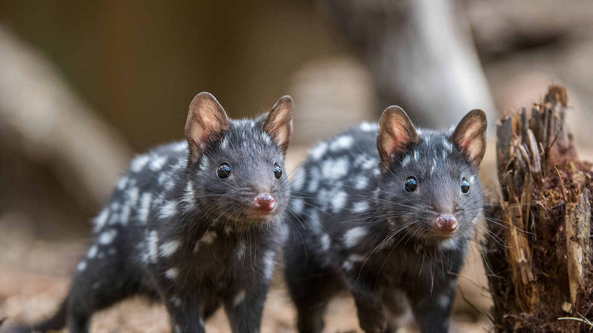

#### 20170310 Dongdaemun Design Plaza in Seoul, South Korea (© Grant Faint/Offset)(Bing United Kingdom)

#### 20170310 Vue depuis le refuge des Cosmiques sur les Grandes Jorasses, massif du Mont-Blanc, Alpes françaises (© Asmus Nørreslet/500px)(Bing France)

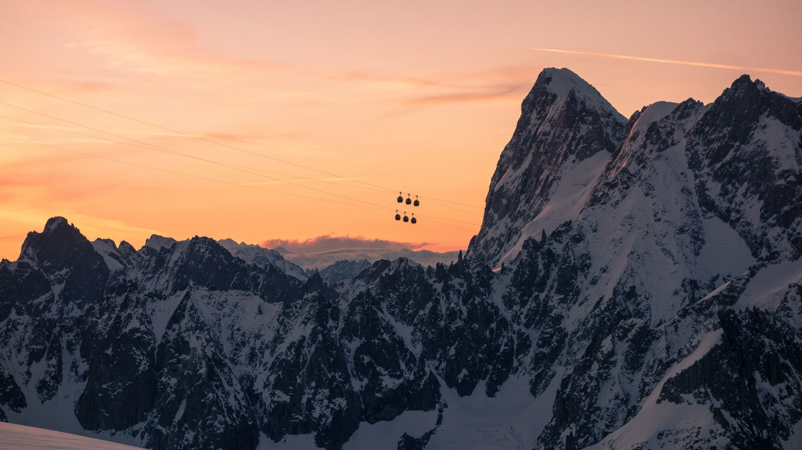

#### 20170309 Svalbard Satellite Station, Svalbard archipelago, Norway (© Tim E White/Getty Images)(Bing United Kingdom)

#### 20170309 Overhead of ice fishing huts in Anse-St-Jean, Que. (© Guylain Doyle/Getty Images)(Bing Canada)

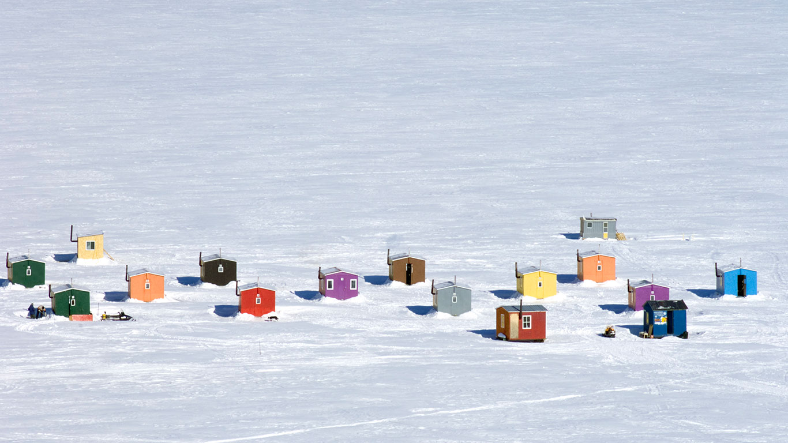

#### 20170308 Women suffragists marching down Pennsylvania Avenue on March 3, 1913, Washington, DC (© Library of Congress)(Bing United States)

#### 20170308 Women's suffrage tile mural outside the Auckland Art Gallery, New Zealand (© Robert Harding/Alamy)(Bing United Kingdom)

#### 20170308 The 'Famous Five' women's suffrage memorial in Calgary (© atgof.co/Alamy Stock Photo)(Bing Canada)

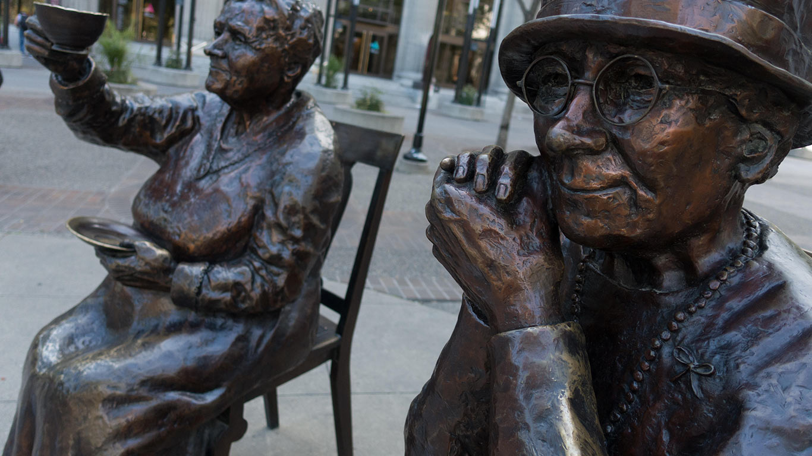

#### 20170307 ｢はしご車隊パフォーマンス｣東京消防出初式 (©  Nippon News/Aflo Co. Ltd./Alamy)(Bing Japan)

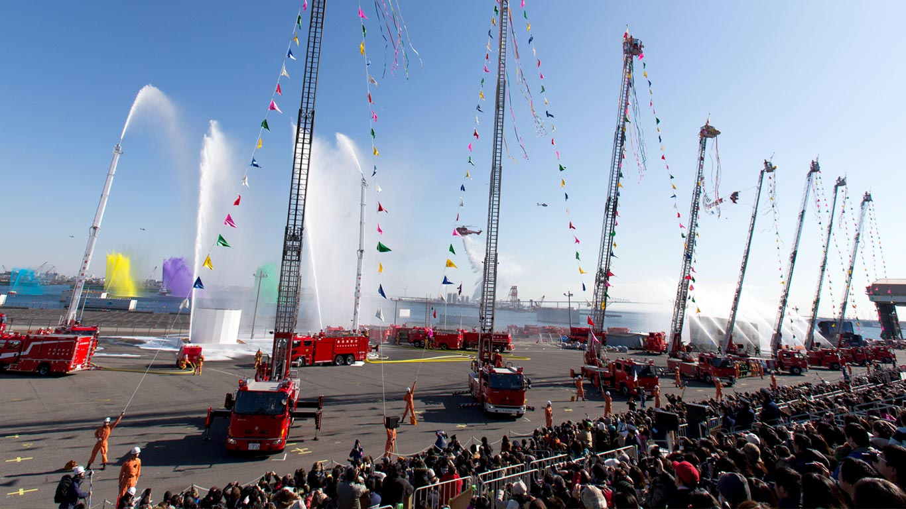

#### 20170307 Desert View Watchtower, Grand Canyon National Park, Arizona (© Babak Tafreshi/National Geographic/Getty Images)(Bing United Kingdom)

#### 20170307 Graureiher im Winter, Insel Usedom, Mecklenburg-Vorpommern, Deutschland (© Konrad Wothe/Minden Pictures)(Bing Deutschland)

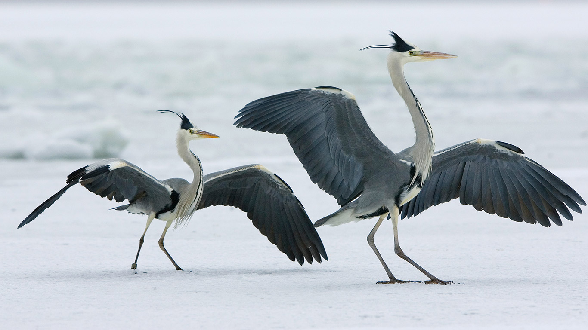

#### 20170306 Valais Blacknose sheep in Valais, Switzerland (© Alessandra Meniconzi/Solent News/REX/Shutterstock)(Bing United Kingdom)

#### 20170305 A glasswing butterfly perched on a leaf (© Corianna Heise/Alamy)(Bing United Kingdom)

#### 20170304 ｢おひなさま｣ (©  Koki Iino/Koki Iino/Getty Images)(Bing Japan)

#### 20170304 Tasman Lake on South Island, New Zealand (© UpdogDesigns/iStock/Getty Images Plus)(Bing United Kingdom)

#### 20170303 A herd of male springboks in the Kalahari region of South Africa (© Minden Pictures/Masterfile)(Bing United Kingdom)

#### 20170302 Shiprock in the Navajo Nation of New Mexico (© Wild Horizon/Getty Images)(Bing United Kingdom)

#### 20170302 ｢水に映るモン・サン=ミシェル｣フランス, ノルマンディー地方 (© Luca Da Ros/SIME/4Corners)(Bing Japan)

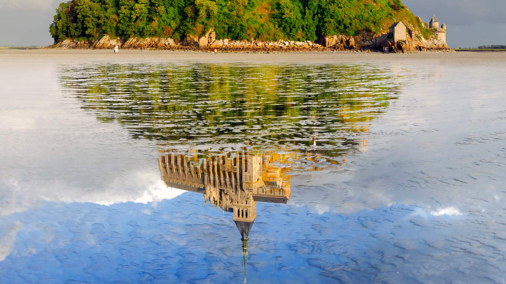

#### 20170302 Bergfinken im Winter, Schwarzwald, Baden-Württemberg, Deutschland (© Ingo Arndt/Minden Pictures)(Bing Deutschland)

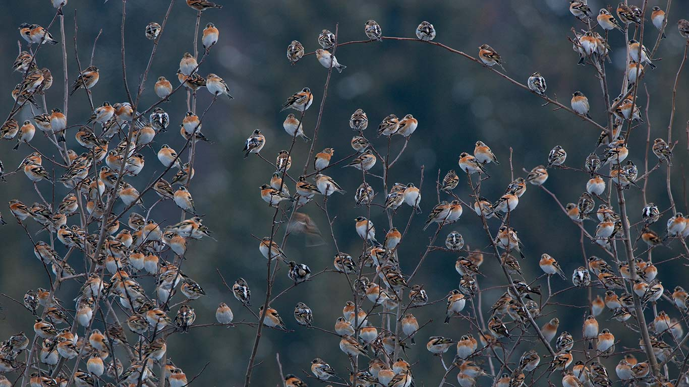

#### 20170301 Hay Bluff in the Black Mountains, Brecon Beacons National Park, Wales (© Justin Foulkes/SIME/eStock Photo)(Bing United Kingdom)

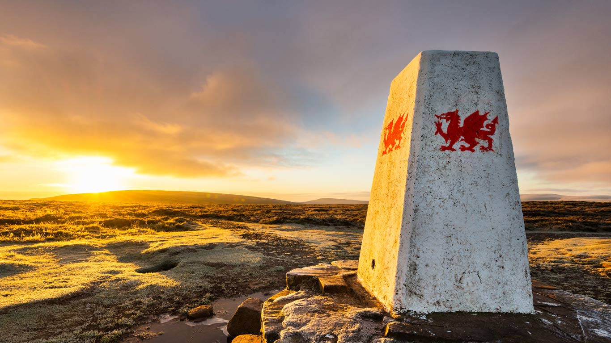

