#### 20170430 South Moravian landscape near Kyjov, Czech Republic (© Tomas Vocelka/500px)(Bing United Kingdom)

#### 20170430 The Jackknife Mountains and river valley viewed from an airplane in NWT (© hclphotography/Getty Images)(Bing Canada)

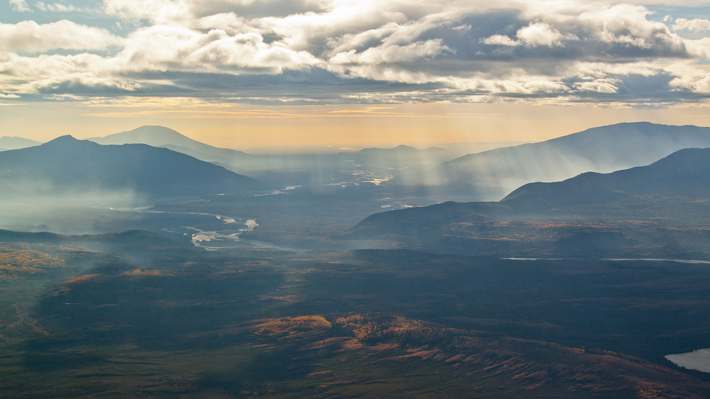

#### 20170429 Soundsuits by artist Nick Cave at Carriageworks in Sydney, Australia in 2016 (© Don Arnold/WireImage/Getty Images)(Bing United Kingdom)

#### 20170428 An oak tree seedling (© plusphoto/Getty Images)(Bing United States)

#### 20170428 Kallur lighthouse on Kalsoy Island, Faroe Islands (© Janne Kahila/500px)(Bing United Kingdom)

#### 20170427 Crepuscular rays over the Saronic Gulf, Greece (© Stian Rekdal/Nimia)(Bing United Kingdom)

#### 20170426 Civita di Bagnoregio, Italy (© Westend61/SuperStock)(Bing United Kingdom)

#### 20170426 Sämlinge einer Gemeinen Fichte auf einem alten Baumstamm, Oberpfalz, Bayern, Deutschland (© Radius Images/Alamy Stock Photo)(Bing Deutschland)

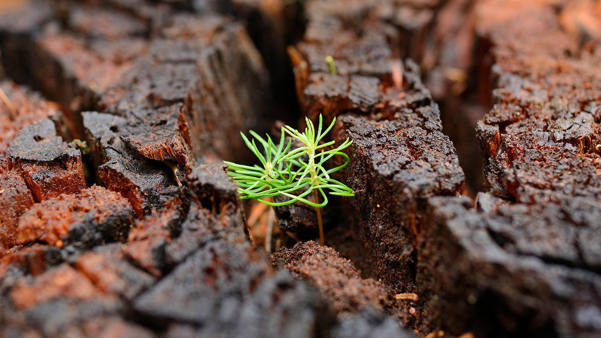

#### 20170425 Anzac silhouettes at Newcastle Memorial Walk in Newcastle, New South Wales (© David Angel/Alamy)(Bing Australia)

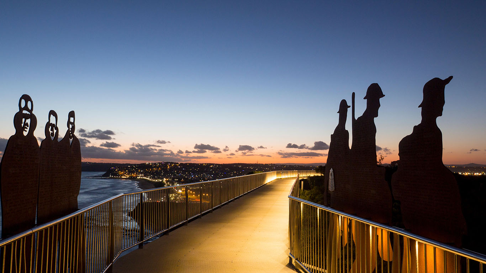

#### 20170425 Weaver birds in Queen Elizabeth National Park, Uganda (© Joel Sartore/Getty Images)(Bing United Kingdom)

#### 20170424 Main Reading Room of the Library of Congress, Washington, DC (© Sean Pavone/Alamy)(Bing United States)

#### 20170424 Mirror Beach near Trancoso, Bahia, Brazil (© dri5821/Moment Open/Getty Images)(Bing United Kingdom)

#### 20170424 A tepee located in southern Alberta (© ImagineGolf/Getty Images)(Bing Canada)

#### 20170423 A helter skelter ride decorated with St George and the Dragon in Plymouth, Devon (© Silverport Pictures/Alamy)(Bing United Kingdom)

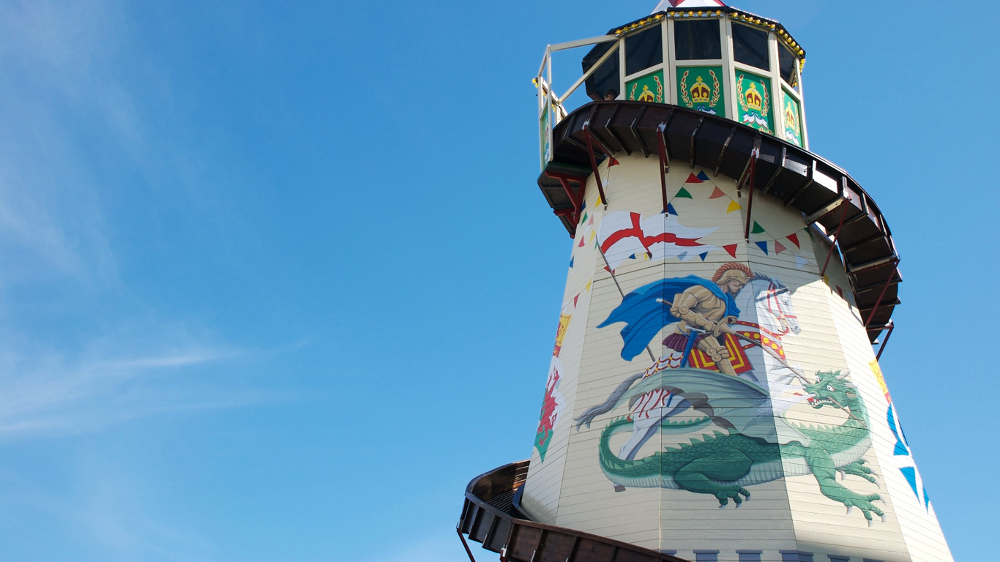

#### 20170423 Sol Duc Valley region of Olympic National Park, Washington (© Ray Green/500px)(Bing United States)

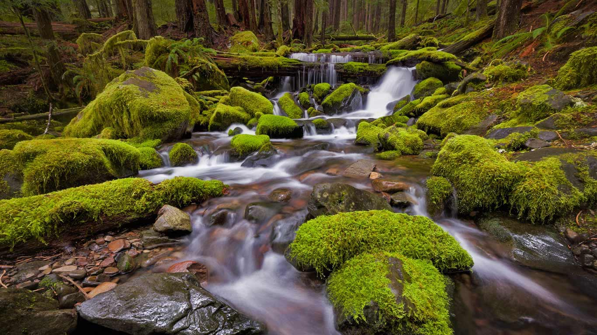

#### 20170422 Earth seen from space (© NOAA)(Bing United Kingdom)

#### 20170421 The Crescent Dunes Solar Energy Project near Tonopah, Nevada (© Jassen Todorov/Solent News/REX/Shutterstock)(Bing United Kingdom)

#### 20170421 ｢星峠の棚田｣新潟県十日町市 (© Yoshitsugu Nishigaki/Sebun Photo　)(Bing Japan)

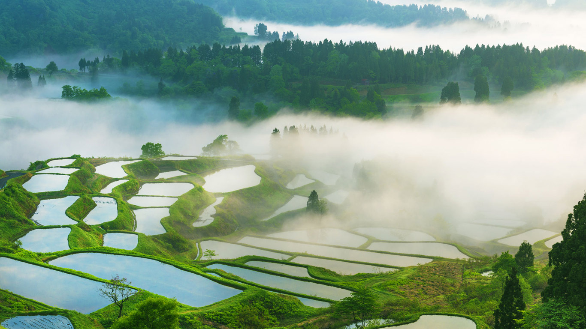

#### 20170421 【今日谷雨】插秧的妇女，中国云南省大理市 (© Ingo Oeland/Alamy)(Bing China)

#### 20170420 A grey wolf in Yellowstone National Park, Wyoming (© Meril Darees & Manon Moulis/Biosphoto/Minden Pictures)(Bing United Kingdom)

#### 20170419 Reh im Rapsfeld, Hessen, Deutschland (© Michael Breuer/Getty Images)(Bing Deutschland)

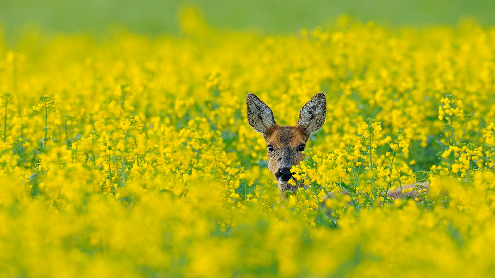

#### 20170419 Sunrise over Hadrian's Wall at Steel Rigg in Northumberland (© Graeme Campbell/Getty Images)(Bing United Kingdom)

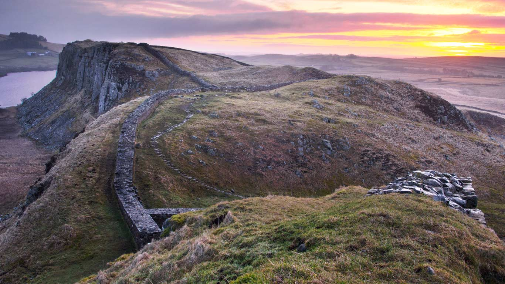

#### 20170419 Star trails and a bristlecone pine at Bryce Canyon National Park, Utah (© roycebair/RooM/Getty Images)(Bing United States)

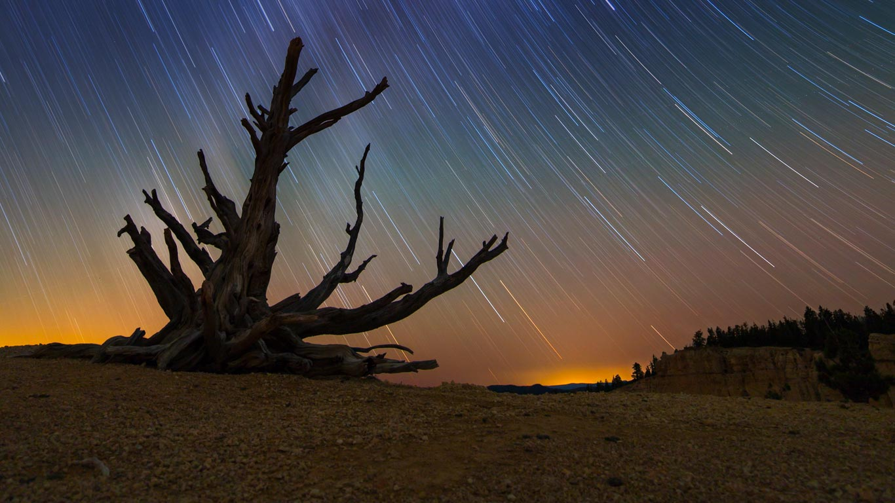

#### 20170418 Lamplugh Glacier in Glacier Bay National Park and Preserve, Alaska (© Michael Melford/Getty Images)(Bing United Kingdom)

#### 20170417 European rabbit (Oryctolagus cuniculus) kit greeting parent, France (© Remy Courseaux/Biosphoto/Minden Pictures)(Bing United Kingdom)

#### 20170417 Myotis bats in Pond Cave, Craters of the Moon National Monument and Preserve, Idaho (© Michael Durham/Minden Pictures)(Bing United States)

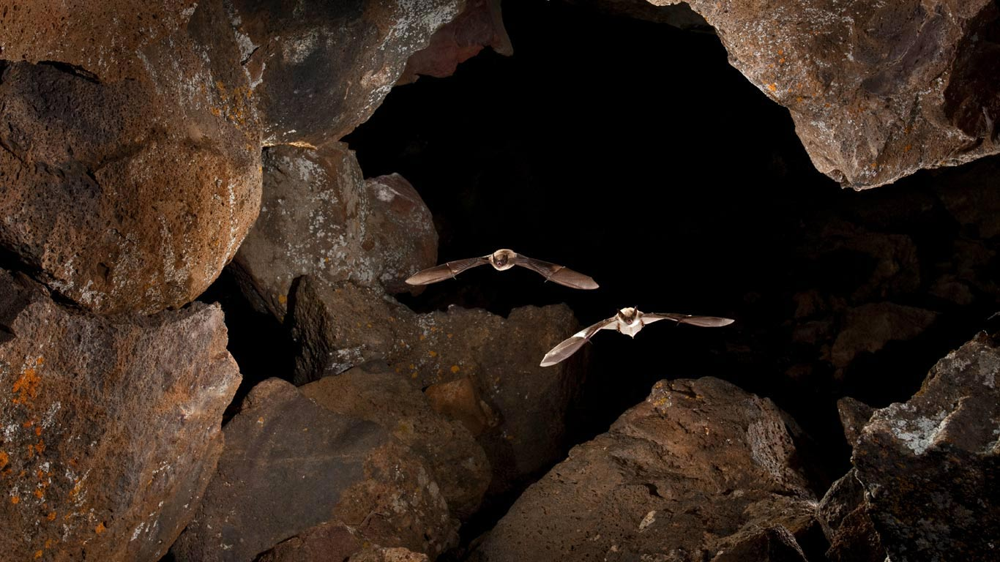

#### 20170416 Ground nest in the Arctic National Wildlife Refuge, Alaska (© Mint Images/Offset)(Bing United Kingdom)

#### 20170415 Wallace Hut and snow gum trees in Alpine National Park, Victoria, Australia (© Ingo Oeland/Alamy)(Bing United Kingdom)

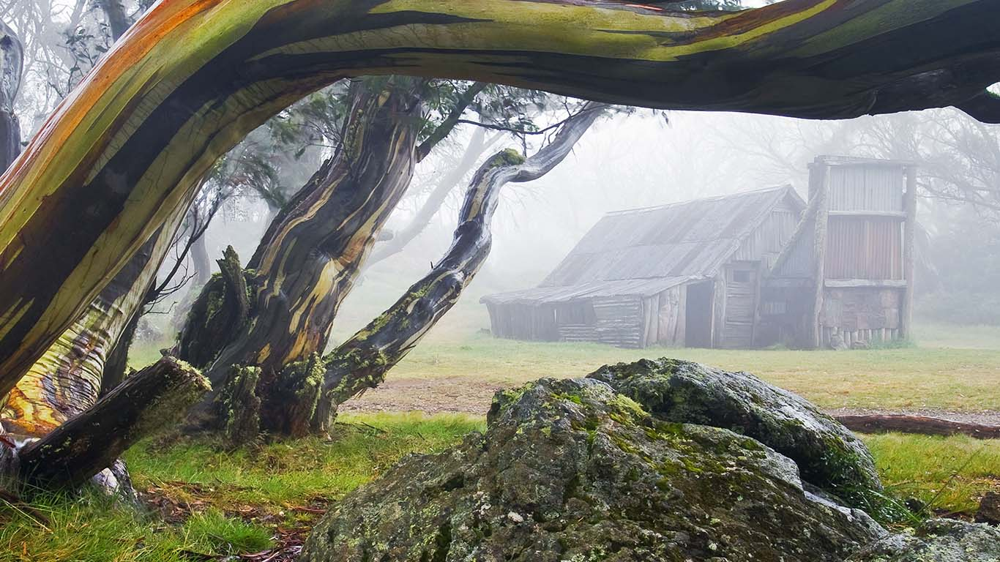

#### 20170415 Japanese white-eye bird in a cherry tree (© Reece Cheng/500px)(Bing Australia)

#### 20170415 A tour of Booth's Amphitheater in Mammoth Cave National Park, Kentucky (© David S. Boyer and Arlan R. Wiker/Getty Images)(Bing United States)

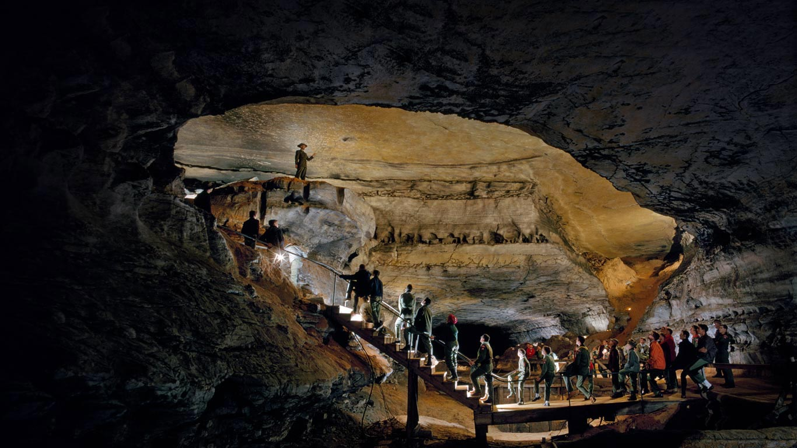

#### 20170415 The pipe organ of the Notre Dame Basilica in Montreal (© Terrance Klassen/Alamy Stock Photo)(Bing Canada)

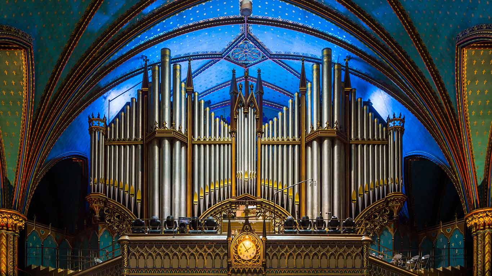

#### 20170414 Titanic Belfast, a maritime museum in Belfast, Northern Ireland (© Allan Baxter/Gallery Stock)(Bing United Kingdom)

#### 20170414 Village de Rocamadour au coucher du soleil, Lot, Occitanie (© Iñigo Fdz de Pinedo/Getty Images)(Bing France)

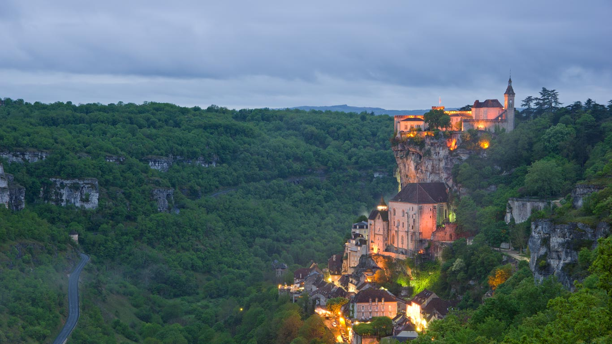

#### 20170413 Monument Valley in Arizona and Utah (© Ronnybas/Shutterstock)(Bing United Kingdom)

#### 20170413 Panoramic view of the waterfront in Lunenburg, Nova Scotia (© Mlenny/Getty Images)(Bing Canada)

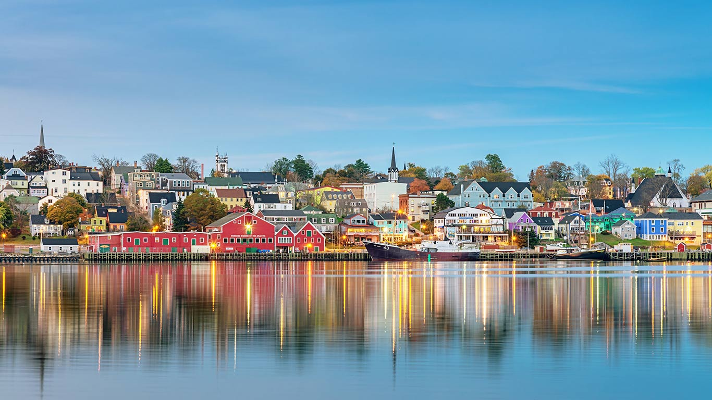

#### 20170412 Astronaut Terry Virts takes a selfie in space (© NASA)(Bing United Kingdom)

#### 20170412 ｢寺院と桜吹雪｣大阪, 堺市 (© Aflo Relax/Masterfile)(Bing Japan)

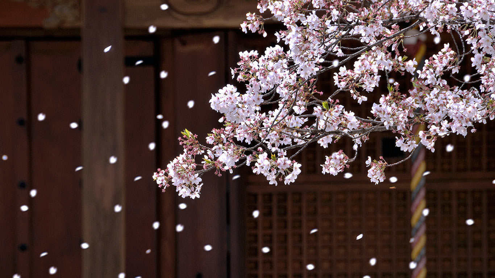

#### 20170412 Das Frankfurter Rathaus („Römer“) spiegelt sich in einer Seifenblase, Frankfurt am Main, Hessen, Deutschland (© EPA/Frank Rumpenhorst/Alamy)(Bing Deutschland)

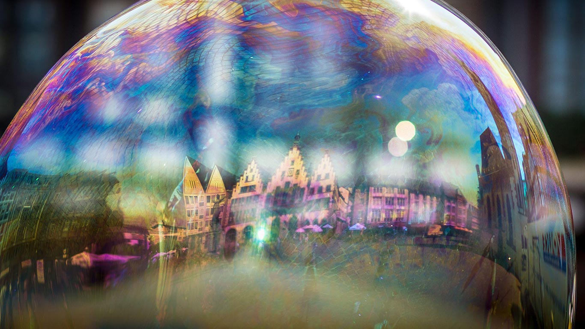

#### 20170411 Organ pipes in St Giles' Church, Wrexham, Wales (© David Pimborough/Alamy)(Bing United Kingdom)

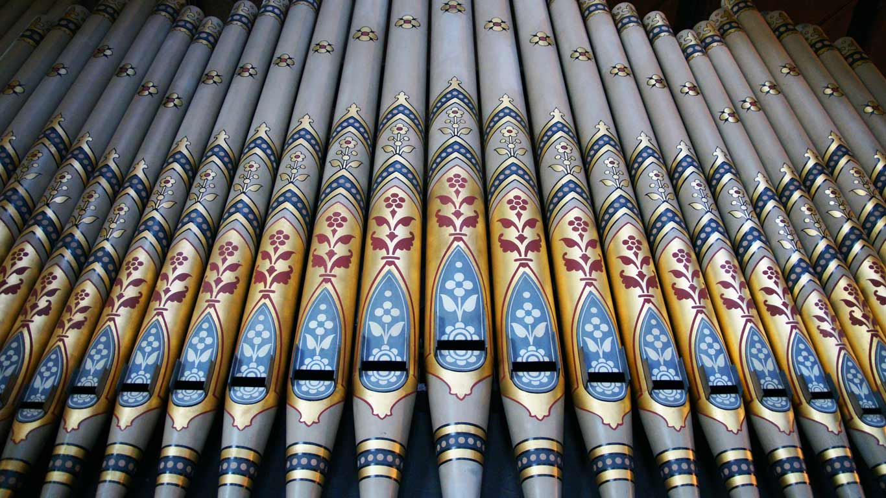

#### 20170411 Storm clouds above Menindee Lakes, New South Wales, Australia (© Julie Fletcher/Getty Images)(Bing Australia)

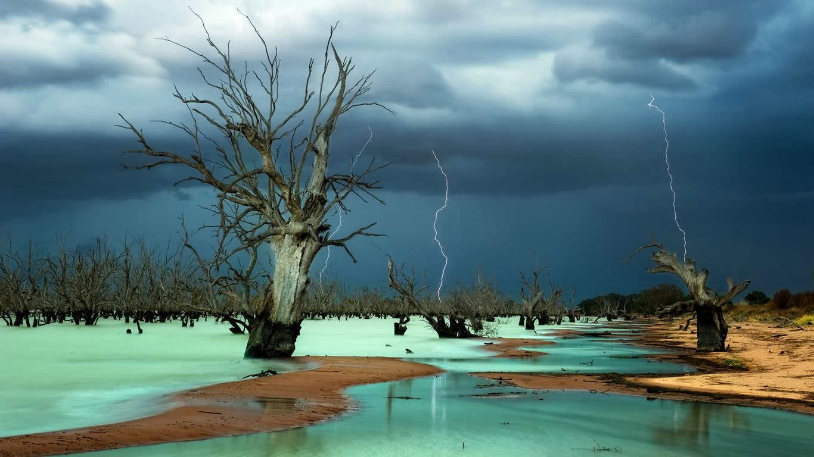

#### 20170410 Arctic fox kits on Wrangel Island, Russia (© Owen Newman/Getty Images)(Bing United Kingdom)

#### 20170409 Stawa Młyny beacon in Świnoujście, Poland (© Maciej Bledowski/Alamy)(Bing United Kingdom)

#### 20170409 Tulip fields in bloom at Mount Vernon, Washington (© Pete Saloutos/plainpicture)(Bing United States)

#### 20170408 On the Slovenian side of the Julian Alps (© Nino Marcutti/Alamy)(Bing United Kingdom)

#### 20170407 Frühsportler auf einem Steg am Starnberger See, Bayern, Deutschland (© magann/iStock/Getty Images Plus)(Bing Deutschland)

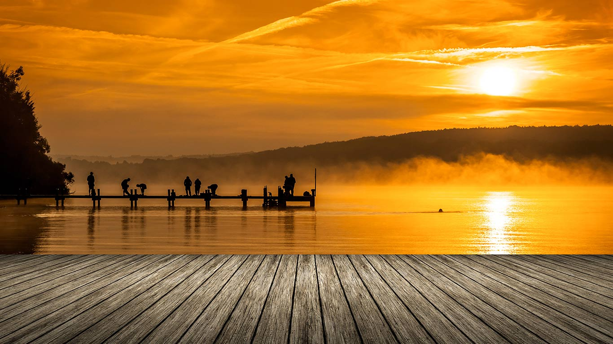

#### 20170407 Kuha Karuhas pavilion in Phraya Nakhon Cave, Thailand (© Bule Sky Studio/Shutterstock)(Bing United Kingdom)

#### 20170407 Rat des moissons niché dans des roseaux communs, France (© Klein and Hubert/Minden Pictures)(Bing France)

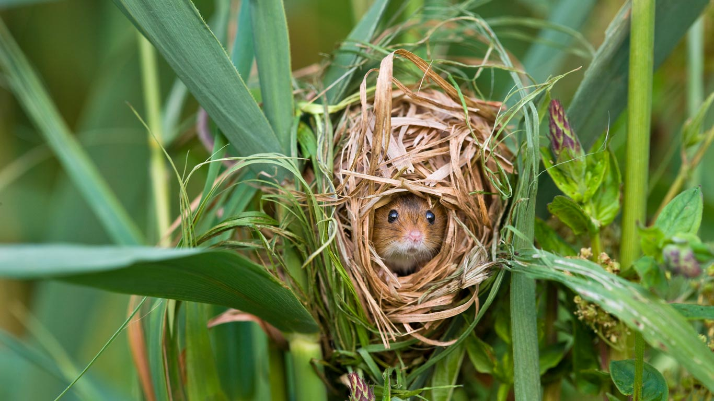

#### 20170406 Fresh water and salt water mix at the Ter River estuary near L'Estartit, Spain (© Yann Arthus-Bertrand/Getty Images)(Bing United Kingdom)

#### 20170406 Common spotted cuscus (© Mitsuyoshi Tatematsu/Nature Production/Minden Pictures)(Bing Australia)

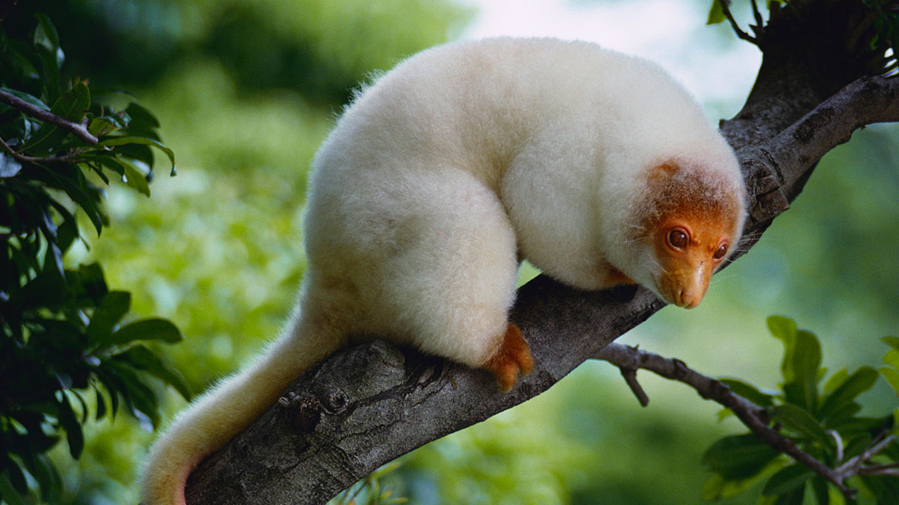

#### 20170405 黄山，中国安徽省 (© BJI/Blue Jean Images/Getty Images)(Bing China)

#### 20170405 The Old Man of Storr on the Isle of Skye, Scotland (© SIME/eStock Photo)(Bing United Kingdom)

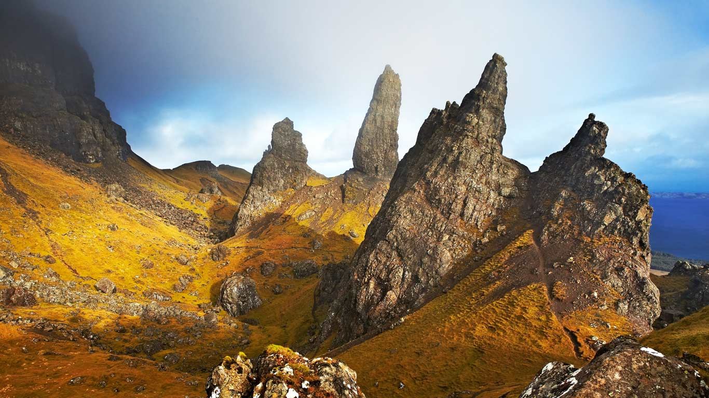

#### 20170405 The Feature Staircase in the Macodrum Library, Ottawa (© View Pictures/REX/Shutterstock)(Bing Canada)

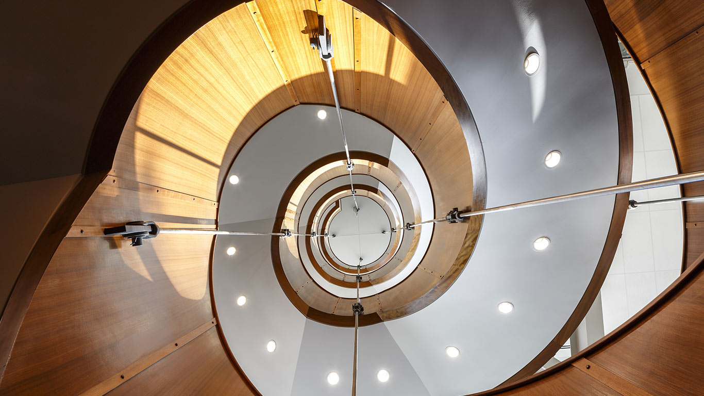

#### 20170404 African jacana chick in Chobe National Park, Botswana (© Brendon Cremer/Minden Pictures)(Bing United Kingdom)

#### 20170403 The diving gondola on Sellin Pier, Germany (© Huber/Sime/eStock Photo)(Bing United Kingdom)

#### 20170402 Ice in a lava tube at Lava Beds National Monument, California (© Floris van Breugel/Minden Pictures)(Bing United Kingdom)

#### 20170401 A meerkat in its natural environment (© pzAxe/Shutterstock)(Bing United Kingdom)

