#### 20170531 端午节香袋 (© Chao-Yang Chan/Alamy Stock Photo )(Bing China)

#### 20170531 Temple Street Night Market in Yau Ma Tei, Hong Kong (© Peter Stewart/500px)(Bing United Kingdom)

#### 20170530 Greater flamingos in Walvis Bay, Namibia (© Yva Momatiuk and John Eastcott/Minden Pictures)(Bing United Kingdom)

#### 20170529 Tawny owl juveniles perched on a tree in Hessen, Germany (© Ottfried Schreiter/Alamy)(Bing Australia)

#### 20170529 Puente de Matadero with mural by artist Daniel Canogar in Madrid, Spain (© Luis Davilla/age fotostock)(Bing United Kingdom)

#### 20170529 Vue générale sur la 69e édition du Festival de Cannes, le 21 mai 2016 (© Denis Makarenko/Shutterstock)(Bing France)

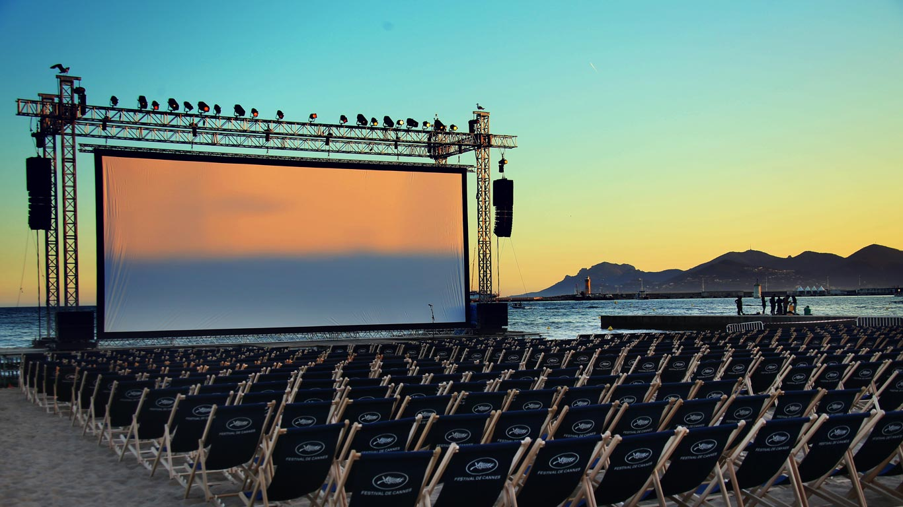

#### 20170529 Polar bear (Nanook) playing in fireweed (© Dennis Fast/VWPics/Alamy Stock Photo)(Bing Canada)

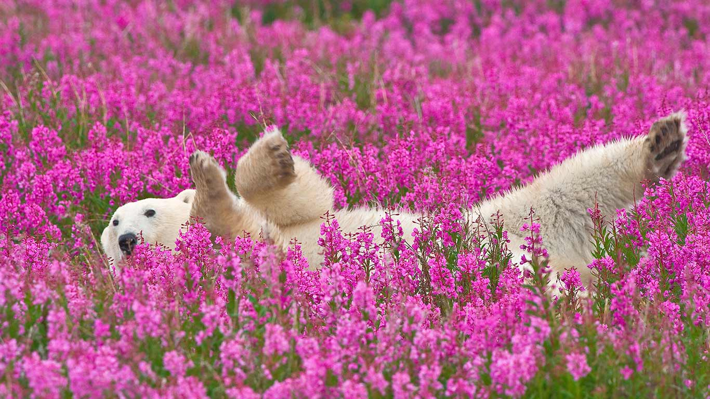

#### 20170529 Arlington National Cemetery in Virginia (© Hoberman/age fotostock)(Bing United States)

#### 20170528 Smouldering Mount Bromo in East Java, Indonesia (© Shutterstock)(Bing United Kingdom)

#### 20170527 ｢東大寺大仏殿と鏡池｣奈良 (© Filip Fuxa/Shutterstock/Filip Fuxa/Shutterstock/Shutterstock)(Bing Japan)

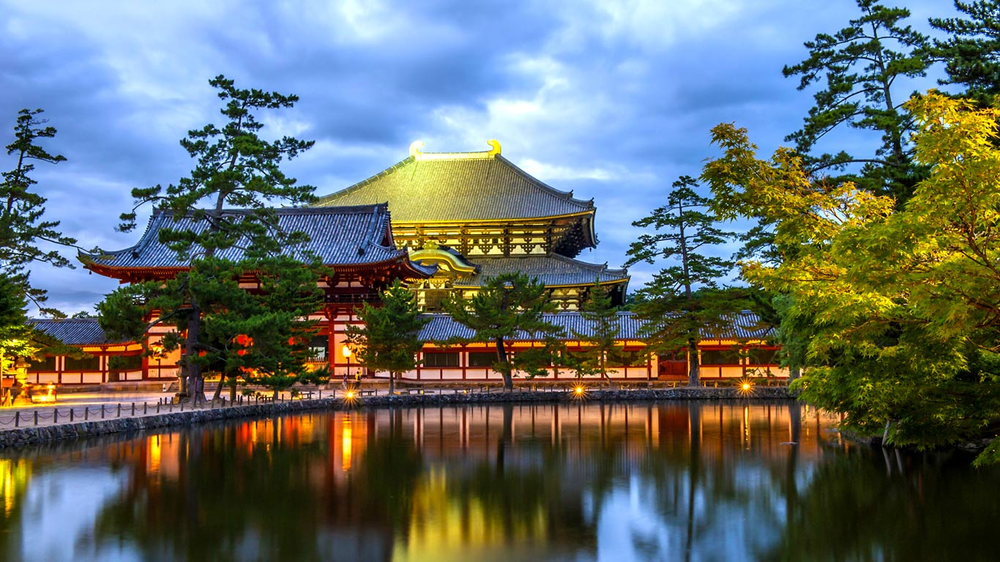

#### 20170527 The Hive in the Royal Botanic Gardens at Kew, south-west London (© David Reed/Alamy)(Bing United Kingdom)

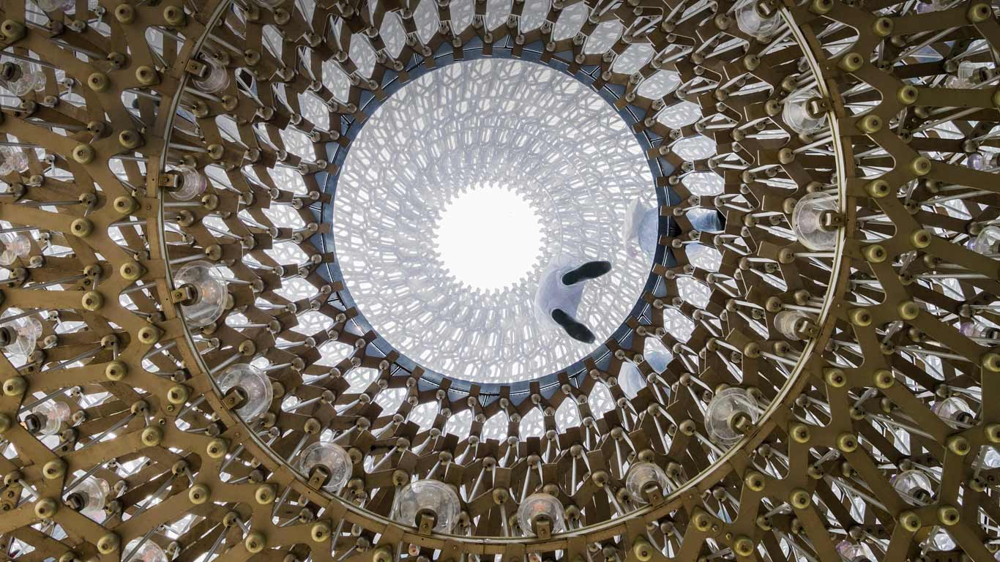

#### 20170527 Mural of Papunya Tula artist Michael Nelson Tjakamarra’s ‘Possum and Wallaby Dreaming’ at Parliament House, Canberra (© John Gollings/Arcaid/plainpicture)(Bing Australia)

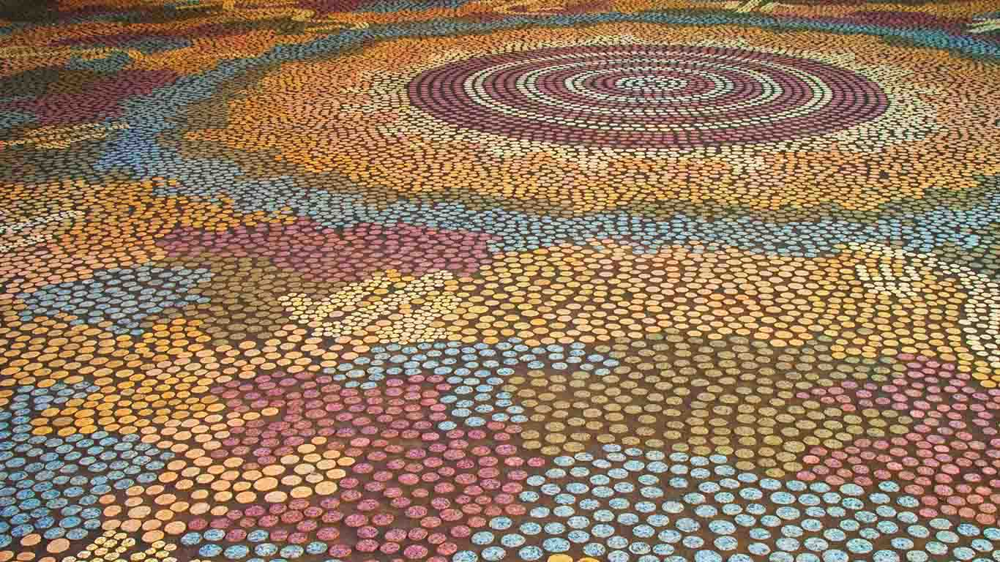

#### 20170526 The Pyramids of Meroë in Sudan (© Andrew McConnell/Alamy)(Bing United Kingdom)

#### 20170526 Fern fiddleheads at Valley Falls Park in Vernon, Connecticut (© Holcy/Getty Images)(Bing United States)

#### 20170525 Morgendämmerung in der Wahner Heide nahe Troisdorf, Nordrhein-Westfalen, Deutschland (© Frank Lukasseck/4Corners)(Bing Deutschland)

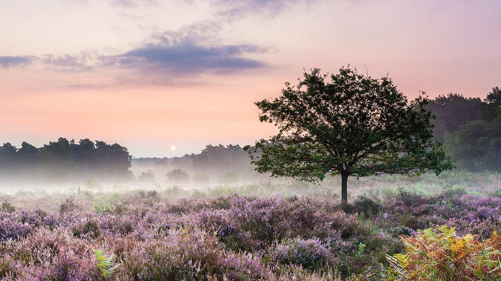

#### 20170525 Fête de la transhumance en Lozère, Occitanie (© Patrick Forget/Alamy Stock Photo)(Bing France)

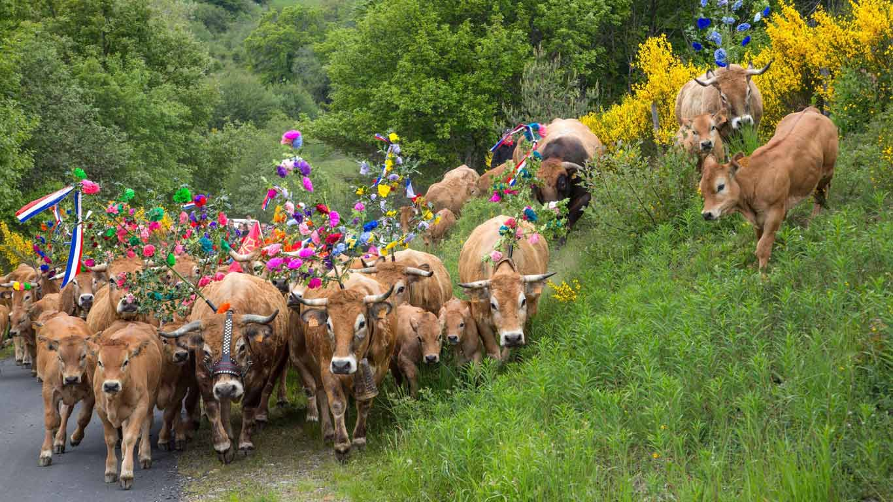

#### 20170525 Budawang Range in Morton National Park, New South Wales (© Kerry Whitworth/Alamy)(Bing Australia)

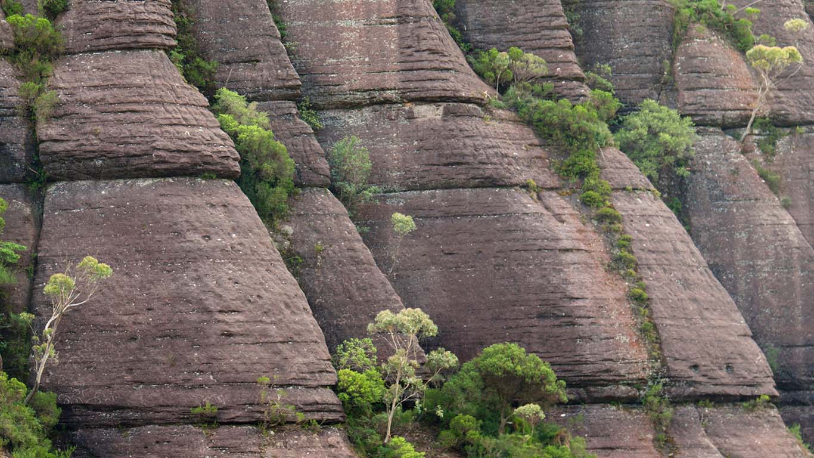

#### 20170525 The Brooklyn Bridge, New York (© Inge Johnsson/age fotostock)(Bing United Kingdom)

#### 20170524 Memorial candles (© Mauritius/SuperStock)(Bing United Kingdom)

#### 20170523 White-throated dipper at Tufa dam on the River Lathkill in Derbyshire (© Ben Hall/Minden Pictures)(Bing United Kingdom)

#### 20170522 浙江大学 (© Liao Yuhan)(Bing China)

#### 20170522 Thunderstorms over Lake Powell, Arizona (© Babak Tafreshi/Getty Images)(Bing United Kingdom)

#### 20170521 Burchell's zebra stallion chasing rival in Rietvlei Nature Reserve, South Africa (© Richard Du Toit/Minden Pictures)(Bing United Kingdom)

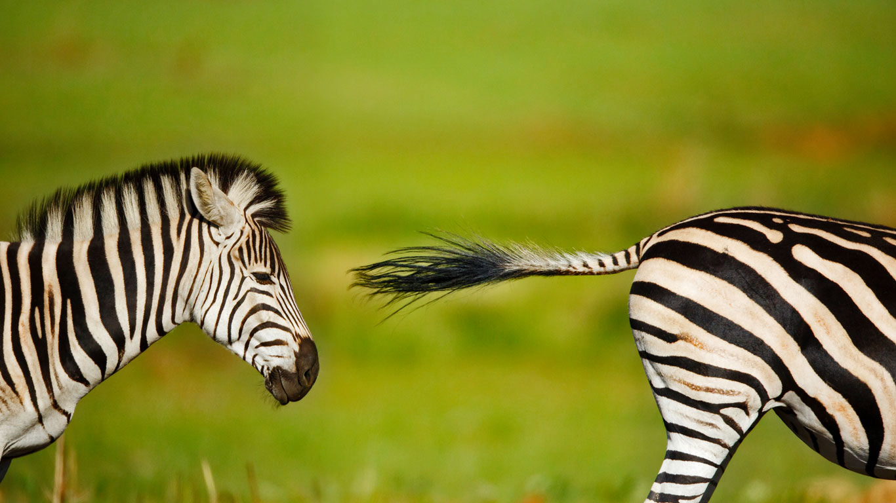

#### 20170521 Grande galerie de l’Évolution, Muséum national d’histoire naturelle à Paris (© Joel Saget/AFP/Getty Images)(Bing France)

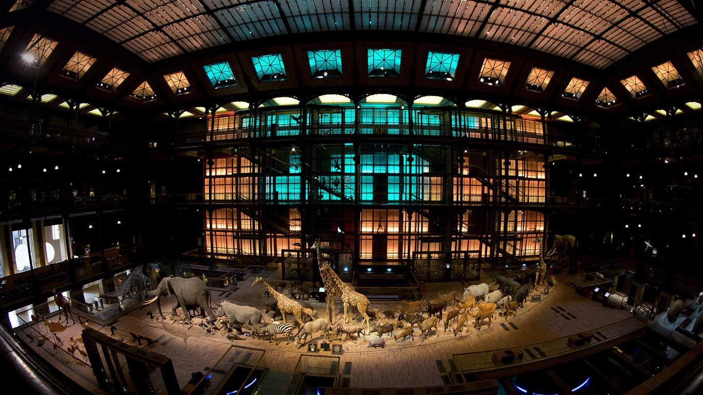

#### 20170520 View of Toronto skyline taken from CN Tower, Toronto (© robertharding/Alamy Stock Photo)(Bing Canada)

#### 20170520 US Air Force Thunderbirds at an airshow in Smyrna, Tennessee (© Jim Zuckerman/Alamy)(Bing United States)

#### 20170520 Kibble Palace at Glasgow Botanic Gardens, Scotland (© Allan Baxter/Gallery Stock)(Bing United Kingdom)

#### 20170519 Salcombe Harbour and Kingsbridge Estuary in the South Hams district of Devon (© James Osmond/Getty Images)(Bing United Kingdom)

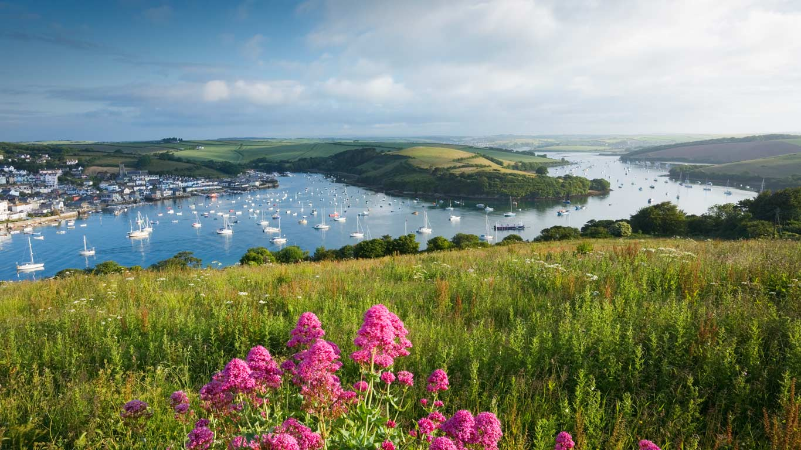

#### 20170519 Spring Tulip Festival in Ottawa (© Roger de Montfort/Shutterstock)(Bing Canada)

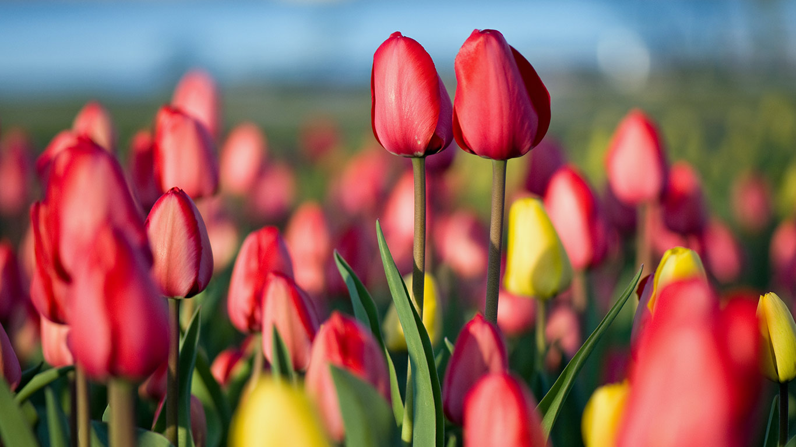

#### 20170519 Corny Point Lighthouse on Yorke Peninsula, South Australia (© Ben Goode/Tandem Stills + Motion)(Bing Australia)

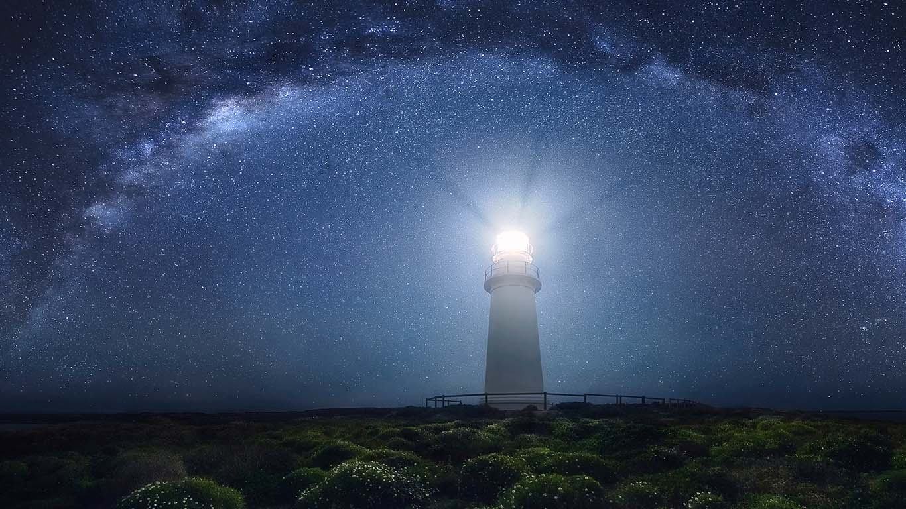

#### 20170519 Cyclist in Trondheim, Norway (© Jonas Froland/plainpicture)(Bing United States)

#### 20170518 Paläon Research and Experience Centre, Schöningen, Germany (© WestEnd61/REX/Shutterstock)(Bing United Kingdom)

#### 20170518 Regenbogenbrücke über die B1, Dortmund, Nordrhein-Westfalen, Deutschland (© imageBROKER/Alamy Stock Photo)(Bing Deutschland)

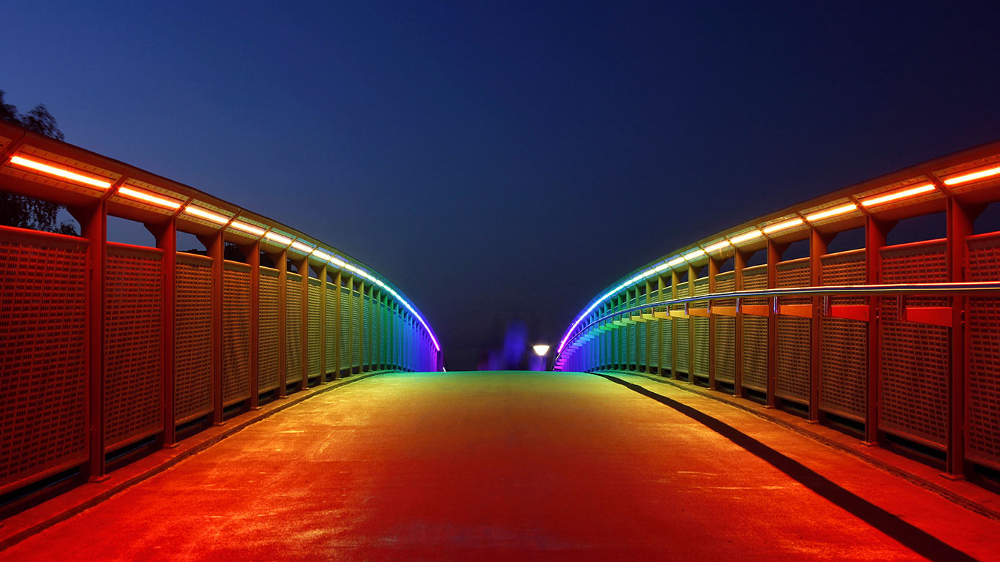

#### 20170517 Uinta ground squirrels at Tower Fall Campground in Yellowstone National Park, Wyoming (© Shin Yoshino/Minden Pictures)(Bing United Kingdom)

#### 20170516 Aerial view of salt marsh at Abbotts Hall Farm, Essex (© Terry Whittaker/2020VISION/Minden Pictures)(Bing United Kingdom)

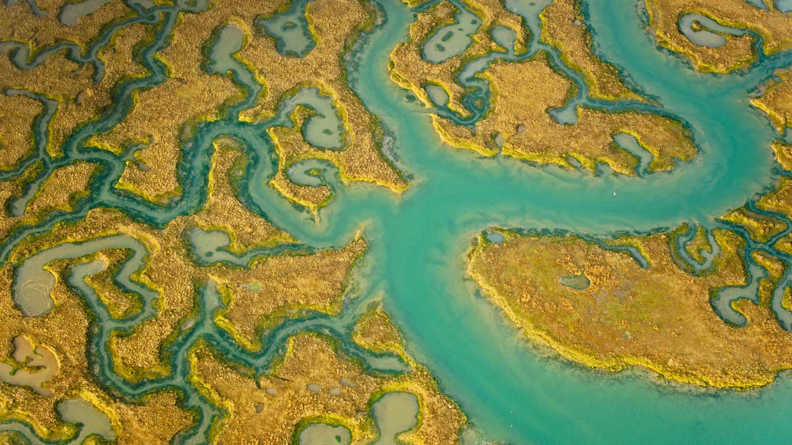

#### 20170516 Porthminster Beach and St. Ives, Cornwall, England (© Adam Burton/Minden Pictures)(Bing United States)

#### 20170515 Incense factory in Xinhui District, Jiangmen, Guangdong Province, China (© Wallace Cheah/500px)(Bing United Kingdom)

#### 20170514 Blue-and-yellow macaws flying over the Amazon, Brazil (© Nicky van Veenendaal/500px)(Bing United Kingdom)

#### 20170514 Cheetah mother and her week-old cub, Maasai Mara National Reserve, Kenya (© Suzi Eszterhas/Minden Pictures)(Bing United States)

#### 20170513 The fortifications of Kotor, Montenegro (© Slavica Stajić/500px)(Bing United Kingdom)

#### 20170513 Sandhill cranes over barley fields near the Alaska Range, Delta Junction, Alaska (© Yva Momatiuk and John Eastcott/Minden Pictures)(Bing United States)

#### 20170512 Vernal Fall at Yosemite National Park, California (© Framepool)(Bing United Kingdom)

#### 20170511 A mountain goat in Glacier National Park, Montana (© Sumio Harada/Minden Pictures)(Bing United Kingdom)

#### 20170511 Lacets de Montvernier en Savoie, Auvergne-Rhône-Alpes (© Olha Rohulya/500px)(Bing France)

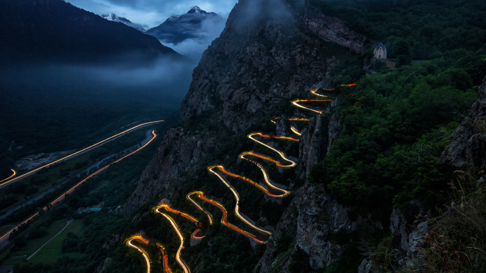

#### 20170510 Ward Charcoal Ovens State Historic Park in Nevada (© Royce's Nightscapes/500px)(Bing United Kingdom)

#### 20170509 A female wood duck and ducklings in Arapahoe County, Colorado (© Robert Harding/Alamy)(Bing United States)

#### 20170509 Stair-step Moss (Hylocomium Splendens) illuminated by sunlight in a damp forest (© Christopher Kimmel/Aurora Photos)(Bing Canada)

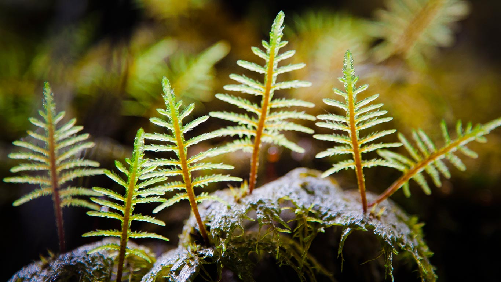

#### 20170509 Cat Bells fell above Derwentwater in the Lake District, Cumbria (© Adam Burton/Getty Images)(Bing United Kingdom)

#### 20170508 Guoliang Tunnel in the Taihang Mountains in Henan Province, China (© View Stock/Offset)(Bing United Kingdom)

#### 20170508 Traveufer in Lübeck, Schleswig-Holstein, Deutschland (© Radius Images/Alamy Stock Photo)(Bing Deutschland)

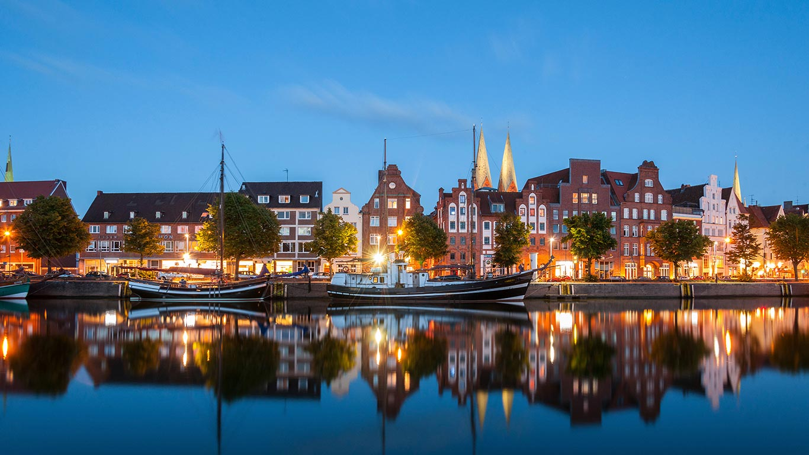

#### 20170508 Remnants of buildings in forest, Fleurieu Peninsula, South Australia (© Scott Olver/500px)(Bing Australia)

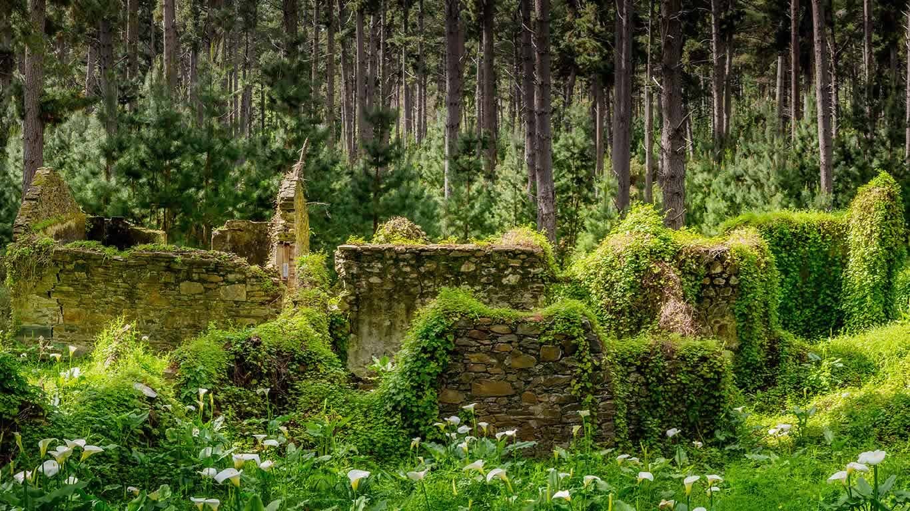

#### 20170507 Greyface moray eels in the Andaman Sea (© Reinhard Dirscherl/Aurora Photos)(Bing United Kingdom)

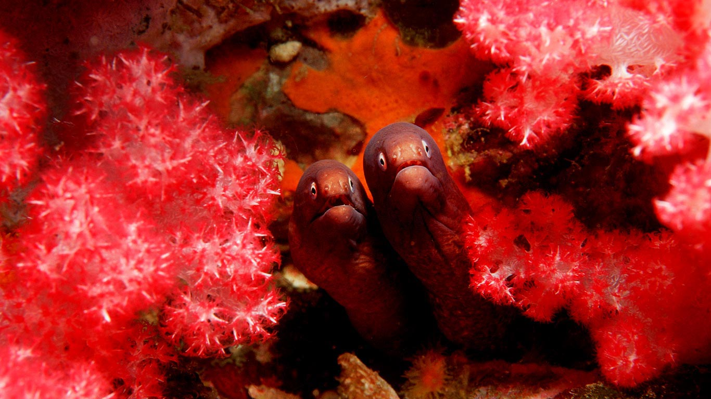

#### 20170506 【今日立夏】武侯祠内的红墙绿竹林，中国成都 (© Eastimages/Getty Images)(Bing China)

#### 20170506 The path to Morskie Oko, Tatra National Park, Poland (© Blake Parker/Tandem Still + Motion)(Bing United Kingdom)

#### 20170506 ｢こいのぼりの金引き｣埼玉, 加須市 (© TOSHIFUMI KITAMURA/AFP/Getty)(Bing Japan)

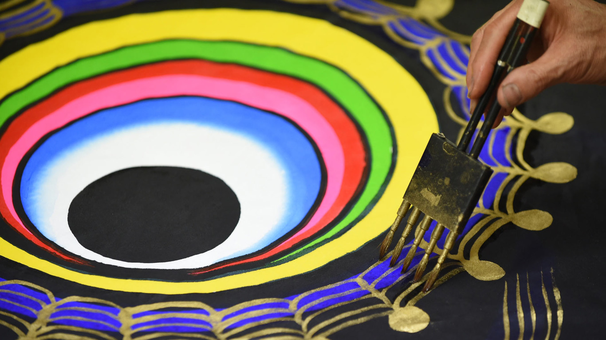

#### 20170506 Biene im Anflug auf die Blüten einer Riesen-Steppenkerze, Bayreuth, Bayern, Deutschland (© Rüdiger Hess/geo-select FotoArt)(Bing Deutschland)

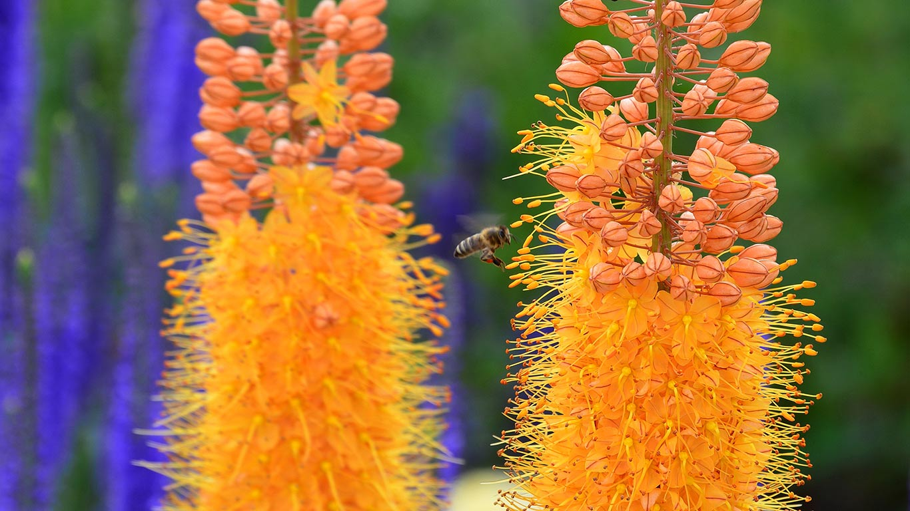

#### 20170505 Henequen agave, Yucatán Peninsula, Mexico (© Brian Overcast/Alamy)(Bing United States)

#### 20170505 Beaumaris Castle on the Isle of Anglesey in Wales (© funkyfood London - Paul Williams/Alamy)(Bing United Kingdom)

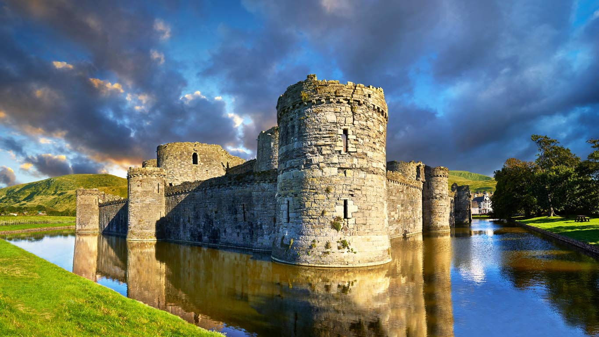

#### 20170504 Close-up of the nose of Space Shuttle Atlantis on exhibit at Kennedy Space Centre, Florida (© Matthew Kuhns/Tandem Stills + Motion)(Bing United Kingdom)

#### 20170504 ｢国会議事堂内部｣東京, 永田町 (© Hiroshi Watanabe/Hiroshi Watanabe/Getty Images)(Bing Japan)

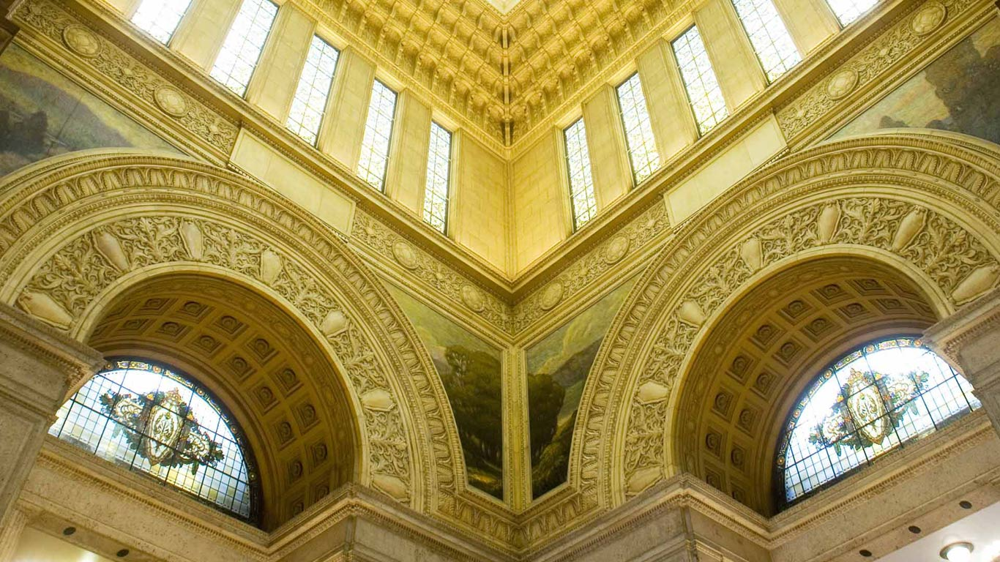

#### 20170503 Shipwrecks at Moreton Island, Queensland (© Warren Chan/Shutterstock)(Bing Australia)

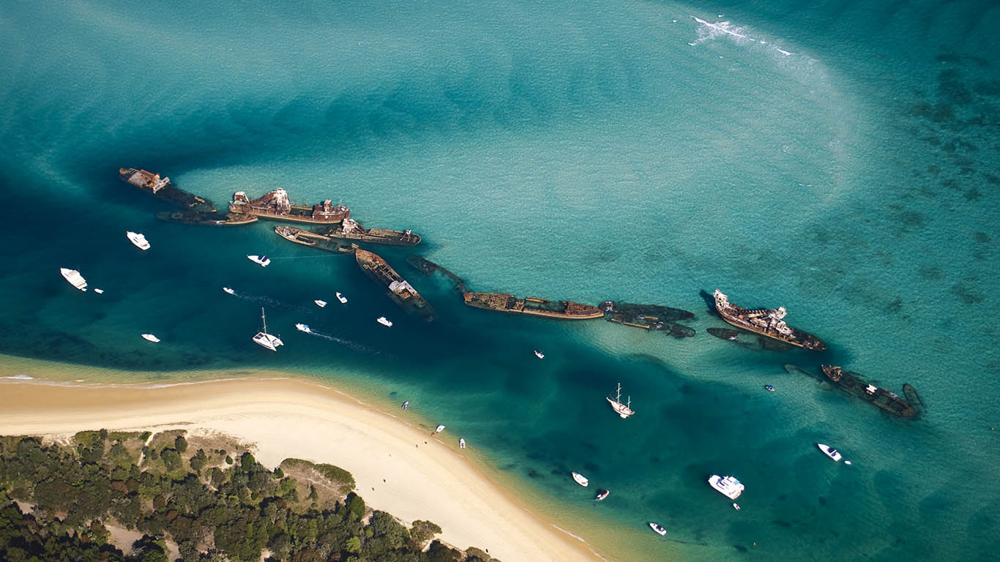

#### 20170503 Navagio Beach at Zakynthos, Greece (© Maciej Tomków/Nimia)(Bing United Kingdom)

#### 20170502 Métier à tisser la laine à Oloron-Sainte-Marie, Pyrénées-Atlantiques (© Richard Wadey/Alamy Stock Photo)(Bing France)

#### 20170502 Cleaning the elephant models at the Natural History Museum of Los Angeles County, California (© Brian Doben/Gallery Stock)(Bing United Kingdom)

#### 20170501 Palacio de Bellas Artes in Mexico City (© Torresigner/Getty Images)(Bing United Kingdom)

