#### 20170630 Ranwu Lake near Rawu, Tibet Autonomous Region, China (© Yuanping/iStock/Getty Images Plus)(Bing United Kingdom)

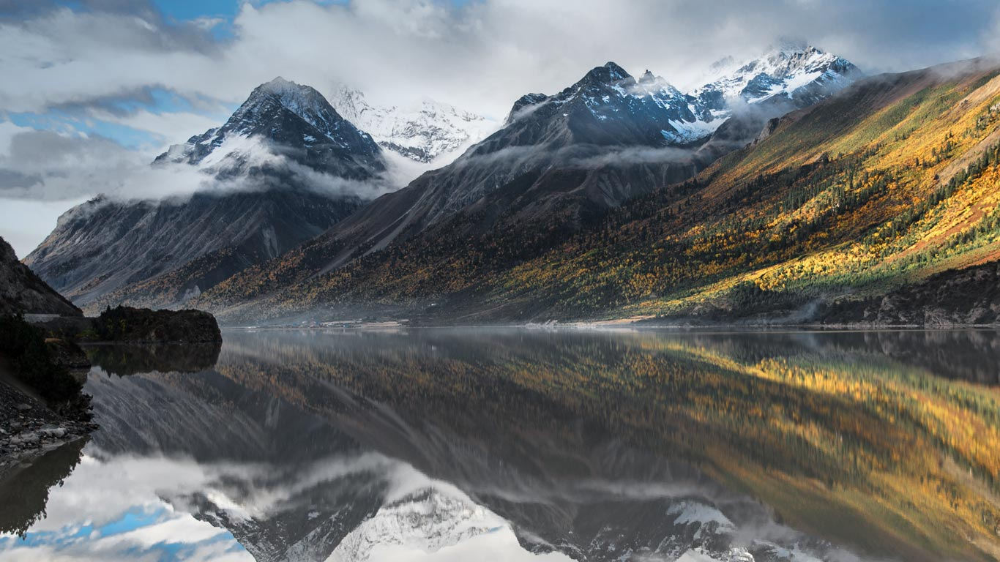

#### 20170629 A boardwalk in Norddorf on Amrum Island, Germany (© Raimund Linke/Getty Images)(Bing United Kingdom)

#### 20170628 Chevreuil mâle dans un champ de blé, Haute-Normandie (© Cedric Jacquet/Minden Pictures)(Bing France)

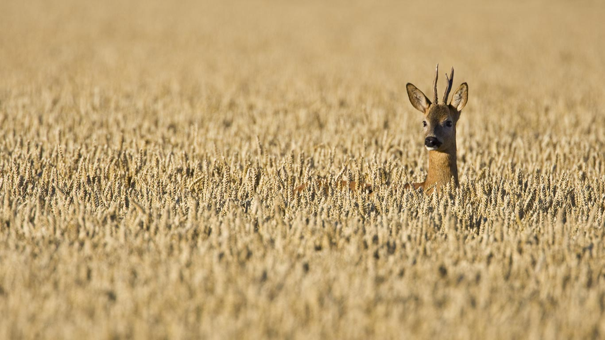

#### 20170628 Joshua trees in Death Valley, California (© Marc Adamus/Aurora Photos)(Bing United Kingdom)

#### 20170628 Bienenkörbe in einem Bienenstand, Lüneburger Heide, Niedersachsen, Deutschland (© Arterra/Getty Images)(Bing Deutschland)

#### 20170627 The Callanish Stones on the Isle of Lewis, Scotland (© Tomas Vrba and Lindsey Parkinson/500px)(Bing United Kingdom)

#### 20170626 Ring-tailed lemurs in the Berenty Reserve of Madagascar (© Steve Bloom Images/Alamy)(Bing United Kingdom)

#### 20170625 ｢喜屋武岬｣沖縄, 糸満市 (© 2346056/Shutterstock)(Bing Japan)

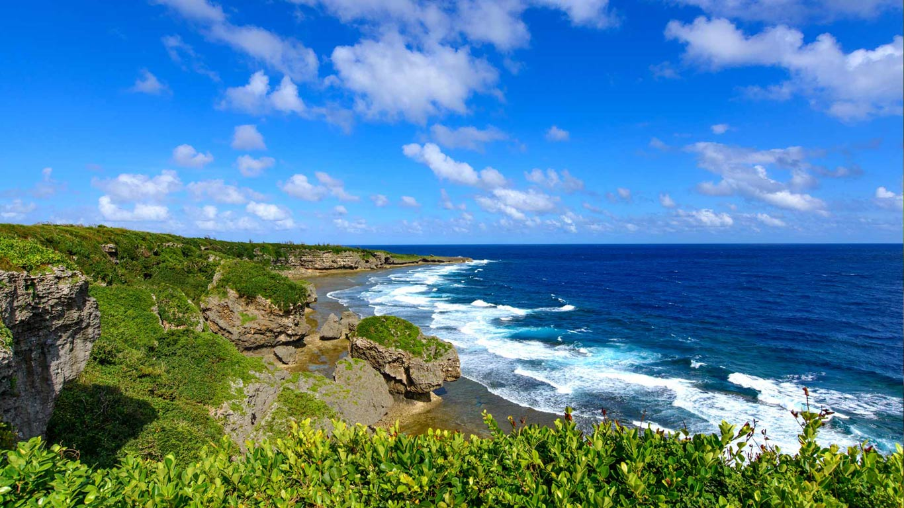

#### 20170625 Rotonda di San Lorenzo in Mantua, Italy (© geo-select FotoArt)(Bing United Kingdom)

#### 20170624 Swimmers competing in the 2016 Ironman World Championship triathlon in Kailua-Kona, Hawaii (© Tom Pennington/Getty Images)(Bing United Kingdom)

#### 20170623 Mooney Falls in Havasu Canyon, Arizona (© Brendan van Son/Tandem Stills + Motion)(Bing United Kingdom)

#### 20170622 Clavier de l’un des orgues de la cathédrale Notre-Dame de Strasbourg, Alsace (© Andia/UIG/Getty Images)(Bing France)

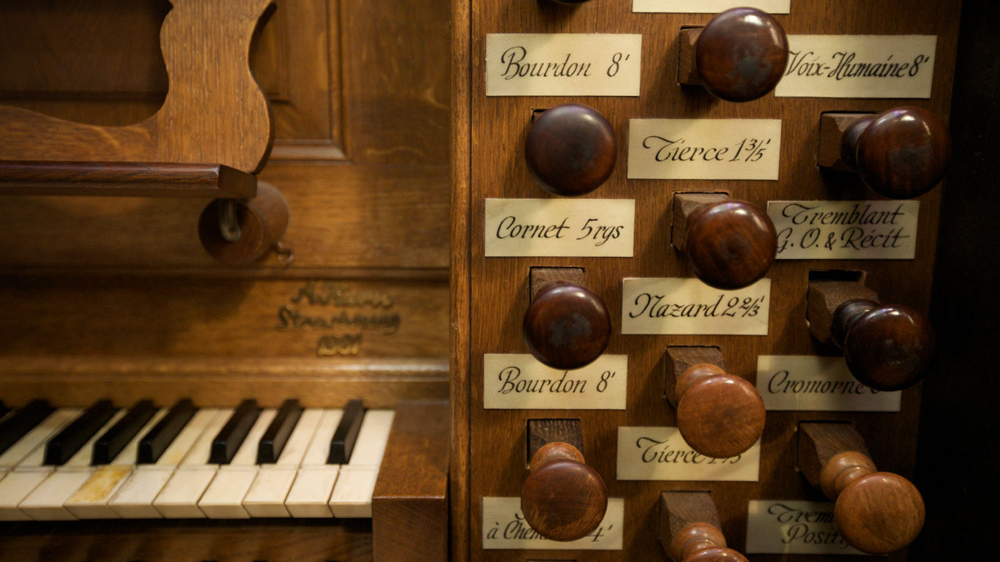

#### 20170622 Red fox in Denali National Park and Preserve, Alaska (© Michael DeYoung/Design Pics/Getty Images)(Bing United Kingdom)

#### 20170621 Skateboarding at Venice Beach, California (© mgs/Moment/Getty Images)(Bing United Kingdom)

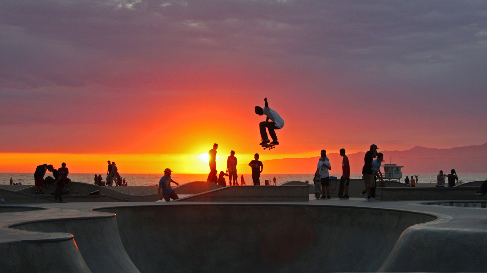

#### 20170620 Playa Roja in Paracas National Reserve, Peru (© Istvan Kadar Photography/Getty Images)(Bing United Kingdom)

#### 20170619 Ankernde Segelboote auf dem Bodensee, Friedrichshafen, Baden-Württemberg, Deutschland (© Holger Spiering/Westend61/Alamy Stock Photo)(Bing Deutschland)

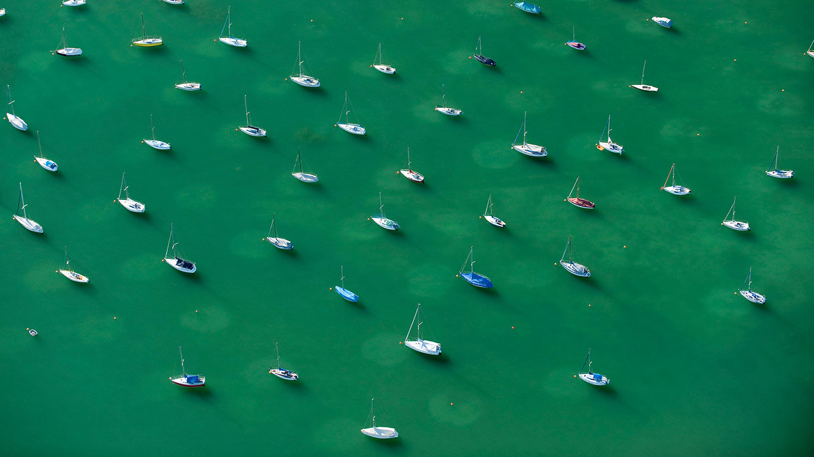

#### 20170619 Aeonium leaf detail (© Tim Gainey/Alamy)(Bing United Kingdom)

#### 20170618 West Caucasian tur father and kid (© John Knight/Getty Images)(Bing United Kingdom)

#### 20170617 Þúfa hill in Reykjavík, Iceland (© Associated Press)(Bing United Kingdom)

#### 20170616 Tour of America's Dairyland racers near Fond du Lac, Wisconsin (© Jeffrey Phelps/Aurora Photos)(Bing United States)

#### 20170616 Dragonfly in a heath forest of East Flanders, Belgium (© Marcel Derweduwen/Shutterstock)(Bing United Kingdom)

#### 20170615 Mingan Archipelago National Park Reserve, Quebec (© plainpicture/Design Pics/Jean Desy)(Bing Canada)

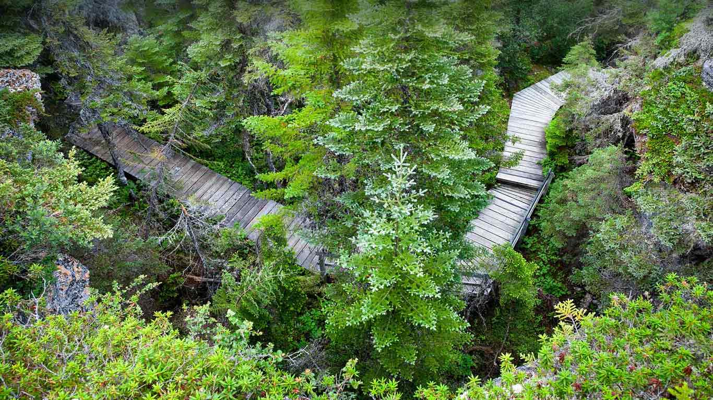

#### 20170615 A fire department ladder truck in Fresno, California (© Universal Images Group/Getty Images)(Bing United States)

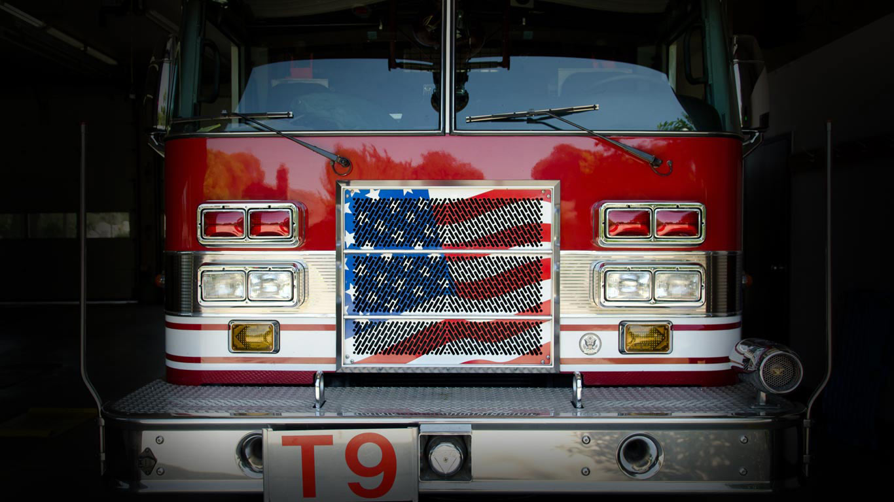

#### 20170615 Crowns engine house in Botallack, Cornwall (© Manfred Gottschalk/Getty Images)(Bing United Kingdom)

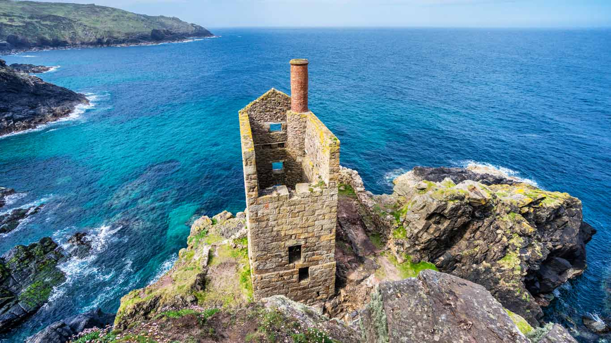

#### 20170614 Meteorite impact crater near Halls Creek, Western Australia (© Randy Olson/National Geographic Creative/Getty Images)(Bing Australia)

#### 20170614 Oscar Niemeyer International Cultural Centre in Avilés, Spain (© Paula Sierra/Getty Images)(Bing United Kingdom)

#### 20170614 Deux oiseaux survolant l’abbaye de Jumièges, Seine-Maritime, Normandie (© Ludovico Verducci/500px)(Bing France)

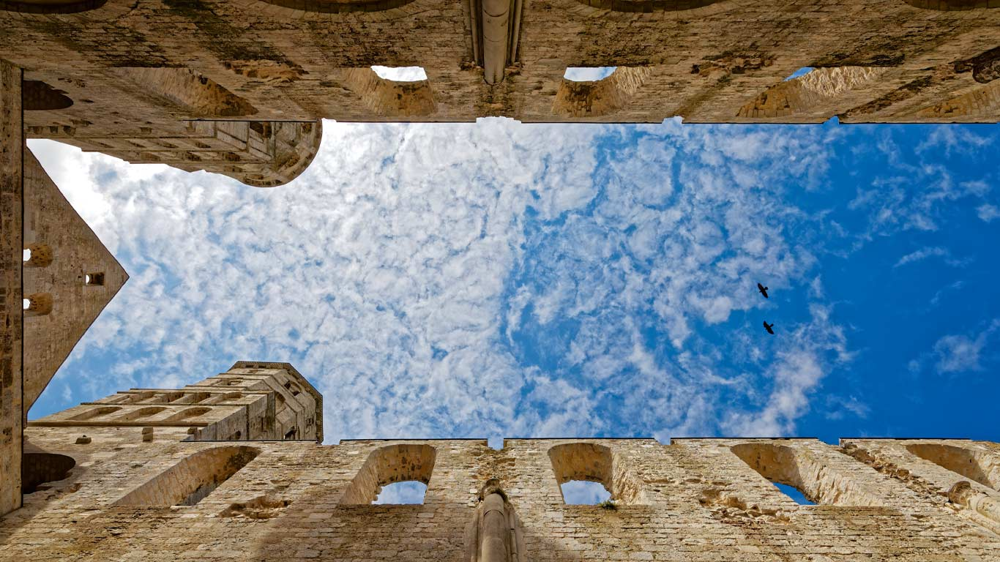

#### 20170613 ｢吉野のあじさい｣奈良, 吉野山 (© NaturePhotograph/NaturePhotograph/Getty Images)(Bing Japan)

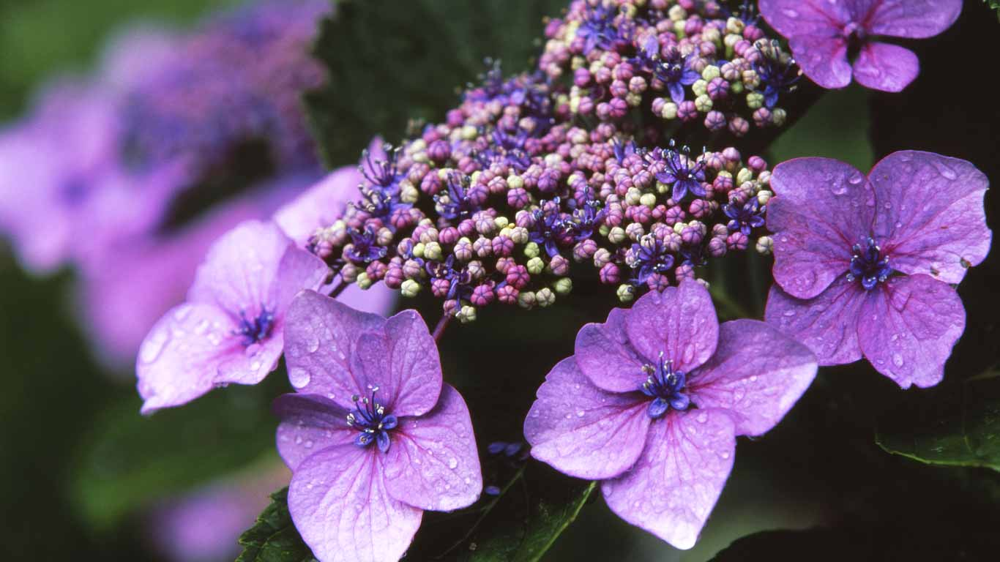

#### 20170613 Reels of cotton at Angels Costumes warehouse in Hendon, north London (© Ben Stansall/Stringer/Getty Images)(Bing United Kingdom)

#### 20170612 Sunset at Dinosaur Provincial Park, Alberta, Canada (© Chris Greenwood/500px)(Bing United Kingdom)

#### 20170611 Pink skunk clownfish and magnificent sea anemone in the Great Barrier Reef, Australia (© Norbert Wu/Minden Pictures)(Bing United Kingdom)

#### 20170610 The Library of Celsus at Ephesus, near Selçuk, Turkey (© Stefano Politi Markovina/Alamy)(Bing United Kingdom)

#### 20170609 Skier with red torch at dusk in Thredbo, New South Wales (© Taras Vyshnya/Shutterstock)(Bing Australia)

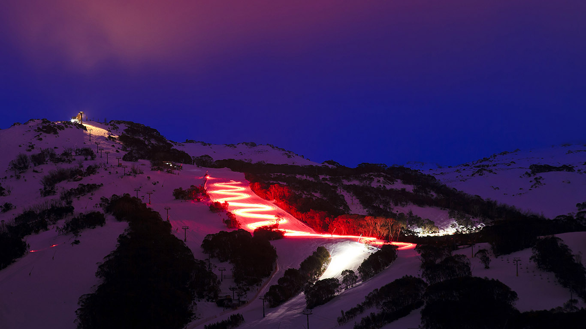

#### 20170609 Mountaineers on the Balmhorn in the Bernese Alps of Switzerland (© Alun Richardson/plainpicture)(Bing United Kingdom)

#### 20170608 文庙内的祈祷牌，中国云南建水 (© Katie Garrod/Getty Images/AWL Images RM)(Bing China)

#### 20170608 Satellite-based graphic showing ocean currents off the Americas (© Karsten Schneider/Science Photo Library)(Bing United Kingdom)

#### 20170607 A gerenuk (© Eric Lowenbach/Getty Images)(Bing United Kingdom)

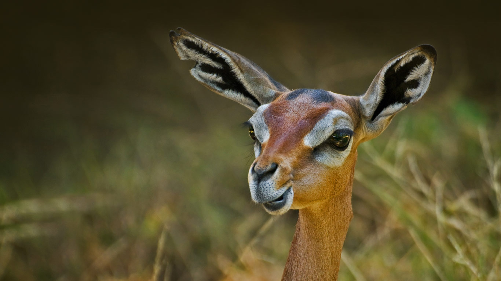

#### 20170607 Memorial at the Juno Beach Centre in Courseulles-sur-Mer, France (© David Jones/Alamy)(Bing United States)

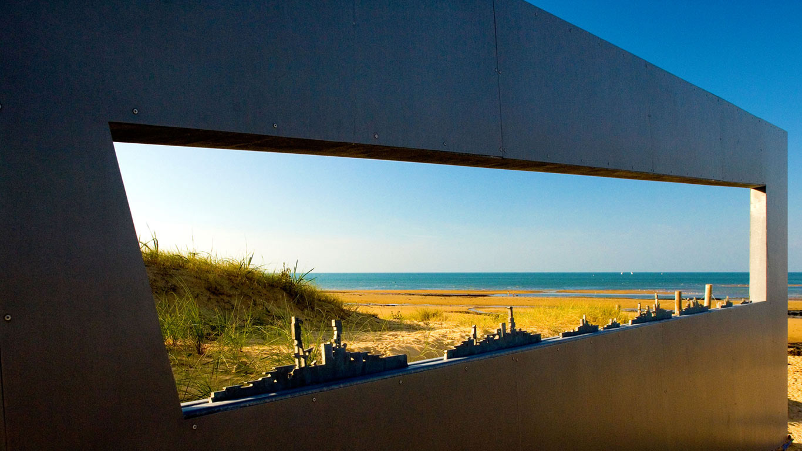

#### 20170607 Paddles painted with family crests stand in the Haida village of Skidegate, B.C. (© Ann Johansson/Corbis via Getty Images)(Bing Canada)

#### 20170606 Reitbrooker Mühle an der Dove Elbe, Hamburg, Deutschland (© Andreas Kreutzer/Getty Images)(Bing Deutschland)

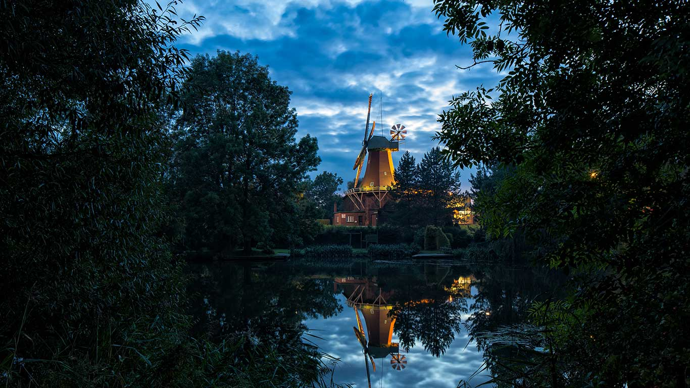

#### 20170606 Étretat in Normandy, France (© Olha Rohulya/500px)(Bing United Kingdom)

#### 20170605 Mooserboden Reservoir and Mooser Dam near Kaprun, Austria (© Shutterstock)(Bing United Kingdom)

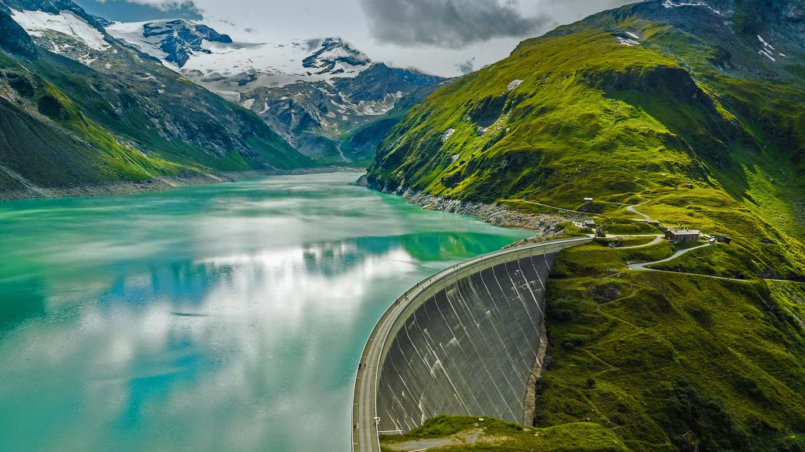

#### 20170604 Bluestriped fangblenny in the Indian Ocean (© Tobias Friedrich/SuperStock)(Bing United Kingdom)

#### 20170603 Bluebonnet wildflowers near Llano, Texas (© dszc/E+/Getty Images)(Bing United Kingdom)

#### 20170603 Looking upward at rainforest in Dorrigo National Park, New South Wales, Australia (© Radius Images/Offset)(Bing Australia)

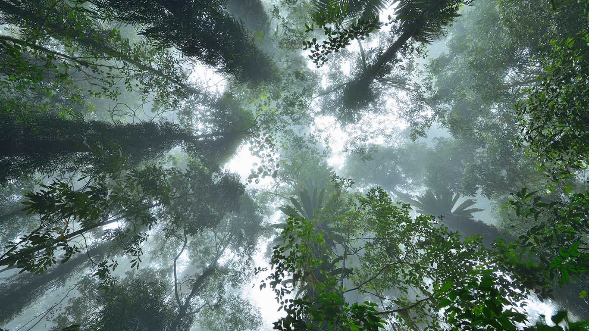

#### 20170602 Ponte Sant'Angelo and St. Peter's Basilica in Rome, Italy (© robertharding/Masterfile)(Bing United Kingdom)

#### 20170602 儿童们正在陈经纶体育学校体育馆内参加游泳训练，中国杭州 (© REUTERS/Aly Song)(Bing China)

#### 20170601 Sunset over Southport Pier, Merseyside (© Mar Photographics/Alamy)(Bing United Kingdom)

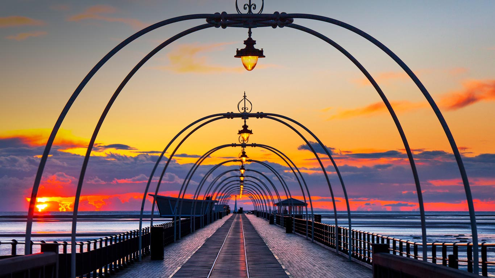

#### 20170601 Fog over Mount Tamalpais State Park, California (© Jonathan Mitchell/Nimia)(Bing United Kingdom)

