#### 20170731 View of Mellieħa, Malta (© Zoltan Gabor/Alamy)(Bing United Kingdom)

#### 20170731 Vue aérienne de kayaks dans un lagon de la côte ouest de l’île de la Réunion (© Sylvain Brajeul/Getty Images)(Bing France)

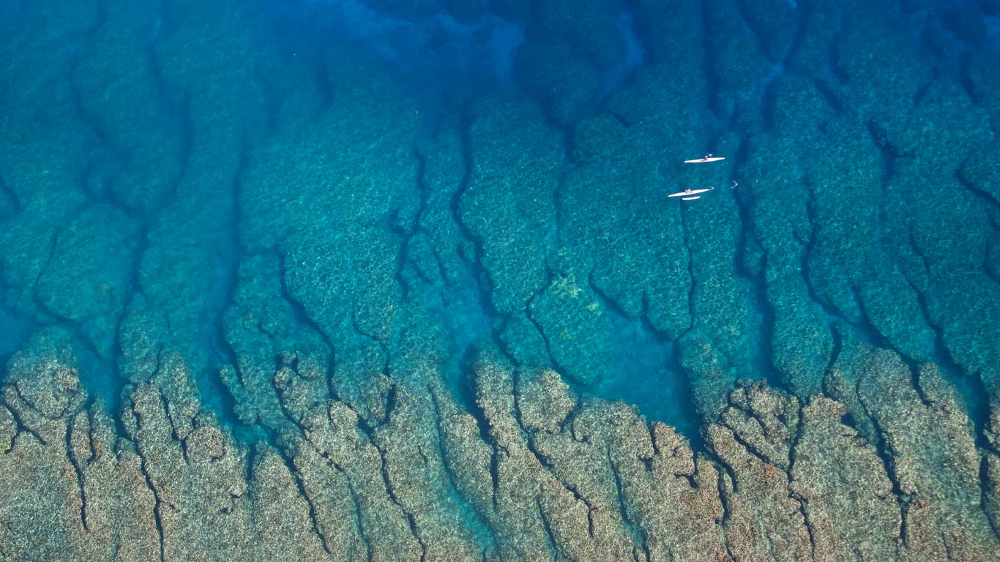

#### 20170730 Pictured Rocks National Lakeshore, Michigan, USA (© Steve Gettle/Minden Pictures)(Bing United Kingdom)

#### 20170729 Aerial view of Washington Square Park, New York City, USA (© New York on Air/Offset)(Bing United Kingdom)

#### 20170729 ｢隅田川花火大会とスカイツリー｣東京 (© Photography by ZhangXun/Getty Images)(Bing Japan)

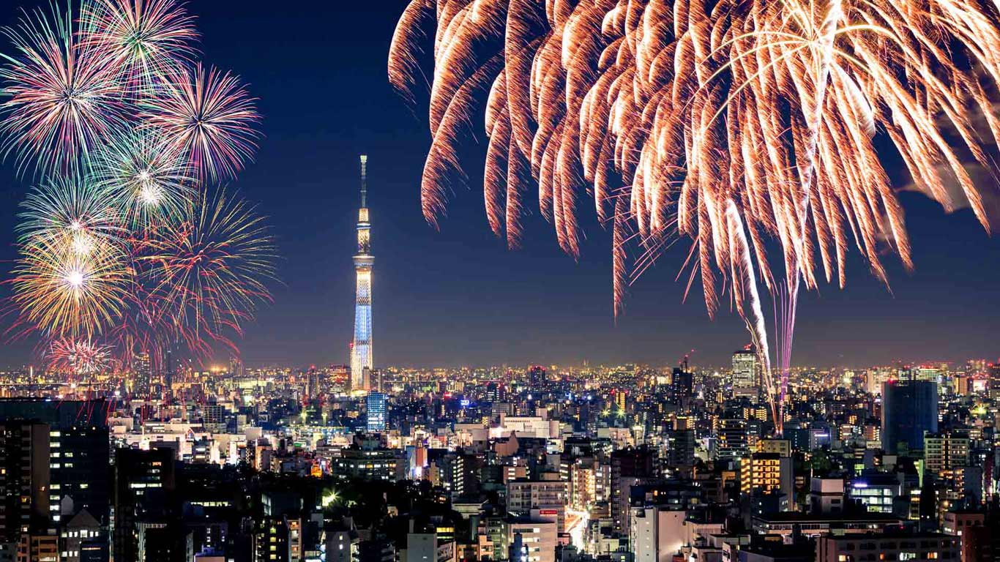

#### 20170728 A waterfall at St Nectan's Glen near Tintagel, Cornwall (© YAY Media AS/Alamy)(Bing United Kingdom)

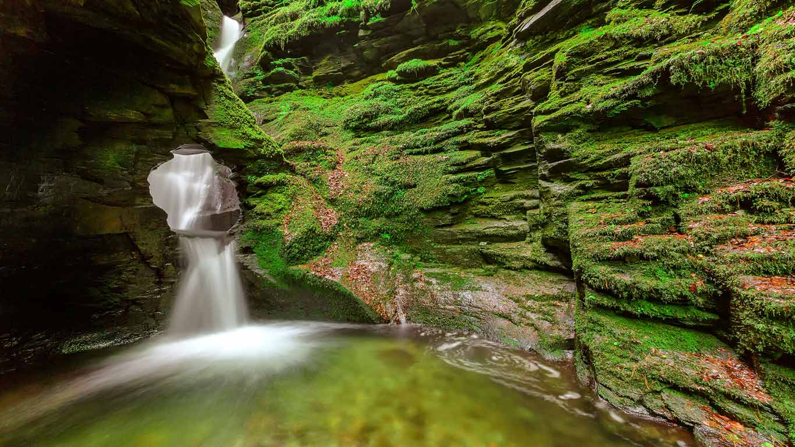

#### 20170727 Turmspitze des Ulmer Münsters von innen, Ulm, Baden-Württemberg, Deutschland (© Walter G. Allgöwer/Age Fotostock)(Bing Deutschland)

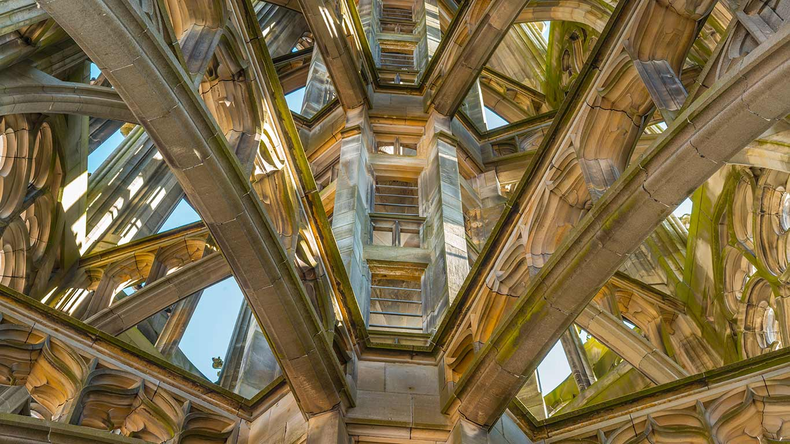

#### 20170727 Scuba diving in Kaş, Turkey (© Charlie Jung/500px)(Bing United States)

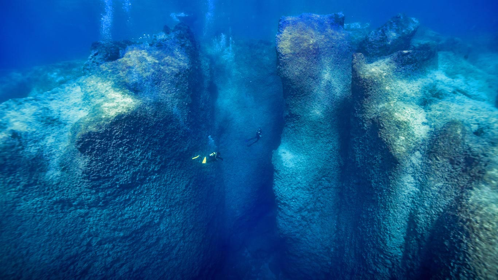

#### 20170727 Chemin menant à la Mer de Glace depuis la montagne, Chamonix. (© ?/Gallery Stock)(Bing France)

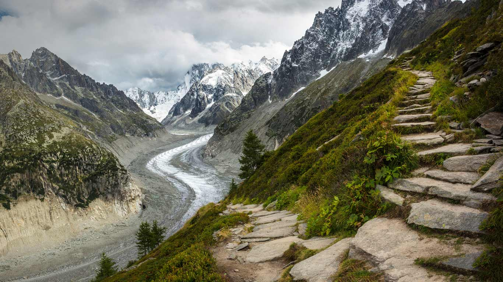

#### 20170727 Huangshan mountains in Anhui province, China (© Oktay Ortakcioglu/Getty Images)(Bing United Kingdom)

#### 20170726 Wilson Peak seen from Alta, a ghost town in Colorado, USA (© Grant Ordelheide/Tandem Stills + Motion)(Bing United Kingdom)

#### 20170725 The view from Reinebringen ridge at the village of Reine on Moskenesøya, Norway (© David Varga/Shutterstock)(Bing United Kingdom)

#### 20170724 Rainbow lorikeets in Werribee, Australia (© Roger Powell/Minden Pictures)(Bing United Kingdom)

#### 20170724 ｢風鈴｣ (© yoshi0511/ShutterStock)(Bing Japan)

#### 20170723 Agricultural fields in the Monegros Desert near Los Monegros, Spain (© Juan Carlos Muñoz/age fotostock)(Bing United Kingdom)

#### 20170722 ‘Monument to Multiculturalism’ outside Union Station, Toronto (© Grant Faint/Getty Images)(Bing Canada)

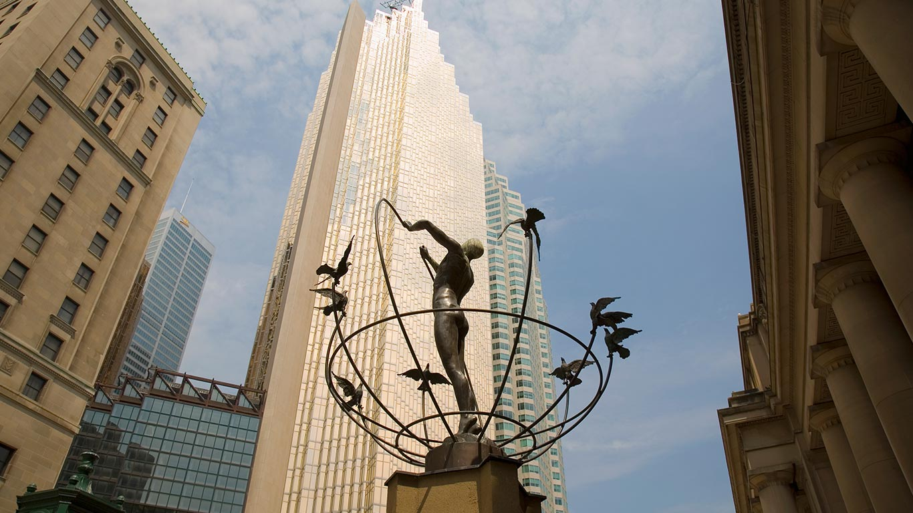

#### 20170722 Hammock camping on the Econlockhatchee River in Florida, USA (© Mac Stone/Tandem Stills + Motion)(Bing United Kingdom)

#### 20170721 Close-up of a fly on flower stamens (© Alberto Ghizzi Panizza/Getty Images)(Bing United Kingdom)

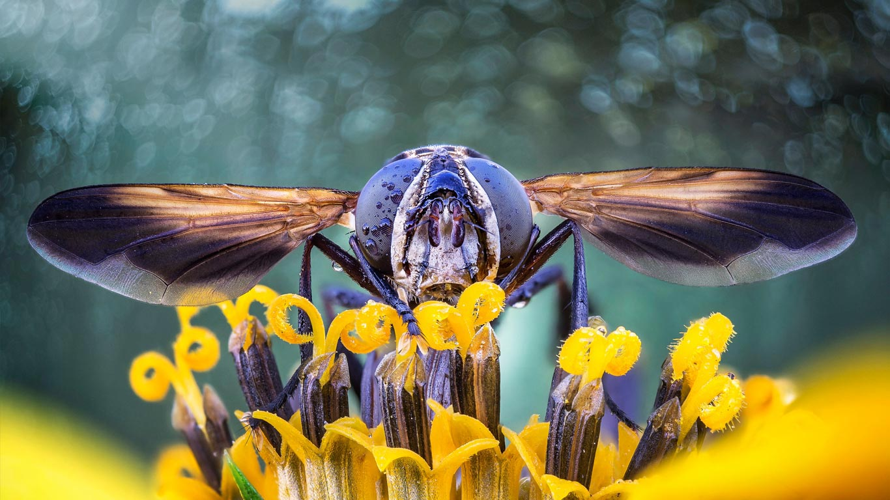

#### 20170721 Ebor Falls in the Guy Fawkes River National Park of Australia (© Ingo Oeland/Alamy)(Bing Canada)

#### 20170720 The Moon rises over Glastonbury Tor, Somerset (© Matt Cardy/Getty Images)(Bing United Kingdom)

#### 20170719 Aldabra of the Seychelles in the Indian Ocean (© Wil Meinderts/Minden Pictures)(Bing United Kingdom)

#### 20170718 The Art Gallery of Ontario in Toronto (© Yevgenia Gorbulsky/Alamy Stock Photo)(Bing Canada)

#### 20170718 Geladas in Simien Mountains National Park, Ethiopia (© Thomas Marent/Minden Pictures)(Bing United Kingdom)

#### 20170718 Federseesteg bei Bad Buchau, Baden-Württemberg, Deutschland (© Huber/Sime/eStock Photo)(Bing Deutschland)

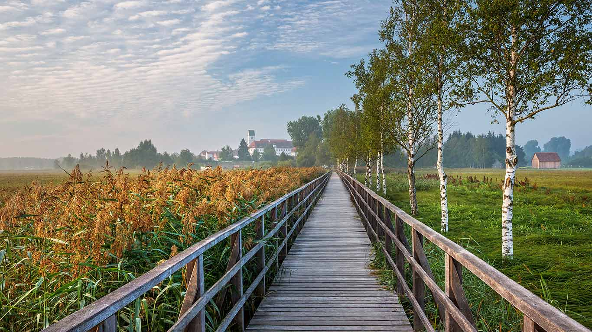

#### 20170717 Beach huts reflecting in the water at Woolacombe Beach, Devon (© Fingerszz/Getty Images)(Bing United Kingdom)

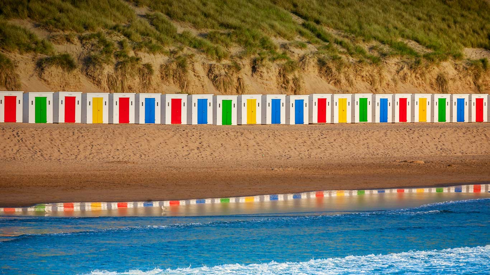

#### 20170717 The Crescent City Connection bridges in New Orleans, Louisiana (© Fred Gramoso/500px)(Bing United States)

#### 20170716 Farolim de Felgueiras, a lighthouse in Porto, Portugal (© Veselin Malinov/500px)(Bing United Kingdom)

#### 20170715 Place de la Concorde, Obélisque, Assemblée Nationale et Invalides de nuit à Paris (© Pascal Ducept/hemis.fr/Getty Images)(Bing France)

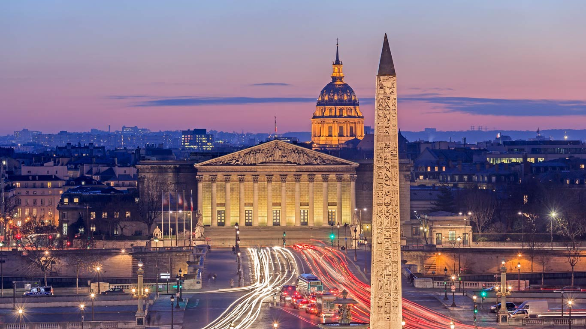

#### 20170715 Kathleen Lake in Kluane National Park, Yukon (© Robert Postma/Design Pics/Getty Images)(Bing Canada)

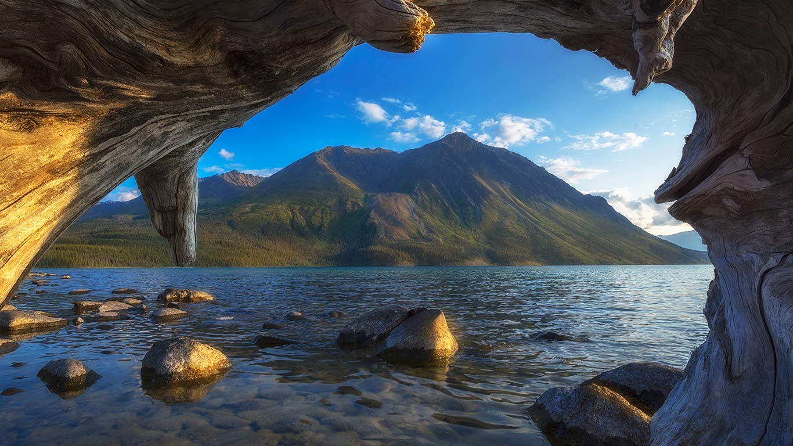

#### 20170715 Salt evaporation ponds in San Francisco Bay, California, USA (© Jason Hawkes/REX/Shutterstock)(Bing United Kingdom)

#### 20170714 Ferris wheel in the Tuileries Garden in Paris, France (© Tardy Herv/Getty Images)(Bing United Kingdom)

#### 20170713 Averau and Monte Pelmo seen from Lagazuoi mountain near Cortina d'Ampezzo, Italy (© Olimpio Fantuz/Offset)(Bing United Kingdom)

#### 20170712 Atlantic ghost crab (© Luciano Candisani/Minden Pictures)(Bing United Kingdom)

#### 20170711 Lok Baintan Floating Market on the Martapura River in Indonesia (© Fauzan Mauddin/Solent News/REX/Shutterstock)(Bing United Kingdom)

#### 20170711 Leutaschklamm bei Mittenwald, Bayern, Deutschland (© plainpicture/Westend61/Roy Jankowski)(Bing Deutschland)

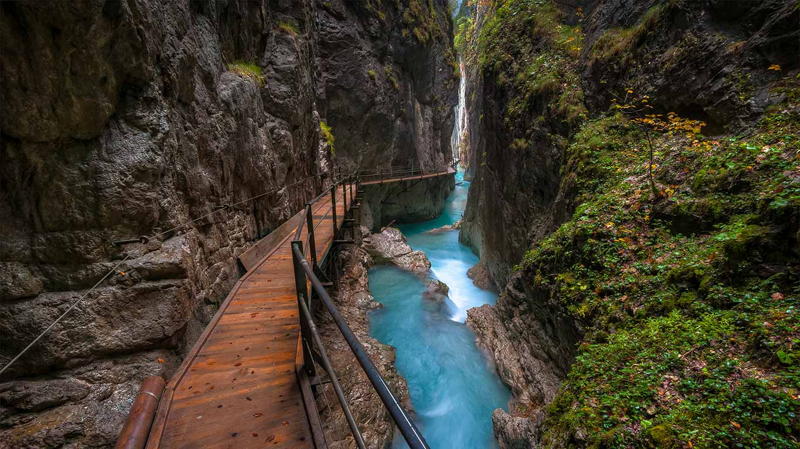

#### 20170710 Sheep in the Peak District, Derbyshire (© James Mills/500px)(Bing United Kingdom)

#### 20170709 ‘Umbrellas’ sculpture by George Zongolopoulos outside of Macedonian Museum of Contemporary Art in Thessaloniki, Greece (© SIAATH/Shutterstock)(Bing United Kingdom)

#### 20170708 【今日小暑】游客在枣庄市台儿庄区运河湿地公园观赏莲花，中国山东省 (Gao Qimin/Xinhua/Alamy Live News)(Bing China)

#### 20170708 The National Theatre lit up in rainbow colours, London (© Zefrog/Alamy)(Bing United Kingdom)

#### 20170708 ｢富士山と天の川｣山梨, 富士吉田市 (© Nuttapoom Amornpashara/Getty Images)(Bing Japan)

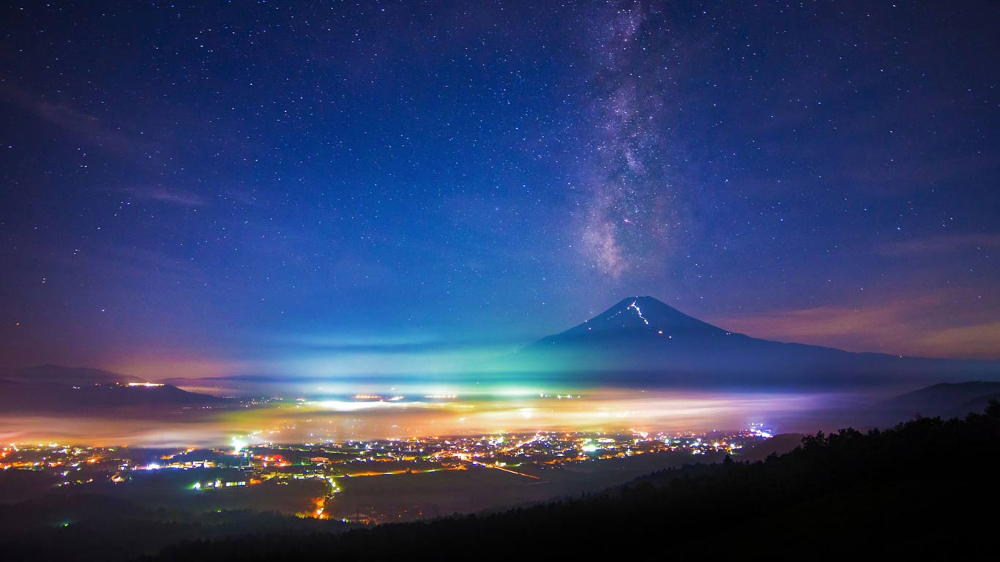

#### 20170708 Cave on El Hierro Island, Canary Islands, Spain (© Huber/Sime/eStock Photo)(Bing United States)

#### 20170707 Antelope Valley Poppy Reserve in California, USA (© Ron Thomas/Getty Images)(Bing United Kingdom)

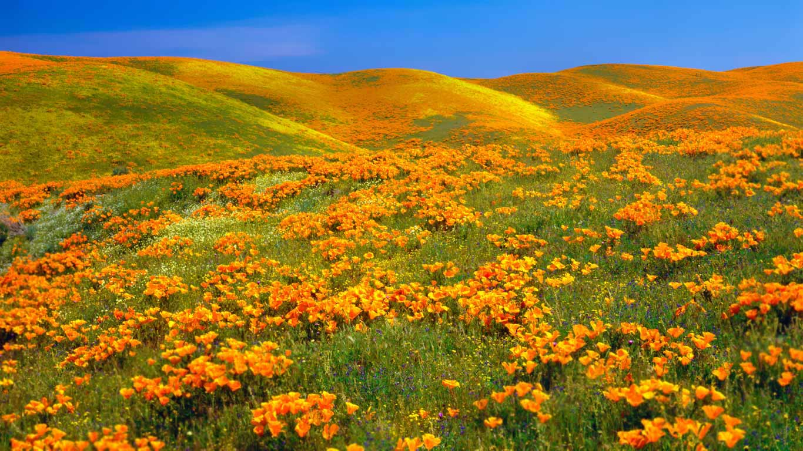

#### 20170707 The Milky Way over the Atlantic Ocean (© Nilton Junior/500px)(Bing United States)

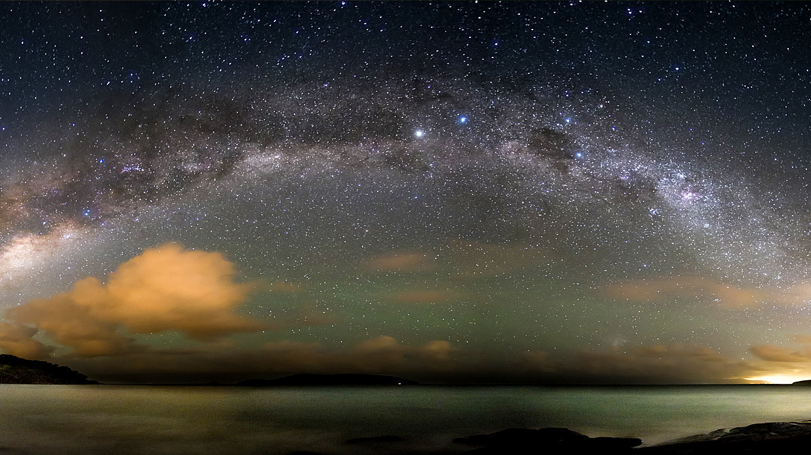

#### 20170706 Snails ‘kissing’ in Sambas Regency, Indonesia (© Solent News/Rex Shutterstock)(Bing United Kingdom)

#### 20170706 Cabines de plage à Gouville-sur-Mer, Cotentin, Manche (© Franck Guiziou/hemis.fr/Getty Images)(Bing France)

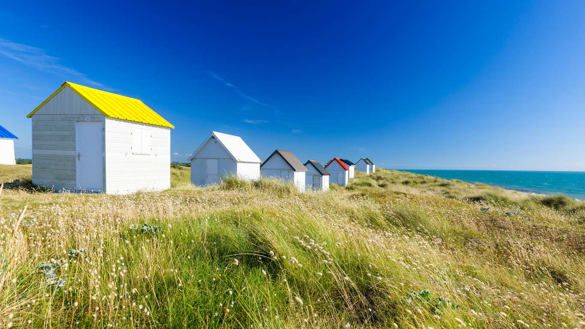

#### 20170705 White Sands National Monument in New Mexico (© Peter Burgstaller/Gallery Stock)(Bing United Kingdom)

#### 20170704 Mosaicultures Internationales in Jardin Botanique, Montreal (© Danita Delimont/Alamy Stock Photo)(Bing Canada)

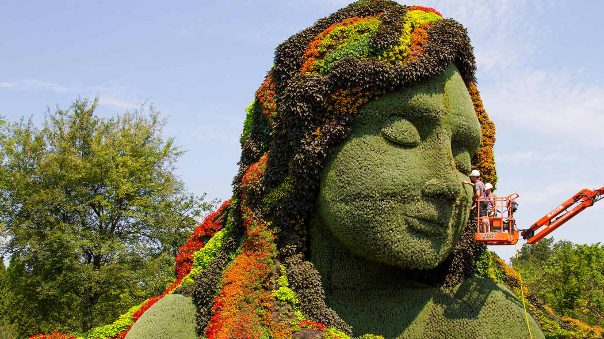

#### 20170704 Long-tailed tits in Erding, Germany (© H. Schmidbauer/Offset)(Bing United Kingdom)

#### 20170704 Fourth of July celebration on the beach, Outer Banks, North Carolina (© Will Walker/500px)(Bing United States)

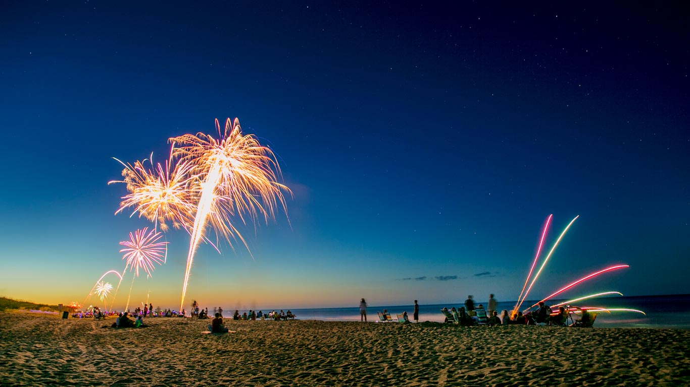

#### 20170703 A harvest mouse living in a tennis ball in Thetford, Norfolk (© David Tipling/Lonely Planet Images/Getty Images)(Bing United Kingdom)

#### 20170702 Illuminated sculpture 'Halo' above Haslingden in Lancashire (© Paul Makin/Alamy)(Bing United Kingdom)

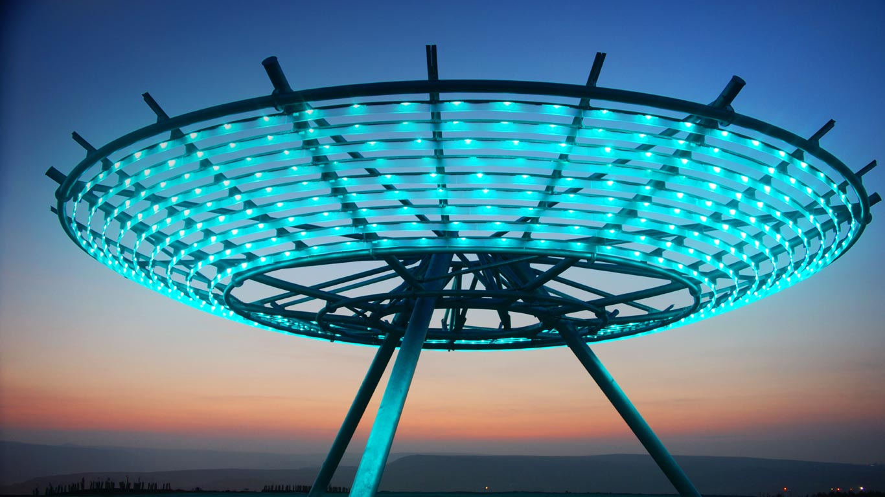

#### 20170702 Amusement park rides at Coney Island, New York (© New York on Air/Offset)(Bing United States)

#### 20170701 The Rheinturm at night in Düsseldorf, Germany (© r.classen/Shutterstock)(Bing United Kingdom)

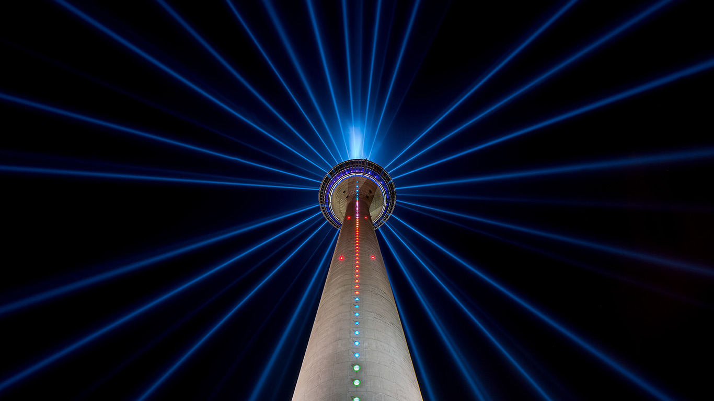

#### 20170701 Sunwapta Falls in Jasper National Park, Alberta, Canada (© Mana Arabi/Shutterstock)(Bing United States)

#### 20170701 Parliament of Canada with eternal flame in foreground in Ottawa (© Tareq Saifur Rahman)(Bing Canada)

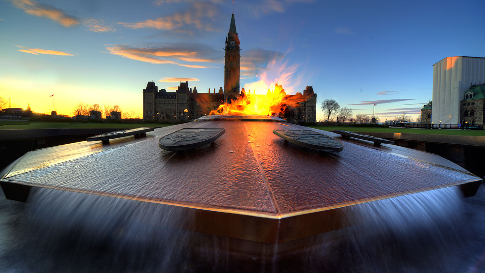

