#### 20170831 Golden trevally swim with a whale shark in Cenderawasih Bay, Indonesia (© Pete Oxford/Minden Pictures)(Bing United Kingdom)

#### 20170830 Mist blows over rolling countryside near Talybont-on-Usk in Brecon Beacons National Park, Wales (© Adam Burton/Alamy)(Bing United Kingdom)

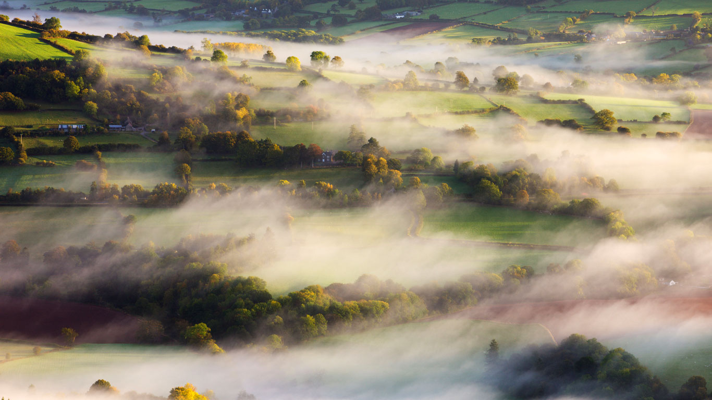

#### 20170830 Priele im Biosphärenreservat Niedersächsisches Wattenmeer, Niedersachsen, Deutschland (© plainpicture/Peter Hamel)(Bing Deutschland)

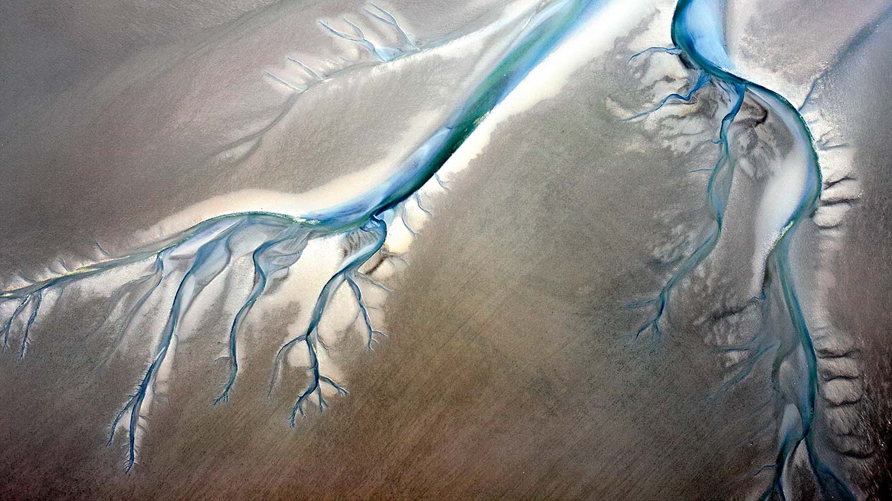

#### 20170829 Botallack Mine in Cornwall, England (© Robert Harding/Masterfile)(Bing United States)

#### 20170829 Motorists on the Atchafalaya Basin Bridge in Louisiana, USA (© Brian Sytnyk/Masterfile)(Bing United Kingdom)

#### 20170828 Common mare's tail growing on the Tibetan Plateau, China (© Dong Lei/Minden Pictures)(Bing United Kingdom)

#### 20170827 Bat-eared fox kits in Kgalagadi Transfrontier Park, Botswana (© Richard Du Toit/Minden Pictures)(Bing United Kingdom)

#### 20170826 Chulilla, Spain (© Ben Herndon/Tandem Stills + Motion)(Bing United Kingdom)

#### 20170825 Time-lapse of a tube anemone (© Coral Morphologic)(Bing United Kingdom)

#### 20170825 Luftaufnahme einer Wohnsiedlung in Poing, Bayern, Deutschland (© plainpicture/Westend61/Klaus Leidorf)(Bing Deutschland)

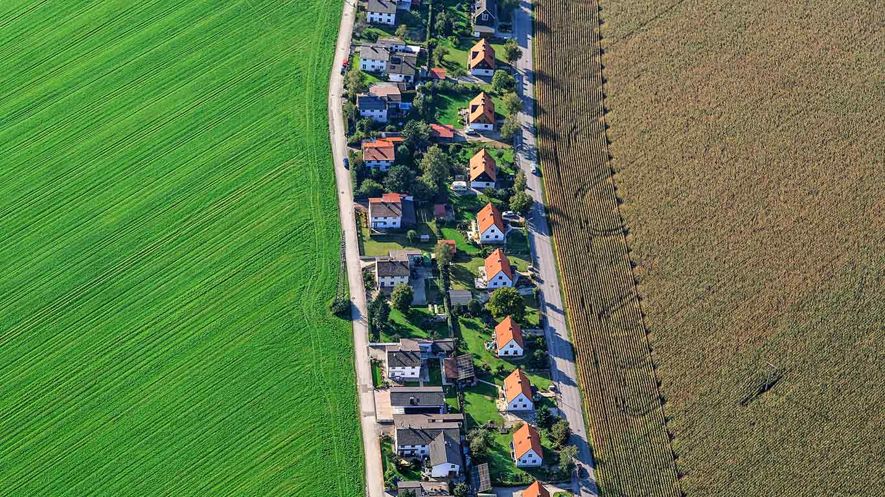

#### 20170825 ｢五月山の大文字｣大阪, 池田市 (© EarthScape ImageGraphy/Shutterstock.com)(Bing Japan)

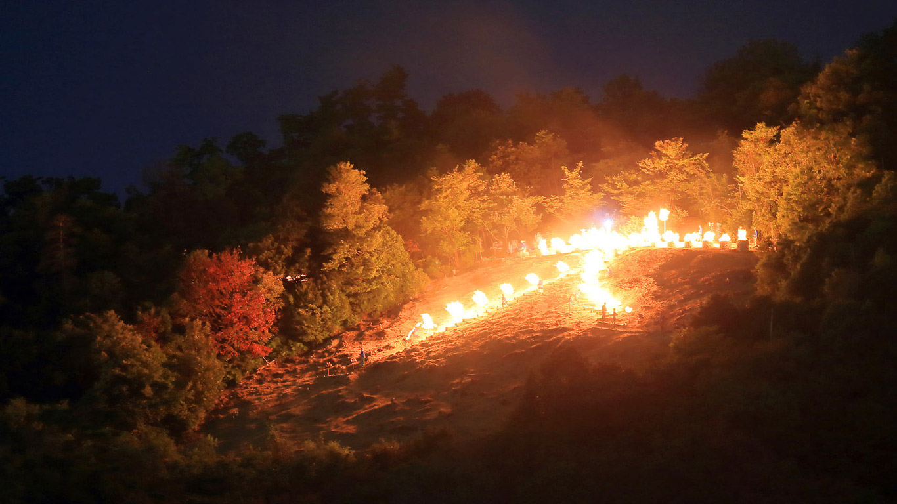

#### 20170824 Gustav III´s Museum of Antiquities in Stockholm Palace, Sweden (© Johnér/Offset)(Bing United Kingdom)

#### 20170823 Njegoš’s Mausoleum in Lovćen National Park, Montenegro (© joci03/iStock/Getty Images)(Bing United Kingdom)

#### 20170823 A lion’s mane jellyfish drifts in Gros Morne National Park, Newfoundland (© David Doubilet/Getty Images)(Bing Canada)

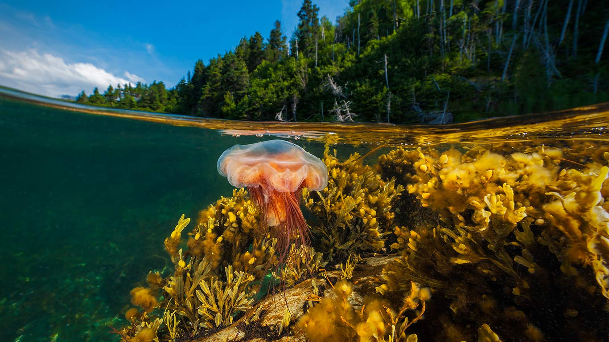

#### 20170822 Bumblebee on sunflower near Viechtach, Bavarian Forest, Bavaria, Germany (© Rüdiger Hess/geo-select FotoArt)(Bing United Kingdom)

#### 20170822 ｢天の川と蓑掛岩｣静岡県, 伊豆半島 (© GettyImages)(Bing Japan)

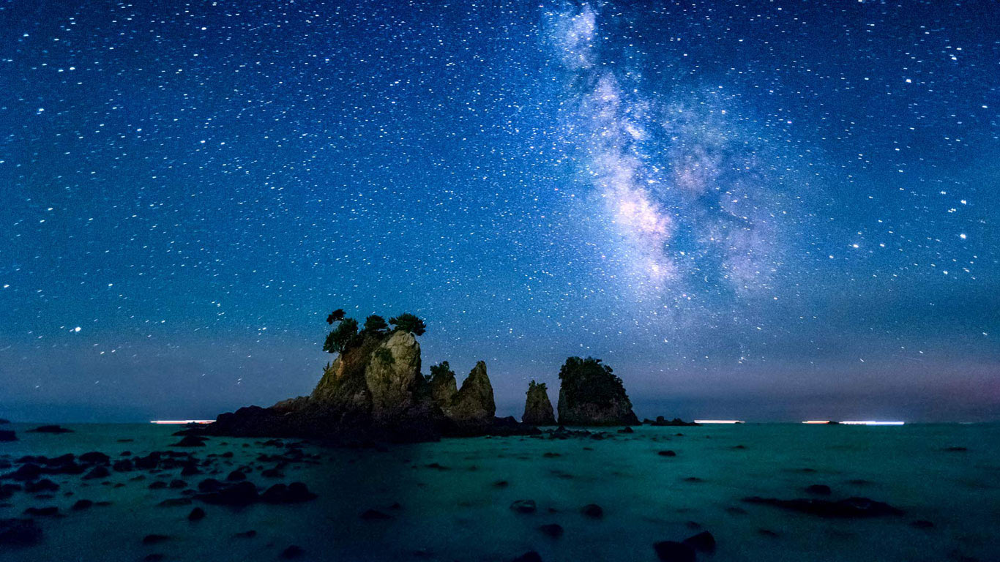

#### 20170822 Part of the Jantar Mantar observatory complex in New Delhi, India (© Uniquely India/Getty Images)(Bing United States)

#### 20170821 Firehole River in Yellowstone National Park, Wyoming, USA (© Bryan Jolley/Tandem Stills + Motion)(Bing United Kingdom)

#### 20170820 King penguins at St. Andrews Bay, South Georgia (© plainpicture/Westend61/Fotofeeling)(Bing United Kingdom)

#### 20170819 The Painted Hills in Oregon, USA (© David Henderson/plainpicture)(Bing United Kingdom)

#### 20170817 Schafstelze zwischen gelben Blumen, Hessen, Deutschland (© Michael Breuer/Minden Pictures)(Bing Deutschland)

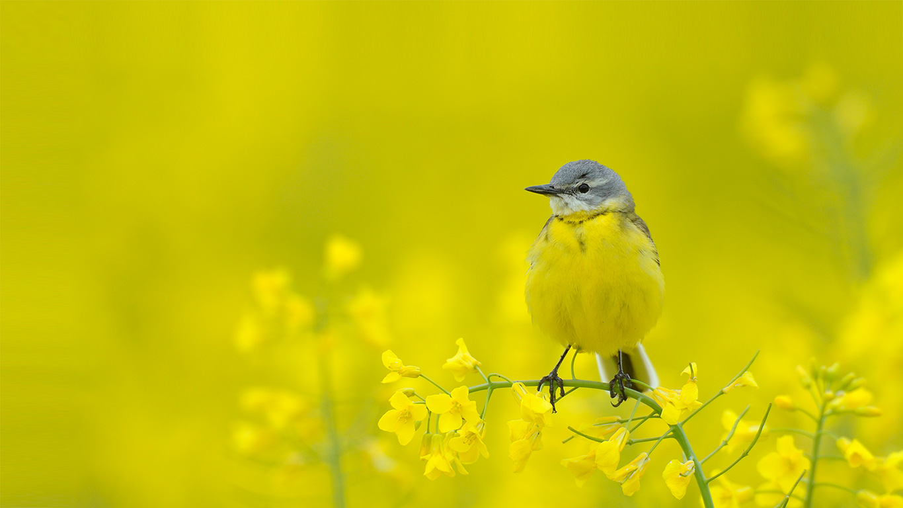

#### 20170817 Zlatni Rat on Brač island, Croatia (© mbbirdy/E+/Getty Images)(Bing United Kingdom)

#### 20170816 Avalanche Creek in Glacier National Park, Montana, USA (© Ian Shive/Tandem Stills + Motion)(Bing United Kingdom)

#### 20170815 Quaking aspens in Gunnison National Forest, Colorado, USA (© Tim Fitzharris/Minden Pictures)(Bing United Kingdom)

#### 20170814 The monastery of Panagia Hozoviotissa on Amorgos island, Greece (© Lemonan/iStock/Getty Images)(Bing United Kingdom)

#### 20170813 Multiple exposure of kitesurfers in Germany (© plainpicture/Rudi Sebastian)(Bing United Kingdom)

#### 20170812 African bush elephants in Mana Pools National Park, Zimbabwe (© David Fettes/Offset)(Bing United Kingdom)

#### 20170811 Silhouettes of fishing boats in Mahone Bay, Nova Scotia (© dmathies/Getty Images)(Bing Canada)

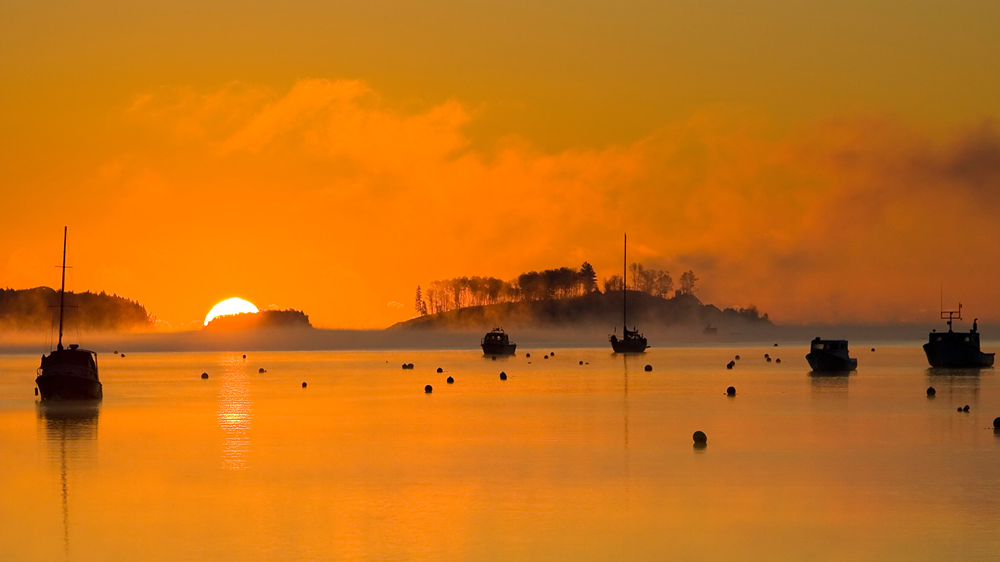

#### 20170811 Caverne du Pont d'Arc at Vallon-Pont-d'Arc, France (© Christian Handl/REX/Shutterstock)(Bing United Kingdom)

#### 20170810 Einkaufszentrum MyZeil, PalaisQuartier, Frankfurt am Main, Hessen, Deutschland (© LOOK/Alamy)(Bing Deutschland)

#### 20170810 Huacachina, Ica Region, Peru (© Matthew Williams-Ellis/Aurora Photos)(Bing United Kingdom)

#### 20170809 Myakka River State Park, Florida (© Paul Marcellini/Tandem Stills + Motion)(Bing United States)

#### 20170809 The Emirates Air Line across the River Thames in London at sunset (© Edwin Hopper/Alamy)(Bing United Kingdom)

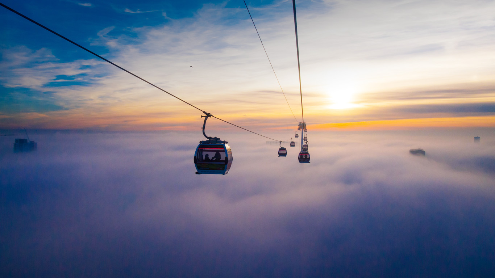

#### 20170808 Canadian lynx in Denali National Park, Alaska, USA (© Design Pics Inc./Alamy)(Bing United Kingdom)

#### 20170807 ｢慰霊碑と原爆ドーム｣広島平和記念公園  (©  Francesco Dazzi/Shutterstock)(Bing Japan)

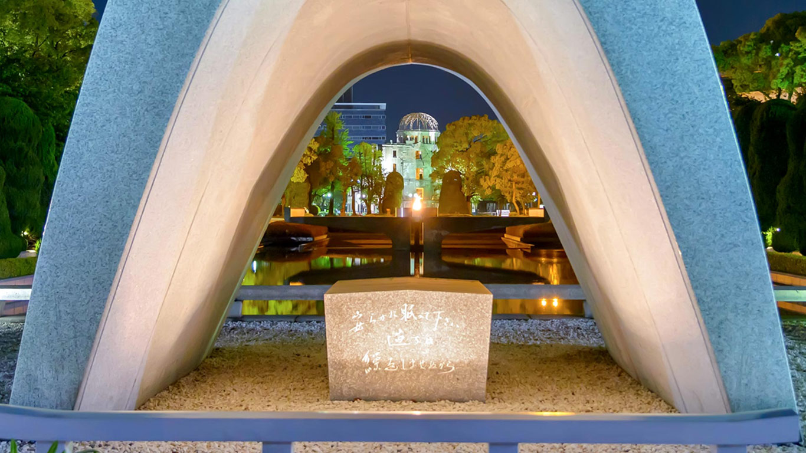

#### 20170807 Star trails over Ålesund, Norway (© Stian Rekdal/Nimia)(Bing United Kingdom)

#### 20170806 Mortuary poles containing remains of high status people (© Jonathan Kingston/Getty Images)(Bing Canada)

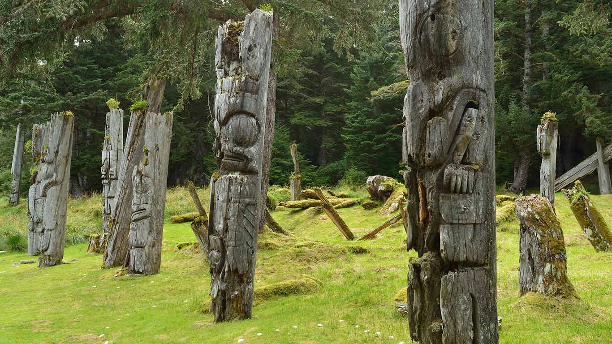

#### 20170806 Hulunbuir grasslands, Inner Mongolia, China (© Sino Images/Getty Images)(Bing United Kingdom)

#### 20170805 Maya archaeological site of Caracol, Belize (© Yann Arthus-Bertrand/Getty Images)(Bing United Kingdom)

#### 20170804 A little owl hunting on the ground (© Andy Rouse/Minden Pictures)(Bing United Kingdom)

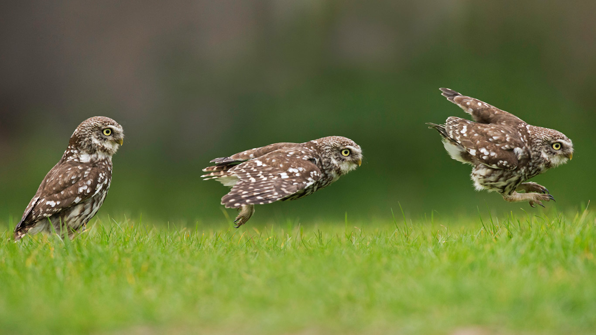

#### 20170804 Bodie Island Lighthouse on North Carolina's Outer Banks (© Anthony Heflin/Shutterstock)(Bing United States)

#### 20170803 Lavender fields of Valensole, Provence, France (© Frank Krahmer/Panorama Stock)(Bing United Kingdom)

#### 20170802 ｢風力発電のタービン｣ドイツ, ザウアーラント (© Hans Blossey/imageBROKER/REX/Shutterstock)(Bing Japan)

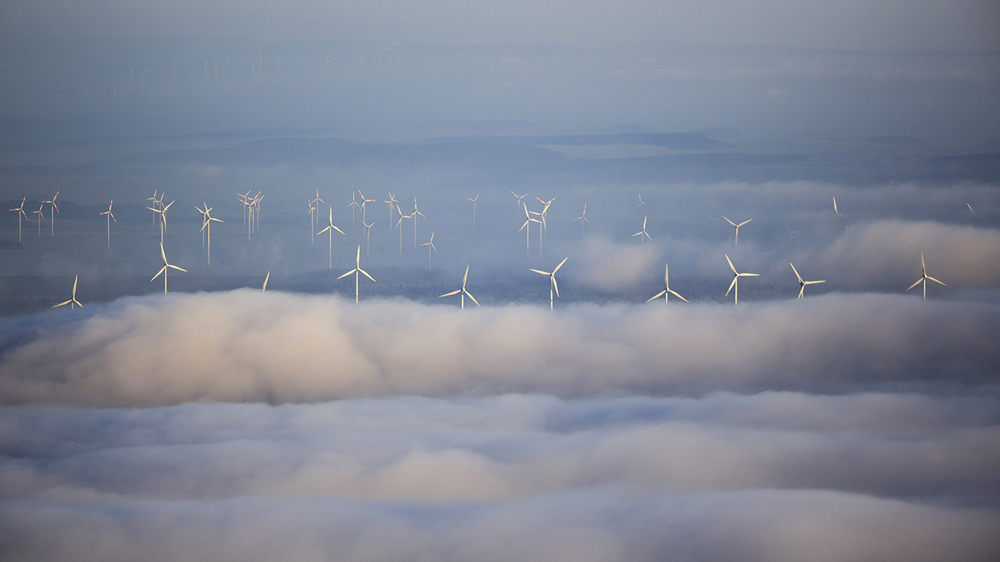

#### 20170802 Spiral whip coral off the coast of Indonesia (© WaterFrame/Alamy)(Bing United Kingdom)

#### 20170801 ‘Spiegel’ by Jaume Plensa at Yorkshire Sculpture Park (© McCoy Wynne/Alamy)(Bing United Kingdom)

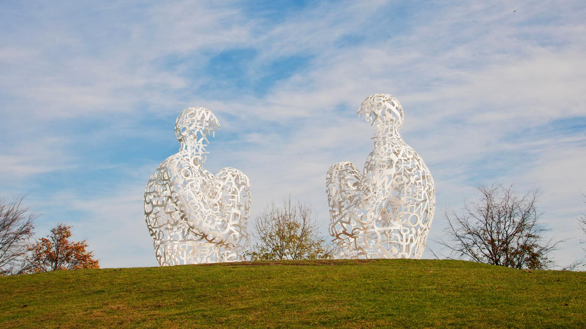

#### 20170801 Female nyalas, Kruger National Park, South Africa (© Richard Du Toit/Minden Pictures)(Bing United States)

