#### 20170930 Fan-throated lizard in the Ghoradeshwar Hills, Pune, Maharashtra, India (© Abhishek Bawkar/500px)(Bing United Kingdom)

#### 20170929 Mount Ibuki Driveway in Maibara, Shiga, Japan (© The Asahi Shimbun/Getty Images)(Bing United Kingdom)

#### 20170929 Little auks fly past an iceberg at Spitsbergen, Norway (© Danny Green/Minden Pictures)(Bing United States)

#### 20170928 ｢横浜ベイブリッジ｣神奈川県, 横浜市 (© Hitoshi Nishimura/Getty Images)(Bing Japan)

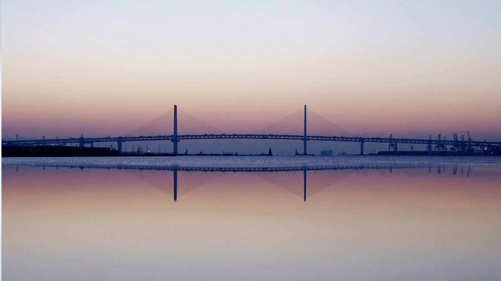

#### 20170928 A great tit perched on a branch (© Frederic Desmette/Biosphoto/Minden Pictures)(Bing United Kingdom)

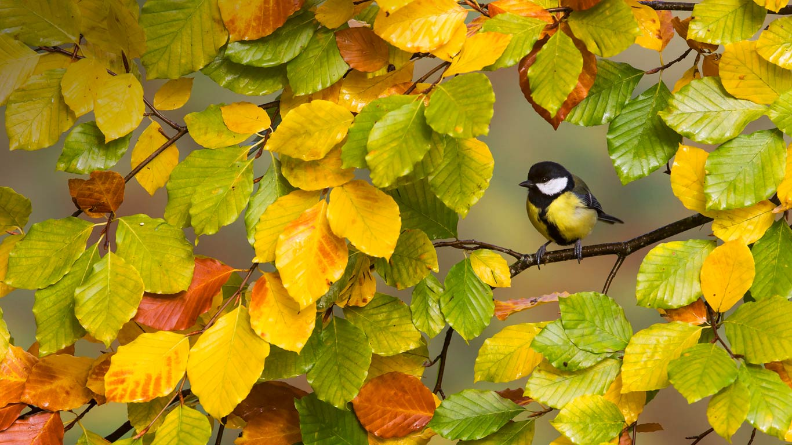

#### 20170927 Lake Pukaki on South Island, New Zealand (© Martin Heck/Nimia)(Bing United Kingdom)

#### 20170926 Aerial view of the Turpan Depression, China (© NASA)(Bing United Kingdom)

#### 20170925 Precipice Lake in Sequoia National Park, California, USA (© Caleb Weston/Getty Images)(Bing United Kingdom)

#### 20170924 【今日秋分】清晨以风筝为伴晨跑中的人，中国上海 (© Kiszon Pascal/Getty Images)(Bing China)

#### 20170924 View of the Ferris wheel, Erfurt Cathedral and St. Severus Church during Oktoberfest in Erfurt, Germany (© Hans P. Szyszka/age fotostock)(Bing United Kingdom)

#### 20170923 Coquilles Saint-Jacques, France (© Chengyuzheng/Getty Images)(Bing France)

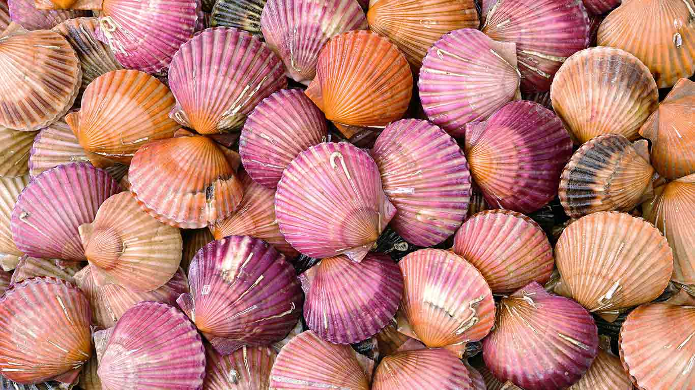

#### 20170923 A rabbit building a nest (© Dave Semmens/500px)(Bing United Kingdom)

#### 20170922 Bear Rocks Preserve in the Dolly Sods Wilderness, West Virginia, USA (© Anthony Heflin/500px)(Bing United Kingdom)

#### 20170921 Procida in the Bay of Naples, Italy (© Frank Chmura/age fotostock)(Bing United Kingdom)

#### 20170920 Vineyards at Rotenberg in Baden-Württemberg, Germany (© Werner Dieterich/plainpicture)(Bing United States)

#### 20170920 The Dark Hedges in County Antrim, Northern Ireland (© eye35.pix/Alamy)(Bing United Kingdom)

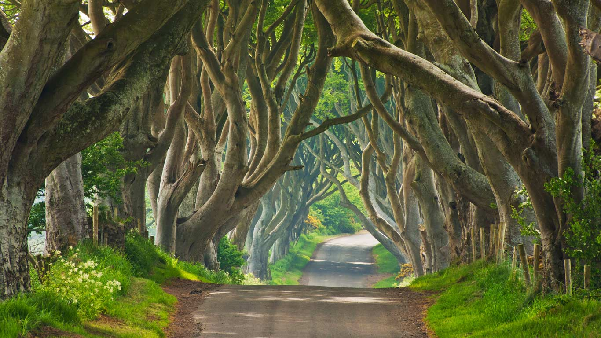

#### 20170919 A sparrowhawk in Kirkcudbright, Scotland (© Ray Cooper/Solent News/REX/Shutterstock)(Bing United Kingdom)

#### 20170919 ｢サルのグルーミング｣長野県, 地獄谷野猿公苑 (© By Alan Tsai/Getty Images)(Bing Japan)

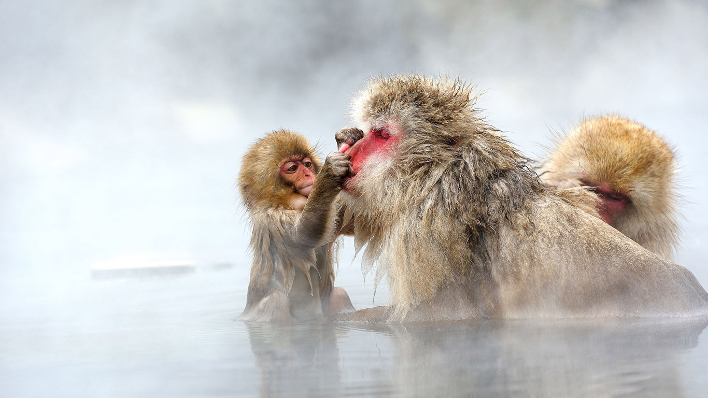

#### 20170918 Une jeune passionnée d’art devant une porte peinte, Roussillon, Provence-Alpes-Côte d'Azur. (© Shaun Egan/Getty Images)(Bing France)

#### 20170918 A forest stream in Gwaii Haanas National Park Reserve and Haida Heritage Site, Haida Gwaii, British Columbia, Canada (© Robert Postma/plainpicture)(Bing United Kingdom)

#### 20170917 Fahrgeschäfte auf dem Oktoberfest, München, Bayern, Deutschland (© FEST/RelaXimages/age fotostock)(Bing Deutschland)

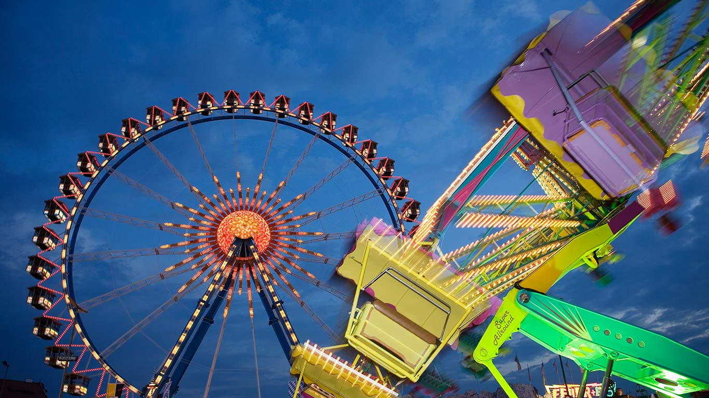

#### 20170917 Killer Whale (Orcinus orca) off Northern Vancouver Island, B.C. (© Rolf Hicker/Getty Images)(Bing Canada)

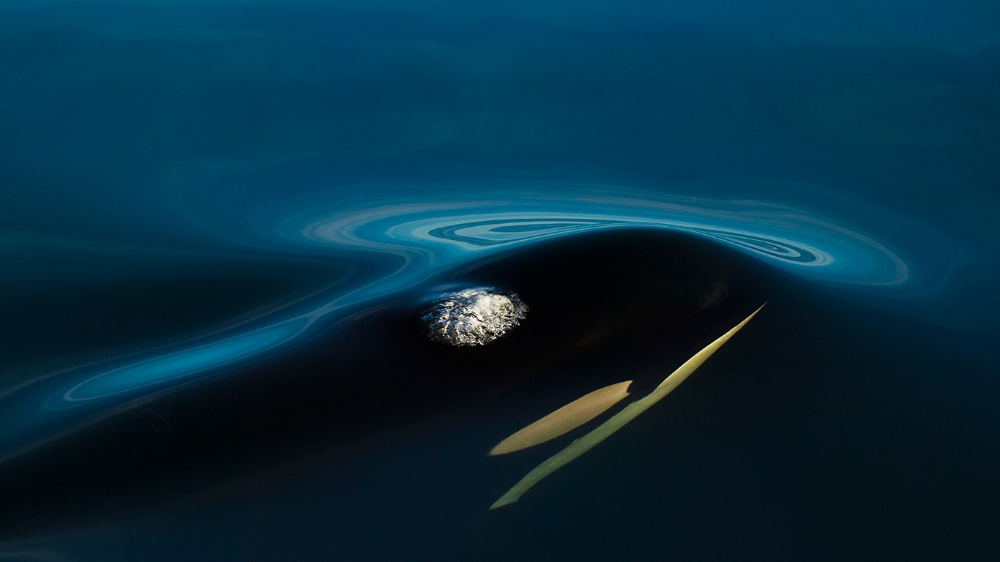

#### 20170917 Independence Hall in Philadelphia, Pennsylvania (© Sean Pavone/Alamy)(Bing United States)

#### 20170917 Gordes, Provence-Alpes-Côte d'Azur, France (© Therry/Getty Images)(Bing United Kingdom)

#### 20170916 The Prince of Wales Hotel, Waterton Lakes National Park, Alberta (© robertharding/Masterfile)(Bing Canada)

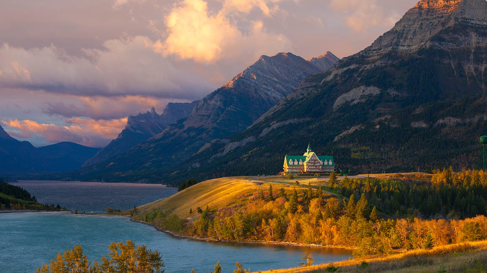

#### 20170916 Konik horses running, Oostvaardersplassen Nature Reserve, Netherlands (© Jim Brandenburg/Minden Pictures)(Bing United States)

#### 20170916 Cameron Falls in Waterton Lakes National Park, Alberta, Canada (© Anna Gorin/Getty Images)(Bing United Kingdom)

#### 20170915 The Thames Estuary and London Array wind farm (© NASA)(Bing United Kingdom)

#### 20170915 ｢コスモス｣東京, 立川 (© Tetsuya Tanooka/Aflo/Alamy)(Bing Japan)

#### 20170914 View from the City Palace, Udaipur, Rajasthan, India (© Matthias Graben/Getty Images)(Bing United Kingdom)

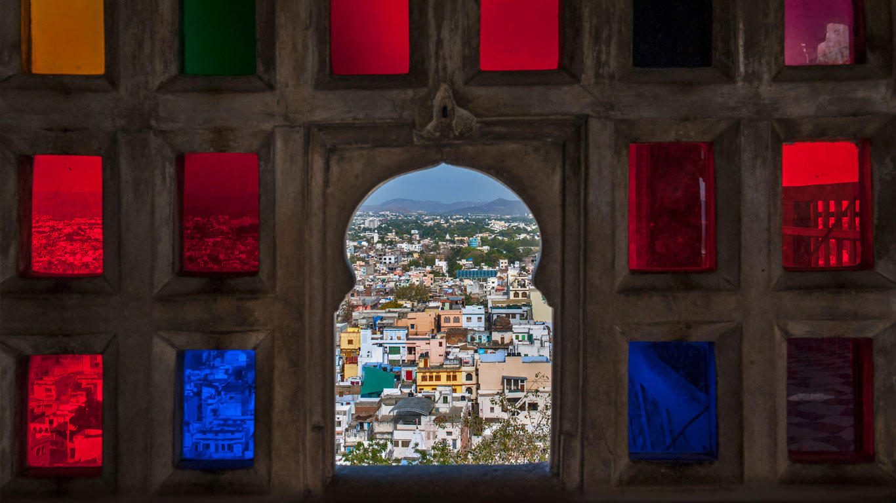

#### 20170913 Dogon village of Bandiagara, Mali (© Quick Shot/Shutterstock)(Bing United Kingdom)

#### 20170912 Castle Point Lighthouse near the village of Castlepoint, North Island of New Zealand (© Matteo Colombo/Digital Vision/Getty Images)(Bing United Kingdom)

#### 20170911 Uig, Isle of Skye, Scotland (© SPANI Arnaud/hemis.fr/Getty Images)(Bing United Kingdom)

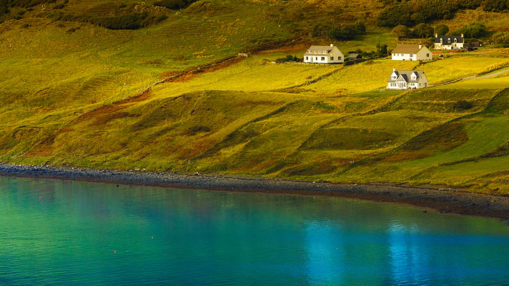

#### 20170911 L'Anse aux Meadows National Historic Site, St-Lunaire-Griquet, Newfoundland (© Yves Marcoux/Age Fotostock)(Bing Canada)

#### 20170911 FDNY Memorial Wall for the New York City firefighters who died on 9/11 (© Dmitry Smolyanitsky/500px)(Bing United States)

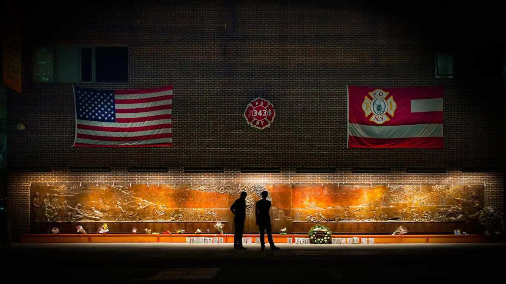

#### 20170910 Marine iguanas, Galápagos Islands, Ecuador (© Tui De Roy/Minden Pictures)(Bing United Kingdom)

#### 20170909 Poenari Castle in the Fagaras Mountains of Romania (© Susanna Patras/Tandem Stills + Motion)(Bing United Kingdom)

#### 20170908 George Peabody Library in Baltimore, Maryland, USA (© Matthew Petroff/500px)(Bing United Kingdom)

#### 20170907 Stack of film reels (© Ian McKinnell/Getty Images)(Bing Canada)

#### 20170907 Ile de la Petite-Terre, Guadeloupe, France (© Thierry Grun/Age Fotostock)(Bing France)

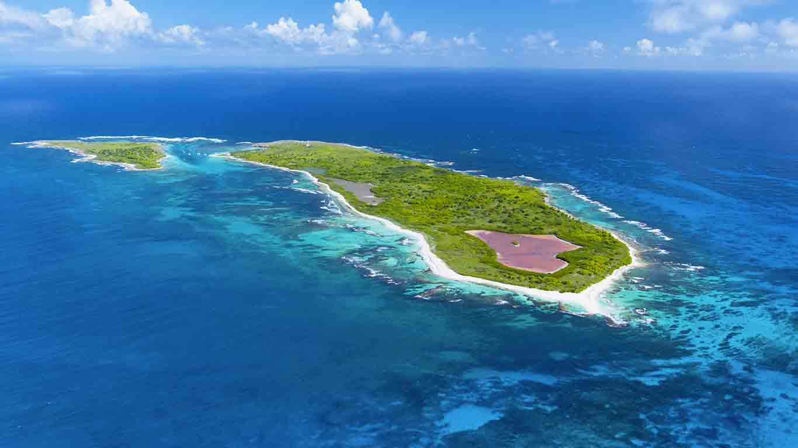

#### 20170907 Crail Harbour in the East Neuk of Fife, Scotland (© Pietro Bevilacqua/500px)(Bing United Kingdom)

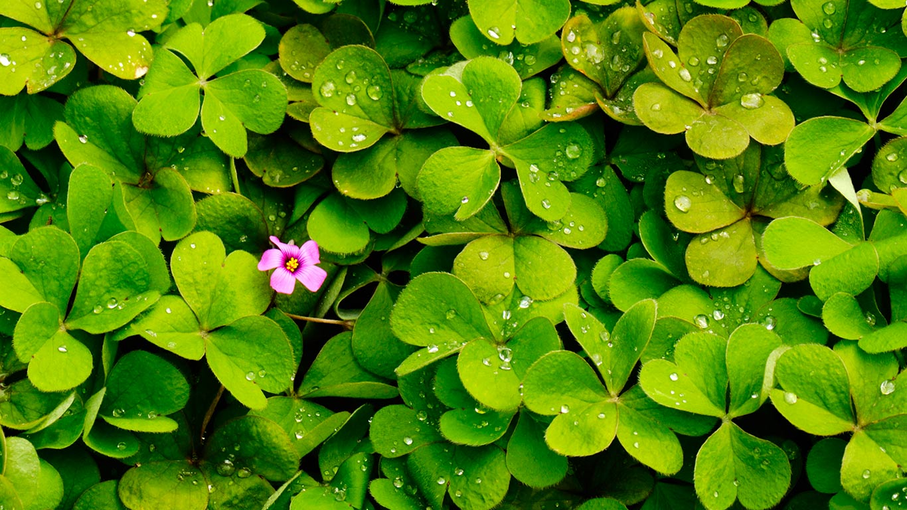

#### 20170906 The Sneffels Range in Colorado, USA (© Rachid Dahnoun/Tandem Stills + Motion)(Bing United Kingdom)

#### 20170905 Jagged rocks at Welcombe Mouth, North Devon (© Stephen Spraggon/Alamy)(Bing United Kingdom)

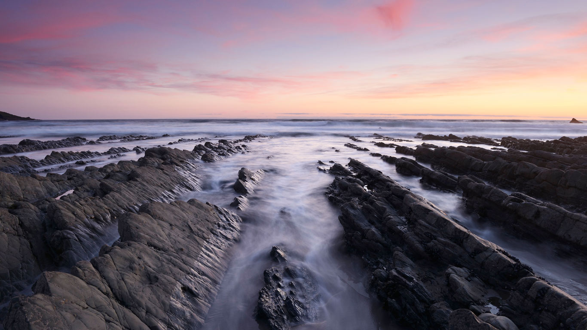

#### 20170905 Street art “Read Dream” de Jef Aerosol, Fort d’Aubervilliers, France (© Soltan Frédéric/Getty Images)(Bing France)

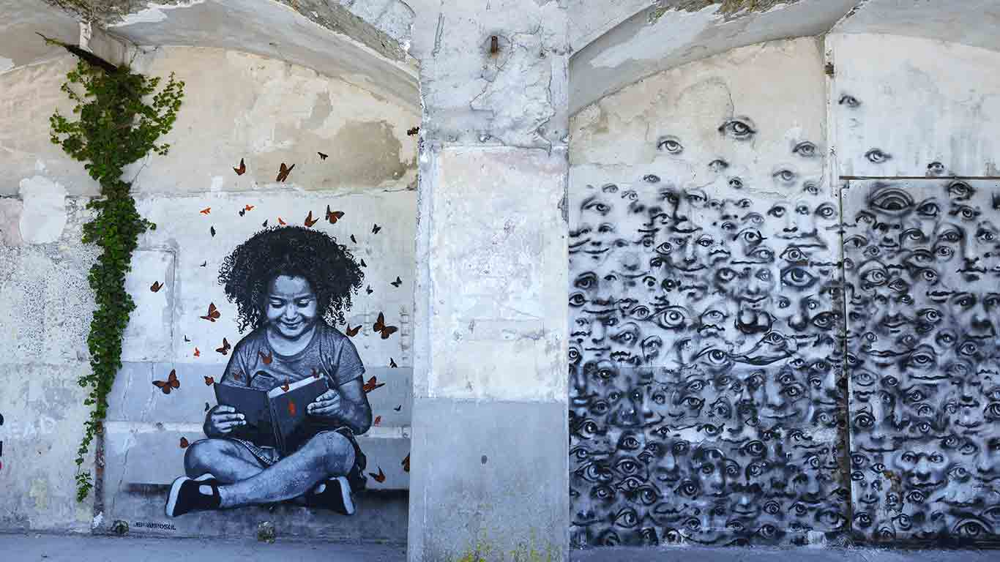

#### 20170905 Looking up from under the water of a cenote in Dos Ojos, Mexico (© Christian Vizl/Tandem Stills + Motion)(Bing United States)

#### 20170904 Föhr, North Frisian Islands, Germany (© Alexander Gabrysch/Getty Images)(Bing United Kingdom)

#### 20170904 Workers restoring the rotunda of the US Capitol in Washington, DC (© AOC Photo/Alamy)(Bing United States)

#### 20170903 The Shanghai World Financial Center in China (© Danny Hu/Getty Images)(Bing United Kingdom)

#### 20170902 Cambridge Gulf in Western Australia photographed by Landsat 8 satellite (© World History Archive/Alamy)(Bing United Kingdom)

#### 20170902 Berliner Skyline mit Funkturm bei Sonnenaufgang (© Zoonar GmbH/Alamy Stock Photo)(Bing Deutschland)

#### 20170901 A white stork and chicks nesting in Southwest Alentejo and Vicentine Coast Natural Park, Portugal (© Marco Bustos/Solent News/REX/Shutterstock)(Bing United Kingdom)

#### 20170901 Sea of clouds over Chamonix Valley, France (© Masterfile)(Bing United Kingdom)

#### 20170901 Deep within Bonnechere Caves in Eganville, Ontario (© DarleneMunro/Getty Images)(Bing Canada)

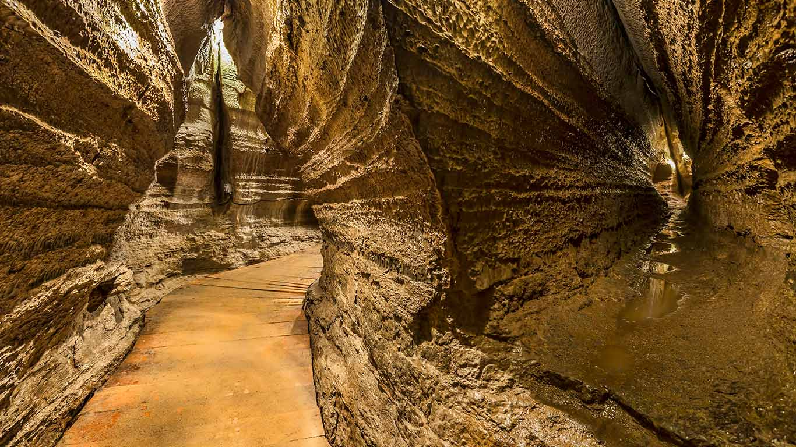

