#### 20171031 Paranormal portraits (© Getty)(Bing United Kingdom)

#### 20171030 Tunnel in Yosemite National Park, California, USA (© Cameron MacPhail/Aurora Photos)(Bing United Kingdom)

#### 20171029 Snow leopard in the Tian Shan, Kyrgyzstan (© Sebastian Kennerknecht/Minden Pictures)(Bing United States)

#### 20171029 The Foucault pendulum at Griffith Observatory in Los Angeles, USA (© GIPhotoStock/Science Photo Library)(Bing United Kingdom)

#### 20171028 Rideau Canal at sunset with Chateau Laurier in the background, Ottawa (© ChristopheLedent/Getty Images)(Bing Canada)

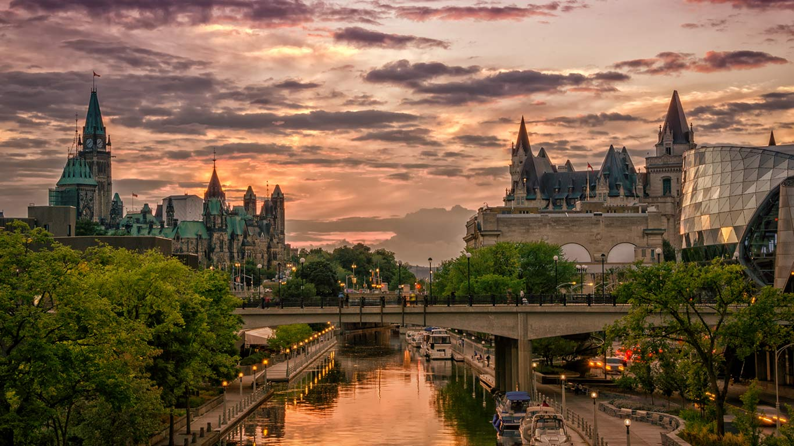

#### 20171028 Mallards in a cypress swamp, Calcasieu River, Louisiana, USA (© Tim Fitzharris/Minden Pictures)(Bing United Kingdom)

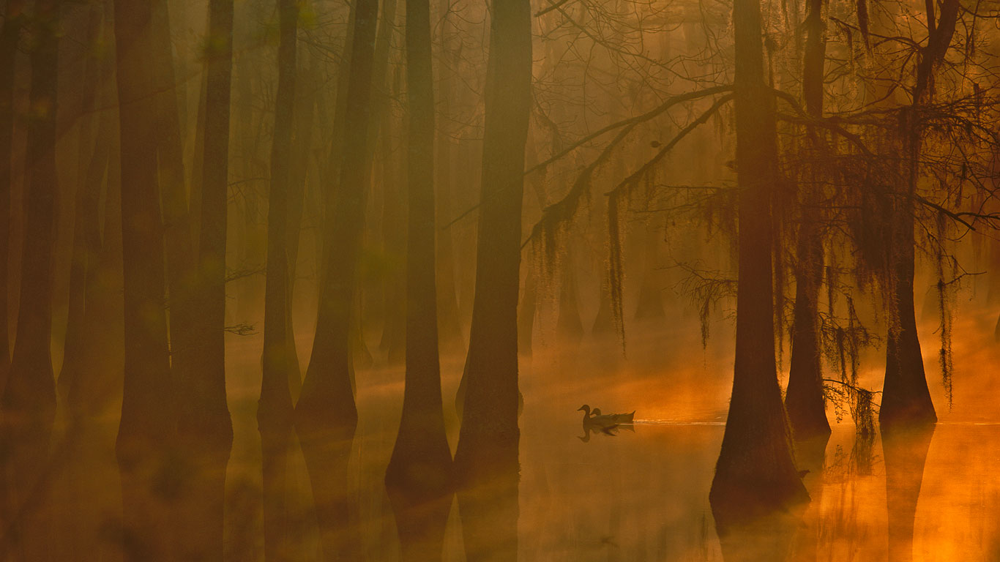

#### 20171027 Ķemeri National Park, Latvia (© Sven Zacek/Minden Pictures)(Bing United Kingdom)

#### 20171026 Hallstatt, Austria (© rudi1976/Alamy)(Bing United Kingdom)

#### 20171025 Parc Naturel Régional des Volcans d’Auvergne, Puy-de-Dôme, Auvergne-Rhône-Alpes, France. (© CORMON Francis/hemis.fr/Alamy Stock Photo)(Bing France)

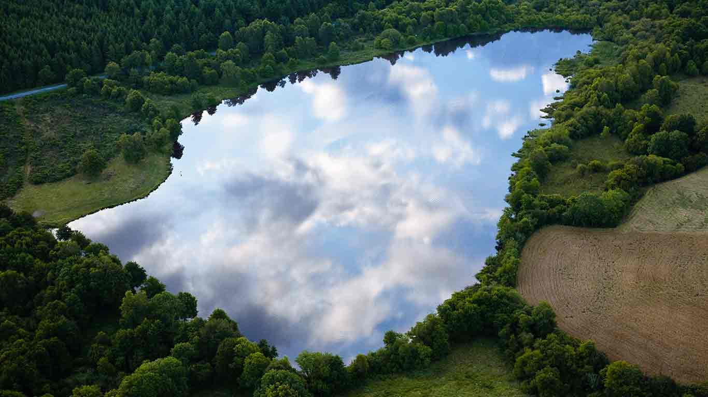

#### 20171025 Sheep on the coast in the Scottish Highlands (© Pete Goding/4Corners)(Bing United Kingdom)

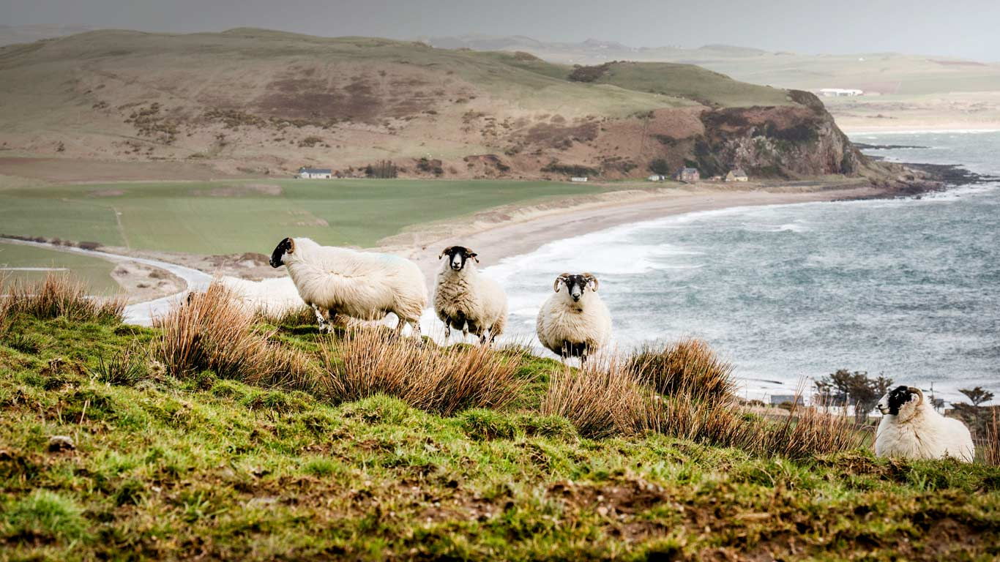

#### 20171024 ｢悟りの窓の紅葉｣京都, 源光庵  (© JTB MEDIA CREATION, Inc./Alamy Stock Photo)(Bing Japan)

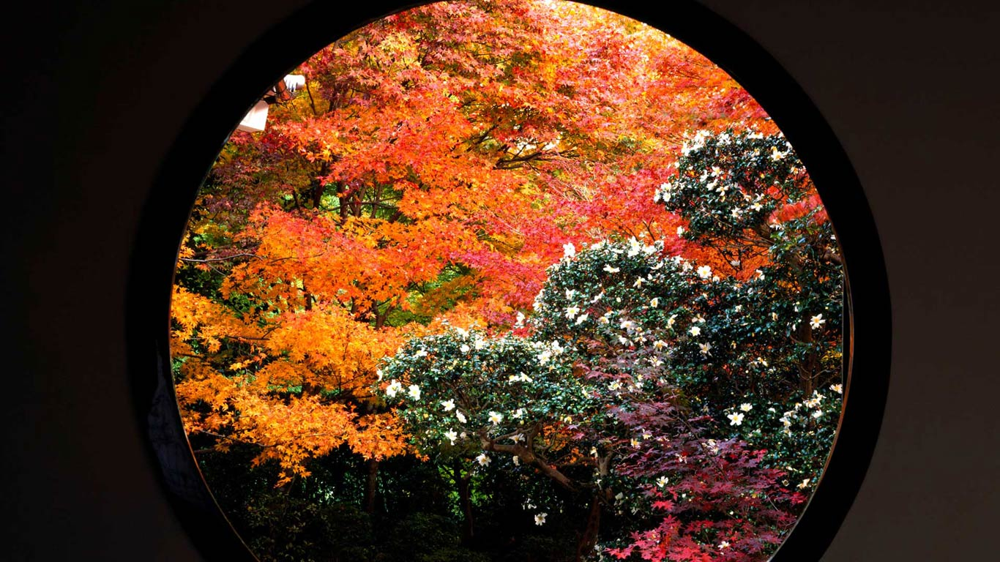

#### 20171024 【今日霜降】林芝市的云雾森林，西藏高原 (© Media Drum World/Aurora Photos)(Bing China)

#### 20171024 Boats off Cát Bà Island, Vietnam (© Garret Suhrie/Tandem Stills + Motion)(Bing United Kingdom)

#### 20171023 An eastern screech owl in the Okefenokee National Wildlife Refuge, Georgia, USA (© Media Drum World/Aurora Photos)(Bing United Kingdom)

#### 20171022 Amalfi Cathedral in Amalfi, Italy (© Inge Johnsson/age fotostock)(Bing United Kingdom)

#### 20171021 A wave building on Oahu’s North Shore, Hawaii, USA (© Vince Cavataio/plainpicture)(Bing United Kingdom)

#### 20171020 Detail of ‘Le Nomade’ by artist Jaume Plensa in Antibes, France (© travelstock44/Alamy)(Bing United States)

#### 20171020 View up to the canopy through holes in an old English oak, Sherwood Forest, Nottinghamshire (© Alex Hyde/Minden Pictures)(Bing United Kingdom)

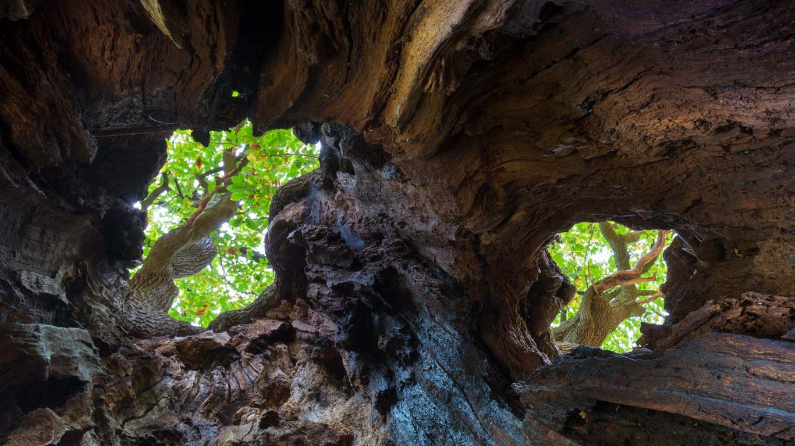

#### 20171019 Solar evaporation ponds on the Great Salt Lake, Utah, USA (© Robert L. Potts/Offset)(Bing United Kingdom)

#### 20171019 Semipalmated Sandpiper (Calidris pusilla) flock flying over the Bay of Fundy, New Brunswick (© Yva Momatiuk and John Eastcott/Minden Pictures)(Bing Canada)

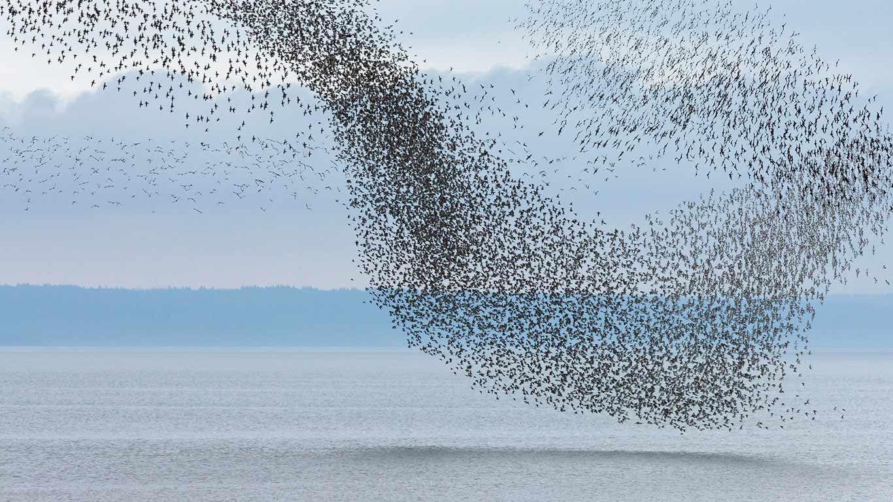

#### 20171018 Windmills in Consuegra, Castilla-La Mancha, Spain (© Juan José Pascual/age fotostock)(Bing United Kingdom)

#### 20171017 Elk River in the East Kootenays of British Columbia, Canada (© Carson Ganci/First Light/age fotostock)(Bing United Kingdom)

#### 20171016 Busard des marais mâle, Vosges, France. (© Fabrice Cahez/Minden Pictures)(Bing France)

#### 20171016 Eland antelope and giraffe at Etosha National Park, Namibia (© David Schultz/Mint Images/SuperStock)(Bing United Kingdom)

#### 20171015 Derwent Reservoir in Derbyshire (© R A Kearton/Getty Images)(Bing United Kingdom)

#### 20171014 Upper Tahquamenon Falls in Tahquamenon Falls State Park, Michigan, USA (© Matt Anderson Photography/Getty Images)(Bing United Kingdom)

#### 20171014 Fall-colored leaves of cotoneaster plant (© Steve Terrill/Danita Delimont)(Bing United States)

#### 20171014 Frond in autumn colours, Gros Morne National Park, Newfoundland (© S Meyers/Age Fotostock)(Bing Canada)

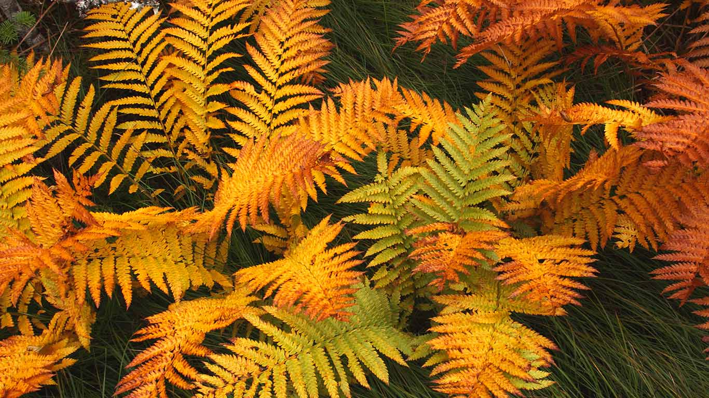

#### 20171013 Coastal beech forest, Nienhagen, Germany (© Sandra Bartocha/Minden Pictures)(Bing United Kingdom)

#### 20171012 The straining tower at Lake Vyrnwy in Powys, Wales (© Joe Daniel Price/Getty Images)(Bing United Kingdom)

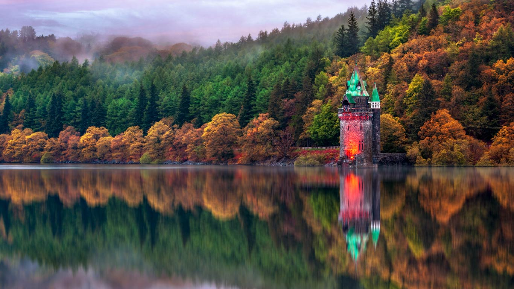

#### 20171012 Rhyolite, a ghost town near Beatty, Nevada (© Devesh V. Tripathi)(Bing United States)

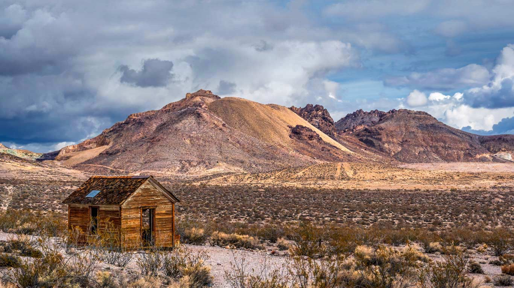

#### 20171011 The Rapa Valley in Sarek National Park, Sweden (© Hans Strand/plainpicture)(Bing United Kingdom)

#### 20171010 A Soyuz descent module returns to Earth (© Bill Ingalls/NASA)(Bing United Kingdom)

#### 20171009 Shaft of sunlight hitting the fall colours of the Dempster Highway, Yukon (© plainpicture/Design Pics/Robert Postma)(Bing Canada)

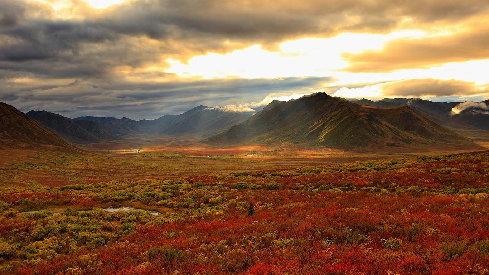

#### 20171009 An infrared image of the Orion Nebula taken from the HAWK-I camera in Chile (© NASA)(Bing United Kingdom)

#### 20171009 【今日寒露】枫叶上的露滴，中国四川华蓥 (© Jerry Tan/age Fotostock)(Bing China)

#### 20171008 火星上的峡谷系统-水手号峡谷地区上的小行星 (© Detlev van Ravenswaay/Getty Images)(Bing China)

#### 20171008 Pluto’s north pole (© J Marshall/Alamy)(Bing United Kingdom)

#### 20171007 Dust devil trails on the surface of Mars (© NASA/JPL/University of Arizona)(Bing United Kingdom)

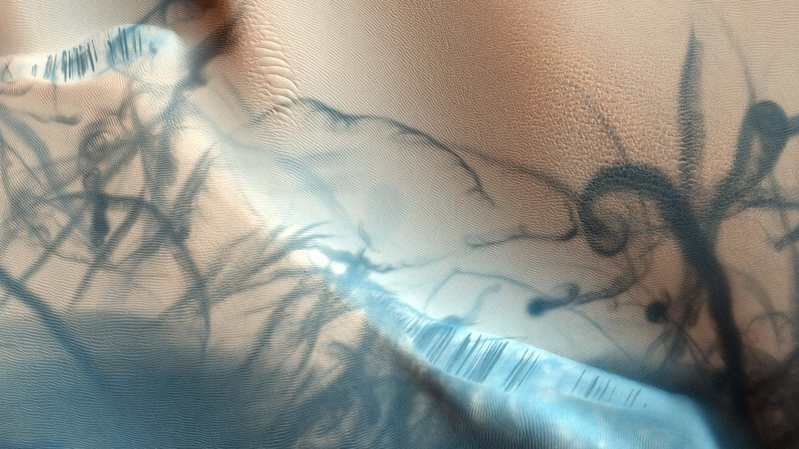

#### 20171006 The International Space Station seen from Space Shuttle Endeavour (© NASA/Alamy)(Bing United Kingdom)

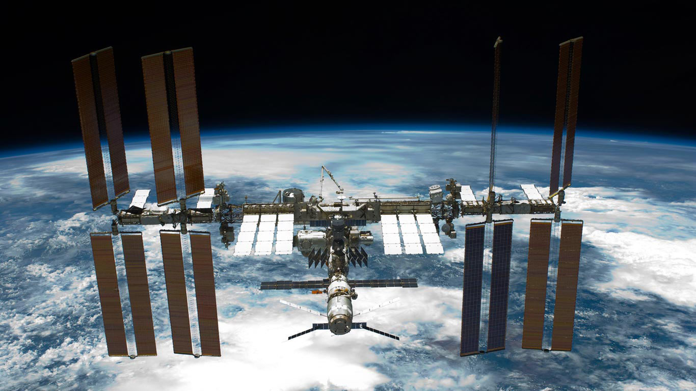

#### 20171005 Full-scale model of the James Webb Space Telescope on display in Austin, Texas, USA (© NASA)(Bing United Kingdom)

#### 20171005 安徽糕点艺术家制作的手工徽式月饼，中国黄山 (© amy Stock Photo)(Bing China)

#### 20171005 ｢満月とクロヅル｣ドイツ, メクレンブルク＝フォアポンメルン州 (© Anagramm/Getty Images)(Bing Japan)

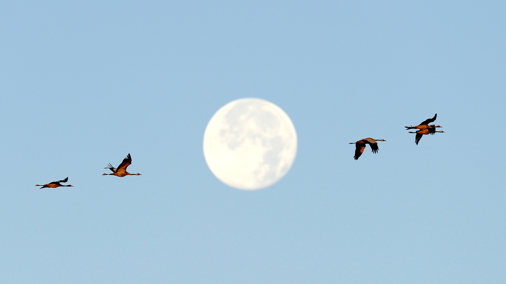

#### 20171004 Molecule Man-Skulptur auf der Spree in Berlin, Deutschland (© Folio Images/Alamy Stock Photo)(Bing Deutschland)

#### 20171004 Buzz Aldrin's boot on lunar soil, Apollo 11 mission (© NASA)(Bing United Kingdom)

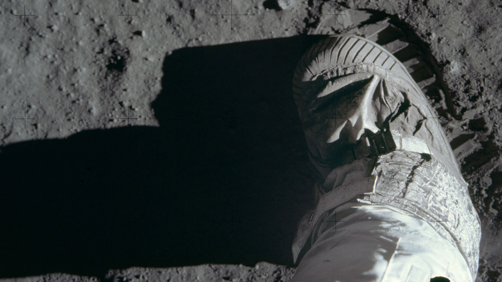

#### 20171003 Timiderte Kasbah, Draa Valley, Morocco (© Mauricio Abreu/Aurora Photos)(Bing United Kingdom)

#### 20171003 Anémone Pulsatille sous la pluie, Lorraine, France. (© Michel Poinsignon/Minden Pictures)(Bing France)

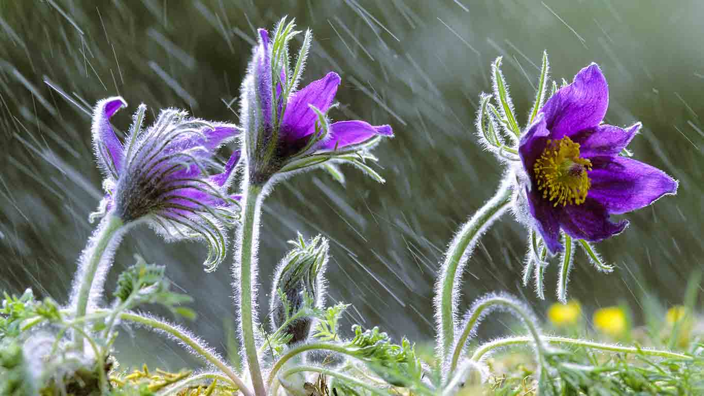

#### 20171002 Fallen sweet chestnuts and Amethyst Deceivers in Norfolk (© Gary K. Smith/Minden Pictures)(Bing United Kingdom)

#### 20171002 国庆节期间街道上飘扬的五星红旗，中国深圳 (© Bartlomiej Magierowski/Alamy Stock Photo)(Bing China)

#### 20171001 York University's school of Engineering (© Roland Shainidze Photogaphy/Getty Images)(Bing Canada)

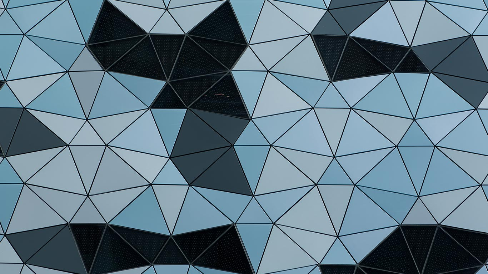

#### 20171001 Cottonwood trees along the Rio Grande in autumn, New Mexico, USA (© Tim Fitzharris/Minden Pictures)(Bing United Kingdom)

