#### 20171130 St Andrews Cathedral in Fife, Scotland (© Abi Warner/Getty Images)(Bing United Kingdom)

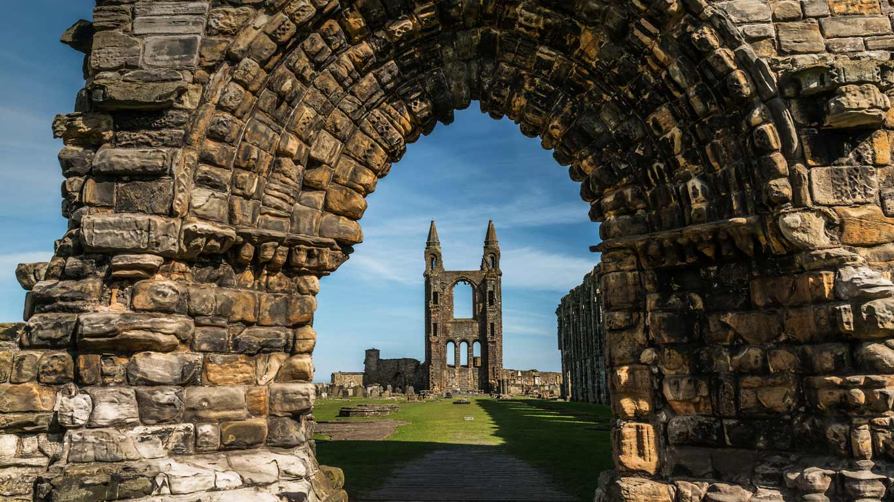

#### 20171129 Los Angeles Union Station, California, USA (© Ted Vancleave/Gallery Stock)(Bing United Kingdom)

#### 20171128 Rice terraces strung with lights, Wajima, Japan (© Sean Pavone/Alamy)(Bing United Kingdom)

#### 20171127 ｢雪の松川温泉｣岩手, 八幡平市 (© JTB MEDIA CREATION, Inc./Alamy Stock Photo)(Bing Japan)

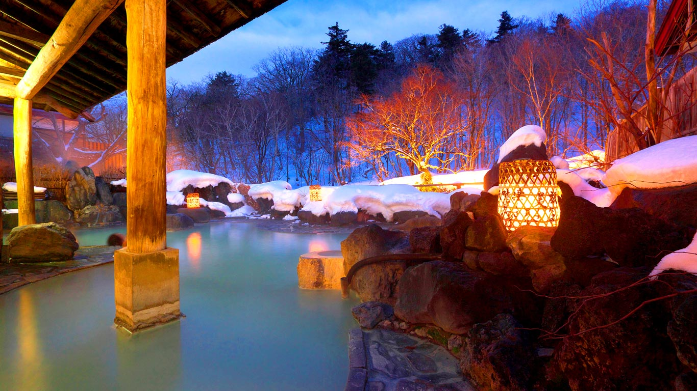

#### 20171127 A badger foraging in the Black Forest, Germany (© Klaus Echle/Minden Pictures)(Bing United Kingdom)

#### 20171126 Red Rock Canyon National Conservation Area, Nevada, USA (© plainpicture/Westend61/Cameron Davidson)(Bing United Kingdom)

#### 20171126 Mésange bleue à la recherche d’insectes, Vosges, France. (© Fabrice Cahez/NPL/Minde)(Bing France)

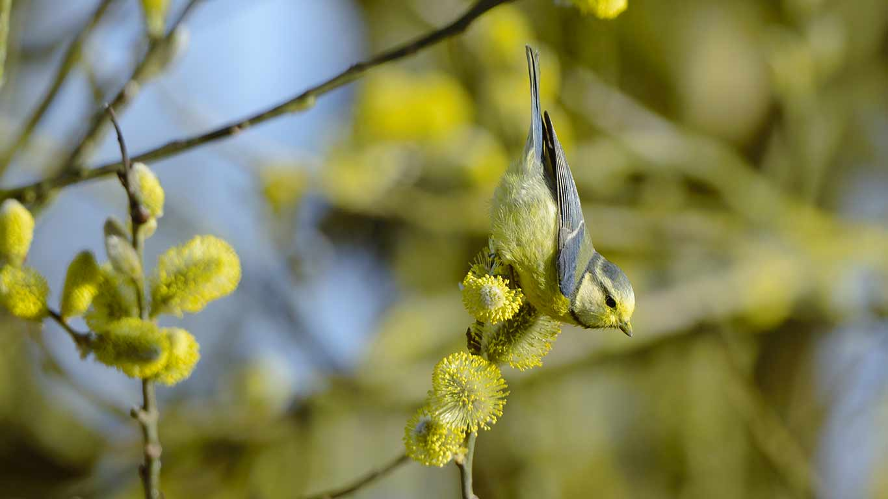

#### 20171125 Starenschwarm in der Abenddämmerung (© Arterra Picture Library/Alamy Stock Foto)(Bing Deutschland)

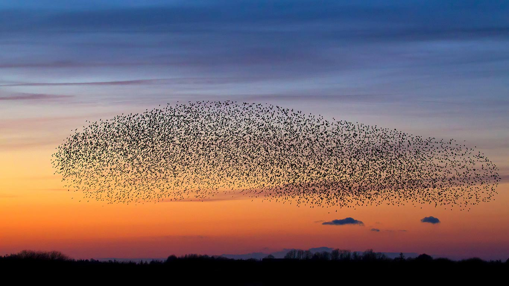

#### 20171125 Pont Saint-Bénézet and Rhône at dusk, Avignon, France (© David Noton/Minden Pictures)(Bing United Kingdom)

#### 20171124 Art installation 'Katena Luminarium' by Architects of Air (© Shirlaine Forrest/WireImage/Getty Images)(Bing United Kingdom)

#### 20171124 Nächtliches Panorama mit Schwabentor, Freiburg, Baden-Württemberg, Deutschland (© imageBROKER/Alamy Stock Photo)(Bing Deutschland)

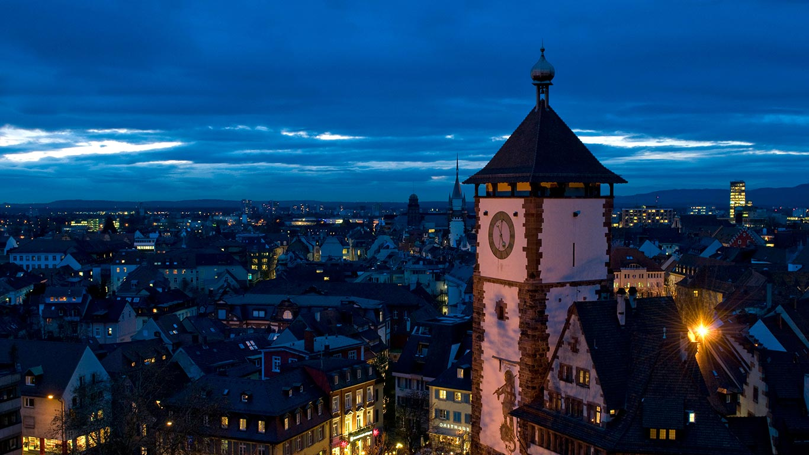

#### 20171123 Turkey tail fungus in Gorbea Natural Park, Spain (© David Santiago Garcia/Aurora Photos)(Bing United States)

#### 20171123 ｢霧氷と紅葉のカラマツ林｣長野, 松本 (© Mitsushi Okada/orion/Getty Images)(Bing Japan)

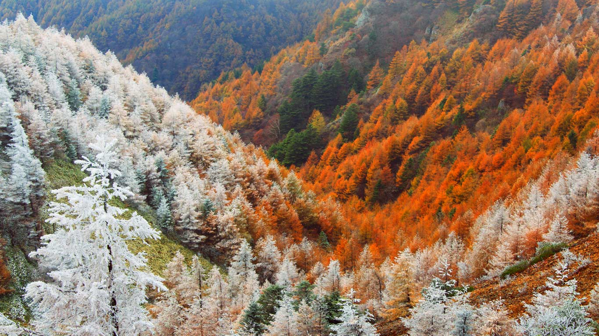

#### 20171123 【今日小雪】老君山山顶上的寺庙夕阳美景，中国河南省洛阳市  (© SergeyOrlov/Design Pics/plainpicture)(Bing China)

#### 20171123 A cricket ball striking the wicket (© Corbis/VCG/Getty Images)(Bing United Kingdom)

#### 20171122 Powys County in Mid Wales (© Graham Lawrence/Aurora Photos)(Bing United States)

#### 20171122 The lighthouses of Warnemünde, Rostock, Mecklenburg-Vorpommern, Germany (© Sandra Kreuzinger/Moment Open/Getty Images)(Bing United Kingdom)

#### 20171121 Oeuvre murale de l’artiste Seth, rue Julienne, 13e arrondissement de Paris, France. (© EQRoy/Shutterstock)(Bing France)

#### 20171121 Galápagos sea lion pups on Santiago Island, Ecuador (© Tui De Roy/Minden Pictures)(Bing United Kingdom)

#### 20171120 ｢カピバラ家族｣ブラジル, パラグアイ川 (© Nick Garbutt/Minden Pictures)(Bing Japan)

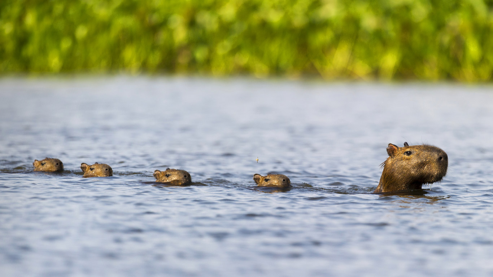

#### 20171120 The Children of the Earth monument at North Cape in Norway (© Cultura/REX/Shutterstock)(Bing United Kingdom)

#### 20171119 The Headwaters Wilderness in Wisconsin, USA (© Ian Shive/Tandem Stills + Motion)(Bing United Kingdom)

#### 20171118 Alpine chamois in Gran Paradiso National Park, Italy (© Marco Ronconi/Offset)(Bing United Kingdom)

#### 20171117 Fûts de vin, Château de Meursault, Bourgogne, France. (© DEA/C. SAPPA/Getty Images)(Bing France)

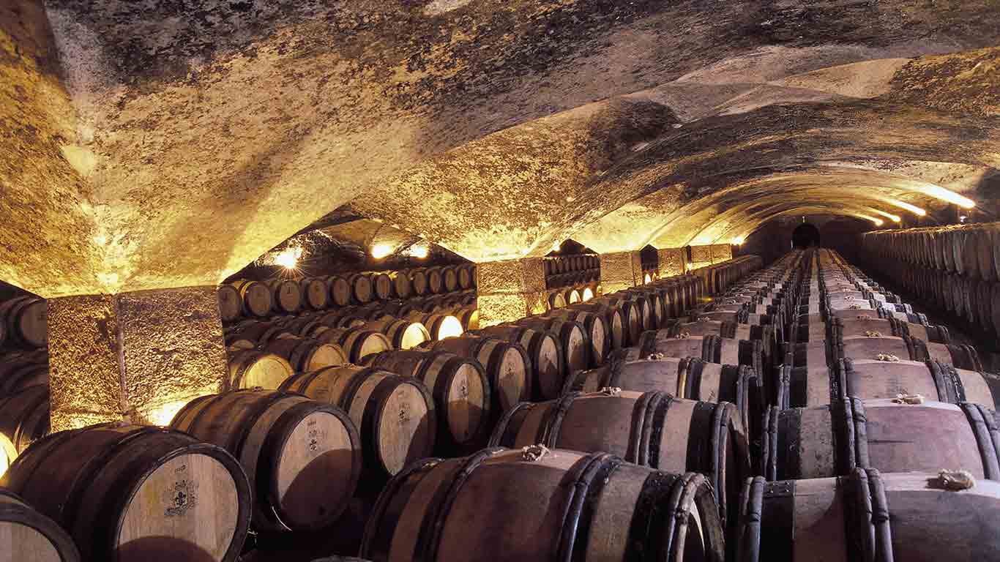

#### 20171117 Ambassador's Hall in the Alcázar of Seville, Spain (© Lucas Vallecillos/age fotostock)(Bing United Kingdom)

#### 20171116 ｢振袖姿の双子｣ (© sot/Gettyimages)(Bing Japan)

#### 20171116 View of Bacuit Bay from El Nido, Palawan, Philippines (© Alex Punker/Nimia)(Bing United Kingdom)

#### 20171115 Newly planted olive groves, Zaghouan, Tunisia (© Yann Arthus-Bertrand/Getty Images)(Bing United Kingdom)

#### 20171114 Rosendale Trestle, Rosendale, New York, USA (© Greg Miller/Gallery Stock)(Bing United Kingdom)

#### 20171113 The Planetarium at the Bibliotheca Alexandrina, Alexandria, Egypt (© Paul Panayiotou/SIME/eStock Photo)(Bing United Kingdom)

#### 20171112 Secretarybird hunting for food in Rietvlei Nature Reserve, South Africa (© Richard du Toit/Getty Images)(Bing United Kingdom)

#### 20171111 New York City Veterans Day parade (© AP Photo/Julio Cortez)(Bing United States)

#### 20171111 Red Poppy (Papaver rhoeas) centre, Middelburg, Netherlands (© Hannie Joziasse/Buiten-beeld/Minden Pictures/Getty Images)(Bing Canada)

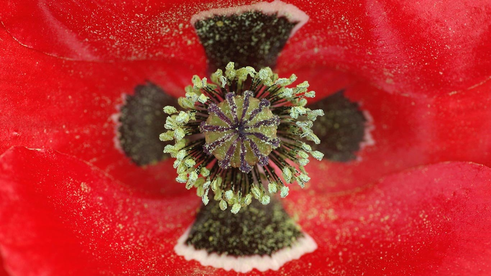

#### 20171111 A field of knitted poppies at the RHS Chelsea Flower Show in 2016 (© Dan Kitwood/Getty Images)(Bing United Kingdom)

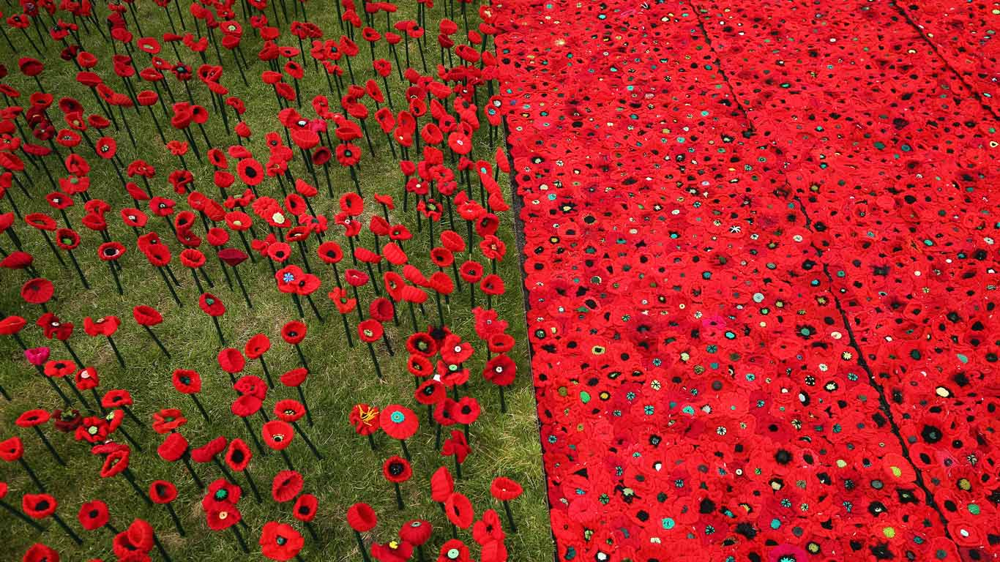

#### 20171110 Panorama of Old Quebec City, Que. (© Chao Photography/Getty Images)(Bing Canada)

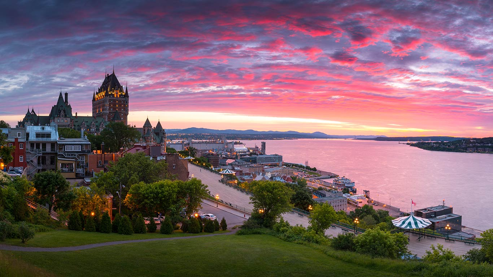

#### 20171110 Castle Trail in Badlands National Park, South Dakota, USA (© Kirkendall-Spring Photographers/NPL/Minden Pictures)(Bing United Kingdom)

#### 20171109 Fish avoid a shark near Heron Island, Australia (© Scott Carr/REX/Shutterstock)(Bing United Kingdom)

#### 20171108 Point Arena Light in California, USA (© plainpicture/Westend61/Spotcatch)(Bing United Kingdom)

#### 20171108 ｢晩秋の蔦沼｣青森, 十和田市 (© katsumi.takahashi/Getty Images)(Bing Japan)

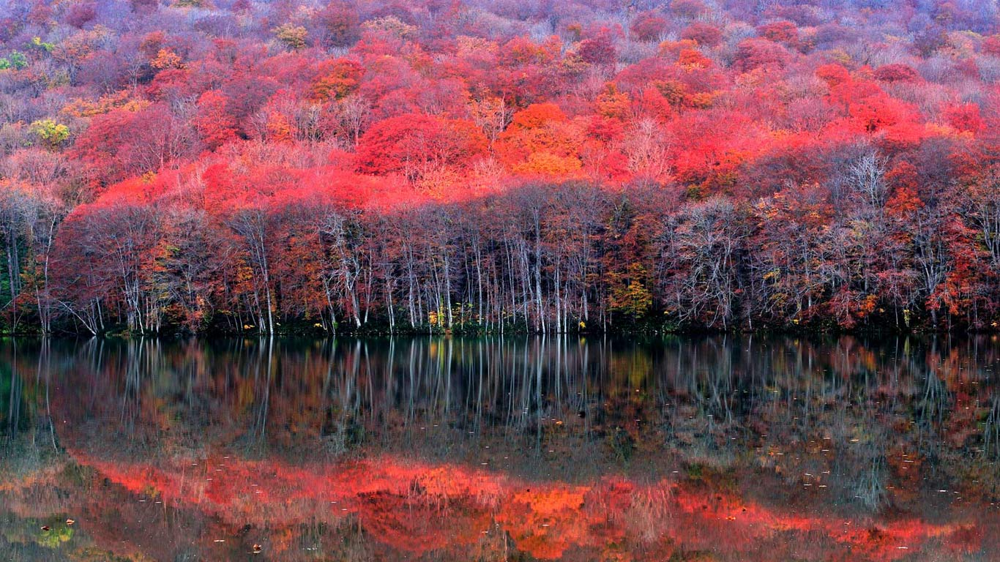

#### 20171107 A weasel looking out of yellow leaves in autumn (© Paul Hobson/NPL/Minden)(Bing United Kingdom)

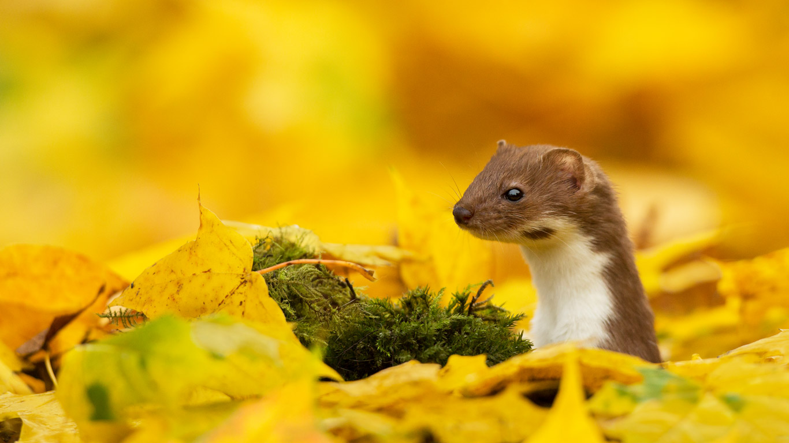

#### 20171107 Rassemblement de montgolfières Mondial Air Ballons, Chambley-Bussières, France. (© Castka/Getty Images)(Bing France)

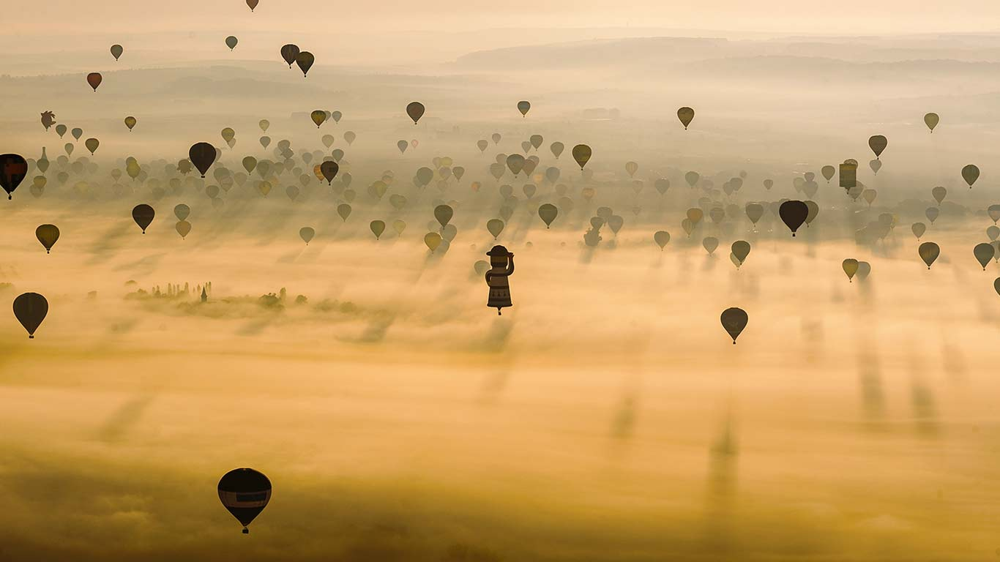

#### 20171107 Ferns in the Oregon side of the Columbia River Gorge (© Marc Adamus/Getty Images)(Bing United States)

#### 20171106 Buda Castle seen from Gellért Hill in Budapest, Hungary (© Ionut David/Alamy)(Bing United Kingdom)

#### 20171105 Fireworks at Land’s End, Cornwall (© David Chapman/Alamy)(Bing United Kingdom)

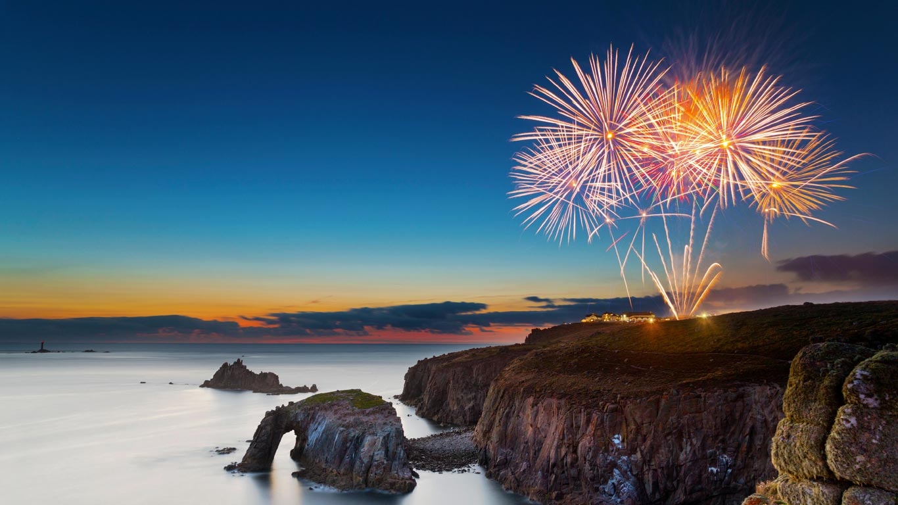

#### 20171105 Pêcheries devant un coucher de soleil, France. (© Gareth Kirkland Photogrphy/Getty Images)(Bing France)

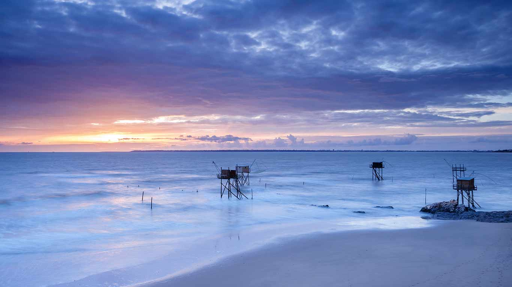

#### 20171105 Astronomical Clock in Prague, Czech Republic (© Godong/UIG/REX/Shutterstock)(Bing Canada)

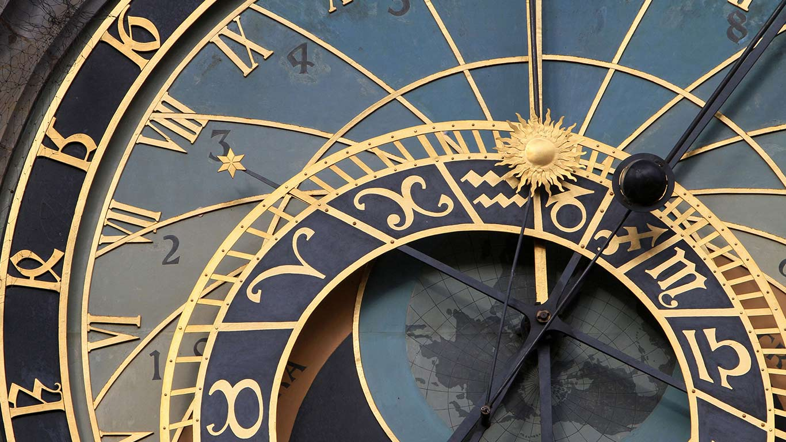

#### 20171104 ｢流鏑馬｣東京, 明治神宮 (© Taro Karibe/Getty Images)(Bing Japan)

#### 20171104 Prusik Peak in the Enchantments of Washington state, USA (© Floris van Breugel/Minden Pictures)(Bing United Kingdom)

#### 20171103 Ta Prohm temple at Angkor, Cambodia (© Stefano Coltelli/Offset)(Bing United Kingdom)

#### 20171102 Shanwangping Karst National Ecological Park outside Chongqing, China (© Chen Chao/Getty Images)(Bing United Kingdom)

#### 20171101 Uummannaq, Greenland (© Gonzalo Azumendi/Getty Images)(Bing United Kingdom)

#### 20171101 ｢ハロウィンのデコレーション｣中国, 遼寧省 (© VCG/Getty images)(Bing Japan)

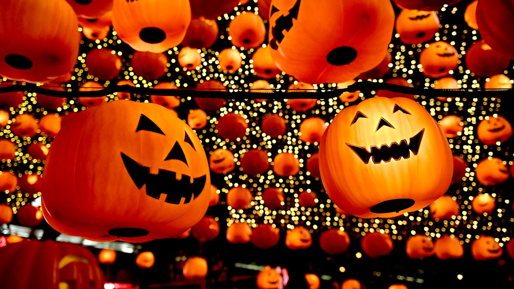

