#### 20171231 New Year’s Eve fireworks in the Nordkette mountain range, Austria (© imageBROKER/Alamy)(Bing United Kingdom)

#### 20171230 The Thames Barrier in London (© John Alexander/plainpicture)(Bing United Kingdom)

#### 20171229 Snow in Zion National Park, Utah, USA (© Jeff Foott/Minden Pictures)(Bing United Kingdom)

#### 20171228 View of Buachaille Etive Mor in the Scottish Highlands (© Gavin82/Getty Images)(Bing United Kingdom)

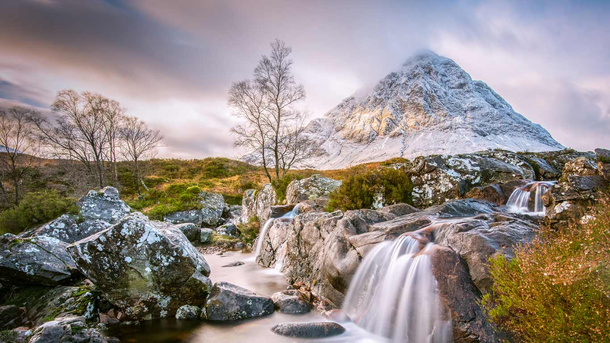

#### 20171227 Central Park in New York City, USA (© Nisian Hughes/Getty Images)(Bing United Kingdom)

#### 20171226 Der Rangsdorfer See im Abendlicht, Brandenburg, Deutschland (© Shotshop GmbH/Alamy Stock Photo)(Bing Deutschland)

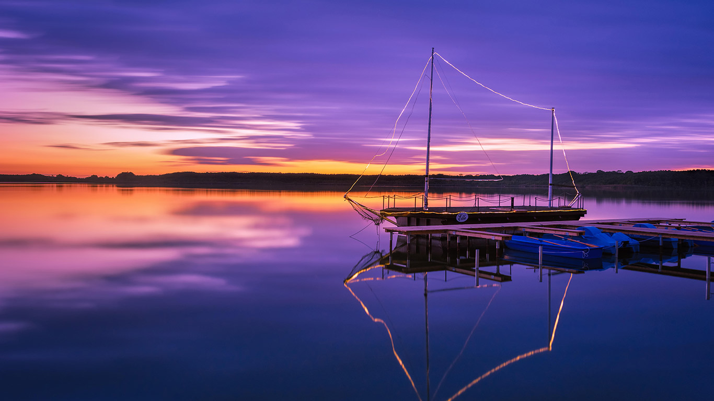

#### 20171226 Edible dormouse sleeping, Alsace, France (© M. Watsonantheo/SuperStock)(Bing United Kingdom)

#### 20171225 Schloss Kranzbach in der Abenddämmerung, Krün, Bayern, Deutschland (© plainpicture/Stock4B)(Bing Deutschland)

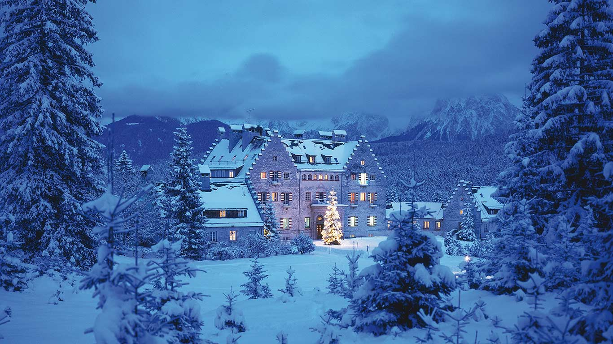

#### 20171225 The Festival of Light at Longleat, Wiltshire (© Gary Morris Photography/Alamy)(Bing United Kingdom)

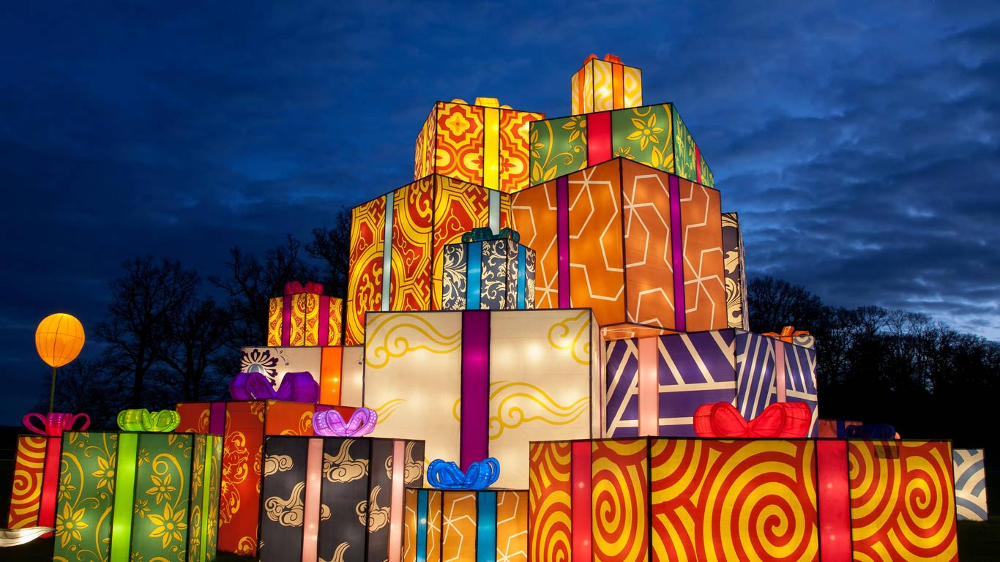

#### 20171225 Northern lights over Finland (© Jorma Luhta/Minden Pictures)(Bing United States)

#### 20171225 ｢五稜郭イルミネーション｣北海道, 函館 (© Sean Pavone/ShutterStock)(Bing Japan)

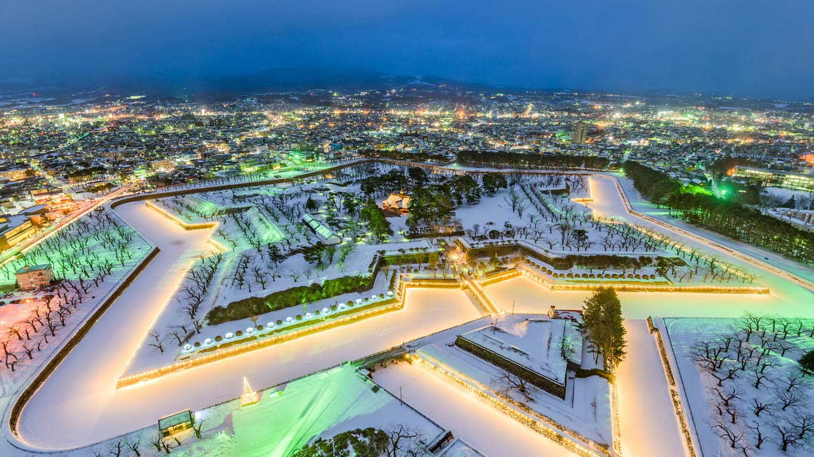

#### 20171225 Une rue de Colmar décorée pour les fêtes de fin d’année, Alsace, France (© Razvan/Getty Images)(Bing France)

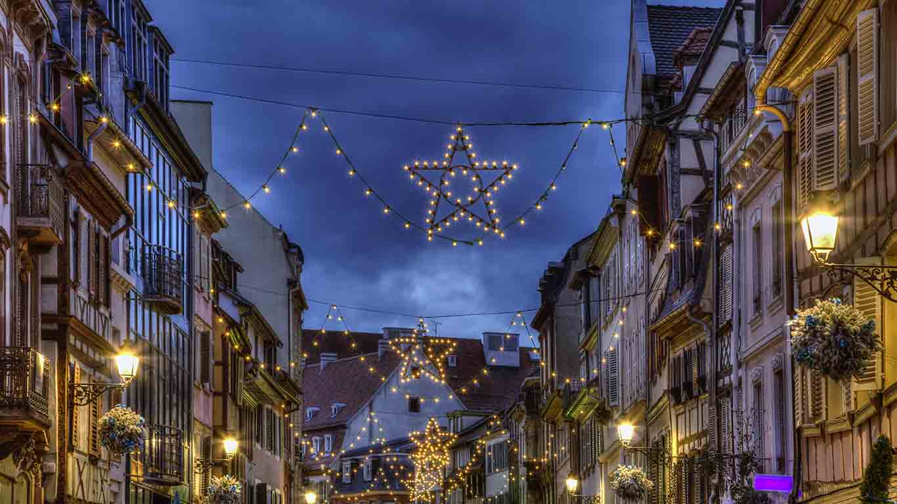

#### 20171224 North Pole (© Sue Flood/Getty Images)(Bing United Kingdom)

#### 20171223 【今日冬至】湖中的天鹅，中国新疆伊犁州 (© SinoImages/Getty Images)(Bing China)

#### 20171223 SantaCon parade in Union Square, San Francisco, California, USA (© Mint Images/Aurora Photos)(Bing United Kingdom)

#### 20171222 Robin perched on a rose hip branch in Norfolk (© Ernie Janes/Minden Pictures)(Bing United Kingdom)

#### 20171222 Capilano Suspension Bridge Park decorated with Christmas lights, Vancouver (© Stefano Politi Markovina/Alamy Stock Photo)(Bing Canada)

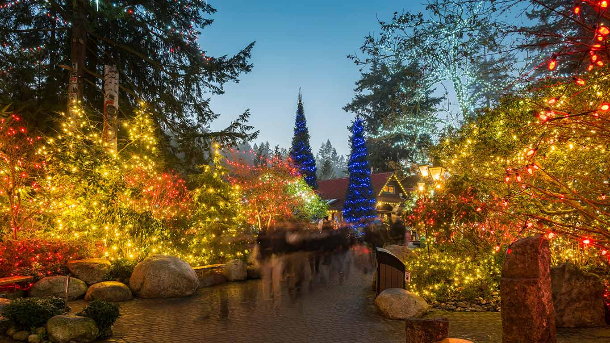

#### 20171221 A grey squirrel peeking out of its den (© Darlyne A. Murawski/Getty Images)(Bing United Kingdom)

#### 20171221 Schloss Wackerbarth, Radebeul, Sachsen, Deutschland (© Gabriele Hanke/imageBROKER/AGE Fotostock)(Bing Deutschland)

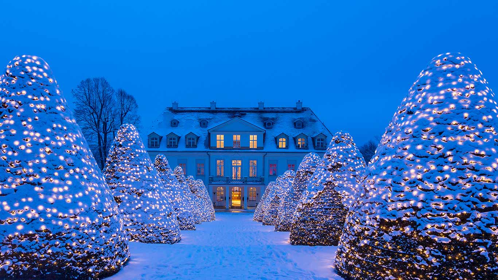

#### 20171220 Train crossing the Tadami River near Mishima village in Japan (© Nuttapoom Amornpashara/Getty Images)(Bing United Kingdom)

#### 20171219 Reindeer lichen in Dartmoor National Park (© Ian Redding/Getty Images Plus)(Bing United Kingdom)

#### 20171219 ｢東京湾アクアライン｣千葉, 木更津 (© JTB Photo/Universal Images Group/Getty Images)(Bing Japan)

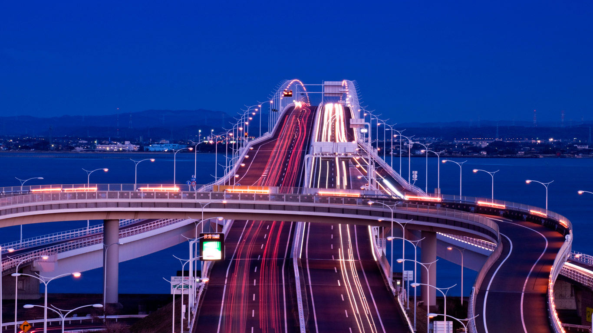

#### 20171218 Star trails above the Christmas tree at Wakehurst, West Sussex (© Andrew Hasson/REX/Shutterstock)(Bing United Kingdom)

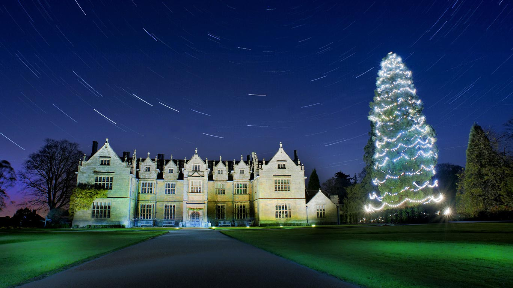

#### 20171217 A snowflake (© Don Komarechka/Science Photo Library)(Bing United Kingdom)

#### 20171216 Tamarack branches with cones in Newfoundland and Labrador, Canada (© Bob Gibbons/Science Photo Library)(Bing United States)

#### 20171216 A swing ride at a Christmas market in Berlin, Germany (© Hannibal Hanschke/Reuters)(Bing United Kingdom)

#### 20171215 Aerial view of Christmas lights along Regent Street in London (© Jason Hawkes/Getty Images)(Bing United Kingdom)

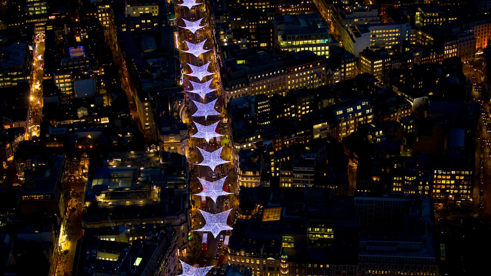

#### 20171214 Japanese macaques in hot springs, Jigokudani Monkey Park, Japan (© Per-Gunnar Ostby/Getty Images)(Bing United Kingdom)

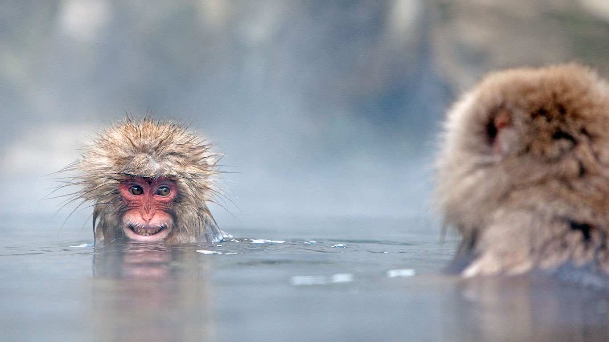

#### 20171213 Weihnachtssterne auf dem Christkindlesmarkt in Nürnberg, Bayern, Deutschland (© Rüdiger Hess/geo-select FotoArt)(Bing Deutschland)

#### 20171213 Freudenberg, Germany (© Iain Masterton/age fotostock)(Bing United Kingdom)

#### 20171212 Gnomes for sale at a Christmas market in Pergine Valsugana, Italy (© Flavia Morlachetti/Moment/Getty Images)(Bing United Kingdom)

#### 20171211 An ancient dzong by Jomolhari mountain, Bhutan (© Alex Treadway/plainpicture)(Bing United Kingdom)

#### 20171210 Siberian jay, Putorana Plateau, Siberia, Russia (© Sergey Gorshkov/Minden Pictures)(Bing United States)

#### 20171210 A peppermint sea star in a soft coral tree near the Seychelles (© Norbert Wu/Minden Pictures)(Bing United Kingdom)

#### 20171210 View of Parliament buildings from Plaza Bridge, Ottawa (© Aqnus Febriyant/Shutterstock)(Bing Canada)

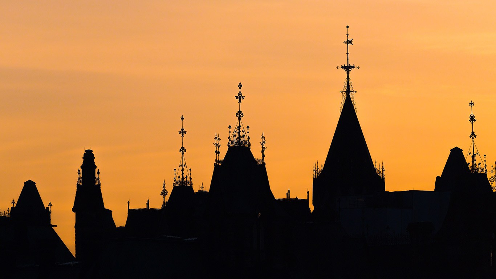

#### 20171209 Parasols rouges et blancs sur une plage de Cagnes-sur-Mer, Provence-Alpes-Côte d'Azur, France (© Clodio/Getty Images)(Bing France)

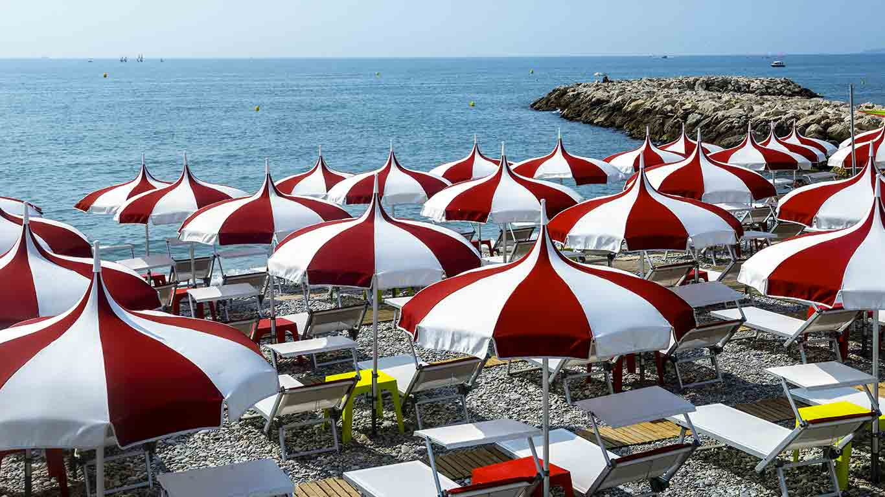

#### 20171209 Ponte Vecchio, Florence, Italy (© Michele Castellani/Alamy)(Bing United Kingdom)

#### 20171208 ｢雪の白川郷｣岐阜, 白川村 (© JTB MEDIA CREATION, Inc./Alamy Stock Photo)(Bing Japan)

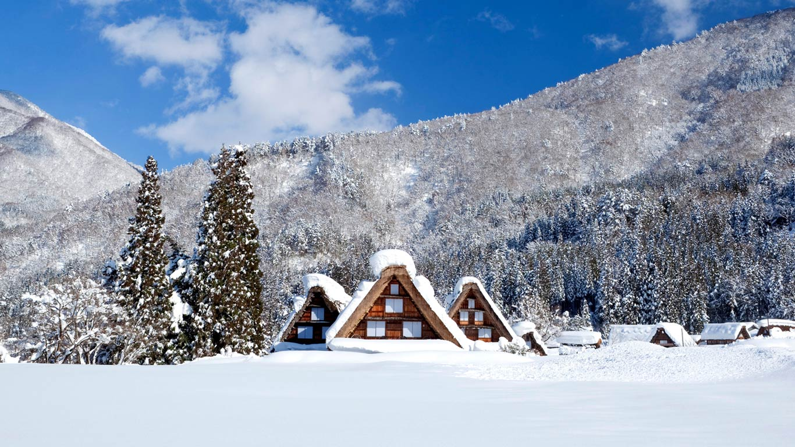

#### 20171208 Végétation subaquatique dans la Loire près de Digoin, Saône-et-Loire (© Yann Arthus-Bertrand/Getty Images)(Bing France)

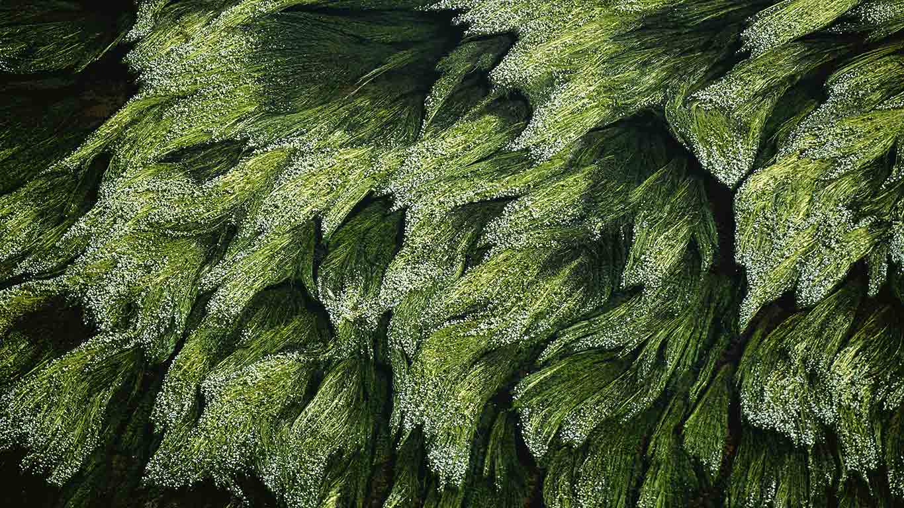

#### 20171208 【今日大雪】暴风雪中两只在树干上攀爬的大熊猫，中国四川 (© Juan Carlos Munoz/NPL/Minden Pictures)(Bing China)

#### 20171208 Sibelius Monument, Helsinki, Finland (© Ville Heino/500px)(Bing United Kingdom)

#### 20171208 King William Bridge underpass illuminated in Adelaide, Australia (© Andrey Moisseyev/Alamy)(Bing Australia)

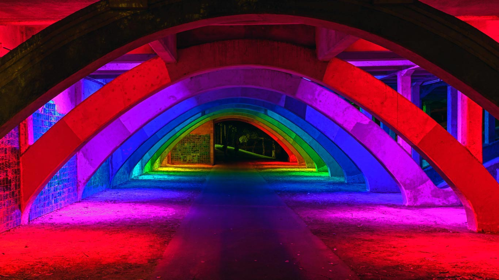

#### 20171207 Enlisted personnel on the USS Halsey in 2016 commemorating the 75th anniversary of the attack on Pearl Harbor in Honolulu, Hawaii (© Kent Nishimura/Getty Images)(Bing United States)

#### 20171207 Aerial view of Schwetzingen Palace gardens, Baden-Württemberg, Germany (© aerial-photos.com/Alamy)(Bing United Kingdom)

#### 20171207 Christmas in Butchart Gardens, Victoria, B.C. (© 2009fotofriends/Shutterstock)(Bing Canada)

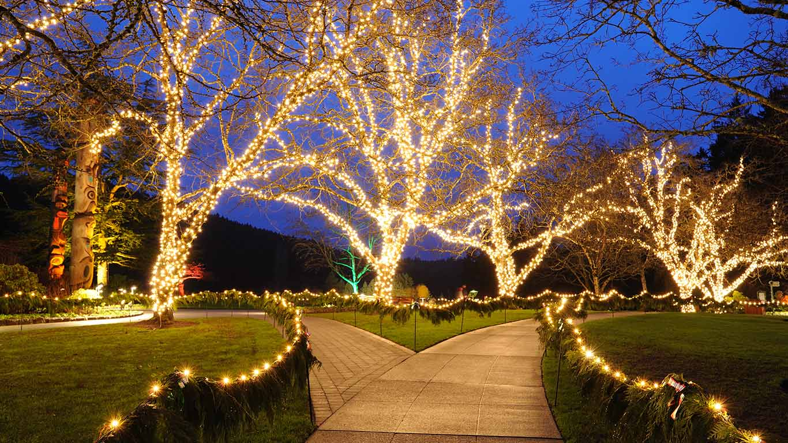

#### 20171206 Matusevich Glacier in Antarctica (© NASA)(Bing United Kingdom)

#### 20171206 Gwaii Haanas National Park Reserve, Haida Gwaii, B.C. (© Stuart McCall/Getty Images)(Bing Canada)

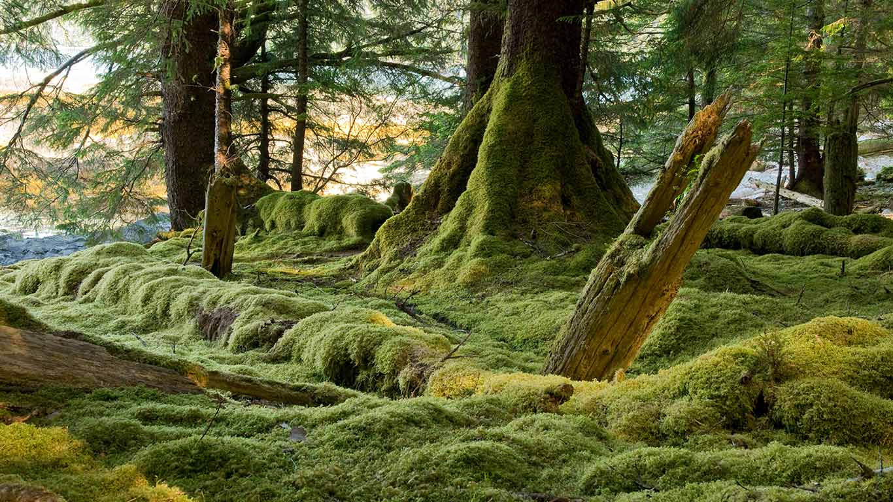

#### 20171205 The seafront and promenade of Aberystwyth in Ceredigion, Wales (© Riccardo Spila/SIME/eStock Photo)(Bing United Kingdom)

#### 20171204 Motherboard of a computer (© Antonio Romero/Science Photo Library)(Bing United Kingdom)

#### 20171203 Male muskoxen near Prudhoe Bay, Alaska, USA (© Oliver Smart/Alamy)(Bing United Kingdom)

#### 20171202 Potash evaporation ponds in the desert near Moab, Utah (© Jassen Todorov/Solent News/REX/Shutterstock)(Bing United States)

#### 20171202 Piraputanga schooling in the Cerrado, Brazil (© Luciano Candisani/Minden Pictures)(Bing United Kingdom)

#### 20171201 Interior of the Palau de les Arts Reina Sofia in Valencia, Spain (© AWL Images/Masterfile)(Bing United Kingdom)

