#### 20180131 Une Hermine arborant son pelage d’hiver dans la neige, Jura, France (© Tim Fitzharris/Minden Pictures)(Bing France)

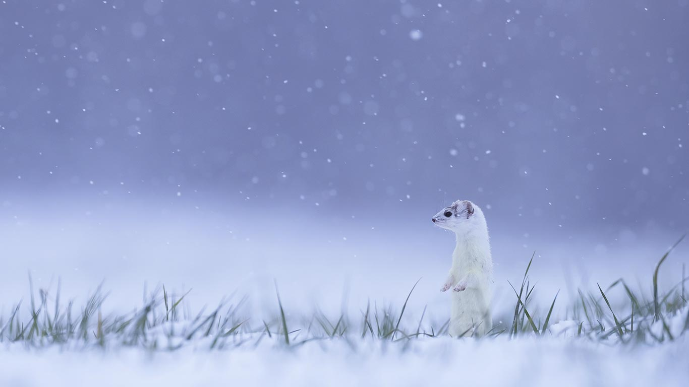

#### 20180131 Sunbeams across Tartu County, Estonia (© Sven Zacek/Minden Pictures)(Bing United States)

#### 20180131 Hoar frost on Downham Hill near Uley, Gloucestershire (© Peter Adams/Offset)(Bing United Kingdom)

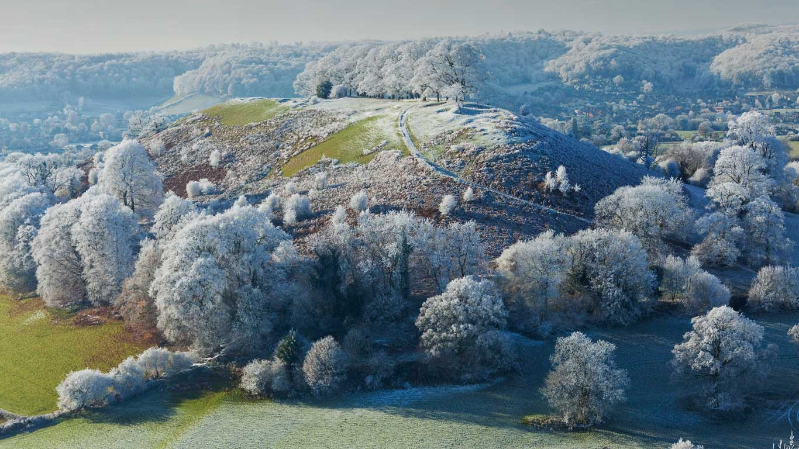

#### 20180130 Close-up of a male Dall sheep exhibiting dominant behaviour, Yukon (© plainpicture/Design Pics/Mark Newman)(Bing Canada)

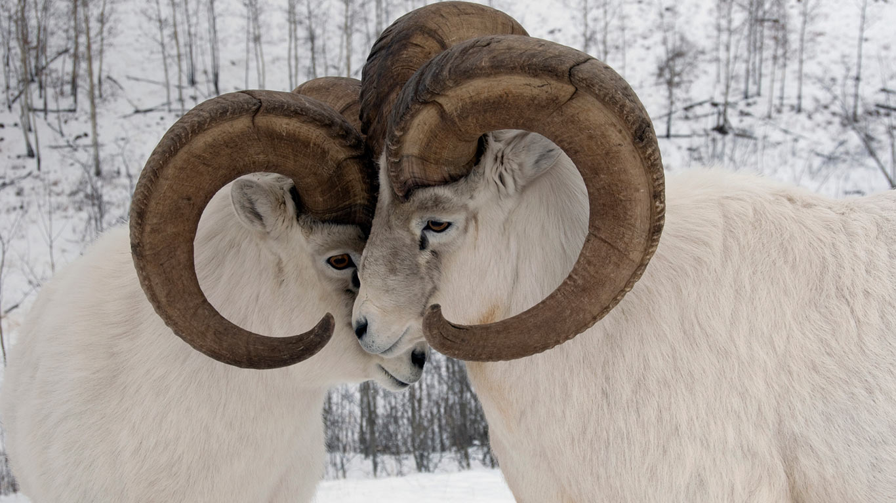

#### 20180130 Idyllische Winterlandschaft in den Alpen mit Blick auf die Wallfahrtskirche Maria Gern und den Watzmann, Bayern, Deutschland (© MacEaton/Alamy Stock Foto)(Bing Deutschland)

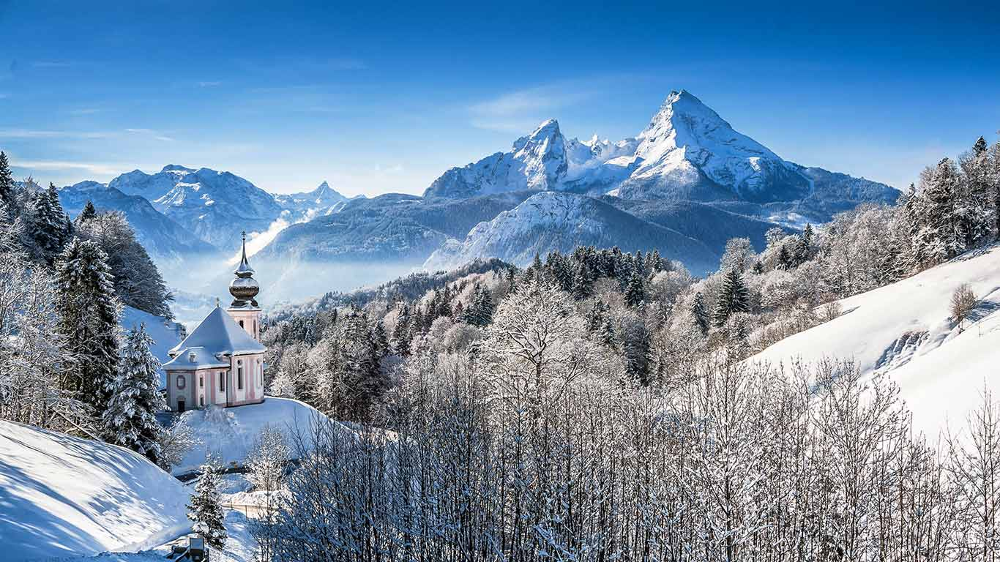

#### 20180130 Watson Lake in Granite Dells, Arizona, USA (© Tim Fitzharris/Minden Pictures)(Bing United Kingdom)

#### 20180129 A vacuum chamber at NASA Glenn Research Center in Cleveland, Ohio, USA (© NASA)(Bing United Kingdom)

#### 20180128 Winter scenery near Kuhmo, Finland (© Ville Heikkinen/iStock/Getty Images Plus)(Bing United Kingdom)

#### 20180127 Outdoor rink on Pyramid Lake, Jasper, Alberta (© Aaron Black/Getty Images)(Bing Canada)

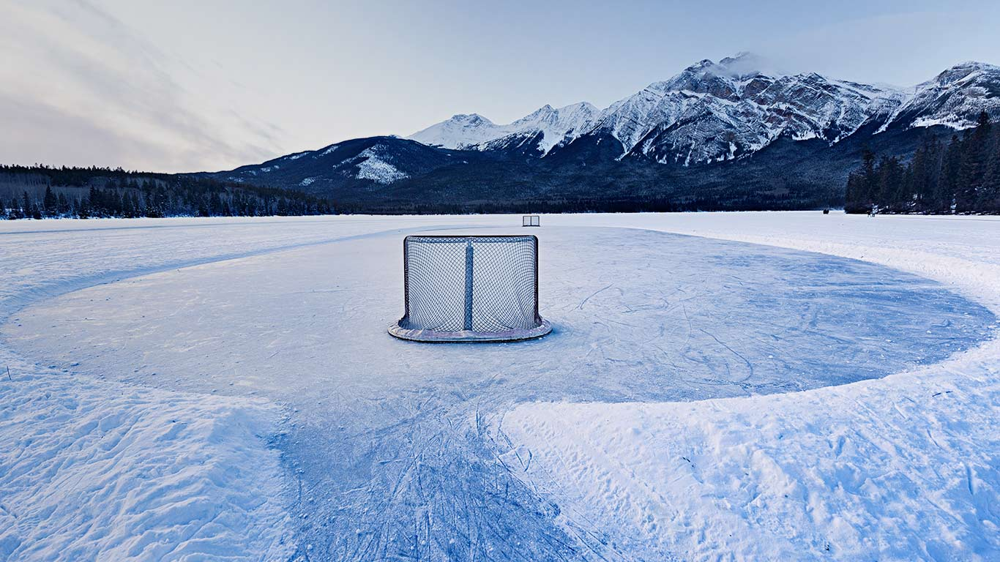

#### 20180127 A chaffinch perched on a snow-covered teasel in Kent (© Robert Canis/Minden Pictures)(Bing United Kingdom)

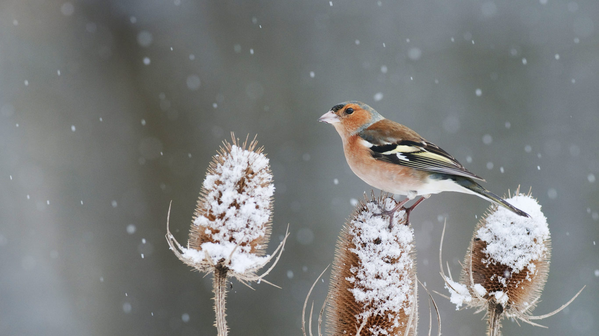

#### 20180127 Bioluminescent plankton at Trwyn Du Lighthouse on Anglesey in Wales (© REX/Shutterstock)(Bing United States)

#### 20180126 Eastern grey kangaroos in Australia’s Kosciuszko National Park (© Jochen Schlenker/Masterfile)(Bing United Kingdom)

#### 20180125 Sami lavvu structures, Finnmark, Norway (© Céleste Manet/plainpicture)(Bing United Kingdom)

#### 20180124 Fontainhas village on Santo Antão island, the Republic of Cabo Verde (© Guiziou Franck/Getty Images)(Bing United Kingdom)

#### 20180123 Lençóis Maranhenses National Park in Barreirinhas, Brazil (© Rudi Sebastian/plainpicture)(Bing United Kingdom)

#### 20180123 Der Untere Bodewasserfall bei Braunlage im Harz, Niedersachsen, Deutschland (© LianeM/Shutterstock)(Bing Deutschland)

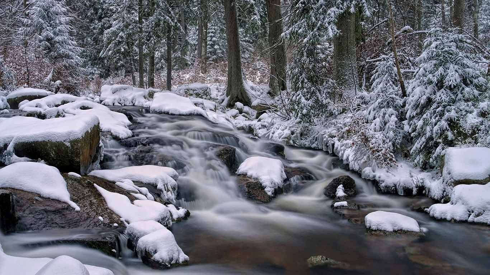

#### 20180122 Bird’s-eye view of the Golden Gate Bridge, San Francisco, California, USA (© Alex Menendez/Aurora Photos)(Bing United Kingdom)

#### 20180121 Red squirrel in Cairngorms National Park, Scotland (© SCOTLAND: The Big Picture/Minden Pictures)(Bing United Kingdom)

#### 20180120 Yellow-eyed penguins at Katiki Point, Moeraki, New Zealand (© Richard Robinson/Aurora Photos)(Bing United Kingdom)

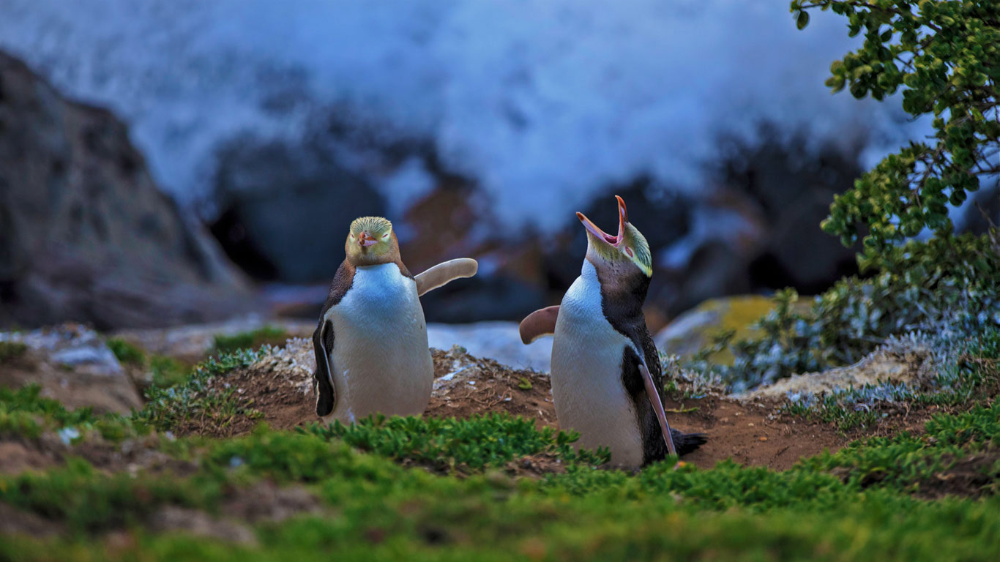

#### 20180120 Un ciel étoilée au dessus de la Chapelle Saint Sébastien, près de Palasca, Corse, France (© Joningall/Getty Images)(Bing France)

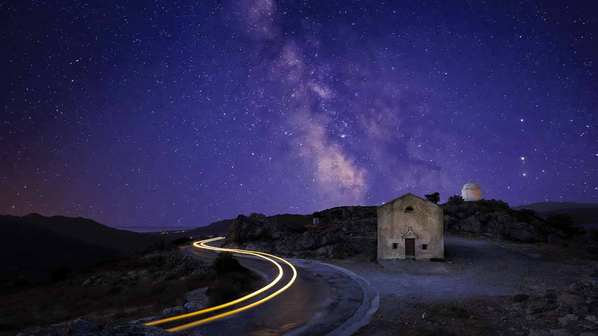

#### 20180119 Old Town in Prague, Czech Republic (© Frank Chmura/age fotostock)(Bing United Kingdom)

#### 20180118 Entoloma hochstetteri mushroom at Lake Mahinapua, New Zealand (© Thysje Arthur/Offset)(Bing United Kingdom)

#### 20180117 Milky Way seen from the coast near Bar Harbor, Maine, USA (© Adam Woodworth/Aurora Photos)(Bing United Kingdom)

#### 20180116 Lionfish swimming off the coast of Indonesia (© David Fleetham/Visuals Unlimited, Inc.)(Bing United Kingdom)

#### 20180116 Sonnenaufgang an der Ach, Uffing am Staffelsee, Bayern, Deutschland (© Reinhard Schmid/Huber Images/eStock Photo)(Bing Deutschland)

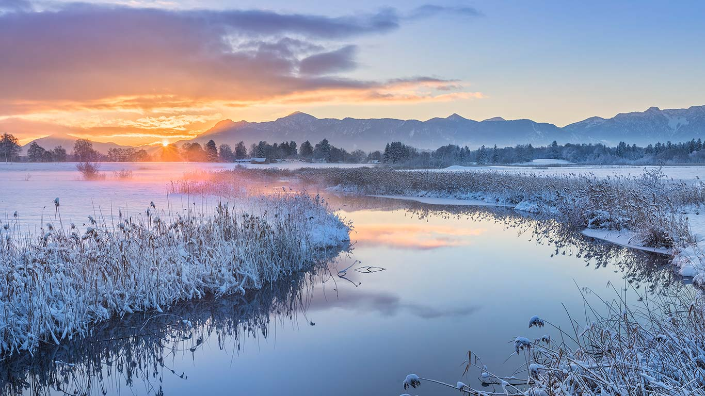

#### 20180115 Dr. Martin Luther King, Jr. Memorial in Washington, DC (© Raymond Boyd/Getty Images)(Bing United States)

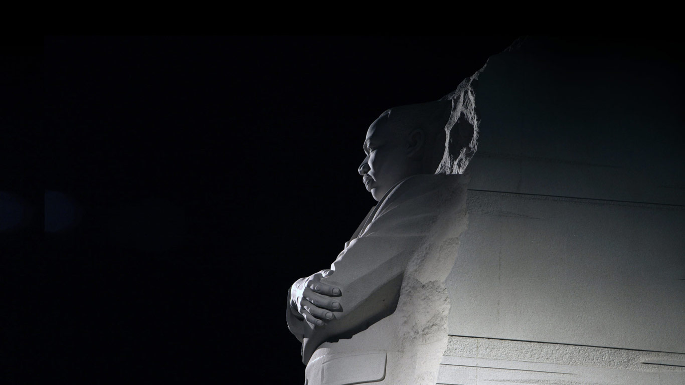

#### 20180115 Petit Séminaire de Quebec, Inner Court. Quebec (© Yves Marcoux/Design Pics/Getty Images)(Bing Canada)

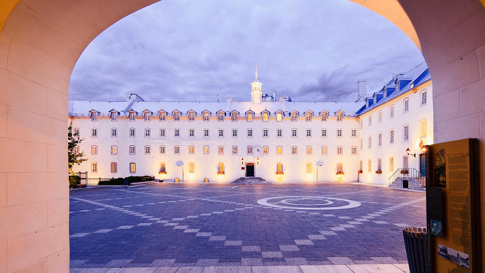

#### 20180115 Highland cattle in winter (© René van den Berg/Alamy)(Bing United Kingdom)

#### 20180114 The island of Sanday in Orkney, Scotland (© Jim Richardson/Getty Images)(Bing United Kingdom)

#### 20180113 Weaver bird nests hanging from an acacia tree in Samburu National Reserve, Kenya (© Bernd Rohrschneider/Minden Pictures)(Bing United Kingdom)

#### 20180113 Fire-damaged forest near Wolf Creek Pass, Colorado (© Peter Essick/Aurora Photos)(Bing United States)

#### 20180113 Cape Spear Lighthouse near St. John’s, Newfoundland (© Michael Hanson/Gallery Stock)(Bing Canada)

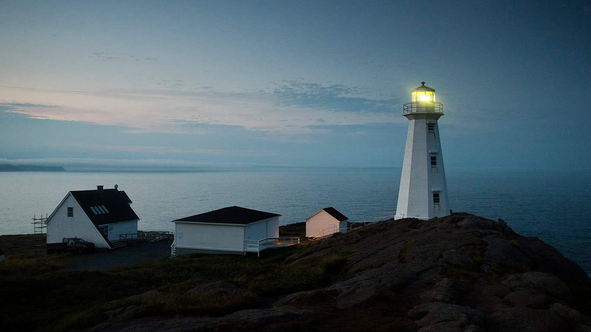

#### 20180112 Al-Khazneh in Petra, Jordan (© Felix Lipov/Shutterstock)(Bing United Kingdom)

#### 20180111 Bow Bridge in Central Park, New York City, USA (© Ultima Gaina/iStock/Getty Images Plus)(Bing United Kingdom)

#### 20180110 Burnham-on-Sea Low lighthouse in Somerset (© Robert Maynard/Alamy)(Bing United Kingdom)

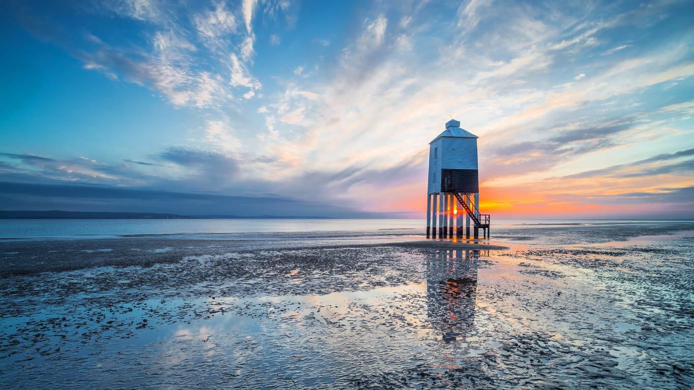

#### 20180109 ｢成人式の晴れ着｣東京, 練馬区 (© KIYOSHI OTA/EPA/REX/Shutterstock)(Bing Japan)

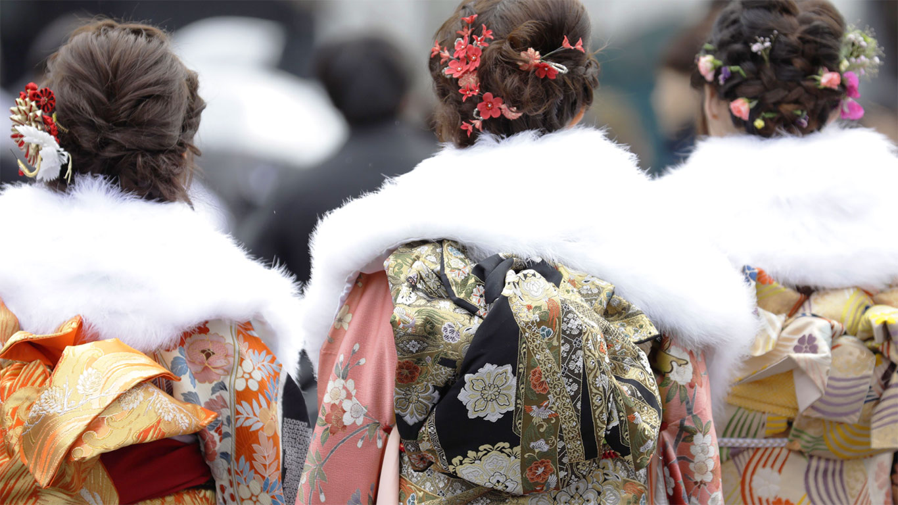

#### 20180109 Great Fountain Geyser, Yellowstone National Park, Wyoming, USA (© lightpix/iStock/Getty Images Plus)(Bing United Kingdom)

#### 20180109 Der Burgbachwasserfall nahe Bad Rippoldsau-Schapbach im Winter, Baden-Württemberg, Deutschland (© Bildagentur Zoonar GmbH/Shutterstock)(Bing Deutschland)

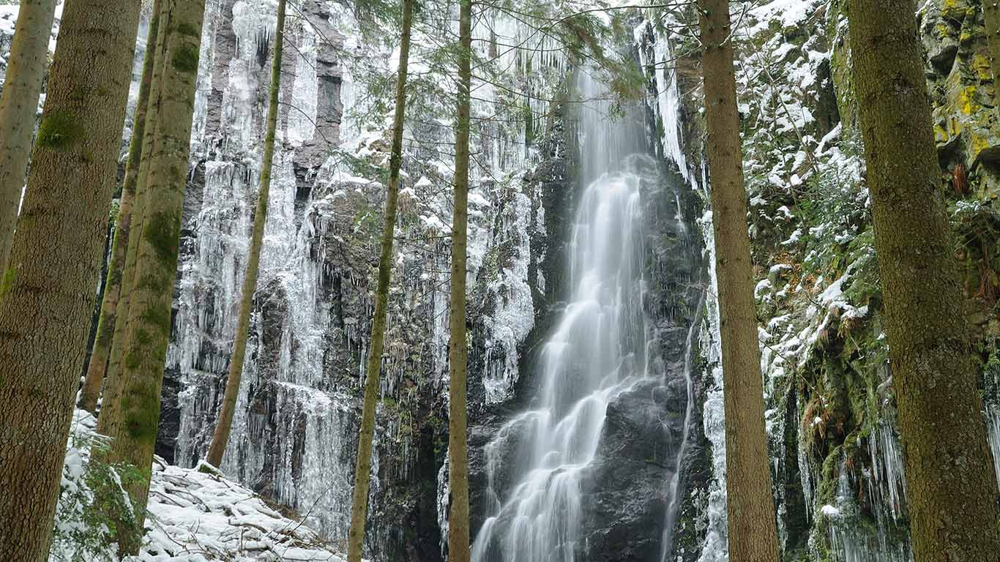

#### 20180108 Gardens by the Bay nature park, Singapore (© Hemis/Alamy Stock Photo)(Bing United Kingdom)

#### 20180107 Stelvio Pass in the Ortler Alps, Italy (© Sandro Bisaro/Getty Images)(Bing United Kingdom)

#### 20180106 Sea otter with pup, Prince William Sound, Alaska, USA (© AlaskaStock/Masterfile)(Bing United Kingdom)

#### 20180105 Bohemian waxwings in Kuusamo, Finland (© Markus Varesvuo/Minden Pictures)(Bing United Kingdom)

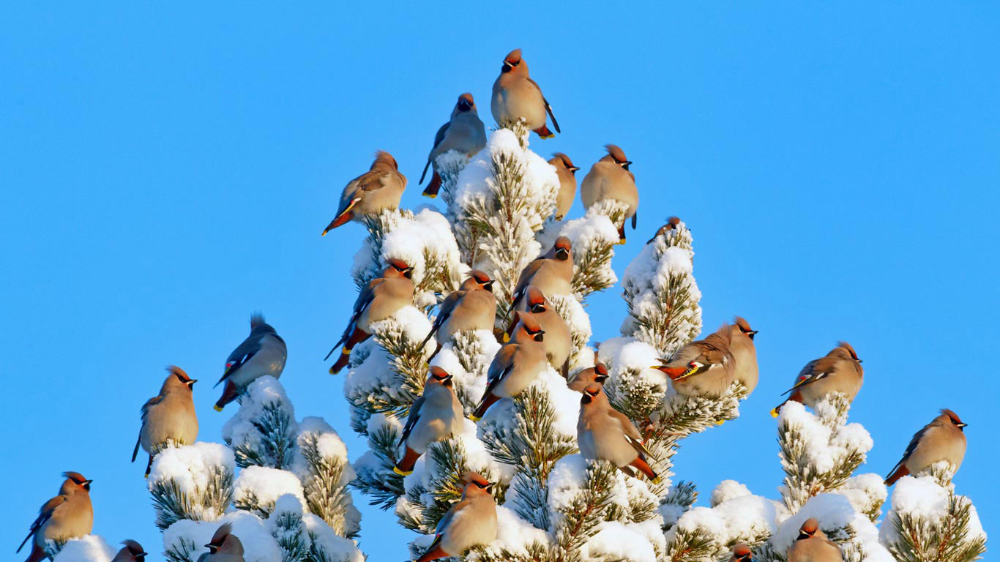

#### 20180104 ｢おみくじ｣東京, 浅草寺 (© Jonathan Chan/Getty Images)(Bing Japan)

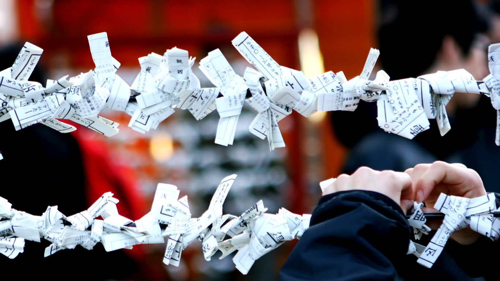

#### 20180104 Cho Gyeong-chul Observatory with star trails, Gangwon Province, South Korea (© Multi-bits/ImaZinS/Getty Images)(Bing United Kingdom)

#### 20180103 Sauna at Lagazuoi in the Dolomites of Italy (© Spotcatch/Westend61/Offset)(Bing United Kingdom)

#### 20180102 Evergreen trees at Lake O'Hara, Yoho National Park, B.C. (© R. Ian Lloyd/Masterfile)(Bing Canada)

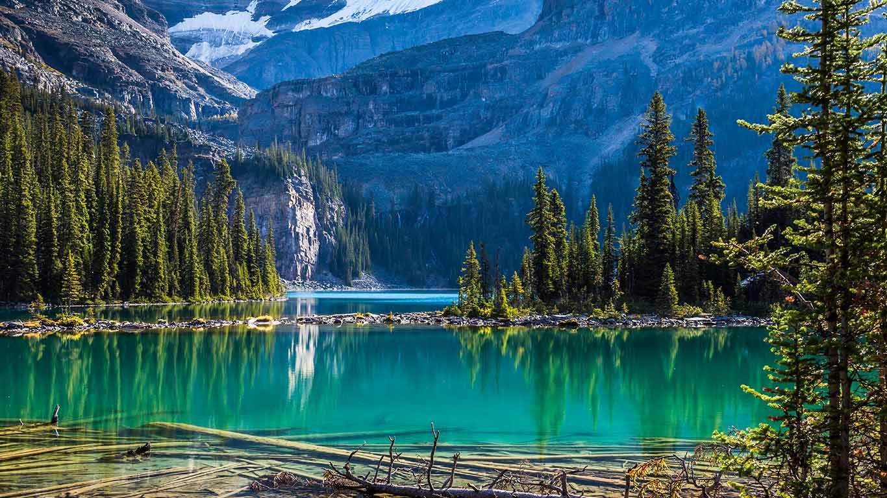

#### 20180102 Renards en balade dans la neige, Vosges, France (© Fabrice Cahez/Minden Pictures)(Bing France)

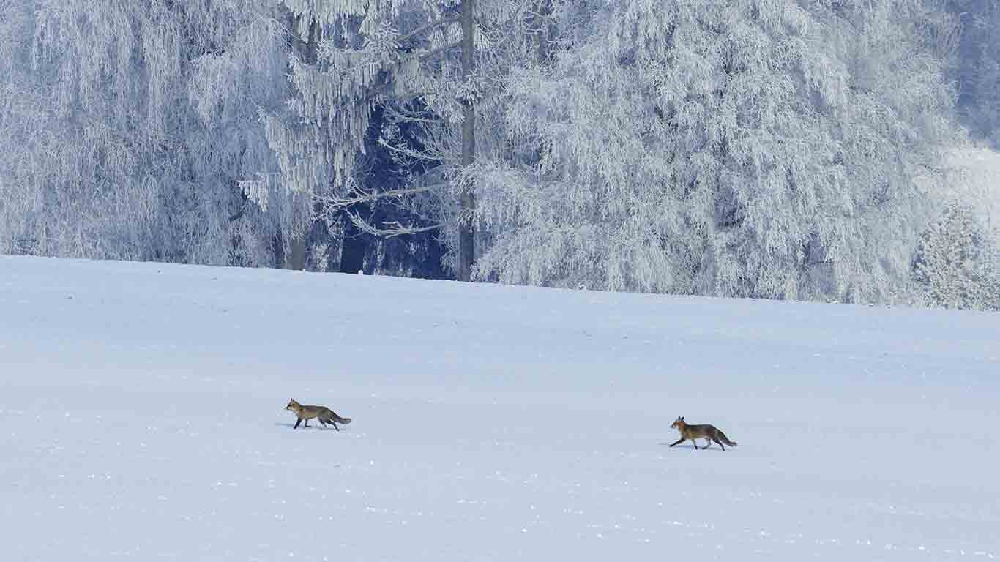

#### 20180102 ｢神磯の鳥居と日の出｣茨城, 大洗磯前神社 (© Masahiro Noguchi/Getty Images)(Bing Japan)

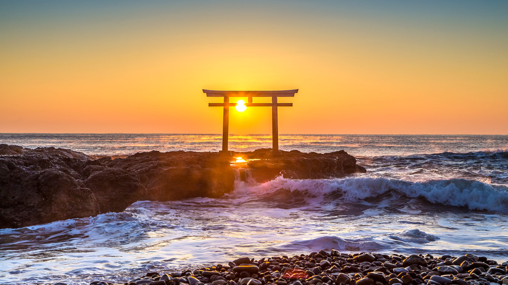

#### 20180102 Green sea turtle (Chelonia mydas) in Hawaii, USA (© Monica & Michael Sweet/Aurora Photos)(Bing United Kingdom)

#### 20180101 Mother polar bear and cubs in Manitoba’s Wapusk National Park, Canada (© Matthias Breiter/plainpicture)(Bing United Kingdom)

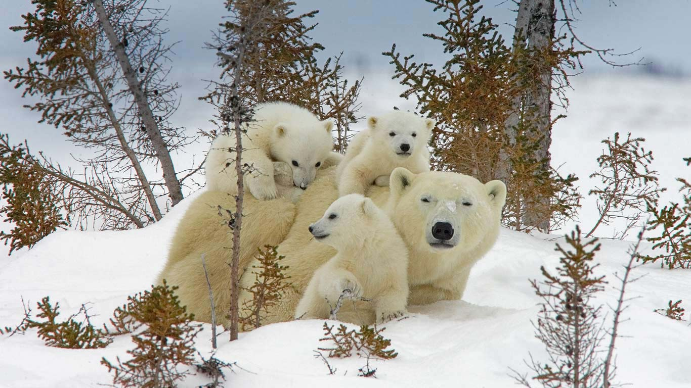

