#### 20180228 Isla del Pescado on the Salar de Uyuni in Bolivia (© Alex Saberi/Getty Images)(Bing United Kingdom)

#### 20180227 Ein Rebhuhn-Paar hat unter einem Baumstamm Schutz vor dem Schnee gesucht, Nationalpark Bayerischer Wald, Deutschland (© Philippe Clement/Minden Pictures)(Bing Deutschland)

#### 20180227 A polar bear near Churchill, Manitoba, Canada (© Alberto Ghizzi Panizza/Minden Pictures)(Bing United Kingdom)

#### 20180226 A leafy seadragon in the waters off Wool Bay, Australia (© Alex Mustard/Minden Pictures)(Bing United Kingdom)

#### 20180226 ｢北野天満宮の梅｣京都, 上京区 (© JTB MEDIA CREATION, Inc./Alamy Stock Photo)(Bing Japan)

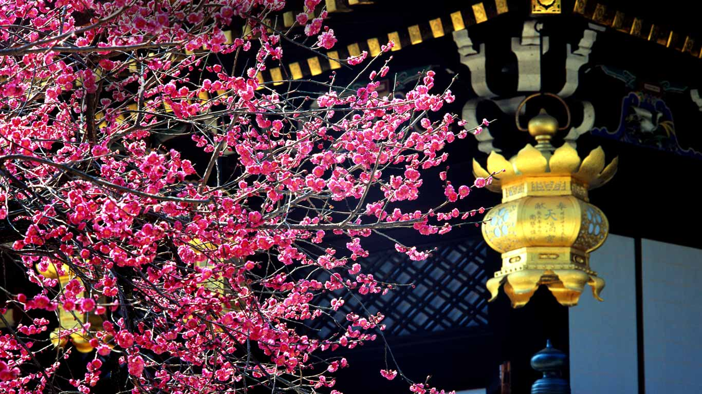

#### 20180225 Fog in Bryce Canyon National Park, Utah, USA (© Eleanor Scriven/plainpicture)(Bing United Kingdom)

#### 20180224 A red fox on the Swiss side of the Jura Mountain range (© Laurent Geslin/NPL/Minden Pictures)(Bing United Kingdom)

#### 20180223 Innerdalsvatna lake, near the village of Ålvundeidet, Norway (© Anders Graham/Turbin Films/Nimia)(Bing United Kingdom)

#### 20180223 Aerial view of Toronto skyline (© Arnold Media/Getty Images)(Bing Canada)

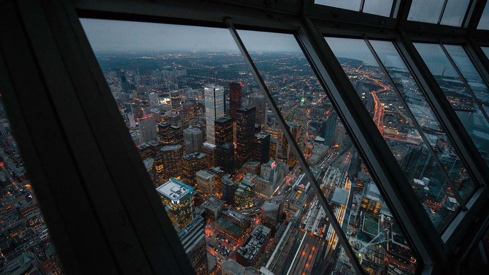

#### 20180222 Roman theatre of Cartagena, Spain (© Luis Davilla/Getty Images)(Bing United Kingdom)

#### 20180221 An electric guitar and amplifier (© Joby Sessions/Guitarist Magazine/Getty Images)(Bing United Kingdom)

#### 20180220 Wintermorgen am Großen Arber, Bayern, Deutschland (© Reinhard Schmid/eStockphoto)(Bing Deutschland)

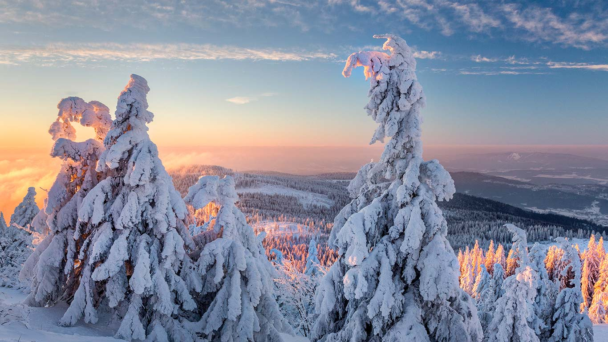

#### 20180220 A statue of a Buddha head in the roots of a tree, Ayutthaya, Thailand (© Garret Suhrie/Tandem Stills + Motion)(Bing United Kingdom)

#### 20180219 Dusk settles on Whistler Mountain in the creekside, Whistler, B.C. (© Insight/Design Pics/Offset)(Bing Canada)

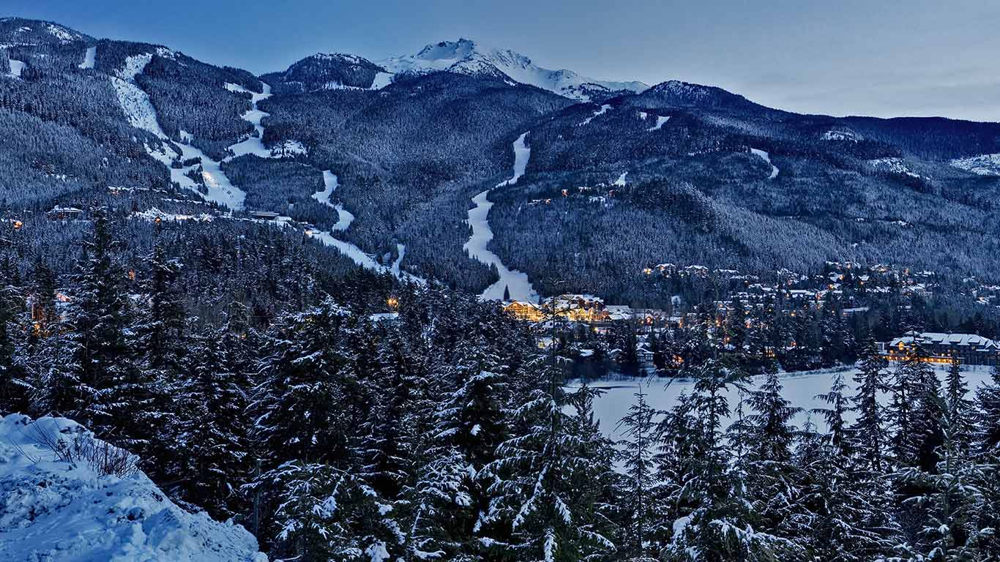

#### 20180219 Thomas Jefferson Memorial reflected in the Tidal Basin, Washington, DC (© Cvandyke/Shutterstock)(Bing United States)

#### 20180219 Saint-Michel chapel on Lake Serre-Ponçon, Hautes-Alpes, France (© Hemis/SuperStock)(Bing United Kingdom)

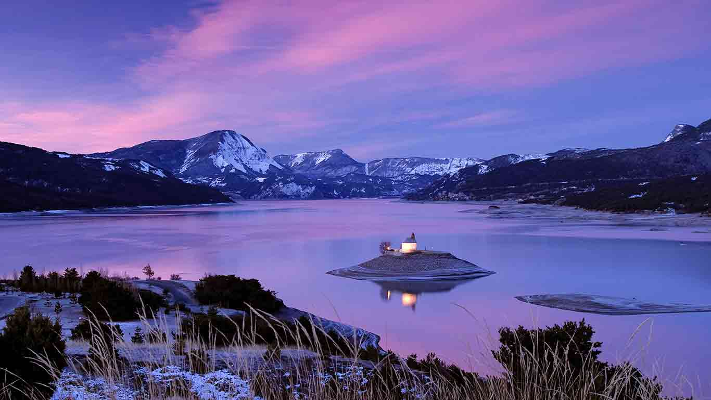

#### 20180218 Sculpture en citrons et oranges pendant la parade de la Fête du citron de Menton (© Panther Media GmbH/Alamy Stock Photo)(Bing France)

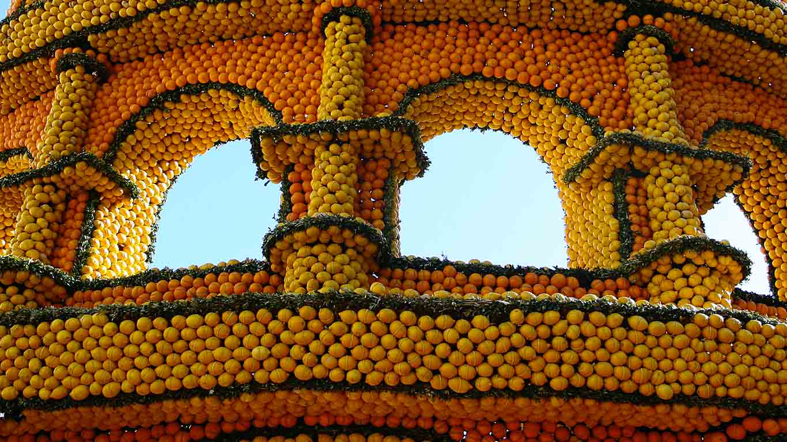

#### 20180218 Great horned owl near Lake Tohopekaliga, Florida, USA (© Matthew Studebaker/Minden Pictures)(Bing United Kingdom)

#### 20180217 【今日春节】写春联庆新春 (© yurouguan/GettyImages)(Bing China)

#### 20180217 An infant Sumatran orangutan in Gunung Leuser National Park, Indonesia (© Cyril Ruoso/Minden Pictures)(Bing United States)

#### 20180217 Aerial view of the Colorado River Delta in Mexico (© Peter McBride/Aurora Photos)(Bing United Kingdom)

#### 20180216 【今日除夕】璀璨烟花迎新年，中国香港 (©Thanapol Kuptanisakorn/ Alamy Stock Photo)(Bing China)

#### 20180216 Artists performing the dragon dance in Chenzhou, Hunan Province, China (© VCG/Getty Images)(Bing United Kingdom)

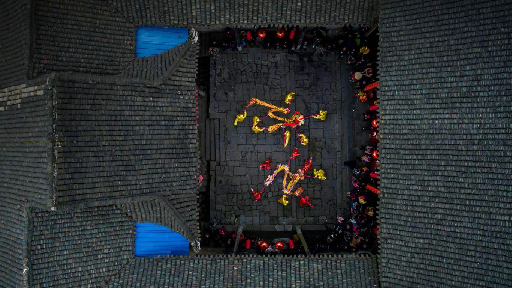

#### 20180215 The Feathers at Frenchman Coulee near Vantage, Washington, USA (© Dan Holz/Tandem Stills + Motion)(Bing United Kingdom)

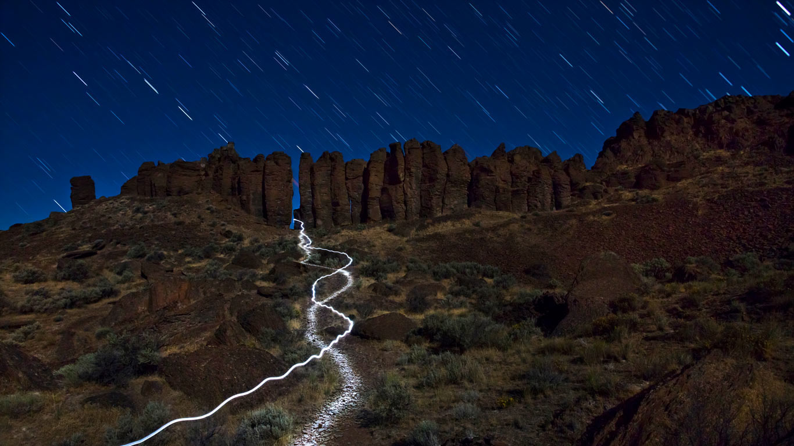

#### 20180214 Aerial view of a heart-shaped field in Trittau, Germany (© imageBROKER/Alamy)(Bing United Kingdom)

#### 20180213 Preservation Hall in New Orleans, Louisiana, USA (© Cosmo Condina/Alamy)(Bing United Kingdom)

#### 20180213 Partnachklamm im Winter, Garmisch-Partenkirchen, Bayern, Deutschland (© lightpix/iStock/Getty Images Plus)(Bing Deutschland)

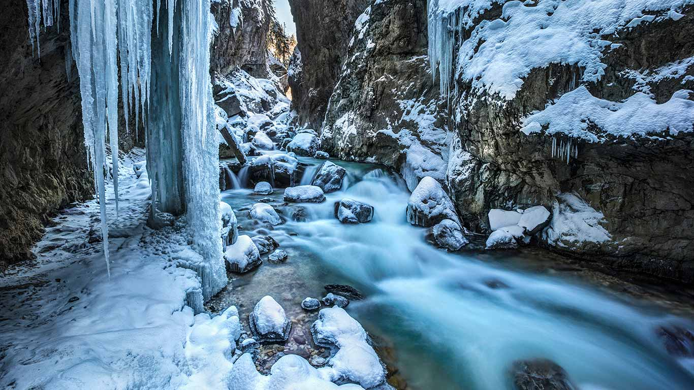

#### 20180212 Yungbulakang Palace in the Tibet Autonomous Region of China (© Yumian Deng)(Bing United Kingdom)

#### 20180212 Contemplative Court fountain at the National Museum of African American History and Culture, Washington, DC (© Edwin Remsberg/Alamy)(Bing United States)

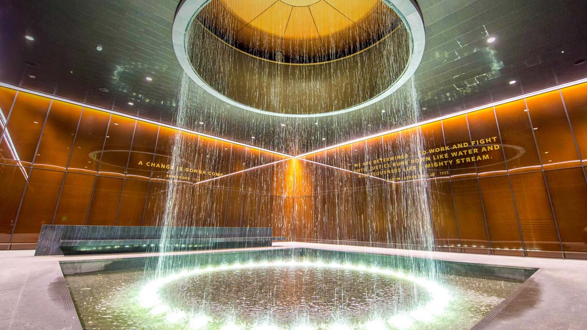

#### 20180211 Te Rewa Rewa Bridge near New Plymouth, New Zealand (© Matthew Williams-Ellis/Aurora Photos)(Bing United Kingdom)

#### 20180211 ｢小樽雪あかりの路｣北海道, 小樽 (© Shayne Hill Xtreme Visuals/Gettiy images)(Bing Japan)

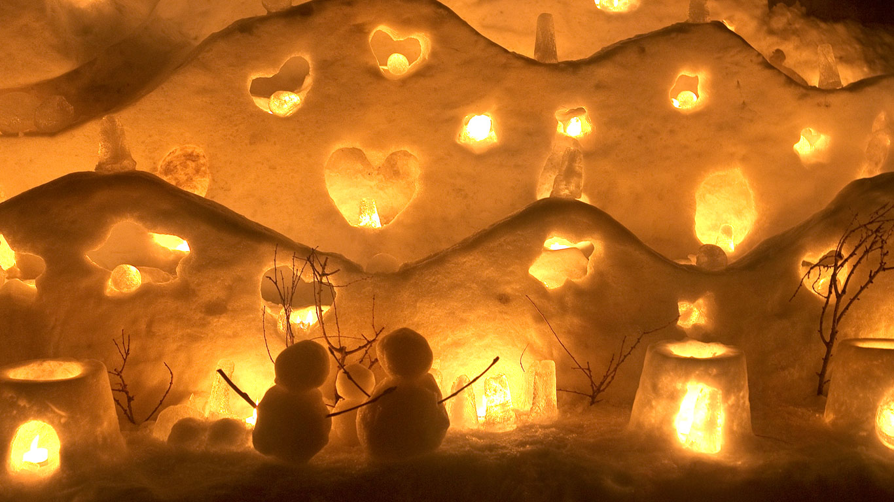

#### 20180211 High angle view of a frozen waterfall, Jasper, Alberta (© Cavan Images/Offset)(Bing Canada)

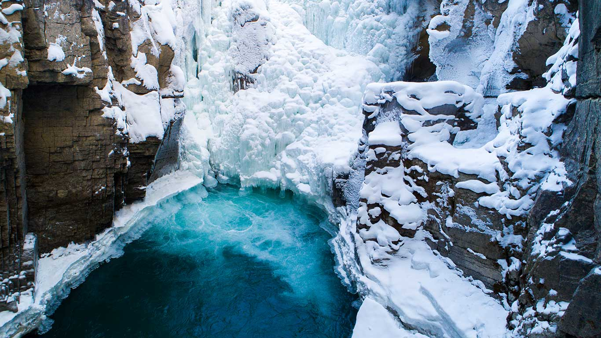

#### 20180210 莫斯科动物园内的一只孟加拉白虎，俄罗斯 (© andamanec/Shutterstock)(Bing China)

#### 20180210 Bonifacio on the island of Corsica, France (© Hemis/Alamy)(Bing United Kingdom)

#### 20180209 Speed skaters training at the Gangneung Oval on 4 February 2018 in Pyeongchang, South Korea (© Robert Cianflone/Getty Images)(Bing United Kingdom)

#### 20180208 Light tunnel at Winterlude, Ottawa (© Hasan Mahmud Tipu/Getty Images)(Bing Canada)

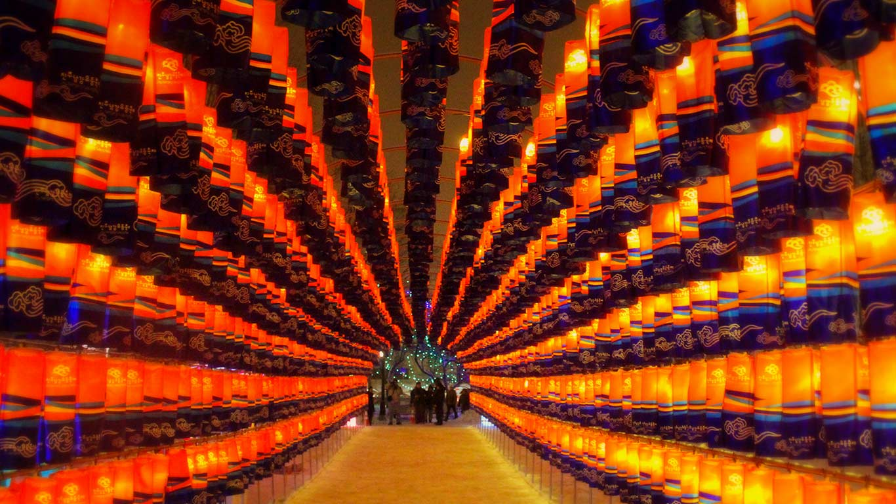

#### 20180208 Vue aérienne sur Le Tréport, en Seine-Maritime, Normandie, France (© Guido Schiefer/Alamy Stock Photo)(Bing France)

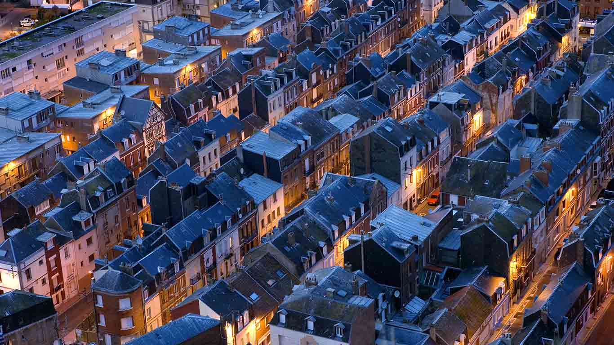

#### 20180208 The Cordillera de la Sal in the Cordillera Domeyko Range of Chile (© Sergio Ballivian/Tandem Stills + Motion)(Bing United Kingdom)

#### 20180207 The Kelpies statues at The Helix, a park in Falkirk, Scotland (© Best Shot Factory/REX/Shutterstock)(Bing United Kingdom)

#### 20180206 Schafherde in der Nähe von Mespelbrunn im Spessart, Bayern, Deutschland (© Rüdiger Hess/geo-select FotoArt)(Bing Deutschland)

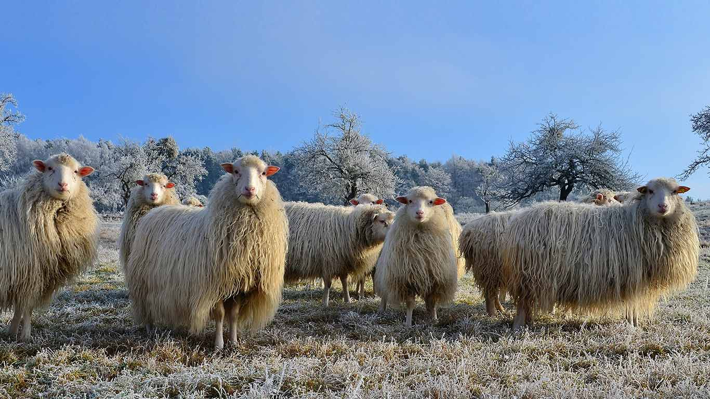

#### 20180206 Maritime forest on Cumberland Island, Georgia (© Chris Moore/Tandem Stills + Motion)(Bing United States)

#### 20180206 Common beech woodland in Compton Abbas, Dorset (© Guy Edwardes/2020VISION/Minden Pictures)(Bing United Kingdom)

#### 20180205 Floating iceberg, Antarctica (© Ray Hems/Getty Images)(Bing United Kingdom)

#### 20180205 【今日立春】周至自然保护区内一只以樱花为食的金丝猴，中国陕西秦岭 (© Florian Möllers/Minden Pictures)(Bing China)

#### 20180204 ｢登別温泉の鬼提灯｣北海道, 登別 (© Blanscape/shutterstock)(Bing Japan)

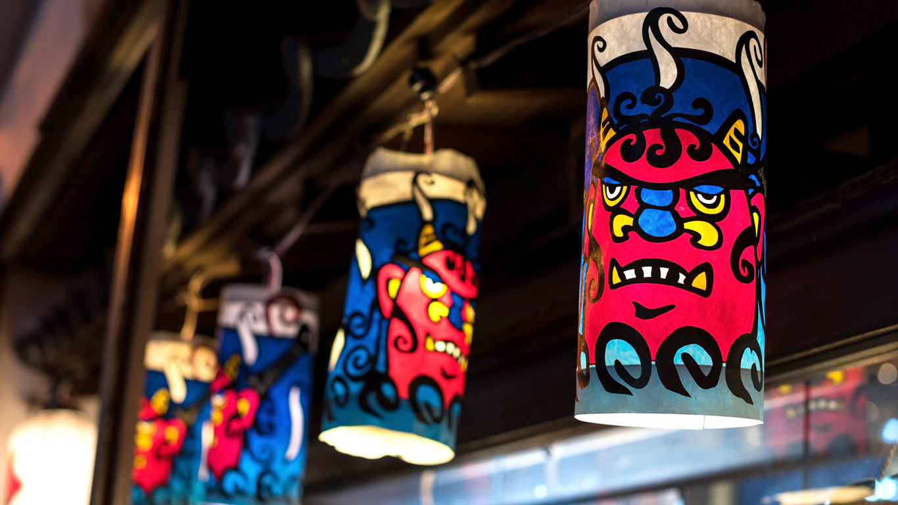

#### 20180204 Male kori bustard, Maasai Mara National Reserve, Kenya (© Christina Krutz/Masterfile)(Bing United Kingdom)

#### 20180203 Rugby line-out sculpture outside Twickenham Stadium, London, England (© Greg Balfour Evans/Alamy)(Bing United Kingdom)

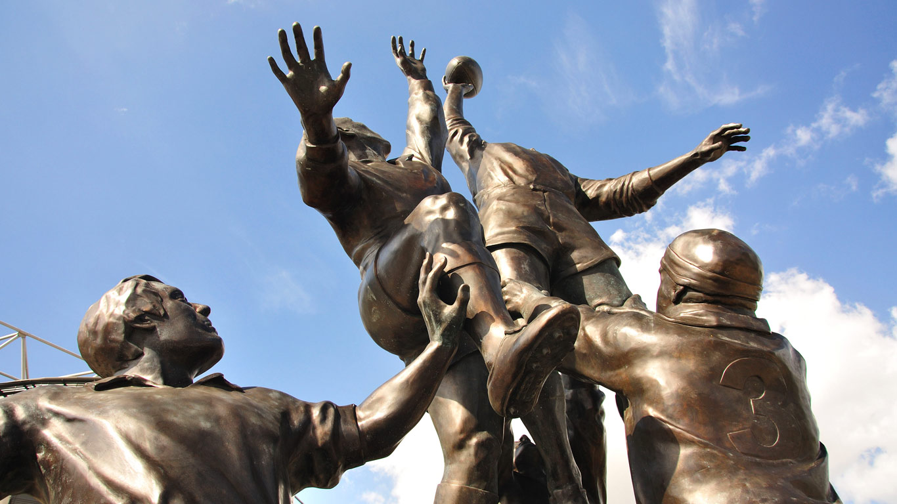

#### 20180203 Champignon Cookeina dans une forêt en Bourgogne (© pigphoto/Getty Images)(Bing France)

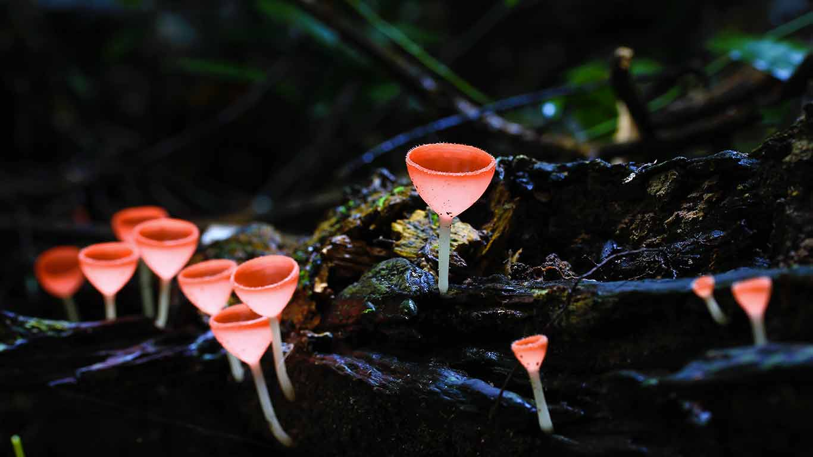

#### 20180202 Rooftops in the walled city of Urbino, Italy (© Andrea Pucci/Getty Images)(Bing United Kingdom)

#### 20180202 Alpine marmots at Hohe Tauern National Park, Austria (© blickwinkel/Alamy)(Bing United States)

#### 20180201 Stuben am Arlberg, Austria (© 500px/Aurora Photos)(Bing United Kingdom)

