#### 20180331 Cherry blossoms at the National Mall, Washington, DC, USA (© Sean Pavone/Alamy)(Bing United Kingdom)

#### 20180330 The Vestibule at Diocletian's Palace, Split, Croatia (© Dreamer4787/Shutterstock)(Bing United Kingdom)

#### 20180329 The A’s host the Rangers at the Oakland Coliseum, Sept 23, 2017 (© Lachlan Cunningham/Getty Images)(Bing United States)

#### 20180329 Hawa Mahal in Jaipur, India (© Olena Tur/Shutterstock)(Bing United Kingdom)

#### 20180328 Common redpoll perched on a branch in snow, Quebec (© Loic Poidevin/Minden Pictures)(Bing Canada)

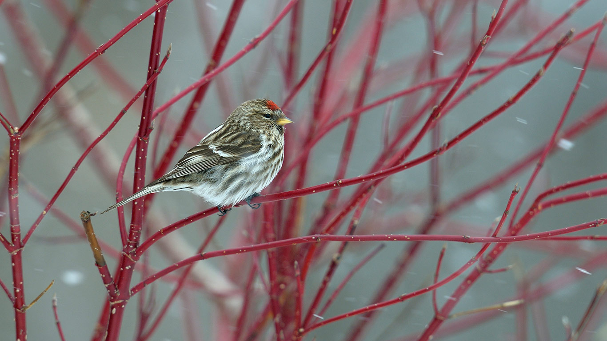

#### 20180328 Great Salt Lake Shorelands Preserve in Layton, Utah (© Austin Cronnelly/Tandem Stills + Motion)(Bing United States)

#### 20180328 View of Millennium Bridge and St Paul's Cathedral, London (© aldovillalon/Shutterstock)(Bing United Kingdom)

#### 20180327 ｢水辺の桜｣兵庫 (© Seiji NAKAI/Getty Images)(Bing Japan)

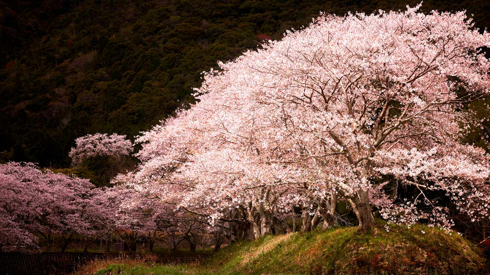

#### 20180327 The Unfinished Obelisk near Aswan, Egypt (© George Steinmetz/Getty Images)(Bing United Kingdom)

#### 20180326 Das Uhrwerk einer antiken Taschenuhr (© Gerard Plauche/Getty Images)(Bing Deutschland)

#### 20180326 Aerial view of Porthdinllaen on the Llŷn Peninsula, Gwynedd, Wales (© David Angel/Alamy)(Bing United Kingdom)

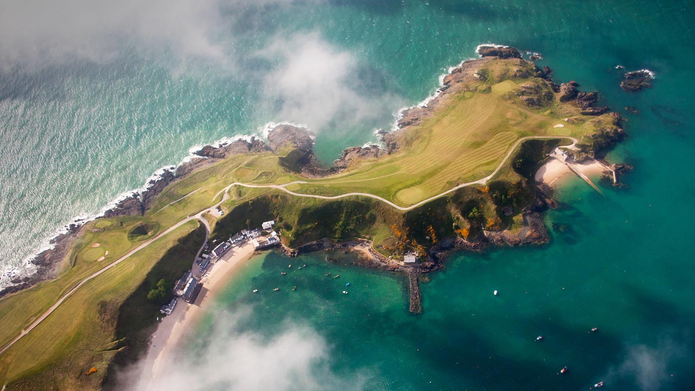

#### 20180325 Jan van Eyckplein in Bruges, Belgium (© Aliaume Chapelle/Tandem Stills + Motion)(Bing United Kingdom)

#### 20180325 Horloge astronomique de Strasbourg, France (© Peter Schickert/Alamy Stock Photo)(Bing France)

#### 20180324 Crimson-rumped toucanet in the Refugio Paz de Las Aves, Ecuador (© Tui De Roy/Minden Pictures)(Bing United Kingdom)

#### 20180323 Ice-covered rock in Wheaton River, Yukon (© Robert Postma/Getty Images)(Bing Canada)

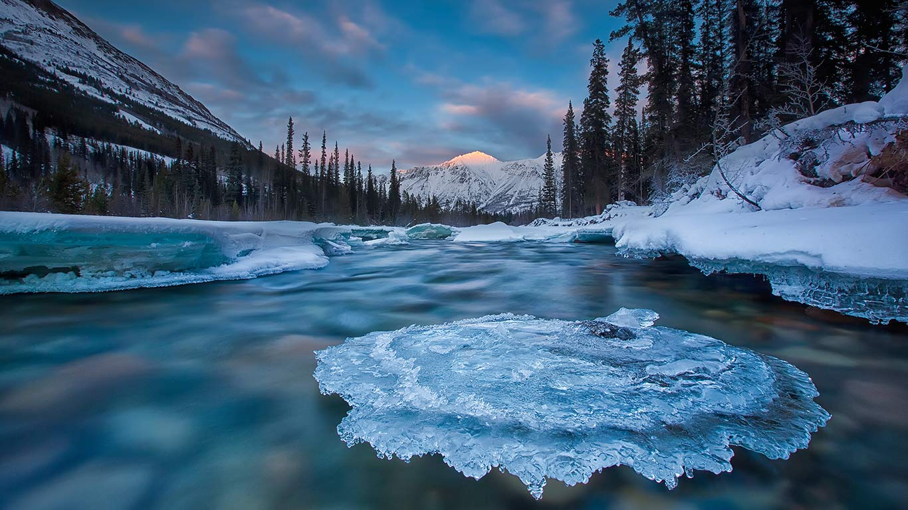

#### 20180323 Clouds over the Yauca and Acarí Rivers on Peru’s Pacific coast (© Joshua Stevens/NASA)(Bing United Kingdom)

#### 20180322 Lake Eibensee in the Austrian Alps near Salzburg (© Christoph Oberschneider/Tandem Stills + Motion)(Bing United Kingdom)

#### 20180322 【今日春分】梅里雪山国家公园内一只以桃花为食的蓝喉太阳鸟，中国云南省 (© Dong Lei/Minden Pictures)(Bing China)

#### 20180321 Langblättriger Ehrenpreis (Veronica longifolia) in der Nahaufnahme (© JIPEN/Alamy Stock Photo)(Bing Deutschland)

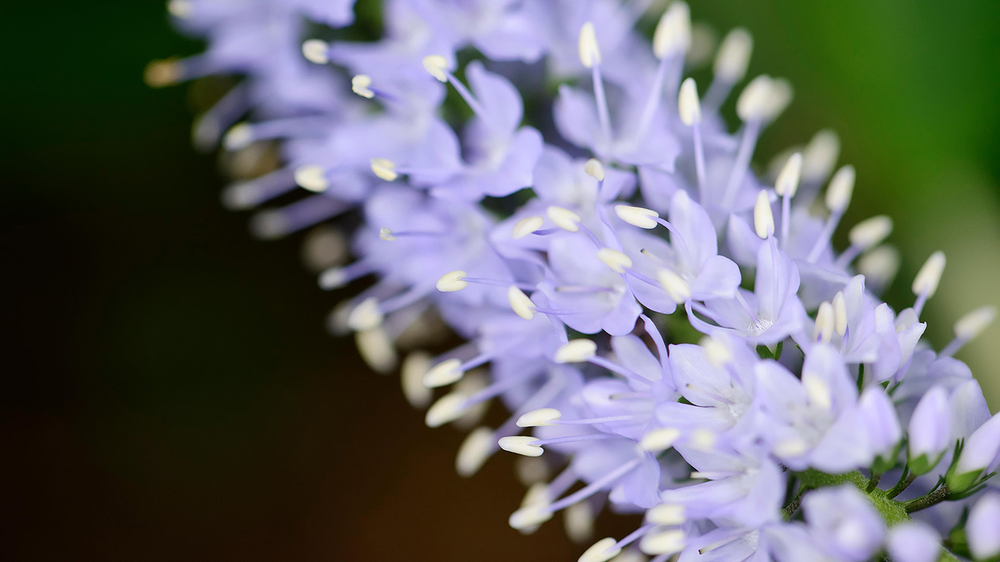

#### 20180321 Redwood trees at Jedediah Smith Redwoods State Park, California, USA (© Cavan Images/Offset)(Bing United Kingdom)

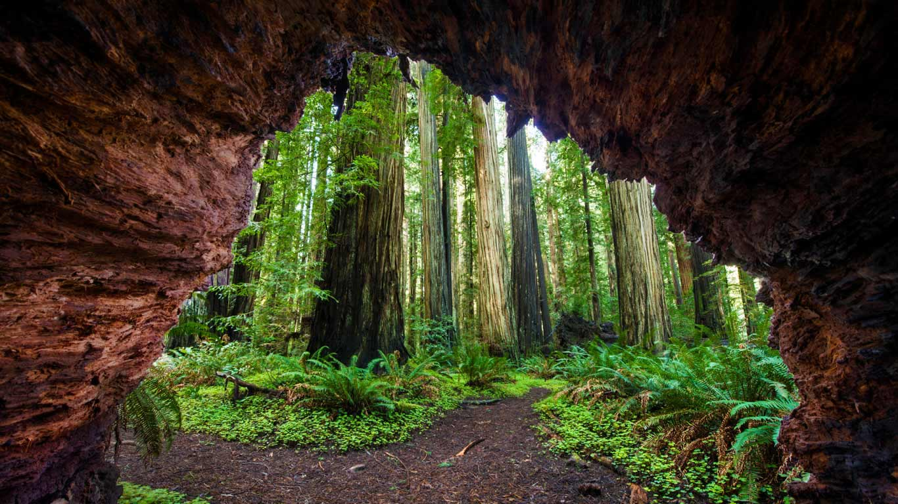

#### 20180320 Tulips near the village of Grolloo in Drenthe province, Netherlands (© plainpicture/Buiten-Beeld/Karin Broekhuijsen)(Bing United Kingdom)

#### 20180319 Sanxiantai dragon bridge in Taitung, Taiwan (© Anthony Ko/Getty Images)(Bing United Kingdom)

#### 20180318 Christmas Tree Point Road and the hills of Twin Peaks, San Francisco, USA (© Terence Chang/Getty Images)(Bing United Kingdom)

#### 20180317 Ross Errilly Friary, County Galway, Ireland (© plainpicture)(Bing United Kingdom)

#### 20180316 Giant panda at Wolong National Nature Reserve, Sichuan, China (© Lynn M. Stone/Minden Pictures)(Bing United Kingdom)

#### 20180315 'Hope' the blue whale skeleton at the Natural History Museum, London (© Brian Doben)(Bing United Kingdom)

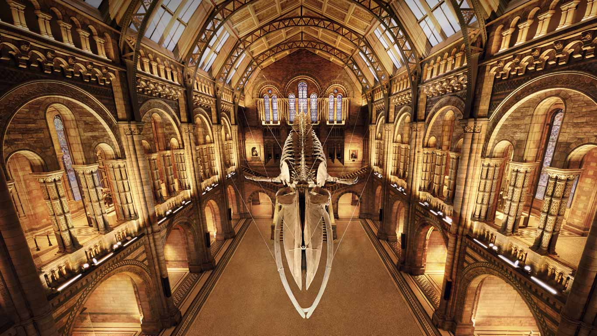

#### 20180314 Atlantic spotted dolphins and bubble ring in Little Bahama Bank, Bahamas (© Hiroya Minakuchi/Minden Pictures)(Bing United Kingdom)

#### 20180314 ｢トリーモア・フォレスト・パーク｣イギリス, 北アイルランド (© Chris Curry/500px)(Bing Japan)

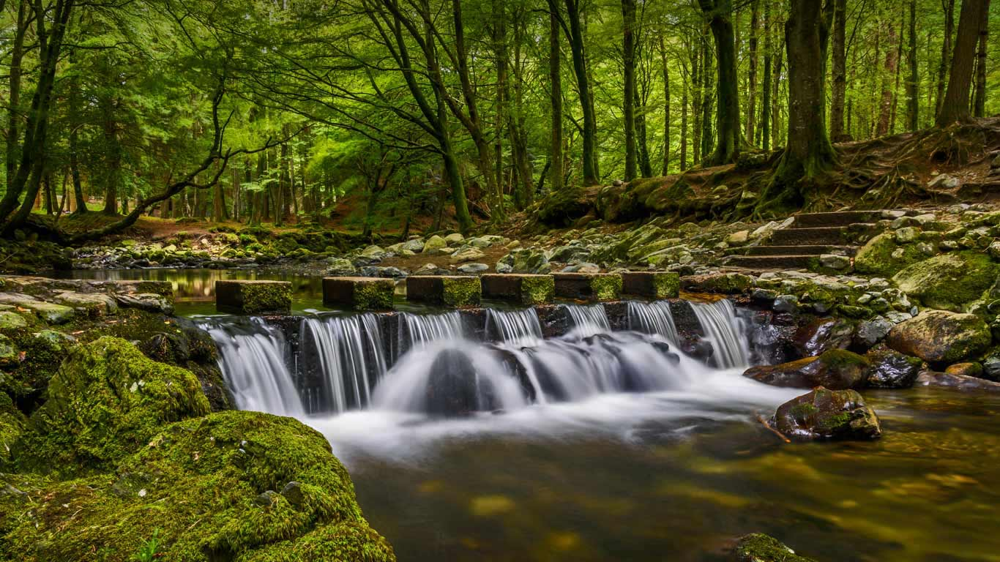

#### 20180313 Eisschollen am Ufer der Insel Reichenau, Bodensee, Baden-Württemberg, Deutschland (© imageBROKER/Alamy Stock Photo)(Bing Deutschland)

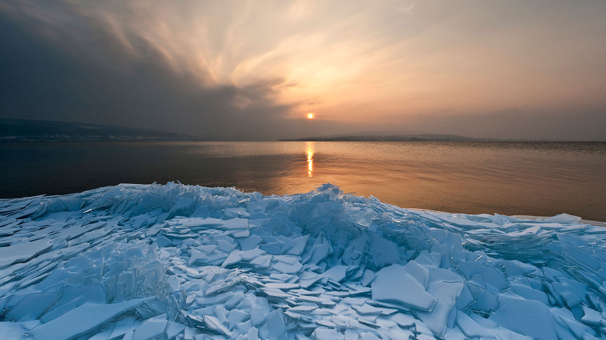

#### 20180313 Wayag Islands in the Raja Ampat Islands of Indonesia (© Chris Caldicott/Offset)(Bing United Kingdom)

#### 20180312 Sanderlings sleeping on a beach in Terschelling, Netherlands (© Inge van der Wulp/Minden Pictures)(Bing United Kingdom)

#### 20180312 ｢祈りの灯火｣岩手, 盛岡 (© The Asahi Shimbun/Getty Images)(Bing Japan)

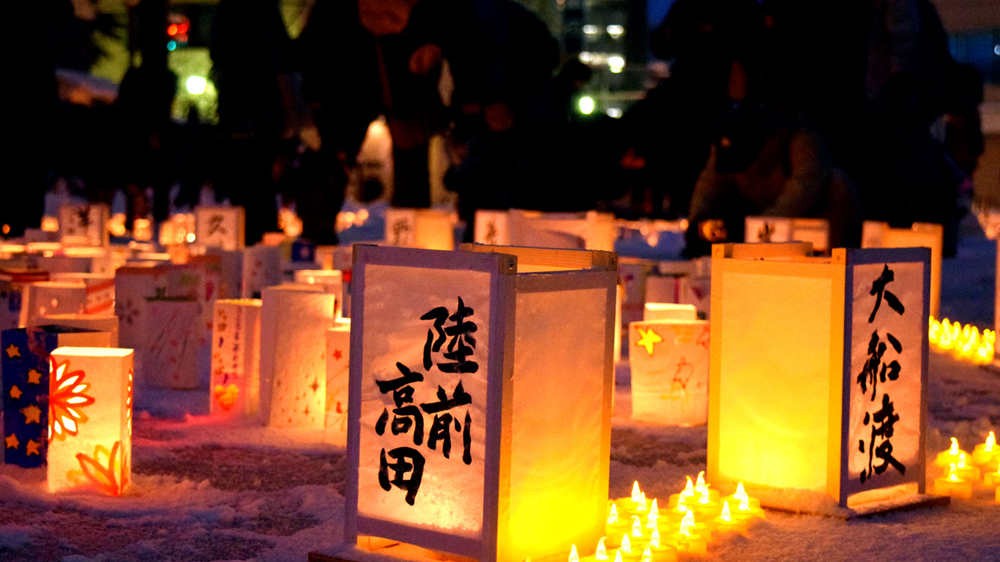

#### 20180312 Grotte de la Mer de Glace, Chamonix (© Mediattivo/Getty Images)(Bing France)

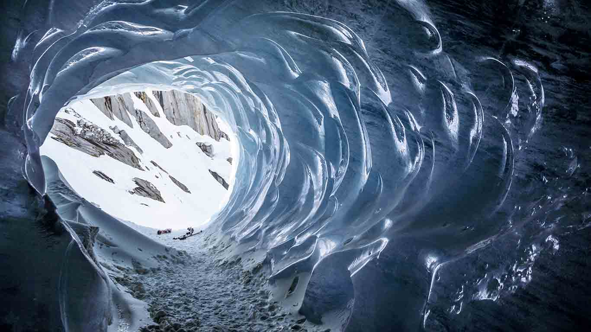

#### 20180312 Arts design inside the dome of the Canadian Museum of Civilization, Gatineau, Que. (© imageBROKER/REX/Shutterstock)(Bing Canada)

#### 20180311 A reticulated giraffe mother nuzzles her calf in Lewa Wildlife Conservancy, Kenya (© Sean Crane/Minden Pictures)(Bing United Kingdom)

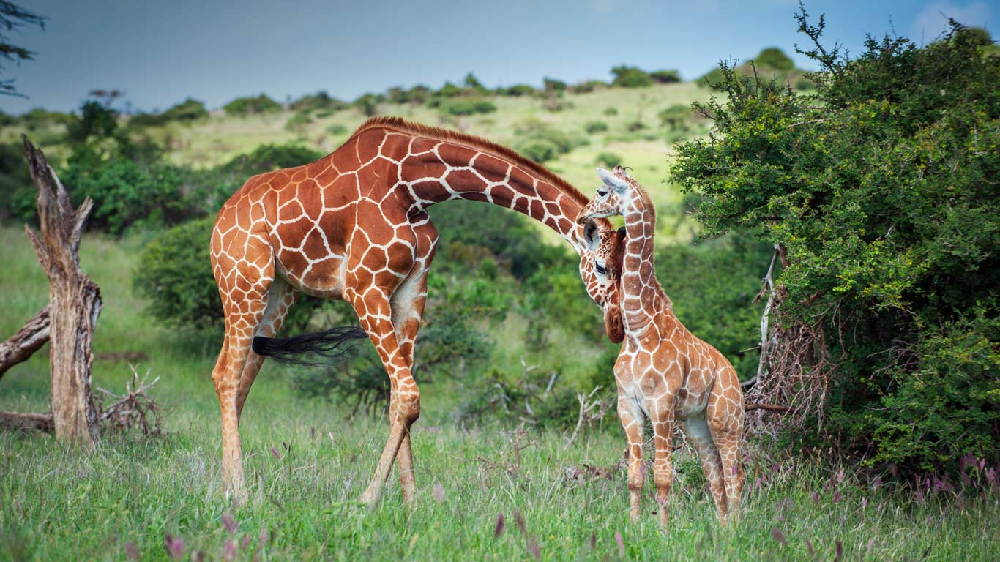

#### 20180311 Buildings reflected in the astronomical clock of Olomouc, Czech Republic (© scubabartek/iStock/Getty Images Plus)(Bing United States)

#### 20180310 Johnston Canyon in Banff National Park, Alberta, Canada (© Radius Images/Offset)(Bing United Kingdom)

#### 20180309 ｢サリー姿の女性たち｣インド (© Jeremy Woodhouse/Getty Images)(Bing Japan)

#### 20180309 Eilean Donan Castle at the blue hour after sunset, Scotland (© Henk Meijer/Alamy)(Bing United Kingdom)

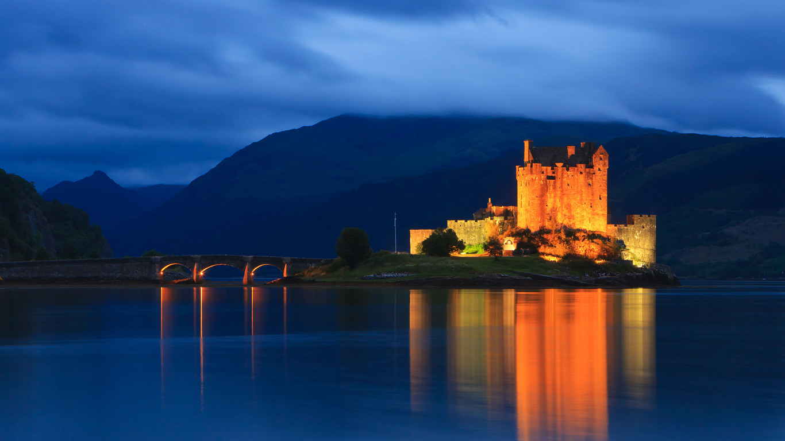

#### 20180309 The Door County Coastal Byway in Wisconsin (© Krzysztof Hanusiak/Aurora Photos)(Bing United States)

#### 20180308 ‘Fearless Girl’, by Kristen Visbal, New York City, USA (© Jeenah Moon/Bloomberg via Getty Images)(Bing United Kingdom)

#### 20180307 Thick ice clings to the Atlantic coast of Nova Scotia, Canada (© shaunl/Getty Images)(Bing United Kingdom)

#### 20180306 Crab-eating macaque in Bako National Park, Malaysia (© Anup Shah/Minden Pictures)(Bing United Kingdom)

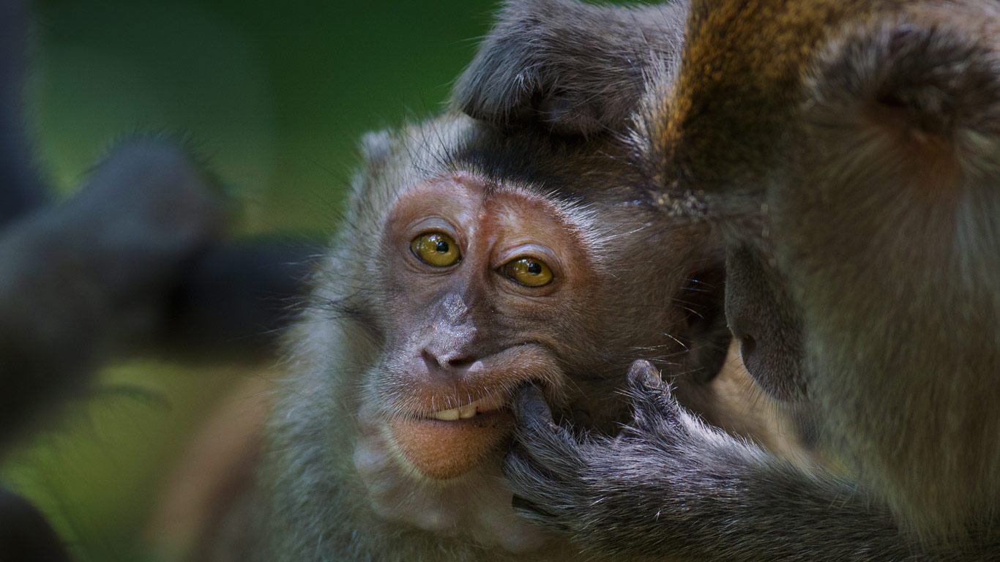

#### 20180305 Seattle Central Library, Seattle, Washington, USA (© Sean Hemmerle/Gallery Stock)(Bing United Kingdom)

#### 20180305 Groupe de poupées russes (© Jeff Ulrich/iStock/Getty Images)(Bing France)

#### 20180304 ｢花見山公園｣福島, 福島市 (© JTB MEDIA CREATION, Inc./Alamy Stock Photo)(Bing Japan)

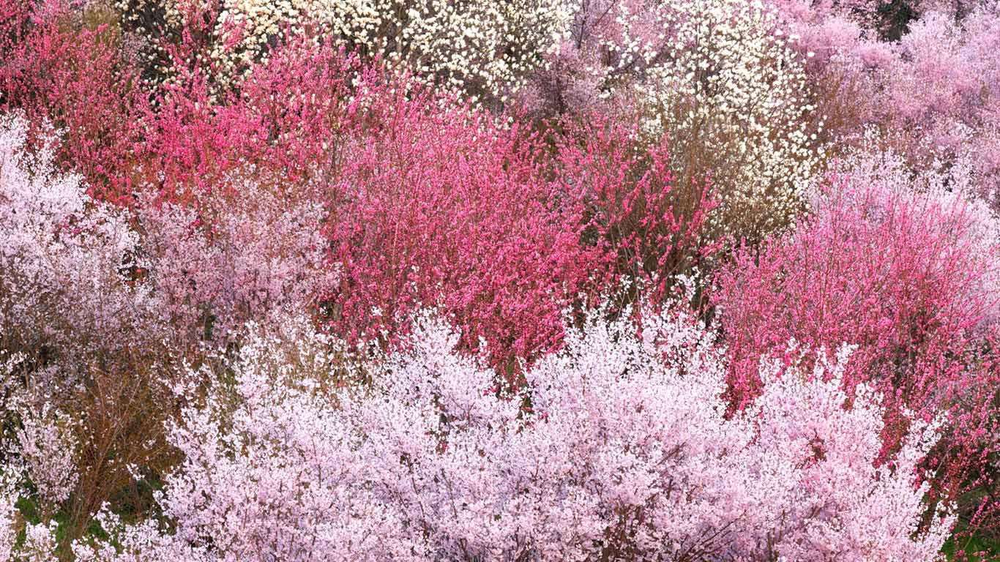

#### 20180304 The boab tree, Kimberley region, Western Australia (© plainpicture/Cultura)(Bing United Kingdom)

#### 20180303 Cougar in the Andes of north-west Argentina (© Sebastian Kennerknecht/Minden Pictures)(Bing United Kingdom)

#### 20180303 【今日元宵节】乐圣岭天后宫悬挂的红灯笼，马来西亚吉隆坡 (© Black Cat Imaging/AlamyStock Photo）(Bing China)

#### 20180302 Satellite image of sand and seaweed in the Bahamas (© Serge Andrefouet/University of South Florida/NASA)(Bing United Kingdom)

#### 20180301 Steps down to St David's Cathedral in St Davids, Pembrokeshire, Wales (© Joe Daniel Price/Getty Images)(Bing United Kingdom)

#### 20180301 Stari Most in Mostar, Bosnia and Herzegovina (© Gavin Hellier/Minden Pictures)(Bing United States)

