#### 20180430 Close-up of the hands of jazz pianist Mary Lou Williams during a jam session held in New York City, USA, 1943 (© Gjon Mili/Getty Images)(Bing United Kingdom)

#### 20180429 Ruby Beach in Olympic National Park, Washington, USA (© Jason Savage/Tandem Stills + Motion)(Bing United Kingdom)

#### 20180428 Student Learning Centre at Ryerson University, Toronto (© bobloblaw/Getty Images)(Bing Canada)

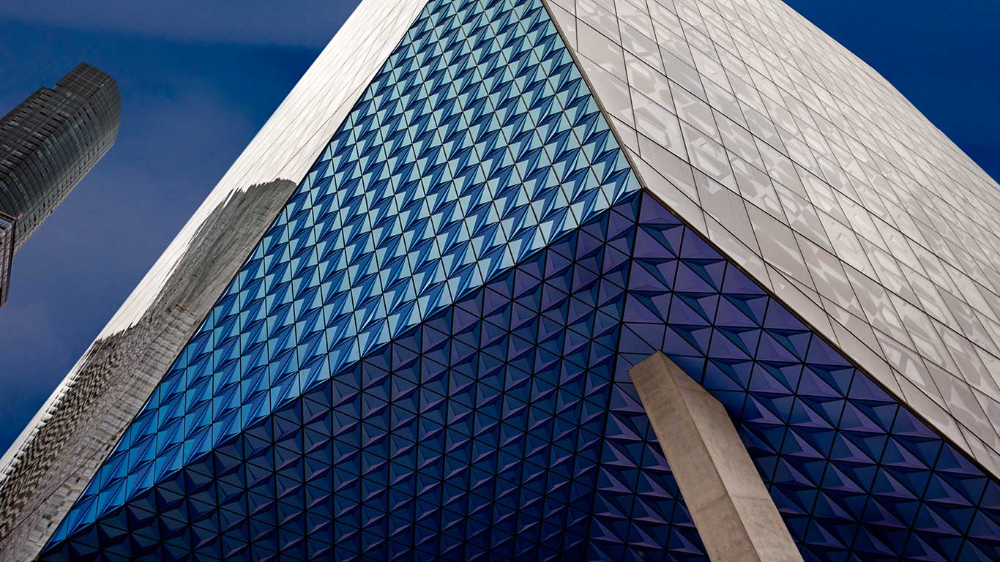

#### 20180428 Rock art at the Great Gallery of Horseshoe Canyon, Canyonlands National Park, Utah, USA (© Austin Cronnelly/Tandem Stills + Motion)(Bing United Kingdom)

#### 20180427 Yosemite National Park, California (© Grant Ordelheide/Tandem Stills + Motion)(Bing United States)

#### 20180427 The Angel of the North in Gateshead, Tyne and Wear (© Stephen Taylor/Alamy)(Bing United Kingdom)

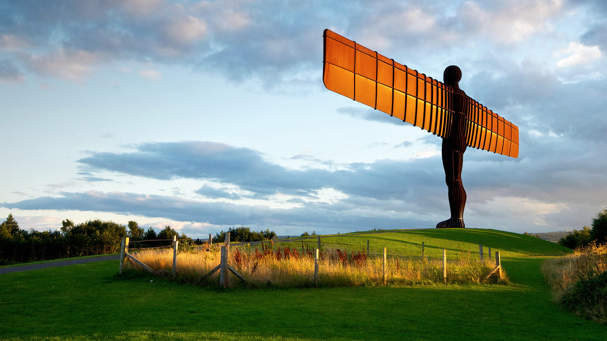

#### 20180426 Sunrise over The Deep aquarium in Hull, England (© Martin Williams/Alamy)(Bing United Kingdom)

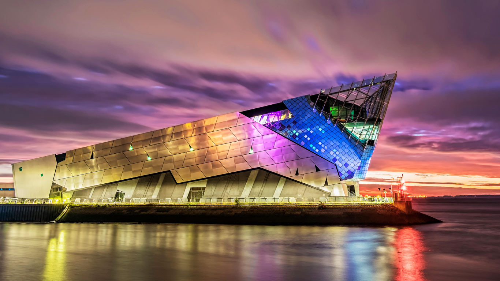

#### 20180426 Claret cup cactus, Guadalupe Mountains National Park, Texas (© Clint Farlinger/Alamy)(Bing United States)

#### 20180426 Blühende Edelkastanie (© MNS Photo/Alamy Stock Photo)(Bing Deutschland)

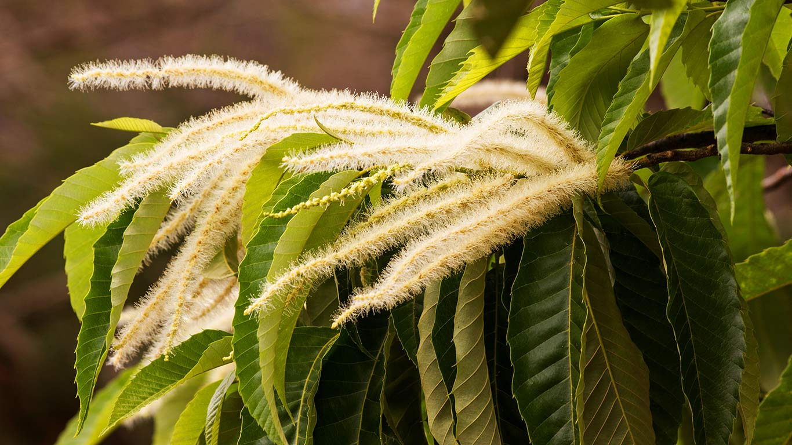

#### 20180425 Bison at Wind Cave National Park, South Dakota (© Newman Mark/SuperStock)(Bing United States)

#### 20180425 The Colosseum of Rome, Italy (© Paperboyo/PrincessCruises/Solent News/REX/Shutterstock)(Bing United Kingdom)

#### 20180424 Satellite view of Everglades National Park, Florida, USA (© Satellite Earth Art/Aurora Photos)(Bing United Kingdom)

#### 20180423 St George and the Dragon fresco on a medieval building in Stein am Rhein, Switzerland (© CSP_felker/age fotostock)(Bing United Kingdom)

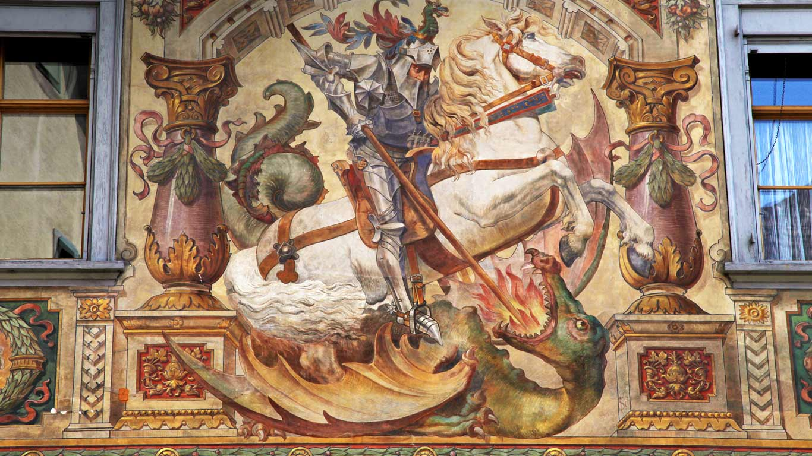

#### 20180423 White Fawn lilies, (erythronium oregonum), Pipers Lagoon Park, Nanaimo, B.C. (© Keith Douglas/Getty Images)(Bing Canada)

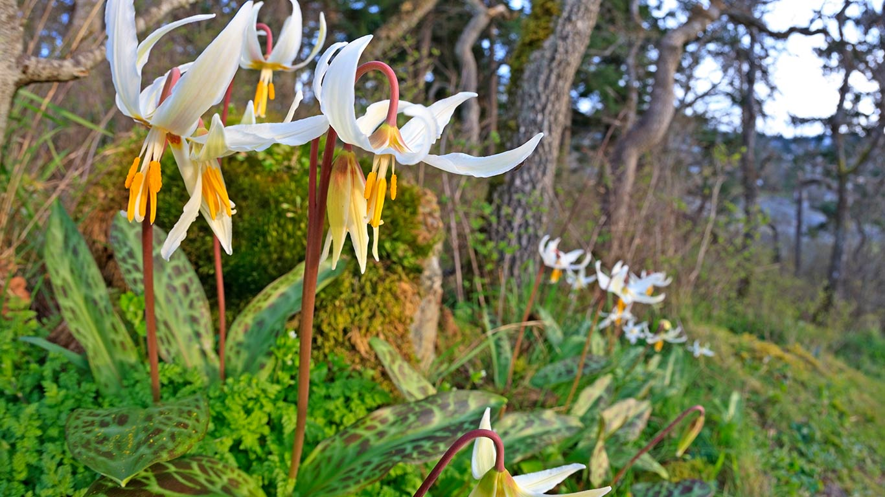

#### 20180423 Visitors at the summit of Haleakalā at Haleakalā National Park, Hawaii (© Alex Messenger/Tandem Stills + Motion)(Bing United States)

#### 20180422 Napping grizzly bear cub, Katmai National Park and Preserve, Alaska, USA (© Suzi Eszterhas/Minden Pictures)(Bing United Kingdom)

#### 20180422 La cour d’un immeuble près du square Jean Cocteau, XVe arrondissement de Paris (© Yann Arthus-Betrand/Getty Images)(Bing France)

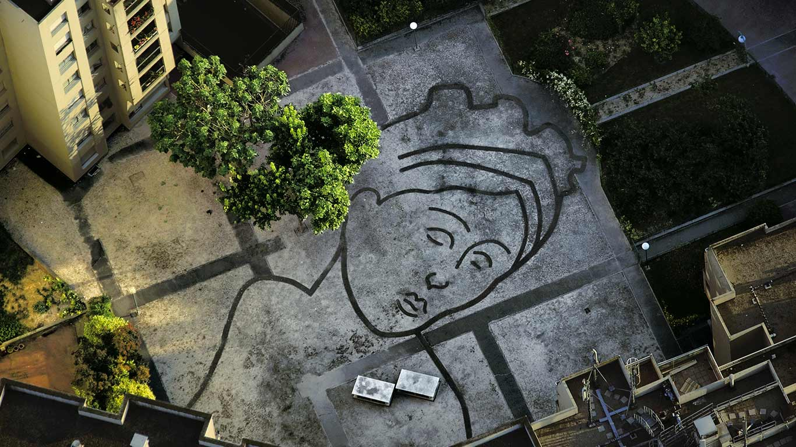

#### 20180421 Saskatchewan Legislative Building, Regina (© Henryk Sadura/Alamy Stock Photo)(Bing Canada)

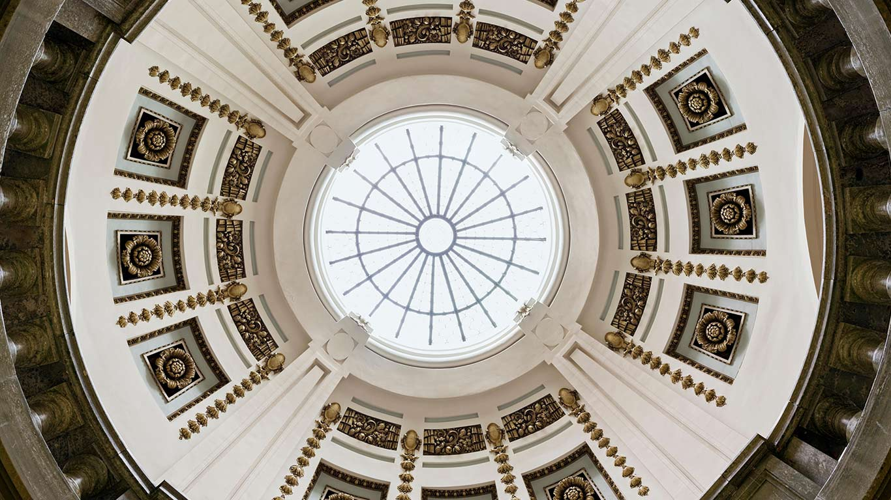

#### 20180421 ｢東後畑の棚田｣山口, 長門市 (© dk tazunoki/Shutterstock)(Bing Japan)

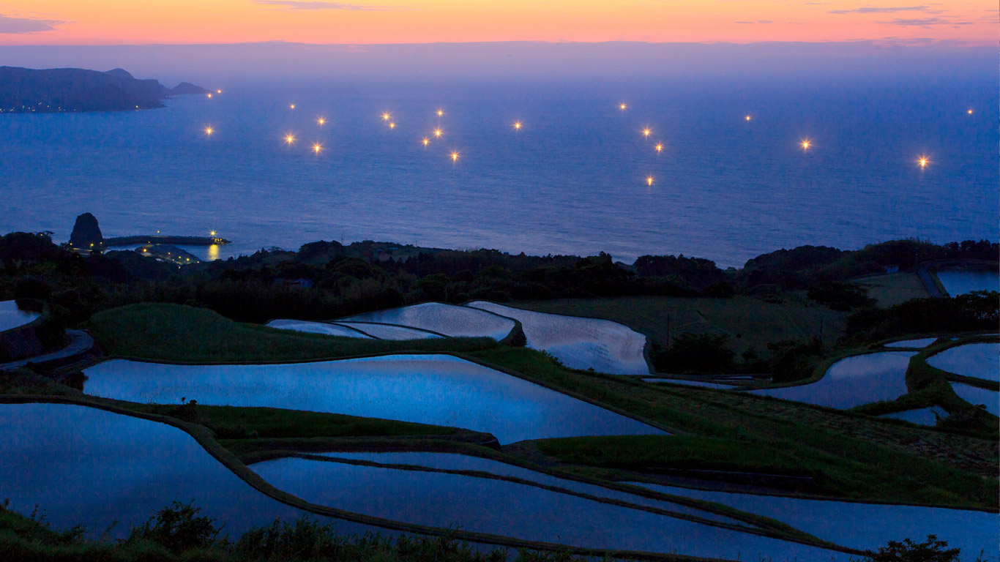

#### 20180421 Grand Prismatic Spring at Yellowstone National Park, USA (© Media Drum World/Aurora Photos)(Bing United Kingdom)

#### 20180421 【今日谷雨】平安村种植节期间龙胜梯田的忙碌景象（© gary76973/Getty Images）(Bing China)

#### 20180420 Leaf insect, Indonesia (© kuritafsheen/RooM/Getty Images)(Bing United Kingdom)

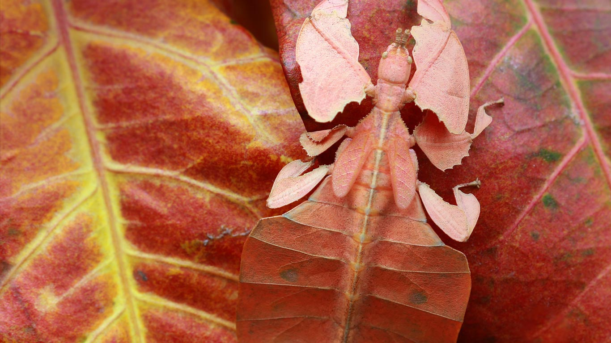

#### 20180419 Rolltreppe des Ruhr Museums, Zeche Zollverein, Essen, Nordrhein-Westfalen, Deutschland (© Sebastian/Alamy Stock Photo)(Bing Deutschland)

#### 20180419 Craig Goch Dam in the Elan Valley of Wales (© Stephen Taylor/Alamy)(Bing United Kingdom)

#### 20180418 A crested wood partridge (© Sue Demetriou/Offset)(Bing United Kingdom)

#### 20180417 The Children's Cultural Festival at Harpa concert hall in Reykjavik, Iceland (© Arctic-Images/Corbis Documentary/Getty Images)(Bing United Kingdom)

#### 20180416 The Bazaruto Archipelago of Mozambique (© Jody MacDonald/Offset)(Bing United Kingdom)

#### 20180415 The ‘Living Forest’ in the Oma Valley of Biscay, Spain (© Juan Carlos Munoz/Minden Pictures)(Bing United Kingdom)

#### 20180414 A pod of dusky dolphins at Kaikoura, New Zealand (© Terry Whittaker/Alamy)(Bing United Kingdom)

#### 20180414 Chevaux marchant dans un marais en Camargue, France (© Danita Delimont/Getty Images)(Bing France)

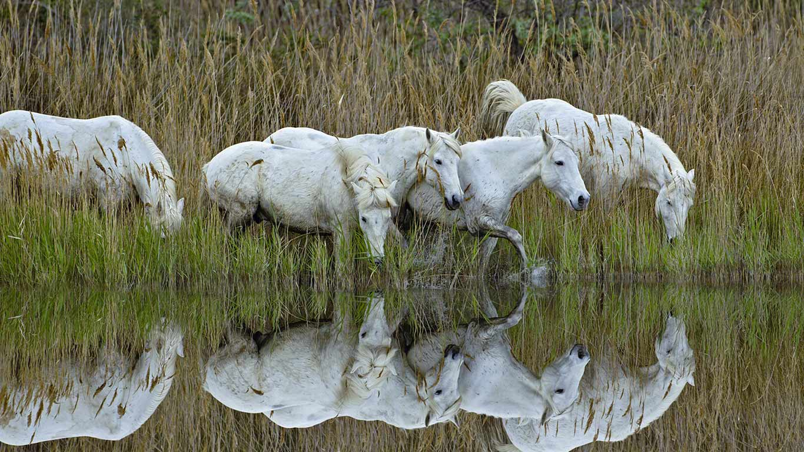

#### 20180413 Replica of a Viking home in Dublin National Botanic Gardens, Ireland (© George Munday/plainpicture)(Bing United Kingdom)

#### 20180412 Sydney Harbour Bridge in Sydney, Australia (© Grant Faint/Offset)(Bing United Kingdom)

#### 20180411 Zhangjiajie National Forest Park in Hunan Province, China (© aphotostory/Shutterstock)(Bing United Kingdom)

#### 20180411 Phare de Cassis, Bouche-du-Rhône, France (© Camille Moirenc/Getty Images)(Bing France)

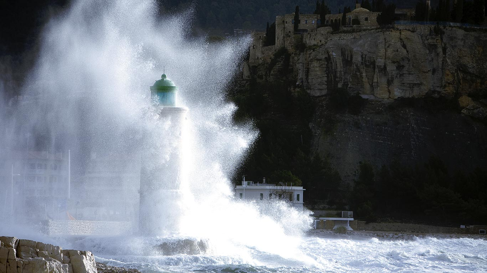

#### 20180410 A red deer in Richmond Park, London (© Mark Bridger/Alamy)(Bing United Kingdom)

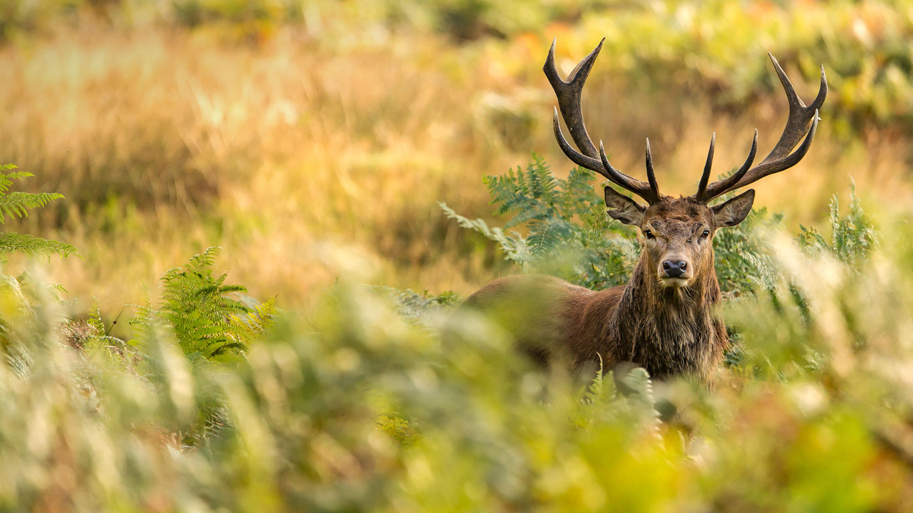

#### 20180410 Aerial view from Peace Tower, Ottawa (© Sergey Orlov/Shutterstock)(Bing Canada)

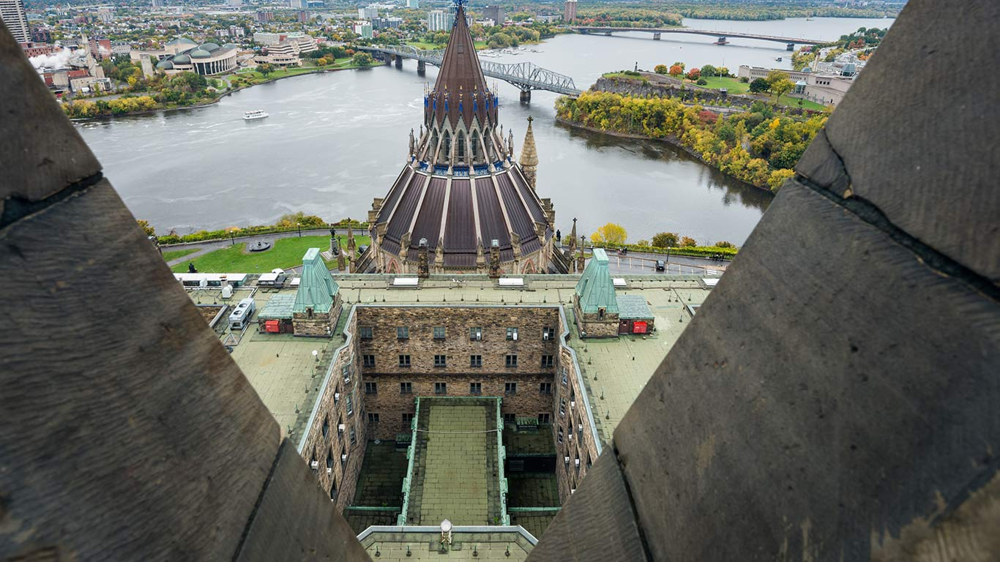

#### 20180410 Baby and juvenile elephants in Amboseli National Park in Kenya (© Tom Stahl/Offset)(Bing United States)

#### 20180410 Elbsandsteingebirge und Basteibrücke in der Morgendämmerung, Sachsen, Deutschland (© hsimages/Westend61/Offset/Shutterstock)(Bing Deutschland)

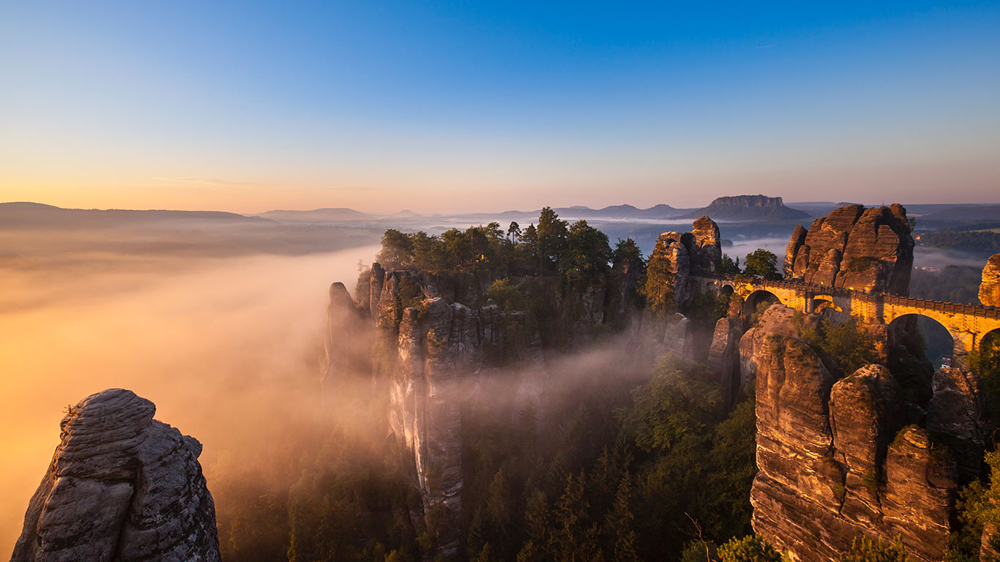

#### 20180409 The Lena Delta Wildlife Reserve in Siberia, Russia (© USGS EROS Data Center/NASA)(Bing United Kingdom)

#### 20180408 Male resplendent quetzal in Costa Rica (© mallardg500/Getty Images)(Bing United Kingdom)

#### 20180407 The river Arve (right) flowing into the Rhône in Geneva, Switzerland (© Capchure/Getty Images)(Bing United Kingdom)

#### 20180407 ｢姫路城｣兵庫, 姫路市 (©S.R.Lee Photo Traveller/Shutter stock)(Bing Japan)

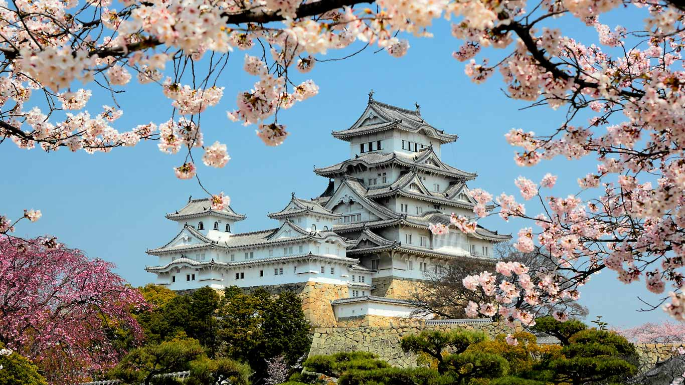

#### 20180406 Emperor penguins on Snow Hill Island, Antarctica (© David Tipling Photo Library/Alamy)(Bing United Kingdom)

#### 20180406 【今日清明节】“京剧脸谱风筝”，中国潍坊（© Li Yangang / TAO Images Limited / Alamy Stock Photo）(Bing China)

#### 20180405 Mada’in Saleh archeological site in Saudi Arabia (© Bruno Zanzottera/Aurora Photos)(Bing United Kingdom)

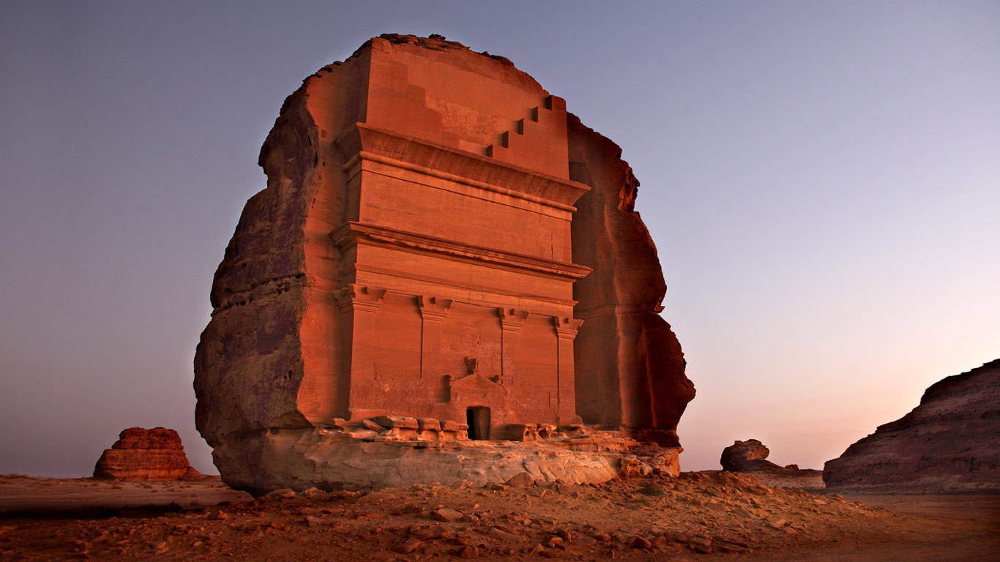

#### 20180404 Stack Rocks at Castlemartin on the Pembrokeshire coastline, West Wales (© James Davies/Alamy)(Bing United Kingdom)

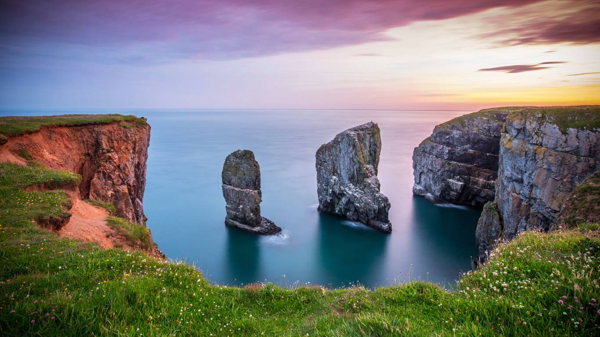

#### 20180404 Mexican giant cardon cactus (© Ed Reardon/Alamy)(Bing United States)

#### 20180403 The village of Castelluccio above the Piano Grande, Umbria, Italy (© beppeverge/Getty Images)(Bing United Kingdom)

#### 20180403 Lighthouse reflected in a pool of water at Peggy's Cove, N.S. (© Cliff LeSergent/Alamy Stock Photo)(Bing Canada)

#### 20180403 Feldhase in einem Rotkohlfeld, Hessen, Deutschland (© Radius Images/Alamy Stock Photo)(Bing Deutschland)

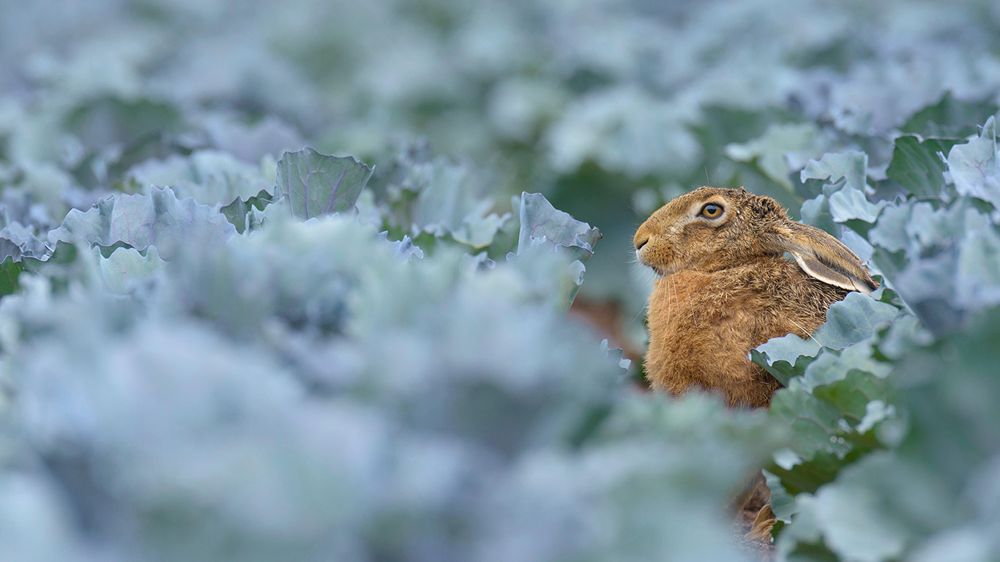

#### 20180402 Seven Magic Mountains art installation, Jean Dry Lake, Nevada, USA (© Renz Alfonso Dela Pena)(Bing United Kingdom)

#### 20180401 The marshmallow PEEPS® factory in Bethlehem, Pennsylvania, USA (© Kristoffer Tripplaar/Alamy)(Bing United Kingdom)

