#### 20180531 Grass in lakeside sedge meadow, Moose Lake, Minnesota (© Jim Brandenburg/Minden Pictures)(Bing United States)

#### 20180531 The British Airways i360 tower at dusk on the seafront of Brighton (© Mike Hewitt/Staff/Getty Images)(Bing United Kingdom)

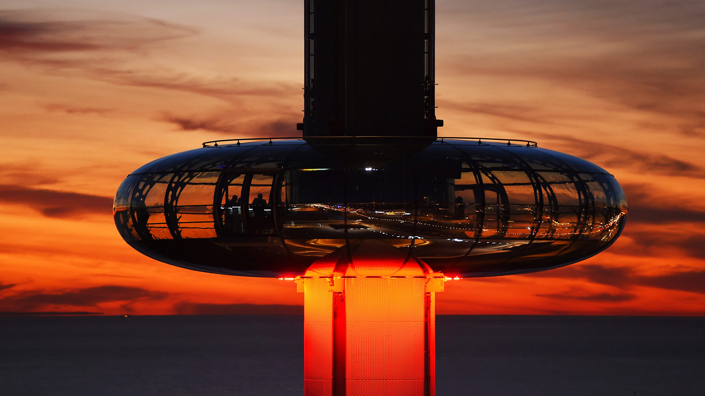

#### 20180530 The Lincoln Memorial, Washington, DC (© JG Photography/Alamy)(Bing United States)

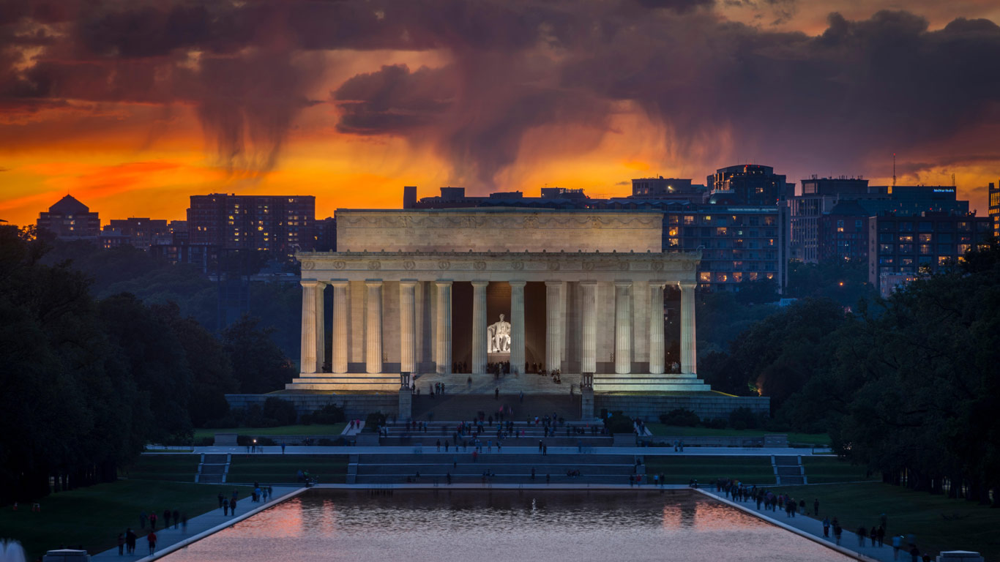

#### 20180530 Wetlands of Pantanal, Brazil (© Lucas Leuzinger/Shutterstock)(Bing United Kingdom)

#### 20180529 Ein Starenschwarm in ungewöhnlicher Formation, Provinz Gelderland, Niederlande (© Hans Overduin/Minden Pictures)(Bing Deutschland)

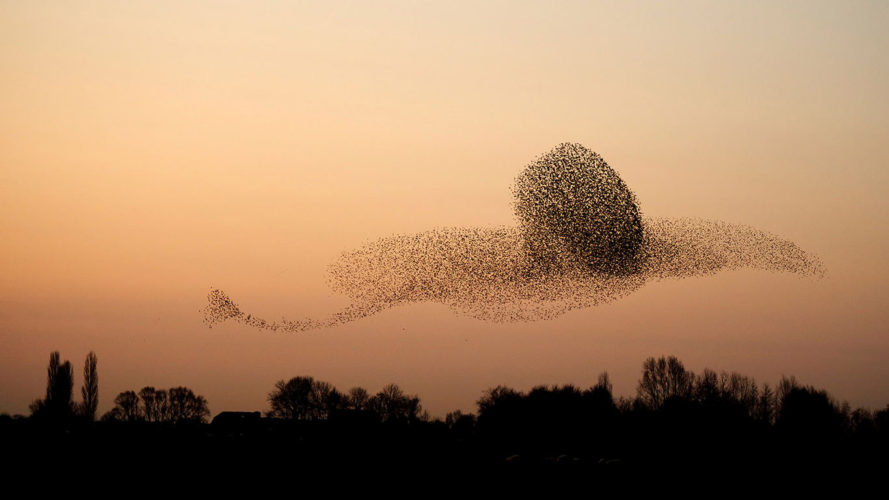

#### 20180529 South Base Camp, Mount Everest, Nepal (© David Noyes/Danita Delimont)(Bing United Kingdom)

#### 20180528 Biche Sika et son petit dans un parc privé, Haute-Saône, France (© Morales/AGE Fotostock)(Bing France)

#### 20180528 The 3rd US Infantry Regiment honors America's fallen soldiers during the 'Flags In' ceremony for Memorial Day, Arlington National Cemetery, Virginia (© Kevin Lamarque/Reuters)(Bing United States)

#### 20180528 Asian elephants at Jim Corbett National Park, India (© Yashpal Rathore/Minden Pictures)(Bing United Kingdom)

#### 20180527 The Golden Gate Bridge in San Francisco, USA (© RICOWde/Getty Images)(Bing United Kingdom)

#### 20180526 Liverpool waterfront, Merseyside (© Alan Novelli/Alamy)(Bing United Kingdom)

#### 20180525 Vineyard near Pully, Vaud, Switzerland (© Gallery Stock)(Bing United Kingdom)

#### 20180524 ｢アナウサギの子どもたち｣フランス (© Remy Courseaux/Minden Pictures)(Bing Japan)

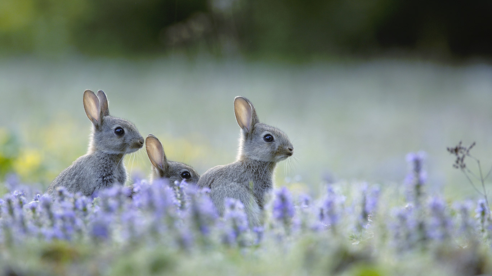

#### 20180524 The Brooklyn Bridge under construction in New York, USA, in 1883 (© World History Archive/Alamy)(Bing United Kingdom)

#### 20180523 A yellow-spotted river turtle in Yasuni National Park, Ecuador (© Pete Oxford/Minden Pictures)(Bing United Kingdom)

#### 20180522 Storm clouds over Crater Lake National Park, Oregon, USA (© Joseph Giacalone/SuperStock)(Bing United Kingdom)

#### 20180522 Abtsmühle und Lüner Mühle im alten Hafen von Lüneburg, Niedersachsen, Deutschland (© Oliver Hoffmann/Shutterstock)(Bing Deutschland)

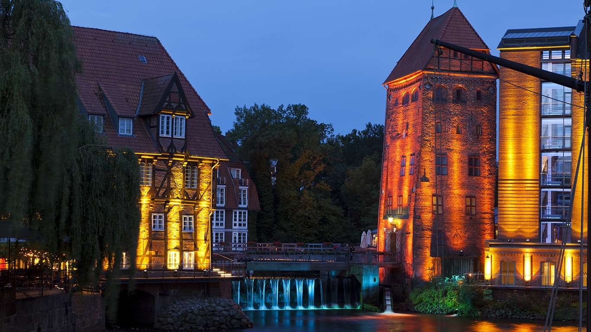

#### 20180521 Namib Desert, Namibia (© Valerio Leone/Solent News/REX/Shutterstock)(Bing United Kingdom)

#### 20180521 【520告白日】湖中深情相对的两只水雉，中国九江市（© Jie Zhao/Getty News）(Bing China)

#### 20180520 Coquelicots dans un champs de blé, France (© Claudia Rehm/Westend61 GmbH/Alamy Stock Photo)(Bing France)

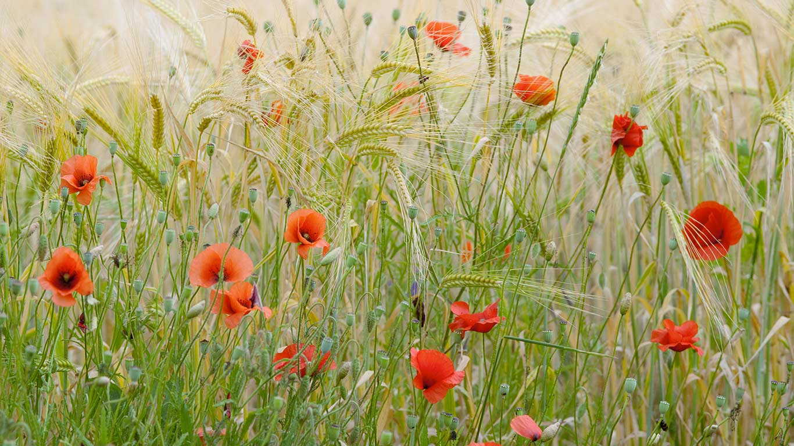

#### 20180520 Prince Harry and Meghan Markle leave after their wedding ceremony at St. George's Chapel in Windsor Castle in Windsor (© Ben Birchhall/pool photo via AP)(Bing United Kingdom)

#### 20180519 ｢観音菩薩立像｣東京国立博物館 (© Greg Elms/Getting images)(Bing Japan)

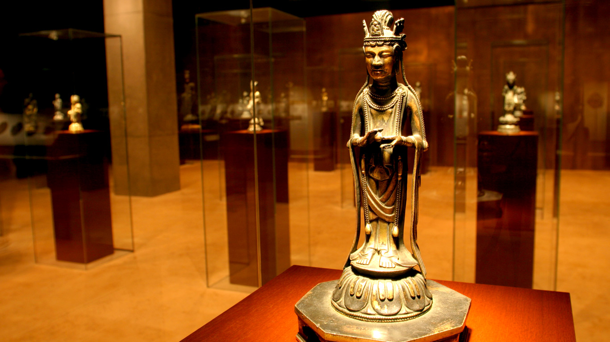

#### 20180519 Marshland in Shediac, N.B. (© Paul Giamou/Aurora Photos)(Bing Canada)

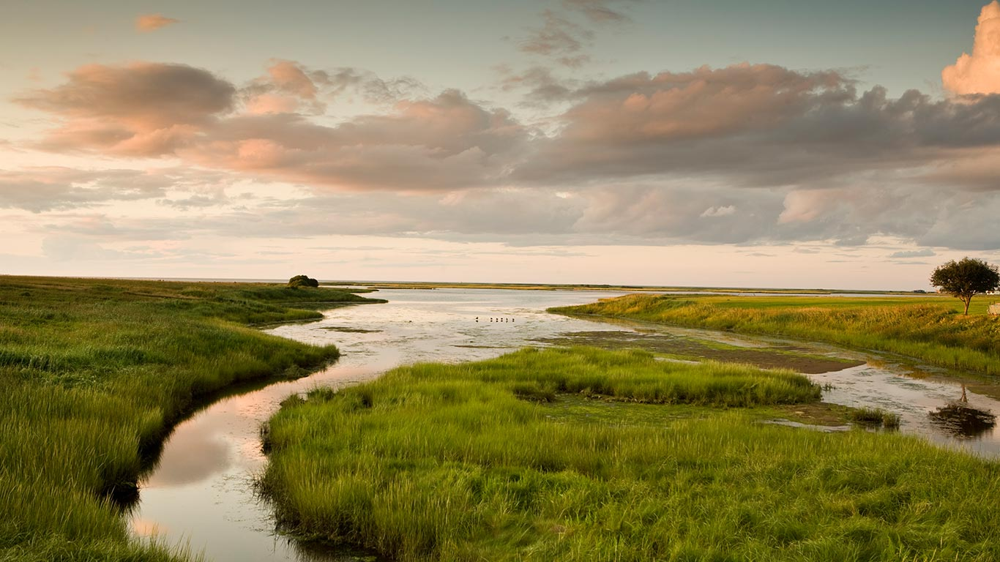

#### 20180519 The Quire ceiling at St George's Chapel, Windsor Castle (© Steve Vidler/Alamy)(Bing United Kingdom)

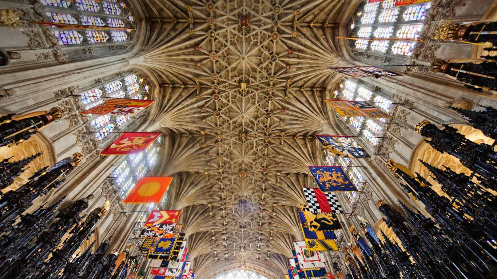

#### 20180519 Paratroopers fill the skies over Fort Bragg in North Carolina, for Operation Toy Drop (© Stocktrek Images/SuperStock)(Bing United States)

#### 20180518 Die in Regenbogenfarben leuchtende Außenhülle der Allianz Arena, München, Bayern, Deutschland (© Achim Thomae/Getty Images)(Bing Deutschland)

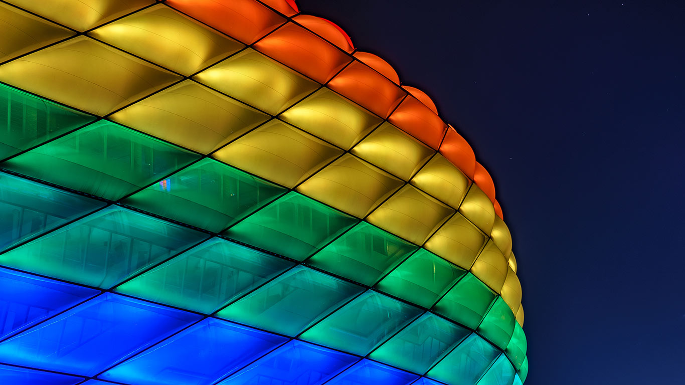

#### 20180518 A peregrine falcon surveys the concrete canyons of Chicago, USA (© Luke Massey/Minden Pictures)(Bing United Kingdom)

#### 20180517 Historic fishing warehouses in Trondheim, Norway (© Oscar Dominguez/Tandem Stills + Motion)(Bing United Kingdom)

#### 20180516 English oak tree in Monmouthshire, Wales (© Phil Savoie/Minden Pictures)(Bing United Kingdom)

#### 20180515 Le lac de Sainte-Croix, cours du Verdon, Provence-Alpes-Côte d'Azur, France (© Visions From Earth/Alamy Stock Photo)(Bing France)

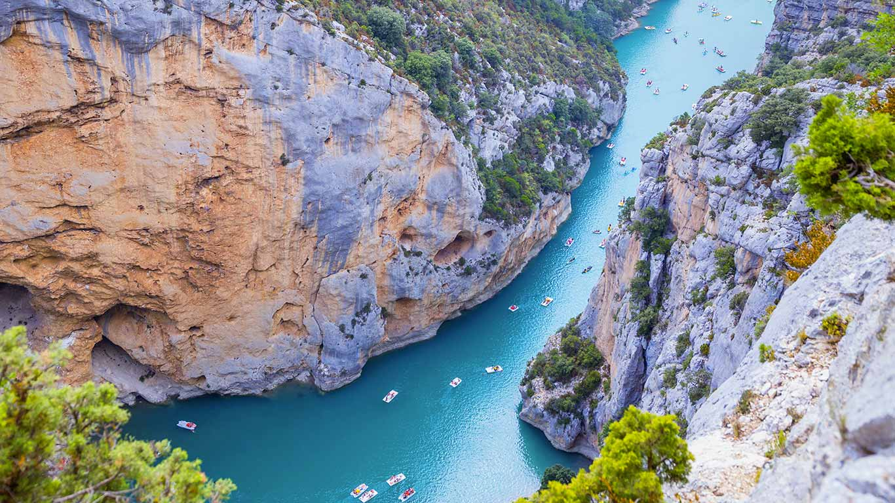

#### 20180515 Bush hyrax colony in the Mara North Conservancy, Kenya (© Jonathan & Angela Scott/Aurora Photos)(Bing United Kingdom)

#### 20180514 The Maratona dles Dolomites cycling race in Italy (© Aurora Photos/Alamy)(Bing United Kingdom)

#### 20180513 West Indian manatee mom and baby at Three Sisters Springs, Florida (© James R.D. Scott/Getty Images)(Bing United States)

#### 20180513 Jeff Koons' Puppy outside the Guggenheim Museum, Bilbao, Spain (© Martin Child/Aurora Photos)(Bing United Kingdom)

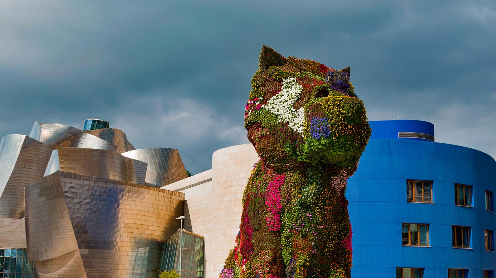

#### 20180512 Springtime in Claude Monet's garden, Giverny, France (© Danita Delimont/Getty Images)(Bing United Kingdom)

#### 20180512 Greater snow geese at Montezuma National Wildlife Refuge, New York (© Gerrit Vyn/Minden Pictures)(Bing United States)

#### 20180511 Flower bed of tulips, Ottawa (© gqxue/Getty Images)(Bing Canada)

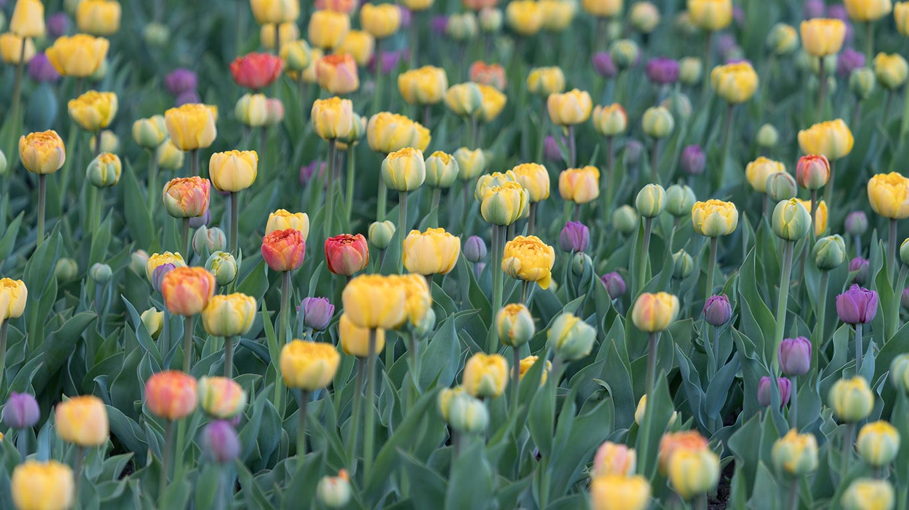

#### 20180511 North shore of Lake Superior, Minnesota, USA (© Matt Anderson Photography/Getty Images)(Bing United Kingdom)

#### 20180510 ‘Kolonihavehus, 2010’ by Tom Fruin in Brooklyn Bridge Park, New York, USA (© Daniel Haug/Getty Images)(Bing United Kingdom)

#### 20180509 Long-tailed widowbird male, Rietvlei Nature Reserve, South Africa (© Richard Du Toit/Getty Images)(Bing United Kingdom)

#### 20180509 Monument aux Bretons de la France Libre, Pointe de Pen-Hir, Bretagne, France (© Sander Groffen/Shutterstock)(Bing France)

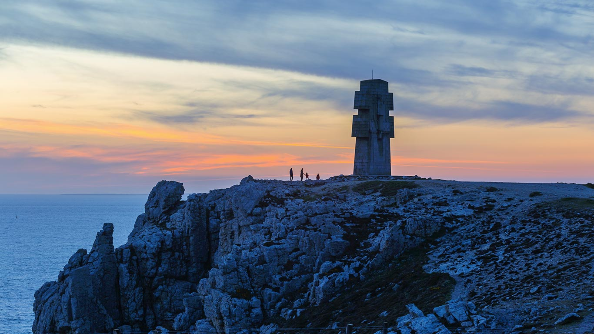

#### 20180508 Cliffs at Spillars Cove, Nfld. (© Scott Leslie/Minden Pictures)(Bing Canada)

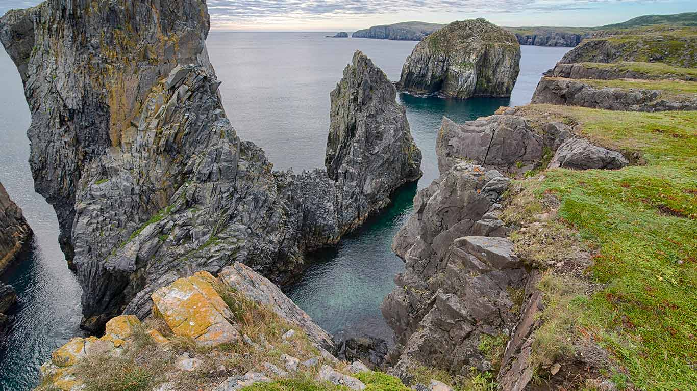

#### 20180508 Lulworth Cove along the Jurassic Coast, Dorset (© Brian Jannsen/Danita Delimont)(Bing United Kingdom)

#### 20180508 Celebrating Teacher Appreciation Day (© Johnny Greig/iStock/Getty Images Plus)(Bing United States)

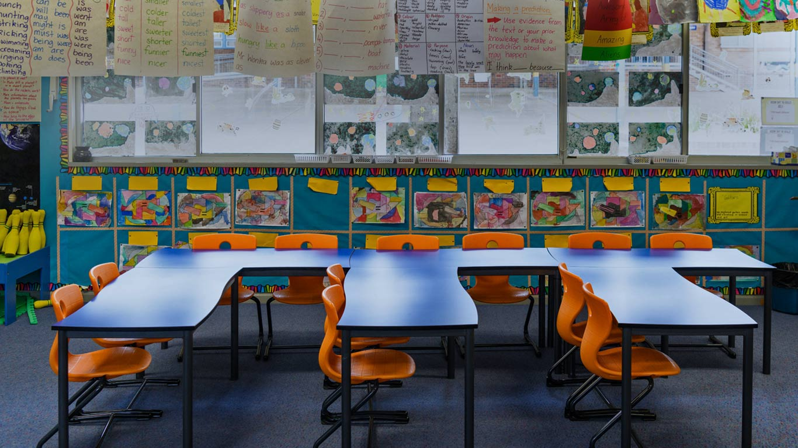

#### 20180508 Skulptur „Das Auge“ von Paul Fuchs und das Neue Schloss, Ingolstadt, Bayern, Deutschland (© Martin Siepmann/imageBROKER/Aurora Photos)(Bing Deutschland)

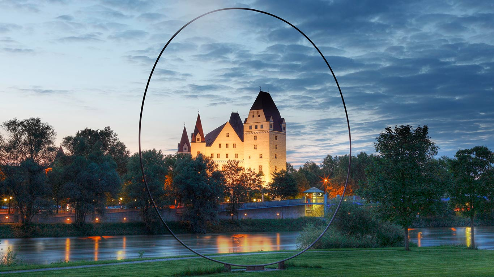

#### 20180507 Jackson Square in the French Quarter of New Orleans, Louisiana, USA (© Edwin Remsberg/Getty Images)(Bing United Kingdom)

#### 20180507 Phoque gris allongé sur la plage, Baie de Somme, France (© Ondrej Prosicky/Shutterstock)(Bing France)

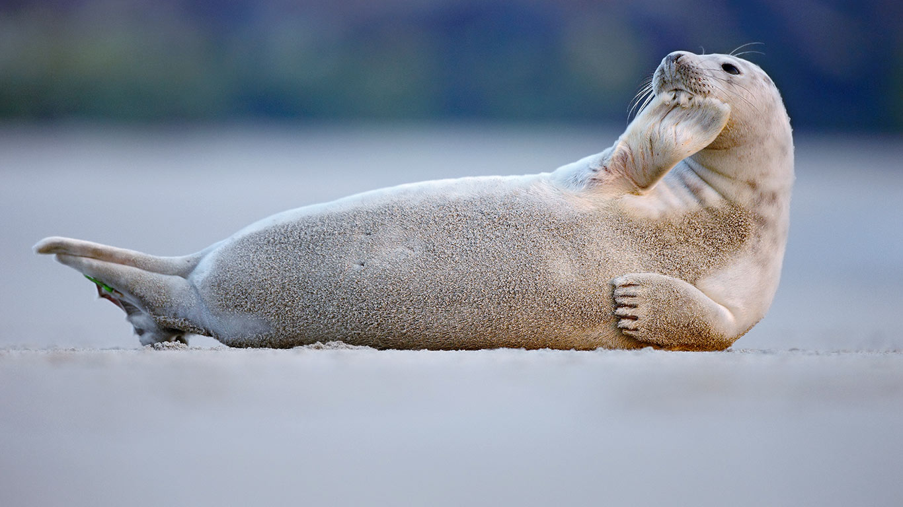

#### 20180506 ｢こいのぼりと東京タワー｣東京, 港区 (© torne_uttenai/Getty Images)(Bing Japan)

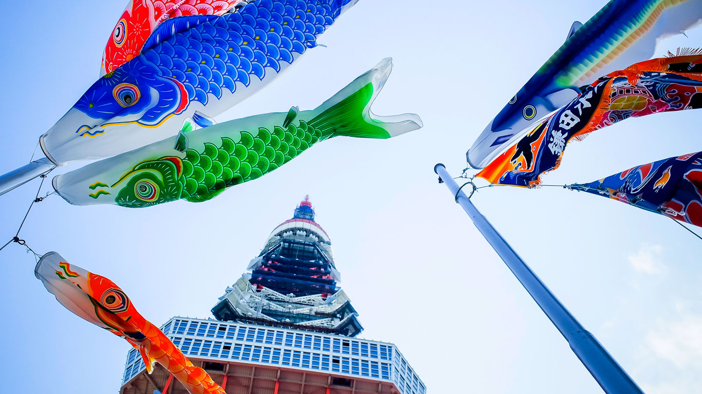

#### 20180506 A wetland in Västmanland, Sweden (© Hans Strand/Getty Images)(Bing United Kingdom)

#### 20180505 【北京大学120周年校庆】中国最有声望的学府之一北京大学日落时的鸟瞰图（© Dong Wenjie/Getty Images）(Bing China)

#### 20180505 Mariachis, San Miguel de Allende, Guanajuato, Mexico (© Holly Wilmeth/Getty Images)(Bing United Kingdom)

#### 20180504 Filming location for Star Wars, Chott el Djerid, Tunisia (© age fotostock/Alamy)(Bing United Kingdom)

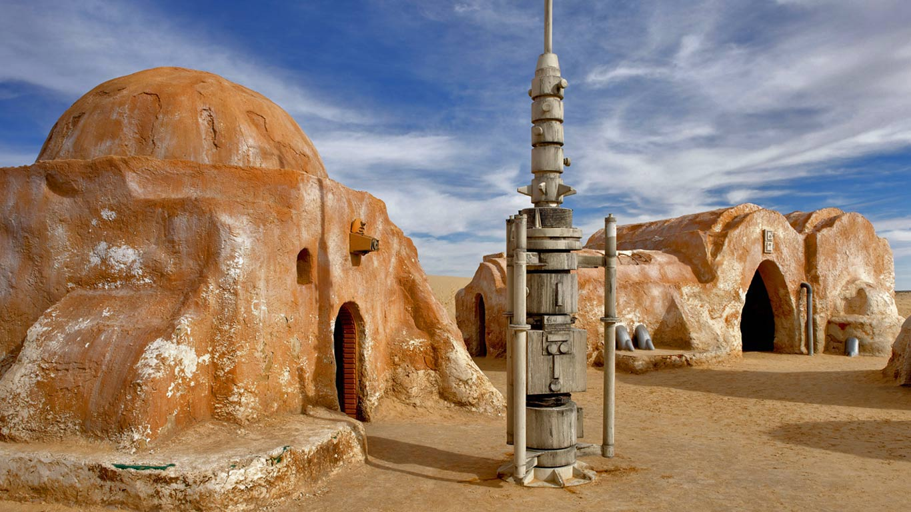

#### 20180504 ｢国会議事堂｣東京, 千代田区 (© Yoichi Tsukioka/Getty Images)(Bing Japan)

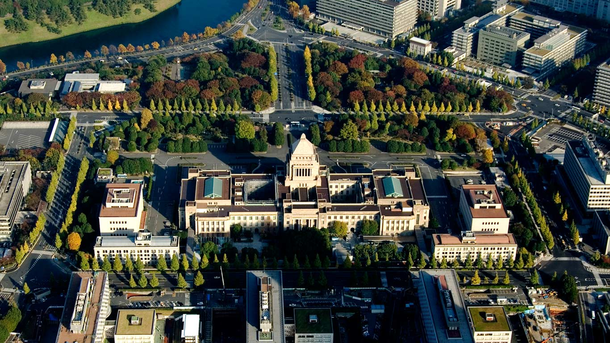

#### 20180503 ｢茶畑と富士山｣静岡, 富士市 (© Norikazu/ShutterStock)(Bing Japan)

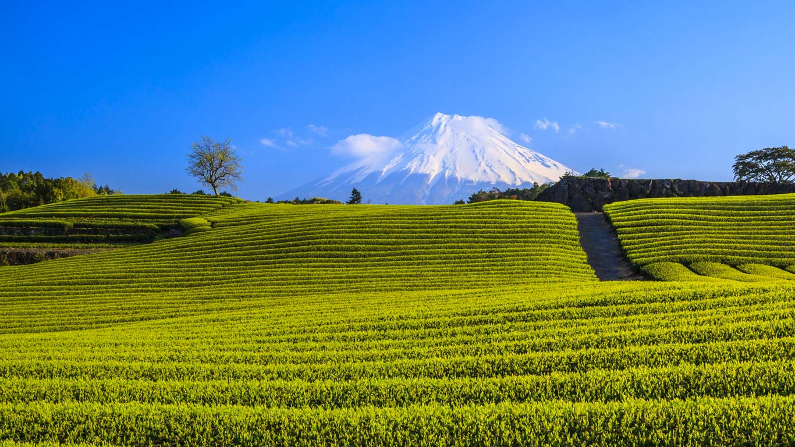

#### 20180503 Tree decorated with amulets called nazars, Goreme National Park, Cappadocia, Turkey (© taratata/Getty Images)(Bing United Kingdom)

#### 20180503 Ein „Großer Fuchs“ (Nymphalis polychloros) sonnt sich auf einem Farnwedel (© Gianpiero Ferrari/Minden Pictures)(Bing Deutschland)

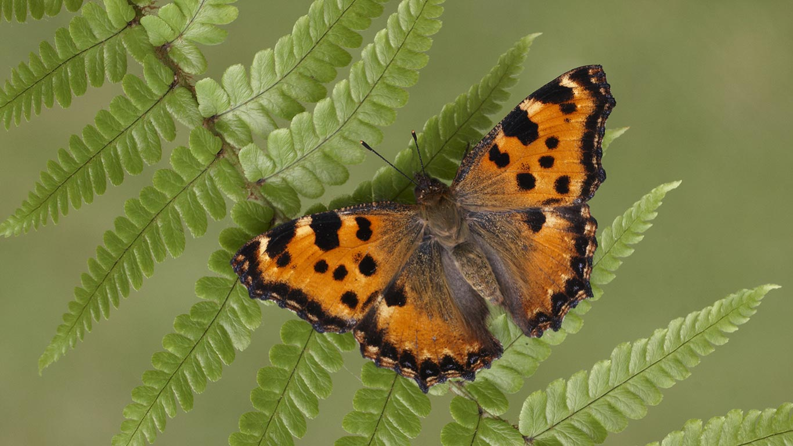

#### 20180502 Ombre d’un brin de muguet (© Roine Magnusson/Getty Images)(Bing France)

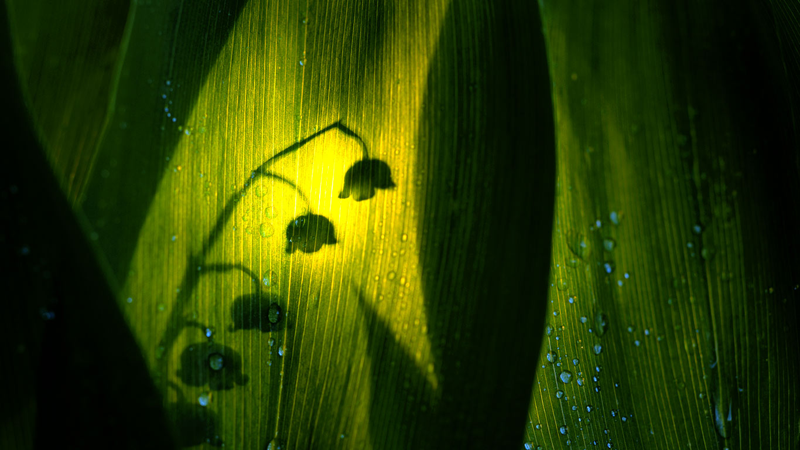

#### 20180502 European barracuda and bluefish circling a bait ball of Atlantic horse mackerel off the shore of the Formigas Islets, Azores (© Jordi Chias/Minden Pictures)(Bing United Kingdom)

#### 20180501 The Sky Over Nine Columns, by artist Heinz Mack, exhibited during the Venice Architecture Biennale, 2014 (© Cahir Davitt/plainpicture)(Bing United Kingdom)

