#### 20180630 Meteor Crater, Arizona, USA (© Michele Falzone/Alamy)(Bing United Kingdom)

#### 20180630 Des spectacteurs devant un film diffusé en plein air, Festival du Film Romantique de Cabourg, France (© Richard Bord/Getty Images Entertainment)(Bing France)

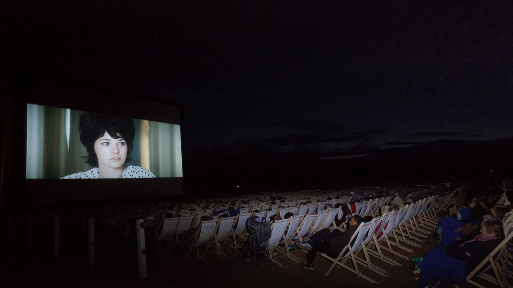

#### 20180629 Photographing the Aurora Borealis at Uttakleiv Beach, Norway (© David Clapp/Getty Images)(Bing United Kingdom)

#### 20180628 Composite photo of the beach in Lignano Sabbiadoro, Italy (© Rudi Sebastian/plainpicture)(Bing United Kingdom)

#### 20180627 Concrete dinosaurs along Route 66, Holbrook, Arizona, USA (© Gary Warnimont/Alamy)(Bing United Kingdom)

#### 20180626 Baobab trees reflecting on the Avenue of the Baobabs in the Menabe region of Madagascar (© Gabrielle Therin-Weise/Getty Images)(Bing United Kingdom)

#### 20180625 Ship tracks over the Pacific Ocean made visible by the clouds that form around the particles in a ship's exhaust (© NASA)(Bing United Kingdom)

#### 20180625 Das Hans Otto Theater in Potsdam, Brandenburg, Deutschland (© travelstock44/Alamy Stock Photo)(Bing Deutschland)

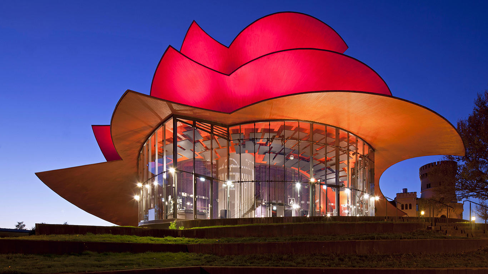

#### 20180624 Minster of St Mary and St Mark, Reichenau Island, Baden-Württemberg, Germany (© Westend61/Getty Images)(Bing United Kingdom)

#### 20180624 I-35W Bridge over the Mississippi with rainbow colors on Pride weekend, Minneapolis (© Riddhish Chakraborty/Getty Images)(Bing United States)

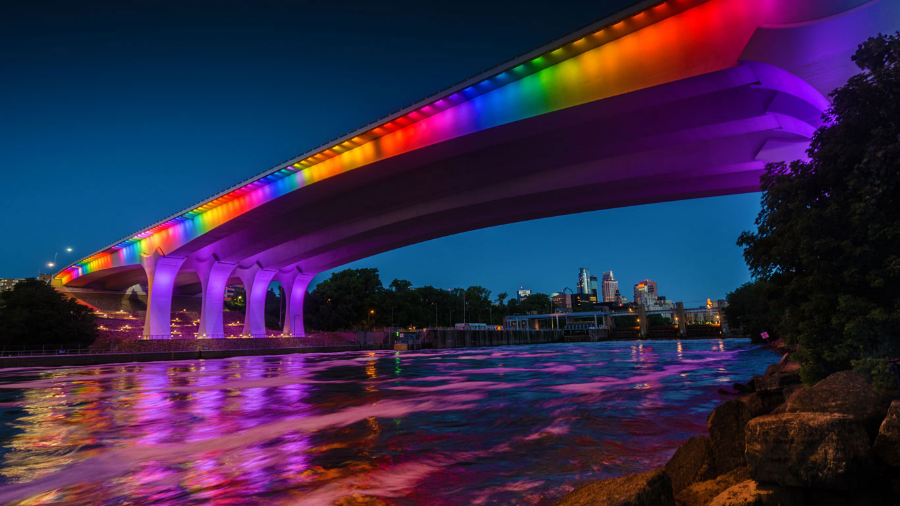

#### 20180623 The Europa sails the Penola Strait, Antarctic Peninsula, Antarctica (© Colin Monteath/Minden Pictures)(Bing United Kingdom)

#### 20180622 【今日夏至】夏至到，荷花开（© Adam Jones/DanitaDelimont.com -- All rights reserved）(Bing China)

#### 20180622 Bring Your Dog to Work Day (© Getty Images)(Bing United Kingdom)

#### 20180622 Décoration datant des années 1920 sur une maison, Andernos-les-Bains, Gironde, France (© J.D Dallet/Age Fotostock)(Bing France)

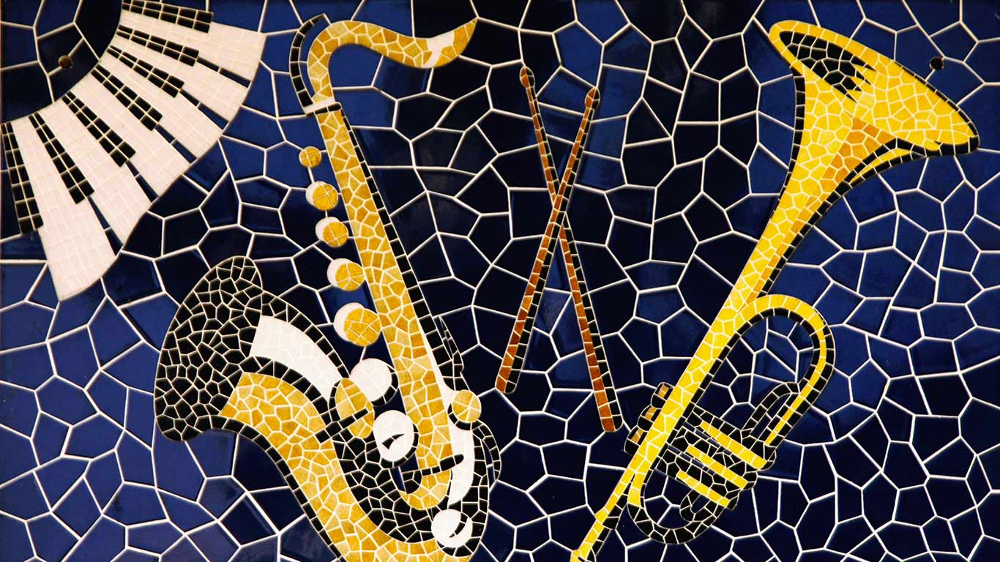

#### 20180621 Yoga practitioners at Red Rocks Amphitheatre in Colorado, USA (© Blaine Harrington III/Alamy)(Bing United Kingdom)

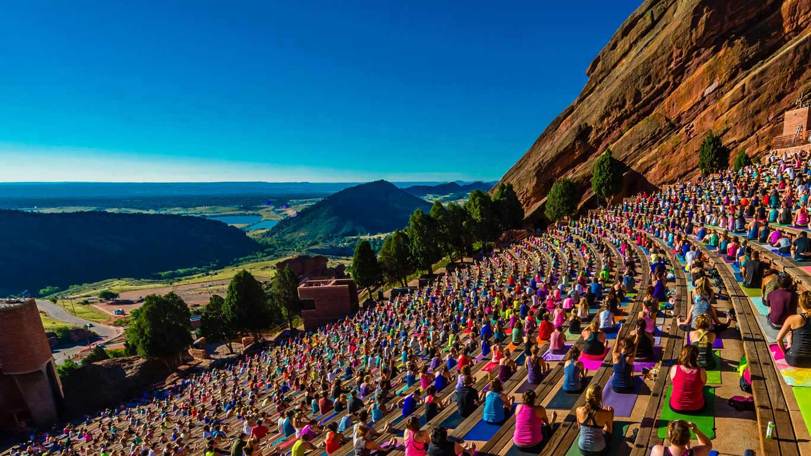

#### 20180620 Refugee migration from 2000-2016 (© Map visualisation: Records from UNHCR/EarthTime visualisation by Carnegie Mellon CREATE Lab)(Bing United Kingdom)

#### 20180619 【今日端午节】参加襄阳龙舟大赛的12只龙舟，中国湖北省襄阳市（© VCG/Getty Images）(Bing China)

#### 20180619 Northern pygmy owl perched on a branch, Cypress Mountain, British Columbia, Canada (© Connor Stefanison/Minden Pictures)(Bing United Kingdom)

#### 20180619 The Alvin Ailey American Dance Theater company performs ‘Revelations’ in New York City (© Rommel Demano/Getty Images)(Bing United States)

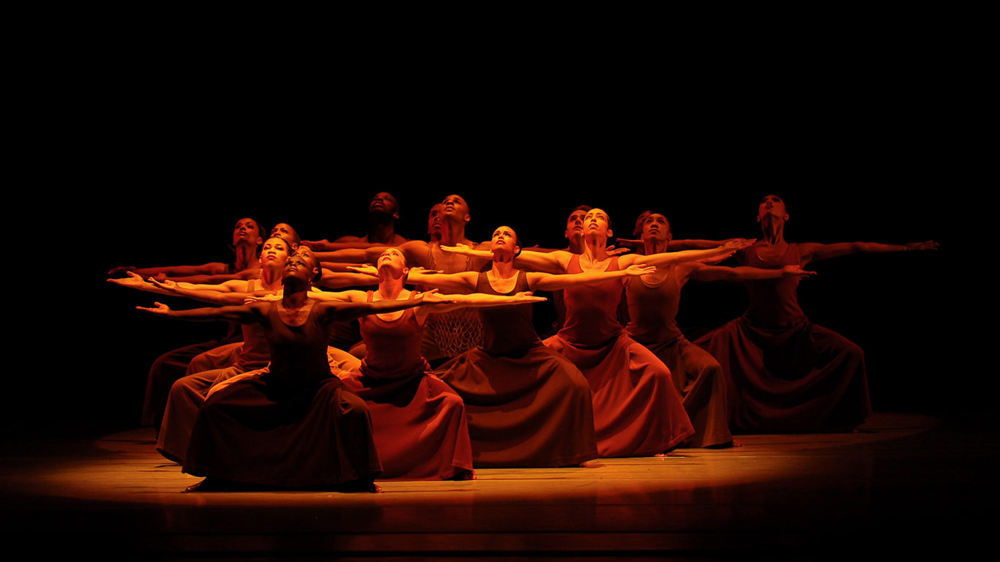

#### 20180618 Fly fishing on the San Miguel River of Colorado, USA (© Whit Richardson/Aurora Photos)(Bing United Kingdom)

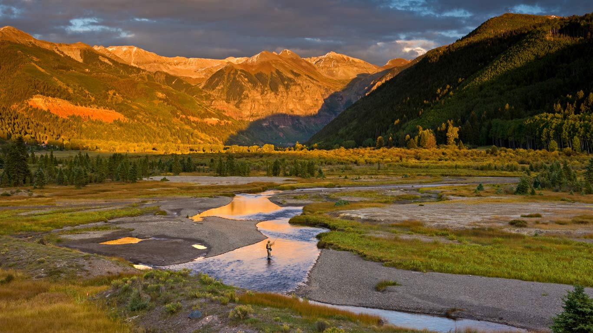

#### 20180618 Stone carving on Nelson's Column at Place Jacques-Cartier in Old Montreal (© Bruce Yuanyue Bi/Getty Images)(Bing Canada)

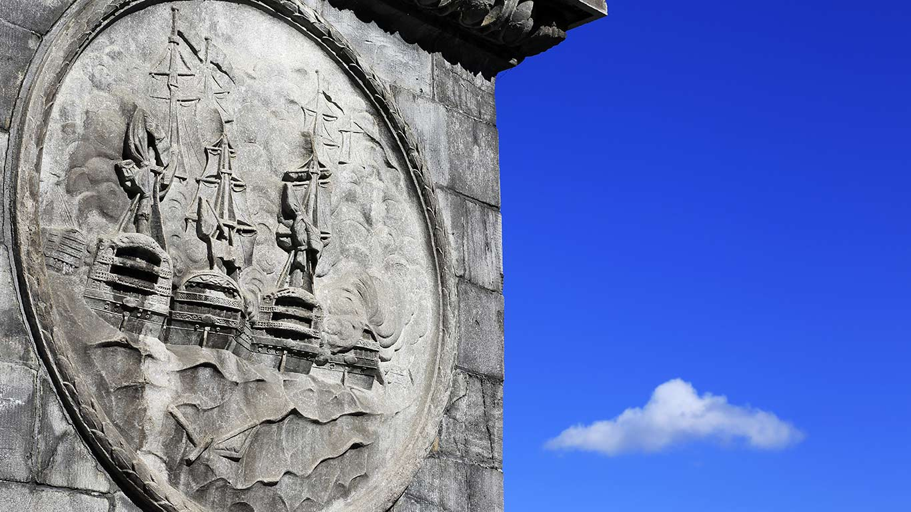

#### 20180617 Ostrich with chicks in Western Cape, South Africa (© Richard Du Toit/Minden Pictures)(Bing United Kingdom)

#### 20180616 Aerial view of surfer catching a wave, Tenerife, Canary Islands, Spain (© Sergio Villalba/Aurora Photos)(Bing United Kingdom)

#### 20180615 Seven-spot ladybird on a mushroom in Arnhem, Netherlands (© Misja Smits/Minden Pictures)(Bing United Kingdom)

#### 20180614 Henningsvær Idrettslag Stadion in the Lofoten archipelago of Norway (© Nick Fox/Alamy)(Bing United Kingdom)

#### 20180614 Flag plaza at Liberty State Park in Jersey City, New Jersey (© Gary Hershorn/Getty Images)(Bing United States)

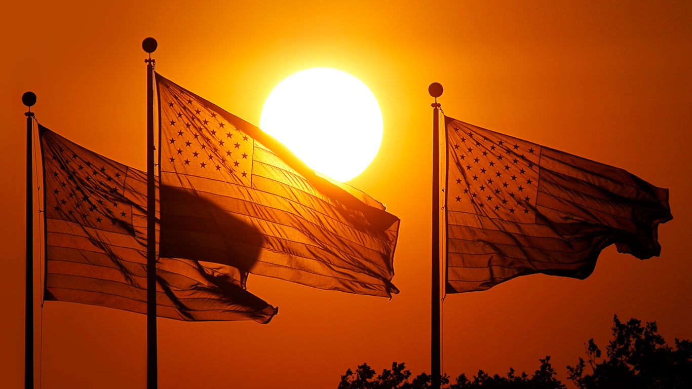

#### 20180614 Rathaus der Hansestadt Lübeck, Schleswig-Holstein, Deutschland (© Yvonne Duffe/Alamy Stock Photo)(Bing Deutschland)

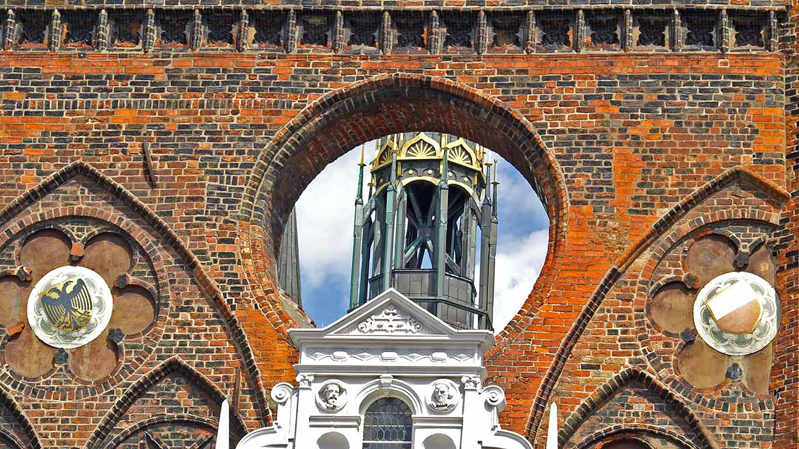

#### 20180613 The Tulip Stairs at Queen’s House in Greenwich, London (© Eurasia Press/Getty Images)(Bing United Kingdom)

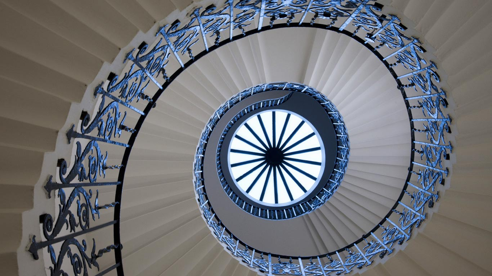

#### 20180613 Colored X-ray photo of dandelion flowers (© Arie van 't Riet/Science Photo Library)(Bing United States)

#### 20180612 ｢コアジサイ｣ (© Tetsuya Tanooka/AFLO/age fotostock)(Bing Japan)

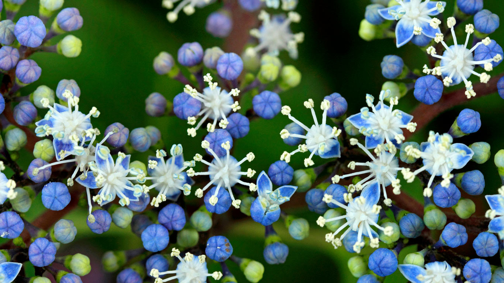

#### 20180612 Kiasma Museum of Contemporary Art in Helsinki, Finland (© Nikolaus Gruenwald/Offset)(Bing United Kingdom)

#### 20180611 Balles de tennis oubliées sur un terrain en terre battue de Roland Garros (© Christophe Ena/Associated Press)(Bing France)

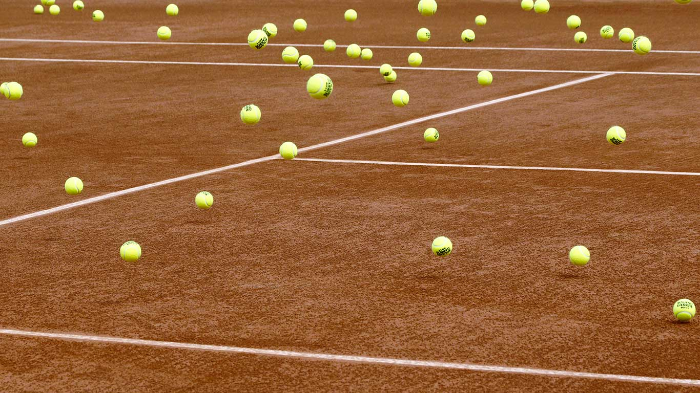

#### 20180611 Great Barrier Reef, Queensland, Australia (© Dick Sweeney/Gallery Stock)(Bing United Kingdom)

#### 20180610 The Pena Palace in Sintra, Portugal (© Andre Vicente Goncalves/Alamy)(Bing United Kingdom)

#### 20180609 Yarn bombing in the village of Gurnard on the Isle of Wight (© Kuki Waterstone/Alamy)(Bing United Kingdom)

#### 20180608 Green sea turtle, Maui, Hawaii, USA (© David Fleetham/Visuals Unlimited, Inc.)(Bing United Kingdom)

#### 20180608 Waschbären-Nachwuchs in einer Baumhöhle (© stanley45/Getty Images)(Bing Deutschland)

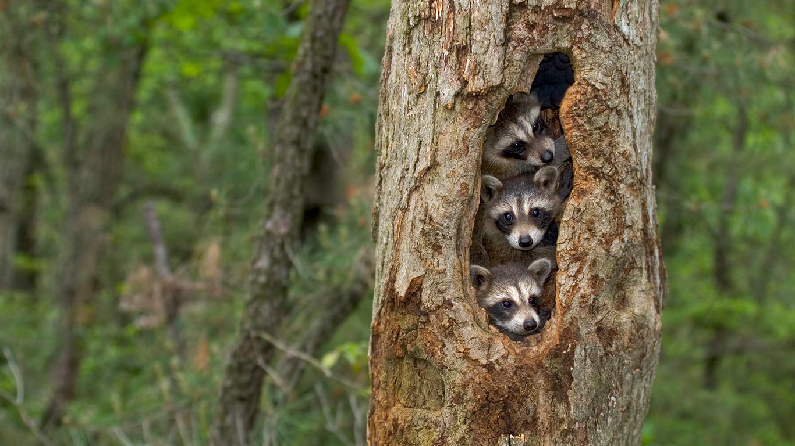

#### 20180607 Humpback whale pod in Lynn Canal in the Inside Passage of Alaska, USA (© John Hyde/plainpicture)(Bing United Kingdom)

#### 20180607 ｢田んぼの中のアイガモ｣インドネシア, バリ島 (© Gualtiero Boffi/Shutterstock)(Bing Japan)

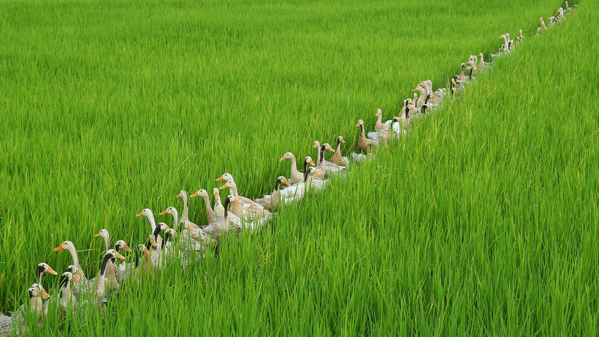

#### 20180606 The seaside village of Staithes in North Yorkshire (© Loop Images/Richard Burdon)(Bing United Kingdom)

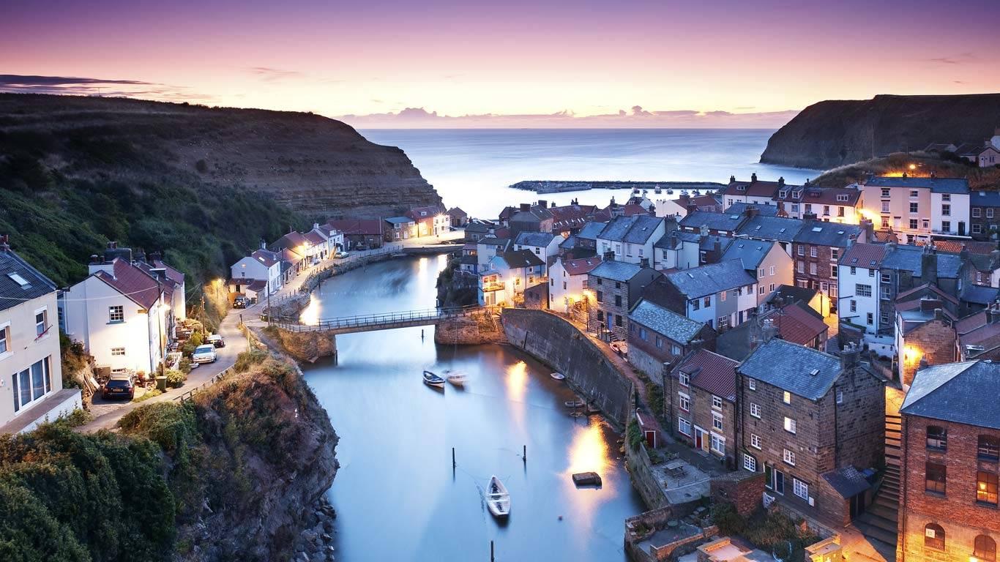

#### 20180606 Customers arriving at the Fly-In Drive-in Theater in Wall Township, New Jersey (© Martha Holmes/Time Life Pictures/Getty Images)(Bing United States)

#### 20180606 Train passing through Banff National Park, Banff, Alta. (© Gallery Stock)(Bing Canada)

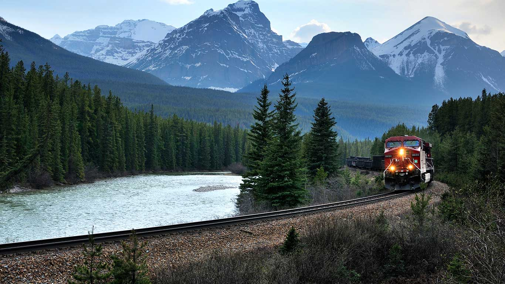

#### 20180605 Hot air balloon over Auburn, Washington, USA (© Taliesin Black-Brown and Ben Cowan/Nimia)(Bing United Kingdom)

#### 20180604 'PJ the Port Jackson Shark' light sculpture at Taronga Zoo in Sydney, Australia (© Wendell Teodoro/REX/Shutterstock)(Bing United Kingdom)

#### 20180603 The Sahara desert photographed from space via the Sally Ride EarthKAM (© NASA)(Bing United Kingdom)

#### 20180602 【六一儿童节】孩子们在泳池嬉戏，中国九江（© Visual China Group/Getty）(Bing China)

#### 20180602 Runners on South Kaibab Trail in the Grand Canyon, Arizona, USA (© Jason J. Hatfield/Tandem Stills + Motion)(Bing United Kingdom)

#### 20180602 River flowing over rocks at twilight, Coteau-du-Lac, Que. (© Patrick Di Fruscia/Visuals Unlimited)(Bing Canada)

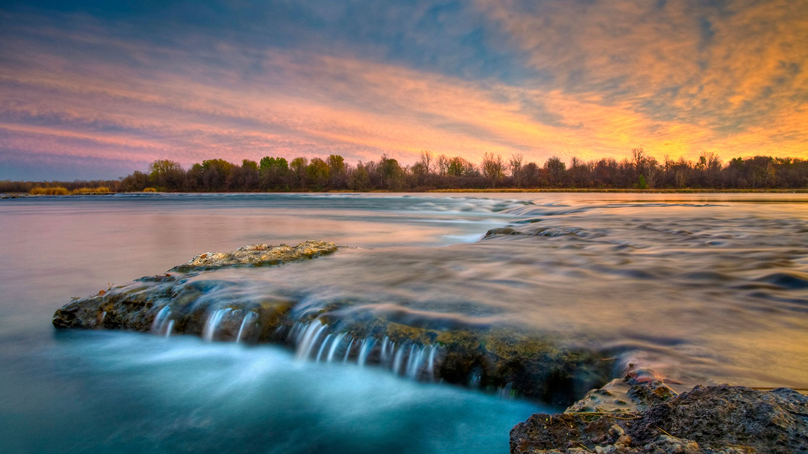

#### 20180601 Canoes in Apia Harbour at Apia, Samoa (© Danita Delimont/Getty Images)(Bing United Kingdom)

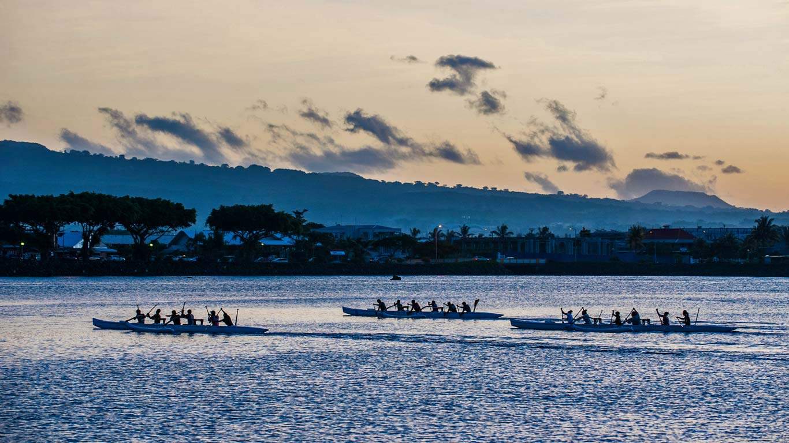

